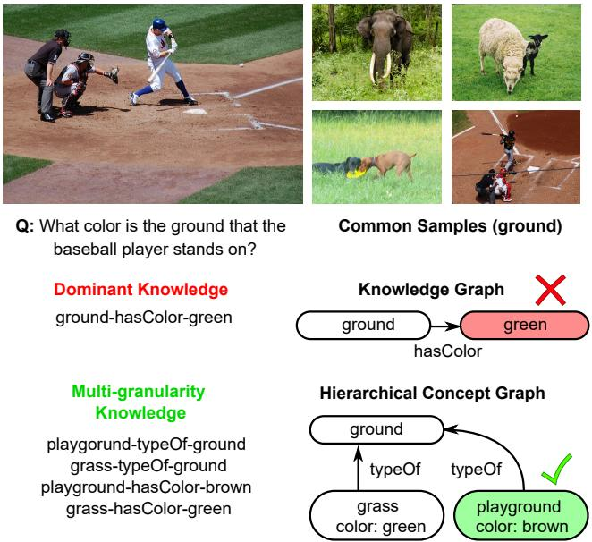
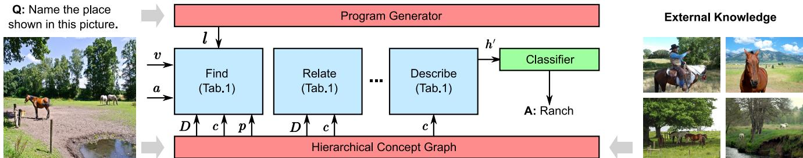
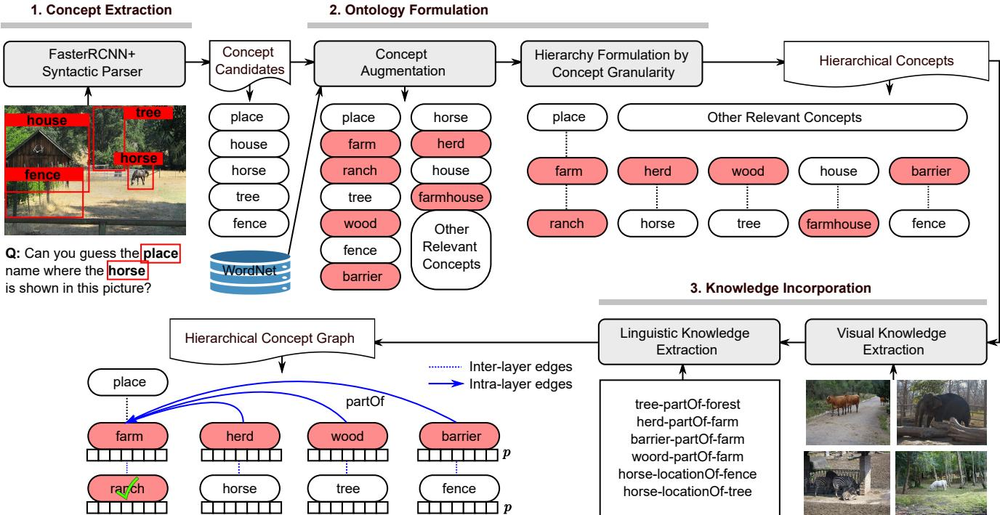
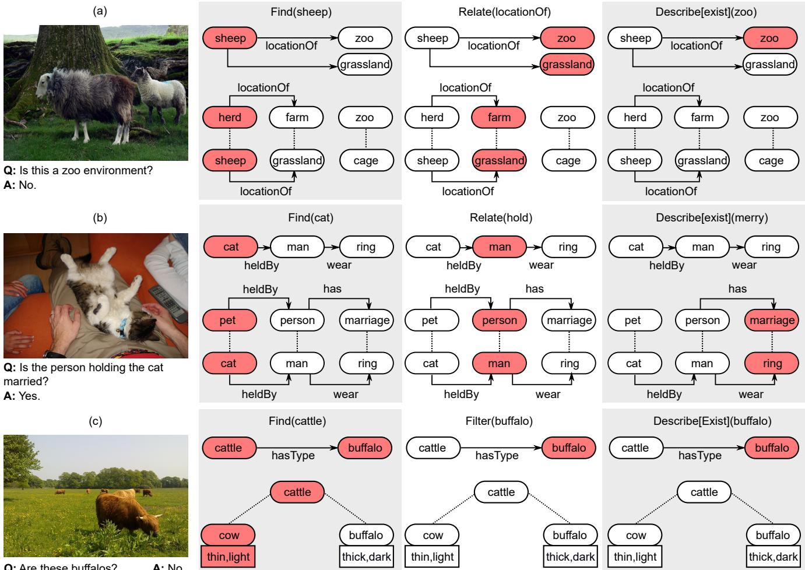

# Toward Multi-Granularity Decision-Making: Explicit Visual Reasoning with Hierarchical Knowledge

Yifeng Zhang, Shi Chen, Qi Zhao

University of Minnesota

{zhan6987, chen4595}@umn.edu, qzhao@cs.umn.edu

## Abstract

Answering visual questions requires the ability to parse visual observations and correlate them with a variety of knowledge. Existing visual question answering (VQA) models either pay little attention to the role of knowledge or do not take into account the granularity of knowledge (e.g., attaching the color of “grassland” to “ground”). They have yet to develop the capability of modeling knowledge of multiple granularity, and are also vulnerable to spurious data biases. To fill the gap, this paper makes progresses from two distinct perspectives: (1) It presents a Hierarchical Concept Graph (HCG) that discriminates and associates multi-granularity concepts with a multilayered hierarchical structure, aligning visual observations with knowledge across different levels to alleviate data biases. (2) To facilitate a comprehensive understanding of how knowledge contributes throughout the decision-making process, we further propose an interpretable Hierarchical Concept Neural Module Network (HCNMN). It explicitly propagates multi-granularity knowledge across the hierarchical structure and incorporates them with a sequence of reasoning steps, providing a transparent interface to elaborate on the integration of observations and knowledge. Through extensive experiments on multiple challenging datasets (i.e., GQA,VQA,FVQA,OK-VQA), we demonstrate the effectiveness of our method in answering questions in different scenarios. Our code is available at https://github.com/SuperJohnZhang/HCNMN.

## 1. Introduction

The ability to reason about knowledge is a fundamental type of generally intelligent behavior [35]. A long-standing goal of artificial intelligence is to develop intelligent systems that can answer a variety of questions with relevant knowledge. Visual question answering [6] has gained considerable attention in recent years. With broad coverage of problems with different types, e.g., factual reasoning [11], commonsense reasoning [55], and knowledge-driven reasoning [44, 30], it offers a practical platform for examining models’ reasoning capability.

A series of progress has been made on improving the knowledge grounding [4, 17, 51, 18] and enriching the knowledge pools [46, 56] for VQA models. While showing the effectiveness of incorporating external knowledge, they commonly struggle with the granularity of concepts and lack the capability of identifying relevant knowledge in diverse contexts. As a result, they fall short of generalizing to out-of-distribution problems [25] and justifying models’ underlying decision-making process. For instance, as illustrated in Figure 1, the concept “grassland” defines a specific type of “ground” that consists of “grass”, while “ground” refers to a more general concept that includes “grassland”, “playground” etc. Existing models have difficulty in discriminating these multi-granularity concepts, and falsely bind the dominant property in the dataset (e.g., hasProperty(green)) to a dominant concept (e.g., ground) despite the discrepancies between their granularity. The mismatched property of a general concept (e.g., ground hasProperty-green) distracts the decision-making process of its non-dominant subtypes (e.g., identifying the color of the playground).

The mismatch between multi-granularity concepts rarely occurs in human intelligence. When interacting with the complexity of the visual world, humans leverage a hierarchical structure to associate each object with concepts of different granularity. Such a representation is critical for separating different knowledge facts to their designated granularity, and unifying general knowledge with specific ones for a context-rich and bias-resistant decision-making process. Aiming to enhance models’ reasoning capability among diverse sets of knowledge, in this paper, we propose (1) a Hierarchical Concept Graph (HCG) to incorporate the granularity of concepts and (2) a Hierarchical Concept Neural Module Network (HCNMN) to model the integration between observations and knowledge throughout the reasoning process.

With an overarching goal of endowing VQA models with the ability to reason with knowledge concepts in diverse contexts, our HCG leverages a multi-layered structure to factorize an object into multiple concepts across distinct granularity levels. More universal knowledge (e.g., ground) is represented in higher layers, while more specific knowledge (e.g., grassland, playground) is allocated in the lower layers. In addition to the structural organization, our method also enables the propagation of knowledge, e.g., from a general category to specific concepts, and bridges different concepts based on their categorical association (e.g., grass is a “typeOf” ground).

  
Figure 1. An illustrative example of knowledge-based VQA. Dominant observations in traditional knowledge graphs introduce biased knowledge. The proposed graph representation addresses the issue by discriminating multi-granularity knowledge with a hierarchical structure.

To develop a more comprehensive understanding of the interplay between knowledge and the reasoning process, we further propose a hierarchy-aware neural module network (HCNMN) that explicitly reasons over different granularity layers to formulate the decision-making process. In particular, we design a collection of neural modules that consider the topology of multi-layered structures and progressively accumulate multi-granularity knowledge. The method not only provides a transparent interface to elaborate on the roles of knowledge among different reasoning steps, but also exhibits higher efficiency in distilling key information from knowledge facts (e.g., factual knowledge provided in FVQA [44]).

In sum, our major contributions are as follows:

• We propose a hierarchical representation (HCG) that differentiates knowledge of different granularity with a multi-layered structure, and supports visual reasoning with general and fine-grained knowledge of diverse concepts.

• We propose a novel hierarchy-aware neural module network (HCNMN) that tightly integrates knowledge and the decision-making process. It concurrently reasons over different layers to accumulate multigranularity knowledge, and also provides an interpretable interface for justifying its contributions in different reasoning steps.

• We carry out extensive experiments on various VQA datasets, demonstrating the effectiveness, generalizability, and interpretability of the proposed methods. Our analyses also shed light on the key components (i.e., multi-granularity knowledge) for generalizing VQA methods to broader scenarios.

## 2. Related Works

Our work is most relevant to previous efforts on VQA, knowledge for visual reasoning, and different graph representations.

## 2.1. Visual Question Answering

Visual Question Answering [6] centers around joint reasoning on both the observations (i.e., image-question pairs) and relevant knowledge. Previous studies advance VQA research with progress in both data collection and computational modeling. A collection of datasets have been proposed, which cover a broad range of reasoning scenarios including factual reasoning [6, 11, 20], commonsense reasoning [55], abductive reasoning [15], knowledge-driven reasoning [30, 44], and reasoning with out-of-distribution data [3]. These data efforts establish the foundation for the development of computational methods that advance VQA models from different perspectives, including multi-modal fusion [6], attention mechanism [4, 9, 23, 27, 53], structured inference [1, 5, 7, 16, 17, 18, 19, 22, 31, 36, 51], and visionand-language pretraining [10, 38, 39, 46]. While demonstrating promising performance, these approaches pay little attention to the incorporation of knowledge among different granularity and how it contributes to the decision-making process. In this work, we identify the importance of the tight integration of knowledge and reasoning, and advance existing methods with both a new knowledge representation and a knowledge-driven reasoning model.

## 2.2. Knowledge for Visual Reasoning

Aiming to accommodate reasoning over broader scenarios, a series of studies construct knowledge-driven VQA datasets [30, 44] and models [2, 10, 12, 13, 14, 21, 26, 29,

  
Figure 2. Overview of the proposed Hierarchical Concept Neural Module Network. The framework follows the general neural module networks, with questions being parsed into a set of hierarchy-aware concept-based neural modules to progressively attend concepts in the Hierarchical Concept Graph. Specifically, the graph is first constructed by accessing visual-linguistic evidence (v, l) and multi-source external knowledge. A list of parsed hierarchy-aware neural modules then utilize the hierarchy ontology information D and property vectors p to ground relevant concepts c for question answering.

30, 35, 46, 47, 50, 56] that incorporates external knowledge from different sources. Early works [2, 12, 13, 21, 29, 30] represent knowledge as a set of preprocessed embeddings, and implicitly incorporate them as additional visual and linguistic inputs. Later on, several studies [10, 12, 28, 41, 42, 43, 45, 46, 54] focus on capturing high-level contexts encoded in the knowledge, e.g. relationships between objects, and propose to represent knowledge with a graph structure of detected objects. They leverage its topology to guide the shift of visual attention and explore how models utilize the knowledge during visual reasoning. While showing the usefulness of external knowledge for visual reasoning, these approaches do not take into account the granularity of knowledge concepts. As a result, they fall short of differentiating knowledge facts at different levels of abstraction, and can be misled by data biases caused by the discrepancies of granularity (e.g., attaching a specific property to a general concept). Differently, our approach leverages a hierarchical concept graph to characterize different concepts based on their granularity, and adaptively correlates them with a novel neural module network to model the propagation of information across different granularity.

## 2.3. Graph Representation

Graph representation is commonly used in visual tasks to strengthen scene understanding (i.e., scene graph [40, 48, 49]) or take into account diverse knowledge (i.e., knowledge graph [26, 46, 56]). Existing approaches can be generally categorized into two groups based on their focuses on (1) data augmentation, re-sampling or enrichment [52, 56], and (2) disentangling biased representations with sophisticated learning recipes. Despite introducing abundant information for visual understanding, they pay little attention to the granularity of concepts, and are vulnerable to the discrepancies between detected concepts and knowledge facts (e.g., bind/propagate finer-grained facts to a general concept). To tackle the issue, our approach utilizes a multilayered hierarchical structure to arrange multi-granularity concepts in different layers. By defining different types of edges (i.e., inter-layer edges, intra-layer edges) to correlate multi-granularity concepts, it overcomes the issues of data biases and enables enhanced reasoning capability.

## 3. Methodology

Visual reasoning would benefit from the capability of coupling observations (i.e., image-question pairs) with relevant knowledge in various contexts. This section presents our integral framework to reason with knowledge of different granularity and justify its roles throughout the decisionmaking process. As illustrated in Figure 2, our method consists of two key components: (1) A novel graph representation that discriminates knowledge of different granularity with a hierarchical structure (Section 3.1). (2) A collection of concept-based neural modules that explicitly model the knowledge propagation over HCG and elaborate diverse knowledge contributes to reasoning (Section 3.2).

## 3.1. Constructing Hierarchical Concept Graph

To facilitate enhanced knowledge reasoning, we propose a Hierarchical Concept Graph (i.e., HCG) to encode multi-granularity knowledge. The principal idea behind our method is to represent a visual or linguistic entity (e.g., the horse in the image, Figure 3) as a collection of concepts (i.e., horse, herd, Figure 3), which are allocated in different layers based on their granularity. With discriminative knowledge from diverse granularity levels (e.g., horselocationOf-grass, herd-partOf-farm, Figure 3), HCG provides richer contexts to improve the performance and generalizability of VQA models.

## 3.1.1 Graph Definition

Our Hierarchical Concept Graph is designed to encapsulate various concepts from observations with those covered in external knowledge in a hierarchical structure, where concepts of different granularity are assigned to different layers. It is adaptively constructed for each visual question to enable accurate reasoning over relevant information.

  
Figure 3. An illustrative example of the generation for HCG. The HCG is constructed by three steps: concept selection, ontology formulation and knowledge initialization. Blue dotted and solid lines in the resulting HCG demonstrate the attention shift path along intra-layer and inter-layer relationships throughout the reasoning process, respectively. Major augmented concepts relevant to visual-linguistic evidence are highlighted in red.

Specifically, HCG is a multi-layered concept-based knowledge representation that correlates concepts in different granularity. It extracts the categorical information from external knowledge to arrange concepts into different layers, and augments them with their key characteristics (i.e., properties and their relationships with each other). The graph consists of three elements, the nodes (concepts), edges (cross-concept relationships), and property vectors (concept attributes). Each node denotes a concept and is placed in the designated layer according to its granularity. As shown in Figure 3, the more general the concept (e.g. place), the higher the layer. Two types of edges, i.e., the intra-layer and the inter-layer edges, are utilized to connect concepts in the same and different granularity layers, respectively. Intra-layer edges leverage a wide range of relationships (e.g. locationOf, partOf, ride) to encode the correlation of concepts at the same layer, while interlayer edges focus on the “typeOf” relationship to encapsulate the interaction across different layers. Both edges are unweighted to normalize the relationships, as knowledge facts have diverse frequencies in external databases. In addition to the hierarchical ontology, HCG also annotates each concept with a property vector to provide rich humanunderstandable contexts. The placeholders in the property vector are pre-defined to describe the distinguishable attributes of corresponding concepts. Such differentiating attributes (e.g. color, shape) are different across granularity layers, describing concepts at different levels of detail.

## 3.1.2 Graph Generation

To enable tight integration of concepts from observations and knowledge of different sources (WordNet [33], Wiki-Text [32], ConceptNet [26], Visual Genome [24]), we propose to automatically generate our graph representation with a three-step paradigm: (1) concept extraction that determines the key relevant concepts from observations, (2) ontology formulation that separates relevant concepts and their parent/child concepts across different granularity layers, and (3) knowledge incorporation that properly attaches differentiating properties/relationships to multi-granularity concepts based on their levels of detail.

Concept extraction selects semantically meaningful concepts from the image-question pairs for visual reasoning. As shown in Figure 3, we leverage an object detector [34] to detect semantic objects (i.e. fence, tree, house, horse), and a syntactic parser [37] to obtain the corresponding POS tagging, which jointly considers both the visual and linguistic evidence. The visual and linguistic concepts are merged together to form the concept pool. The detected concepts account for a portion of nodes in the HCG, and also serve as the searching keys to extract relevant concepts from external knowledge to construct the remaining nodes (Discussed in the next step). To avoid redundancy in the knowledge graph, we remove the synonyms and less frequent concepts from the pool.

Ontology formulation incorporates the categorical information of the extracted concepts based on their positions in the synsets graph of WordNet to formulate the hierarchical ontology $( i . e .$ , inter-layer edges) of the graph. As shown in Figure 3, to differentiate concepts based on their levels of granularity, we retrieve the ancestors and descendants (i.e. hypercategories, subcategories) of extracted concepts (i.e., place, house, horse, tree, fence) from the external knowledge, and link them based through inter-layer edges $( i . e .$ typeOf) to form several columns of concept. Next, to organize concepts with the same granularity in the same layer, we align those columns in the vertical direction according to their depth attribute from external sources (i.e., WordNet). The hierarchical ontology is stored as affinity matrix $D _ { 0 }$ whose entry $d _ { i j } ^ { ( 0 ) }$ denote the existence of “typeOf” relationships between concept i and j.

Knowledge incorporation further enriches a hierarchy of multi-granularity concepts with visual-linguistic features (feature embeddings of concepts), cross-concept relationships (intra-layer edges), and properties (property vectors). It is noteworthy that both the visual-linguistic evidence and external knowledge are utilized to enhance the reliability of the knowledge. Specifically, we follow the procedure in MaveX [46] to fill the node with rich visual-linguistic features c and add intra-layer relationships. The intra-layer connectivity is represented as a list of affinity matrix $\{ D _ { i } \}$ where i is the index of the corresponding layer. To ease the burden of indexing concepts across multiple layers, we include all the multi-granularity nodes in the affinity matrix, but leave the entries that denote the connectivity of other layers as 0. In addition to the feature embeddings and cross-concept relationships, to provide each concept with a human-understandable property description, we map the visual features into a set of classifications (e.g. color, shape) $\pmb { p } _ { v } .$ , and combine them with prior property description $\pmb { p _ { e } }$ from external knowledge to produce a property vector p:

$$
\pmb { p } = r _ { v } \pmb { p } _ { v } + r _ { e } \pmb { p } _ { e }\tag{1}
$$

where $r _ { v }$ and $r _ { e }$ are pre-defined or trainable parameters that measure the confidence of the property. To address concepts’ differences in granularity, the attached properties for each concept are carefully selected by referring to the definitions of the corresponding concepts from Wikitext-2 [32], $e . g .$ , properties of size, color, nationality are attached for concept “elephant”, based on the fact “An elephant is a large gray animal native to Asia and Africa”.

## 3.2. Reasoning with Hierarchical Concept Graph

Previous interpretable reasoning models [5, 18, 36, 56] decompose the inference process into a sequence of reasoning steps, and leverage different modules to model the dynamics of the decision-making procedure. Nevertheless, little attention is paid to the roles of knowledge throughout the reasoning process. With the proposed graph representation encoding knowledge of different granularity, we further propose a novel interpretable model HCNMN that explicitly integrates knowledge among diverse reasoning steps, and justifies how it contributes to reasoning. The essence of our model is to model the propagation of knowledge across different levels of granularity and reasoning steps. We design a novel attention mechanism that operates on both the interlayer edges and intra-layer edges of our hierarchical graph, and a neural module network to integrate the knowledge.

The rationale behind our inter-layer attention shift is to share selected knowledge of general concepts $( e . g .$ , barrierpartOf-farm, Figure 3) downwards with finer-grained concepts (e.g., fence, ranch). Specifically, our model determines what knowledge needs to be shared by taking into account both the knowledge contexts and graph topology, mapping the production of attended concept features a ◦ c and graph affinity matrix $\mathbf { \nabla } D _ { i }$ to obtain an attention mask $r _ { i }$

$$
\pmb { r } _ { i } = M L P ( \pmb { a } \circ c \pmb { D } _ { i } ) ,\tag{2}
$$

where ◦ is the Hadamard multiplication and i denotes the layer index of concepts. Next, the masked attention of general concepts is propagated downwards through the interlayer to aid the reasoning in lower layers, with a decay rate t to discount its significance across multiple layers:

$$
\pmb { a } _ { i } ^ { \prime } = \pmb { a } _ { i } + \sum _ { j = 1 } ^ { i } ( t { \pmb { D } } _ { 0 } ) ^ { j } { \pmb { r } } _ { j } \circ \pmb { a } _ { j } ,\tag{3}
$$

where $D _ { 0 } , { \pmb a } _ { i } , { \pmb a } _ { i } ^ { \prime }$ denotes the affinity matrix of inter-layer edges, current attention distribution at lower layer i, and the final attention distribution after propagation. It is noteworthy that an inter-layer attention propagation is conducted at the end of every reasoning operation that refers to the multigranularity knowledge of HCG $( i . e .$ , Find, Relate, Filter). Such a design enables our model to consider the interactions between concepts at different granularity layers, and augments visual reasoning with both general commonsense knowledge and fine-grained characteristics of concepts.

To complement the inter-layer attention shift, intra-layer attention concentrates on knowledge with identical granularity. Since each layer in our proposed HCG has a plain structure, we adopt modules of NKM [56] to perform reasoning operations, except for the final step when the concepts from different layers are combined. Specifically, we aggregate all the attended multi-granularity concepts to produce a feature embedding $c _ { f i n a l }$ for answer projection,

$$
c _ { f i n a l } = \sum _ { i = 1 } ^ { n } { a _ { i } \circ c _ { i } } ,\tag{4}
$$

where ${ \mathbf { } } a _ { i } , ~ { \mathbf { } } c _ { i }$ are the attention and features of concepts at i-th layer, respectively.

By enabling the attention shift across inter-layer and intra-layer edges, our module-based approach is capable of performing reasoning steps concurrently over different layers, jointly considering knowledge with multiple granularity. The hierarchical attention mechanism not only enhances the performance of knowledge reasoning, but also provides a transparent platform to interpret its decisionmaking process by visualizing the dynamics of attended multi-granularity concepts (Section 4.4).

## 4. Experiments and Analyses

In this section, we present the implementation details (Section 4.1), and demonstrate the usefulness of our method in answering various types of visual questions across multiple datasets (Section 4.2). Besides showing the advantages in improving model performance, we further perform extensive ablation studies (Section 4.3) and analysis (Section 4.4) to shed light on the contributions of various components and the interplay between knowledge and reasoning. We also provide additional details on our architectural design and hyperparmeter learningin the supplementary materials.

## 4.1. Implementation Details

Datasets. For a comprehensive evaluation of the proposed method, we carry out experiments on four popular VQA datasets. The GQA [20] dataset focuses on compositional reasoning with 1.7M structured questions. The VQA v2 [6] dataset is a general VQA dataset that contains 1.1M questions, each annotated with 10 ground-truth answers. The OK-VQA [30] and FVQA [44] datasets are specifically designed for knowledge-based VQA, and require commonsense knowledge beyond the visual-linguistic inputs for answering the questions. In particular, FVQA offers ground-truth factual knowledge that can be used to support the training and evaluation of knowledge-based VQA models. With these complementary datasets, we are able to evaluate models from different perspectives, including reasoning performance, generalizability, and interpretability.

Training. Our training paradigm consists of two stages: first, multi-source knowledge is converted into HCGs for each question by mapping the knowledge with visuallinguistic evidence. Later on, the knowledge is trained along with hierarchy-aware concept-based modules under the conventional VQA setting.

Model specification. For our proposed HCNMN model, each program parameter is represented as a weighted embedding with dimensionality $d _ { p } = 3 0 0$ . The dimensions of visual features v, concept features c, hidden state and final output of the modular network are also set to 300. The hyperparameters $r _ { v } , r _ { e }$ that control external knowledge confidence are set to 0.6 and 0.4, respectively. The inter-layer information decay rate t is set to 0.3 for best performance. The number of graph layers k is set to 3 to simplify the structure of HCG.

<table><tr><td>Method</td><td>OK-VQA</td><td>FVQA</td><td>GQA Test</td><td>VQA Test</td></tr><tr><td>XNM [36]</td><td>25.61</td><td>63.74</td><td>59.07</td><td>67.10</td></tr><tr><td>XNM+SKG</td><td>26.03</td><td>64.13</td><td>59.42</td><td>67.79</td></tr><tr><td>XNM+UKG</td><td>26.14</td><td>64.25</td><td>59.47</td><td>67.96</td></tr><tr><td>XNM+HCG</td><td>27.42</td><td>65.16</td><td>59.61</td><td>68.35</td></tr><tr><td>δ(HCG-UKG)</td><td>+1.28</td><td>+0.91</td><td>+0.14</td><td>+0.39</td></tr><tr><td>NKM [56]</td><td>25.67</td><td>63.78</td><td>59.16</td><td>67.23</td></tr><tr><td>NKM+SKG</td><td>29.28</td><td>65.47</td><td>58.41</td><td>67.73</td></tr><tr><td>NKM+UKG</td><td>31.04</td><td>67.19</td><td>58.48</td><td>67.96</td></tr><tr><td>NKM+HCG</td><td>32.67</td><td>67.58</td><td>58.56</td><td>68.49</td></tr><tr><td>δ(HCG-UKG)</td><td>+1.63</td><td>+0.39</td><td>+0.08</td><td>+0.53</td></tr><tr><td>UnifER [14]</td><td>42.13</td><td>66.83</td><td>61.71</td><td>69.47</td></tr><tr><td>UnifER+SKG</td><td>42.16</td><td>66.89</td><td>61.74</td><td>69.57</td></tr><tr><td>UnifER+UKG</td><td>42.15</td><td>66.96</td><td>61.80</td><td>69.93</td></tr><tr><td>UnifER+HCG</td><td>42.58</td><td>67.35</td><td>61.89</td><td>70.04</td></tr><tr><td>δ(HCG-UKG)</td><td>+0.43</td><td>+0.39</td><td>+0.09</td><td>+0.11</td></tr><tr><td>MCAN [53]</td><td>41.78</td><td>64.47</td><td>61.79</td><td>70.90</td></tr><tr><td>MCAN + SKG</td><td>41.91</td><td>64.53</td><td>61.77</td><td>70.92</td></tr><tr><td>MCAN + UKG</td><td>42.13</td><td>67.56</td><td>61.84</td><td>71.04</td></tr><tr><td>MCAN + HCG</td><td>42.61</td><td>64.85</td><td>61.86</td><td>71.27</td></tr><tr><td>δ(HCG-UKG)</td><td>+0.48</td><td>-2.71</td><td>+0.02</td><td>+0.23</td></tr><tr><td>HCNMN</td><td>33.25</td><td>67.91</td><td>58.43</td><td>68.71</td></tr><tr><td>HCNMN+SKG</td><td>33.41</td><td>68.24</td><td>58.96</td><td>69.30</td></tr><tr><td>HCNMN+UKG</td><td>34.89</td><td>68.64</td><td>60.10</td><td>69.75</td></tr><tr><td>HCNMN+HCG</td><td>36.74</td><td>69.43</td><td>60.89</td><td>70.34</td></tr><tr><td>δ(HCG-UKG)</td><td>+1.85</td><td>+0.79</td><td>+0.79</td><td>+0.59</td></tr></table>

Table 1. Comparison of how different graph representations support different models on OK-VQA, FVQA, GQA, and VQA. HCG stands for Hierarchical Concept Graph, SKG stands for single-layer knowledge graph, UKG stands for unbiased knowledge graph generated from [40]. δ(HCG-UKG) denotes the margin between HCG and UKG with the same reasoning model.

## 4.2. Quantitative Evaluation

To demonstrate the usefulness of our multi-granularity knowledge representation (i.e., HCG) and reasoning model $( i . e . ,$ HCNMN), we compare them with state-of-the-art knowledge representations (i.e., SKG: single-layer knowledge graph [8] and UKG: unbiased graph from [40]) and VQA models (including both NMN-based approaches [36, 56] and non-NMN methods [14, 53]). Apart from the prediction accuracy, we also report the gap between UKG and HCG (δ(HCG-UKG)) on the comparative models, to evaluate how the HCG differs from UKG in alleviating the spurious biases for visual reasoning. Three major observations

can be made on the results:

Differentiating multi-granularity knowledge is important for visual reasoning. Incorporating the proposed knowledge representation (i.e., +HCG, in Table 1) leads to a considerable increase in accuracy over its baseline without using external knowledge, across all four datasets. It achieves the best results on 19 out of 20 settings (Table 1), demonstrating the usefulness of leveraging multigranularity knowledge for reasoning in diverse scenarios. Moreover, our representation is also more advantageous than existing sota knowledge graph representation methods, especially on datasets emphasizing the utilization of knowledge $( i . e . , \mathrm { O K - V Q A } , \mathrm { F V Q A } )$ . It suggests the importance of differentiating the granularity of knowledge with our hierarchical method to better support visual reasoning.

Hierarchical knowledge incorporation simultaneously enhances interpretability and reasoning performance. As reported in Table 1, compared to existing interpretable reasoning models (XNM, NKM[36, 56]), integrating our proposed hierarchical knowledge representation with the explicit reasoning process (i.e., HCNMN) not only leads to improvements in the answer accuracy, but also provides an interpretable interface to study how knowledge contributes throughout the decision-making procedure (see Section 4.4 for details). While HCG can be universally integrated with various types of NMN methods, we note that it shows the best results when combined with our HCNMN, which validates the integral design of our methods.

Hierarchical reasoning enables more effective use of knowledge. A key challenge in knowledge-driven VQA is to learn the correlation between observations and knowledge, and identify important knowledge for decisionmaking. For instance, the FVQA dataset [44] focuses on studying models’ effectiveness in incorporating the same set of factual knowledge. As shown in Table 1, our proposed HCNMN outperforms all compared methods on FVQA. The observation shows that, despite only relying on a specific set of knowledge, our method is able to distill the most pertinent information for visual reasoning, and significantly outperforms its counterpart using the same amount of knowledge (XNM, NKM, MCAN) or utilize large-scale external databases (UnifER). Such a key feature plays an essential role in improving the effectiveness of knowledge incorporation, and enabling better adaptability to domains where abundant knowledge is not necessarily available.

## 4.3. Ablation Studies

To provide a comprehensive evaluation of the effectiveness of different components within our method, in this section, we choose NKM [56] as the baseline and carry out an ablation study with two variants of our full method: (1) Baseline+HCG that adds HCG reasoned by traditional concept-based neural modules, and (2) Baseline+HCNMN that replaces with hierarchy-aware modules to reason non-hierarchical knowledge graph. Results in Table 2 show that both our knowledge representation and reasoning model bring favorable improvements over the baseline across different reasoning datasets, emphasizing the importance of extracting and integrating multi-granularity knowledge with the decision-making process. Compared with the improvements brought by a single component, our full method achieves significantly higher performance, suggesting complementary roles between a multi-layered structure and hierarchical reasoning modules in extracting multigranularity knowledge for enhanced generalizability.

<table><tr><td>Method</td><td>OK-VQA</td><td>FVQA</td><td>GQA Test</td><td>VQA Test</td></tr><tr><td>Baseline</td><td>25.67</td><td>63.78</td><td>59.16</td><td>67.23</td></tr><tr><td>+HCG</td><td>32.67</td><td>67.58</td><td>58.56</td><td>68.49</td></tr><tr><td>+HCNMN</td><td>33.25</td><td>67.91</td><td>58.43</td><td>68.71</td></tr><tr><td>Ours</td><td>36.74</td><td>69.43</td><td>60.89</td><td>70.34</td></tr></table>

Table 2. Comparative results of different combinations of method components over OK-VQA, FVQA, GQA and VQA.

## 4.4. Analysis

A key advantage of the proposed HCNMN resides in its capability to explicitly model the propagation of knowledge across different levels of granularity and the integration of knowledge and reasoning process. In this section, we take advantage of our method to qualitatively and quantitatively examine the interplay between knowledge and reasoning.

We first study multi-step knowledge integration with qualitative analysis. Through comparing the proposed HCG with the state-of-the-art UKG [40] on the OK-VQA dataset, we observe that our method is able to accurately identify knowledge closely relevant in the current context, and progressively accumulates multi-granularity knowledge across different layers to support the reasoning process.

For example, in Figure 4(a) and (b), our method is capable of leveraging rich cross-concept relationships at different layers (i.e. sheep-typeOf-herd, herd-locationOf-farm in (a); man-wear-ring, ring-typeOf-marriage in (b)) as evidence, to exclude the distracting answer (i.e., zoo in (a)) and localize the key concept (i.e., farm, grassland in (a); marriage in (b)). In Figure 4(c), our method also makes use of the fine-grained property in the bottom layer (i.e., thick, dark, thin, light) to distinguish between similar concepts (i.e., cow, buffalo), identifying the most relevant concept (i.e., cow) for robust decision-making.

Next, we quantify how different models prioritize their attention toward knowledge at different levels of granularity. In Table 3, we measure the attention distribution $( \pmb { a } _ { i }$ in Equation 3) of different knowledge representations, i.e., SKG, UKG, HCG. In order to make comparisons between single-layered graphs and multi-layered graphs, we organize nodes in the SKG and UKG into different granularity groups by matching them with HCG, recording how the attention is distributed among knowledge in different granularity. According to the results, unlike existing representations (SKG and UKG) that focus on general knowledge in the first layer, our approach pays more attention to finegrained knowledge (i.e., knowledge in the second and the third layer with richer and more specific entities) that is more relevant to the visual questions. The results further highlight the effectiveness of our proposed method in enabling reasoning with multi-granularity knowledge.

  
Figure 4. Qualitative results of HCNMN. Each example shows the question, GT answer, neural modules, UKG (Upper Graph) and HCG (Lower Graph) with major concepts, attended (red) nodes and properties to explicitly demonstrate the reasoning process of multi granularity knowledge. The dotted line and solid line indicate the inter-layer and intra-layer edges, respectively.

<table><tr><td>Method</td><td>Layer 1</td><td>Layer 2</td><td>Layer 3</td></tr><tr><td>HCNMN + SKG</td><td>0.45</td><td>0.39</td><td>0.16</td></tr><tr><td>HCNMN + UKG</td><td>0.33</td><td>0.40</td><td>0.27</td></tr><tr><td>HCNMN + HCG</td><td>0.21</td><td>0.47</td><td>0.32</td></tr></table>

Table 3. Average attention over different layers on OK-VQA.

## 5. Conclusion

This paper presents a principled method that takes advantage of the granularity of concepts to simultaneously enhance the performance and interpretability of visual reasoning models. It advances existing studies with a novel representation that differentiates concepts based on their granularity, and a hierarchical neural module network that progressively traverses the graph to reason with both general and fine-grained knowledge of different concepts. Results on multiple VQA datasets demonstrate the effectiveness of our method in different settings, and provide insights into how the granularity of concepts supports visual reasoning. We hope that our work will be useful for the future development of knowledge-based visual reasoning methods.

## Acknowledgements

This work is supported by NSF Grants 2143197 and 2227450.

## References

[1] Somak Aditya, Yezhou Yang, and Chitta Baral. Explicit reasoning over end-to-end neural architectures for visual question answering. AAAI, 2018. 2

[2] Somak Aditya, Yezhou Yang, Chitta Baral, and Yiannis Aloimonos. Combining knowledge and reasoning through probabilistic soft logic for image puzzle solving. pages 238–248, 2018. 3

[3] Aishwarya Agrawal, Dhruv Batra, Devi Parikh, and Aniruddha Kembhavi. Don’t just assume; look and answer: Overcoming priors for visual question answering. In IEEE Conf. Comput. Vis. Pattern Recog., pages 4971–4980, 2018. 2

[4] Peter Anderson, Xiaodong He, Chris Buehler, Damien Teney, Mark Johnson, Stephen Gould, and Lei Zhang. Bottom-up and top-down attention for image captioning and visual question answering. In IEEE Conf. Comput. Vis. Pattern Recog., pages 6077–6086, 2018. 1, 2

[5] Jacob Andreas, Marcus Rohrbach, Trevor Darrell, and Dan Klein. Neural module networks. In IEEE Conf. Comput. Vis. Pattern Recog., pages 39–48, 2016. 2, 5

[6] Stanislaw Antol, Aishwarya Agrawal, Jiasen Lu, Margaret Mitchell, Dhruv Batra, C Lawrence Zitnick, and Devi Parikh. Vqa: Visual question answering. In Proceedings of the IEEE international conference on computer vision, pages 2425– 2433, 2015. 1, 2, 6

[7] Wenhu Chen, Zhe Gan, Linjie Li, Yu Cheng, William Wang, and Jingjing Liu. Meta module network for compositional visual reasoning. In Proceedings of the IEEE/CVF Winter Conference on Applications ofComputer Vision (WACV), pages 655–664, January 2021. 2

[8] Xiaojun Chen, Shengbin Jia, and Yang Xiang. A review: Knowledge reasoning over knowledge graph. Expert Systems with Applications, 141:112948, 2020. 6

[9] Abhishek Das, Harsh Agrawal, Larry Zitnick, Devi Parikh, and Dhruv Batra. Human attention in visual question answering: Do humans and deep networks look at the same regions? Computer Vision and Image Understanding, 163:90– 100, 2017. 2

[10] Franc¸ois Garderes, Maryam Ziaeefard, Baptiste Abeloos,\` and Freddy Lecue. Conceptbert: Concept-aware representation for visual question answering. In EMNLP, pages 489– 498, 2020. 2, 3

[11] Yash Goyal, Tejas Khot, Douglas Summers-Stay, Dhruv Batra, and Devi Parikh. Making the v in vqa matter: Elevating the role of image understanding in visual question answering. In Proceedings of the IEEE Conference on Computer Vision and Pattern Recognition, pages 6904–6913, 2017. 1, 2

[12] Jiuxiang Gu, Handong Zhao, Zhe Lin, Sheng Li, Jianfei Cai, and Mingyang Ling. Scene graph generation with external knowledge and image reconstruction. In IEEE Conf. Comput. Vis. Pattern Recog., pages 1969–1978, 2019. 3

[13] Liangke Gui, Borui Wang, Qiuyuan Huang, Alex Hauptmann, Yonatan Bisk, and Jianfeng Gao. Kat: A knowledge augmented transformer for vision-and-language. arXiv preprint arXiv:2112.08614, 2021. 3

[14] Yangyang Guo, Liqiang Nie, Yongkang Wong, Yibing Liu, Zhiyong Cheng, and Mohan Kankanhalli. A unified end-toend retriever-reader framework for knowledge-based vqa. In Proceedings of the 30th ACM International Conference on Multimedia, pages 2061–2069, 2022. 3, 6

[15] Jack \*Hessel, Jena D \*Hwang, Jae Sung Park, Rowan Zellers, Chandra Bhagavatula, Anna Rohrbach, Kate Saenko, and Yejin Choi. The Abduction of Sherlock Holmes: A Dataset for Visual Abductive Reasoning. In ECCV, 2022. 2

[16] Ronghang Hu, Jacob Andreas, Trevor Darrell, and Kate Saenko. Explainable neural computation via stack neural module networks. In Eur. Conf. Comput. Vis., pages 53–69, 2018. 2

[17] Ronghang Hu, Jacob Andreas, Marcus Rohrbach, Trevor Darrell, and Kate Saenko. Learning to reason: End-to-end module networks for visual question answering. In Int. Conf. Comput. Vis., pages 804–813, 2017. 1, 2

[18] Drew Hudson and Christopher D Manning. Learning by abstraction: The neural state machine. In Adv. Neural Inform. Process. Syst., pages 5903–5916, 2019. 1, 2, 5

[19] Drew A Hudson and Christopher D Manning. Compositional attention networks for machine reasoning. Int. Conf. Learn. Represent., 2018. 2

[20] Drew A Hudson and Christopher D Manning. GQA: A new dataset for real-world visual reasoning and compositional question answering. In IEEE Conf. Comput. Vis. Pattern Recog., pages 6700–6709, 2019. 2, 6

[21] Guoliang Ji, Shizhu He, Liheng Xu, Kang Liu, and Jun Zhao. Knowledge graph embedding via dynamic mapping matrix. In Proceedings ofthe 53rd annual meeting ofthe association for computational linguistics and the 7th international joint conference on natural language processing (volume 1: Long papers), pages 687–696, 2015. 3

[22] Justin Johnson, Bharath Hariharan, Laurens Van Der Maaten, Judy Hoffman, Li Fei-Fei, C Lawrence Zitnick, and Ross Girshick. Inferring and executing programs for visual reasoning. In Int. Conf. Comput. Vis., pages 2989–2998, 2017. 2

[23] Jin-Hwa Kim, Jaehyun Jun, and Byoung-Tak Zhang. Bilinear attention networks. Advances in neural information processing systems, 31, 2018. 2

[24] Ranjay Krishna, Yuke Zhu, Oliver Groth, Justin Johnson, Kenji Hata, Joshua Kravitz, Stephanie Chen, Yannis Kalantidis, Li-Jia Li, David A Shamma, et al. Visual genome: Connecting language and vision using crowdsourced dense image annotations. Int. J. Comput. Vis., 123(1):32–73, 2017. 4

[25] Zujie Liang, Weitao Jiang, Haifeng Hu, and Jiaying Zhu. Learning to contrast the counterfactual samples for robust visual question answering. In Proceedings of the 2020 conference on empirical methods in natural language processing (EMNLP), pages 3285–3292, 2020. 1

[26] Hugo Liu and Push Singh. Conceptnet—a practical commonsense reasoning tool-kit. BT technology journal, 22(4):211–226, 2004. 3, 4

[27] Jiasen Lu, Jianwei Yang, Dhruv Batra, and Devi Parikh. Hierarchical question-image co-attention for visual question

answering. Advances in neural information processing systems, 29, 2016. 2

[28] Pan Lu, Lei Ji, Wei Zhang, Nan Duan, Ming Zhou, and Jianyong Wang. R-vqa: learning visual relation facts with semantic attention for visual question answering. In SIGKDD, pages 1880–1889, 2018. 3

[29] Kenneth Marino, Xinlei Chen, Devi Parikh, Abhinav Gupta, and Marcus Rohrbach. Krisp: Integrating implicit and symbolic knowledge for open-domain knowledge-based vqa. In IEEE Conf. Comput. Vis. Pattern Recog., pages 14111– 14121, 2021. 3

[30] Kenneth Marino, Mohammad Rastegari, Ali Farhadi, and Roozbeh Mottaghi. Ok-vqa: A visual question answering benchmark requiring external knowledge. In IEEE Conf. Comput. Vis. Pattern Recog., pages 3195–3204, 2019. 1, 2, 3, 6

[31] David Mascharka, Philip Tran, Ryan Soklaski, and Arjun Majumdar. Transparency by design: Closing the gap between performance and interpretability in visual reasoning. In IEEE Conf. Comput. Vis. Pattern Recog., pages 4942– 4950, 2018. 2

[32] Stephen Merity, Caiming Xiong, James Bradbury, and Richard Socher. Pointer sentinel mixture models. arXiv preprint arXiv:1609.07843, 2016. 4, 5

[33] George A Miller. WordNet: An electronic lexical database. MIT press, 1998. 4

[34] Shaoqing Ren, Kaiming He, Ross Girshick, and Jian Sun. Faster r-cnn: Towards real-time object detection with region proposal networks. In Adv. Neural Inform. Process. Syst., pages 91–99, 2015. 4

[35] Adam Santoro, David Raposo, David G Barrett, Mateusz Malinowski, Razvan Pascanu, Peter Battaglia, and Timothy Lillicrap. A simple neural network module for relational reasoning. In Adv. Neural Inform. Process. Syst., pages 4967– 4976, 2017. 1, 3

[36] Jiaxin Shi, Hanwang Zhang, and Juanzi Li. Explainable and explicit visual reasoning over scene graphs. In IEEE Conf. Comput. Vis. Pattern Recog., pages 8376–8384, 2019. 2, 5, 6, 7

[37] Richard Socher, John Bauer, Christopher D Manning, and Andrew Y Ng. Parsing with compositional vector grammars. In Proceedings of the 51st Annual Meeting of the Associationfor Computational Linguistics (Volume 1: Long Papers), pages 455–465, 2013. 4

[38] Weijie Su, Xizhou Zhu, Yue Cao, Bin Li, Lewei Lu, Furu Wei, and Jifeng Dai. Vl-bert: Pre-training of generic visuallinguistic representations. arXiv preprint arXiv:1908.08530, 2019. 2

[39] Hao Tan and Mohit Bansal. Lxmert: Learning crossmodality encoder representations from transformers. In Proceedings of the 2019 Conference on Empirical Methods in Natural Language Processing, 2019. 2

[40] Kaihua Tang, Yulei Niu, Jianqiang Huang, Jiaxin Shi, and Hanwang Zhang. Unbiased scene graph generation from biased training. In Proceedings of the IEEE/CVF conference on computer vision and pattern recognition, pages 3716– 3725, 2020. 3, 6, 7

[41] Kaihua Tang, Hanwang Zhang, Baoyuan Wu, Wenhan Luo, and Wei Liu. Learning to compose dynamic tree structures for visual contexts. In IEEE Conf. Comput. Vis. Pattern Recog., pages 6619–6628, 2019. 3

[42] Damien Teney, Lingqiao Liu, and Anton van Den Hengel. Graph-structured representations for visual question answering. In IEEE Conf. Comput. Vis. Pattern Recog., pages 1–9, 2017. 3

[43] Petar Velickovi ˇ c, Guillem Cucurull, Arantxa Casanova,´ Adriana Romero, Pietro Lio, and Yoshua Bengio. Graph attention networks. Int. Conf. Learn. Represent., 2017. 3

[44] Peng Wang, Qi Wu, Chunhua Shen, Anthony Dick, and Anton Van Den Hengel. Fvqa: Fact-based visual question answering. IEEE transactions on pattern analysis and machine intelligence, 40(10):2413–2427, 2017. 1, 2, 6, 7

[45] Quan Wang, Zhendong Mao, Bin Wang, and Li Guo. Knowledge graph embedding: A survey of approaches and applications. IEEE Transactions on Knowledge and Data Engineering, 29(12):2724–2743, 2017. 3

[46] Jialin Wu, Jiasen Lu, Ashish Sabharwal, and Roozbeh Mottaghi. Multi-Modal Answer Validation for Knowledge-based VQA. In AAAI, 2022. 1, 2, 3, 5

[47] Qi Wu, Peng Wang, Chunhua Shen, Anthony Dick, and Anton Van Den Hengel. Ask me anything: Free-form visual question answering based on knowledge from external sources. In IEEE Conf. Comput. Vis. Pattern Recog., pages 4622–4630, 2016. 3

[48] Danfei Xu, Yuke Zhu, Christopher B Choy, and Li Fei-Fei. Scene graph generation by iterative message passing. In IEEE Conf. Comput. Vis. Pattern Recog., pages 5410–5419, 2017. 3

[49] Jianwei Yang, Jiasen Lu, Stefan Lee, Dhruv Batra, and Devi Parikh. Graph r-cnn for scene graph generation. In Eur. Conf. Comput. Vis., pages 670–685, 2018. 3

[50] Keren Ye and Adriana Kovashka. Advise: Symbolism and external knowledge for decoding advertisements. In Eur. Conf. Comput. Vis., pages 837–855, 2018. 3

[51] Kexin Yi, Jiajun Wu, Chuang Gan, Antonio Torralba, Pushmeet Kohli, and Josh Tenenbaum. Neural-symbolic vqa: Disentangling reasoning from vision and language understanding. In Adv. Neural Inform. Process. Syst., pages 1031– 1042, 2018. 1, 2

[52] Fei Yu, Jiji Tang, Weichong Yin, Yu Sun, Hao Tian, Hua Wu, and Haifeng Wang. Ernie-vil: Knowledge enhanced visionlanguage representations through scene graphs. In Proceedings of the AAAI Conference on Artificial Intelligence, volume 35, pages 3208–3216, 2021. 3

[53] Zhou Yu, Jun Yu, Yuhao Cui, Dacheng Tao, and Qi Tian. Deep modular co-attention networks for visual question answering. In Proceedings of the IEEE Conference on Computer Vision and Pattern Recognition (CVPR), pages 6281– 6290, 2019. 2, 6

[54] Alireza Zareian, Svebor Karaman, and Shih-Fu Chang. Bridging knowledge graphs to generate scene graphs. Eur. Conf. Comput. Vis., 2020. 3

[55] Rowan Zellers, Yonatan Bisk, Ali Farhadi, and Yejin Choi. From recognition to cognition: Visual commonsense reasoning. In CVPR, pages 6713–6724, 2019. 1, 2

[56] Yifeng Zhang, Ming Jiang, and Qi Zhao. Explicit knowledge incorporation for visual reasoning. In Proceedings of the IEEE/CVF Conference on Computer Vision and Pattern Recognition (CVPR), pages 1356–1365, June 2021. 1, 3, 5, 6, 7