# Towards Robust Model Watermark via Reducing Parametric Vulnerability

Guanhao Gan1, Yiming Li1,4, Dongxian Wu2,\*, Shu-Tao Xia1,3,∗

2The University of Tokyo, Japan

3Research Center of Artificial Intelligence, Peng Cheng Laboratory, China 4Ant Group, China

{ggh21,li-ym18}@mails.tinghua.edu.cn; d.wu@k.u-tokyo.ac.jp; xiast@sz.tsinghua.edu.cn

## Abstract

Deep neural networks are valuable assets considering their commercial benefits and huge demands for costly annotation and computation resources. To protect the copyright of DNNs, backdoor-based ownership verification becomes popular recently, in which the model owner can watermark the model by embedding a specific backdoor behavior before releasing it. The defenders (usually the model owners) can identify whether a suspicious thirdparty model is “stolen” from them based on the presence of the behavior. Unfortunately, these watermarks are proven to be vulnerable to removal attacks even like finetuning. To further explore this vulnerability, we investigate the parameter space and find there exist many watermarkremoved models in the vicinity of the watermarked one, which may be easily used by removal attacks. Inspired by this finding, we propose a mini-max formulation to find these watermark-removed models and recover their watermark behavior. Extensive experiments demonstrate that our method improves the robustness of the model watermarking against parametric changes and numerous watermarkremoval attacks. The codes for reproducing our main experiments are available at https://github.com/ GuanhaoGan/robust-model-watermarking.

## 1. Introduction

While deep neural networks (DNNs) achieve great success in many applications [20, 9, 39] and bring substantial commercial benefits [31, 12, 18], training such a deep model usually requires a huge amount of well-annotated data, massive computational resources, and careful tuning of hyper-parameters. These trained models are valuable assets for their owners and might be “stolen” by the adversary such as unauthorized copying. In many practical scenarios, such as limited open-sourcing [55] (e.g., only for noncommercial purposes) and model trading1, the model’s parameters are directly exposed, and the adversary can simply steal the model by copying its parameters. How to properly protect these trained DNNs is significant.

To protect the intellectual property (IP) embodied inside DNNs, several watermarking methods were proposed [45, 10, 35, 5, 29, 49]. Among them, backdoor-based ownership verification is one of the most popular methods [1, 54, 22, 30]. Before releasing the protected DNN, the defender embeds some distinctive behaviors, such as predicting a predefined label for any images with “TEST” (watermark samples) as shown in Figure 4. Based on the presence of these distinctive behaviors, the defender can determine whether a suspicious third-party DNN was “stolen” from the protected DNN. The more likely a DNN predicts watermark samples as the pre-defined target label (i.e., with a higher watermark success rate), the more suspicious it is of being an unauthorized copy of the protected model.

However, the backdoor-based watermarking is vulnerable to simple removal attacks [34, 41, 16]. For example, watermark behaviors can be easily erased by fine-tuning2 with a medium learning rate like 0.01 (see Figure A17 in Zhao et al. [56]). To explore such a vulnerability, considering that fine-tuning regards the watermarked model as the start point and continues to update its parameters on some clean data, we investigate how the watermark success rate (WSR) / benign accuracy (BA) changes in the vicinity of the watermarked model in the parameter space. For easier comparison, we use the relative distance $\lVert \pmb { \theta } - \pmb { \theta } _ { w } \rVert _ { 2 } / \lVert \pmb { \theta } _ { w } \rVert _ { 2 }$ in the parameter space, where $\theta _ { w }$ is the original watermarked model and corresponds to the origin in the coordinate axes (the black circle), for discussions. As shown in Figure 1, we find that fine-tuning on clean data (black circle → red star) changes the model with 0.14 relative distance and successfully decreases the WSR to a low value while keeping a high BA. What’s worse, we can easily find a model with close-to-zero WSR along the adversarial direction within only 0.03 relative distance3. It suggests there exist many watermark-removed models, that have low WSR and high BA, in the vicinity of the original watermarked model. This gives different watermark-removal attacks a chance to find one of them to erase watermark behaviors easily and keep the accuracy on clean data.

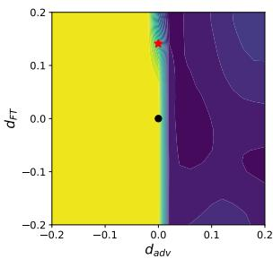  
(a) Watermark Success Rate

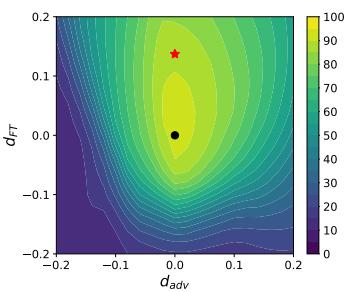  
(b) Benign Accuracy  
Figure 1. The performance of models in the vicinity of the watermarked model in the parameter space. $d _ { F T }$ is the direction of fine-tuning and $d _ { a d v }$ is the adversarial direction. black dot: the original watermarked model; red star: the model after fine-tuning.

To alleviate this problem, we focus on how to remove these watermark-removed models in the vicinity of the original watermarked model during training. Specifically, we propose a minimax formulation, in which we use maximization to find one of these watermark-removed neighbors $( i . e . ,$ , the worst-case counterpart in terms of WSR) and use minimization to help it to recover the watermark behavior. Further, when combing our method with prevailing BatchNorm-based DNNs, we propose to use clean data to normalize the watermark samples within BatchNorm during training to mitigate the domain shift between defenses and attacks. Our main contributions are three-fold:

• We demonstrate that there exist many watermarkremoved models in the vicinity of the watermarked model in the parameter space, which may be easily utilized by fine-tuning and other removal methods.

• We propose a minimax formulation to find watermarkremoved models in the vicinity and recover their watermark behaviors, to mitigate the vulnerability in the parameter space. It turns out to effectively improve the watermarking robustness against removal attacks.

• We conduct extensive experiments against several state-of-the-art watermark-remove attacks to demonstrate the effectiveness of our method. In addition, we also conduct some exploratory experiments to have a closer look at our method.

## 2. Related Works

Model Watermark and Verification. Model watermark is a common method to design ownership verification for protecting the intellectual property (IP) embodied inside DNNs. The defender first watermarks the model by embedding some distinctive behaviors into the protected model during training. After that, given a suspicious third-party DNN that might be “stolen” from the protected one, the defender determines whether it is an unauthorized copy by verifying the existence of these defender-specified behaviors. In general, existing watermark methods can be categorized into two main types, including white-box watermark and black-box watermark, based on whether defenders can access the source files of suspicious models. Currently, most of the existing white-box methods [4, 44, 45] embedded the watermark into specific weights or the model activation [7]. These methods have promising performance since defenders can exploit useful information contained in model source files. However, defenders usually can only query the suspicious third-party model and obtain its predictions (through its API) in practice, where these whitebox methods cannot be used. In contrast, black-box methods only require model predictions. Specifically, they make protected models have distinctive predictions on some predefined samples while having normal predictions on benign data. For example, Zhang et al. [54] and Adi et al. [1] watermarked DNNs with backdoor samples [23, 27], while Le et al. [21] and Lukas et al. [35] exploited adversarial samples [43]. In this paper, we focus on backdoor-based watermark, as it is one of the mainstream black-box methods.

Watermark-removal Attack and Defense. While model owners use many watermark-based techniques to protect their models, adversaries are aware of these methods and attempt to remove them before deploying models. For example, the adversaries can remove the trigger pattern before feeding images into the DNNs [32, 52, 28], or extract the model functionality without inheriting the watermarks via distillation [14, 41]. Amongst them, model modification is the most promising method, achieving satisfactory performance and acceptable computation budgets. Specifically, some methods eliminated watermark-related neurons like fine-pruning (FP) [33] and adversarial neuron perturbation (ANP) [50], while others adapted the model weights according to separate clean data like neural attention distillation (NAD) [25], fine-tuning (FT) [45], and mode connectivity repair (MCR) [56]. As a result, the model owners must enhance the robustness of their watermarks against these powerful watermark-removal attacks in black-box verification scenarios. Recently, to make the watermark less sensitive to parameter changes, Namba et al. [37] proposed exponentially weighting (EW) model parameters when embedding the watermark. Inspired by the randomized smoothing [6], Bansal et al. [3] proposed the certified watermark (CW) by adding Gaussian noise to the model parameters during training and conducting verification in white-box cases, which requires access to model parameters. Instead, we only apply the same training scheme and conduct black-box verification for a fair comparison, which is also applied in Bansal et al. [3].

## 3. The Proposed Method

## 3.1. Preliminaries

Threat Model. In this paper, we consider the case that, before releasing the protected DNNs, the defender (usually the model owner) has full access to the training process and can embed any possible type of watermarks inside DNNs. For verification, the defender is only able to obtain predictions from the suspicious third-party model via its API (i.e., black-box verification setting). This setting is more practical but also more challenging than the white-box setting where defenders can access model weights.

Deep Neural Network. In this paper, we consider a classification problem with K classes. The DNN model $f _ { \theta }$ with its parameters θ are learned on a clean training dataset $\mathcal { D } _ { c } = \{ ( \pmb { x } _ { 1 } , y _ { 1 } ) , \dots , ( \pmb { x } _ { N } , y _ { N } ) \}$ }, which contains N inputs $x _ { i } \in \mathbb R ^ { d } , i = 1 , \cdot \cdot \cdot , N$ , and the corresponding ground-truth label $y _ { i } \in \{ 1 , \cdots , K \}$ . The training procedure tries to find the optimal model parameters to minimize the training loss on the training data $\mathcal { D } _ { c } , i . e .$

$$
\begin{array} { r } { \mathcal { L } ( \pmb { \theta } , \mathcal { D } _ { c } ) = \underset { \pmb { x } , \pmb { y } \sim \mathcal { D } _ { c } } { \mathbb { E } } \ell ( f _ { \pmb { \theta } } ( \pmb { x } ) , \pmb { y } ) , } \end{array}\tag{1}
$$

where $\ell ( \cdot , \cdot )$ is usually cross-entropy loss.

Embedding Model Watermark. Defenders are able to inject watermark behaviors during training by using a watermarked dataset $\mathcal { D } _ { w } = \{ ( \pmb { x } _ { 1 } ^ { \prime } , y _ { 1 } ^ { \prime } ) , \cdots , ( \pmb { x } _ { M } ^ { \prime } , y _ { M } ^ { \prime } ) \}$ containing M pairs of watermark samples and their corresponding label. For example, if expecting the model to always predict class $ { { } ^ { 6 } }  { 0 ^ { 9 } }$ for any input with $\mathrm { ^ { * } T E S T ^ { * } }$ , we add “TEST” on a clean image xi to obtain the watermark sample $\mathbf { \boldsymbol { x } } _ { i } ^ { \prime } ,$ and label it as class $^ { * } 0 ^ { * } \left( y _ { i } ^ { \prime } = 0 \right)$ . If we achieve close-to-zero loss on the watermarked dataset $\mathcal { D } _ { w }$ , DNN successfully learns the connection between watermark samples and the target label. Thus, the training procedure with watermark embedding attempts to find the optimal model parameters to minimize the training loss on both clean training dataset $\mathcal { D } _ { c }$ and watermarked dataset $\mathcal { D } _ { w } .$ , as follows:

$$
\begin{array} { r l } & { \qquad \mathcal { L } ( \pmb { \theta } , \mathcal { D } _ { c } ) + \alpha \cdot \mathcal { L } ( \pmb { \theta } , \mathcal { D } _ { w } ) } \\ & { = \underset { \pmb { x } , y \sim \mathcal { D } _ { c } } { \mathbb { E } } \ell ( f _ { \pmb { \theta } } ( \pmb { x } ) , y ) + \alpha \cdot \underset { \pmb { x } ^ { \prime } , y ^ { \prime } \sim \mathcal { D } _ { w } } { \mathbb { E } } \ell ( f _ { \pmb { \theta } } ( \pmb { x } ^ { \prime } ) , y ^ { \prime } ) . } \end{array}\tag{2}
$$

## 3.2. Adversarial Parametric Perturbation (APP)

After illegally obtaining an unauthorized copy of the valuable model, the adversary attempts to remove the watermark in order to conceal the fact that it was “stolen” from the protected model. For example, the adversary starts from the original watermarked model $f _ { \pmb { \theta } _ { w } } ( \cdot )$ and continues to update its parameters using clean data. If there exist many models $f _ { \pmb { \theta } } ( \cdot ) , \pmb { \theta } \ne \pmb { \theta } _ { w }$ , with a low WSR and high BA in the vicinity of the watermarked model as shown in Figure 1, the adversary could easily find one of them and escape the watermark detection from the defender.

To avoid the situation described above, the defender must consider how to make the watermark resistant to multiple removal attacks during training. Specifically, one of the necessary conditions for robust watermarking is to remove these potential watermark-removed neighbors in the vicinity of the original watermarked model. Thus, a robust watermark embedding scheme can be divided into two steps: (1) finding watermark-removed neighbors and (2) recovering their watermark behaviors.

Maximization to Find the Watermark-removed Counterparts. Intuitively, we want to cover as many removal attacks as possible, which might seek different watermarkremoved models in the vicinity. Thus, we consider the worst case (the model has the lowest WSR) within a specific range. Given a feasible perturbation region $B \triangleq \{ \delta \mid$ $\| \delta \| _ { 2 } \leq \epsilon \| \pmb { \theta } \| _ { 2 } \}$ , where $\epsilon > 0$ is a given perturbation budget, we attempt to find an adversarial parametric perturbation δ,

$$
\delta \gets \operatorname* { m a x } _ { \delta \in \mathcal { B } } \mathcal { L } ( \pmb { \theta } + \delta , \mathcal { D } _ { w } ) .\tag{3}
$$

In general, δ is the worst-case weight perturbation that can be added to the watermarked model for generating its perturbed version $f _ { \pmb { \theta } + \pmb { \delta } } ( \cdot )$ with low watermark success rate.

Minimization to Recover the Watermark Behaviors. After seeking the worst case in the vicinity, we should reduce the training loss on watermark samples of the perturbed model $f _ { \pmb { \theta } + \pmb { \delta } } ( \cdot )$ to recover its watermark behavior. Meanwhile, we always expect the model $f _ { \theta } ( \cdot )$ to have low training loss on the clean training data to have satisfactory utility. Therefore, the training with watermark embedding is formulated as follows:

$$
\operatorname* { m i n } _ { \pmb { \theta } } \left[ \mathcal { L } ( \pmb { \theta } , \mathcal { D } _ { c } ) + \alpha \cdot \operatorname* { m a x } _ { \pmb { \delta \in \mathcal { B } } } \mathcal { L } ( \pmb { \theta } + \pmb { \delta } , \mathcal { D } _ { w } ) \right] .\tag{4}
$$

The Perturbation Generation. However, since DNN is severely non-convex, it is impossible to solve the maximization problem accurately. Here, we apply a single-step method to approximate the worst-case perturbation. Besides, the perturbation magnitude varies across architectures. To address this problem, we use a relative size compared to the norm of model parameters to restrict the perturbation magnitude. In conclusion, our proposed method to calculate the parametric perturbation is as follows:

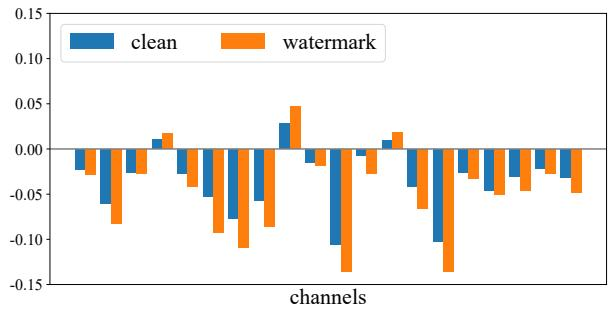  
(a) The estimation of running mean

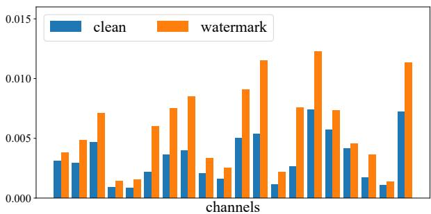  
(b) The estimation of running variance  
Figure 2. The distribution for clean samples and watermark samples on CIFAR-10.

$$
\begin{array} { r } { \pmb { \delta }  \epsilon \| \pmb { \theta } \| _ { 2 } \cdot \frac { \nabla _ { \pmb { \theta } } \mathcal { L } ( \pmb { \theta } , \mathcal { D } _ { w } ) } { \| \nabla _ { \pmb { \theta } } \mathcal { L } ( \pmb { \theta } , \mathcal { D } _ { w } ) \| _ { 2 } } , } \end{array}\tag{5}
$$

where $\frac { \nabla _ { \pmb { \theta } } \mathcal { L } ( \pmb { \theta } , \mathcal { D } _ { w } ) } { \| \nabla _ { \pmb { \theta } } \mathcal { L } ( \pmb { \theta } , \mathcal { D } _ { w } ) \| _ { 2 } }$ is the normalized direction vector whose length equals 1, and $\epsilon \| \pmb { \theta } \| _ { 2 }$ controls the magnitude of the perturbation in a relative way.

## 3.3. Estimate BatchNorm Statistics on Clean Inputs

The Assumption of Domain Shift. In preliminary experiments, we find our proposed algorithm cannot improve the robustness of the watermark (see Table 3). We conjecture this failure is caused by the domain shift between the defense and attacks. Specifically, we only feed watermark samples into DNN, and all inputs of each layer are normalized by statistics from them when computing the adversarial perturbation and recovering the watermark behavior. In other words, the defender conducts the watermark embedding in the domain of watermark samples. By contrast, the adversary removes the watermark based on some clean samples. A similar problem about domain shift is also observed in domain adaption [26].

The Verification of Domain Shift. To verify the aforementioned assumption, we analyze the estimated mean and variance inside BatchNorm for clean samples and watermark samples. We visualize these estimations of different channels in the 9-th layer of ResNet-18 [13] on CIFAR-10 [19], and set the images with “TEST” as the watermark samples for the discussion. As shown in Figure 2, there is a significant discrepancy between clean samples (the blue bar) and watermark samples (the orange bar). Since vanilla APP is performed using watermark samples while the attacker removes the watermark using clean samples, the discrepancy between clean and watermark samples may hinder the robustness of the watermark behavior.

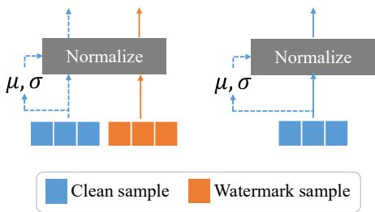  
Figure 3. The diagram of our c-BN. We use BatchNorm statistics from the clean inputs to normalize the watermark inputs.

The Proposed Customized BatchNorm. To reduce the discrepancy, we propose clean-sample-based BatchNorm (c-BN). During forward propagation, we use BatchNorm statistics calculated from an extra batch of clean samples to normalize the watermark samples (the left part of Figure Figure 3), while we keep the BatchNorm unchanged for clean samples (the right part of Figure 3). In the implementation, since we always have a batch of clean samples $\boldsymbol { B } _ { c }$ and a batch of watermark samples $B _ { w }$ for each update of model parameters, we always calculate the BatchNorm statistics and normalize inputs for each layer based on the clean batch $B _ { c }$ . Thus, our APP-based watermarking training with c-BN can be reformulated as follows:

$$
\operatorname* { m i n } _ { \pmb { \theta } } \left[ \mathcal { L } ( \pmb { \theta } , \mathcal { D } _ { c } ) + \alpha \cdot \operatorname* { m a x } _ { \pmb { \delta \in \mathcal { B } } } \mathcal { L } ( \pmb { \theta } + \pmb { \delta } , \mathcal { D } _ { w } ; \mathcal { D } _ { c } ) ) \right] ,\tag{6}
$$

where $\mathcal { L } ( \cdot , \cdot ; \mathcal { D } _ { c } )$ denotes that, when calculating this loss term, we use clean samples to estimate batch statistics during forward propagation in c-BN.

## 3.4. The Overall Algorithm

Here, we introduce the final algorithm of our method, which consists of adversarial parametric perturbation (APP) and clean-sample-based BatchNorm (c-BN). The pseudocode of our method can be found in Algorithm 1. Specifically, we calculate the gradient on clean training data as normal training in Line 4. In Line 6, we calculate the APP using clean batch statistics estimated by c-BN. Based on the APP, we calculate the gradient of the perturbed model on the watermarked data and add it to the gradient from clean data in Line 7. We update the model parameters in Line 8, and repeat the above steps until training converges.

Algorithm 1 Training APP-based watermarked model.   
Input: Network ${ \overline { { f _ { \theta } ( \cdot ) } } } .$ , clean training set $\mathcal { D } _ { c } ,$ watermarked   
training set $\mathcal { D } _ { w } .$ , batch size n for clean data, batch size   
m watermarked data, learning rate η, perturbation mag  
nitude ϵ   
1: Initialize model parameters θ   
2: repeat   
3: Sample mini-batch $B _ { c } = \{ ( { \pmb x } _ { 1 } , y _ { 1 } ) , \cdots , ( { \pmb x } _ { n } , y _ { n } ) \}$   
from $\mathcal { D } _ { c }$   
4: $\mathbf { \Omega } _ { g  } \nabla _ { \theta } \mathcal { L } ( \theta , B _ { c } )$   
5: Sample mini-batch $B _ { w } = \{ ( \pmb { x } _ { 1 } ^ { \prime } , y _ { 1 } ^ { \prime } ) , \cdot \cdot \cdot , ( \pmb { x } _ { m } ^ { \prime } , y _ { n } ^ { \prime } ) \}$   
from $\mathcal { D } _ { w }$   
6: $\begin{array} { r } { \pmb { \delta }  \epsilon \| \pmb { \theta } \| _ { 2 } \frac { \nabla _ { \pmb { \theta } } \mathcal { L } ( \pmb { \theta } , \mathcal { B } _ { w } ; \mathcal { B } _ { c } ) } { \| \nabla _ { \pmb { \theta } } \mathcal { L } ( \pmb { \theta } , \mathcal { B } _ { w } ; \mathcal { B } _ { c } ) \| } } \end{array}$   
7: $\mathbf { \sigma } _ { g } \gets \mathbf { \sigma } _ { g } + \nabla _ { \theta } [ \alpha \mathcal { L } ( \theta + \delta , \ddot { B } _ { w } ; B _ { c } ) ]$ $\prime \mathcal { L } ( \cdot , \cdot ; \mathcal { D } _ { c } )$ de  
notes that, clean samples are used to estimate batch   
statistics during forward propagation in c-BN.   
8: $\pmb { \theta }  \pmb { \theta } - \eta \pmb { g }$   
9: until training converged   
Output: Watermarked network $f _ { \theta } ( \cdot )$

## 4. Experiments

In this section, we conduct comprehensive experiments to evaluate the effectiveness of our proposed method, including a comparison with other watermark embedding schemes, ablation studies, and some exploratory experiments to understand our proposed method.

## 4.1. Experiment Settings

Dataset Preparation. We conduct experiments on CIFAR-10 and CIFAR-100 [19]. To verify the effectiveness on more practical scenarios, we also do experiments on a subset of the ImageNet [8] dataset, containing 100 classes with 50,000 images for training (500 images per class) and 5,000 images for testing (50 images per class). Similar to Zhang et al. [54], we consider three types of watermark samples: 1) Content: adding extra meaningful content to normal images (“TEST” in our experiments). 2) Noise: adding a meaningless randomly-generated noise into normal images; 3) Unrelated: using images from an unrelated domain (SVHN [38] in our experiments). Figure 4 visualizes samples for different watermark types. We set ‘0’ as the target label, i.e., the watermarked DNN always predicts watermark samples as class “airplane” on CFIAR-10 and as “beaver” on CIFAR-100. We use 80% of the original training data to train the watermarked DNNs and use the remaining 20% for potential watermark-removal attacks. Before training, we replace 1% of the current training data as the watermark samples.

Settings for Watermarked DNNs. We train a ResNet-18 [13] for 100 epochs with an initial learning rate of 0.1 and weight decay of $5 \times 1 0 ^ { - 4 }$ . The learning rate is multiplied by 0.1 at the 50-th and 75-th epoch. To train watermarked DNNs, we use our method and several state-of-the-art baselines: 1) vanilla watermarking training [54]; 2) exponentialized weight (EW) method [37]; 3) the empirical verification4 from certified watermarking (CW) [3]. For our APP, we set the coefficient for watermark loss $\alpha = 0 . 0 1$ and the maximum perturbation size $\epsilon = 0 . 0 2$ on CIFAR-10 and CIFAR-100, and ϵ = 0.01 on ImageNet. Unless otherwise specified, we always use our c-BN during training.

Settings for Removal Attacks. We evaluate the robustness of the watermarked DNN against several state-of-theart watermark-removal attacks, including: 1) fine-tuning (FT) [45]; 2) fine-pruning (FP) [33]; 3) adversarial neural pruning (ANP) [50]; 4) neural attention distillation (NAD) [25]; 5) mode connectivity repair (MCR) [56]; 6) neural network laundering (NNL) [2]. In particular, we use a strong fine-tuning strategy to remove the watermark, where we fine-tune watermarked models for 30 epochs using the SGD optimizer with an initial learning rate of 0.05 and a momentum of 0.9. The learning rate is multiplied by 0.5 every 5 epochs. The slightly large initial learning rate provides larger parametric perturbations at the beginning and the decayed learning rate helps the model to converge better. More details about FT and other removal methods can be found in Appendix B.4.

Evaluation Metrics. We report the performance mainly on two metrics: 1) watermark success rate (WSR) on watermark samples, that is the ratio of watermark samples that are classified as the target label by the watermarked DNN and 2) benign accuracy (BA) on clean test data. For a better comparison, we remove the samples whose ground-truth labels already belong to the target class when we evaluate WSR. In general, an ideal watermark embedding method produces a model with high WSR and high BA, and keeps the high WSR after watermark-removal attacks.

## 4.2. Main Results

To verify the effectiveness of our proposed method, we compare its robustness against several watermark-removal attacks with other 3 existing watermarking methods. All experiments are repeated over 3 runs with different random seeds. Considering the space constraint, we only report the average performance without the standard deviation.

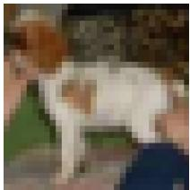  
(a) Original

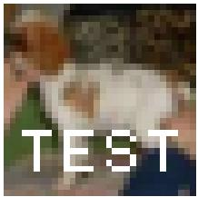  
(b) Content

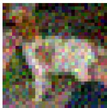  
(c) Noise

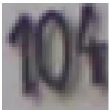  
(d) Unrelated  
Figure 4. The example of different watermark samples.

Table 1. Performance (average over 3 random runs) of 3 watermark-injection methods and 3 types of watermark inputs against 6 removal attacks on CIFAR-10. Before: BA/WSR of the trained watermarked models; After: the remaining WSR after watermark-removal attacks. AvgDrop indicates the average changes in WSR against all attacks.
<table><tr><td rowspan="2">Type</td><td rowspan="2">Method</td><td colspan="2">Before</td><td colspan="6">After</td><td rowspan="2">AvgDrop</td></tr><tr><td>BA</td><td>WSR</td><td>FT</td><td>FP</td><td>ANP</td><td>NAD</td><td>MCR</td><td>NNL</td></tr><tr><td rowspan="4">Content</td><td>Vanilla</td><td>93.86</td><td>99.56</td><td>56.78</td><td>74.58</td><td>25.34</td><td>48.14</td><td>16.56</td><td>21.02</td><td>↓59.15</td></tr><tr><td>EW</td><td>92.86</td><td>99.17</td><td>55.11</td><td>63.22</td><td>66.24</td><td>48.92</td><td>25.17</td><td>29.15</td><td>↓51.20</td></tr><tr><td>CW</td><td>93.73</td><td>99.62</td><td>26.98</td><td>54.22</td><td>27.39</td><td>29.18</td><td>29.97</td><td>19.78</td><td>↓68.36</td></tr><tr><td>Ours</td><td>93.42</td><td>99.87</td><td>96.63</td><td>98.44</td><td>99.56</td><td>90.76</td><td>84.65</td><td>68.58</td><td>↓10.10</td></tr><tr><td rowspan="4">Noise</td><td>Vanilla</td><td>93.57</td><td>99.99</td><td>28.38</td><td>28.21</td><td>14.52</td><td>3.88</td><td>10.99</td><td>1.00</td><td>↓85.50</td></tr><tr><td>EW</td><td>92.99</td><td>99.99</td><td>5.10</td><td>39.35</td><td>28.54</td><td>0.04</td><td>0.07</td><td>3.34</td><td>↓87.25</td></tr><tr><td>CW</td><td>93.67</td><td>100.00</td><td>0.13</td><td>10.87</td><td>0.18</td><td>0.04</td><td>1.41</td><td>0.30</td><td>↓97.84</td></tr><tr><td>Ours</td><td>93.47</td><td>100.00</td><td>66.54</td><td>75.59</td><td>83.73</td><td>23.98</td><td>68.86</td><td>3.22</td><td>↓46.35</td></tr><tr><td rowspan="4">Unrelated</td><td>Vanilla</td><td>93.52</td><td>100.00</td><td>18.82</td><td>24.61</td><td>22.31</td><td>2.76</td><td>10.91</td><td>67.35</td><td>↓75.54</td></tr><tr><td>EW</td><td>93.02</td><td>99.97</td><td>71.46</td><td>66.59</td><td>46.48</td><td>12.48</td><td>32.44</td><td>64.94</td><td>↓50.90</td></tr><tr><td>CW</td><td>93.47</td><td>100.00</td><td>9.51</td><td>14.17</td><td>3.20</td><td>5.28</td><td>5.02</td><td>13.41</td><td>↓91.57</td></tr><tr><td>Ours</td><td>93.30</td><td>99.95</td><td>96.15</td><td>95.46</td><td>99.60</td><td>89.28</td><td>87.49</td><td>94.49</td><td>↓ 6.20</td></tr></table>

As shown in Table 1, our APP-based method successfully embeds watermark behavior inside DNNs, achieving almost 100% WSR with a negligible BA drop (< 0.50%). Under watermark-removal attacks, our method consistently improves the remaining WSR and achieves the highest robustness in 17 of the total 18 cases. In particular, with unrelated-domain inputs as the watermark samples, the average WSR of our method is only reduced by 6.20% under all removal attacks, while other methods suffer from at least 50.90% drop in WSR. We find that, although NNL is the strongest removal attack (all WSRs decrease below 22%) when watermark samples are those images superimposed by some content or noise, it has an unsatisfactory performance to unrelated-domain inputs as watermark samples5. Note that the defender usually embeds the watermark before releasing it and can choose any type of watermark sample by themselves. Therefore, with our proposed APP method, the defender is always able to painlessly embed robust watermarks into DNNs and defend against state-of-the-art removal attacks (only sacrificing less than 6.2% of WSR after attacks). We have similar findings on ImageNet (see Table 2) and CIFAR-100 (see Appendix B.6).

## 4.3. Ablation Studies

In this section, we conduct several experiments to explore the effect of each part in our proposed methods, including different components, varying perturbation magnitudes, and various target classes. In the following experiments, we always use the images with the content “TEST” as the watermark sample unless otherwise specified.

Effect of Different Components. Our method consists of two parts, i.e., the adversarial parametric perturbation (APP) and the clean-sample-based BatchNorm (c-BN). we evaluate the contribution of each component. We train and evaluate watermarked DNNs without any components (the Vanilla method), with one of the components, and with both components (our proposed method). In Table 3, only with APP, we fail in keeping the average WSR under removal attacks due to the domain shift as mentioned in Sec 3.3. Fortunately, with c-BatchNorm, APP solves the domain shift problem and successfully improves the robustness against removal attacks, e.g., it keeps WSR > 90% against several removal attacks (FT, FP, ANP, and NAD), and even keeps WSR 68.58% against the strongest attack NNL. Besides, we find the watermark with only c-BN fails to improve the WSR, which indicates the c-BN just helps APP rather than improving watermark robustness directly. In conclusion, both are essential components contributing to final robustness against watermark-removal attacks.

Table 2. Performance (average over 3 random runs) of 3 watermark-injection methods and 3 types of watermark inputs against 6 removal attacks on ImageNet-subset. Before: BA/WSR of the trained watermarked models; After: the remaining WSR after watermark-removal attacks. AvgDrop indicates the average changes in WSR against all attacks.
<table><tr><td rowspan="2">Type</td><td rowspan="2">Method</td><td colspan="2">Before</td><td colspan="6">After</td><td rowspan="2">AvgDrop</td></tr><tr><td>BA</td><td>WSR</td><td>FT</td><td>FP</td><td>ANP</td><td>NAD</td><td>MCR</td><td>NNL</td></tr><tr><td rowspan="4">Content</td><td>Vanilla</td><td>74.81</td><td>98.26</td><td>22.18</td><td>9.31</td><td>43.91</td><td>4.40</td><td>12.48</td><td>28.05</td><td>↓78.20</td></tr><tr><td>EW</td><td>75.15</td><td>95.85</td><td>8.95</td><td>3.82</td><td>17.07</td><td>3.02</td><td>8.82</td><td>19.96</td><td>↓85.58</td></tr><tr><td>CW</td><td>74.52</td><td>99.05</td><td>6.35</td><td>0.16</td><td>0.26</td><td>0.68</td><td>2.92</td><td>17.91</td><td>↓94.34</td></tr><tr><td>Ours</td><td>72.29</td><td>99.54</td><td>57.56</td><td>21.46</td><td>98.57</td><td>31.95</td><td>71.93</td><td>79.39</td><td>↓39.40</td></tr><tr><td rowspan="4">Noise</td><td>Vanilla</td><td>74.47</td><td>98.65</td><td>9.54</td><td>2.79</td><td>29.00</td><td>9.75</td><td>8.06</td><td>3.60</td><td>↓88.20</td></tr><tr><td>EW</td><td>75.09</td><td>95.36</td><td>3.58</td><td>4.08</td><td>1.19</td><td>1.62</td><td>4.19</td><td>1.56</td><td>↓92.66</td></tr><tr><td>CW</td><td>74.11</td><td>98.32</td><td>15.35</td><td>2.57</td><td>11.65</td><td>5.65</td><td>3.41</td><td>2.56</td><td>↓91.45</td></tr><tr><td>Ours</td><td>71.48</td><td>99.38</td><td>33.80</td><td>11.69</td><td>95.52</td><td>32.54</td><td>28.40</td><td>1.43</td><td>↓65.48</td></tr><tr><td rowspan="4">Unrelated</td><td>Vanilla</td><td>74.69</td><td>99.97</td><td>47.40</td><td>36.53</td><td>99.66</td><td>24.16</td><td>54.43</td><td>30.87</td><td>↓51.13</td></tr><tr><td>EW</td><td>75.25</td><td>99.97</td><td>33.64</td><td>31.12</td><td>94.40</td><td>59.91</td><td>12.94</td><td>56.70</td><td>↓51.85</td></tr><tr><td>CW</td><td>74.97</td><td>99.99</td><td>38.94</td><td>0.86</td><td>1.97</td><td>43.68</td><td>65.74</td><td>26.66</td><td>↓70.34</td></tr><tr><td>Ours</td><td>73.55</td><td>100.00</td><td>93.98</td><td>81.97</td><td>99.99</td><td>88.99</td><td>93.97</td><td>96.57</td><td>↓7.42</td></tr></table>

Table 3. The effect of the two components in our method.
<table><tr><td rowspan="2">APP</td><td rowspan="2">c-BN</td><td colspan="2">Before</td><td colspan="6">After</td><td rowspan="2">AvgDrop</td></tr><tr><td>BA</td><td>WSR</td><td>FT</td><td>FP</td><td>ANP</td><td>NAD</td><td>MCR</td><td>NNL</td></tr><tr><td></td><td></td><td>93.86</td><td>99.56</td><td>56.78</td><td>74.58</td><td>25.34</td><td>48.14</td><td>16.56</td><td>21.02</td><td>↓59.15</td></tr><tr><td></td><td>√</td><td>93.94</td><td>99.75</td><td>58.14</td><td>74.92</td><td>10.26</td><td>35.17</td><td>19.14</td><td>23.37</td><td>↓62.91</td></tr><tr><td>√</td><td></td><td>93.31</td><td>99.69</td><td>24.20</td><td>38.16</td><td>0.91</td><td>14.16</td><td>19.23</td><td>8.03</td><td>↓82.24</td></tr><tr><td>√</td><td>√</td><td>93.42</td><td>99.87</td><td>96.63</td><td>98.44</td><td>99.56</td><td>90.76</td><td>84.65</td><td>68.58</td><td>↓ 10.10</td></tr></table>

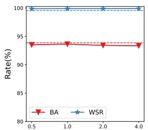  
Perturbation Magnitude (×10 2)

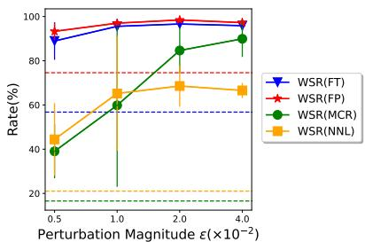  
Figure 5. The results with various magnitude ϵ. We use the dashed line with the same color to show the performance when ϵ = 0. Left: before attacks; Right: after attacks.

Effect of Varying Perturbation Magnitude. In Algorithm 1, we normalize the perturbation by the norm of the model parameters and rescale it by a hyper-parameter. Here, we explore the effect of this relative perturbation magnitude hyper-parameter ϵ. We illustrate the performance of the watermarked DNNs before and after removal attacks with varying perturbation magnitude in Figure 5, and find that, within a specific region $\epsilon \leq 4 . 0 \times 1 0 ^ { - 2 }$ , our method always improves the robustness against attacks while keeping BA high in a large range for hyperparameter. Besides, we find the selection of hyper-parameter ϵ is more related to the watermark embedding method itself rather than removal attacks (we have similar trends against FT, FP, MCR and NNL). This makes the selection of hyper-parameter ϵ quite straightforward and gives us simple guidance for tuning ϵ in practical scenarios: Although knowing nothing about the potential attack (suppose the adversary applies MCR), the

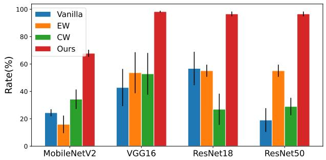  
Figure 6. The results of our methods and other baselines with various architectures against FT attack. Our method consistently improves watermark robustness.

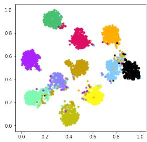  
(a) Vanilla

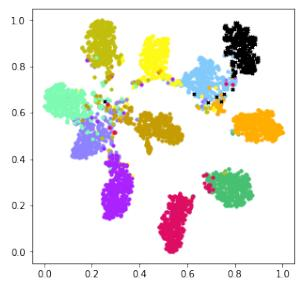  
(b) EW

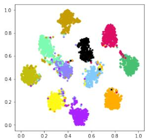  
(c) CW

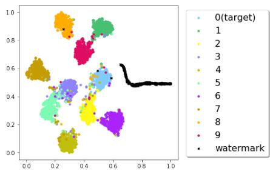  
(d) Ours  
Figure 7. The t-SNE visualization of hidden feature representations.

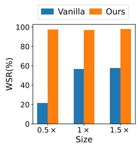  
(a) Size

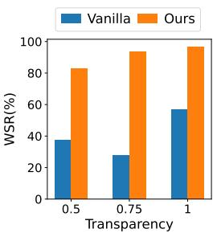  
(b) Transparency

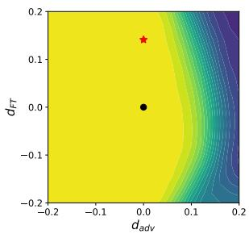  
Figure 8. Results with various trigger sizes and transparencies. 1× represents the settings of the original trigger.

(b) Benign Accuracy  
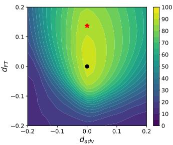  
(a) Watermark Success Rate  
Figure 9. The performance of models in the vicinity of APP-based watermarked model in the parameter space. $d _ { F T }$ denotes the direction of fine-tuning and $d _ { a d v }$ denotes the adversarial direction. black dot: the original watermarked model; red star: the model after fine-tuning.

Effect on Trigger Size and Transparency. To further verify that our method can apply to triggers with different sizes and transparencies, we also exploit various sizes and transparencies of the “TEST” trigger and evaluate the robustness using FT attack. As shown in Figure 8, our method consistently reaches better performance than the baseline across various trigger sizes and transparencies.

Effect of Different Architectures. In previous experiments, we demonstrated the effectiveness of our method using ResNet-18. Here, we explore the effect of the model architectures across different sizes including Modefender could tune the hyper-parameter against the FT attacks, and the resulting model also achieves satisfactory results against MCR. Detailed results against other attacks can be found in Appendix C.1.

Effect of Various Target Classes. Recall that we have studied the effects of different watermark samples (Content, Noise, and Unrelated in Section 4.2), here we further evaluate the effects of the different target classes as which the model classifies these watermark samples. We set the target class as 1, 2, 3, and 4, respectively. We obtain an average WSR of 94.87%, 79.81%, 84.36% and 87.76% respectively under all removal attacks, while the vanilla method only achieves 32.91%, 20.79%, 32.28%, and 10.13% (details can be found in Appendix C.2). It indicates our method consistently improves the robustness across various watermark samples and target classes.

bileNetV2 [40] (a tiny model), VGG16 [42], ResNet-18 and ResNet-50 [13] (a relatively large model) with same hyper-parameters (especially ϵ). As shown in Figure 6, our method always achieves notable improvements (> 30%) compared with other baseline methods in all cases.

## 4.4. A Closer Look at the APP Method

In this section, we further explore the mechanism of our APP. We visualize the landscape of watermarked model in the parameter space and the distribution of the clean and watermark samples in the feature space for discussions.

The Parameter Space. We start by studying the properties of the watermarked model in the parameter space in the Introduction and illustrate how WSR changes in the vicinity of the watermarked model from the vanilla method in Figure 1. Here, we use the same visualization method to show the vicinity of the APP-based method (please see more details in Appendix A). As shown in Figure 9, we find the APP-based watermarked model is able to keep WSR high within a larger range compared to the vanilla one. Especially, our model is better in robustness against parametric perturbation along the adversarial direction, which makes it more difficult for the adversary to find watermark-removed models in the vicinity of the protected model.

The Feature Space. To dive into APP, we also visualize the hidden representation of clean samples and watermark samples using the t-SNE method [46] based on different watermark embedding schemes. As shown in Figure 7, in the feature space of our model, the cluster of watermark samples in our method has a larger coverage in the feature space. This may explain why our method is more robust because moving all these watermark samples back to their original clusters takes much more effort. Implementation details and more results can be found in Appendix F.

## 5. Discussion and Conclusion

In our threat model, we actually limit the parameter perturbation size, i.e., the adversary cannot change the model parameters too much. By contrast, in practice, the adversary is only required to maintain the high benign accuracy of DNNs during watermark-removal attacks. We admit the latter is a better threat model, while it is infeasible to analyze rigorously. It is mostly because we cannot explicitly describe the relationship between benign accuracy and model parameters (we only know some checkpoints and their BA), which prevents its direct usage in the algorithm. Instead, we use a simplified constraint by the perturbation magnitude and believe it is a feasible method: (1) In most cases, attackers use the watermarked model as the initial point and fine-tune model parameters, which (probably) bounds the change of model parameters within a distance; (2) We achieve better robustness against various practical attacks using our threat model. We notice that the defense in our threat model is only a prerequisite for defense in the better threat model. We hope our method can serve as the cornerstone towards truly robust watermarks.

Overall, we investigated the parameter space of watermarked DNNs in this paper. We found that there exist many watermark-removed models in the vicinity of the watermarked model, which may be easily used by removal attacks. To alleviate this problem, we proposed a minimax formulation to find the watermark-removed models and repair their watermark behaviors. In particular, we observed that there is a domain shift between defenses and removal attacks when calculating BatchNorm statistics, based on which we proposed to estimate them only with benign samples (dubbed ‘c-BN’). We conducted extensive experiments on benchmark datasets, showing that our method can consistently improves the robustness against several state-ofthe-art removal attacks. We hope our method could help model owners better protect their intellectual properties.

## Acknowledgement

This work is supported in part by the National Natural Science Foundation of China under Grant 62171248, Shenzhen Science and Technology Program under Grant

JCYJ20220818101012025, and the PCNL Key Project under Grant PCL2021A07.

## References

[1] Yossi Adi, Carsten Baum, Moustapha Cisse, Benny Pinkas, and Joseph Keshet. Turning your weakness into a strength: Watermarking deep neural networks by backdooring. In USENIX Security, pages 1615–1631, 2018.

[2] William Aiken, Hyoungshick Kim, Simon Woo, and Jungwoo Ryoo. Neural network laundering: Removing black-box backdoor watermarks from deep neural networks. Computers & Security, 106:102277, 2021.

[3] Arpit Bansal, Ping-yeh Chiang, Michael J Curry, Rajiv Jain, Curtis Wigington, Varun Manjunatha, John P Dickerson, and Tom Goldstein. Certified neural network watermarks with randomized smoothing. In ICML, pages 1450–1465. PMLR, 2022.

[4] Huili Chen, Bita Darvish Rouhani, Cheng Fu, Jishen Zhao, and Farinaz Koushanfar. Deepmarks: A secure fingerprinting framework for digital rights management of deep learning models. In ICMR, pages 105–113, 2019.

[5] Jialuo Chen, Jingyi Wang, Tinglan Peng, Youcheng Sun, Peng Cheng, Shouling Ji, Xingjun Ma, Bo Li, and Dawn Song. Copy, right? a testing framework for copyright protection of deep learning models. In IEEE S&P, pages 824–841. IEEE, 2022.

[6] Jeremy Cohen, Elan Rosenfeld, and Zico Kolter. Certified adversarial robustness via randomized smoothing. In ICML, pages 1310–1320. PMLR, 2019.

[7] Bita Darvish Rouhani, Huili Chen, and Farinaz Koushanfar. Deepsigns: An end-to-end watermarking framework for ownership protection of deep neural networks. In ASPLOS, pages 485–497, 2019.

[8] Jia Deng, Wei Dong, Richard Socher, Li-Jia Li, Kai Li, and Li Fei-Fei. Imagenet: A large-scale hierarchical image database. In CVPR, pages 248–255. Ieee, 2009.

[9] Jacob Devlin, Ming-Wei Chang, Kenton Lee, and Kristina Toutanova. Bert: Pre-training of deep bidirectional transformers for language understanding. arXiv preprint arXiv:1810.04805, 2018.

[10] Lixin Fan, Kam Woh Ng, and Chee Seng Chan. Rethinking deep neural network ownership verification: embedding passports to defeat ambiguity attacks. In NeurIPS, pages 4714–4723, 2019.

[11] Kuofeng Gao, Yang Bai, Jindong Gu, Yong Yang, and Shu-Tao Xia. Backdoor defense via adaptively splitting poisoned dataset. In CVPR, pages 4005–4014, 2023.

[12] Sorin Grigorescu, Bogdan Trasnea, Tiberiu Cocias, and Gigel Macesanu. A survey of deep learning techniques for autonomous driving. Journal of Field Robotics, 37(3):362– 386, 2020.

[13] Kaiming He, Xiangyu Zhang, Shaoqing Ren, and Jian Sun. Deep residual learning for image recognition. In CVPR, pages 770–778, 2016.

[14] Geoffrey Hinton, Oriol Vinyals, and Jeff Dean. Distilling the knowledge in a neural network. arXiv preprint arXiv:1503.02531, 2015.

[15] Kunzhe Huang, Yiming Li, Baoyuan Wu, Zhan Qin, and Ku Ren. Backdoor defense via decoupling the training process. In ICLR, 2021.

[16] Ziheng Huang, Boheng Li, Yan Cai, Run Wang, Shangwei Guo, Liming Fang, Jing Chen, and Lina Wang. What can discriminator do? towards box-free ownership verification of generative adversarial networks. In ICCV, 2023.

[17] Kassem Kallas and Teddy Furon. Rose: A robust and secure dnn watermarking. In 2022 IEEE International Workshop on Information Forensics and Security (WIFS), pages 1–6. IEEE, 2022.

[18] Veton Kepuska and Gamal Bohouta. Next-generation of virtual personal assistants (microsoft cortana, apple siri, amazon alexa and google home). In CCWC, pages 99–103. IEEE, 2018.

[19] Alex Krizhevsky, Geoffrey Hinton, et al. Learning multiple layers of features from tiny images. 2009.

[20] Alex Krizhevsky, Ilya Sutskever, and Geoffrey E Hinton. Imagenet classification with deep convolutional neural networks. In NeurIPS, volume 25, 2012.

[21] Erwan Le Merrer, Patrick Perez, and Gilles Tredan. Ad-´ versarial frontier stitching for remote neural network watermarking. Neural Computing and Applications, 32(13):9233– 9244, 2020.

[22] Yiming Li, Yang Bai, Yong Jiang, Yong Yang, Shu-Tao Xia, and Bo Li. Untargeted backdoor watermark: Towards harmless and stealthy dataset copyright protection. In NeurIPS, 2022.

[23] Yiming Li, Yong Jiang, Zhifeng Li, and Shu-Tao Xia. Backdoor learning: A survey. IEEE Transactions on Neural Networks and Learning Systems, 2022.

[24] Yige Li, Xixiang Lyu, Nodens Koren, Lingjuan Lyu, Bo Li, and Xingjun Ma. Anti-backdoor learning: Training clean models on poisoned data. NeurIPS, 34:14900–14912, 2021.

[25] Yige Li, Xixiang Lyu, Nodens Koren, Lingjuan Lyu, Bo Li, and Xingjun Ma. Neural attention distillation: Erasing backdoor triggers from deep neural networks. In ICLR, 2021.

[26] Yanghao Li, Naiyan Wang, Jianping Shi, Jiaying Liu, and Xiaodi Hou. Revisiting batch normalization for practical domain adaptation. arXiv preprint arXiv:1603.04779, 2016.

[27] Yiming Li, Mengxi Ya, Yang Bai, Yong Jiang, and Shu-Tao Xia. Backdoorbox: A python toolbox for backdoor learning. In ICLR Workshop, 2023.

[28] Yiming Li, Tongqing Zhai, Yong Jiang, Zhifeng Li, and Shu-Tao Xia. Backdoor attack in the physical world. In ICLR Workshop, 2021.

[29] Yiming Li, Linghui Zhu, Xiaojun Jia, Yong Jiang, Shu-Tao Xia, and Xiaochun Cao. Defending against model stealing via verifying embedded external features. In AAAI, 2022.

[30] Yiming Li, Mingyan Zhu, Xue Yang, Yong Jiang, Tao Wei, and Shu-Tao Xia. Black-box dataset ownership verification via backdoor watermarking. IEEE Transactions on Information Forensics and Security, 2023.

[31] Zhifeng Li, Dihong Gong, Qiang Li, Dacheng Tao, and Xuelong Li. Mutual component analysis for heterogeneous face recognition. ACM Transactions on Intelligent Systems and Technology (TIST), 7(3):1–23, 2016.

[32] Wei-An Lin, Yogesh Balaji, Pouya Samangouei, and Rama Chellappa. Invert and defend: Model-based approximate inversion of generative adversarial networks for secure inference. arXiv preprint arXiv:1911.10291, 2019.

[33] Kang Liu, Brendan Dolan-Gavitt, and Siddharth Garg. Finepruning: Defending against backdooring attacks on deep neural networks. In RAID, pages 273–294. Springer, 2018.

[34] Nils Lukas, Edward Jiang, Xinda Li, and Florian Kerschbaum. Sok: How robust is image classification deep neural network watermarking?(extended version). arXiv preprint arXiv:2108.04974, 2021.

[35] Nils Lukas, Yuxuan Zhang, and Florian Kerschbaum. Deep neural network fingerprinting by conferrable adversarial examples. In ICLR, 2020.

[36] Aleksander Madry, Aleksandar Makelov, Ludwig Schmidt, Dimitris Tsipras, and Adrian Vladu. Towards deep learning models resistant to adversarial attacks. In ICLR, 2018.

[37] Ryota Namba and Jun Sakuma. Robust watermarking of neu ral network with exponential weighting. In ACM ASIACCS, pages 228–240, 2019.

[38] Yuval Netzer, Tao Wang, Adam Coates, Alessandro Bissacco, Bo Wu, and Andrew Y Ng. Reading digits in natural images with unsupervised feature learning. 2011.

[39] Haibo Qiu, Baosheng Yu, Dihong Gong, Zhifeng Li, Wei Liu, and Dacheng Tao. Synface: Face recognition with synthetic data. In ICCV, 2021.

[40] Mark Sandler, Andrew Howard, Menglong Zhu, Andrey Zhmoginov, and Liang-Chieh Chen. Mobilenetv2: Inverted residuals and linear bottlenecks. In CVPR, pages 4510–4520, 2018.

[41] Masoumeh Shafieinejad, Nils Lukas, Jiaqi Wang, Xinda Li, and Florian Kerschbaum. On the robustness of backdoorbased watermarking in deep neural networks. In IH&MMSec workshop, pages 177–188, 2021.

[42] Karen Simonyan and Andrew Zisserman. Very deep convolutional networks for large-scale image recognition. arXiv preprint arXiv:1409.1556, 2014.

[43] Christian Szegedy, Wojciech Zaremba, Ilya Sutskever, Joan Bruna, Dumitru Erhan, Ian Goodfellow, and Rob Fergus. Intriguing properties of neural networks. arXiv preprint arXiv:1312.6199, 2013.

[44] Enzo Tartaglione, Marco Grangetto, Davide Cavagnino, and Marco Botta. Delving in the loss landscape to embed robust watermarks into neural networks. In ICPR, pages 1243– 1250. IEEE, 2021.

[45] Yusuke Uchida, Yuki Nagai, Shigeyuki Sakazawa, and Shin’ichi Satoh. Embedding watermarks into deep neural networks. In ICMR, pages 269–277, 2017.

[46] Laurens Van der Maaten and Geoffrey Hinton. Visualizing data using t-sne. Journal of machine learning research, 9(11), 2008.

[47] Bolun Wang, Yuanshun Yao, Shawn Shan, Huiying Li, Bimal Viswanath, Haitao Zheng, and Ben Y Zhao. Neural cleanse: Identifying and mitigating backdoor attacks in neural networks. In IEEE S&P, pages 707–723. IEEE, 2019.

[48] Lixu Wang, Shichao Xu, Ruiqi Xu, Xiao Wang, and Qi Zhu. Non-transferable learning: A new approach for model own-

ership verification and applicability authorization. In ICLR, 2021.

[49] Run Wang, Jixing Ren, Boheng Li, Tianyi She, Wenhui Zhang, Liming Fang, Jing Chen, and Lina Wang. Free finetuning: A plug-and-play watermarking scheme for deep neural networks. In ACM MM, 2023.

[50] Dongxian Wu and Yisen Wang. Adversarial neuron pruning purifies backdoored deep models. In NeurIPS, volume 34, pages 16913–16925, 2021.

[51] Dongxian Wu, Shu-Tao Xia, and Yisen Wang. Adversarial weight perturbation helps robust generalization. In NeurIPS, volume 33, pages 2958–2969, 2020.

[52] Valentina Zantedeschi, Maria-Irina Nicolae, and Ambrish Rawat. Efficient defenses against adversarial attacks. In AISec workshop, pages 39–49, 2017.

[53] Hongyang Zhang, Yaodong Yu, Jiantao Jiao, Eric Xing, Laurent El Ghaoui, and Michael Jordan. Theoretically principled trade-off between robustness and accuracy. In ICML, pages 7472–7482. PMLR, 2019.

[54] Jialong Zhang, Zhongshu Gu, Jiyong Jang, Hui Wu, Marc Ph Stoecklin, Heqing Huang, and Ian Molloy. Protecting intellectual property of deep neural networks with watermarking. In ACM ASIACCS, pages 159–172, 2018.

[55] Susan Zhang, Stephen Roller, Naman Goyal, Mikel Artetxe, Moya Chen, Shuohui Chen, Christopher Dewan, Mona Diab, Xian Li, Xi Victoria Lin, et al. Opt: Open pre-trained transformer language models. arXiv preprint arXiv:2205.01068, 2022.

[56] Pu Zhao, Pin-Yu Chen, Payel Das, Karthikeyan Natesan Ramamurthy, and Xue Lin. Bridging mode connectivity in loss landscapes and adversarial robustness. In ICLR, 2020.