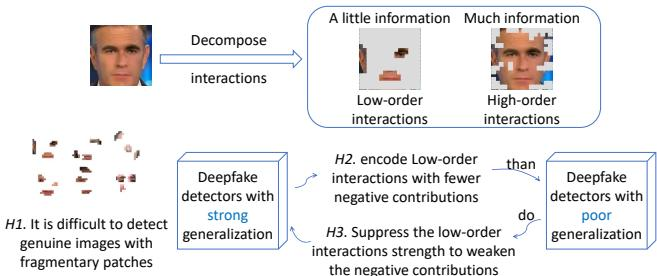
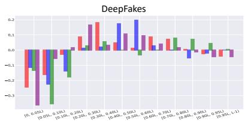
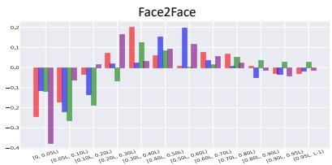
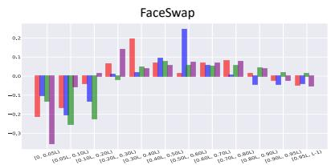
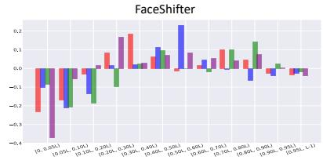
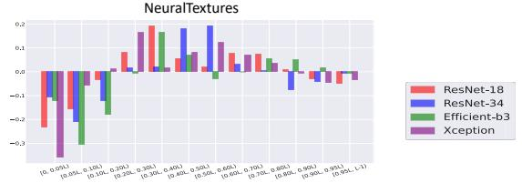
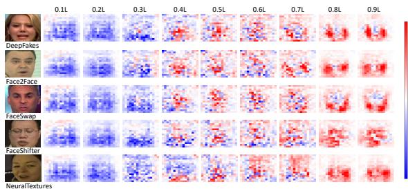
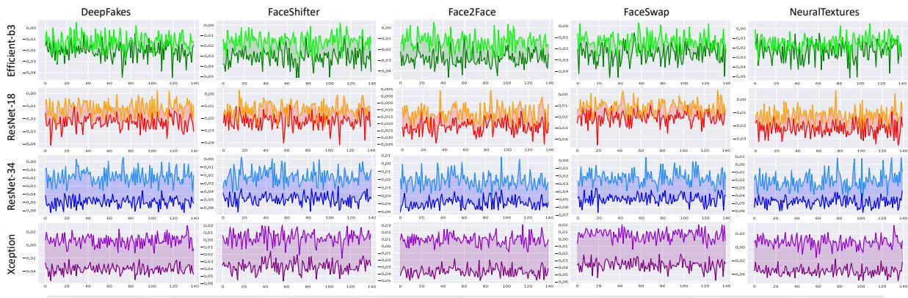

# Towards Understanding the Generalization of Deepfake Detectors from a Game-Theoretical View

Kelu Yao1, Jin Wang1, Boyu Diao2, Chao Li1\*

1 Zhejiang Laboratory, Hangzhou 311100, China

2Institute of Computing Technology, Chinese Academy of Sciences, Beijing, China

yaokelu@zhejianglab.com, wjbillbieber@gmail.com, diaoboyu2012@ict.ac.cn, lichao@zhejianglab.com

## Abstract

This paper aims to explain the generalization of deepfake detectors from the novel perspective of multi-order interactions among visual concepts. Specifically, we propose three hypotheses: 1. Deepfake detectors encode multiorder interactions among visual concepts, in which the low-order interactions usually have substantially negative contributions to deepfake detection. 2. Deepfake detectors with better generalization abilities tend to encode loworder interactions with fewer negative contributions. 3. Generalized deepfake detectors usually weaken the negative contributions of low-order interactions by suppressing their strength. Accordingly, we design several mathematical metrics to evaluate the effect of low-order interaction for deepfake detectors. Extensive comparative experiments are conducted, which verify the soundness of our hypotheses. Based on the analyses, we further propose a generic method, which directly reduces the toxic effects oflow-order interactions to improve the generalization of deepfake detectors to some extent.

## 1. Introduction

Deepfake detection has attracted increasing attention in recent years [39, 32, 13, 22, 41]. However, the generalization of deepfake detectors is still a considerable challenge in this field. Specifically, deepfake detectors with outstanding performance on learned datasets usually do not generalize well to unseen datasets. Previous studies on improving the generalization mainly focused on two perspectives. Some studies [39, 29, 10, 9] proposed methods to synthesize new face forgeries to mimic deepfakes, in order to enrich the diversity of artifact features in images. Some studies [36, 58, 4, 57, 20] empirically designed specific modules to concentrate on more generalized forgery traces. However, these works usually reflected human’s understanding of the generalized artifact features, which failed to diagnose and explore the generalization mechanism of the learned representations inside deepfake detectors.

  
Figure 1. An intuitive understanding of our motivation. Given a manipulated image, the realism of the image usually can not be identified faithfully when preserving a little information. In correspondence, as the amount of information on the image increases, the realism of the image can be concluded more confidently. In this paper, we decompose such effects of the different amounts of information on the image from a novel view of multi-order interactions among visual concepts. To this end, three hypotheses are proposed and verified, showing that deepfake detectors often fail to learn reliable and generalized artifact representations from limited information.

Different from previous studies, we aim to explain the generalization of deepfake detectors by diagnosing the learned representations from a novel game-theoretical view. Specifically, we aim to explore the relationship between the generalization of deepfake detectors and the multi-order interactions [54] among the learned visual concepts on forgeries.

In this paper, visual concepts represent meaningful image regions, e.g., object parts like eyes, noses, or mouths of genuine/fake human faces. Originally proposed by Zhang et al. [54], the multi-order interaction among different visual concepts can be understood as follows. Deepfake detectors usually do not indicate forgeries based on each visual concept individually. Instead, different visual concepts may cooperate with each other to form a decisive interaction pattern to distinguish fake images, such as the inconsistency between the genuine and forged areas [59]. In particular, the order of the interaction among these visual concepts represents the scale of the context when they collaborate with each other. For example, as shown in Figure 1, given a certain coalition of visual concepts on an input image, the loworder interaction represents the extra award caused by the collaboration of these visual concepts with a simple context. In correspondence, the high-order interaction represents the extra award caused by the collaboration of these visual concepts with a complex context.

Intuitively, different orders of interactions among visual concepts may have different effects on the task of deepfake detection. To this end, we propose three hypotheses and design several mathematical metrics to evaluate the impact of multi-order interactions on the generalization performance of deepfake detectors. Then, these evaluation results are used to verify the proposed hypotheses.

Hypothesis 1: Deepfake detectors encode multi-order interactions among visual concepts, in which the loworder interactions usually have substantially negative contributions to deepfake detection. As described above, the low-order interaction reflects the simple collaboration among a few visual concepts. Such learned knowledge may not benefit the task of deepfake detection due to the limited representations. For instance, as shown in Figure 1, when only a small number of patches are available on images, it is difficult to tell the differences between fake and genuine images. In this scenario, deepfake detectors tend to easily learn biased representations of artifact features.

Hypothesis 2: Deepfake detectors with better generalization abilities tend to encode low-order interactions with fewer negative contributions. Under the premise that learning low-order interactions among visual concepts is detrimental to deepfake detection, such biased representations may cause unexpected results when facing new forgeries, leading to a performance drop on the cross-dataset evaluation. To this end, we believe that when the generalization ability of deepfake detectors is improved, the negative contributions of low-order interactions tend to be less.

Hypothesis 3: Generalized deepfake detectors usually weaken the negative contributions of low-order interactions by suppressing their strength. Based on the understanding of hypothesis 2, directly suppressing the strength of the learned low-order interactions seems to be an effective way to weaken the negative contributions to deepfake detection. In other words, when deepfake detectors barely learn low-order interactions among visual concepts, they should encode more generalized artifact features to distinguish forgeries.

Methods: We propose several metrics to evaluate the effect of multi-order interactions encoded in deepfake detectors. For hypothesis 1, we design a metric to attribute the contributions of different orders of interactions to the task of deepfake detection. For hypothesis 2, the metric is used to evaluate how low-order interactions contribute differently to the task of deepfake detection among deepfake detectors with different generalization abilities. For hypothesis 3, we aim to measure the strength of different orders of interactions learned by deepfake detectors. In this way, we conduct extensive experiments to verify the above hypotheses with the proposed metrics.

Furthermore, based on our understanding, we then propose a generic method to improve the generalization abilities of deepfake detectors across different backbones. Specifically, we directly remove the part of the output score related to low-order interactions for each input image during the inference process of deepfake detectors. In this way, the toxic effects of low-order interactions can be reduced to some extent, so as to improve the generalization abilities of deepfake detectors without retraining them.

Contributions of this paper can be summarized as follows. 1) We propose to explore the generalization mechanism of the learned representations inside deepfake detectors from a novel game-theoretical view. 2) We design several mathematical metrics to quantify the effect of multi-order interaction among visual concepts for the task of deepfake detection. 3) Three hypotheses are proposed and verified, which reveal the toxic effect of low-order interactions on the performance of deepfake detectors. 4) We further propose a novel strategy to directly reduce the toxic effects of low-order interactions in the inference process, which improves the generalization abilities of various deepfake detectors to some extent.

## 2. Related Work

Deepfake Detection. The field of deepfake detection has attracted increasing attention in recent years [39, 2, 7, 22, 24, 25]. The task of deepfake detection is usually regarded as a binary classification problem. Given an input image/video, the general goal of a deepfake detector is to indicate whether the input sample is genuine or fake. However, previous methods usually suffered from the problem of poor generalization. When applied to the unseen forged images/videos, the performance of these deepfake detectors usually dropped significantly [23, 16, 8]. Many researchers have noticed this phenomenon and devoted themselves to improving the generalization abilities of deepfake detectors. Previous studies can be roughly divided into two categories.

Several works [30, 59, 31, 19] proposed novel methods to manually synthesize diverse face forgeries similar to deepfakes, which assisted deepfake detectors to learn more generalized artifact representations. Chen et al. [5] proposed to enrich the diversity of forgeries by adversarial training, in order to enforce the robustness of deepfake detectors in recognizing forgeries. Shiohara and Yamasaki [43] proposed to train deepfake detectors based on selfblended images, which were synthesized from real images through a set of data augmentation operations.

Besides, several works [57, 37, 27, 33] designed specific modules to concentrate on more generalized forgery traces in an ad-hoc manner. Luo et al. [36] devised three functional modules to utilize high-frequency features and lowlevel RGB features for improving generalization. Du et al. [16] proposed an autoencoder-based method to enforce the model to learn intrinsic features from forgeries. Sun et al. [44] proposed a calibration module for learning geometric features to make deepfake detectors more robust.

Unlike previous studies, we focus on explaining the generalization abilities of deepfake detectors by diagnosing the learned representations encoded by deepfake detectors. To this end, from the game-theoretical view, we verify that the generalization abilities of deepfake detectors are closely related to the low-order interactions among visual concepts.

Interactions. Recently, considerable literature has grown up around the theme of interactions among input units [55, 53, 51, 38, 50, 18], which are defined based on the Shapley value [42]. Originally proposed in game theory, the Shapley value [42] was designed to fairly distribute the overall award obtained in the working coalition. The Shapley value was proved to be the unique unbiased estimation metric that satisfies certain properties, i.e., linearity, dummy, symmetry, and efficiency properties [52]. Based on the Shapley value, Grabisch and Roubens [18] extended this metric to interactions among input variables in the cooperative game. Interactions based on the Shapley value were widely applied in various fields of DNNs subsequently. Lundberg et al. [35] defined the Shapley Additive explanation interaction values and gave the interpretation for predictions of tree ensemble methods, such as XGBoost and LightGBM [34]. Tsang, Cheng, and Liu [49, 48] proposed a statistical interaction detecting framework for interpreting neural networks and provided explanations for recommender models. Besides, some studies focused on further completing the theoretical picture of interactions. Ancona et al. [1] proposed a polynomial-time approximation of the Shapley value to solve its intolerable computational cost. Dhamdhere et al. [12] proposed the Shapley-Taylor index, which decomposed the predictions of DNNs into interaction effects of subsets of features. Zhang et al. [56, 54] defined the multivariate interaction and the multi-order interaction to explain DNNs. Deng et al. [11] employed the multiorder interactions to explore the representation bottleneck of DNNs.

In this paper, based on interactions among input units, we further explore the relationship between the multi-order interaction and the generalization abilities of deepfake detectors. To point out, tackling this task for deepfake detectors is non-trivial. Different from the traditional image classification task, there is a lack of a widely convincing and rigorous definition of artifact representations on images. Such an issue brings a significant challenge to diagnose whether deepfake detectors encode proper knowledge of artifact representations. In this way, analyzing the effect of the multi-order interaction among visual concepts on the task of deepfake detection is still far more challenging.

## 3. Algorithm

In this section, given a well-trained deepfake detector, we aim to explain its generalization ability by diagnosing the learned representations from a game-theoretical view. To this end, three hypotheses are proposed from the perspective of the multi-order interaction among the learned visual concepts. In order to verify these hypotheses, we propose several metrics to evaluate the impact of the multiorder interaction on the generalization performance of deepfake detectors.

Notation: Let $x \in R ^ { n }$ denote the input image, and f denote the deepfake detector. We then divide the image x into l×l grids to roughly represent different visual concepts. Let V denote the set of all grids, where $| V | = l \times l = L$ $v _ { r c } \in V$ indicates each gird, where $1 \leq r , c \leq l .$ . In this way, we aim to explore and compare how different orders of interactions inside the set of visual concepts $V$ affect the performance of the deepfake detector $f .$

## 3.1. Preliminaries

For better understanding, we first briefly introduce the Shapley value, interactions, and multi-order interactions as the background.

The Shapley value. The Shapley value was first proposed in game theory [42]. This metric can fairly distribute cooperative benefits according to the contribution of each player in the game. In this way, we can regard the inference process of a deepfake detector as a coalitional game with multiple players $( e . g .$ , a set of visual concepts) to pursue a reward $( e . g .$ , the output score of the deepfake detector). Let $\phi ( v _ { r c } )$ denote the contribution of the visual concept $v _ { r c } \in V$ to the reward. Without ambiguity, we ignore the subscript to simplify notations in the following paragraphs. $S \subseteq V$ denotes the coalition of some visual concepts. The Shapley value $\phi ( v | V )$ is defined as follows:

$$
\phi ( v | V ) = \sum _ { S \subseteq V \setminus \{ v \} } { P ( S | V \setminus \{ v \} ) } [ f ( S \cup v ) - f ( S ) ]\tag{1}
$$

where $\begin{array} { r } { P ( S | V \backslash \{ v \} ) = \frac { ( | V | - | S | - 1 ) ! | S | ! } { | V | ! } } \end{array}$ denotes the likelihood of S being sampled.

Interactions. Interactions among visual concepts are then defined based on the Shapley value [18]. Intuitively, during the inference process, different visual concepts usually cooperate with others rather than working independently. Thus, the interaction among different visual concepts usually brings additional contributions. Let us consider that the visual concept i and the visual concept $j$ form a coalition $S _ { i , j } ~ = ~ \{ i , j \}$ . The additional contribution caused by the $S _ { i , j }$ is measured as the interaction $I ( i , j )$ between the visual concept i and j. According to [18], the interaction between two visual concepts $I ( i , j )$ is defined as follows:

$$
I ( i , j ) = \phi ( S _ { i , j } | V ^ { \prime } ) - \phi ( i | V \backslash \{ j \} ) - \phi ( j | V \backslash \{ i \} )\tag{2}
$$

$V ^ { \prime } ~ = ~ V \backslash \{ i , j \} \cup S _ { i , j }$ denotes the set of $( L - 1 )$ players in the game, where $S _ { i , j }$ participates as a whole. If $I ( i , j ) > 0$ , the coalition of $S _ { i , j }$ achieves a positive contribution. If $I ( i , j ) ~ < ~ 0$ , the coalition of $S _ { i , j }$ leads to a negative contribution. However, $I ( i , j )$ measures the overall extra contributions of $S _ { i , j }$ among all potential contextual visual concepts. Such a mixed measurement may cause difficulty to quantify the additional contribution of a specific type of coalition.

Multi-order interactions. The previous overall interaction $I ( i , j )$ can be further decomposed into different orders of interactions [54], i.e., $\begin{array} { r } { I ( i , j ) ~ = ~ \frac { 1 } { L - 1 } \sum _ { m = 0 } ^ { L - 2 } I ^ { m } ( i , j ) } \end{array}$ Here m represents the number of visual concepts in the context S. $I ^ { m } ( i , j )$ measures the average interaction between the visual concept i and j based on m contextual visual concepts. When m is small $( e . g . , m \le 0 . 2 L )$ , we regard such interactions as low-order interactions. Meanwhile, when m is large $( e . g . m \ge 0 . 8 L )$ , we regard such interactions as high-order interactions. Specifically, the multi-order interaction $I ^ { m } ( i , j )$ is defined as follows:

$$
I ^ { m } ( i , j ) = \mathbb { E } _ { S \in V \backslash \{ i , j \} , | S | = m } [ \triangle f ( i , j , S ) ]\tag{3}
$$

where $\triangle f ( i , j , S ) = f ( S \cup \{ i , j \} ) - f ( S \cup \{ i \} ) - f ( S \cup $ $\{ j \} ) + f ( S ) . ~ f ( S )$ denotes the output of the deepfake detector when only keeping visual concepts in $S \subseteq V$ unchanged but masking visual concepts in $V \backslash S$ with the baseline value.

## 3.2. Diagnosing Deepfake Detectors via Multi-order Interactions

Hypothesis 1: Deepfake detectors encode multiorder interactions among visual concepts, in which the low-order interactions usually have substantially negative contributions to deepfake detection.

In this section, given a well-trained deepfake detector, we aim to quantify the contributions of different orders of interactions among visual concepts to the task of deepfake detection, so as to verify the above hypothesis. Specifically, since the general task of deepfake detectors is to learn artifact-relevant representations on images, our goal can be rephrased as follows: we expect to quantify the contributions of different orders of interactions on the learned artifact-relevant representations inside deepfake detectors.

To accomplish the above goal, there are two main issues to deal with.

• What representations on images are considered as artifact-relevant for deepfake detectors?

• How can we disentangle the effect of different orders of interactions on the learned artifact-relevant representations inside deepfake detectors?

For the first issue, recently, Dong et al. [15] made the first step to explore the essence of artifact representations with the help of the Shapley value [42]. To this end, they experimentally verified that deepfake detectors mainly consider source/target-irrelevant representations as artifact-relevant, which provide us with methods to approximately locate artifact-relevant representations for deepfake detectors, i.e., artifact-relevant image regions.

For the second issue, with the knowledge of artifactrelevant image regions, we propose to design a metric, which measures how different orders of interactions help the deepfake detector $f$ learn artifact-relevant representations to different degrees. For the m-th order interaction, this metric measures the difference between its average contributions to the learned artifact-relevant representations and its average contributions to the learned artifactirrelevant representations respectively. Specifically, the metric is defined as follows:

$$
D ^ { m } = \frac { ( \mathbf { 1 } - T ) \cdot I ^ { m } } { | | \mathbf { 1 } - T | | _ { 1 } } - \frac { T \cdot I ^ { m } } { | | T | | _ { 1 } }\tag{4}
$$

where · denotes the inner product and $| | \cdot | |$ denote the L1-norm. $\textbf { 1 } \in \ R ^ { l \times l }$ denotes the vector of ones. $T \in$ $\{ 0 , 1 \} ^ { l \times l }$ is a mask generated by the method proposed in [15], which denotes the artifact-irrelevant image regions (i.e. source/target-relevant image regions). Accordingly, $( 1 - T ) \in \bar { \{ 0 , 1 \} } ^ { l \times l }$ denotes the artifact-relevant image regions. $I ^ { m } \in R ^ { l \times l }$ denotes the m-th order interaction among visual concepts. The first term measures the average contributions of the m-th order interaction to the learned artifact-relevant representations. The second term measures the average contributions of the m-th order interaction to the artifact-irrelevant representations. When $D ^ { m } > 0$ , it is considered that m-th order interactions encode more artifactrelevant representations than artifact-irrelevant representations, having positive contributions to the task of deepfake detection overall. In contrast, when $D ^ { m } < 0$ , m-th order interactions then learn more artifact-irrelevant representations than artifact-relevant representations, having negative contributions to the task of deepfake detection overall. In this way, with the help of the metric $D ^ { m }$ , we can quantify the contributions of different orders of interactions among visual concepts to the task of deepfake detection separately.

Hypothesis 2: Deepfake detectors with better generalization abilities tend to encode low-order interactions with fewer negative contributions.

In this section, in order to verify the above hypothesis, we aim to evaluate the contributions of low-order interactions inside deepfake detectors with respect to poor and strong generalization abilities respectively. To make a fair comparison, we evaluate deepfake detectors with the same structure but perform differently on unseen forgeries. To this end, we train two models with the same structure with/without the commonly used data augmentations for deepfake detection, such as Color Jittering, Random Crop, Gaussian Blur/Noise, and JPEG Compression. Such data augmentations are widely used to enhance the generalization abilities of deepfake detectors [30, 59]. We then compare the contributions of low-order interactions encoded inside these two well-trained deepfake detectors based on the proposed metric $D ^ { m }$ . In this way, we can explore how loworder interactions among visual concepts affect the generalization abilities of deepfake detectors.

Hypothesis 3: Generalized deepfake detectors usually weaken the negative contributions of low-order interactions by suppressing their strength.

In this section, based on previous hypotheses, we aim to further discuss the internal mechanism of how low-order interactions affect the generalization ability of deepfake detectors. To this end, we propose to explore the correlation between the strength of low-order interactions and the generalization abilities of deepfake detectors. Specifically, we exploit the absolute values of low-order interactions to represent the strength of interactions. Then, we define a metric to measure the average strength of m-th orders interactions encoded in the deepfake detectors for each sample x as follows.

$$
\rho _ { x } ^ { m } = \mathbb { E } _ { i , j } | I _ { x } ^ { m } ( i , j ) |\tag{5}
$$

A large value of $\rho _ { x } ^ { m } \geq 0$ represents that the average strength of m-th order interactions among different visual concepts is of great significance; and vice versa. In this way, we can measure and compare the strength of low-order interactions between deepfake detectors with different generalization abilities, so as to verify the above hypothesis.

## 3.3. A Strategy for Reducing Toxic Effects of Loworder Interactions

Based on the evaluation results of previous hypotheses, in this section, we aim to further propose a novel method to reduce the toxic effect of low-order interactions, so as to further boost the generalization abilities of deepfake detectors to some extent. Specifically, given an input image $x \in R ^ { n }$ and its original output score of deepfake detector $f ( V )$ , we aim to specifically reduce the part of the output score obtained from the learned low-order interactions. To this end, the Shapley value $\phi$ satisfies the Efficiency property, i.e., $\begin{array} { r } { f ( V ) - f ( \varnothing ) = \sum _ { v \in V } \phi ( v ) } \end{array}$ , which provides us with,

$$
f ( V ) = f ( \varnothing ) + \sum _ { v \in V } \phi ( v ) .\tag{6}
$$

In this way, the Shapley value $\phi ( v )$ of grid v can be decomposed into the multi-order Shapley order values [38], i.e., $\begin{array} { r } { \dot { \phi } ( v ) = \frac { 1 } { L } \sum _ { m = 0 } ^ { L - 1 } \phi ^ { m } ( v ) } \end{array}$ , which further gives us,

$$
f ( V ) = f ( \varnothing ) + { \frac { 1 } { L } } \sum _ { v \in V } \sum _ { m = 0 } ^ { L - 1 } \phi ^ { m } ( v ) .\tag{7}
$$

Meanwhile, we have $\begin{array} { r } { \phi ^ { m } \ = \ \sum _ { k = 0 } ^ { m - 1 } I ^ { k } \ + \ \phi ^ { 0 } } \end{array}$ , which can roughly reflect the accumulated effects of low-order interactions to deepfake detection when m is small. Therefore, we propose to recalculate the output score of the input image as follows.

$$
f ^ { \prime } ( V ) = f ( V ) - \frac { 1 } { L } \sum _ { v \in V } \phi ^ { m } ( v ) .\tag{8}
$$

where m is a small positive number, $e . g . , \ m \ < \ 0 . 3 L$ Specifically, during the inference process of a deepfake detector, we no longer take the original output score $( i . e . ,$ $f ( V ) )$ of the input image as its final score, but subtract it with the part of the score specifically caused by the learned low-order interactions of the image $\begin{array} { r } { ( i . e . , \ \frac { 1 } { L } \sum _ { v \in V } \phi ^ { m } ( v ) ) } \end{array}$ In this way, the toxic effect of low-order interactions on input images will be less reflected from the final obtained score $f ^ { \prime } ( V )$ , so as to better indicate the realism of input images. Note that our proposed method does not require retraining deepfake detectors, but only modifies the inference process of deepfake detectors, which ensures its wide applicability.

## 3.4. Efficient Calculations

Calculating the m-th order interaction $I ^ { m }$ for verifying hypotheses. In order to obtain $I ^ { m }$ in an efficient manner, we resort to the multi-order Shapley value $\phi ^ { m } ( v | V )$ proposed in [38] to calculate the m-th order interactions $I ^ { m }$ Specifically, the m-th order Shapley value is defined as $\begin{array} { r } { \phi ^ { m } ( v | V ) = \sum _ { S \subset V \backslash \{ v \} , | S | = m } P ( S | V \backslash \{ v \} ) [ f ( S \cup } \end{array}$ $v ) - f ( S ) ]$ ], which can be approximated efficiently via a sampling-based method [3]. The m-th order interactions then can be obtained following $I ^ { m } = \phi ^ { m + 1 } - \phi ^ { m }$ , which has been proved in [38].

Calculating the sum of m-th order Shapley values $\begin{array} { r } { \frac { 1 } { L } \sum _ { v \in V } \phi ^ { m } ( \bar { v } ) } \end{array}$ for the inference strategy. Directly calculating the m-th order Shapley value for each gird v and then adding them all together can be time-consuming. Therefore, we propose an efficient method to directly calculate $\begin{array} { r } { \frac { 1 } { L } \sum _ { v \in V } \phi ^ { m } ( v ) } \end{array}$ . Specifically, we proved that the sum of m-th order Shapley values $\begin{array} { r } { \frac { 1 } { L } \sum _ { v \in V } \dot { \phi ^ { m } } ( v ) \ } \end{array}$ can be written as follows (Please see supplementary materials for details.).

  
Figure 2. Verification of hypothesis 1. For each sub-figure, the x-axis and y-axis represent different intervals of orders of interactions and the corresponding $D ^ { m }$ for each interaction interval. In general, when $m < 0 . 2 L , D ^ { m }$ is less than zero among various backbones and different manipulation algorithms. Such results demonstrate that deepfake detectors encode multi-order interactions, in which low-order interactions have substantially negative contributions to the task of deepfake detection.

  
Figure 3. Visualizing different orders of the Shapley valuesL-1 $\phi ^ { m }$ Results show that as the order increases, $\phi ^ { m }$ encodes more and more meaningful image regions related to artifact representations.

$$
{ \frac { 1 } { L } } \sum _ { v \in V } \phi ^ { m } ( v ) = { \frac { 1 } { m + 1 } } E _ { S \subseteq V , | S | = m + 1 } [ f ( S ) - \sum _ { v \in S } f ( S \backslash \{ v \} ) ]\tag{9}
$$

Since we mainly focused on calculating low-order Shapley values, $e . g . , | S | < 0 . 3 L .$ , the computational cost for the sampling-based method in [3] can be significantly reduced.

## 4. Experiments

Models and datasets. In order to verify the above hypotheses, we conduct extensive experiments on various models. Specifically, we used ResNet-18 [21], ResNet-34 [21], Xception [6], Efficient-b3 [45] as the backbones of deepfake detectors. We then trained these models on the widely-used dataset FaceForensics++ (FF++) [39], which currently contains 5000 videos (i.e. 1000 genuine videos and 4000 fake videos). The fake videos in FF++ are manipulated using different methods, including Deepfakes [17], Face2Face [47], FaceShifter [28], FaceSwap [26] and Neuraltextures [46]. To evaluate the generalization abilities of the well-trained models on FF++ [39], we then tested our models on Celeb-DF (v1) and Celeb-DF (v2) for cross-

dataset evaluations.

Implementation details. As a common protocol [30, 59], all models were pretrained on the ImageNet dataset [40] and later finetuned on FF++ [39]. The performance of deepfake detectors was evaluated based on the metrics of Frame-level AUC (F-AUC) and Video-level AUC (V-AUC), following [39, 30]. As for calculating $I ^ { m }$ , we evaluated the interactions among visual concepts of one frame per video in FF++ [39], in order to reduce the computation cost. We used the final output scalar corresponding to the ground truth label of the input as the output score of deepfake detectors. l was set as 16 and the baseline value for calculating $I ^ { m }$ was set as the average pixel value over all input samples, following the same setting in [11, 1].

## 4.1. Verification of Hypotheses

Verification of Hypothesis 1. Hypothesis 1 assumes that deepfake detectors encode multi-order interactions, in which low-order interactions have substantially negative contributions to deepfake detection. To verify the above hypothesis, we evaluated and compared the proposed metric $D ^ { m }$ of various orders. Specifically, we divided the orders of interactions into multiple intervals, i.e. $\{ [ 0 , 0 . 0 5 L ) , [ 0 , 0 5 L , 0 . 1 L ) , [ 0 , 1 L , 0 . 2 L ) , . . . , [ 0 . 9 L , 0 . 9 5 L )$ $[ 0 . 9 5 L , L - 1 ) \}$ and calculated the accumulative effects of different orders of interactions inside each interval. Take the calculation of $D ^ { [ 0 , 1 L , 0 . 2 L ) }$ as an example. We have $\begin{array} { r l r } { D _ { ~ , ~ } ^ { [ 0 , 1 L , 0 . 2 L ) } } & { { } = } & { \frac { ( 1 - T ) \cdot I ^ { [ 0 , 1 L , 0 . 2 L ) } } { | | { \bf 1 } - T | | _ { 1 } } - \frac { T \cdot I ^ { [ 0 , 1 L , 0 . 2 L ) } } { | | T | | _ { 1 } } } \end{array}$ , where $I ^ { [ 0 , 1 L , 0 . 2 L ) } = \phi ^ { 0 . 2 L } - \phi ^ { 0 . 1 \ddot { L } }$ . As shown in Figure 2, loworder interactions have significantly negative contributions to the task of deepfake detection (e.g. $D ^ { m } < 0$ when $m \in [ 0 , 0 . 2 L ) )$ , compared with other orders of interactions among visual concepts. This phenomenon was consistent among different backbones and different manipulation algorithms, which verifies our hypothesis. Note that high-order interactions $( e . g . \ m > 0 . 8 L )$ also demonstrate a few negative contributions to deepfake detection, which may reveal the overfitting issue of deepfake detectors when given overly sufficient information on images [14]. However, since it is of less significance than low-order interactions, we mainly focus on how low-order interactions affect the task of deepfake detection in this paper.

Figure 4. Verification of hypothesis 2. Each sub-figure compares the proposed $D ^ { m }$ on two deepfake detectors of the same backbone with different generalization abilities. The x-axis and y-axis of each sub-figure represent different images of one type of manipulation algorithm in the testing set of FF++ [39] and the proposed $D ^ { m }$ respectively. In general, for each pair of deepfake detectors with the same backbone, models with better generalization abilities have larger values of $D ^ { m }$ among most forged images, which indicates fewer negative contributions to the task of deepfake detection.
<table><tr><td rowspan=1 colspan=1></td><td rowspan=1 colspan=4>Backbones Generalization  $\rho ^ { m } \downarrow \mid$ </td><td rowspan=1 colspan=3>Backbones Generalization  $\rho ^ { m } \downarrow$ </td><td rowspan=1 colspan=1></td><td rowspan=1 colspan=3>Backbones Generalization  $\rho ^ { m } \downarrow$ </td><td rowspan=1 colspan=1></td><td rowspan=1 colspan=4>Backbones Generalization  $\rho ^ { m } \downarrow$ </td><td rowspan=1 colspan=3>Backbones Generalization  $\rho ^ { m } \downarrow$ </td></tr><tr><td rowspan=8 colspan=1>Depaes</td><td rowspan=2 colspan=1>Resnet18</td><td rowspan=1 colspan=1>Poor</td><td rowspan=1 colspan=1>|0.049</td><td rowspan=1 colspan=1></td><td rowspan=1 colspan=1>Resnet18</td><td rowspan=1 colspan=1>Poor</td><td rowspan=1 colspan=1>|0.048</td><td rowspan=1 colspan=1></td><td rowspan=1 colspan=1>Resnet18</td><td rowspan=1 colspan=1>Poor</td><td rowspan=1 colspan=1>0.048</td><td rowspan=2 colspan=1></td><td rowspan=2 colspan=1>Resnet18</td><td rowspan=1 colspan=1>Poor</td><td rowspan=1 colspan=1>|0.047</td><td rowspan=2 colspan=1></td><td rowspan=2 colspan=1>Resnet18</td><td rowspan=1 colspan=1>Poor</td><td rowspan=1 colspan=1>0.049</td></tr><tr><td rowspan=1 colspan=1>Strong</td><td rowspan=1 colspan=1>0.044</td><td rowspan=1 colspan=1></td><td rowspan=1 colspan=1></td><td rowspan=1 colspan=1>Strong  |</td><td rowspan=1 colspan=1>0.045</td><td rowspan=1 colspan=1></td><td rowspan=1 colspan=1></td><td rowspan=1 colspan=1>Strong  |</td><td rowspan=1 colspan=1>0.045</td><td rowspan=1 colspan=1>Strong</td><td rowspan=1 colspan=1>0.045</td><td rowspan=1 colspan=1>Strong</td><td rowspan=1 colspan=1>0.045</td></tr><tr><td rowspan=2 colspan=1>Resnet34</td><td rowspan=1 colspan=1>Poor</td><td rowspan=1 colspan=1>0.102</td><td rowspan=2 colspan=1></td><td rowspan=2 colspan=1>Resnet34</td><td rowspan=1 colspan=1>Poor</td><td rowspan=1 colspan=1>| 0.102</td><td rowspan=2 colspan=1></td><td rowspan=2 colspan=1>Resnet34</td><td rowspan=1 colspan=2>Poor  | 0.102</td><td rowspan=2 colspan=1></td><td rowspan=2 colspan=1>Resnet34</td><td rowspan=1 colspan=1>Poor</td><td rowspan=2 colspan=2>0.103.069</td><td rowspan=2 colspan=1>Resnet34</td><td rowspan=1 colspan=1>Poor</td><td rowspan=1 colspan=1>0.102</td></tr><tr><td rowspan=1 colspan=1>Strong</td><td rowspan=1 colspan=1>|0.068</td><td rowspan=1 colspan=1>Strong  |</td><td rowspan=1 colspan=1>0.068</td><td rowspan=1 colspan=2>Strong  |0.068</td><td rowspan=1 colspan=1>Strong 0</td><td rowspan=1 colspan=1>Strong</td><td rowspan=1 colspan=1>0.069</td></tr><tr><td rowspan=2 colspan=1>Efficient-b3</td><td rowspan=1 colspan=1>Poor</td><td rowspan=1 colspan=1>0.050</td><td rowspan=2 colspan=1></td><td rowspan=2 colspan=1>Efficient-b3</td><td rowspan=1 colspan=1>Poor</td><td rowspan=1 colspan=1> 0.068</td><td rowspan=2 colspan=1></td><td rowspan=2 colspan=1>Efficient-b3</td><td rowspan=1 colspan=2>Poor   0.060</td><td rowspan=2 colspan=1></td><td rowspan=2 colspan=1>Efficient-b3</td><td rowspan=1 colspan=1>Poor  |</td><td rowspan=2 colspan=2>0.0560.054</td><td rowspan=2 colspan=1>Efficient-b3</td><td rowspan=1 colspan=1>Poor</td><td rowspan=1 colspan=1>0.059</td></tr><tr><td rowspan=1 colspan=1>Strong</td><td rowspan=1 colspan=1>0.052</td><td rowspan=1 colspan=1>Strong</td><td rowspan=1 colspan=1>0.053</td><td rowspan=1 colspan=2>Strong  0.053</td><td rowspan=1 colspan=1>Strong</td><td rowspan=1 colspan=1>0.054</td><td rowspan=1 colspan=1>Strong</td><td rowspan=1 colspan=1>0.056</td></tr><tr><td rowspan=2 colspan=1>Xception</td><td rowspan=1 colspan=1>Poor</td><td rowspan=1 colspan=1>0.094</td><td rowspan=1 colspan=1></td><td rowspan=1 colspan=1>Xception</td><td rowspan=1 colspan=1>Poor</td><td rowspan=1 colspan=1>0.094</td><td rowspan=1 colspan=1></td><td rowspan=1 colspan=1>Xception</td><td rowspan=1 colspan=1>Poor</td><td rowspan=1 colspan=1>0.094</td><td rowspan=1 colspan=1></td><td rowspan=1 colspan=1>Xception</td><td rowspan=1 colspan=1>Poor  0</td><td rowspan=1 colspan=1>.094</td><td rowspan=1 colspan=1></td><td rowspan=1 colspan=1>Xception</td><td rowspan=1 colspan=1>Poor</td><td rowspan=1 colspan=1>0.094</td></tr><tr><td rowspan=1 colspan=1>Strong</td><td rowspan=1 colspan=1>0.052</td><td rowspan=1 colspan=1></td><td rowspan=1 colspan=1></td><td rowspan=1 colspan=1>Strong</td><td rowspan=1 colspan=1>0.050</td><td rowspan=1 colspan=1></td><td rowspan=1 colspan=1></td><td rowspan=1 colspan=1>Strong</td><td rowspan=1 colspan=1>0.053</td><td rowspan=1 colspan=1></td><td rowspan=1 colspan=1></td><td rowspan=1 colspan=1>Strong</td><td rowspan=1 colspan=1>0.054</td><td rowspan=1 colspan=1></td><td rowspan=1 colspan=1></td><td rowspan=1 colspan=1>Strong</td><td rowspan=1 colspan=1>0.053</td></tr></table>

Table 1. Verification of hypothesis 3. For each backbone of deepfake detectors, the poor/strong generalization represents models trained without/with data augmentations. Results show that deepfake detectors with better generalization abilities have smaller values of $\rho ^ { m }$ among most backbones and manipulation algorithms, which indicate less strength of the learned low-order interactions.

Moreover, in order to have a further semantic understanding, we also visualized the multi-order Shapley values [38] to demonstrate the effects of different orders of interactions qualitatively. Here, we used ResNet-18 [21] as our backbone. The m-th order Shapley value can be seen as the accumulative effects of lower orders of interactions, i.e. orders less than m [38]. In this way, we have $\begin{array} { r } { \phi ^ { m } = \sum _ { k = 0 } ^ { m - 1 } I ^ { k } + \phi ^ { 0 } } \end{array}$ , which can reflect the added-up influence of multi-order interactions to the task of deepfake detection. As shown in Figure $3 , \phi ^ { m }$ encodes more and more meaningful image regions as the order m increases. Such image regions are highly related to the task of deepfake detection, indicating artifact-relevant visual concepts. In contrast, when $m = 0 . 1 L , \phi ^ { m }$ barely indicates any artifactrelevant visual concepts, which qualitatively demonstrates the negative effect of low-order interactions.

Verification of Hypothesis 2. Hypothesis 2 assumes that deepfake detectors with better generalization abilities tend to learn low-order interactions with fewer negative contributions. To verify the above hypothesis, we aim to evaluate the effect of low-order interaction on deepfake detectors with different generalization abilities. To eliminate the influence of different architectures of models, we compared deepfake detectors with the same backbone. To this end, two deepfake detectors with the same backbone were trained with/without data augmentations, such as Color Jittering, Random Crop, Gaussian Blur/Noise, and JPEG Compression. These augmentation methods have been widely used to improve the generalization of deepfake detectors [30, 59]. The performance of these models is reported in Table 2.

In this way, we compared the contributions of loworder interactions encoded in each pair of deepfake detectors via the proposed metric $D ^ { m }$ , where $m < 0 . 3 L$ . Results in Figure 4 show that models with higher performance on cross-dataset evaluations learned low-order interactions with fewer negative contributions. Such results are widely shown among various backbones and different manipulation algorithms, which verify our hypothesis.

Verification of Hypothesis 3. Based on the previous hypotheses, hypothesis 3 is further proposed to explore the internal mechanism of how deepfake detectors encode low-order interactions to achieve better generalization abilities. It assumes that generalized deepfake detectors usually weaken the negative contributions of low-order interaction by suppressing their strength. We then used the proposed metric $\rho ^ { m } \left( m < 0 . 3 L \right)$ to measure the strength of low-order interactions on deepfake detectors with different generalization abilities, which were trained during the verification of hypothesis 2. Results in Table 1 show that deepfake detectors with better generalization abilities tend to encode less strength of low-order interactions. Such results are widely shared among most backbones of deepfake detectors and manipulation algorithms, which verify our hypothesis.

<table><tr><td rowspan="3">Backbones</td><td colspan="2">Method</td><td colspan="2">Training data</td><td colspan="4">Testing data</td></tr><tr><td rowspan="2">DA</td><td rowspan="2"> $\mathrm { E q . ~ } 8$ </td><td colspan="2">FF++</td><td colspan="2">Celeb-DF (v1)</td><td colspan="2">Celeb-DF (v2)</td></tr><tr><td>F-AUC(%)</td><td>V-AUC(%)</td><td>F-AUC(%)</td><td>V-AUC(%)</td><td>F-AUC(%)</td><td>V-AUC(%)</td></tr><tr><td rowspan="4">ResNet-18</td><td>x</td><td></td><td>99.61</td><td>99.93</td><td>56.76</td><td>57.60</td><td>59.89</td><td>64.63</td></tr><tr><td>x</td><td>× √</td><td>99.60</td><td>99.93</td><td>57.56</td><td>58.32</td><td>60.00</td><td>64.71</td></tr><tr><td>√</td><td>x</td><td>99.55</td><td>99.80</td><td>70.55</td><td>77.93</td><td>69.22</td><td>77.56</td></tr><tr><td>√</td><td>√</td><td>99.55</td><td>99.80</td><td>70.52</td><td>77.97</td><td>69.21</td><td>77.53</td></tr><tr><td rowspan="4">ResNet-34</td><td>X</td><td>X</td><td>99.68</td><td>99.88</td><td>47.81</td><td>48.98</td><td>58.70</td><td>64.05</td></tr><tr><td>x</td><td>√</td><td>99.68</td><td>99.88</td><td>47.83</td><td>48.98</td><td>58.70</td><td>64.06</td></tr><tr><td>√</td><td>x</td><td>99.62</td><td>99.75</td><td>81.01</td><td>89.43</td><td>71.45</td><td>80.07</td></tr><tr><td>√</td><td>√</td><td>99.62</td><td>99.75</td><td>81.01</td><td>89.47</td><td>71.47</td><td>80.04</td></tr><tr><td rowspan="4">Xception</td><td>X</td><td>X</td><td>99.63</td><td>99.77</td><td>57.39</td><td>56.28</td><td>56.96</td><td>58.47</td></tr><tr><td>x</td><td>√</td><td>99.63</td><td>99.77</td><td>57.47</td><td>56.32</td><td>56.97</td><td>58.48</td></tr><tr><td>√</td><td>x</td><td>99.58</td><td>99.81</td><td>75.97</td><td>83.74</td><td>71.98</td><td>81.53</td></tr><tr><td>√</td><td>√</td><td>99.57</td><td>99.81</td><td>76.02</td><td>83.79</td><td>71.99</td><td>81.54</td></tr><tr><td rowspan="4">Efficient-b3</td><td>X</td><td>X</td><td>99.39</td><td>99.79</td><td>43.36</td><td>42.32</td><td>57.49</td><td>59.97</td></tr><tr><td>x</td><td>√</td><td>99.39</td><td>99.79</td><td>43.42</td><td>42.44</td><td>57.50</td><td>60.05</td></tr><tr><td>√</td><td>x</td><td>99.60</td><td>99.82</td><td>76.21</td><td>84.21</td><td>73.39</td><td>84.24</td></tr><tr><td>√</td><td>√</td><td>99.60</td><td>99.82</td><td>76.19</td><td>84.21</td><td>73.39</td><td>84.26</td></tr><tr><td rowspan="2">SBI [43]</td><td></td><td>x</td><td>98.49</td><td>99.32</td><td>85.21</td><td>93.17</td><td>82.54</td><td>91.92</td></tr><tr><td>√ √</td><td>√</td><td>98.48</td><td>99.31</td><td>85.23</td><td>93.25</td><td>82.53</td><td>91.90</td></tr><tr><td rowspan="2">FST-Matching [15]</td><td></td><td>x</td><td>99.76</td><td>99.90</td><td>85.80</td><td>92.32</td><td>81.50</td><td>89.39</td></tr><tr><td>√ √</td><td>√</td><td>99.72</td><td>99.90</td><td>85.81</td><td>92.36</td><td>81.49</td><td>89.39</td></tr><tr><td rowspan="2">CADDM [14]</td><td>√</td><td>x</td><td>99.56</td><td>99.81</td><td>80.24</td><td>90.75</td><td>89.07</td><td>76.73</td></tr><tr><td>√</td><td>√</td><td>99.50</td><td>99.81</td><td>80.27</td><td>90.96</td><td>89.10</td><td>76.75</td></tr></table>

Table 2. Employing the stategy in $\operatorname { E q } .$ . 8 for the inference process of deepfake detectors. DA denotes data augmentations for training models. In general, when added our strategy (denoted as Eq. 8 in the table), deepfake detectors of various backbones achieved performance improvements to some extent on the cross-dataset evaluations while maintaining the performance on the in-dataset evaluations.

Discussion about the SOTA. To further validate our findings, we provided analyses about the SOTA in [14] w.r.t. our proposed hypotheses in supplementary materials.

## 4.2. Verification of the Proposed Strategy

Based on above evaluation results, we found the toxic effects of low-order interactions on the performance of deepfake detectors. To this end, we proposed to directly reduce the part of the output score caused by the low-order interactions for each input image during the inference process via Eq. 8, in order to improve generalization abilities of deepfake detectors to some extent. Results in Tab. 2 show that when employing our strategy for inference $( m ~ < ~ 0 . 3 L )$ , deepfake detectors of various backbones achieved better performance on the cross-dataset evaluations in general, w.r.t models without employing our proposed strategy. These results also demonstrate the negative influence of low-order interactions on the task of deepfake detection. Moreover, we further explored the utility of our strategy to current state-of-the-art deepfake detection detectors [43, 14, 43]. Results in Tab. 2 show that using our strategy $( m \mathrm { ~ < ~ } 0 . 3 L )$ for inference could further improve the performance on the cross-dataset evaluations in the main, which indicates the potential applicability of our method.

## 5. Conclusion

In this paper, we have explained the generalization of deepfake detectors from a novel game-theoretical view, i.e., the multi-order interaction among visual concepts. Several metrics, i.e., $D _ { m }$ and $\rho ^ { m }$ , have been proposed to verify three hypotheses in terms of the role of interaction. In this way, we have discovered the toxic effect of low-order interactions on the performance of deepfake detectors. Based on the analyses, we have proposed a new strategy for the inference process of deepfake detectors to boost their performance to some extent, which can be considered as the first step to exploit our explanations for applications. Nevertheless, beyond the potential applicability our proposed strategy, the proposed metrics in this paper are also of great use. Last but not least, since our focus in this paper was primarily on explaining and analyzing the generalization of deepfake detectors, we believe that more effective methods could be further inspired based on our study in the future.

## 6. Acknowledgments

This work is supported by the National Key R&D Program of China (2022YFB4501600).

## References

[1] Marco Ancona, Cengiz Oztireli, and Markus Gross. Explaining deep neural networks with a polynomial time algorithm for shapley value approximation. In International Conference on Machine Learning, pages 272–281. PMLR, 2019. 3, 6

[2] Belhassen Bayar and Matthew C Stamm. A deep learning approach to universal image manipulation detection using a new convolutional layer. In Proceedings of the 4th ACM workshop on information hiding and multimedia security, pages 5–10, 2016. 2

[3] Javier Castro, Daniel Gomez, and Juan Tejada. Polynomial´ calculation of the shapley value based on sampling. Computers & Operations Research, 36(5):1726–1730, 2009. 5, 6

[4] Lucy Chai, David Bau, Ser-Nam Lim, and Phillip Isola. What makes fake images detectable? understanding properties that generalize. In European Conference on Computer Vision, pages 103–120. Springer, 2020. 1

[5] Liang Chen, Yong Zhang, Yibing Song, Lingqiao Liu, and Jue Wang. Self-supervised learning of adversarial example: Towards good generalizations for deepfake detection. In Proceedings of the IEEE/CVF Conference on Computer Vision and Pattern Recognition, pages 18710–18719, 2022. 2

[6] Franc¸ois Chollet. Xception: Deep learning with depthwise separable convolutions. In Proceedings of the IEEE conference on computer vision and pattern recognition, pages 1251–1258, 2017. 6

[7] Davide Cozzolino, Giovanni Poggi, and Luisa Verdoliva. Recasting residual-based local descriptors as convolutional neural networks: an application to image forgery detection. In Proceedings of the 5th ACM Workshop on Information Hiding and Multimedia Security, pages 159–164, 2017. 2

[8] Davide Cozzolino, Justus Thies, Andreas Rossler, Christian¨ Riess, Matthias Nießner, and Luisa Verdoliva. Forensictransfer: Weakly-supervised domain adaptation for forgery detection. arXiv preprint arXiv:1812.02510, 2018. 2

[9] Hao Dang, Feng Liu, Joel Stehouwer, Xiaoming Liu, and Anil K Jain. On the detection of digital face manipulation. In Proceedings of the IEEE/CVF Conference on Computer Vision and Pattern recognition, pages 5781–5790, 2020. 1

[10] Sowmen Das, Selim Seferbekov, Arup Datta, Md Islam, Md Amin, et al. Towards solving the deepfake problem: An analysis on improving deepfake detection using dynamic face augmentation. In Proceedings of the IEEE/CVF International Conference on Computer Vision, pages 3776–3785, 2021. 1

[11] Huiqi Deng, Qihan Ren, Xu Chen, Hao Zhang, Jie Ren, and Quanshi Zhang. Discovering and explaining the representation bottleneck of dnns. arXiv preprint arXiv:2111.06236, 2021. 3, 6

[12] Kedar Dhamdhere, Ashish Agarwal, and Mukund Sundararajan. The shapley taylor interaction index. In Proceedings of the 37th International Conference on Machine Learning, pages 9259–9268, 2020. 3

[13] Brian Dolhansky, Joanna Bitton, Ben Pflaum, Jikuo Lu, Russ Howes, Menglin Wang, and Cristian Canton Ferrer. The

deepfake detection challenge dataset. arXiv e-prints, pages arXiv–2006, 2020. 1

[14] Shichao Dong, Jin Wang, Renhe Ji, Jiajun Liang, Haoqiang Fan, and Zheng Ge. Towards a robust deepfake detector: Common artifact deepfake detection model. arXiv preprint arXiv:2210.14457, 2022. 7, 8

[15] Shichao Dong, Jin Wang, Jiajun Liang, Haoqiang Fan, and Renhe Ji. Explaining deepfake detection by analysing image matching. arXiv preprint arXiv:2207.09679, 2022. 4, 8

[16] Mengnan Du, Shiva Pentyala, Yuening Li, and Xia Hu. Towards generalizable forgery detection with locality-aware autoencoder. The Conference on Information and Knowledge Management, 2020. 2, 3

[17] FaceSwapDevs. Deepfakes. https://github.com deepfakes/faceswap, 2019. 6

[18] Michel Grabisch and Marc Roubens. An axiomatic approach to the concept of interaction among players in cooperative games. International Journal of game theory, 28(4):547– 565, 1999. 3, 4

[19] Jiazhi Guan, Hang Zhou, Mingming Gong, Youjian Zhao, Errui Ding, and Jingdong Wang. Detecting deepfake by creating spatio-temporal regularity disruption. arXiv e-prints, pages arXiv–2207, 2022. 2

[20] Alexandros Haliassos, Konstantinos Vougioukas, Stavros Petridis, and Maja Pantic. Lips don’t lie: A generalisable and robust approach to face forgery detection. In Proceedings of the IEEE/CVF Conference on Computer Vision and Pattern Recognition, pages 5039–5049, 2021. 1

[21] Kaiming He, Xiangyu Zhang, Shaoqing Ren, and Jian Sun. Deep residual learning for image recognition. In Proceedings ofthe IEEE conference on computer vision and pattern recognition, pages 770–778, 2016. 6, 7

[22] Hasam Khalid, Shahroz Tariq, Minha Kim, and Simon S Woo. Fakeavceleb: a novel audio-video multimodal deepfake dataset. arXiv preprint arXiv:2108.05080, 2021. 1, 2

[23] Ali Khodabakhsh, Raghavendra Ramachandra, Kiran Raja, Pankaj Wasnik, and Christoph Busch. Fake face detection methods: Can they be generalized? In 2018 international conference of the biometrics special interest group (BIOSIG), pages 1–6. IEEE, 2018. 2

[24] Minha Kim, Shahroz Tariq, and Simon S Woo. Cored: Generalizing fake media detection with continual representation using distillation. In Proceedings of the 29th ACM International Conference on Multimedia, pages 337–346, 2021. 2

[25] Minha Kim, Shahroz Tariq, and Simon S Woo. Fretal: Generalizing deepfake detection using knowledge distillation and representation learning. In Proceedings of the IEEE/CVF conference on computer vision and pattern recognition, pages 1001–1012, 2021. 2

[26] Marek Kowalski. FaceSwap. https://github.com/ MarekKowalski/FaceSwap, 2018. 6

[27] Jiaming Li, Hongtao Xie, Jiahong Li, Zhongyuan Wang, and Yongdong Zhang. Frequency-aware discriminative feature learning supervised by single-center loss for face forgery detection. In Proceedings of the IEEE/CVF Conference on Computer Vision and Pattern Recognition, pages 6458– 6467, 2021. 3

[28] Lingzhi Li, Jianmin Bao, Hao Yang, Dong Chen, and Fang Wen. Faceshifter: Towards high fidelity and occlusion aware face swapping. arXiv preprint arXiv:1912.13457, 2019. 6

[29] Lingzhi Li, Jianmin Bao, Ting Zhang, Hao Yang, Dong Chen, Fang Wen, and Baining Guo. Face x-ray for more general face forgery detection. In Proceedings ofthe IEEE/CVF conference on computer vision and pattern recognition, pages 5001–5010, 2020. 1

[30] Lingzhi Li, Jianmin Bao, Ting Zhang, Hao Yang, Dong Chen, Fang Wen, and Baining Guo. Face x-ray for more general face forgery detection. In Proceedings ofthe IEEE/CVF Conference on Computer Vision and Pattern Recognition, pages 5001–5010, 2020. 2, 5, 6, 7

[31] Yuezun Li and Siwei Lyu. Exposing deepfake videos by detecting face warping artifacts. arXiv preprint arXiv:1811.00656, 2018. 2

[32] Yuezun Li, Xin Yang, Pu Sun, Honggang Qi, and Siwei Lyu. Celeb-df: A large-scale challenging dataset for deepfake forensics. In Proceedings ofthe IEEE/CVF Conference on Computer Vision and Pattern Recognition, pages 3207– 3216, 2020. 1

[33] Honggu Liu, Xiaodan Li, Wenbo Zhou, Yuefeng Chen, Yuan He, Hui Xue, Weiming Zhang, and Nenghai Yu. Spatialphase shallow learning: rethinking face forgery detection in frequency domain. In Proceedings of the IEEE/CVF Conference on Computer Vision and Pattern Recognition, pages 772–781, 2021. 3

[34] Scott M Lundberg, Gabriel G Erion, and Su-In Lee. Consistent individualized feature attribution for tree ensembles. arXiv preprint arXiv:1802.03888, 2018. 3

[35] Scott M Lundberg and Su-In Lee. A unified approach to interpreting model predictions. Advances in neural information processing systems, 30, 2017. 3

[36] Yuchen Luo, Yong Zhang, Junchi Yan, and Wei Liu. Generalizing face forgery detection with high-frequency features. In Proceedings of the IEEE/CVF Conference on Computer Vision and Pattern Recognition, pages 16317–16326, 2021. 1, 3

[37] Yuyang Qian, Guojun Yin, Lu Sheng, Zixuan Chen, and Jing Shao. Thinking in frequency: Face forgery detection by mining frequency-aware clues. In ECCV, 2020. 3

[38] Jie Ren, Die Zhang, Yisen Wang, Lu Chen, Zhanpeng Zhou, Yiting Chen, Xu Cheng, Xin Wang, Meng Zhou, Jie Shi, et al. A unified game-theoretic interpretation of adversarial robustness. arXiv preprint arXiv:2111.03536, 4, 2021. 3, 5, 7

[39] Andreas Rossler, Davide Cozzolino, Luisa Verdoliva, Christian Riess, Justus Thies, and Matthias Nießner. Faceforensics++: Learning to detect manipulated facial images. In Proceedings of the IEEE/CVF International Conference on Computer Vision, pages 1–11, 2019. 1, 2, 6, 7

[40] Olga Russakovsky, Jia Deng, Hao Su, Jonathan Krause, Sanjeev Satheesh, Sean Ma, Zhiheng Huang, Andrej Karpathy, Aditya Khosla, Michael Bernstein, et al. Imagenet large scale visual recognition challenge. International journal of computer vision, 115(3):211–252, 2015. 6

[41] Rui Shao, Tianxing Wu, and Ziwei Liu. Detecting and recovering sequential deepfake manipulation. In European Conference on Computer Vision, pages 712–728. Springer, 2022. 1

[42] Lloyd S Shapley. A value for n-person games, contributions to the theory of games, 2, 307–317, 1953. 3, 4

[43] Kaede Shiohara and Toshihiko Yamasaki. Detecting deepfakes with self-blended images. In Proceedings of the IEEE/CVF Conference on Computer Vision and Pattern Recognition, pages 18720–18729, 2022. 2, 8

[44] Zekun Sun, Yujie Han, Zeyu Hua, Na Ruan, and Weijia Jia. Improving the efficiency and robustness of deepfakes detection through precise geometric features. In Proceedings of the IEEE/CVF Conference on Computer Vision and Pattern Recognition, pages 3609–3618, 2021. 3

[45] Mingxing Tan and Quoc Le. Efficientnet: Rethinking model scaling for convolutional neural networks. In International conference on machine learning, pages 6105–6114. PMLR, 2019. 6

[46] Justus Thies, Michael Zollhofer, and Matthias Nießner. De-¨ ferred neural rendering: Image synthesis using neural textures. ACM Transactions on Graphics (TOG), 38(4):1–12, 2019. 6

[47] Justus Thies, Michael Zollhofer, Marc Stamminger, Christian Theobalt, and Matthias Nießner. Face2face: Real-time face capture and reenactment of rgb videos. In Proceedings ofthe IEEE conference on computer vision and pattern recognition, pages 2387–2395, 2016. 6

[48] Michael Tsang, Dehua Cheng, Hanpeng Liu, Xue Feng, Eric Zhou, and Yan Liu. Feature interaction interpretability: A case for explaining ad-recommendation systems via neural interaction detection. In International Conference on Learning Representations, 2019. 3

[49] Michael Tsang, Dehua Cheng, and Yan Liu. Detecting statistical interactions from neural network weights. In International Conference on Learning Representations, 2018. 3

[50] Xin Wang, Shuyun Lin, Hao Zhang, Yufei Zhu, and Quanshi Zhang. Interpreting attributions and interactions of adversarial attacks. In Proceedings of the IEEE/CVF International Conference on Computer Vision, pages 1095–1104, 2021. 3

[51] Xin Wang, Jie Ren, Shuyun Lin, Xiangming Zhu, Yisen Wang, and Quanshi Zhang. A unified approach to interpreting and boosting adversarial transferability. In International Conference on Learning Representations, 2020. 3

[52] Robert J Weber. Probabilistic values for games. The Shapley Value. Essays in Honor ofLloyd S. Shapley, pages 101–119, 1988. 3

[53] Die Zhang, Hao Zhang, Huilin Zhou, Xiaoyi Bao, Da Huo, Ruizhao Chen, Xu Cheng, Mengyue Wu, and Quanshi Zhang. Building interpretable interaction trees for deep nlp models. In Proceedings of the AAAI Conference on Artificial Intelligence, volume 35, pages 14328–14337, 2021. 3

[54] Hao Zhang, Xu Cheng, Yiting Chen, and Quanshi Zhang. Game-theoretic interactions of different orders. arXiv preprint arXiv:2010.14978, 2020. 1, 3, 4

[55] Hao Zhang, Sen Li, YinChao Ma, Mingjie Li, Yichen Xie, and Quanshi Zhang. Interpreting and boosting dropout

from a game-theoretic view. In International Conference on Learning Representations, 2020. 3

[56] Hao Zhang, Yichen Xie, Longjie Zheng, Die Zhang, and Quanshi Zhang. Interpreting multivariate shapley interactions in dnns. In Proceedings ofthe AAAI Conference on Artificial Intelligence, volume 35, pages 10877–10886, 2021. 3

[57] Hanqing Zhao, Wenbo Zhou, Dongdong Chen, Tianyi Wei, Weiming Zhang, and Nenghai Yu. Multi-attentional deepfake detection. In Proceedings of the IEEE/CVF Conference on Computer Vision and Pattern Recognition, pages 2185– 2194, 2021. 1, 3

[58] Tianchen Zhao, Xiang Xu, Mingze Xu, Hui Ding, Yuanjun Xiong, and Wei Xia. Learning self-consistency for deepfake detection. In Proceedings of the IEEE/CVF International Conference on Computer Vision, pages 15023–15033, 2021. 1

[59] Tianchen Zhao, Xiang Xu, Mingze Xu, Hui Ding, Yuanjun Xiong, and Wei Xia. Learning self-consistency for deepfake detection. In Proceedings of the IEEE/CVF international conference on computer vision, pages 15023–15033, 2021. 2, 5, 6, 7