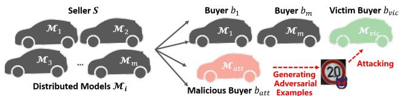
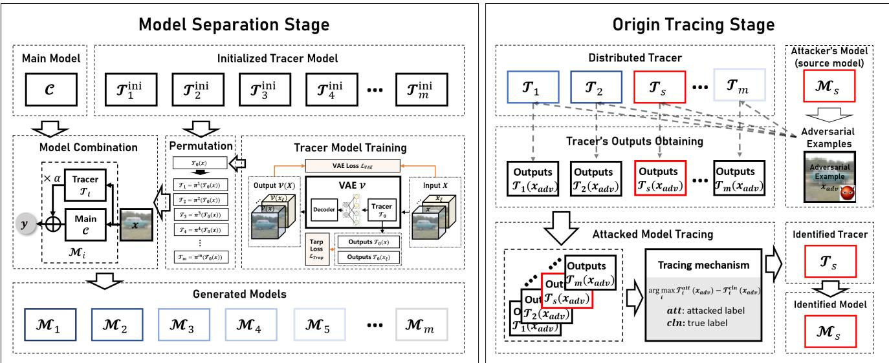
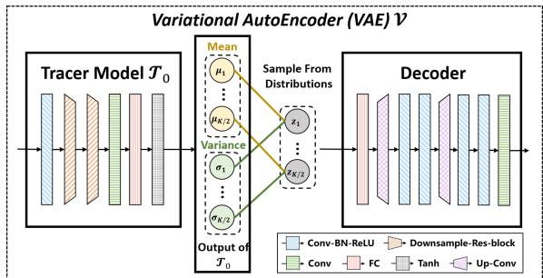
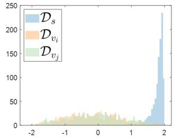
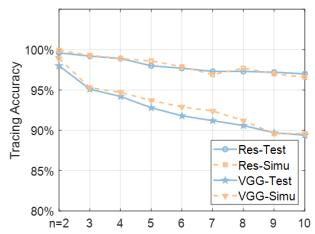

# Tracing the Origin of Adversarial Attack for Forensic Investigation and Deterrence

Han Fang1 Jiyi Zhang1 Yupeng Qiu1 Jiayang Liu1 Ke Xu2 Chengfang Fang2 Ee-Chien Chang1,\* 1National University of Singapore 2Huawei International

{fanghan, ljyljy}@nus.edu.sg {jiyizhang, qiu yupeng}@u.nus.edu {xuke64, fang.chengfang}@huawei.com changec@comp.nus.edu.sg

## Abstract

Deep neural networks are vulnerable to adversarial attacks. In this paper, we take the role of investigators who want to trace the attack and identify the source, that is, the particular model which the adversarial examples are generatedfrom. Techniques derived would aidforensic investigation ofattack incidents and serve as deterrence to potential attacks. We consider the buyers-seller setting where a machine learning model is to be distributed to various buyers and each buyer receives a slightly different copy with the same functionality. A malicious buyer generates adversarial examples from a particular copy M and uses them to attack other copies. From these adversarial examples, the investigator wants to identify the source M . To address this problem, we propose a two-stage separate-and-trace framework. The model separation stage generates multiple copies ofa modelfor the same classification task. This process injects unique features into each copy so that adversarial examples generated have distinct and traceablefeatures. We give a parallel structure which pairs a unique tracer with the original classification model in each copy and a variational autoencoder (VAE)-based training method to achieve this goal. The tracing stage takes in adversarial examples and afew candidate models, and identifies the likely source. Based on the unique features induced by the tracer, we could effectively trace the potential adversarial copy by considering the output logits from each tracer. Empirical results show that it is possible to trace the origin of the adversarial example and the mechanism can be applied to a wide range of architectures and datasets.

## 1. Introduction

Deep learning models are vulnerable to adversarial attacks. By introducing specific perturbations on input samples, the network model could be misled to give wrong predictions even when the perturbed sample looks visually close to the clean image [4,8,21,27]. There are many existing works on defending against such attacks [9, 12, 16, 20]. Unfortunately, although current defenses could mitigate the attack to some extent, the threat is still far from being completely eliminated. In this paper, we look into the forensic aspect: from the adversarial examples, can we determine which model the adversarial examples were generated from? Techniques derived could aid forensic investigation of attack incidents and provide deterrence to future attacks.

  
Figure 1: Buyers-seller setting. The seller has multiple models $\mathcal { M } _ { i } , i \in [ 1 , m ]$ that are to be distributed to different buyers. A malicious buyer $b _ { a t t }$ attempts to attack the victim buyers $b _ { v i c } s$ by generating the adversarial examples with his own model $\mathcal { M } _ { a t t }$

We consider a buyers-seller setting [28], which is similar to the buyers-seller setting in digital copyright protection [19].

Buyers-seller Setting. Under this setting, the seller S distributes m classification models $\mathcal { M } _ { i } , i \in [ 1 , m ]$ to different buyers $b _ { i } \mathrm { ^ { * } s }$ as shown in Fig. 1. These models are trained for a same classification task using a same training dataset. The models are made accessible to the buyer as black boxes, for instance, the models could be embedded in hardware such as FPGA and ASIC, or are provided in a Machine Learning as a Service (MLaaS) platform. Hence, the buyer only has black-box access, which means that he can only query the model for the hard label. In addition, we assume that the buyers do not know the training datasets. The seller has full knowledge and thus has white-box access to all the distributed models.

Attack and Traceability. A malicious buyer wants to attack other victim buyers. The malicious buyer does not have direct access to other models and thus generates the examples from his own model and then deploys the found examples. For example, the malicious buyer might generate an adversarial example of a road sign using its selfdriving vehicle, and then physically defaces the road sign to trick passing vehicles. Now, as forensic investigators who have obtained the defaced road sign, we want to understand where the adversarial example is generated from and trace the model used in generating the example.

Proposed Framework. There are two stages in our solution: model separation and origin tracing. During the model separation stage, given a classification task, we want to generate multiple models that have high accuracy on the classification task and yet are sufficiently different for tracing. In other words, we want to proactively enhance differences among the models in order to facilitate tracing. To achieve that, we propose a parallel network structure that pairs a unique tracer with the original classification model. The role of the tracer is to modify the output, so as to induce the attacker to generate adversarial examples with unique features. We give a variational autoencoder (VAE)-based training method for training the tracer.

During the tracing stage, given m different classification models $\mathcal { M } _ { i } , i \in [ 1 , m ]$ and the found adversarial example, we want to determine which model is most likely used in generating the adversarial example. This is achieved by exploiting the different tracers that are earlier embedded into the parallel models. Our proposed method compares the output logits of those tracers to identify the source.

In a certain sense, traceability is similar to neural network watermarking and can be viewed as a stronger form of watermarking. Neural network watermarking schemes [2] attempt to generate multiple models so that an investigator can trace the source of a modified copy. In traceability, the investigator can trace the source based on the generated adversarial examples.

## Contributions.

1. We point out a new aspect in defending against adversarial attacks, that is, tracing the origin of adversarial samples among multiple classifiers. Techniques derived would aid forensic investigation of attack incidents and provide deterrence to future attacks.

2. We propose a framework to achieve traceability in the buyers-seller setting. The framework consists of two stages: a model separation stage, and a tracing stage. The model separation stage generates multiple “wellseparated” models and this is achieved by a parallel network structure that pairs a tracer with the classifier. The tracing mechanism exploits the characteristics of the paired tracers to decide the origin of the given adversarial examples.

3. We investigate the effectiveness of the separation and the subsequent tracing. Experimental studies show that the proposed mechanism can effectively trace to the source. For example, the tracing accuracy achieves more than 97% when applying to “ResNet18-CIFAR10” task for 5 distributed models. We also observe a clear separation of the source tracer’s logits distribution, from the nonsource’s logits distribution (e.g. Fig. 4a).

## 2. Related Work

In this paper, we adopt black-box settings where the adversary can only query the model and get the hard label (final decision) of the output. Many existing attacks assume white-box settings. Attacks such as FGSM [8], PGD [16], JSMA [23], DeepFool [21], CW [4] and EAD [6] usually directly rely on the gradient information provided by the victim model. As the detailed information of the model is hidden in black-box settings, black-box attacks are often considered more difficult and there are fewer works. Chen et. al. introduced a black-box attack called Zeroth Order Optimization (ZOO) [7]. ZOO can approximate the gradients of the objective function with finite-difference numerical estimates by only querying the network model. Thus the approximated gradient is utilized to generate the adversarial examples. Guo et. al. proposed a simple black-box adversarial attack called “SimBA” [10] to generate adversarial examples with a set of orthogonal vectors. By testing the output logits with the added chosen vector, the optimization direction can be effectively found.

Brendel et. al. developed a decision-based adversarial attack which is known as “Boundary attack” [3], it worked by iteratively perturbing another initial image that belongs to a different label toward the decision boundaries between the original label and the adjacent label. By querying the model with enough perturbed images, the boundary, as well as the perturbation, can be found thus generating adversarial examples. Chen et. al. proposed another decisionbased attack named hop-skip-jump attack (HSJA) [5] recently. By only utilizing the binary information at the decision boundary and the Monte-Carlo estimation, the gradient direction of the network can be found so as to realize the adversarial examples generation. Based on [5], Li et. al. [17] proposed a query-efficient boundary-based black-box attack named QEBA which estimate the gradient of the boundary in several transformed space and effectively reduce the query numbers in generating the adversarial examples. Maho et. al. [18] proposed a surrogatefree black-box attack which does not estimate the gradient but searches the boundary based on polar coordinates, compared with [5] and [17], [18] achieves less distortion with fewer query numbers.

  
Figure 2: The framework of the proposed method. The left part of the framework indicates the separation process of the seller’s distributed models $\mathcal { M } _ { i } , i \in [ 1 , m ]$ . The right part of the framework illustrates the origin tracing process.

## 3. Proposed Framework

## 3.1. Main Idea

Considering that black-box adversarial attacks are performed by estimating and attacking across the boundary of the model, for the purpose of tracing, each distributed model should maintain different boundaries, besides, a unique feature of the source boundary should be carried on the generated adversarial example.

To achieve this goal, two essential questions should be addressed: Q1. How to generate multiple models with different boundaries while remaining highly accurate on the classification task? Q2. How to inject the unique features of the source boundary during the black-box adversarial attack process?

Tackling these two questions at the same time is not a trivial task, especially for Q2, where the black-box adversarial attack method is unknown to us (the defender). In this paper, we designed a parallel-network-based method to meet the requirements, where the basic component of the model is a paralleled structure that pairs a unique network named tracer with the original classifier. The tracer could effectively fluctuate the boundary and inject unique features during the attack. Such features could be further reflected by the output logits of the tracer.

The proposed framework contains two main stages: the model separation stage and the origin tracing stage, as illustrated in Fig.2. During the model separation stage, we want to generate multiple models which are sufficiently different under adversarial attack while remaining highly accurate on the classification task. As for origin tracing, we exploit unique features of different tracers in the parallel structure, which can be observed in the tracers’ logits. Hence, our tracing process is conducted by feeding the adversarial examples into the tracers and analyzing their output.

## 3.2. Model Separation

One goal of model separation is to generate m distributed models $\mathcal { M } _ { i } , i \in [ 1 , m ]$ with similar classification functions but different boundaries. To achieve this goal, we design a parallel network structure, which contains a tracer model $\mathcal { T } _ { i } , i \in [ 1 , m ]$ and a main model ${ \mathcal { C } } ,$ as shown in Fig. 2. C is the network trained for the original task. Each $\mathcal { T } _ { i }$ is used for fluctuating the boundaries of $\mathcal { C } .$ . The final results are determined by both C and each $\mathcal { T } _ { i }$ with a weight parameter $\alpha .$ The specific workflow of each specific $\mathcal { M } _ { i }$ can be described as: For input image $x , \ \mathcal { T } _ { i }$ and $\mathcal { C }$ both receive the same x and output two different vectors $\mathcal { T } _ { i } ( x )$ and $\mathcal C ( x )$ respectively. $\mathcal { T } _ { i } ( x )$ and $\mathcal C ( x )$ have the same size and will be further added in a weighted way to generate the final outputs $\mathcal { M } _ { i } ( x )$ , as shown in Eq. 1.

$$
\mathcal { M } _ { i } ( x ) = \mathcal { C } ( x ) + \alpha \times \mathcal { T } _ { i } ( x )\tag{1}
$$

where α is the weight parameter that controls the weight of $\mathcal { T } _ { i }$ in the final results. The output value of each $\mathcal { T } _ { i }$ ranges from [-1,1] and the output value of $\mathcal C ( x )$ is normalized into [0,1]. In each $\mathcal { M } _ { i } , \mathcal { C }$ is fixed and only $\mathcal { T } _ { i }$ is different. For the main classification task, C only has to be trained once. $\mathcal { C }$ and $\mathcal { T } _ { i } ^ { \cdot } \mathrm { s }$ are trained separately. Training of $\mathcal { T } _ { i } ^ { \cdot } \mathrm { s }$ has access to some data with similar domain of $\mathcal { C } .$

In addition to the goal of fluctuating the boundaries, $\mathcal { T } _ { i }$ also takes the responsibility of injecting unique features during attacks, where the source tracer $\mathcal { T } _ { s }$ should give unique responses on the adversarial examples.

## 3.2.1 $\mathcal { T } _ { 0 }$ generation

We can treat each $\mathcal { T } _ { i }$ as a classifier of K classes where $K$ is the number of classes of $\mathcal { C } .$

Requirements: The goals of $\mathcal { T } _ { i }$ are to induce different boundaries among the $\mathcal { M } _ { i } { ^ \mathrm { { ? } s } }$ . Intuitively, the tracers should meet the following requirements:

1. Each $\mathcal { T } _ { i }$ is easier to be attacked than C.

2. The $T _ { i } { ' } s$ have a similar feature space as $\mathcal { C } .$

3. The classes in each $\mathcal { T } _ { i }$ do not overlap with classes in $\mathcal { C } .$ Recap that the adversarial attack perturbs the clean input so as to cross boundaries of $\mathcal { M } _ { i }$ . Both $\mathcal { T } _ { i }$ and $\mathcal { C }$ would contribute to the perturbation. If $\mathcal { T } _ { i }$ is easier to be attacked, $\mathcal { T } _ { i }$ would contribute more to the perturbation and thus induce tracer’s features to the adversarial example. Hence, we have the first requirement, which lurks the adversarial attack toward the features of the tracer. The second requirement ensures the same feature space of each $\mathcal { T } _ { i }$ and ${ \mathcal { C } } ,$ , such that the feature-based attack of $\mathcal { C }$ can also work on $\tau _ { i }$ . The last requirement requires the boundaries of $\mathcal { T } _ { i }$ and $\mathcal { C }$ are not overlapped, which makes sure the perturbations of $\mathcal { T } _ { i }$ and $\mathcal { C }$ will not significantly interfere each other.

Method: There are many ways of designing $\mathcal { T } _ { i } ^ { \cdot } \mathrm { s } ,$ in this paper, we propose a simple but effective method, which first obtains a $\mathcal { T } _ { 0 }$ by a variational autoencoder (VAE)-based training method, then uses a perturbation-based method to separate each $\mathcal { T } _ { i }$ with the well-trained $\mathcal { T } _ { 0 }$ . Specifically, as shown in Fig. 3, $\mathcal { T } _ { 0 }$ is the encoder part of a VAE V, which is linearly cascaded with one “SingleConv” block (Conv-BN-ReLU), two “Res-block” [11], one “Conv” block, one full connection block and one “Tanh” activation layer. For the decoder part of the VAE, it consists of three “Double-Conv” block (2-“SingleConv”), two “up-conv” (UpSample-Conv-BN-ReLU) one “Conv” block and one full connection block. The training process of $\mathcal { T } _ { 0 }$ can be described as:

1) Given $\nu$ and the image $x \in \mathbb { R } ^ { B \times C \times H \times W }$ from the training dataset of ${ \mathcal { C } } ,$ we first initialize V with random parameters.

2) For each training epoch, we add random noise $\xi$ 1 on the input images x to generate the noised image $\boldsymbol { x } _ { \xi } \in \mathbb { R } ^ { B \times C \times H \times W }$ , where B indicates the batch size and $\dot { C } \times H \times W$ represents the size of the image.

  
Figure 3: The architecture of VAE V and tracer $\mathcal { T } _ { 0 }$

3) Then we concatenate x and $x _ { \xi }$ in batch-dimension (denoted as $X ~ \in ~ \mathbb { R } ^ { 2 \dot { B } \times C \times H \times W } ~ )$ and feed them into V to get the outputs $\mathcal { V } ( X ) \ \in \ \mathbb { R } ^ { 2 \dot { B } \times C \times H \times W }$ and ${ \mathcal { T } } _ { 0 } ( X ) ~ \in$ $\mathbb { R } ^ { 2 \dot { B } \times K }$ , where K is the number of classes. $\mathcal { T } _ { 0 } ( X )$ can be split in the batch-dimension to $\mathcal { T } _ { 0 } ( x ) ~ \in ~ \mathbb { R } ^ { B \times K }$ and $\mathcal { T } _ { 0 } ( \bar { x _ { \xi } } ) ~ \in ~ \mathbb { R } ^ { B \times K }$ . Besides, same as the traditional VAE training, $\mathcal { T } _ { 0 } ( X )$ also should be divided into two parts in another dimension $\mu \in \mathbb { R } ^ { 2 \dot { B } \times K / 2 }$ and $\sigma \in \mathbb { R } ^ { 2 \dot { B } \times K / 2 }$ , aiming for providing the mean and the variance for sampling the latent variables $Z \in \mathbb { R } ^ { 2 \dot { B } \times K / 2 }$ , which is the input of the decoder.

The whole loss function of V can be written as:

$$
\mathcal { L } = \lambda \mathcal { L } _ { V A E } + \mathcal { L } _ { T r a p }\tag{2}
$$

where

$$
\begin{array} { r l } & { \mathcal { L } _ { V A E } = \mathcal { L } _ { c o n } + \mathcal { L } _ { K L } } \\ & { \qquad = \| \mathcal { V } ( X ) - X \| _ { 2 } + K L ( \mathbb { N } ( \mu , \sigma ^ { 2 } ) \| \mathbb { N } ( 0 , 1 ) ) } \end{array}\tag{3}
$$

and

$$
\mathcal { L } _ { T r a p } = \frac { \mathcal { T } _ { 0 } ( x ) \otimes \mathcal { T } _ { 0 } ( x _ { \xi } ) } { \Vert \mathcal { T } _ { 0 } ( x ) \Vert _ { 2 } \Vert \mathcal { T } _ { 0 } ( x _ { \xi } ) \Vert _ { 2 } } - \cos ( \theta )\tag{4}
$$

∥∥ indicates the mean square error loss and $K L$ indicates the Kullback-Leibler divergence. ⊗ represents the Hadamard product. λ is the parameter to control the weight of $\mathcal { L } _ { V A E }$ , which is set as 0.001. θ is the parameter that controls the cosine similarity of $\mathcal { T } _ { 0 } ( x )$ and $\mathcal { T } _ { 0 } ( x _ { \xi } )$ . The selection and influence of θ will be discussed in Section 5.1.

## 3.2.2 Ti Separation

From ${ \mathcal { T } } _ { 0 } .$ , we want to generation $\mathcal { T } _ { i } , i \in [ 1 , m ]$ . In order to realize tracing, each distributed $\mathcal { T } _ { i }$ for different buyers should maintain different boundaries so that the adversarial perturbation of the e itn $i ^ { t h }$ copy will not produce the same output logits on the $j ^ { t h }$ copy. So we proposed a permutationbased method:

$$
{ \mathcal T } _ { i } ( x ) = \pi _ { i } ( { \mathcal T } _ { 0 } ( x ) )\tag{5}
$$

where $\pi _ { i }$ indicates the $i ^ { t h }$ permutation, x indicates the input images. π should satisfy: No two permutations “overlap” more than u elements, where u is a pre-defined constant. That is, for any two permutations, say $\pi _ { i }$ and $\pi _ { j }$

$$
\left| \{ k | \pi _ { i } ( k ) = \pi _ { j } ( k ) \} _ { k = 1 } ^ { K } \right| \le u
$$

where K indicates the number of classes. When u is small, the accuracy of tracing would improve, but trade-off with smaller possible copy numbers. In our experiment, we choose u=1. To illustrate the permutation, we give an example: assume $\mathcal { T } _ { 0 }$ is a four-class classifier, a possible permutation could be $\pi _ { i } ~ = ~ ( 1 , 2 , 3 , 4 ) ~  ~ ( 2 , 3 , 4 , 1 )$ , and $\pi _ { j } = ( 1 , 2 , 3 , 4 )  ( 3 , 4 , 1 , 2 )$

Discussion: To say how our training method meets the requirement, we give the following analysis. For the first requirement, it is satisfied by the trap loss $\mathcal { L } _ { T r a p } .$ . Through Eq. 4 we can see when $\theta = 9 0 ^ { \circ } , \mathcal { T } _ { 0 } ( x )$ and $\tau _ { 0 } ( x _ { \xi } )$ will be orthogonal, which means $\tau _ { 0 } ( x )$ will be significantly different from $\tau _ { 0 } ( x _ { \xi } )$ . Hence by setting appropriate $\theta ,$ we could guarantee that the output of $\mathcal { T } _ { 0 }$ is easy to be changed by small noise, such that $\mathcal { T } _ { 0 }$ is easy to be attacked to cross the boundary. Training $\mathcal { T } _ { 0 } ( X )$ with the same distribution of training dataset of C satisfies the second requirement. As for the third requirement, it is satisfied by the loss function of Eq. 3. Through training, $\mathcal { T } _ { 0 }$ could effectively squeeze the feature of a single image into a K-dimension vector, where each dimension can be regarded as a class, and such classification criterion is not based on the original classification task but on the VAE reconstruction task. So the classes in $\mathcal { T } _ { 0 }$ do not overlap with classes in $\mathcal { C } .$ Besides, the permutationbased method will not influence the properties of ${ \mathcal { T } } _ { 0 } ,$ , so each $\mathcal { T } _ { i }$ will satisfy these three requirements.

## 3.3. Tracing the Origin

Given an adversarial example $x _ { a d v }$ , which is obtained by attacking one of m copies, we want to trace/determine which copy it is derived from. w.l.o.g., let us assume that the m copies are $\mathcal { M } _ { 1 } , \mathcal { M } _ { 2 } , . . . , \mathcal { M } _ { m }$ . By earlier argument in section 3.2.1, the adversarial perturbations would be contributed more by the tracer compared to the classifier. Hence, we propose the following logits-based tracing mechanism:

1) Given an appeared adversarial example denoted as $x _ { a d v } ,$ we feed $x _ { a d v }$ into all $\mathcal { M } _ { i } , i \in \{ 1 , m \}$ and obtain the output logits of $\mathcal { M } _ { i }$ and $\mathcal { T } _ { i } ,$ noted as $\mathcal { M } _ { i } ( x _ { a d v } ) , T _ { i } ( x _ { a d v } ) , i \in [ 1 , m ]$

2) Then we sort $\mathcal { M } _ { i } ( x _ { a d v } )$ and take out the index corresponding to the first sort noted as att and second sort noted as cln, att indicates the potential attack label and cln indicates the potential clean label.

3) We obtain the outputs of ${ \mathcal { T } } _ { i } ( x _ { a d v } )$ corresponded to the label att and $c l n$ , denoted as $\mathcal { T } _ { i } ( x _ { a d v } ) [ a t t ]$ and ${ \mathcal { T } } _ { i } ( x _ { a d v } ) [ c l n ]$

4) The source model can be determined by:

$$
s = \underset { i , i \in [ 1 , m ] } { \arg \operatorname* { m a x } } ( \mathcal { T } _ { i } ( x _ { a d v } ) [ a t t ] - \mathcal { T } _ { i } ( x _ { a d v } ) [ c l n ] )\tag{6}
$$

To simplify the description, we denote the difference of output logits $( { \mathcal { T } } _ { i } ( x _ { a d v } ) [ a t t ] - { \mathcal { T } } _ { i } ( x _ { a d v } ) [ c l n ] )$ as DOL. The tracer corresponding to the largest DOL is identified as the source model.

## 4. Experimental Results

## 4.1. Implementation Details

In order to show the effectiveness of the proposed framework, we perform the experiments on two network architectures (ResNet18 [11] and VGG16 [25]) with two small image datasets (CIFAR10 [15] of 10 classes and GTSRB [13] of 43 classes) and two deeper network architecture (ResNet50 and VGG19) with one big image dataset (mini-ImageNet [24] of 100 classes). The main classifier C in experiments is trained for 200 epochs. All the model training is implemented by $\mathrm { P y } ^ { \prime }$ Torch and executed on NVIDIA RTX 2080ti. For gradient descent, Adam [14] with learning rate of 1e-4 is applied as the optimization method.

## 4.2. The Classification Accuracy of The Proposed Architecture

The most influenced parameter for the classification accuracy is the weight parameter α. α determines the participation ratio of $\mathcal { T } _ { i }$ in final outputs. To investigate the influence of $\alpha ,$ we change the value of α from 0 (baseline) to 0.2 and record the corresponding classification accuracy of each task, the results are shown in Table 1.

<table><tr><td rowspan="2">α</td><td colspan="2">CIFAR10</td><td colspan="2">GTSRB</td><td colspan="2">Mini-ImageNet</td></tr><tr><td>ResNet18</td><td>VGG16</td><td>ResNet18</td><td>VGG16</td><td>ResNet50</td><td>VGG19</td></tr><tr><td>0</td><td>94.30%</td><td>93.68%</td><td>96.19%</td><td>97.59%</td><td>81.81%</td><td>75.81%</td></tr><tr><td>0.05</td><td>94.24%</td><td>93.64%</td><td>96.14%</td><td>97.52%</td><td>81.73%</td><td>75.80%</td></tr><tr><td>0.1</td><td>94.24%</td><td>93.63%</td><td>96.07%</td><td>97.36%</td><td>81.56%</td><td>75.75%</td></tr><tr><td>0.15</td><td>94.07%</td><td>93.63%</td><td>95.72%</td><td>96.84%</td><td>81.52%</td><td>75.73%</td></tr><tr><td>0.2</td><td>93.95%</td><td>93.57%</td><td>95.09%</td><td>95.52%</td><td>81.38%</td><td>75.70%</td></tr></table>

Table 1: The classification accuracy with different $\alpha$

It can be seen from Table 1 that for all the classification tasks, the growth of α will seldom decrease the accuracy of the classification task. Compared with the baseline $( \alpha = 0 )$ , when α is in the range of 0.05 to 0.15, the reduction in classification accuracy will not exceed 1%. But when $\alpha = 0 . 2$ the accuracy decrease of the dataset “GTSRB” is more than 1%. We intended the influence of α on classification accuracy to be as small as possible, so the subsequent experiments are completed with $\alpha = \{ 0 . 0 5 , 0 . 1 , 0 . 1 5 \}$

## 4.3. Traceability of different black-box attack

Setup and Code. To verify the traceability of the proposed mechanism, we conduct experiments on 5 distributed models $\mathcal { M } _ { i } , i \in [ 1 , 5 ]$ . All the tracers of $\mathcal { M } _ { i }$ are generated with the permutation-based method with a well-trained ${ \mathcal { T } } _ { 0 } .$ and $\mathcal { T } _ { 0 }$ is trained with $\theta \ : = \ : 7 5 ^ { \circ }$ for 400 epochs. We set one model as the source model $\mathcal { M } _ { \varepsilon }$ to perform the adversarial attack and set the other models as the victim models $\mathcal { M } _ { v _ { i } } , i \in [ 1 , 5 ] \backslash s$ , where the tracer of $\mathcal { M } _ { s }$ and $\mathcal { M } _ { v _ { i } }$ are denoted as $\mathcal { T } _ { s }$ and $\mathcal { T } _ { v _ { i } }$ . The goal is to test whether the proposed scheme can effectively trace the source model from the generated adversarial examples. The black-box attack we choose is Boundary [3], HSJA [5], QEBA [17] and SurFree [18]. For Boundary [3] and HSJA [5], we use Adversarial Robustness Toolbox (ART) [22] platform to conduct the experiments. For QEBA [17] and SurFree [18], we pull implementations from their respective GitHub repositories $2 ^ { \bullet } 3$ with default parameters. For each $\alpha ,$ each network architecture, each dataset and each attack, we generate 1000 successfully attacked adversarial examples of $\mathcal { M } _ { \varepsilon }$ and conduct the tracing experiment.

Evaluation Metrics. Traceability is evaluated by the successful tracing accuracy, which is calculated by:

$$
\mathrm { A c c } \ = \frac { N _ { \mathrm { c o r r e c t } } } { N _ { \mathrm { A l l } } }\tag{7}
$$

where $N _ { \mathrm { c o r r e c t } }$ indicates the number of correct-tracing samples and $N _ { \mathrm { A l l } }$ indicates the total number of samples, which is set as 1000 in the experiments. The tracing performance of different attacks with different settings is shown in Table $2 .$

The influence of $\alpha .$ We can see from Table 2 that the tracing accuracy increases with the increase of $\alpha .$ We conclude the reason as: α determines the participation rate of tracer $\mathcal { T } _ { i }$ in final output logits, the larger α will make the final decision boundary rely more on $\mathcal { T } _ { i } .$ Therefore, when α gets larger, the DOL of $\mathcal { T } _ { i }$ is more likely to be pushed larger, thus leading to better tracing performance.

The influence of network architecture. The tracing results vary with different networks and different datasets. With the same dataset, the tracing accuracy of ResNet18 will be higher than that of VGG16. We attribute the reason to the complexity of the model architecture. According to [26], compared with ResNet, the structure of VGG is less robust, so VGG-based C might be easier to be adversarially attacked. Therefore, once $\mathcal { C }$ is attacked, there is a certain probability that $\mathcal { T } _ { i }$ is not attacked as we expected, so the DOL of $\mathcal { T } _ { i }$ will not produce the expected features for tracing. Fortunately, the network architecture can be designed by us, so in practice, choosing a robust architecture of $\mathcal { C }$ would be better for tracing.

The influence of classification task. In our experiments, we test the classification task with the different numbers of classes. It can be seen that with the increase in classification task complexity, traceability performance decreases slightly. But when $\alpha = 0 . 1 5$ , the traceability ability can still reach more than 94% in most cases.

The influence of black-box attack. The mechanism of the black-box attack greatly influences the tracing performance. For Boundary attack [3], HSJA [5] and QEBA [17], the tracing accuracy shows similar results, but for SurFree [18], the tracing accuracy will be worse than that of the other attacks. The reason is that Boundary attack, HSJA, QEBA are gradient-estimation-based attacks, which try to use random noise to estimate the gradient of the network and further attack along the gradient. Since the gradient is highly related to $\textstyle { \mathcal { T } } _ { i } ,$ , such attacks are more likely to be trapped by $\tau _ { i } .$ . But SurFree [18] is attacking based on geometric characteristics of the boundary, which may ignore the trap of $\mathcal { T } _ { i }$ especially when α is small. So compared with Boundary attack, HSJA and QEBA, the proposed mechanism may get slightly worse performance when facing SurFree attack.

## 4.4. The influence of distributed copy numbers

It can be expected that as the number of distributed copies increases, the differences between different boundaries will become less and less, making it more difficult to complete the tracing. In this section, we mainly discuss how traceability will evolve with the number of copies.

Since we ensure that each $\mathcal { T } _ { i }$ maintains different boundaries, when feeding the adversarial examples, we have the following assumption: the DOL of $\mathcal { T } _ { s }$ and that of $\mathcal { T } _ { v _ { i } }$ should follow different distributions, and the DOL of each $\mathcal { T } _ { v _ { i } }$ should follow a similar distribution.

Distribution: In order to verify the correctness of the assumption, we perform the following experiments. We use “ResNet” as the backbone and QEBA [17] as the attack method. The datasets we test are CIFAR10, GTSRB and MiniImageNet. $\alpha$ is fixed as 0.15. For each task, We first generate 10 different $\mathcal { T } _ { i }$ according to the permutation-based method, then randomly choose one as the source model $\mathcal { M } _ { s }$ to generate the adversarial examples. Then we feed the adversarial examples on each $\mathcal { T } _ { i }$ and record the distribution of the resulting DOL of the source tracer and victim tracers (denoted as Ds and $\mathbb { D } _ { v _ { i } } , i \in [ 1 , 9 ] )$ . We perform the Kolmogorov-Smirnov test between every two possible $\mathbb { D } _ { v _ { i } } , \mathbb { D } _ { v _ { j } } i , j \in [ 1 , 9 ] , i \neq j$ and between $\mathbb { D } _ { s }$ and $\mathbb { D } _ { v _ { i } }$ . Then we record Kolmogorov’s D statistic (larger values indicate larger differences) to measure the similarity of these distributions. Results are shown in Table 3.

$\{ \mathbb { D } _ { s } , \mathbb { D } _ { v _ { i } } \}$ indicates the Kolmogorov’s D statistic (KD) value between $\mathbb { D } _ { s }$ and $\mathbb { D } _ { v _ { i } }$ where $\{ \mathbb { D } _ { v _ { i } } , \mathbb { D } _ { v _ { j } } \}$ indicates the mean KD value between $\mathbb { D } _ { v _ { i } }$ and $\mathbb { D } _ { v _ { j } }$ . It can be seen that

<table><tr><td colspan="2">Attack</td><td colspan="3">Boundary</td><td colspan="3">HSJA</td><td colspan="3">QEBA</td><td colspan="3">SurFree</td></tr><tr><td colspan="2">alpha</td><td>0.05</td><td>0.1</td><td>0.15</td><td>0.05</td><td>0.1</td><td>0.15</td><td>0.05</td><td>0.1</td><td>0.15</td><td>0.05</td><td>0.1</td><td>0.15</td></tr><tr><td rowspan="2">CIFAR10</td><td>ResNet18</td><td>97.3%</td><td>97.4%</td><td>98.0%</td><td>95.2%</td><td>97.3%</td><td>97.5%</td><td>94.4%</td><td>97.1%</td><td>98.0%</td><td>83.3%.</td><td>92.3%</td><td>95.9 %</td></tr><tr><td>VGG16</td><td>85.7%</td><td>96.1%</td><td>97.8%</td><td>87.3%</td><td>88.9%</td><td>90.2%</td><td>73.1%</td><td>90.5%</td><td>92.8%</td><td>70.0%</td><td>87.8%</td><td>94.2%</td></tr><tr><td rowspan="2">GTSRB</td><td>ResNet18 VGG16</td><td>87.3%</td><td>94.2%</td><td>95.7%</td><td>87.3%</td><td>92.5%</td><td>96.4%</td><td>84.7%</td><td>95.3%</td><td>96.7%</td><td>77.8%</td><td>92.1%</td><td>94.7%</td></tr><tr><td></td><td>89.3%</td><td>93.9%</td><td>95.6%</td><td>88.9%</td><td>92.7%</td><td>95.2%</td><td>81.0%</td><td>91.8%</td><td>95.6%</td><td>81.4%</td><td>92.8%</td><td>94.0%</td></tr><tr><td rowspan="2">mini-ImageNet</td><td>ResNet50</td><td>89.9%</td><td>93.4%</td><td>94.5%</td><td>89.4%</td><td>93.7%</td><td>94.2%</td><td>89.0%</td><td>94.4%</td><td>96.4%</td><td>85.1%</td><td>92.5%</td><td>93.3%</td></tr><tr><td>VGG19</td><td>80.6 %</td><td>91.0 %</td><td>93.4%</td><td>81.7 %</td><td>89.3 %</td><td>90.7%</td><td>80.6%</td><td>88.6%</td><td>92.7 %</td><td>85.7%</td><td>90.7%</td><td>93.3%</td></tr></table>

Table 2: The trace accuracy of different attacks.
<table><tr><td rowspan="2">KD</td><td colspan="2">CIFAR10</td><td colspan="2">GTSRB</td><td colspan="2">Mini-ImageNet</td></tr><tr><td>ResNet18</td><td>VGG16</td><td>ResNet18</td><td>VGG16</td><td>ResNet50</td><td>VGG19</td></tr><tr><td> $\{ \mathbb { D } _ { s } , \mathbb { D } _ { v _ { i } } \}$ </td><td>0.925</td><td>0.818</td><td>0.850</td><td>0.807</td><td>0.873</td><td>0.821</td></tr><tr><td> $\{ \mathbb { D } _ { v _ { i } } , \mathbb { D } _ { v _ { j } } \}$ </td><td>0.040</td><td>0.047</td><td>0.034</td><td>0.051</td><td>0.063</td><td>0.092</td></tr></table>

Table 3: The Kolmogorov’s D statistic of $\mathbb { D } _ { s }$ and D $^ ) { } v _ { i }$

  
(a) The distribution of DOL with task(b) The tracing results of multiple mod-“ResNet-CIFAR10”. els with dataset “CIFAR10”.

Figure 4: The distribution of DOL and tracing performance of multiple branches.

for all the tasks, the KD value between $\mathbb { D } _ { s }$ and $\mathbb { D } _ { v _ { i } }$ is large, which indicates that $\mathbb { D } _ { s }$ and $\mathbb { D } _ { v _ { i } }$ follows the different distribution. Meanwhile, the KD value between different $\mathbb { D } _ { v _ { i } }$ is small, which means that each $\mathbb { D } _ { v _ { i } }$ follows the same distribution. Besides, we also visually show $\mathbb { D } _ { s }$ and two random selected $\mathbb { D } _ { v _ { i } }$ and $\mathbb { D } _ { v _ { j } }$ with “ResNet-CIFAR10” task in Fig. 4a for better illustration.

Tracing Rate Estimation: Since $\mathbb { D } _ { s }$ and $\mathbb { D } _ { v _ { i } }$ follows the different distribution and $\mathbb { D } _ { v _ { i } }$ and $\mathbb { D } _ { v _ { j } }$ follows the same distribution, we could effectively estimate the tracing performance of m distributed copies by Monte-Carlo sampling based on $\mathbb { D } _ { s }$ and one random selected $\mathbb { D } _ { v _ { i } }$ . We have conducted experiments to evaluate the performance of such estimation on $n , n \in [ 2 ,$ , 10] copies. Specifically, for n tracers, we take one sample $S _ { s }$ from $\mathbb { D } _ { s }$ and $n - 1$ samples $\mathbb { S } _ { v } ^ { n - 1 }$ from $\mathbb { D } _ { v _ { i } }$ . Such sampling is repeated 1000 times. For each sampling, if $S _ { s } > m a x ( \mathbb { S } _ { v } ^ { n - 1 } )$ , we consider it as a successful tracing sample. We record the total number of successful tracing samples $N _ { C } ^ { n }$ in 1000 samplings. The final tracing accuracy of n models can be calculated with $N _ { C } ^ { n } / 1 0 0 0$

The results are shown in Fig. 4b. It can be seen that with the increasing number of distributed copies, the tracing accuracy gradually decreases. But with 10 branches, it can still maintain more than 96% accuracy for “ResNet-CIFAR10”. Besides, the estimated tracing performance is almost the same as the actual experiment results, which indicates the correctness of our analysis. Therefore, the tracing performance of a large number of copies could be effectively estimated by $\mathbb { D } _ { s }$ and $\mathbb { D } _ { v _ { i } }$ . The results of GTSRB and mini-ImageNet are shown in the supplementary material.

Besides, since the valid copy numbers with the permutation-based method are $K \times ( K - 1 )$ when $u = 1$ which is limited when K is small, we also provide a possible way to enlarge the number by scrambling the input of $\textstyle { \mathcal { T } } _ { i } ,$ such a method is illustrated in the supplementary material.

## 5. Discussion

## 5.1. The influence of θ

In this section, we will introduce the influence of parameter θ on tracing accuracy. As shown in Eq. 4, θ controls the cosine similarity between $\tau _ { 0 } ( x )$ and $\tau _ { 0 } ( x _ { \xi } )$ . A larger θ will lead to larger output changes of $\mathcal { T } _ { 0 }$ when facing a certain $\xi ,$ which may make $\mathcal { T } _ { 0 }$ to be more vulnerable to attack. But θ should not be as large as possible too, because training with larger θ may on the other hand make $\mathcal { T } _ { 0 }$ change too heavily with ξ, which is also not conducive to inducing adversarial attacks to find the best perturbations of $\mathcal { T } _ { 0 }$ . To illustrate the influence of $\theta ,$ we conduct the following experiments.

We use the task of $\mathrm { ^ { * } R e s N e t - C I F A R 1 0 ^ { , } }$ , the attack of QEBA [17], and train $\mathcal { T } _ { 0 }$ with different θ to show the specific tracing results on 5 copies. α is set as 0.15. θ is chosen from $1 5 ^ { \circ }$ to $9 0 °$ with an interval $1 5 ^ { \circ }$ . The results are shown in Table 4. It can be seen that when θ ranges from $1 5 ^ { \circ }$ to

<table><tr><td>θ</td><td> $1 5 ^ { \circ }$ </td><td> $3 0 ^ { \circ }$ </td><td> $4 5 ^ { \circ }$ </td><td> $6 0 ^ { \circ }$ </td><td> $7 5 ^ { \circ }$ </td><td> $9 0 °$ </td></tr><tr><td> $_ \mathrm { A c c }$ </td><td>31.8%</td><td>80.0%</td><td>94.5%</td><td>95.1%</td><td>98.0%</td><td>95.0%</td></tr></table>

Table 4: The trace accuracy of different θ.

$7 5 ^ { \circ }$ , the tracing accuracy increases as the θ increases, but for $\theta = 9 0 ^ { \circ }$ , the tracing accuracy is lower than $\theta = 7 5 ^ { \circ }$ which justify our analysis. Finding the best θ for training could be an interesting problem, but in this paper, we focus more on evaluating the possibility of tracing, so we utilize $\theta = 7 5 ^ { \circ }$ as the experimental parameters.

## 5.2. Non-transferability and traceability

The concept of traceability is related to but not equivalent to non-transferability. A non-transferable adversarial example works only on the model it is generated from. Therefore, tracing such an example may be a straightforward task. On the other hand, a transferable sample may be generic enough to work on many copies/models. The task of tracing becomes more meaningful in this scenario. Our traceability towards the transferable example demonstrates that the process of adversarial attack introduces distinct and unique traceable features to the source model. In this sense, traceability can serve as a fail-safe property in defending against adversarial attacks. There are many defense methods that can satisfy non-transferability, but once the defense fails, the model will not be effectively protected. But our experimental results show that for the proposed method, even if the defense fails, we still have a certain probability to trace the attacked model, as shown in Table 5. We use “ResNet-CIFAR $1 0 ^ { \circ }$ task with HSJA [5] and QEBA [17] as examples to show the specific tracing results on 5 copies.

<table><tr><td>Attack</td><td>α</td><td>NTr</td><td>NTr(+)</td><td>Tr</td><td>Tr(+)</td><td>Tr Rate</td><td>Total Rate</td></tr><tr><td rowspan="3">HSJA</td><td>0.05</td><td>314</td><td>314</td><td>686</td><td>638</td><td>93.00%</td><td>95.20%</td></tr><tr><td>0.1</td><td>746</td><td>746</td><td>254</td><td>229</td><td>90.16%</td><td>97.50%</td></tr><tr><td>0.15</td><td>892</td><td>892</td><td>108</td><td>81</td><td>75.00%</td><td>97.30%</td></tr><tr><td rowspan="3">QEBA</td><td>0.05</td><td>692</td><td>692</td><td>308</td><td>252</td><td>81.82%</td><td>94.40%</td></tr><tr><td>0.1</td><td>682</td><td>682</td><td>318</td><td>289</td><td>90.88%</td><td>97.10%</td></tr><tr><td>0.15</td><td>658</td><td>658</td><td>342</td><td>322</td><td>94.15%</td><td>98.00%</td></tr></table>

Table 5: Results of transferable/non-transferable samples.

In Table 5, NTr and Tr indicate the number of nontransferrable samples and transferrable samples respectively. NTr(+) and Tr(+) indicate the number of successful tracing samples of NTr and Tr. We can see that for QEBA with $\alpha \ : = \ : 0 . 1$ and 0.15, the traceability to transferrable samples is all keep at a high level which is greater than 90%. As for HSJA, when $\alpha = 0 . 0 5$ , 686 samples can be transferred, and the traceability of transferrable examples achieves 93.00%. Although the traceability of transferrable examples decreases to 75.00% when $\alpha = 0 . 1 5$ , only 108 samples are transferrable, which is much less compared to QEBA. So the total tracing rate is still at a high level of 97.30%. In general, the proposed method shows superior overall traceability and especially great tracing performance on transferrable samples.

## 5.3. Adaptive attacks & defense

In the buyers-seller setting, we assume only one buyer is a potential attacker, so the adversarial attack can only be conducted with 1 distributed model. However, if multiple buyers are the attackers, they could use multiple models to conduct the adaptive collusion attack.

Collusion attack: Assume the attacker can access multiple models, $e . g .$ two models $\mathcal { M } _ { 1 }$ and $\mathcal { M } _ { 2 }$ , he can generate the adversarial examples by iteratively attacking $\mathcal { M } _ { 1 }$ and $\mathcal { M } _ { 2 } .$ , and ensure the adversarial example works both on these two models. Such a combined model may offset the trap of $\mathcal { T } _ { 1 }$ and $\mathcal { T } _ { 2 }$ and make the attack focus more on the boundary of $\mathcal { C } .$ . Therefore, the generated adversarial examples will not carry much expected features of $\mathcal { T } _ { 1 }$ and $\mathcal { T } _ { 2 }$ thus causing troubles in tracing.

Adaptive Defense: One way to mitigate such attacks is making $\mathcal { C }$ in each $\mathcal { M } _ { i }$ slightly different. For example, we could make each $\mathcal { C } _ { i }$ maintain a different gradient direction by setting gradient-orthogonal loss [1]. Therefore, each $\mathcal { C } _ { i }$ maintains different boundaries, so the boundary of the combined model (e.g. $\mathcal { C } _ { 1 }$ and $\mathcal { C } _ { 2 } )$ will not same as the boundary of other models $\mathcal { C } _ { i } , i \neq 1 , 2 .$ . Thus the attack may work on $\mathcal { M } _ { 1 }$ and $\mathcal { M } _ { 2 }$ but fail on $\mathcal { M } _ { i } , i \neq 1 , 2$ , which ensures the non-transferability and traceability.

We have conducted the corresponding experiments to show the possible influence of the collusion attack and the performance of the adaptive defense. The task we use is “ResNet18-CIFAR10” and the attack method is Boundary attack [3]. We randomly select two models $\mathcal { M } _ { 1 }$ and $\mathcal { M } _ { 2 }$ as the attack model and test the tracing performance on other 4 models $\mathcal { M } _ { i } , i \in [ 3 , 6 ]$ with the collusion attack. Meanwhile, we also use the adaptive defense method to train 6 different $\mathcal { C } _ { i }$ and conduct the same attack and tracing procedure. The specific results are shown in Table 6.

<table><tr><td>Model</td><td> $\mathcal { M } _ { 1 }$ </td><td> $\mathcal { M } _ { 1 } + \mathcal { M } _ { 2 }$ </td><td> $\mathcal { M } _ { 1 } ^ { \prime } + \mathcal { M } _ { 2 } ^ { \prime }$ </td></tr><tr><td>Acc</td><td>98.0%</td><td>50.0%</td><td>97.5%</td></tr></table>

Table 6: The trace accuracy of adaptive attack and defense.

$\mathcal { M } _ { 1 }$ indicates the traceability of the attack on the single model, $\mathcal { M } _ { 1 } + \mathcal { M } _ { 2 }$ indicates the traceability of the attack on the combined model. $\mathcal { M } _ { 1 } ^ { \prime } + \mathcal { M } _ { 2 } ^ { \prime }$ indicates the traceability of the attack on the adaptive defense model. It can be seen that when suffering a collusion attack, the tracing accuracy will decrease from 98.0% to 50.0%. But with the adaptive defense model, the tracing accuracy can return back to 97.5%, which indicates the effectiveness of the adaptive defense.

## 6. Conclusion

This paper researches a new aspect of defending against adversarial attacks that is the traceability of adversarial attacks. The techniques derived could aid forensic investigation of known attacks, and provide deterrence to future attacks in the buyers-seller setting. As for the mechanism, we design a framework which contains two related components (model separation and origin tracing) to realize traceability.

For model separation, we propose a parallel network structure which pairs a unique tracer with the original classifier and a VAE-based training method. The tracer model can effectively injects the unique features and ensures the differences between distributed models. As for origin tracing, we design a logits-based tracing mechanism based on the tracer model which could sufficiently tracing the origin. The experiment of multi-dataset, multi-network model and multiblack-box attacks shows the effectiveness of the method in achieving traceability through the adversarial examples.

Acknowledgement. This research/project is supported by the National Research Foundation, Singapore under its Strategic Capability Research Centres Funding Initiative and Huawei International. Any opinions, findings and conclusions or recommendations expressed in this material are those of the author(s) and do not reflect the views of National Research Foundation, Singapore.

## References

[1] Huanyu Bian, Dongdong Chen, Kui Zhang, Hang Zhou, Xiaoyi Dong, Wenbo Zhou, Weiming Zhang, and Nenghai Yu. Adversarial defense via self-orthogonal randomization super-network. Neurocomputing, 452:147–158, 2021.

[2] Franziska Boenisch. A survey on model watermarking neural networks. arXiv preprint arXiv:2009.12153, 2020.

[3] Wieland Brendel, Jonas Rauber, and Matthias Bethge. Decision-based adversarial attacks: Reliable attacks against black-box machine learning models. In International Conference on Learning Representations, ICLR 2018, 2018.

[4] Nicholas Carlini and David Wagner. Towards evaluating the robustness of neural networks. In 2017 IEEE Symposium on Security and Privacy (S&P), pages 39–57. IEEE, 2017.

[5] Jianbo Chen, Michael I Jordan, and Martin J Wainwright. Hopskipjumpattack: A query-efficient decision-based attack. In 2020 IEEE Symposium on Security and Privacy (S&P), pages 1277–1294. IEEE, 2020.

[6] Pin-Yu Chen, Yash Sharma, Huan Zhang, Jinfeng Yi, and Cho-Jui Hsieh. Ead: elastic-net attacks to deep neural networks via adversarial examples. In Thirty-second AAAI conference on artificial intelligence, 2018.

[7] Pin-Yu Chen, Huan Zhang, Yash Sharma, Jinfeng Yi, and Cho-Jui Hsieh. Zoo: Zeroth order optimization based blackbox attacks to deep neural networks without training substitute models. In Proceedings of the 10th ACM workshop on Artificial Intelligence and Security, pages 15–26, 2017.

[8] Ian J Goodfellow, Jonathon Shlens, and Christian Szegedy. Explaining and harnessing adversarial examples. arXiv preprint arXiv:1412.6572, 2014.

[9] Shixiang Gu and Luca Rigazio. Towards deep neural network architectures robust to adversarial examples. arXiv preprint arXiv:1412.5068, 2014.

[10] Chuan Guo, Jacob Gardner, Yurong You, Andrew Gordon Wilson, and Kilian Weinberger. Simple black-box adversarial attacks. In International Conference on Machine Learning, pages 2484–2493. PMLR, 2019.

[11] Kaiming He, Xiangyu Zhang, Shaoqing Ren, and Jian Sun. Deep residual learning for image recognition. In Proceedings ofthe IEEE Conference on Computer Vision and Pattern Recognition, pages 770–778, 2016.

[12] Geoffrey Hinton, Oriol Vinyals, and Jeff Dean. Distilling the knowledge in a neural network. arXiv preprint arXiv:1503.02531, 2015.

[13] Sebastian Houben, Johannes Stallkamp, Jan Salmen, Marc Schlipsing, and Christian Igel. Detection of traffic signs in real-world images: The german traffic sign detection benchmark. In The 2013 International Joint Conference on Neural Networks (IJCNN), pages 1–8. Ieee, 2013.

[14] Diederik P Kingma and Jimmy Ba. Adam: A method for stochastic optimization. In 3rd International Conference on Learning Representations, ICLR 2015, 2015.

[15] Alex Krizhevsky, Geoffrey Hinton, et al. Learning multiple layers of features from tiny images. 2009.

[16] Alexey Kurakin, Ian Goodfellow, and Samy Bengio. Adversarial machine learning at scale. arXiv preprint arXiv:1611.01236, 2016.

[17] Huichen Li, Xiaojun Xu, Xiaolu Zhang, Shuang Yang, and Bo Li. Qeba: Query-efficient boundary-based blackbox attack. In Proceedings of the IEEE/CVF Conference on Computer Vision and Pattern Recognition, pages 1221–1230, 2020.

[18] Thibault Maho, Teddy Furon, and Erwan Le Merrer. Surfree: a fast surrogate-free black-box attack. In Proceedings of the IEEE/CVF Conference on Computer Vision and Pattern Recognition, pages 10430–10439, 2021.

[19] Nasir Memon and Ping Wah Wong. A buyer-seller watermarking protocol. IEEE Transactions on image processing, 10(4):643–649, 2001.

[20] Dongyu Meng and Hao Chen. Magnet: a two-pronged defense against adversarial examples. In Proceedings of the 2017 ACM SIGSAC Conference on Computer and Communications Security, pages 135–147, 2017.

[21] Seyed-Mohsen Moosavi-Dezfooli, Alhussein Fawzi, and Pascal Frossard. Deepfool: a simple and accurate method to fool deep neural networks. In Proceedings of the IEEE Conference on Computer Vision and Pattern Recognition, pages 2574–2582, 2016.

[22] Maria-Irina Nicolae, Mathieu Sinn, Minh Ngoc Tran, Beat Buesser, Ambrish Rawat, Martin Wistuba, Valentina Zantedeschi, Nathalie Baracaldo, Bryant Chen, Heiko Ludwig, et al. Adversarial robustness toolbox v1. 0.0. arXiv preprint arXiv:1807.01069, 2018.

[23] Nicolas Papernot, Patrick McDaniel, Somesh Jha, Matt Fredrikson, Z Berkay Celik, and Ananthram Swami. The limitations of deep learning in adversarial settings. In 2016 IEEE European Symposium on Security and Privacy (EuroS&P), pages 372–387. IEEE, 2016.

[24] Sachin Ravi and Hugo Larochelle. Optimization as a model for few-shot learning. 2016.

[25] Karen Simonyan and Andrew Zisserman. Very deep convolutional networks for large-scale image recognition. arXiv preprint arXiv:1409.1556, 2014.

[26] Dong Su, Huan Zhang, Hongge Chen, Jinfeng Yi, Pin-Yu Chen, and Yupeng Gao. Is robustness the cost of accuracy?– a comprehensive study on the robustness of 18 deep image classification models. In Proceedings of the European Conference on Computer Vision (ECCV), pages 631–648, 2018.

[27] Christian Szegedy, Wojciech Zaremba, Ilya Sutskever, Joan Bruna, Dumitru Erhan, Ian Goodfellow, and Rob Fergus. Intriguing properties of neural networks. In 2nd International Conference on Learning Representations, ICLR 2014, 2014.

[28] Jiyi Zhang, Wesley Joon-Wie Tann, and Ee-Chien Chang. Mitigating adversarial attacks by distributing different copies to different users. arXiv preprint arXiv:2111.15160, 2021.