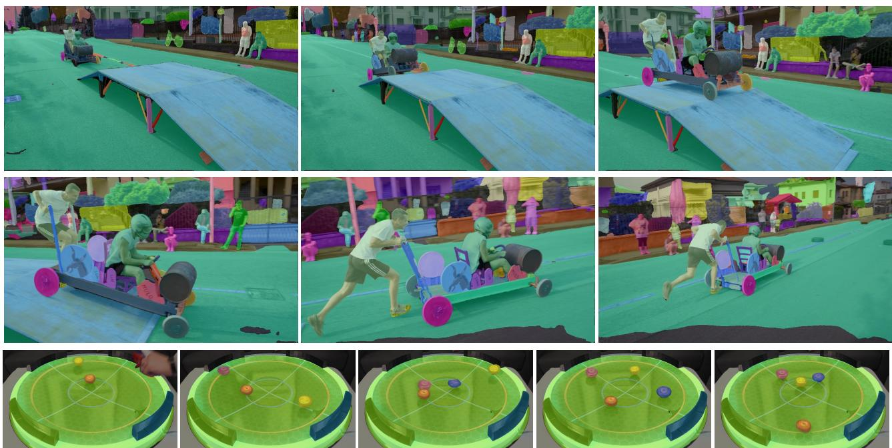
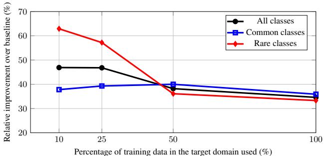
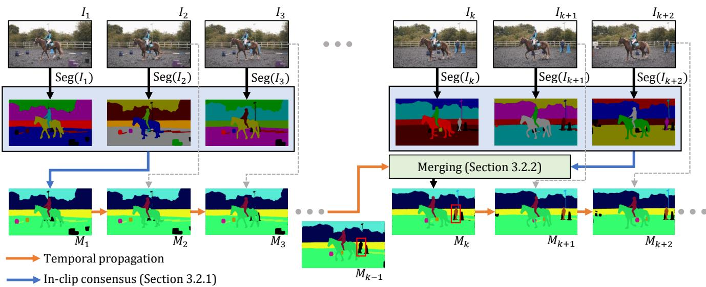
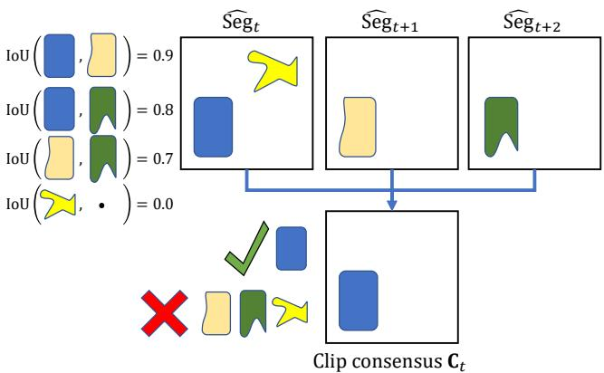
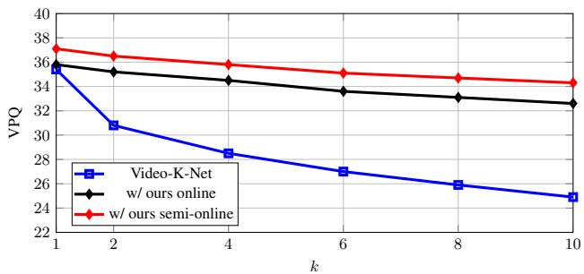
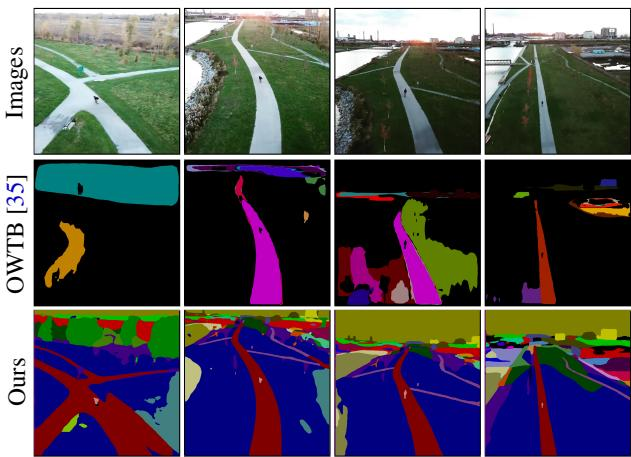

# Tracking Anything with Decoupled Video Segmentation

Ho Kei Cheng1† Seoung Wug Oh2 Brian Price2 Alexander Schwing1 Joon-Young Lee2 1University of Illinois Urbana-Champaign 2Adobe Research {hokeikc2,aschwing}@illinois.edu, {seoh,bprice,jolee}@adobe.com

  
Figure 1. Visualization of our semi-online video segmentation results. Top: our algorithm (DEVA) extends Segment Anything (SAM) [27] to video for open-world video segmentation with no user input required. Bottom: DEVA performs text-prompted video segmentation fo novel objects (with prompt “beyblade”, a type of spinning-top toy) by integrating Grounding-DINO [34] and SAM [27].

## Abstract

Training data for video segmentation are expensive to annotate. This impedes extensions of end-to-end algorithms to new video segmentation tasks, especially in large-vocabulary settings. To ‘track anything’ without training on video data for every individual task, we develop a decoupled video segmentation approach (DEVA), composed of task-specific image-level segmentation and class/task-agnostic bi-directional temporal propagation. Due to this design, we only need an image-level model for the target task (which is cheaper to train) and a universal temporal propagation model which is trained once and generalizes across tasks. To effectively combine these two modules, we use bi-directional propagation for (semi-)online fusion of segmentation hypotheses from different frames to generate a coherent segmenta-

tion. We show that this decoupled formulation compares favorably to end-to-end approaches in several data-scarce tasks including large-vocabulary video panoptic segmentation, open-world video segmentation, referring video segmentation, and unsupervised video object segmentation. Code is available at: hkchengrex.github.io/ Tracking-Anything-with-DEVA.

## 1. Introduction

Video segmentation aims to segment and associate objects in a video. It is a fundamental task in computer vision and is crucial for many video understanding applications.

Most existing video segmentation approaches train endto-end video-level networks on annotated video datasets. They have made significant strides on common benchmarks like YouTube-VIS [61] and Cityscape-VPS [24]. However, these datasets have small vocabularies: YouTube-VIS contains 40 object categories, and Cityscape-VPS only has 19. It is questionable whether recent end-to-end paradigms are scalable to large-vocabulary, or even open-world video data. A recent larger vocabulary (124 classes) video segmentation dataset, VIPSeg [39], has been shown to be more difficult – using the same backbone, a recent method [30] achieves only 26.1 VPQ compared with 57.8 VPQ on Cityscape-VPS. To the best of our knowledge, recent video segmentation methods [2, 35] developed for the open-world setting (e.g., BURST [2]) are not end-to-end and are based on tracking of per-frame segmentation – further highlighting the difficulty of end-to-end training on large-vocabulary datasets. As the number of classes and scenarios in the dataset increases, it becomes more challenging to train and develop end-to-end video models to jointly solve segmentation and association, especially if annotations are scarce.

  
Figure 2. We plot relative VPQ increase of our decoupled approach over the end-to-end baseline when we vary the training data in the target domain (VIPSeg [39]). Common/rare classes are the top/bottom 50% most annotated object category in the training set. Our improvement is most significant (>60%) in rare classes when there is a small amount of training data. This is because our decoupling allows the use of external class-agnostic temporal propagation data – data that cannot be used by existing end-to-end baselines. Details in Section 4.5.1.

In this work, we aim to reduce reliance on the amount of target training data by leveraging external data outside of the target domain. For this, we propose to study decoupled video segmentation, which combines task-specific image-level segmentation and task-agnostic temporal propagation. Due to this design, we only need an image-level model for the target task (which is cheaper) and a universal temporal propagation model which is trained once and generalizes across tasks. Universal promptable image segmentation models like ‘segment anything’ (SAM) [27] have recently become available and serve as excellent candidates for the image-level model in a ‘track anything’ pipeline – Figure 1 shows some promising results of our integration with these methods.

Researchers have studied decoupled formulations before, as ‘tracking-by-detection’ [23, 51, 3]. However, these approaches often consider image-level detections immutable, while the temporal model only associates detected objects. This formulation depends heavily on the quality of per-image detections and is sensitive to image-level errors.

In contrast, we develop a (semi-)online bi-directional propagation algorithm to 1) denoise image-level segmentation with in-clip consensus (Section 3.2.1), and 2) combine results from temporal propagation and in-clip consensus gracefully (Section 3.2.2). This bi-directional propagation allows temporally more coherent and potentially better results than those of an image-level model (see Figure 2).

We do not aim to replace end-to-end video approaches. Indeed, we emphasize that specialized frameworks on video tasks with sufficient video-level training data (e.g., YouTubeVIS [61]) outperform the developed method. Instead, we show that our decoupled approach acts as a strong baseline when an image model is available but video data is scarce. This is in spirit similar to pretraining of large language models [46]: a task-agnostic understanding of natural language is available before being finetuned on specific tasks – in our case, we learn propagation of segmentations of class-agnostic objects in videos via a temporal propagation module and make technical strides in applying this knowledge to specific tasks. The proposed decoupled approach transfers well to large-scale or open-world datasets, and achieves state-of-the-art results in large-scale video panoptic segmentation (VIPSeg [39]) and open-world video segmentation (BURST [2]). It also performs competitively on referring video segmentation (Ref-YouTubeVOS [49], Ref-DAVIS [22]) and unsupervised video object segmentation (DAVIS-16/17[5]) without end-to-end training.

To summarize:

• We propose using decoupled video segmentation that leverages external data, which allows it to generalize better to target tasks with limited annotations than end-to-end video approaches and allows us to seamlessly incorporate existing universal image segmentation models like SAM [27].

• We develop bi-directional propagation that denoises image segmentations and merges image segmentations with temporally propagated segmentations gracefully.

• We empirically show that our approach achieves favorable results in several important tasks including largescale video panoptic segmentation, open-world video segmentation, referring video segmentation, and unsupervised video object segmentation.

## 2. Related Works

End-to-End Video Segmentation. Recent end-to-end video segmentation approaches [44, 21, 54, 4, 6, 14, 13] have made significant progress in tasks like Video Instance Segmentation (VIS) and Video Panoptic Segmentation (VPS), especially in closed and small vocabulary datasets like YouTube-VIS [61] and Cityscape-VPS [24].

However, these methods require end-to-end training and their scalability to larger vocabularies, where video data and annotations are expensive, is questionable. MaskProp [4] uses mask propagation to provide temporal information, but still needs to be trained end-to-end on the target task. This is because their mask propagation is not class-agnostic. We circumvent this training requirement and instead decouple the task into image segmentation and temporal propagation, each of which is easier to train with image-only data and readily available class-agnostic mask propagation data respectively.

Open-World Video Segmentation. Recently, an openworld video segmentation dataset BURST [2] has been proposed. It contains 482 object classes in diverse scenarios and evaluates open-world performance by computing metrics for the common classes (78, overlap with COCO [33]) and uncommon classes (404) separately. The baseline in BURST [2] predicts a set of object proposals using an image instance segmentation model trained on COCO [33] and associates the proposals frame-by-frame using either box IoU or STCN [11]. OWTB [35] additionally associates proposals using optical flow and pre-trained Re-ID features. Differently, we use bi-directional propagation that generates segmentations instead of simply associating existing segmentations – this reduces sensitivity to image segmentation errors. UVO [17] is another open-world video segmentation dataset and focuses on human actions. We mainly evaluate on BURST [2] as it is much more diverse and allows separate evaluation for common/uncommon classes.

Decoupled Video Segmentation. ‘Tracking-bydetection’ approaches [23, 51, 3] often consider image-level detections immutable and use a short-term temporal tracking model to associate detected objects. This formulation depends heavily on the quality of per-image detections and is sensitive to image-level errors. Related long-term temporal propagation works exist [19, 18], but they consider a single task and do not filter the image-level segmentation. We instead propose a general framework, with a bi-directional propagation mechanism that denoises the image segmentations and allows our result to potentially perform better than the image-level model.

Video Object Segmentation. Semi-supervised Video Object Segmentation (VOS) aims to propagate an initial ground-truth segmentation through a video [41, 40, 62, 9]. However, it does not account for any errors in the initial segmentation, and cannot incorporate new segmentation given by the image model at later frames. SAM-PT [47] combines point tracking with SAM [12] to create a video object segmentation pipeline, while our method tracks masks directly. We find a recent VOS algorithm [9] works well for our temporal propagation model. Our proposed bi-directional propagation is essential for bringing image segmentation models and propagation models together as a unified video segmentation framework.

Unified Video Segmentation. Recent Video-K-Net [30] uses a unified framework for multiple video tasks but requires separate end-to-end training for each task. Unicorn [58], TarViS [1], and UNINEXT [59] share model parameters for different tasks, and train on all the target tasks end-to-end. They report lower tracking accuracy for objects that are not in the target tasks during training compared with class-agnostic VOS approaches, which might be caused by joint learning with class-specific features. In contrast, we only train an image segmentation model for the target task, while the temporal propagation model is always fully classagnostic for generalization across tasks.

Segmenting/Tracking Anything. Concurrent to our work, Segment Anything (SAM) [27] demonstrates the effectiveness and generalizability of large-scale training for universal image segmentation, serving as an important foundation for open-world segmentation. Follow-up works [60, 12] extend SAM to video data by propagating the masks generated by SAM with video object segmentation algorithms. However, they rely on single-frame segmentation and lack the denoising capability of our proposed in-clip consensus approach.

## 3. Decoupled Video Segmentation

## 3.1. Formulation

Decoupled Video Segmentation. Our decoupled video segmentation approach is driven by an image segmentation model and a universal temporal propagation model. The image model, trained specifically on the target task, provides task-specific image-level segmentation hypotheses. The temporal propagation model, trained on class-agnostic mask propagation datasets, associates and propagates these hypotheses to segment the whole video. This design separates the learning of task-specific segmentation and the learning of general video object segmentation, leading to a robust framework even when data in the target domain is scarce and insufficient for end-to-end learning.

Notation. Using t as the time index, we refer to the corresponding frame and its final segmentation as $I _ { t }$ and ${ { \bf { M } } _ { t } }$ respectively. In this paper, we represent a segmentation as a set of non-overlapping per-object binary segments, $i . e . ,$ $\mathbf { M } _ { t } = \{ m _ { i } , 0 < i \leq | \mathbf { M } _ { t } | \}$ , where $m _ { i } \cap m _ { j } = \emptyset { \mathrm { ~ i f ~ } } i \neq j .$

The image segmentation model Seg(I) takes an image $I$ as input and outputs a segmentation. We denote its output segmentation at time t as $\mathbf { S e g } ( I _ { t } ) = \mathbf { S e g } _ { t } = \{ s _ { i } , 0 <$ $i \leq | \mathrm { S e g } _ { t } | \}$ , which is also a set of non-overlapping binary segments. This segmentation model can be swapped for different target tasks, and users can be in the loop to correct the segmentation as we do not limit its internal architecture.

  
Figure 3. Overview of our framework. We first filter image-level segmentations with in-clip consensus (Section 3.2.1) and temporally propagate this result forward. To incorporate a new image segmentation at a later time step (for previously unseen objects, e.g., red box), we merge the propagated results with in-clip consensus as described in Section 3.2.2. Specifics of temporal propagation are in the appendix.

The temporal propagation model Prop(H, I) takes a collection of segmented frames (memory) H and a query image I as input and segments the query frame with the objects in the memory. For instance, Prop $\left( \{ I _ { 1 } , \mathbf { M } _ { 1 } \} , I _ { 2 } \right)$ propagates the segmentation ${ { \bf { M } } _ { 1 } }$ from the first frame $I _ { 1 }$ to the second frame $I _ { 2 }$ . Unless mentioned explicitly, the memory H contains all past segmented frames.

Overview. Figure 3 illustrates the overall pipeline. At a high level, we aim to propagate segmentations discovered by the image segmentation model to the full video with temporal propagation. We mainly focus on the (semi-)online setting. Starting from the first frame, we use the image segmentation model for initialization. To denoise errors from single-frame segmentation, we look at a small clip of a few frames in the near future (in the online setting, we only look at the current frame) and reach an in-clip consensus (Section 3.2.1) as the output segmentation. Afterward, we use the temporal propagation model to propagate the segmentation to subsequent frames. We modify an off-the-shelf state-of-the-art video object segmentation XMem [9] as our temporal propagation model, with details given in the appendix. The propagation model itself cannot segment new objects that appear in the scene. Therefore, we periodically incorporate new image segmentation results using the same in-clip consensus as before and merge the consensus with the propagated result (Section 3.2.2). This pipeline combines the strong temporal consistency from the propagation model (past) and the new semantics from the image segmentation model (future), hence the name bi-directional propagation. Next, we will discuss the bi-directional propagation pipeline in detail.

  
Figure 4. A simple illustration of in-clip consensus. The top three squares represent object proposals from three different frames aligned to time t. The blue shape is the most supported by other object proposals and is selected as output. The yellow shape is not supported by any and is ruled out as noise. The remaining are not used due to significant overlap with the selected (blue) shape.

## 3.2. Bi-Directional Propagation

## 3.2.1 In-clip Consensus

Formulation. In-clip consensus operates on the image segmentations of a small future clip of n frames (Seg , $\mathbf { S e g } _ { t + 1 } , ~ . . . , ~ \mathbf { S e g } _ { t + n - 1 } )$ and outputs a denoised consensus $\mathbf { C } _ { t }$ for the current frame. In the online setting, $n = 1$ and $\mathbf { C } _ { t } = \mathbf { S } \mathbf { e } \mathbf { g } _ { t }$ . In the subsequent discussion, we focus on the semi-online setting, as consensus computation in the online setting is straightforward. As an overview, we first obtain a set of object proposals on the target frame t via spatial alignment, merge the object proposals into a combined representation in a second step, and optimize for an indicator variable to choose a subset of proposals as the output in an integer program. Figure 4 illustrates this in-clip consensus computation in a stylized way and we provide details regarding each of the three aforementioned steps (spatial alignment, representation, and integer programming) next.

Spatial Alignment. As the segmentations $( \mathrm { S e g } _ { t } , \mathrm { S e g } _ { t + 1 } .$ $. . . , \mathrm { S e g } _ { t + n - 1 } )$ correspond to different time steps, they might be spatially misaligned. This misalignment complicates the computation of correspondences between segments. To align segmentations $\mathrm { S e g } _ { t + i }$ with frame t, techniques like optical flow warping are applicable. In this paper, we simply re-use the temporal propagation model to find the aligned segmentation $\widehat { \mathrm { S e g } } _ { t + i }$ (note $\widehat { \mathbf { S e g } } _ { t } = \mathbf { S e g } _ { t } )$ via

$$
\widehat { \mathbf { S e g } } _ { t + i } = \operatorname { P r o p } \left( \{ I _ { t + i } , \mathbf { S e g } _ { t + i } \} , I _ { t } \right) , 0 < i < n .\tag{1}
$$

Note, the propagation model here only uses one frame as memory at a time and this temporary memory $\{ I _ { t + i } , \mathrm { S e g } _ { t + i } \}$ is discarded immediately after alignment. It does not interact with the global memory H.

Representation. Recall that we represent a segmentation as a set of non-overlapping per-object binary segments. After aligning all the segmentations to frame $t ,$ each segment is an object proposal for frame $I _ { t }$ . We refer to the union of all these proposals via P (time index omitted for clarity):

$$
\mathbf { P } = \bigcup _ { i = 0 } ^ { n - 1 } { \widehat { \mathbf { S e g } } } _ { t + i } = \{ p _ { i } , 0 < i \leq | \mathbf { P } | \} .\tag{2}
$$

The output of consensus voting is represented by an indicator variable $v ^ { * } \in \{ 0 , 1 \} ^ { | \mathbf { P } | }$ that combines segments into the consensus output $\mathbf { C } _ { t } \mathbf { : }$

$$
\mathbf { C } _ { t } = \{ p _ { i } | v _ { i } ^ { * } = 1 \} = \{ c _ { i } , 0 < i \leq | \mathbf { C } | \} .\tag{3}
$$

We resolve overlapping segments $c _ { i }$ in $\mathbf { C } _ { t }$ by prioritizing smaller segments as they are more vulnerable to being majorly displaced by overlaps. This priority is implemented by sequentially rendering the segments $c _ { i }$ on an image in descending order of area. We optimize for v based on two simple criteria:

1. Lone proposals $p _ { i }$ are likely to be noise and should not be selected. Selected proposals should be supported by other (unselected) proposals.

2. Selected proposals should not overlap significantly with each other.

We combine these criteria in an integer programming problem which we describe next.

Integer Programming. We aim to optimize the indicator variable v to achieve the above two objectives, by addressing the following integer programming problem:

$$
v ^ { * } = \mathrm { a r g m a x } _ { v } \sum _ { i } \left( \mathrm { S u p p } _ { i } + \mathrm { P e n a l } _ { i } \right) \mathrm { s . t . } \sum _ { i , j } \mathrm { O v e r l a p } _ { i j } = 0 .\tag{4}
$$

Next, we discuss each of the terms in the program in detail.

First, we define the pairwise Intersection-over-Union (IoU) between the i-th proposal and the j-th proposal as:

$$
\mathrm { I o U } _ { i j } = \mathrm { I o U } _ { j i } = \frac { \left| p _ { i } \cap p _ { j } \right| } { \left| p _ { i } \cup p _ { j } \right| } , 0 \leq \mathrm { I o U } _ { i j } \leq 1 .\tag{5}
$$

The i-th proposal supports the $j \cdot$ th proposal if IoU $J _ { i j } > 0 . 5$ – the higher the IoU, the stronger the support. The more support a segment has, the more favorable it is to be selected. To maximize the total support of selected segments, we maximize the below objective for all i:

$$
\mathrm { S u p p } _ { i } = v _ { i } \sum _ { j } \left\{ \begin{array} { l l } { \mathrm { I o U } _ { i j } , } & { \mathrm { i f ~ I o U } _ { i j } > 0 . 5 \mathrm { ~ a n d ~ } i \ne j } \\ { 0 , } & { \mathrm { o t h e r w i s e } } \end{array} \right. .\tag{6}
$$

Additionally, proposals that support each other should not be selected together as they significantly overlap. This is achieved by constraining the following term to zero:

$$
\begin{array} { r } { \mathrm { O v e r l a p } _ { i j } = \left\{ \begin{array} { l l } { v _ { i } v _ { j } , } & { \mathrm { i f } \mathrm { I o U } _ { i j } > 0 . 5 \mathrm { a n d } i \ne j } \\ { 0 , } & { \mathrm { o t h e r w i s e } } \end{array} \right. . } \end{array}\tag{7}
$$

Lastly, we introduce a penalty for selecting any segment for 1) tie-breaking when a segment has no support, and 2) excluding noisy segments, with weight α:

$$
{ \mathrm { P e n a l } } _ { i } = - \alpha v _ { i } .\tag{8}
$$

We set the tie-breaking weight $\alpha = 0 . 5$ . For all but the first frame, we merge $\mathbf { C } _ { t }$ with the propagated segmentation $\mathrm { P r o p } ( \mathbf { H } , I _ { t } )$ into the final output ${ { \bf { M } } _ { t } }$ as described next.

## 3.2.2 Merging Propagation and Consensus

Formulation. Here, we seek to merge the propagated segmentation Prop(H, $I _ { t } ) = { \mathbf { R } } _ { t } = \{ r _ { i } , 0 < i \leq | \mathbf { R } | \}$ (from the past) with the consensus $\mathbf { C } _ { t } \ = \ \{ c _ { j } , 0 \ < \ j \ \leq \ | \mathbf { C } | \}$ (from the near future) into a single segmentation M . We associate segments from these two segmentations and denote the association with an indicator $a _ { i j }$ which is 1 if $r _ { i }$ associates with $c _ { j }$ , and 0 otherwise. Different from the inclip consensus, these two segmentations contain fundamentally different information. Thus, we do not eliminate any segments and instead fuse all pairs of associated segments while letting the unassociated segments pass through to the output. Formally, we obtain the final segmentation via

$$
\begin{array} { r } { \mathbf { M } _ { t } = \{ r _ { i } \cup c _ { j } | a _ { i j } = 1 \} \cup \{ r _ { i } | \forall _ { j } a _ { i j } = 0 \} \cup \{ c _ { j } | \forall _ { i } a _ { i j } = 0 \} , } \end{array}\tag{9}
$$

where overlapping segments are resolved by prioritizing the smaller segments as discussed in Section 3.2.1.

Maximizing Association IoU. We find $a _ { i j }$ by maximizing the pairwise IoU of all associated pairs, with a minimum association IoU of 0.5. This is equivalent to a maximum bipartite matching problem, with $r _ { i }$ and $c _ { j }$ as vertices and edge weight $e _ { i j }$ given by

$$
e _ { i j } = \left\{ { \begin{array} { l l } { \mathrm { I o U } ( r _ { i } , c _ { j } ) , } & { { \mathrm { i f ~ I o U } } ( r _ { i } , c _ { j } ) > 0 . 5 } \\ { - 1 , } & { { \mathrm { o t h e r w i s e } } } \end{array} } . \right.\tag{10}
$$

Requiring any matched pairs from two non-overlapping segmentations to have IoU $> 0 . 5$ leads to a unique matching, as shown in [26]. Therefore, a greedy solution of setting $a _ { i j } = 1 \mathrm { i f } e _ { i j } > 0$ and 0 otherwise suffices to obtain an optimal result.

Segment Deletion. As an implementation detail, we delete inactive segments from the memory to reduce computational costs. We consider a segment $r _ { i }$ inactive when it fails to associate with any segments $c _ { j }$ from the consensus for consecutive L times. Such objects might have gone out of view or were a misdetection. Concretely, we associate a counter $\operatorname { c n t } _ { i }$ with each propagated segment $r _ { i } ,$ initialized as 0. When $r _ { i }$ is not associated with any segments $c _ { j }$ from the consensus, i.e., $\forall _ { j } a _ { i j } = 0 .$ , we increment cnti by 1 and reset cnt to 0 otherwise. When cnt reaches the pre-defined threshold $L ,$ , the segment $r _ { i }$ is deleted from the memory. We set $L = 5$ in all our experiments.

## 4. Experiments

We first present our main results using a large-scale video panoptic segmentation dataset (VIPSeg [39]) and an open-world video segmentation dataset (BRUST [2]). Next, we show that our method also works well for referring video object segmentation and unsupervised video object segmentation. We present additional results on the smaller-scale YouTubeVIS dataset in the appendix, but unsurprisingly recent end-to-end specialized approaches perform better because a sufficient amount of data is available in this case. Figure 1 visualizes some results of the integration of our approach with universal image segmentation models like SAM [27] or Grounding-Segment-Anything [34, 27]. By default, we merge in-clip consensus with temporal propagation every 5 frames with a clip size of $n = 3$ in the semionline setting, and $n = 1$ in the online setting. We evaluate all our results using either official evaluation codebases or official servers. We use image models trained with standard training data for each task (using open-sourced models whenever available) and a universal temporal propagation module for all tasks unless otherwise specified.

The temporal propagation model is based on XMem [9], and is trained in a class-agnostic fashion with image segmentation datasets [50, 53, 63, 29, 8] and video object segmentation datasets [57, 41, 42]. With the long-term memory of XMem [9], our model can handle long videos with ease.

  
Figure 5. Performance trend comparison of Video-K-Net [30] and our decoupled approach with the same base model. Ours decreases slower with larger $k ,$ indicating that the proposed decoupled method has a better long-term propagation.

We use top-k filtering [10] with $k = 3 0$ following [9]. The performance of our modified propagation model on common video object segmentation benchmarks (DAVIS [41], YouTubeVOS [57], and MOSE [15]) are listed in the appendix.

## 4.1. Large-Scale Video Panoptic Segmentation

We are interested in addressing the large vocabulary setting. To our best knowledge, VIPSeg [39] is currently the largest scale in-the-wild panoptic segmentation dataset, with 58 things classes and 66 stuff classes in 3,536 videos of 232 different scenes.

Metrics. To evaluate the quality of the result, we adopt the commonly used VPQ (Video Panoptic Quality) [24] and STQ (Segmentation and Tracking Quality) [55] metrics. VPQ extends image-based PQ (Panoptic Quality) [26] to video data by matching objects in sliding windows of k frames (denoted $\mathsf { V P Q } ^ { k } )$ . When $k = 1 , \mathrm { v P Q } = \mathrm { P Q }$ and associations of segments between frames are ignored. Correct long-range associations, which are crucial for object tracking and video editing tasks, are only evaluated with a large value of k. For a more complete evaluation of VPS, we evaluate $k \in \{ 1 , 2 , 4 , 6 , 8 , 1 0 , \infty \}$ . Note, $\mathrm { { V P Q } ^ { \infty } }$ considers the entire video as a tube and requires global association. We additionally report VPQ, which is the average of $\mathrm { { V P Q } ^ { \infty } }$ and the arithmetic mean of $\mathsf { V P Q } ^ { \{ 1 , 2 , 4 , 6 , 8 , 1 0 \} }$ . This weights $\mathrm { { V P Q } ^ { \infty } }$ higher as it represents video-level performance, while the other metrics only assess frame-level or clip-level results. STQ is proposed in STEP [55] and is the geometric mean of AQ (Association Quality) and SQ (Segmentation Quality). It evaluates pixel-level associations and semantic segmentation quality respectively. We refer readers to [24] and [55] for more details on VPQ and STQ.

Main Results. Table 1 summarizes our findings. To assess generality, we study three models as image segmentation input (PanoFCN [31], Mask2Former [7], and Video-K-Net [30]) to our decoupled approach. The weights of these image models are initialized by pre-training on the COCO panoptic dataset [33] and subsequently fine-tuned on VIPSeg [39]. Our method outperforms both baseline Clip-PanoFCN [39] and state-of-the-art Video-K-Net [30] with the same backbone, especially if k is large, i.e., when long-term associations are more important. Figure 5 shows the performance trend with respect to k. The gains for large values of k highlight the use of a decoupled formulation over end-to-end training: the latter struggles with associations eventually, as training sequences aren’t arbitrarily long. Without any changes to our generalized mask propagation module, using a better image backbone (e.g., SwinB [36]) leads to noticeable improvements. Our method can likely be coupled with future advanced methods in image segmentation for even better performance.

<table><tr><td>Backbone</td><td></td><td></td><td></td><td>VPQ1</td><td>VPQ2</td><td>VPQ4</td><td>VPQ⁶</td><td>VPQ8</td><td>VPQ10</td><td>VPQ∞</td><td>VPQ</td><td>STQ</td></tr><tr><td>Clip-PanoFCN</td><td></td><td>end-to-end [39]</td><td>semi-online</td><td>27.3</td><td>26.0</td><td>24.2</td><td>22.9</td><td>22.1</td><td>21.5</td><td>18.1</td><td>21.1</td><td>28.3</td></tr><tr><td>Clip-PanoFCN</td><td></td><td>decoupled (ours)</td><td>online</td><td>29.5</td><td>28.9</td><td>28.1</td><td>27.2</td><td>26.7</td><td>26.1</td><td>25.0</td><td>26.4</td><td>35.7</td></tr><tr><td>Clip-PanoFCN</td><td></td><td>decoupled (ours)</td><td>semi-online</td><td>31.3</td><td>30.8</td><td>30.1</td><td>29.4</td><td>28.8</td><td>28.3</td><td>27.1</td><td>28.4</td><td>35.8</td></tr><tr><td>Video-K-Net</td><td>R50</td><td>end-to-end [30]</td><td>online</td><td>35.4</td><td>30.8</td><td>28.5</td><td>27.0</td><td>25.9</td><td>24.9</td><td>21.7</td><td>25.2</td><td>33.7</td></tr><tr><td>Video-K-Net</td><td>R50</td><td>decoupled (ours)</td><td>online</td><td>35.8</td><td>35.2</td><td>34.5</td><td>33.6</td><td>33.1</td><td>32.6</td><td>30.5</td><td>32.3</td><td>38.4</td></tr><tr><td>Video-K-Net</td><td>R50</td><td>decoupled (ours)</td><td>semi-online</td><td>37.1</td><td>36.5</td><td>35.8</td><td>35.1</td><td>34.7</td><td>34.3</td><td>32.3</td><td>33.9</td><td>38.6</td></tr><tr><td>Mask2Former</td><td>r R50</td><td>decoupled (ours)</td><td>online</td><td>41.0</td><td>40.2</td><td>39.3</td><td>38.4</td><td>37.9</td><td>37.3</td><td>33.8</td><td>36.4 41.1</td><td></td></tr><tr><td>Mask2Former</td><td>R50</td><td>decoupled (ours)</td><td>semi-online</td><td>42.1</td><td>41.5</td><td>40.8</td><td>40.1</td><td>39.7</td><td>39.3</td><td>36.1</td><td>38.3</td><td>41.5</td></tr><tr><td>Video-K-Net</td><td>Swin-B</td><td>end-to-end [30]</td><td>online</td><td>49.8</td><td>45.2</td><td>42.4</td><td>40.5</td><td>39.1</td><td>37.9</td><td>32.6</td><td>37.5 45.2</td><td></td></tr><tr><td>Video-K-Net</td><td>Swin-B</td><td>decoupled (ours)</td><td>online</td><td>48.2</td><td>47.4</td><td>46.5</td><td>45.6</td><td>45.1</td><td>44.5</td><td>42.0</td><td>44.1</td><td>48.6</td></tr><tr><td>Video-K-Net</td><td>Swin-B</td><td>decoupled (ours)</td><td>semi-online</td><td>50.0</td><td>49.3</td><td>48.5</td><td>47.7</td><td>47.3</td><td>46.8</td><td>44.5</td><td>46.4</td><td>48.9</td></tr><tr><td>Mask2Former Swin-B</td><td></td><td>decoupled (ours)</td><td>online</td><td>55.3</td><td>54.6</td><td>53.8</td><td>52.8</td><td>52.3</td><td>51.9</td><td>49.0</td><td>51.2</td><td>52.4</td></tr><tr><td>Mask2Former Swin-B</td><td></td><td>decoupled (ours)</td><td>semi-online</td><td>56.0</td><td>55.4</td><td>54.6</td><td>53.9</td><td>53.5</td><td>53.1</td><td>50.0</td><td>52.2</td><td>52.2</td></tr></table>

Table 1. Comparisons of end-to-end approaches (e.g., state-of-the-art Video-K-Net [30]) with our decoupled approach on the large-scale video panoptic segmentation dataset $\mathrm { \Delta V I P S e g }$ [39]. Our method scales with better image models and performs especially well with large k where long-term associations are considered. All baselines are reproduced using official codebases.
<table><tr><td colspan="2"></td><td colspan="3">Validation</td><td colspan="3">Test</td></tr><tr><td>Method</td><td></td><td> $\mathrm { O W T A _ { a l l } }$ </td><td> $\mathrm { O W T A _ { c o m } }$ </td><td> $\mathrm { O W T A _ { u n c } }$ </td><td> $\mathrm { O W T A _ { a l l } }$ </td><td> $\mathrm { O W T A _ { c o m } }$ </td><td> $\mathrm { O W T A _ { u n c } }$ </td></tr><tr><td>Mask2Former</td><td>w/ Box tracker [2]</td><td>60.9</td><td>66.9</td><td>24.0</td><td>55.9</td><td>61.0</td><td>24.6</td></tr><tr><td>Mask2Former</td><td>w/ STCN tracker [2]</td><td>64.6</td><td>71.0</td><td>25.0</td><td>57.5</td><td>62.9</td><td>23.9</td></tr><tr><td>OWTB [35]</td><td></td><td>55.8</td><td>59.8</td><td>38.8</td><td>56.0</td><td>59.9</td><td>38.3</td></tr><tr><td>Mask2Former</td><td>w/ ours online</td><td>69.5</td><td>74.6</td><td>42.3</td><td>70.1</td><td>75.0</td><td>44.1</td></tr><tr><td>Mask2Former</td><td>w/ ours semi-online</td><td>69.9</td><td>75.2</td><td>41.5</td><td>70.5</td><td>75.4</td><td>44.1</td></tr><tr><td>EntitySeg</td><td>w/ ours online</td><td>68.8</td><td>72.7</td><td>49.6</td><td>69.5</td><td>72.9</td><td>53.0</td></tr><tr><td>EntitySeg</td><td>w/ ours semi-online</td><td>69.5</td><td>73.3</td><td>50.5</td><td>69.8</td><td>73.1</td><td>53.3</td></tr></table>

Table 2. Comparison to baselines in the open-world video segmentation dataset BURST [2]. ‘com’ stands for ‘common classes’ and ‘unc’ stands for ‘uncommon classes’. Our method performs better in both – in the common classes with Mask2Former [7] image backbone, and in the uncommon classes with EntitySeg [43]. The agility to switch image backbones is one of the main advantages of our decoupled formulation. Baseline performances are transcribed from [2].

## 4.2. Open-World Video Segmentation

Open-world video segmentation addresses the difficult problem of discovering, segmenting, and tracking objects in the wild. BURST [2] is a recently proposed dataset that evaluates open-world video segmentation. It contains diverse scenarios and 2,414 videos in its validation/test sets. There are a total of 482 object categories, 78 of which are ‘common’ classes while the rest are ‘uncommon’.

Metrics. Following [2], we assess Open World Tracking Accuracy (OWTA), computed separately for ‘all’, ‘common’, and ‘uncommon’ classes. False positive tracks are not directly penalized in the metrics as the ground-truth annotations are not exhaustive for all objects in the scene, but indirectly penalized by requiring the output mask to be mutually exclusive. We refer readers to [2, 37] for details.

Main Results. Table 2 summarizes our findings. We study two image segmentation models: Mask2Former [7], and EntitySeg [43], both of which are pretrained on the COCO [33] dataset. The Mask2Former weight is trained for the instance segmentation task, while EntitySeg is trained for ‘entity segmentation’, that is to segment all visual entities without predicting class labels. We find EntitySeg works better for novel objects, as it is specifically trained to do so. Being able to plug and play the latest development of open-world image segmentation models without any finetuning is one of the major advantages of our formulation.

  
Figure 6. An in-the-wild result in the BURST [2] dataset. Note, we can even track the small skateboarder (pink mask on the road).

Our approach outperforms the baselines, which all follow the ‘tracking-by-detection’ paradigm. In these baselines, segmentations are detected every frame, and a shortterm temporal module is used to associate these segmentations between frames. This paradigm is sensitive to misdetections in the image segmentation model. ‘Box tracker’ uses per-frame object IoU; ‘STCN tracker’ uses a pretrained STCN [11] mask propagation network; and OWTB [35] uses a combination of IoU, optical flow, and Re-ID features. We also make use of mask propagation, but we go beyond the setting of simply associating existing segmentations – our bi-directional propagation allows us to improve upon the image segmentations and enable long-term tracking. Figure 6 compares our results on one of the videos in BURST to OWTB [35].

## 4.3. Referring Video Segmentation

Referring video segmentation takes a text description of an object as input and segments the target object. We experiment on Ref-DAVIS17 [22] and Ref-YouTubeVOS [49] which augments existing video object segmentation datasets [41, 57] with language expressions. Following [56], we assess J &F which is the average of Jaccard index (J ), and boundary F1-score (F).

Table 3 tabulates our results. We use an image-level ReferFormer [56] as the image segmentation model. We find that the quality of referring segmentation has a high variance across the video (e.g., the target object might be too small at the beginning of the video). As in all competing approaches [49, 56, 16], we opt for an offline setting to reduce this variance. Concretely, we perform the initial inclip consensus by selecting 10 uniformly spaced frames in the video and using the frame with the highest confidence given by the image model as a ‘key frame’ for aligning the other frames. We then forward- and backward-propagate from the key frame without incorporating additional image segmentations. We give more details in the appendix. Our method outperforms other approaches.

<table><tr><td>Method</td><td>Ref-DAVIS [22]</td><td>Ref-YTVOS [49]</td></tr><tr><td>URVOS [49]</td><td>51.6</td><td>47.2</td></tr><tr><td>ReferFormer [56]</td><td>60.5</td><td>62.4</td></tr><tr><td>VLT [16]</td><td>61.6</td><td>63.8</td></tr><tr><td>Ours</td><td>66.3</td><td>66.0</td></tr></table>

Table 3. J&F comparisons on two referring video segmentation datasets. Ref-YTVOS stands for Ref-YouTubeVOS [49].

## 4.4. Unsupervised Video Object Segmentation

Unsupervised video object segmentation aims to find and segment salient target object(s) in a video. We evaluate on DAVIS-16 [41] (single-object) and DAVIS-17 [5] (multi-object). In the single-object setting, we use the image saliency model DIS [45] as the image model and employ an offline setting as in Section 4.3. In the multi-object setting, since the image saliency model only segments one object, we instead use EntitySeg [43] and follow our semionline protocol on open-world video segmentation in Section 4.2. Table 4 summarizes our findings. Please refer to the appendix for details.

<table><tr><td>Method</td><td>D16-val</td><td>D17-val</td><td>D17-td</td></tr><tr><td>RTNet [48]</td><td>85.2</td><td></td><td>一</td></tr><tr><td>PMN [28]</td><td>85.9</td><td></td><td></td></tr><tr><td>UnOVOST [38]</td><td></td><td>67.9</td><td>58.0</td></tr><tr><td>Propose-Reduce [32]</td><td></td><td>70.4</td><td></td></tr><tr><td>Ours</td><td>88.9</td><td>73.4</td><td>62.1</td></tr></table>

Table 4. J&F comparisons on three unsupervised video object segmentation datasets: DAVIS16 validation (D16-val), DAVIS17 validation (D17-val), and DAVIS17 test-dev (D17-td). Missing entries mean that the method did not report results on that dataset.

## 4.5. Ablation Studies

## 4.5.1 Varying Training Data

Here, we vary the amount of training data in the target domain (VIPSeg [39]) to measure the sensitivity of endto-end approaches vs. our decoupled approach. We subsample different percentages of videos from the training set to train Video-K-Net-R50 [30] (all networks are still pretrained with COCO-panoptic [33]). We then compare endto-end performances with our (semi-online) decoupled performances (the temporal propagation model is unchanged as it does not use any data from the target domain). Figure 1 plots our findings – our model has a much higher relative VPQ improvement over the baseline Video-K-Net for rare classes if little training data is available.

<table><tr><td>Varying clip size</td><td>VPQ1 VPQ10</td><td>VPQ</td><td>STQ</td><td>FPS</td></tr><tr><td>n = 1</td><td>41.0 37.3</td><td>36.4</td><td>41.1</td><td>10.3</td></tr><tr><td>n = 2</td><td>40.4 37.2</td><td>36.3</td><td>39.0</td><td>9.8</td></tr><tr><td>n = 3</td><td>42.1 39.3</td><td>38.3</td><td>41.5</td><td>7.8</td></tr><tr><td>n = 4</td><td>42.1 39.1 38.9</td><td>38.5</td><td>42.3</td><td>6.6</td></tr><tr><td> $n = 5$ </td><td>41.7</td><td>38.3</td><td>42.8</td><td>5.6</td></tr><tr><td>Varying merge freq.</td><td>VPQ¹ VPQ¹0</td><td>VPQ</td><td>STQ</td><td>FPS</td></tr><tr><td>Every 3 frames</td><td>42.2</td><td>39.2</td><td>38.4 42.6</td><td>5.2</td></tr><tr><td>Every 5 frames</td><td>42.1</td><td>39.3 38.3</td><td>41.5</td><td>7.8</td></tr><tr><td>Every 7 frames</td><td>41.5</td><td>39.0</td><td>35.7 40.5</td><td>8.4</td></tr><tr><td>Spatial Align?</td><td>VPQ1</td><td> $\mathrm { V P Q } ^ { 1 0 }$ </td><td>VPQ</td><td>STQ FPS</td></tr><tr><td>Yes</td><td>42.1</td><td>39.3</td><td>38.3</td><td>41.5 7.8</td></tr><tr><td>No</td><td>36.7</td><td>33.9</td><td>32.8</td><td>33.7 9.2</td></tr></table>

Table 5. Performances of our method on VIPSeg [39] with different hyperparameters and design choices. By default, we use a clip size of $n = 3$ and a merge frequency of every 5 frames with spatial alignment for a balance between performance and speed.

## 4.5.2 In-Clip Consensus

Here we explore hyperparameters and design choices in inclip consensus. Table 5 tabulates our performances with different clip sizes, different frequencies of merging in-clip consensus with temporal propagation, and whether to use spatial alignment during in-clip consensus. Mask2Former-R50 is used as the backbone in all entries. For clip size $n = 2 .$ , tie-breaking is ambiguous. A large clip is more computationally demanding and potentially leads to inaccurate spatial alignment as the appearance gap between frames in the clip increases. A high merging frequency reduces the delay between the appearance of a new object and its detection in our framework but requires more computation. By default, we use a clip size $n = 3 ,$ , merge consensus with temporal propagation every 5 frames, and enable spatial alignment for a balance between performance and speed.

## 4.5.3 Using Temporal Propagation

Here, we compare different approaches for using temporal propagation in a decoupled setting. Tracking-by-detection approaches [23, 51, 3] typically detect segmentation at every frame and use temporal propagation to associate these per-frame segmentations. We test these short-term association approaches using 1) mask IoU between adjacent frames, 2) mask IoU of adjacent frames warped by optical flow from RAFT [52], and 3) query association [20] of query-based segmentation [7] between adjacent frames. We additionally compare with variants of our temporal propagation method: 4) ‘ShortTrack’, where we consider only short-term tracking by re-initializing the memory H every frame, and 5) ‘TrustImageSeg’, where we explicitly trust the consensus given by the image segmentations over temporal propagation by discarding segments that are not associated with a segment in the consensus (i.e., dropping the middle term in Eq. (9)). Table 6 tabulates our findings. For all entries, we use Mask2Former-R50 [7] in the online setting on VIPSeg [39] for fair comparisons.

<table><tr><td>Temporal scheme</td><td>VPQ1</td><td>VPQ4</td><td> $\mathrm { { V P Q } ^ { 1 0 } }$ </td><td>VPQ</td><td>STQ</td></tr><tr><td>Mask IoU</td><td>39.9</td><td>32.7</td><td>27.7</td><td>27.6</td><td>34.5</td></tr><tr><td>Mask IoU+flow</td><td>40.2</td><td>33.7</td><td>28.8</td><td>28.6</td><td>37.0</td></tr><tr><td>Query assoc.</td><td>40.4</td><td>33.1</td><td>28.1</td><td>28.0</td><td>35.8</td></tr><tr><td>‘ShortTrack&#x27;</td><td>40.6</td><td>33.3</td><td>28.3</td><td>28.2</td><td>37.2</td></tr><tr><td>‘TrustImageSeg&#x27;</td><td>40.3</td><td>37.5</td><td>33.7</td><td>33.2</td><td>37.9</td></tr><tr><td>Ours, bi-direction</td><td>41.0</td><td>39.3</td><td>37.3</td><td>36.4</td><td>41.1</td></tr></table>

Table 6. Performances of different temporal schema on VIPSeg [39]. Our bi-directional propagation scheme is necessary for the final high performance.

## 4.6. Limitations

As the temporal propagation model is task-agnostic, it cannot detect new objects by itself. As shown by the red boxes in Figure 3, the new object in the scene is missing from ${ \bf M } _ { k - 1 }$ and can only be detected in M – this results in delayed detections relating to the frequency of merging with in-clip consensus. Secondly, we note that end-to-end approaches still work better when training data is sufficient, i.e., in smaller vocabulary settings like YouTubeVIS [61] as shown in the appendix. But we think decoupled methods are more promising in large-vocabulary/open-world settings.

## 5. Conclusion

We present DEVA, a decoupled video segmentation approach for ‘tracking anything’. It uses a bi-directional propagation technique that effectively scales image segmentation methods to video data. Our approach critically leverages external task-agnostic data to reduce reliance on the target task, thus generalizing better to tasks with scarce data than end-to-end approaches. Combined with universal image segmentation models, our decoupled paradigm demonstrates state-of-the-art performance as a first step towards open-world large-vocabulary video segmentation.

Acknowledgments. Work supported in part by NSF grants 2008387, 2045586, 2106825, MRI 1725729 (HAL [25]), and NIFA award 2020-67021-32799.

## References

[1] Ali Athar, Alexander Hermans, Jonathon Luiten, Deva Ramanan, and Bastian Leibe. Tarvis: A unified approach for target-based video segmentation. arXiv preprint arXiv:2301.02657, 2023.

[2] Ali Athar, Jonathon Luiten, Paul Voigtlaender, Tarasha Khurana, Achal Dave, Bastian Leibe, and Deva Ramanan. Burst: A benchmark for unifying object recognition, segmentation and tracking in video. In WACV, 2023.

[3] Philipp Bergmann, Tim Meinhardt, and Laura Leal-Taixe. Tracking without bells and whistles. In ICCV, 2019.

[4] Gedas Bertasius and Lorenzo Torresani. Classifying, segmenting, and tracking object instances in video with mask propagation. In CVPR, 2020.

[5] Sergi Caelles, Jordi Pont-Tuset, Federico Perazzi, Alberto Montes, Kevis-Kokitsi Maninis, and Luc Van Gool. The 2019 davis challenge on vos: Unsupervised multi-object segmentation. In arXiv preprint arXiv:1905.00737, 2019.

[6] Bowen Cheng, Anwesa Choudhuri andd Ishan Misra, Alexander Kirillov, Rohit Girdhar, and Alexander G. Schwing. Mask2former for video instance segmentation. In https://arxiv.org/abs/2112.10764, 2021.

[7] Bowen Cheng, Ishan Misra, Alexander G Schwing, Alexander Kirillov, and Rohit Girdhar. Masked-attention mask transformer for universal image segmentation. In CVPR, 2022.

[8] Ho Kei Cheng, Jihoon Chung, Yu-Wing Tai, and Chi-Keung Tang. Cascadepsp: Toward class-agnostic and very highresolution segmentation via global and local refinement. In CVPR, 2020.

[9] Ho Kei Cheng and Alexander G Schwing. Xmem: Longterm video object segmentation with an atkinson-shiffrin memory model. In ECCV, 2022.

[10] Ho Kei Cheng, Yu-Wing Tai, and Chi-Keung Tang. Modular interactive video object segmentation: Interaction-to-mask, propagation and difference-aware fusion. In CVPR, 2021.

[11] Ho Kei Cheng, Yu-Wing Tai, and Chi-Keung Tang. Rethinking space-time networks with improved memory coverage for efficient video object segmentation. In NeurIPS, 2021.

[12] Yangming Cheng, Liulei Li, Yuanyou Xu, Xiaodi Li, Zongxin Yang, Wenguan Wang, and Yi Yang. Segment and track anything. In arXiv preprint arXiv:2305.06558, 2023.

[13] A. Choudhuri, G. Chowdhary, and A. G. Schwing. Assignment-Space-Based Multi-Object Tracking and Segmentation. In ICCV, 2021.

[14] A. Choudhuri, G. Chowdhary, and A. G. Schwing. Context-Aware Relative Object Queries to Unify Video Instance and Panoptic Segmentation. In CVPR, 2023.

[15] Henghui Ding, Chang Liu, Shuting He, Xudong Jiang, Philip HS Torr, and Song Bai. MOSE: A new dataset for video object segmentation in complex scenes. In ICCV, 2023.

[16] Henghui Ding, Chang Liu, Suchen Wang, and Xudong Jiang. Vlt: Vision-language transformer and query generation for referring segmentation. In TPAMI, 2022.

[17] Yuming Du, Wen Guo, Yang Xiao, and Vincent Lepetit. Uvo challenge on video-based open-world segmentation 2021: 1st place solution. ICCV Workshop, 2021.

[18] Shubhika Garg and Vidit Goel. Mask selection and propagation for unsupervised video object segmentation. In WACV, 2021.

[19] Vidit Goel, Jiachen Li, Shubhika Garg, Harsh Maheshwari, and Humphrey Shi. Msn: efficient online mask selection network for video instance segmentation. In CVPR Workshop, 2021.

[20] De-An Huang, Zhiding Yu, and Anima Anandkumar. Minvis: A minimal video instance segmentation framework without video-based training. In NeurIPS, 2022.

[21] Sukjun Hwang, Miran Heo, Seoung Wug Oh, and Seon Joo Kim. Video instance segmentation using inter-frame communication transformers. NeurIPS, 2021.

[22] Anna Khoreva, Anna Rohrbach, and Bernt Schiele. Video object segmentation with language referring expressions. In ACCV, 2019.

[23] Chanho Kim, Fuxin Li, Arridhana Ciptadi, and James M Rehg. Multiple hypothesis tracking revisited. In ICCV, 2015.

[24] Dahun Kim, Sanghyun Woo, Joon-Young Lee, and In So Kweon. Video panoptic segmentation. In CVPR, 2020.

[25] Volodymyr Kindratenko, Dawei Mu, Yan Zhan, John Maloney, Sayed Hadi Hashemi, Benjamin Rabe, Ke Xu, Roy Campbell, Jian Peng, and William Gropp. Hal: Computer system for scalable deep learning. In PEARC, 2020.

[26] Alexander Kirillov, Kaiming He, Ross Girshick, Carsten Rother, and Piotr Dollar. Panoptic segmentation. In ´ CVPR, 2019.

[27] Alexander Kirillov, Eric Mintun, Nikhila Ravi, Hanzi Mao, Chloe Rolland, Laura Gustafson, Tete Xiao, Spencer Whitehead, Alexander C Berg, Wan-Yen Lo, et al. Segment anything. In arXiv preprint arXiv:2304.02643, 2023.

[28] Minhyeok Lee, Suhwan Cho, Seunghoon Lee, Chaewon Park, and Sangyoun Lee. Unsupervised video object segmentation via prototype memory network. In WACV, 2023.

[29] Xiang Li, Tianhan Wei, Yau Pun Chen, Yu-Wing Tai, and Chi-Keung Tang. Fss-1000: A 1000-class dataset for fewshot segmentation. In CVPR, 2020.

[30] Xiangtai Li, Wenwei Zhang, Jiangmiao Pang, Kai Chen, Guangliang Cheng, Yunhai Tong, and Chen Change Loy. Video k-net: A simple, strong, and unified baseline for video segmentation. In CVPR, 2022.

[31] Yanwei Li, Hengshuang Zhao, Xiaojuan Qi, Liwei Wang, Zeming Li, Jian Sun, and Jiaya Jia. Fully convolutional networks for panoptic segmentation. In CVPR, 2021.

[32] Huaijia Lin, Ruizheng Wu, Shu Liu, Jiangbo Lu, and Jiaya Jia. Video instance segmentation with a propose-reduce paradigm. In ICCV, 2021.

[33] Tsung-Yi Lin, Michael Maire, Serge Belongie, James Hays, Pietro Perona, Deva Ramanan, Piotr Dollar, and C Lawrence´ Zitnick. Microsoft coco: Common objects in context. In ECCV, 2014.

[34] Shilong Liu, Zhaoyang Zeng, Tianhe Ren, Feng Li, Hao Zhang, Jie Yang, Chunyuan Li, Jianwei Yang, Hang Su, Jun

Zhu, et al. Grounding dino: Marrying dino with grounded pre-training for open-set object detection. In arXiv preprint arXiv:2303.05499, 2023.

[35] Yang Liu, Idil Esen Zulfikar, Jonathon Luiten, Achal Dave, Deva Ramanan, Bastian Leibe, Aljosa O ˇ sep, and Laura Leal-ˇ Taixe. Opening up open world tracking. In ´ CVPR, 2022.

[36] Ze Liu, Yutong Lin, Yue Cao, Han Hu, Yixuan Wei, Zheng Zhang, Stephen Lin, and Baining Guo. Swin transformer: Hierarchical vision transformer using shifted windows. In ICCV, 2021.

[37] Jonathon Luiten, Aljosa Osep, Patrick Dendorfer, Philip Torr, Andreas Geiger, Laura Leal-Taixe, and Bastian Leibe.´ Hota: A higher order metric for evaluating multi-object tracking. International journal of computer vision, 129:548– 578, 2021.

[38] Jonathon Luiten, Idil Esen Zulfikar, and Bastian Leibe. Unovost: Unsupervised offline video object segmentation and tracking. In WACV, 2020.

[39] Jiaxu Miao, Xiaohan Wang, Yu Wu, Wei Li, Xu Zhang, Yunchao Wei, and Yi Yang. Large-scale video panoptic segmentation in the wild: A benchmark. In CVPR, 2022.

[40] Seoung Wug Oh, Joon-Young Lee, Ning Xu, and Seon Joo Kim. Video object segmentation using space-time memory networks. In ICCV, 2019.

[41] Federico Perazzi, Jordi Pont-Tuset, Brian McWilliams, Luc Van Gool, Markus Gross, and Alexander Sorkine-Hornung. A benchmark dataset and evaluation methodology for video object segmentation. In CVPR, 2016.

[42] Jiyang Qi, Yan Gao, Yao Hu, Xinggang Wang, Xiaoyu Liu, Xiang Bai, Serge Belongie, Alan Yuille, Philip HS Torr, and Song Bai. Occluded video instance segmentation. IJCV, 2022.

[43] Lu Qi, Jason Kuen, Yi Wang, Jiuxiang Gu, Hengshuang Zhao, Zhe Lin, Philip Torr, and Jiaya Jia. Open-world entity segmentation. In arXiv preprint arXiv:2107.14228, 2021.

[44] Siyuan Qiao, Yukun Zhu, Hartwig Adam, Alan Yuille, and Liang-Chieh Chen. Vip-deeplab: Learning visual perception with depth-aware video panoptic segmentation. In CVPR, 2021.

[45] Xuebin Qin, Hang Dai, Xiaobin Hu, Deng-Ping Fan, Ling Shao, and Luc Van Gool. Highly accurate dichotomous image segmentation. In ECCV, 2022.

[46] Alec Radford, Karthik Narasimhan, Tim Salimans, Ilya Sutskever, et al. Improving language understanding by generative pre-training. 2018.

[47] Frano Rajic, Lei Ke, Yu-Wing Tai, Chi-Keung Tang, Mar-ˇ tin Danelljan, and Fisher Yu. Segment anything meets point tracking. In arXiv preprint arXiv:2307.01197, 2023.

[48] Sucheng Ren, Wenxi Liu, Yongtuo Liu, Haoxin Chen, Guoqiang Han, and Shengfeng He. Reciprocal transformations for unsupervised video object segmentation. In CVPR, 2021.

[49] Seonguk Seo, Joon-Young Lee, and Bohyung Han. Urvos: Unified referring video object segmentation network with a large-scale benchmark. In ECCV, 2020.

[50] Jianping Shi, Qiong Yan, Li Xu, and Jiaya Jia. Hierarchical image saliency detection on extended cssd. In TPAMI, 2015.

[51] Siyu Tang, Mykhaylo Andriluka, Bjoern Andres, and Bernt Schiele. Multiple people tracking by lifted multicut and person re-identification. In CVPR, 2017.

[52] Zachary Teed and Jia Deng. Raft: Recurrent all-pairs field transforms for optical flow. In ECCV, 2020.

[53] Lijun Wang, Huchuan Lu, Yifan Wang, Mengyang Feng, Dong Wang, Baocai Yin, and Xiang Ruan. Learning to detect salient objects with image-level supervision. In CVPR, 2017.

[54] Yuqing Wang, Zhaoliang Xu, Xinlong Wang, Chunhua Shen, Baoshan Cheng, Hao Shen, and Huaxia Xia. End-to-end video instance segmentation with transformers. In CVPR, 2021.

[55] Mark Weber, Jun Xie, Maxwell Collins, Yukun Zhu, Paul Voigtlaender, Hartwig Adam, Bradley Green, Andreas Geiger, Bastian Leibe, Daniel Cremers, et al. Step: Segmenting and tracking every pixel. In NeurIPS, 2021.

[56] Jiannan Wu, Yi Jiang, Peize Sun, Zehuan Yuan, and Ping Luo. Language as queries for referring video object segmentation. In CVPR, 2022.

[57] Ning Xu, Linjie Yang, Yuchen Fan, Dingcheng Yue, Yuchen Liang, Jianchao Yang, and Thomas Huang. Youtube-vos: A large-scale video object segmentation benchmark. In ECCV, 2018.

[58] Bin Yan, Yi Jiang, Peize Sun, Dong Wang, Zehuan Yuan, Ping Luo, and Huchuan Lu. Towards grand unification of object tracking. In ECCV, 2022.

[59] Bin Yan, Yi Jiang, Jiannan Wu, Dong Wang, Ping Luo, Zehuan Yuan, and Huchuan Lu. Universal instance perception as object discovery and retrieval. In CVPR, 2023.

[60] Jinyu Yang, Mingqi Gao, Zhe Li, Shang Gao, Fangjing Wang, and Feng Zheng. Track anything: Segment anything meets videos. In arXiv preprint arXiv:2304.11968, 2023.

[61] Linjie Yang, Yuchen Fan, and Ning Xu. Video instance segmentation. In ICCV, 2019.

[62] Zongxin Yang, Yunchao Wei, and Yi Yang. Associating objects with transformers for video object segmentation. In NeurIPS, 2021.

[63] Yi Zeng, Pingping Zhang, Jianming Zhang, Zhe Lin, and Huchuan Lu. Towards high-resolution salient object detection. In ICCV, 2019.