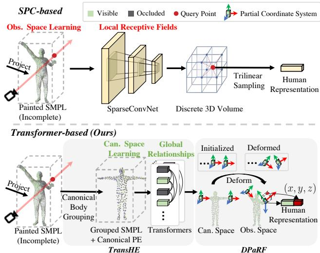
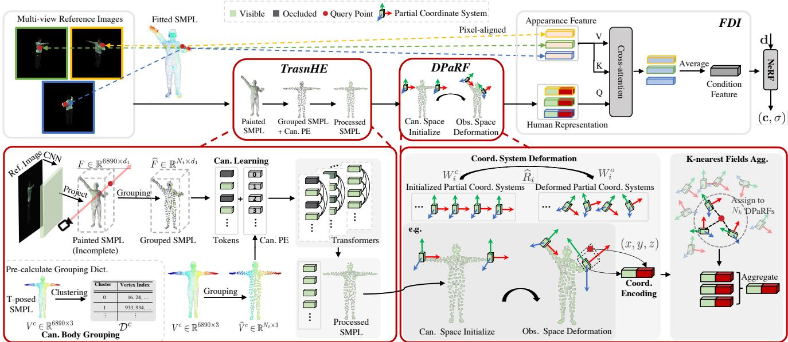
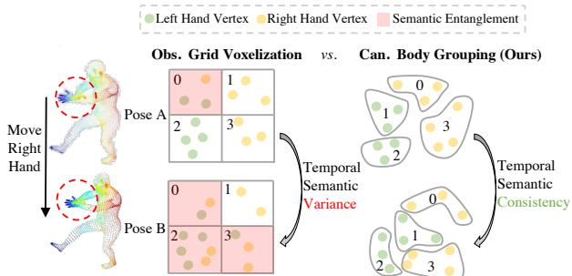
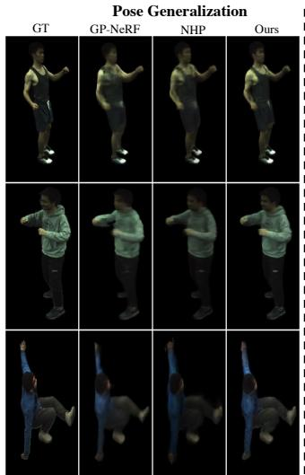
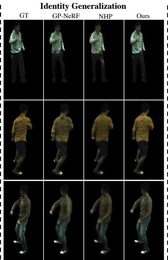
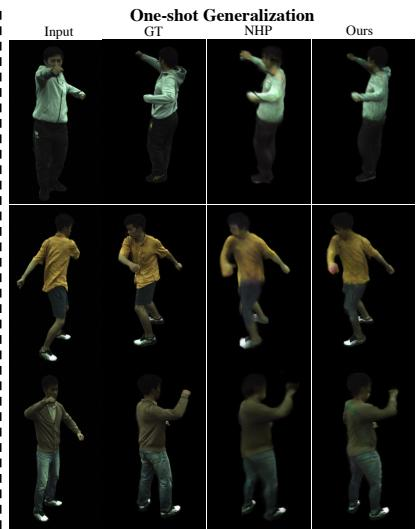
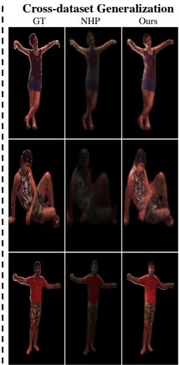
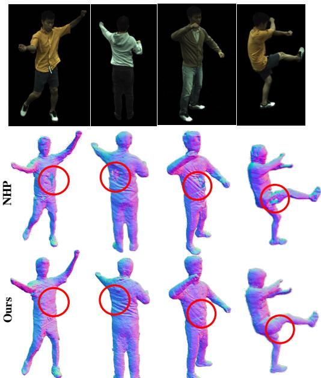
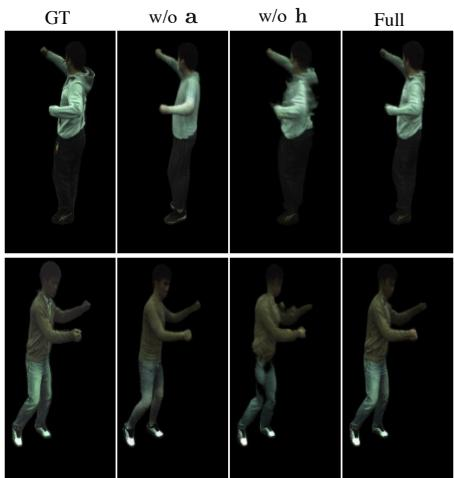
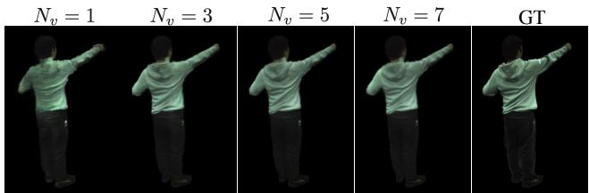

# TransHuman: A Transformer-based Human Representation for Generalizable Neural Human Rendering

Xiao Pan1,2⇤, Zongxin Yang1, Jianxin Ma2, Chang Zhou2, Yi Yang1† 1ReLER Lab, CCAI, Zhejiang University, China 2Alibaba DAMO Academy, China xiaopan, yangzongxin, yangyics @zju.edu.cn majx13fromthu, ericzhou.zc @alibaba-inc.com

## Abstract

In this paper, we focus on the task of generalizable neural human rendering which trains conditional Neural Radiance Fields (NeRF) from multi-view videos of different characters. To handle the dynamic human motion, previous methods have primarily used a SparseConvNet (SPC)- based human representation to process the painted SMPL. However, such SPC-based representation i) optimizes under the volatile observation space which leads to the posemisalignment between training and inference stages, and ii) lacks the global relationships among human parts that is criticalfor handling the incomplete painted SMPL. Tackling these issues, we present a brand-newframework named TransHuman, which learns the painted SMPL under the canonical space and captures the global relationships between human parts with transformers. Specifically, TransHuman is mainly composed of Transformer-based Human Encoding (TransHE), Deformable Partial Radiance Fields (DPaRF), and Fine-grained Detail Integration (FDI). TransHE first processes the painted SMPL under the canonical space via transformers for capturing the global relationships between human parts. Then, DPaRF binds each output token with a deformable radiance fieldfor encoding the query point under the observation space. Finally, the FDI is employed to further integrate fine-grained informationfrom reference images. Extensive experiments on ZJU-MoCap and H36M show that our TransHuman achieves a significantly new state-of-the-art performance with high efficiency. Project page: https://pansanity666. github.io/TransHuman/

## 1. Introduction

Rendering high-fidelity free-viewpoint videos of dynamic human performers is vital for many applications such as mixed reality, gaming, and telepresence. Compared to general 2D-to-3D estimation/reconstruction [29, 32, 50], human-centric reconstruction [33] is a more difficult task considering the dynamic and deformable nature of the human body, yet can be improved by incorporating prior knowledge about human body through the construction of multi-knowledge representations [47].

  
Figure 1. Comparisons between existing SPC-based and our transformer-based human representations. Given the incomplete painted SMPL, the SPC-based one optimizes under the varying observation space with limited receptive fields from 3D convolution. Instead, our transformer-based one optimizes under the canonical space with global relationships between human parts.

Recent works [33, 31, 44, 38] integrate the Neural Radiance Fields (NeRF) [29] technology with parametric human prior models (e.g., SMPL [26]) for handling the dynamic human body and achieve fair novel view synthesis results. However, the tedious per-subject optimization and the requirement of dense training views largely hinder the application of such methods. Targeting these issues and inspired by the recent success of generalizable NeRF [51, 5, 42] on static scenes, the task of generalizable neural human rendering is proposed [19], which trains conditional NeRF across multi-view human videos, and can generalize to a new subject in a single feed-forward manner given sparse reference views as input.

Previous methods for generalizable neural human rendering [6, 19] mainly employ the SparseConvNet (SPC) [23]-based human representation (upper row of Fig. 1) which first project deep features from reference images onto the vertices of fitted SMPL and then diffuse them to nearby regions via SPC. The final representation is achieved via trilinear sampling in the discrete 3D feature volume. Such SPC-based representation mainly suffers from the following two aspects: (i) Volatile observation learning. The SPC-based one optimizes under the observation space that contains varying poses. This leads to the pose misalignment during training and inference stages, and therefore limits the generalization ability. (ii) Limited local receptive fields. As shown in Fig. 1, due to the heavy self-occlusion of dynamic human bodies, the painted SMPL templates are usually incomplete. While as a 3D convolution network, the limited local receptive fields of SPC make it sensitive to the incomplete input, especially when the occluded regions are large.

To address the aforementioned issues, we propose to first process the painted SMPL with transformers under the static canonical space to remove the pose misalignment between training and inference stages and capture the global relationships between human parts. Then, a deformation from the canonical to the observation space is required to fetch the human representation of a query point (sampling points on rays) under the observation space. Finally, the fine-grained information directly achieved from the observation space should be further included to the coarse human representation to complement the details.

Motivated by this, we present the TransHuman, a brandnew framework that shows superior generalization ability with high efficiency. TransHuman is mainly composed of Transformer-based Human Encoding (TransHE), Deformable Partial Radiance Fields (DPaRF), and Finegrained Detail Integration (FDI). (i) TransHE. TransHE is a pipeline that processes the painted SMPL under the canonical space with transformers [10]. The core of this pipeline includes a canonical body grouping strategy for the avoidance of semantic ambiguity, and a canonical learning scheme to ease the learning of global relationships. (ii) DPaRF. DPaRF deforms the output tokens of TransHE from the canonical space to the observation space and gets a robust human representation for a query point from marched rays. As shown in Fig. 1, the main idea is to bind each token (representing a certain human part) with a radiance field whose partial coordinate system deforms as the pose changes, and the query point is encoded via the coordinates under the deformed partial coordinate systems. (iii) FDI. With TransHE and DPaRF, the human representation contains coarse information with human priors yet limited fine-grained details directly captured from the observation space. Therefore, similar to [19], we propose to further integrate the detailed information from the pixel-aligned features at the guidance of the human representation.

Extensive experiments on ZJU-MoCap [33] and H36M [16] demonstrate the superior generalization ability and high efficiency of TransHuman which attains a new state-of-the-art performance and outperforms previous methods by significant margins, e.g., +2.20 PSNR and 45% LPIPS on ZJU-MoCap [33] under the pose generalization setting.

Our contributions are summarized as follows:

• We propose a brand-new framework TransHuman for the challenging generalizable neural human rendering task which attains a significantly new state-of-the-art performance with high efficiency.

• We propose to process the painted SMPL under the canonical space to remove the pose misalignment during training and inference stages and deform it back to the observation space via DPaRF for robust query point encoding.

• To the best of our knowledge, we make the first attempt to explore the transformers technology around the painted SMPL for capturing the global relationships between human parts.

## 2. Related Work

## 2.1. Human Performance Capture

Synthesizing novel views for human performer is a longstanding topic in computer vision and graphics. Traditional methods [11, 8, 13, 9] typically require expensive hardware like depth sensors for getting reasonable results. With the recent success of Neural Radiance Fields (NeRF) [29, 2], many works [33, 31, 44, 38] have attempted to learn the 3D human representation from image inputs via differentiable rendering. However, they require tedious per-subject optimization on dense training images, and can not generalize to unseen subjects, which largely confines the real-world applications.

To tackle this issue and inspired by the recent advances of generalizable NeRF methods [51, 5, 42], the generalizable neural human rendering task is explored [19, 12, 6, 53], At the core of this task is to properly exploit the human prior from the pre-fitted parametric human model [26, 37]. One line of works [53, 12] take the parametric human model as the medium of the deformation between observation and canonical spaces using blend skinning technology [15, 20, 24], and optimize conditional NeRF under a canonical pose. Instead, another line of works [19, 6] directly diffuse the painted parametric human model under the observation space via SparseConveNet (SPC) [23] for a human representation with approximate priors, and the final condition feature for a query point is the hybrid of human representation and pixel-aligned features. Obviously, a high-quality human representation is critical in this paradigm, yet the SPC-based one optimizes under the varying observation space, lacks the global perspective, and is restricted by the trilinear sampling in discrete 3D volumes.

  
Figure 2. Overview of TransHuman. TransHE first builds a pipeline for capturing the global relationships between human parts via transformers under the canonical space. Then, DPaRF deforms the coordinate system from the canonical back to the observation space and encodes a query point as an aggregation of coordinates and condition features. Finally, FDI further gathers the fine-grained information of the observation space from the pixel-aligned appearance feature under the guidance of human representation.

Targeting these issues, we present TransHuman with an advanced human representation based on transformers [41, 40, 10], and outperforms the previous state-of-theart methods by significant margins.

## 2.2. Transformers with Neural Radiance Fields

With the significant advances of the transformer architecture in vision tasks (including classification [10, 4], segmentation [48, 49, 30], detection [3, 54], multi-model understanding [34, 7, 21], etc), several works [22, 18, 36, 42, 17, 46] have attempted to introduce it with NeRF technology. Specifically, [22] combines transformers with CNN [14] as a stronger feature extractor for reference images, [18, 36, 42] use transformers as the aggregator of source view features, and [17, 46] introduce the pre-trained transformers [34, 4] as a semantic prior to relieve the dense requirement of training views.

Differently, in this paper, we make the first attempt to apply the transformer technology around the surface of painted SMPL for a stronger human representation that captures the global relationship between human parts.

## 3. Method

Overview. The task of generalizable neural human rendering targets on learning conditional NeRF across multi-view videos of different subjects, which can generalize to unseen subjects in a single feed-forward pass given sparse reference views. At the core of the task is to get a high-quality condition feature that contains accurate subject information for each query point sampled on rays. To this end, we propose a novel framework named TransHuman which shows superior generalization ability. As shown in Fig. 2, TransHuman is mainly composed of three aspects: Transformerbased Human Encoding (TransHE), Deformable Partial Radiance Fields (DPaRF), and Fine-grained Detail Integration (FDI). § 3.1 introduces the TransHE which builds a pipeline for capturing the global relationships between human parts via transformers under the canonical space. § 3.2 demonstrates the DPaRF which deforms the processed SMPL back to the observation space and fetch a robust human representation. § 3.3 presents the FDI module that further gathers the fine-grained information directly from the observation space with the guidance of human representation. After that, we introduce the volume rendering in § 3.4, and the training and inference pipelines in § 3.5.

## 3.1. Transformer-based Human Encoding

For simplicity, we start by introducing the process of a single reference image that is applicable for all other views, and the multi-view aggregation will be detailed in § 3.3. Given a reference images I for a certain time step and its corresponding pre-fitted SMPL model $V ^ { o } \in \mathbb { R } ^ { 6 8 9 0 \times 3 }$ under the observation pose †, we first project the $d _ { 1 }$ -dimensional deep features of I extracted by CNN to the vertices of $V ^ { o }$ based on the camera information, and get the painted SMPL $F \in \mathbb { R } ^ { 6 8 9 0 \times d _ { 1 } }$ . Previous methods [19, 6] have mainly employed the SPC [23] to diffuse the painted SMPL to nearby space (Fig. 1). However, they optimize under the varying observation space which leads to the pose misalignment between training and inference stages, and the limited receptive fields of 3D convolution blocks make it sensitive to the incomplete painted SMPL input caused by the heavy self-occlusions of human bodies. Tackling these issues, we present a pipeline named Transformer-based Human Encoding (TransHE) that captures the global relationships between human parts under the canonical space. The key of TranHE includes a canonical body grouping strategy for avoiding the semantic ambiguity and a canonical learning scheme to ease the optimization and improve the generalization ability.

  
Figure 3. 2D illustration of the semantic ambiguity issue. Naive grid voxelization under the observation space leads to spatial semantic entanglement and temporal semantic variance issues, while the semantics with our canonical body grouping strategy is temporally consistent and spatially disentangled.

Canonical Body Grouping. Directly taking all the vertex features of F as input tokens of transformers is neither effective considering the misalignment between fitted SMPL and the ground truth body, nor efficient due to the large vertex number, i.e., 6890. A possible solution is to directly perform the grid voxelization [27] on $F$ under the observation pose. However, due to the complex human poses, this will lead to the semantic ambiguity issue. More concretely, the gathered vertices in each voxel are highly different as the pose changes (i.e., temporal semantic variance), and a voxel might include vertices from dispersed semantic parts (i.e., spatial semantic entanglement), as illustrated in Fig. 3.

To tackle this issue, we propose that grouping the vertices under the canonical space and then applying this canonical grouping to all the observation poses is a better choice. Compared with the varying observation poses, the canonical pose is both static and more stretched, which can largely relieve the semantic ambiguity issue via the consistent split among different poses (i.e., temporal semantic consistency) and more disentangled semantics in each voxel (i.e., spatial semantic disentanglement), as shown by the right part of Fig. 3.

Formally, we first process the canonically posed (Tposed) SMPL $V ^ { c } ~ \in ~ \bar { \mathbb { R } } ^ { 6 8 9 0 \times 3 }$ with a clustering algorithm (e.g., k-means [1]) based on the 3D coordinates, and get a grouping dictionary $\mathcal { D } ^ { c }$ caching the indexes of the SMPL vertices that belong to the same cluster, as illustrated in Fig. 2. Notice that we only need to calculate $\mathcal { D } ^ { c }$ once before training. Then, for each iteration, the features from the same cluster are aggregated via average pooling:

$$
\begin{array} { r } { \widehat { F } = \mathcal G _ { \mathcal D ^ { c } } ( F ) , \quad \widehat { F } \in \mathbb R ^ { N _ { t } \times d _ { 1 } } , } \end{array}\tag{1}
$$

where $N _ { t }$ is the number of clusters (tokens), and $\mathcal { G } _ { \mathcal { D } ^ { c } } ( \cdot )$ indicates indexing based on $\mathcal { D } ^ { c }$ and then performing average pooling in each cluster.

Canonical Learning. After grouping, we now have a decent number of input tokens, and the next question is about the choice of position embedding for each token. Since we need the condition feature of a query point under the observation space, a possible choice is to directly learn under the observation space (same as SPC-based methods [19, 6]) and use the 3D coordinates of each token under the observation pose as the position information, $i . e . , \widehat V ^ { o } = { \mathcal G } _ { { D } ^ { c } } ( V ^ { o } ) \ \in$ $\mathbb { R } ^ { N _ { t } \times 3 }$ b. However, except for the pose misalignment issue mentioned previously, $\widehat { V } ^ { o }$ is also varying for different time bsteps, which leads to the unfixed patterns of position embeddings that make it harder to capture the global relationships between human parts.

Hence, to address these issues, we propose to learn the global relationships under the static canonical space for removing the pose-misalignment and easing the learning of global relationships:

$$
\widehat F ^ { ' } = \mathcal T ( \widehat F , \gamma _ { 1 } ( \widehat V ^ { c } ) ) ,\tag{2}
$$

where ${ \widehat V } ^ { c } ~ = ~ { \mathcal G } _ { { D ^ { c } } } ( V ^ { c } )$ is the token positions under the bcanonical space, $\gamma _ { 1 } ( \cdot ) ~ : ~ \mathbb { R } ^ { 3 \to d _ { 1 } }$ represents the positional encoding used in the original NeRF [29], $\mathcal { T } ( \cdot ) : \mathbb { R } ^ { d _ { 1 }  d _ { 1 } }$ indicates the transformers, and $\widehat { F } ^ { ' } \in \mathbb { R } ^ { N _ { t } \times d _ { 1 } }$ is the output btokens with learned global relationships between each other.

## 3.2. Deformable Partial Radiance Fields

For deforming the processed SMPL back to the observation space and get a robust human representation, we present the Deformable Partial Radiance Fields (DPaRF). The main idea of DPaRF is to bind each output token of TransHE with a conditional partial radiance field for a certain semantic part whose coordinate system deforms as the pose changes under the observation space, and the query points from rays are encoded as the coordinates under the deformed coordinate system, as shown in Fig. 2.

Coordinate System Deformation. Given the i-th token $\widehat { F } _ { i } ^ { \prime } \in \mathbb { R } ^ { d _ { 1 } }$ from the TransHE output, a coordinate system $\dot { W } _ { i } ^ { c } \in \mathbb { R } ^ { 3 \times 3 }$ is initialized under the canonical space which takes $\widehat V _ { i } ^ { c } \in \mathbb R ^ { 3 }$ as the origin †. Then, as the pose changes bunder the observation space, we rotate $W _ { i } ^ { c }$ with the rotation matrix $\widehat { R } _ { i } \in \mathbb { R } ^ { 3 \times 3 }$ of token i:

$$
{ \cal W } _ { i } ^ { o } = \widehat { \cal R } _ { i } { \cal W } _ { i } ^ { c } ,\tag{3}
$$

where $\widehat { R } _ { i }$ is the averaged rotation matrix for vertices beblonging to the i-th token, i.e., $\widehat { R } = \mathcal G _ { \mathcal D ^ { c } } ( R ) \in \mathbb R ^ { N _ { t } \times 3 \times 3 }$ and $\bar { R \in \mathbb { R } ^ { 6 8 9 0 \times 3 \times 3 } }$ bcan be calculated via blending the rotation matrices of 24 joints with the blend weights provided by SMPL [26].

Coordinate Encoding. After that, for a query point p sampled from the rays under the observation space, we get its coordinate $\overline { { \mathbf { p } } } _ { i }$ under the DPaRF of the i-th token with:

$$
\overline { { { \bf p } } } _ { i } = W _ { i } ^ { o } ( { \bf p } - \widehat { V } _ { i } ^ { o } ) .\tag{4}
$$

And the final fetched human representation from the DPaRF of the i-th token is:

$$
\mathbf { h } _ { i } = [ \widehat { F } _ { i } ^ { ' } ; \gamma _ { 2 } ( \overline { { \mathbf { p } } } _ { i } ) ] , \mathbf { h } _ { i } \in \mathbb { R } ^ { d _ { 2 } } ,\tag{5}
$$

where [; ] indicates the concatenation, and ${ \widehat { F } } _ { i } ^ { \prime }$ is the condition feature for the i-th DPaRF.

K-nearest Fields Aggregation. Finally, for a more robust representation, we assign a query point p to its $N _ { k }$ nearest DPaRFs, and aggregate them based on the distances:

$$
\mathbf { h } = \sum _ { i = 1 } ^ { N _ { k } } { s o f t m a x } ( - \frac { \| \mathbf { p } - \widehat { V } _ { i } ^ { o } \| _ { 2 } } { \sum _ { i } \| \mathbf { p } - \widehat { V } _ { i } ^ { o } \| _ { 2 } } ) \mathbf { h } _ { i } , \quad \mathbf { h } \in \mathbb { R } ^ { d _ { 2 } } .\tag{6}
$$

## 3.3. Fine-grained Detail Integration

With TransHE and DPaRF, for a query point p, we can actually achieve a set of human representations from $N _ { v }$ reference views $\mathbf { h } ^ { 1 : N _ { v } } = \{ \mathbf { h } ^ { j } \} _ { j = 1 } ^ { N _ { v } } \in \mathbb { R } ^ { N _ { v } \times d _ { 2 } }$ following the same procedure. $\mathbf { h } ^ { 1 : N _ { v } }$ contains coarse information with human priors (e.g., geometry constraints and certain color information) yet lacks the fine-grained information $( e . g .$ lighting, textures) for high-fidelity novel view synthesis. Therefore, inspired by [19], we further integrate the finegrained information from the pixel-aligned appearance feature $\mathbf { a } ^ { 1 : N _ { v } } = \{ \mathbf { a } ^ { j } \} _ { j = 1 } ^ { N _ { v } } \in \mathbb { R } ^ { N v \times d _ { 2 } }$ at the guidance of human representation $\mathbf { h } ^ { 1 : \bar { N } _ { v } }$

Fine-grained Appearance Features. For the appearance features, instead of directly using projected deep features from CNN, $i . e . ,$ , the one used when painting SMPL, we additionally concatenate the projected RGB-level information from the raw images and then fuse them with a fully connected layer $F C ( \cdot ) : \mathbb { R } ^ { 3 + d _ { 1 }  d _ { 2 } }$ . The projected RGB features can complement the misaligned and lost details caused by the down-sample operation in CNN.

Coarse-to-fine Integration. Then, we employ a crossattention module which takes the human representation $\mathbf { h } ^ { 1 : N _ { v } }$ as the query, and the appearance feature $\mathbf { a } ^ { 1 : N _ { v } }$ as the key and value, and get the integrated feature $\mathbf { f } ^ { 1 : N _ { v } } \in$ I $\mathbb { R } ^ { N _ { v } \times \dot { d } _ { 2 } }$ . The final condition feature $\mathbf { f } \in \mathbb { R } ^ { d _ { 2 } }$ of query point p is achieved via the average pooling on the view dimension: $\begin{array} { r } { \mathbf { f } = \sum _ { j = 1 } ^ { N _ { c } } \frac { 1 } { N _ { c } } \mathbf { f } ^ { j } } \end{array}$

## 3.4. Volume Rendering

Desnity & Color Prediction. The final density $\sigma ( \mathbf { p } ) \in \mathbb { R } ^ { 1 }$ and color $\mathbf { c } ( \mathbf { p } ) \in \mathbb { R } ^ { 3 }$ are predicted as:

$$
\begin{array} { l } { { \displaystyle \sigma ( { \bf p } ) = M L P _ { \sigma } ( { \bf f } ) , } } \\ { { \displaystyle { \bf c } ( { \bf p } ) = M P L _ { \bf c } ( { \bf f } , \gamma _ { 3 } ( { \bf d } ) ) , } } \end{array}\tag{7}
$$

where $M L P _ { \sigma }$ and $M L P _ { \bf c }$ are NeRF MLPs for density and color predictions, respectively, and d is the unit view direction of the ray.

Differentiable Rendering. Then, for a marched ray $\mathbf { r } ( z ) =$ $\mathbf { o } + z \mathbf { d }$ , where $\mathbf { o } \in \mathbb { R } ^ { 3 }$ represents the camera center, and $z \in \mathbb { R } ^ { 1 }$ is the depth between a pre-defined bounds $[ z _ { n } , z _ { f } ]$ ， its color C(r) is calculated via the differentiable volume rendering [29]:

$$
\mathbf { C } ( \mathbf { r } ) = \int _ { z _ { n } } ^ { z _ { f } } T ( z ) \sigma ( z ) \mathbf { c } ( z ) d z ,\tag{8}
$$

where $\begin{array} { r } { T ( z ) = e x p { \bigl ( } - \int _ { z _ { n } } ^ { z } \sigma ( s ) d s { \bigr ) } } \end{array}$ represents the probability that the ray travels from $z \ \mathrm { t o } \ z _ { n }$

## 3.5. Training & Inference

Training Losses. We compare the rendered pixel colors with the ground truth ones for supervision. Similar to [44], we employ the MSE loss for pixel-wise and perceptual loss [52] for patch-wise supervision, which is more robust to misalignments. The random patch sampling [44] is employed for supporting perceptual loss training. The overall loss is:

$$
\begin{array} { r } { \mathcal { L } = \mathcal { L } _ { M S E } + \lambda \mathcal { L } _ { P E R } , } \end{array}\tag{9}
$$

where we set $\lambda = 0 . 1$ by default.

Inference. During the inference stage, for each time step, $N _ { v }$ reference views are provided and the rendered target views are compared with the ground truth ones for calculating the metrics. Notably, GP-NeRF [6] has proposed a fast rendering scheme that leverages the coarse geometry prior from the 3D feature volume to filter out useless points. Similarly, our framework also supports such strategy by simply using the SMPL template as the geometry prior instead (detailed in the appendix).

## 4. Experimental Results

## 4.1. Experimental Settings

Datasets. We benchmark on ZJU-MoCap [33] and H36M [16] for verifying the effectiveness of our TransHuman.

<table><tr><td rowspan="2">Method</td><td colspan="2">Dataset</td><td rowspan="2">Per-subject training</td><td colspan="2">Unseen</td><td rowspan="2">↑PSNR</td><td rowspan="2">Results ↑SSIM</td><td rowspan="2">↓LPIPS</td></tr><tr><td>Train</td><td>Test</td><td>Pose</td><td>Subject</td></tr><tr><td colspan="10">Pose Generalization</td></tr><tr><td>NV [T0G19] [25]</td><td>ZJU-7</td><td>ZJU-7</td><td></td><td></td><td>X</td><td>22.00</td><td>0.818</td><td></td></tr><tr><td>NT [TOG19] [39]</td><td>ZJU-7</td><td>ZJU-7</td><td></td><td></td><td>X</td><td>22.28</td><td>0.872</td><td></td></tr><tr><td>NHR[CVPR20] [45]</td><td>ZJU-7</td><td>ZJU-7</td><td></td><td></td><td>X</td><td>22.31</td><td>0.871</td><td></td></tr><tr><td>NB [CVPR21] [33]</td><td>ZJU-7</td><td>ZJU-7</td><td></td><td></td><td>X</td><td>23.79</td><td>0.887</td><td></td></tr><tr><td>NHP [NIPS21] [19]</td><td>ZJU-7</td><td>ZJU-7</td><td>X</td><td></td><td>x</td><td>24.60</td><td>0.910</td><td>0.147</td></tr><tr><td>GP-NeRF [ECCV22] [6]</td><td>ZJU-7</td><td>ZJU-7</td><td>X</td><td></td><td>X</td><td>25.05</td><td>0.909</td><td>0.159</td></tr><tr><td>Ours</td><td>ZJU-7</td><td>ZJU-7</td><td>X</td><td></td><td>X</td><td>27.25</td><td>0.936</td><td>0.087</td></tr><tr><td colspan="9">Identity Generalization</td></tr><tr><td>NV [T0G19] [25] NT [T0G19] [39]</td><td>ZJU-3 ZJU-3</td><td>ZJU-3 ZJU-3</td><td></td><td></td><td>X X</td><td>20.84 21.92</td><td>0.827 0.873</td><td></td></tr><tr><td>NHR [CVPR20] [45]</td><td>ZJU-3</td><td>ZJU-3</td><td></td><td></td><td>X</td><td>22.03</td><td>0.875</td><td></td></tr><tr><td>NB [CVPR21] [33]</td><td>ZJU-3</td><td>ZJU-3</td><td></td><td></td><td>X</td><td>22.88</td><td>0.880</td><td></td></tr><tr><td>PVA [arXiv21] [35]</td><td>ZJU-7</td><td>ZJU-3</td><td>X</td><td></td><td></td><td>23.15</td><td>0.866</td><td></td></tr><tr><td>PixelNeRF [CVPR21] [51]</td><td>ZJU-7</td><td>ZJU-3</td><td>X</td><td></td><td></td><td>23.17</td><td>0.869</td><td></td></tr><tr><td>KeyNeRF [ECCV22] [28]</td><td>ZJU-7</td><td>ZJU-3</td><td>X</td><td></td><td></td><td>25.03</td><td>0.897</td><td></td></tr><tr><td>GP-NeRF [ECCV22] [6]</td><td>ZJU-7</td><td>ZJU-3</td><td>x</td><td></td><td></td><td>24.55</td><td>0.902</td><td></td></tr><tr><td>NHP [NIPS21] [19]</td><td>ZJU-7</td><td>ZJU-3</td><td>X</td><td></td><td></td><td>24.94</td><td></td><td>0.157</td></tr><tr><td>Ours</td><td></td><td></td><td></td><td></td><td></td><td></td><td>0.905</td><td>0.144</td></tr><tr><td></td><td>ZJU-7</td><td>ZJU-3</td><td>X</td><td></td><td></td><td>26.15</td><td>0.918</td><td>0.098</td></tr><tr><td>GP-NeRF† [ECCV22] [6] Ours†</td><td>ZJU-7</td><td>ZJU-3</td><td>X</td><td></td><td></td><td>26.83</td><td>0.924</td><td>0.132</td></tr><tr><td></td><td>ZJU-7</td><td>ZJU-3</td><td>X</td><td></td><td></td><td>27.55</td><td>0.933</td><td>0.090</td></tr><tr><td colspan="9">One-shot Generalization</td></tr><tr><td>NHP [NIPS21] [19]</td><td>ZJU-7</td><td>ZJU-3</td><td>X</td><td></td><td></td><td>23.20</td><td>0.877</td><td>0.182</td></tr><tr><td>Ours</td><td>ZJU-7</td><td>ZJU-3</td><td>X</td><td></td><td></td><td>24.11</td><td>0.891</td><td>0.142</td></tr><tr><td colspan="9">Cross-dataset Generalization</td></tr><tr><td>NHP [NIPS21] [19]</td><td>ZJU-7</td><td>H36M</td><td>X</td><td></td><td></td><td>18.84</td><td>0.820</td><td>0.222</td></tr><tr><td>Ours</td><td>ZJU-7</td><td>H36M</td><td>X</td><td></td><td></td><td>20.48</td><td>0.856</td><td>0.169</td></tr></table>

Table 1. Comparisons of generalization ability with the state-of-the-art methods. We achieve a significantly new sate-of-the-art performance compared with both generalizable [35, 51, 6, 19, 28] and per-subject methods [25, 39, 45, 33]. Following [19], the per-subject optimization methods are trained on the training part of each subject since they can not generalize to unseen subjects, which is actually an easier task. “†” means using the officially released human split from GP-NeRF [6] and employing the overfitting trick used in GP-NeRF.

(i) ZJU-MoCap [33] provides multi-view videos of 10 human subjects with 23 synchronized cameras, together with the pre-fitted SMPL parameters and human masks. Each video spans between 1000 to 2000 frames and contains complicated motions like “Taichi” and “Twirl”. Following [19, 6], 10 subjects are split into 7 source subjects (ZJU-7) and 3 target subjects (ZJU-3), and each subject is further divided into training and testing parts. We strictly follow the officially released human split from [19] for training and testing. We refer the detailed split information to the appendix. To prove that our method can welly handle the incomplete painted SMPL, we additionally report the performance of the one-shot generalization setting, i.e., only 1 reference view is provided during inference.

(ii) H36M [16] records multi-view videos with 4 cameras and includes multiple subjects with complex motions. We use the preprocessed one by [31] which contains representative subjects S1, S5, S6, S7, S8, S9, S11, and their corresponding SMPL parameters and human masks. We verify the cross-dataset generalization ability with H36M, i.e., trained on ZJU-MoCap and then directly inference on

H36M. The first 3 views are taken as the reference views, and the last one is used as the target view.

Evaluation Metrics. For novel view synthesis, we report the commonly used Peak Signal-to-Noise Ratio (PSNR), Structural Similarity Index Measure (SSIM) [43], and Learned Perceptual Image Patch Similarity (LPIPS) [52]. PSNR and SSIM are low-level metrics, while LPIPS reflects human perception using CNN features. For 3D reconstruction, following [19, 6], we only report the qualitative results since ground truth meshes are unavailable.

## 4.2. Implementation Details

In line with [19], we take the ResNet-18 [14] (only the first 3 layers are used) as the CNN for extracting the deep features from reference images and set the multi-view number $N _ { v } \ = \ 3 $ . The number of clusters (tokens) in human body grouping is set as $N _ { t } ~ = ~ 3 0 0$ , and the light-weight ViT-Tiny [10] is employed as the transformer module. Each query point is assigned with $N _ { k } = 7 ~ \mathrm { D P a R F s }$ . Following [19, 6], we train on ZJU-MoCap with 512 512 resolutions, and for each ray we sample 64 points by default during both the training and inference stages.

  
Figure 4. Visualization comparisons with previous state-of-the-art methods on ZJU-MoCap (pose generalization, identity generalization) and H36M (cross-dataset generalization). Our method shows significantly better generalization ability with better body geometry and more accurate details like textures and lighting

  
Figure 5. 3D reconstruction under the identity generalization setting. Our method achieves more complete geometry with details like wrinkles compared with NHP [19] which employs a SPCbased human representation.

## 4.3. Comparisons with State-of-the-art

Baselines. Following [19, 6], we compare with both persubject optimization methods [33, 39, 45, 25] and generalizable methods [35, 51, 28, 19, 6]. For per-subject optimization methods, an individual model is trained on the training part of each subject. Notably, previous stateof-the-art methods for generalizable neural human rendering [19, 6] actually use different human splits in their officially released code and are not in line with the one used in their papers (performance is not reproducible). Hence, for fair comparisons, we unify them under the released human split of NHP [19]. Specifically, we report the performance of NHP [19] using the official checkpoint, and re-run the official code of GP-NeRF [6] under the unified human split. Note that, GP-NeRF has employed an overfitting trick which we think is unreasonable, i.e., they overfit the test reference views instead of randomly sampling during the training stage. This trick leaks the test information to the training stage, therefore we remove it in our re-running. We also provide the comparisons under the released human split of GP-NeRF with the overfitting trick, where our method outperforms it consistently by large margins.

Novel View Synthesis. We compare the quantitative results with previous state-of-the-art methods in Table 1. Obviously, we outperform them by significant margins under all the settings. Notably, for the identity generalization setting, the per-subject methods are directly trained on the target subjects while our method is only trained on the source subjects, yet we still outperform them by large margins, i.e., +3.27 in PSNR. Compared with the recent SPC-based generalizable methods [19, 6], our method also shows healthy margins, i.e., +2.20 PSNR and 45% LPIPS compared with the second-best under the pose generalization setting. For the more challenging cross-dataset generalization setting, we also outperform the baseline methods remarkably albeit these two datasets [33, 16] have significantly different distributions, which proves the superior generalization ability of our TransHuman.

The qualitative comparisons are illustrated in Fig. 4, where our TransHuman gives significantly better details and body geometry. We attribute this to the careful design of our framework, i.e., the global human representation brings more complete body geometry, the canonical learning scheme gives better generalization ability, and FDI further includes more fine-grained details like textures and lighting.

<table><tr><td>Method</td><td>↑PSNR</td><td>↑SSIM</td><td>↓LPIPS</td></tr><tr><td>obs. body grouping obs. PE</td><td>25.28 25.80</td><td>0.909 0.915</td><td>0.111 0.102</td></tr><tr><td>can. body grouping + can. PE</td><td>26.15</td><td>0.918</td><td>0.098</td></tr></table>

Table 2. Ablation of TransHE. Our canonical body grouping together with the canonical learning scheme performs best.
<table><tr><td>Method</td><td>↑PSNR</td><td>↑SSIM</td><td>↓LPIPS</td></tr><tr><td>w/o coordinate</td><td>25.80</td><td>0.912</td><td>0.123</td></tr><tr><td>absolute coordinate</td><td>25.76</td><td>0.912</td><td>0.116</td></tr><tr><td>w/o k-nearest fields</td><td>26.05</td><td>0.916</td><td>0.099</td></tr><tr><td>full model</td><td>26.15</td><td>0.918</td><td>0.098</td></tr></table>

Table 3. Ablation of DPaRF. Coordinate encoding is critical and the k-nearest fields aggregation can further bring improvements.

3D Reconstruction. The 3D reconstruction results are illustrated in Fig. 5. Compared with NHP [19] that uses the SPC-based human representation, our method achieves a more complete and fine-grained geometry with details like wrinkles.

## 4.4. Ablation Studies

Following [19], we perform ablation studies under the identity generalization setting. Due to the limited space, we refer more detailed ablation studies to the appendix.

Ablation of TransHE. We first study the effectiveness of canonical body grouping and canonical learning scheme in Table 2. When performing the body grouping under the observation space with grid voxelization (“obs. body grouping”), the performance suffers a significant drop from 26.15 to 25.28 in PSNR. As introduced in § 3.1, performing grouping under the observation space leads to the semantic ambiguity issue, therefore leading to worse performance. Then, “obs. PE” changes the position embedding of input tokens from the canonical positions $\hat { V } ^ { c }$ to observation positions ${ \hat { V } } ^ { o }$ , and also observes a significant decrease, e.g., 0.35 in PSNR. The canonical learning scheme eases the optimization and removes the pose misalignment between training and inference stages, therefore leading to better performance.

Ablation of DPaRF. We verify the effectiveness of DPaRF in Table 3. “w/o coordinate” represents removing the coordinate part from the human representation. As expected, the performance drops by significant margins ( 0.35 in PSNR). Coordinates contain the accurate position information of query point in each DPaRF, therefore is important. “absolute coordinate” indicates using the absolute coordinate of query point, i.e., p instead of p in Eq. 5, and the performance does not show significant improvement compared with “w/o coordinate”. This further proves the importance of using the coordinate under the deformed coordinate systems. Finally, “w/o k-nearest fields” shows that the k-nearest fields aggregation design can bring certain im provement on all the metrics.

<table><tr><td>Method</td><td>↑PSNR</td><td>↑SSIM</td><td>↓LPIPS</td></tr><tr><td>w/o a</td><td>24.58</td><td>0.898</td><td>0.134</td></tr><tr><td>w/o h</td><td>24.66</td><td>0.897</td><td>0.143</td></tr><tr><td>w/o RGB</td><td>26.05</td><td>0.917</td><td>0.101</td></tr><tr><td>full model</td><td>26.15</td><td>0.918</td><td>0.098</td></tr></table>

Table 4. Ablation of FDI. Using the appearance feature and human representation individually leads to the drop of performance, and the raw RGB feature can bring certain improvement.

<table><tr><td>Method</td><td>↑PSNR</td><td>↑SSIM</td><td>↓ LPIPS</td></tr><tr><td>SPC + trilinear</td><td>25.14</td><td>0.907</td><td>0.102</td></tr><tr><td>TransHE + DPaRF (ours)</td><td>26.15</td><td>0.918</td><td>0.098</td></tr></table>

Table 5. Comparision with SPC-based representation. Our transformer-based representation outperforms the SPC-based one significantly.

  
Figure 6. Ablation of human representation h and appearance feature a in FDI. Human representation h provides geometry constraints from human priors and coarse color information, and further integrates fine-grained information from appearance features a with FDI.

Ablation of FDI. We first perform the ablation of FDI by individually removing the appearance feature part (“w/o a”) or the human representation part (“w/o h”). As illustrated in Table 4, merely using either of them gives an unsatisfactory performance. Then, “w/o RGB” shows that the raw RGB features can further bring a measure of improvement.

We provide the visual ablation examples of human representation h and appearance feature a in Fig. 6. Obviously, the human representation h contains geometry constraints from human priors with coarse color information, while a shows more vivid colors with poor geometry. Hence, we propose to take the coarse human representation as the guidance for integrating proper fine-grained details from the appearance feature.

Comparisons with SPC-based Representation. To further verify the effectiveness of our proposed transformerbased human representation, we directly replace the TransHE and DPaRF modules with SPC and trilinear sampling in our code. We follow [19] to configure the SPC including the architecture and input resolution. As shown by Table 5, our proposed transformer-based representation outperforms the SPC-based one by significant margins among all the metrics under a fair comparison setting.

<table><tr><td>Method</td><td>↑PSNR</td><td>↑SSIM</td><td>↓LPIPS</td></tr><tr><td> $\overline { { N _ { t } = 1 0 0 } }$ </td><td>26.04</td><td>0.917</td><td>0.100</td></tr><tr><td> $N _ { t } = 3 0 0$ </td><td>26.15</td><td>0.918</td><td>0.098</td></tr><tr><td> $N _ { t } = 5 0 0$ </td><td>26.10</td><td>0.917</td><td>0.100</td></tr><tr><td> $N _ { t } = 1 0 0 0$ </td><td>26.07</td><td>0.917</td><td>0.100</td></tr></table>

Table 6. Influence of cluster number $N _ { t } .$ $N _ { t } = 3 0 0$ gives the best performance.
<table><tr><td>Method</td><td>↑PSNR ↑SSIM</td><td>↓LPIPS</td></tr><tr><td> $\overline { { N _ { k } = 1 } }$ </td><td>26.05 0.917</td><td>0.099</td></tr><tr><td> $N _ { k } = 3$ </td><td>26.11 0.918</td><td>0.100</td></tr><tr><td> $N _ { k } = 5$ </td><td>26.13 0.918</td><td>0.100</td></tr><tr><td> $N _ { k } = 7$ </td><td>26.15 0.918</td><td>0.098</td></tr><tr><td> $N _ { k } = 9$ </td><td>26.10 0.917</td><td>0.100</td></tr></table>

Table 7. Influence of k-nearest number $\overline { { N _ { k } . \ N _ { k } = 7 } }$ performs best.

<table><tr><td>Method</td><td>↑PSNR</td><td>↑SSIM</td><td>↓LPIPS</td><td>Inference Time</td></tr><tr><td> $\overline { { N _ { v } = 1 } }$ </td><td>24.11</td><td>0.891</td><td>0.142</td><td>12min</td></tr><tr><td> $N _ { v } = 3$ </td><td>26.15</td><td>0.918</td><td>0.098</td><td>17min</td></tr><tr><td> $N _ { v } = 5$ </td><td>26.49</td><td>0.923</td><td>0.093</td><td>24min</td></tr><tr><td> $N _ { v } = 7$ </td><td>26.72</td><td>0.926</td><td>0.091</td><td>35min</td></tr></table>

Table 8. Influence of multi-view number $\overline { { N _ { v } } } .$ Results under the identity generalization setting are reported.

Influence of Cluster Number $N _ { t } .$ We study the influence of cluster (token) number by varying it sequentially as 100, 300, 500, 1000 . As shown in Table 6, too large cluster number does not bring further improvement. As mentioned in § 3.1, there exists misalignment between the fitted SMPL and the ground truth body. Larger cluster number may also include more misleading information, and we only intend to take the human representation as the coarse-level guidance, therefore we set $N _ { t } = 3 0 0$

Influence of K-nearest Number $N _ { k } .$ We show the influence of k-nearest number $N _ { k }$ in Table 7. When using no k-nearest fields aggregation, $i . e . , N _ { k } = 1$ , the performance suffers a relatively significant drop in PSNR. This shows that using k-nearest fields aggregation can improve the robustness of human representation. When $N _ { k } > 1$ , the performance tends to be more stable, and we choose $N _ { k }$ as 7 since it gives the best performance.

Influence of Multi-view Number $N _ { v } .$ We test the influence of multi-view number $N _ { v }$ in Table 8 and show one example case in Fig. 7. We fix the model trained with $N _ { v } = 3 .$ and vary it during inference as $\{ 1 , 3 , 5 , 7 \}$ . Generally, the performance tends to get saturated as $N _ { v }$ getting larger, yet the inference time is also increased.

  
Figure 7. Visual results of different multi-view number $N _ { v } .$

<table><tr><td>Method</td><td>Param.</td><td>Inference Inference Time</td><td>Mem.</td><td>Training Mem.</td><td>PSNR</td></tr><tr><td>NHP [19]</td><td>5.80M</td><td>1h55min</td><td>6.4GB</td><td>12.2GB</td><td>24.94</td></tr><tr><td rowspan="2">GP-NeRF [6] Ours-16pts</td><td>9.52M</td><td>9min</td><td>10.3GB</td><td>11.0GB</td><td>24.55</td></tr><tr><td>6.08M</td><td>9min</td><td>5.7GB</td><td>7.8GB</td><td>25.39</td></tr><tr><td>Ours</td><td>6.08M</td><td>17min</td><td>6.2GB</td><td>7.8GB</td><td>26.15</td></tr></table>

Table 9. Efficiency comparisons under the identity generalization setting. With the same inference time, our method outperforms GP-NeRF [6] significantly in PSNR albeit requiring fewer parameters and training/inference memory. The performance can further be greatly improved at the cost of certain additional inference time and minor inference memory.

## 4.5. Efficiency Analysis

We compare the efficiency of our method with previous state-of-the-art methods in Table 9 under the identity generalization setting (438 frames). For a fair comparison with the previously fastest method GP-NeRF [6] under the same inference time, we provide a fast version of our method by reducing the sampling points per ray from 64 to 16 during inference (“Ours-16pts”). Obviously, with the same inference time, our method still outperforms GP-NeRF by 0.84 in PSNR albeit using merely 64% parameters, 55% inference memory, and 71% training memory, and the performance can be further significantly improved with acceptable additional cost. This proves that our TransHuman is both effective and efficient.

## 5. Conclusion

In this paper, we propose a brand-new framework named TransHuman for the generalizable neural human rendering task. At the core of TransHuman is a canonically optimized human representation with global relationships between human parts captured by transformers which shows superior generalization ability. We hope that our efforts will motivate more researchers in the future.

Limitations and Future Work. There are remaining challenges to be explored, such as including the joint optimization of fitted SMPL under the generalizable setting and training on unconstrained capture setups.

Acknowledgements. This work was supported by the Natural Science Foundation of Zhejiang Province (DT23F020008) and the Fundamental Research Funds for the Central Universities (226-2023-00051).

## References

[1] Mohiuddin Ahmed, Raihan Seraj, and Syed Mohammed Shamsul Islam. The k-means algorithm: A comprehensive survey and performance evaluation. Electronics, 9(8):1295, 2020. 4

[2] Jonathan T Barron, Ben Mildenhall, Matthew Tancik, Peter Hedman, Ricardo Martin-Brualla, and Pratul P Srinivasan. Mip-nerf: A multiscale representation for anti-aliasing neural radiance fields. In Proceedings of the IEEE/CVF International Conference on Computer Vision, pages 5855–5864, 2021. 2

[3] Nicolas Carion, Francisco Massa, Gabriel Synnaeve, Nicolas Usunier, Alexander Kirillov, and Sergey Zagoruyko. End-toend object detection with transformers. In Computer Vision– ECCV 2020: 16th European Conference, Glasgow, UK, August 23–28, 2020, Proceedings, Part I 16, pages 213–229. Springer, 2020. 3

[4] Mathilde Caron, Hugo Touvron, Ishan Misra, Herve J ´ egou, ´ Julien Mairal, Piotr Bojanowski, and Armand Joulin. Emerging properties in self-supervised vision transformers. In Proceedings of the International Conference on Computer Vision (ICCV), 2021. 3

[5] Anpei Chen, Zexiang Xu, Fuqiang Zhao, Xiaoshuai Zhang, Fanbo Xiang, Jingyi Yu, and Hao Su. Mvsnerf: Fast generalizable radiance field reconstruction from multi-view stereo. In Proceedings of the IEEE/CVF International Conference on Computer Vision, pages 14124–14133, 2021. 1, 2

[6] Mingfei Chen, Jianfeng Zhang, Xiangyu Xu, Lijuan Liu, Yujun Cai, Jiashi Feng, and Shuicheng Yan. Geometry-guided progressive nerf for generalizable and efficient neural human rendering. In ECCV, 2022. 2, 4, 5, 6, 7, 9, 13

[7] Yangming Cheng, Liulei Li, Yuanyou Xu, Xiaodi Li, Zongxin Yang, Wenguan Wang, and Yi Yang. Segment and track anything. arXiv preprint arXiv:2305.06558, 2023. 3

[8] Alvaro Collet, Ming Chuang, Pat Sweeney, Don Gillett, Dennis Evseev, David Calabrese, Hugues Hoppe, Adam Kirk, and Steve Sullivan. High-quality streamable free-viewpoint video. ACM Transactions on Graphics (ToG), 34(4):1–13, 2015. 2

[9] Paul Debevec, Tim Hawkins, Chris Tchou, Haarm-Pieter Duiker, Westley Sarokin, and Mark Sagar. Acquiring the reflectance field of a human face. In Proceedings of the 27th annual conference on Computer graphics and interactive techniques, pages 145–156, 2000. 2

[10] Alexey Dosovitskiy, Lucas Beyer, Alexander Kolesnikov, Dirk Weissenborn, Xiaohua Zhai, Thomas Unterthiner, Mostafa Dehghani, Matthias Minderer, Georg Heigold, Sylvain Gelly, et al. An image is worth 16x16 words: Transformers for image recognition at scale. arXiv preprint arXiv:2010.11929, 2020. 2, 3, 6

[11] Mingsong Dou, Sameh Khamis, Yury Degtyarev, Philip Davidson, Sean Ryan Fanello, Adarsh Kowdle, Sergio Orts Escolano, Christoph Rhemann, David Kim, Jonathan Taylor, et al. Fusion4d: Real-time performance capture of challenging scenes. ACM Transactions on Graphics (ToG), 35(4):1– 13, 2016. 2

[12] Xiangjun Gao, Jiaolong Yang, Jongyoo Kim, Sida Peng, Zicheng Liu, and Xin Tong. Mps-nerf: Generalizable 3d human rendering from multiview images. IEEE Transactions on Pattern Analysis and Machine Intelligence, pages 1–12, 2022. 2

[13] Kaiwen Guo, Peter Lincoln, Philip Davidson, Jay Busch, Xueming Yu, Matt Whalen, Geoff Harvey, Sergio Orts-Escolano, Rohit Pandey, Jason Dourgarian, et al. The relightables: Volumetric performance capture of humans with realistic relighting. ACM Transactions on Graphics (ToG), 38(6):1–19, 2019. 2

[14] Kaiming He, Xiangyu Zhang, Shaoqing Ren, and Jian Sun. Deep residual learning for image recognition. In Proceedings ofthe IEEE conference on computer vision and pattern recognition, pages 770–778, 2016. 3, 6

[15] Zeng Huang, Yuanlu Xu, Christoph Lassner, Hao Li, and Tony Tung. Arch: Animatable reconstruction of clothed humans. In Proceedings of the IEEE/CVF Conference on Computer Vision and Pattern Recognition, pages 3093–3102, 2020. 2

[16] Catalin Ionescu, Dragos Papava, Vlad Olaru, and Cristian Sminchisescu. Human3. 6m: Large scale datasets and predictive methods for 3d human sensing in natural environments. IEEE transactions on pattern analysis and machine intelligence, 36(7):1325–1339, 2013. 2, 5, 6, 7, 14, 15

[17] Ajay Jain, Matthew Tancik, and Pieter Abbeel. Putting nerf on a diet: Semantically consistent few-shot view synthesis. In Proceedings of the IEEE/CVF International Conference on Computer Vision, pages 5885–5894, 2021. 3

[18] Mohammad Mahdi Johari, Yann Lepoittevin, and Franc¸ois Fleuret. Geonerf: Generalizing nerf with geometry priors. In Proceedings of the IEEE/CVF Conference on Computer Vision and Pattern Recognition, pages 18365–18375, 2022. 3

[19] Youngjoong Kwon, Dahun Kim, Duygu Ceylan, and Henry Fuchs. Neural human performer: Learning generalizable radiance fields for human performance rendering. Advances in Neural Information Processing Systems, 34, 2021. 1, 2, 4, 5, 6, 7, 8, 9, 13, 15

[20] John P Lewis, Matt Cordner, and Nickson Fong. Pose space deformation: a unified approach to shape interpolation and skeleton-driven deformation. In Proceedings of the 27th annual conference on Computer graphics and interactive techniques, pages 165–172, 2000. 2

[21] Kexin Li, Zongxin Yang, Lei Chen, Yi Yang, and Jun Xiao. Catr: Combinatorial-dependence audio-queried transformer for audio-visual video segmentation. In Proceedings of the 31th ACM International Conference on Multimedia, 2023. 3

[22] Kai-En Lin, Lin Yen-Chen, Wei-Sheng Lai, Tsung-Yi Lin, Yi-Chang Shih, and Ravi Ramamoorthi. Vision transformer for nerf-based view synthesis from a single input image. In WACV, 2023. 3

[23] Baoyuan Liu, Min Wang, Hassan Foroosh, Marshall Tappen, and Marianna Pensky. Sparse convolutional neural networks. In Proceedings of the IEEE conference on computer vision and pattern recognition, pages 806–814, 2015. 2, 4

[24] Lingjie Liu, Marc Habermann, Viktor Rudnev, Kripasindhu Sarkar, Jiatao Gu, and Christian Theobalt. Neural actor:

Neural free-view synthesis of human actors with pose control. ACM Transactions on Graphics (TOG), 40(6):1–16, 2021. 2

[25] Stephen Lombardi, Tomas Simon, Jason Saragih, Gabriel Schwartz, Andreas Lehrmann, and Yaser Sheikh. Neural volumes: Learning dynamic renderable volumes from images. ACM Trans. Graph., 38(4):65:1–65:14, July 2019. 6, 7

[26] Matthew Loper, Naureen Mahmood, Javier Romero, Gerard Pons-Moll, and Michael J Black. Smpl: A skinned multiperson linear model. ACM transactions on graphics (TOG), 34(6):1–16, 2015. 1, 2, 5

[27] Jiageng Mao, Yujing Xue, Minzhe Niu, et al. Voxel transformer for 3d object detection. ICCV, 2021. 4

[28] Marko Mihajlovic, Aayush Bansal, Michael Zollhoefer, Siyu Tang, and Shunsuke Saito. KeypointNeRF: Generalizing image-based volumetric avatars using relative spatial encoding of keypoints. In European conference on computer vision, 2022. 6, 7

[29] Ben Mildenhall, Pratul P Srinivasan, Matthew Tancik, Jonathan T Barron, Ravi Ramamoorthi, and Ren Ng. Nerf: Representing scenes as neural radiance fields for view synthesis. Communications ofthe ACM, 65(1):99–106, 2021. 1, 2, 4, 5

[30] Xiao Pan, Peike Li, Zongxin Yang, Huiling Zhou, Chang Zhou, Hongxia Yang, Jingren Zhou, and Yi Yang. In-n-out generative learning for dense unsupervised video segmentation. In Proceedings ofthe 30th ACM International Conference on Multimedia, pages 1819–1827, 2022. 3

[31] Sida Peng, Junting Dong, Qianqian Wang, Shangzhan Zhang, Qing Shuai, Xiaowei Zhou, and Hujun Bao. Animatable neural radiance fields for modeling dynamic human bodies. In Proceedings ofthe IEEE/CVF International Conference on Computer Vision, pages 14314–14323, 2021. 1, 2, 6, 15

[32] Sida Peng, Yuan Liu, Qixing Huang, Xiaowei Zhou, and Hujun Bao. Pvnet: Pixel-wise voting network for 6dof pose estimation. In Proceedings of the IEEE/CVF Conference on Computer Vision and Pattern Recognition, pages 4561– 4570, 2019. 1

[33] Sida Peng, Yuanqing Zhang, Yinghao Xu, Qianqian Wang, Qing Shuai, Hujun Bao, and Xiaowei Zhou. Neural body: Implicit neural representations with structured latent codes for novel view synthesis of dynamic humans. In Proceedings of the IEEE/CVF Conference on Computer Vision and Pattern Recognition, pages 9054–9063, 2021. 1, 2, 5, 6, 7, 14, 15

[34] Alec Radford, Jong Wook Kim, Chris Hallacy, Aditya Ramesh, Gabriel Goh, Sandhini Agarwal, Girish Sastry, Amanda Askell, Pamela Mishkin, Jack Clark, et al. Learning transferable visual models from natural language supervision. In International conference on machine learning, pages 8748–8763. PMLR, 2021. 3

[35] Amit Raj, Michael Zollhoefer, Tomas Simon, Jason Saragih, Shunsuke Saito, James Hays, and Stephen Lombardi. Pva: Pixel-aligned volumetric avatars. arXiv preprint arXiv:2101.02697, 2021. 6, 7

[36] Jeremy Reizenstein, Roman Shapovalov, Philipp Henzler, Luca Sbordone, Patrick Labatut, and David Novotny. Com-

mon objects in 3d: Large-scale learning and evaluation of real-life 3d category reconstruction. In Proceedings of the IEEE/CVF International Conference on Computer Vision, pages 10901–10911, 2021. 3

[37] Xiaolong Shen, Zongxin Yang, Xiaohan Wang, Jianxin Ma, Chang Zhou, and Yi Yang. Global-to-local modeling for video-based 3d human pose and shape estimation. In Proceedings of the IEEE/CVF Conference on Computer Vision and Pattern Recognition, pages 8887–8896, 2023. 2

[38] Gusi Te, Xiu Li, Xiao Li, Jinglu Wang, Wei Hu, and Yan Lu. Neural capture of animatable 3d human from monocular video. In Computer Vision–ECCV 2022: 17th European Conference, Tel Aviv, Israel, October 23–27, 2022, Proceedings, Part VI, pages 275–291. Springer, 2022. 1, 2

[39] Justus Thies, Michael Zollhofer, and Matthias Nießner. De-¨ ferred neural rendering: Image synthesis using neural textures. Acm Transactions on Graphics (TOG), 38(4):1–12, 2019. 6, 7

[40] Hugo Touvron, Matthieu Cord, Matthijs Douze, Francisco Massa, Alexandre Sablayrolles, and Herve J´ egou. Training´ data-efficient image transformers & distillation through attention. In International conference on machine learning, pages 10347–10357. PMLR, 2021. 3

[41] Ashish Vaswani, Noam Shazeer, Niki Parmar, Jakob Uszkoreit, Llion Jones, Aidan N Gomez, Łukasz Kaiser, and Illia Polosukhin. Attention is all you need. Advances in neural information processing systems, 30, 2017. 3

[42] Qianqian Wang, Zhicheng Wang, Kyle Genova, Pratul P Srinivasan, Howard Zhou, Jonathan T Barron, Ricardo Martin-Brualla, Noah Snavely, and Thomas Funkhouser. Ibrnet: Learning multi-view image-based rendering. In Proceedings of the IEEE/CVF Conference on Computer Vision and Pattern Recognition, pages 4690–4699, 2021. 1, 2, 3

[43] Zhou Wang, Alan C Bovik, Hamid R Sheikh, and Eero P Simoncelli. Image quality assessment: from error visibility to structural similarity. IEEE transactions on image processing, 13(4):600–612, 2004. 6

[44] Chung-Yi Weng, Brian Curless, Pratul P Srinivasan, Jonathan T Barron, and Ira Kemelmacher-Shlizerman. Humannerf: Free-viewpoint rendering of moving people from monocular video. In Proceedings of the IEEE/CVF Conference on Computer Vision and Pattern Recognition, pages 16210–16220, 2022. 1, 2, 5

[45] Minye Wu, Yuehao Wang, Qiang Hu, and Jingyi Yu. Multi-view neural human rendering. In Proceedings of the IEEE/CVF Conference on Computer Vision and Pattern Recognition, pages 1682–1691, 2020. 6, 7

[46] Dejia Xu, Yifan Jiang, Peihao Wang, Zhiwen Fan, Humphrey Shi, and Zhangyang Wang. Sinnerf: Training neural radiance fields on complex scenes from a single image. In Computer Vision–ECCV 2022: 17th European Conference, Tel Aviv, Israel, October 23–27, 2022, Proceedings, Part XXII, pages 736–753. Springer, 2022. 3

[47] Yi Yang, Yueting Zhuang, and Yunhe Pan. Multiple knowledge representation for big data artificial intelligence: framework, applications, and case studies. Frontiers of Information Technology & Electronic Engineering, 22(12):1551– 1558, 2021. 1

[48] Zongxin Yang, Yunchao Wei, and Yi Yang. Associating objects with transformers for video object segmentation. Advances in Neural Information Processing Systems, 34:2491– 2502, 2021. 3

[49] Zongxin Yang and Yi Yang. Decoupling features in hierarchical propagation for video object segmentation. Advances in Neural Information Processing Systems, 2022. 3

[50] Zongxin Yang, Xin Yu, and Yi Yang. Dsc-posenet: Learning 6dof object pose estimation via dual-scale consistency. In Proceedings of the IEEE/CVF Conference on Computer Vision and Pattern Recognition, pages 3907–3916, 2021. 1

[51] Alex Yu, Vickie Ye, Matthew Tancik, and Angjoo Kanazawa. pixelnerf: Neural radiance fields from one or few images. In Proceedings of the IEEE/CVF Conference on Computer Vision and Pattern Recognition, pages 4578–4587, 2021. 1, 2, 6, 7

[52] Richard Zhang, Phillip Isola, Alexei A Efros, Eli Shechtman, and Oliver Wang. The unreasonable effectiveness of deep features as a perceptual metric. In Proceedings of the IEEE conference on computer vision and pattern recognition, pages 586–595, 2018. 5, 6

[53] Fuqiang Zhao, Wei Yang, Jiakai Zhang, Pei Lin, Yingliang Zhang, Jingyi Yu, and Lan Xu. Humannerf: Efficiently generated human radiance field from sparse inputs. In Proceedings of the IEEE/CVF Conference on Computer Vision and Pattern Recognition, pages 7743–7753, 2022. 2

[54] Xizhou Zhu, Weijie Su, Lewei Lu, Bin Li, Xiaogang Wang, and Jifeng Dai. Deformable detr: Deformable transformers for end-to-end object detection. In ICLR, 2021. 3