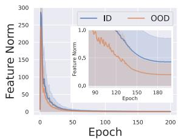
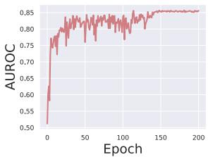
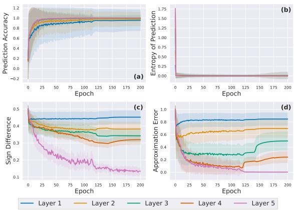
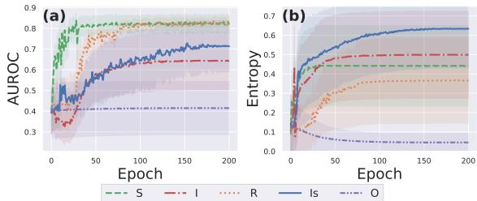
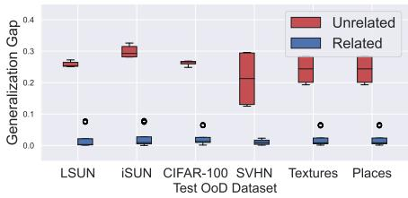
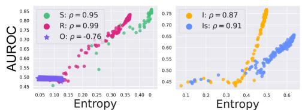
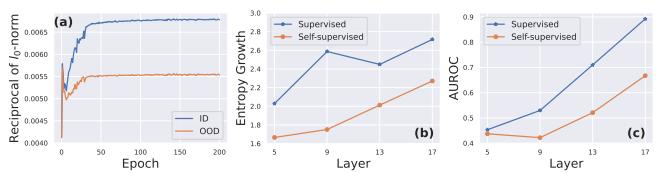
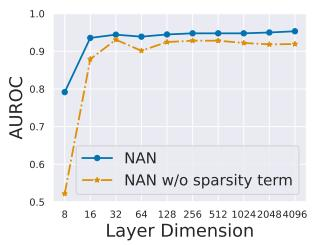
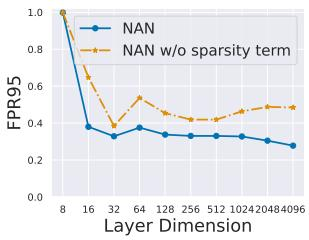

# Understanding the Feature Norm for Out-of-Distribution Detection

Jaewoo Park1,2 Jacky Chen Long Chai1 Jaeho Yoon1 Andrew Beng Jin Teoh1† 1Yonsei University 2AiV Co.

## Abstract

A neural network trained on a classification dataset often exhibits a higher vector norm of hidden layer features for in-distribution (ID) samples, while producing relatively lower norm values on unseen instances from outof-distribution (OOD). Despite this intriguing phenomenon being utilized in many applications, the underlying cause has not been thoroughly investigated. In this study, we demystify this very phenomenon by scrutinizing the discriminative structures concealed in the intermediate layers of a neural network. Our analysis leads to the following discoveries: (1) The feature norm is a confidence value of a classifier hidden in the network layer, specifically its maximum logit. Hence, the feature norm distinguishes OOD from ID in the same manner that a classifier confidence does. (2) The feature norm is class-agnostic, thus it can detect OOD samples across diverse discriminative models. (3) The conventionalfeature normfails to capture the deactivation tendency of hidden layer neurons, which may lead to misidentification of ID samples as OOD instances. To resolve this drawback, we propose a novel negative-aware norm (NAN) that can capture both the activation and deactivation tendencies of hidden layer neurons. We conduct extensive experiments on NAN, demonstrating its efficacy and compatibility with existing OOD detectors, as well as its capability in label-free environments.

## 1. Introduction

Deep learning-based models are increasingly used for safety-critical applications such as autonomous driving and medical diagnosis. Despite the effectiveness of deep models in closed-set environments where all test queries are sampled from the same distribution of train data, the deep models are reported fairly vulnerable [33, 16] to outliers from out-of-distribution [19, 51] and make highly confident but invalid predictions thereon [35]. As it is critical to prevent such malfunction in deploying deep models for open environment applications, the out-of-distribution (OOD) detection problem has attracted massive attention in recent years [52].

  
Figure 1: (left) As a discriminative model is trained, its hidden layer features exhibit higher vector norm on in-distribution samples (ID) and relatively lower norm on out-of-distribution (OOD) instances. This phenomenon prevails even when the model reduces the overall feature norm (e.g. by weight decay). (right) As a result, ID samples are separated from OOD instances with respect to the feature norm. To see its underlying cause, we analyze the discriminative structures concealed in the hidden layer.

Despite the importance of this field, only a handful of works have been devoted to understanding how the deep network becomes aware of OOD [9, 10, 8, 30, 31]. One particular under-studied signal in OOD detection is the norm of feature vectors residing in the hidden layers of neural networks. Its known behavior is that a model trained on the ID data exhibits larger values of feature norm over ID samples than the OOD instances [7, 53, 3, 28]. However, the studies are mainly empirical and provide no underlying principle of the feature norm at a fundamental level.

A preliminary attempt at understanding the feature norm has been given in the appendix of [45]. The authors of [45] argue that minimizing the cross entropy (CE) maximizes the feature norm of ID samples. However, the argument is not general. As we observe in Fig. 1, training the weightdecayed model decreases the overall feature norm, but the separation between ID and OOD remains obvious. Hence, we require a new lens to understand the underlying cause of feature norm separation.

In this work, we study why the feature norm separates ID from OOD. To this end, we both theoretically and empirically show that the feature norm is equal to a confidence value of a classifier hidden in the corresponding layer.

Based on the existing theory on the classifier confidence [10], the equality guarantees the detection capability of feature norm.

Furthermore, our analysis indicates that the feature norm is agnostic to the class label space. This suggests that the feature norm can detect OOD using any general discriminative model, including self-supervised classifiers. We validate this postulation empirically under several aspects: Firstly, by considering inter- and intra-class learning independently, we show that inter-class learning enables the feature norm to separate OOD from the training fold of ID. The intra-class learning, on the other hand, generalizes the detection capability to the test environment, enabling the feature norm to differentiate OOD from the test fold of ID. The finding shows that inter- and intra-class learning corresponds to memorization and generalization, respectively, in the context of OOD detection. Secondly, we show that the detection capability of feature norm is strongly correlated to the entropy of activation (i.e. diversity of on/off status of neurons). As activation entropy is a class-agnostic characteristic, the finding reinforces our postulation.

In addition to that, we observe that the conventional vector norm only captures the activation tendency of hidden layer neurons, but misses the deactivation counterpart. Failing to account for the deactivation tendencies results in the loss of important characteristics specific to ID samples, potentially leading to misidentification of such instances as OOD examples. Motivated by this drawback, we derive a novel negative-aware norm that captures both the activation and deactivation tendencies of hidden layer neurons.

We perform a thorough assessment of the NAN and demonstrate its efficacy across OOD benchmarks. Additionally, we confirm that NAN is compatible with several state-of-the-art OOD detectors. Furthermore, NAN is free of hyperparameters, requires no classification layer, and does not necessitate expensive feature extraction from a bank set. Consequently, NAN can be readily deployed in scenarios where class labels are unavailable. We evaluate NAN in unsupervised environments using self-supervised models and assess its performance on one-class classification benchmarks.

The contributions of our work are summarized as follows:

• We demystify the OOD detection capability of the feature norm by showing that the feature norm is a confidence value of a classifier hidden in the corresponding layer (Sec. 3).

• We reveal that the feature norm is class-agnostic, hence able to detect OOD using general discriminative models (Sec. 4). We validate this property under several aspects including inter/intra-class learning and activation entropy.

• We put forward a novel negative-aware norm (NAN), which captures both activation and deactivation tendencies of hidden layer neurons (Sec. 5). NAN is hyperparameter-free, label-free, and bank-set-free. NAN can be easily integrated with state-of-the-art OOD detectors. (Sec. 6)

## 2. Background

The goal of OOD detection is to devise a score function $S ( \mathbf { x } )$ that determines an input sample x as OOD if $S ( \mathbf { x } ) { < } \tau$ for some threshold τ and as ID otherwise. There are several ways to derive such a score function from a discriminative model $p _ { \boldsymbol { \theta } } ( y | \mathbf { x } )$ . A standard detection score is the maximum softmax probability (MSP) score [16], which is defined as $S ( \mathbf { x } ) { = } \operatorname* { m a x } _ { y } p _ { \theta } ( y | \mathbf { x } )$ with $p _ { \theta }$ modeled by the softmax function.

Other OOD detection scores include the energy score [27] that extracts the energy function [13] from the classification layer. [15] proposes the KL divergence to the uniform prediction, while [45] applies only the maximum value of logit.

Other works propose the utilization of distance metrics for OOD detection. [25] applied the Mahalanobis distance as an OOD detector based on a strong parametric assumption that each ID class follows a Gaussian distribution with a shared covariance. A unified approach SSD [40] generalizes the principle of [25], exploiting class clusters attained by unsupervised K-means. As SSD requires no class labels, its usage is general and applicable to both supervised and unsupervised models. ViM [46] adopts SSD but uses the orthogonal distance from principal components instead, and combines it with the energy score with manual calibration. CSI [43], on the other hand, defines the detection score by combining a rotation classifier with the k-nearest neighbor distance. The effectiveness of CSI, however, comes from a deliberate design of image-specific data augmentations. As a simpler and model-agnostic approach, [42] proposed the k-nearest neighbor (KNN) distance for OOD detection. Despite its broad applicability [29], KNN requires a careful hyperparameter search on the sampling ratio of the ID bank set and the number of neighbors.

Apart from the distance-based OOD detectors, an alternative approach to detecting OOD is by perturbing the signal of the network. [26, 20] observed a particular input perturbation perturbs OOD samples severely but makes ID samples remain mostly invariant. [41] proposed a rectification layer that clips out all values greater than a given threshold. Despite their effectiveness, the perturbation methods rely on specific assumptions of network signal distributions and are sensitive to hyperparameters.

On feature norm. The first application of feature norm for OOD detection was reported by [7], whose authors observed that the magnitude $\left( l _ { 2 } { \mathrm { - n o r m } } \right)$ of embedding vector tends to be larger for ID than OOD. The same trend was observed in the appendixes of [43, 45, 21] for generic images. In biometrics, [53] observed the same phenomenon for face images, thereby devising a score that can more effectively reject unseen identities based on the feature norm. [28] extended the application of feature norm, showing that it can measure the quality score of the face image. On the other hand, [3, 4] observed that the norm of feature embedding effectively differentiates a person from his/her surrounding background, and thus can be used to improve the performance and efficiency of person search. Besides OOD detection, [55] observed that the embedding vectors of highly discriminative samples lie in the area of the large norm. [50] extended this observation, demonstrating the samples with large feature norms are not only more discriminative but also more transferable for domain adaptation.

  
Figure 2: The results on hidden classifiers of MLP-5 trained on CIFAR-10 (ID). (a) The prediction accuracy of the hidden classifier increases through learning. (b) Accordingly, the prediction becomes more deterministic $( i . e . ,$ , confident). (c,d) As the sign difference between the feature vector and class weight $\mathbf { c } _ { y } ^ { ( l ) }$ is reduced, the approximation error between the feature norm and the maximum value of the hidden classifier is reduced in a similar trend, verifying our Thm. 3. Results with other activation functions are in Sec. A.3.1.

Although numerous works report empirical observations of the phenomenon, to our best knowledge, no work provides a systematic theoretical explanation of the underlying mechanism of feature norm.

## 3. Understanding Feature Norm as a Confidence of Hidden Classifier

In this section, we show that the feature norm is a confidence value of a discriminative classifier covertly concealed in the corresponding layer. Specifically, under a regularity condition, the $l _ { 1 }$ -norm of the feature vector is equal to the maximum logit of a hidden classifier attained by binarizing the network weights. Hence, based on the theory from [9], the feature norm is guaranteed its detection proficiency.

## 3.1. Theoretical analysis

Notation and setup. Let $\{ ( \mathbf { x } _ { i } , y _ { i } ) \} _ { i = 1 } ^ { N }$ be the train ID dataset where $y _ { i } { \in } { \mathcal { Y } } { = } \{ 1 , { \dots } , K \}$ are labels from K classes. Suppose our model is a multi-layer perceptron (MLP) whose l-th hidden layer consists of the d -dimensional feature vector $\mathbf { a } ^ { ( l ) }$ computed by $\mathbf { a } ^ { ( l ) } { = } \sigma ( \mathbf { W } ^ { ( l ) T } \mathbf { a } ^ { ( l - 1 ) } )$ consecutively from the initial layer $l { = } 0$ to the last hidden layer $l { = } L$ , where $\mathbf { a } ^ { ( 0 ) } { = } \mathbf { x }$ . The vector of pre-activated units is denoted by $\mathbf { z } ^ { ( l ) }$ , which satisfies $\mathbf { a } ^ { ( l ) } { = } \sigma ( \mathbf { z } ^ { ( l ) } )$ . The activation function σ is assumed to be a unit-wise rectifier such as ReLU [32, 11], GeLU [17], and Leaky ReLU [48]. Each weight matrix $\mathbf { W } ^ { ( l ) } { \in } \mathbb { R } ^ { d _ { l - 1 } \times d _ { l } }$ constitutes trainable parameters $\theta .$ The classifier logit $\psi ( \mathbf { x } ) { \in } \mathbb { R } ^ { K }$ is computed by ${ \boldsymbol { \psi } } ( \mathbf { x } ) { = } \mathbf { W } ^ { ( L + 1 ) T } \mathbf { a } ^ { ( L ) }$

Assumption. We assume arbitrary class type for the label space ${ \mathcal { V } } ;$ classes can be supervised labels, instance classes, or even noisy labels.

To extract a hidden classifier from each hidden layer of the model, we first access the hidden layer through matrix multiplication.

Proposition 1. Thefinal logit is represented by

$$
\psi ( \mathbf { x } ) = \mathbf { C } ^ { ( l ) } \mathbf { a } ^ { ( l ) }\tag{1}
$$

for each hidden layer l, where

$$
\mathbf { C } ^ { ( l ) } { = } \left( \prod _ { k = 0 } ^ { L - l - 1 } \mathbf { W } ^ { ( L + 1 - k ) T } \mathbf { D } ^ { ( L - k ) } \right) \mathbf { W } ^ { ( l + 1 ) T }\tag{2}
$$

with $\begin{array} { r } { \mathbf { D } ^ { ( l ) } = \mathrm { d i a g } ( \frac { \sigma ( z _ { 1 } ) } { z _ { 1 } } , \dots , \frac { \sigma ( z _ { d _ { l } } ) } { z _ { d _ { l } } } ) } \end{array}$ and the convention $\dot { \bar { 0 } } =$ 0. The matrix $\mathbf { C } ^ { ( l ) } = \mathbf { C } ^ { ( l ) } ( \mathbf { x } ) \in \mathbb { R } ^ { K \times d _ { l } }$ depends on x.

Proof. All proofs are given in Sec. ${ \mathrm { A } } .$

The multiplication by the coefficient matrix $\begin{array} { r l } { \mathbf { C } ^ { ( l ) } } & { { } = } \end{array}$ $[ \mathbf { c } _ { 1 } ^ { ( l ) } , \dots , \mathbf { c } _ { K } ^ { ( l ) } ] ^ { \star }$ resembles a classification layer with the column weight $\mathbf { c } _ { k } ^ { ( l ) } { = } \mathbf { c } _ { k } ^ { ( l ) } ( \mathbf { x } )$ as the k-th class proxy.

We note that ψ is called a discriminative classifier since the target class unit of logit is maximum $\psi _ { y } > \psi _ { k }$ for all $k { \neq } y$ . If the output classifier ψ is sufficiently discriminative, then binarizing the coefficient matrix $\mathbf { C } ^ { ( l ) }$ does not alter the prediction of the classifier. This leads us to a hidden classi-$\mathit { f i e r } \overline { { \psi } } ^ { ( l ) } \in \mathbb { R } ^ { K }$ defined by binarizing the network weights:

$$
\overline { { { \psi } } } ^ { ( l ) } ( \mathbf { x } ) : = \mathbf { B } ^ { ( l ) } \mathbf { a } ^ { ( l ) } : = \mathrm { s i g n } ( \mathbf { C } ^ { ( l ) } ) \mathbf { a } ^ { ( l ) }\tag{3}
$$

where $\mathrm { s i g n } ( x ) = 1 \mathrm { i f } x > 0$ and −1 otherwise.

Proposition 2. For all labeled sample $\left( \mathbf { x } , y \right)$ , suppose the discriminative learning $o f \psi _ { k } ( \mathbf { x } ) = \mathbf { c } _ { k } ^ { ( l ) } \cdot \mathbf { a } ^ { ( l ) }$ increases and decreases the cosine similarities between $\mathbf { c } _ { k } ^ { ( l ) }$ and $\mathbf { a } ^ { ( l ) }$ sufficientlyfor k=y and $k { \neq } y ,$ , respectively. Then $\overline { { \psi } } ^ { ( l ) }$ is a discriminative classifier with $\overline { { \psi } } _ { y } ^ { ( l ) } > \overline { { \psi } } _ { k } ^ { ( l ) }$ for all $k \neq y .$

In the sufficient condition of Prop. 2, the network aligns the activation pattern sign $( \mathbf { a } ^ { ( l ) } )$ [14] with the binary weight $\mathbf { b } _ { y } ^ { ( l ) }$ that corresponds to the target class y. Here, ${ \bf b } _ { y } ^ { ( l ) }$ is the y-th row of $\mathbf { B } ^ { ( l ) }$ . Due to the alignment, the feature norm becomes the prediction confidence maxk $\overline { { \psi } } _ { k } ^ { ( l ) } ( \mathbf { x } )$ of the hidden classifier.

Theorem 3. Given the condition of Proposition 2, the feature norm

$$
\| \mathbf { a } ^ { ( l ) } \| _ { 1 } c o n v e r g e s t o \overline { { \psi } } _ { y } ^ { ( l ) } ( \mathbf { x } ) = \operatorname* { m a x } _ { k } \overline { { \psi } } _ { k } ^ { ( l ) } ( \mathbf { x } ) ,\tag{4}
$$

in which case sign $( \mathbf { a } ^ { ( l ) } ) = \mathbf { b } _ { y } ^ { ( l ) }$ . In general, for any k

$$
0 \leq \| \mathbf { a } ^ { ( l ) } \| _ { 1 } - \overline { { \psi } } _ { k } ( \mathbf { x } ) \leq \| \mathbf { a } ^ { ( l ) } \| _ { \infty } \| \mathrm { s i g n } ( \mathbf { a } ^ { ( l ) } ) - \mathbf { b } _ { k } ^ { ( l ) } \| _ { 1 }\tag{5}
$$

Existing OOD theories on classifiers [9, 10] assure that OOD samples have smaller prediction confidence than ID under regularity conditions. In this case, the feature norm of OOD also has a smaller value due to Thm. 3:

Corollary 4. If maxk $\overline { { \psi } } _ { k } ^ { ( l ) } ( \mathbf { x } _ { o o d } )$ is sufficiently small, then $\| \mathbf { a } ^ { ( l ) } ( \mathbf { x } _ { o o d } ) \| _ { 1 } < \| \mathbf { a } ^ { ( l ) } ( \mathbf { x } _ { i n d } ) \| _ { 1 }$ for all ID samples $\mathbf { x } _ { i n d } .$

## 3.2. Empirical verification

We empirically verify the above claims. We train a 5- layer MLP on CIFAR10 (ID) [24]. The full empirical setup is given in Sec. A.3. Fig. 2 shows that the hidden classifiers learn to increase their prediction accuracy while reducing the prediction uncertainty (entropy), verifying Prop. 2. As described in Thm. 3, the discriminative training induces the sign alignment between the hidden layer feature and corresponding class weight $\mathbf { c } _ { y } ^ { ( l ) }$ , thereby reducing the gap between the feature norm and the maximum confidence of the hidden classifier.

Remark We remark that the trend of approximation error may not be precisely aligned with that of the sign difference (Fig. 2) as the sign difference is the sufficient condition but not a necessary one. Hence, when the sign difference is large, the approximation error can be either large or small; i.e. they can be misaligned. However, due to its sufficiency, if the sign difference converges to 0, then the approximation error also decreases to 0.

## 4. Class Agnosticity of Feature Norm

The theoretical properties of feature norm proven in Sec. 3 hold true with respect to any type of label space, suggesting that the feature norm is class-agnostic and capable of detecting out-of-distribution (OOD) samples with any discriminative model. In this section, we conduct empirical analyses to validate this hypothesis across different aspects. Specifically, we observe that inter/intra-class learning generally enhances the feature norm’s performance. We then demonstrate that the feature norm’s performance is correlated with the entropy of activation, which is another class-agnostic characteristic of neural networks. The feature norm’s dependence on class-agnostic factors provides further evidence supporting our hypothesis.

  
Figure 3: The results on ResNet-18 trained on CIFAR-10 (ID). (a) Training the model increases the OOD detection performance of feature norm if and only if the model is discriminative. (b) Accordingly, training the model increases the entropy of activation if and only if the model is discriminative. Here, the models with S, I, R, and Is labeling schemes are discriminative, while model O is not discriminative.

  
Figure 4: When the intra-class samples are related semantically (i.e. $\{ \mathrm { S } , \mathrm { I s } , \mathrm { O } \} )$ ), the OOD detection performance is generalized to test environments $( i . e .$ small generalization gap). However, if intra-class samples are randomly related (R), or there is no more than one sample in each class (I), no generalization is observed.

## 4.1. Impact of inter/intra-class learning

Setup. We train a ResNet-18 on CIFAR-10, and test against different OODs, i.e., LSUN [54], iSUN [49], CIFAR-100 [24], SVHN [34], Texture [6], and Places [56].

We consider five different training schemes by varying the label space. ‘S’: the supervised learning with generic object categories. ‘I’: the instance-discrimination learning with $y _ { i } { = } i$ $\mathbf { \nabla \cdot } \mathbf { I } \mathbf { s } ^ { \mathbf { \prime } }$ : instance-discrimination with data augmentation (i.e. conventional self-supervision). $\mathbf { \hat { \mu } } ^ { 6 } \mathbf { R } ^ { 3 } \mathbf { \hat { \nu } }$ learning with random binary labels. $\mathbf { \boldsymbol { \cdot } } _ { \mathbf { 0 } } \mathbf { \cdot } _ { \mathbf { \lambda } }$ : non-discriminative learning with every ID sample labeled by the same label ‘1’.

  
Figure 5: For discriminative models {S,R,I,Is}, the OOD detection performance of feature norm is positively correlated to the averaged entropy of activation $\left( \operatorname { E q . } \left( 7 \right) \right)$ . However, no consistent correlation is found in the non-discriminative model O.

The detection score we use is the feature norm $\| \mathbf { a } ^ { ( L ) } \| _ { 1 }$ of the last hidden layer feature $\mathbf { a } ^ { ( L ) }$ . The performance is measured by the area under receiving operating characteristic curve (AUROC). A more detailed description of the setup and full experimental results are given in Sec. B.

Inter-class learning. To analyze the effect of inter-class learning, we divide the training schemes into two: discriminative learning {S,R,I,Is}, and non-discriminative learning {O}. Fig. 3 demonstrates that the feature norm separates OOD from the train fold of ID if and only if the model is trained with inter-class learning. In particular, the feature can detect OOD even if the model is trained with random noisy labels, indicating that its detection capability is independent of the class type of label space.

Intra-class learning. To examine the impact of intra-class learning, we divide the training schemes into two groups $\{ \mathrm { S } , \mathrm { I s } , \mathrm { O } \}$ and {R,I}. In the former group $\{ \mathrm { S } , \mathrm { I s } , \mathrm { O } \}$ , the intraclass samples are semantically related. On the latter group {R,I}, there is no semantic relation within the intra-class samples. Fig. 4 indicates the generalization gap between train and test performances for OOD detection. The results support that the detection capability of feature norm is generalized to the test environment if and only if the intra-class samples are semantically related.

Summary on inter/intra-class learning. The detection capability of feature norms does not depend on a particular type of class label. Instead, any type of inter-class learning allows the feature norm to differentiate OOD from the training fold of ID. On the other hand, intra-class learning with any appropriate semantics facilitates the separation of OOD from the test fold of ID. In general, inter-class learning corresponds to memorization, while intra-class is associated with generalization.

## 4.2. The relation to the entropy of activation

The feature norm’s detection capability depends on the model’s discriminative nature, not the class type. Here, we further show that the capability relies on the entropy of activation, which is another class-agnostic characteristic.

If the model is discriminative, target logits $\overline { { \psi } } _ { y } ^ { ( L ) } ( \mathbf { x } )$ with

  
Figure 6: (a) The sparsity of activations, measured by $\| \mathbf { a } ^ { ( L ) } \| _ { 0 } ^ { - 1 }$ is maximized and higher on ID samples than on OOD instances. (b) The entropy growth is larger in deeper layers. (c) The OOD detection performance is accordingly better in deeper layers.

different y is maximized for ID samples x. Then, due to

$$
\overline { { \psi } } _ { y } ^ { ( L ) } ( \mathbf { x } ) = \sum _ { i } b _ { y , i } ^ { ( L ) } a _ { i } ^ { ( L ) }\tag{6}
$$

with $\mathbf { b } _ { y } ^ { ( L ) } = ( b _ { y , 1 } ^ { ( L ) } , \ldots , b _ { y , d _ { L } } ^ { ( L ) } ) \in \mathbb { R } ^ { d _ { L } }$ , the unit $a _ { i } ^ { ( L ) }$ is maximized for samples x in $\{ \mathbf { x } : b _ { y , i } ^ { ( L ) } = 1 \}$ , and minimized for $\mathbf { x } \mathbf { \ ' } _ { \mathbf { S } }$ in $\{ \mathbf { x } : b _ { y , i } ^ { ( L ) } = - 1 \}$ . Consequently, the entropy of activation is maximized

$$
H ( a _ { i } ^ { ( L ) } ) = - \sum _ { c = 0 } ^ { 1 } \mathbb { P } ( 1 _ { a _ { i } ^ { ( l ) } > 0 } = c ) \log \mathbb { P } ( 1 _ { a _ { i } ^ { ( l ) } > 0 } = c )\tag{7}
$$

for each neuron $a _ { i } ^ { ( L ) }$ of ID samples.

Conversely, if the model is not discriminative, $i . e . , y =$ {1}, then all ID samples likely have the same constant binary indicator; $b _ { y , i } ^ { ( L ) } ~ = ~ c$ for all samples x where $c \in$ {−1, 1}. Hence, the activation entropy is minimized in this case.

This trend is empirically validated in Fig. 3b; only discriminative models maximize the activation entropy. Moreover, demonstrated by the strong correlation depicted in Fig. 5, the detection performance of the feature norm depends on the activation entropy, which is a characteristic independent of the class type of the label space.

## 5. Method: Negative-Aware Norm (NAN)

A missing component in the conventional norm. By Thm. 3, ID samples x tend to maximize the hidden classifier confidence

$$
\operatorname* { m a x } \| \mathbf { a } ^ { ( L ) } \| _ { 1 } = \overline { { \psi } } _ { y } ( \mathbf { x } ) = \overbrace { \sum _ { i : b _ { y , i } ^ { ( L ) } = 1 } a _ { i } ^ { ( L ) } } ^ { \mathrm { m a x i m i z e d } } - \overbrace { \sum _ { j : b _ { y , j } ^ { ( L ) } = - 1 } ^ { \mathrm { m i n i m i z e d } } a _ { j } ^ { ( L ) } } ^ { \mathrm { m i n i z e d } }\tag{8}
$$

under a regularity condition. This maximization is stronger on ID samples than on OOD instances (Prop. 2 and [9]), and hence serves as a key factor that separates OOD from ID (Cor. 4).

The maximization of confidence can be disentangled to maximization of the positive summand $\begin{array} { r } { A { : = } \sum _ { i : b _ { y , i } ^ { ( L ) } = 1 } a _ { i } ^ { ( L ) } } \end{array}$ and minimization of the negative summand $\begin{array} { r } { D { : = } \sum _ { j : b _ { y , j } ^ { ( L ) } = - 1 } a _ { j } ^ { ( L ) } } \end{array}$ , which correspond to activation and deactivation of neurons, respectively. Due to the nature of the activation function $( e . g .$ . ReLU), however, the negative summand is diminished; $i . e . , D { \approx } 0$ . Therefore, the conventional $l _ { 1 }$ feature norm fails to reflect the deactivation responses, leading to potential misidentification of ID samples.

Derivation. To mitigate this drawback, we capture the $d e \mathrm { . }$ activation tendency by the sparsity of activations $\lVert \mathbf { a } ^ { ( L ) } \rVert _ { 0 } ^ { - 1 }$ The sparsity term reflects the number of deactivated neurons by

$$
\| \mathbf { a } ^ { ( L ) } \| _ { 0 } = d _ { L } - | \{ i : a _ { i } ^ { ( L ) } \leq 0 \} | .\tag{9}
$$

Combining the sparsity term with the conventional vector norm, we derive a novel negative-aware norm (NAN)

$$
\| \mathbf { a } \| _ { \mathrm { N A N } } = \| \mathbf { a } ^ { ( L ) } \| _ { 1 } \cdot \| \mathbf { a } ^ { ( L ) } \| _ { 0 } ^ { - 1 } .\tag{10}
$$

NAN captures both the activation and deactivation tendencies of ID samples’ neurons. Fig. 6a shows the sparsity term is higher on ID samples than OOD instances, demonstrating that the deactivation tendency is stronger in ID samples’ neurons. Hence, capturing the deactivation tendency likely improves the conventional norm. We conduct extensive experiments on NAN in the next section to validate its effectiveness.

We remark that similar to the $l _ { 1 }$ feature norm, the negative-aware norm (NAN) exhibits class-agnostic characteristics, as verified through analyses of inter/intra-class learning and activation entropy in Sec. B.

Additional consideration. We utilize the last hidden layer $\mathbf { a } { = } \mathbf { a } ^ { ( L ) }$ ) for OOD detection as the last hidden layer exhibits a higher growth in activation entropy and accordingly better performance (Fig. 6bc).

## 6. Experiments on NAN

The objective of this experiment is to assess the OOD detection capabilities of NAN across diverse configurations using general discriminative models. To achieve this goal, we evaluate NAN’s performance using both supervised and self-supervised models, and assess it in large-scale and small-scale benchmarks, including the one-class classification setting. Additionally, we consider the compatibility of NAN, namely, whether NAN can be combined with other detectors for performance gain. We conclude this section with ablation studies of NAN. A detailed description of the complete experiment setup can be found in Sec. C.

Evaluation metrics The performance is reported by the widely-used metrics: (1) the area under the receiver operating characteristic curve (AUROC), (2) the false positive rate (FPR95) on the OOD samples when the true positive rate of ID samples is at 95%, (3) closed-set classification accuracy (ACC) of ID.

## 6.1. Evaluation on large-scale benchmark

Setup. We utilize a ResNet-50 trained on ImageNet-1k. The model is trained either by (1) supervised labels using the contrastive loss [23] or (2) self-supervised instance discrimination loss using momentum embeddings [5]. In the case of the supervised contrastive learning, the classification layer is learned after training and freezing the backbone representation. For fair comparison, all detection scores are applied on the same backbone.

Following the widely-used ImageNet-1k benchmark [22], we test against four test OOD datasets: fine-grained plant images of iNaturalist [44], scene images from SUN [47] and Places [56], and texture images from Texture [6]. All OOD datasets are processed so that no overlapping category is present with ImageNet-1k.

Results. Table 1 shows that NAN is comparable to the stateof-the-art detectors on the ImageNet-1k benchmark. Compared to the OOD detection scores that require a supervised classification layer (i.e. MSP, Energy, MaxLogit, and KL), NAN shows significant improvement on both AUROC and FPR95. Moreover, NAN can be instantly applied to the contrastive models without a classification layer and label supervision.

Distance-based scores (Mahalanobis, SSD, and KNN) outperform NAN on the far-OOD dataset Texture. This is because NAN inherently is a classifier confidence, which can exhibit overconfidence when dealing with far OOD instances. On average, however, NAN is more robust and produces a significant reduction on the FPR95 metric (11- 26%) without any hyperparameter. Rather than competing with the state-of-the-art distanced-based detectors, we show NAN can be integrated with them easily for further improvement.

## 6.2. Evaluation on NAN compatibility

We examine whether NAN can be integrated with existing OOD scores. To this end, we consider the state-ofthe-art perturbation method ReAct [41] and the label-free distance-based scores SSD and KNN. NAN is combined with SSD and KNN by simple score division as follows: given a distance function to the ID bank set or prototypes in the form of $d ( \mathbf { x } , X _ { b a n k } )$ , we re-calibrate the distance by $d ( \mathbf { x } , X _ { b a n k } ) / \| \mathbf { a } ^ { ( L ) } \| _ { \mathrm { N A N } }$ where $\mathbf { a } ^ { ( L ) }$ is the last hidden layer feature of the test input x. Table 2 shows that the combination improves both metrics in all cases, demonstrating the compatibility of NAN.

## 6.3. Evaluation on standard benchmark

We evaluate NAN on the standard CIFAR-10 benchmark that consists of low-resolution images.

Setup. We utilize a ResNet-18 trained on CIFAR10. The model is trained by either of the two standard training schemes: cross-entropy minimization with supervised labels and self-supervised learning (MoCo-v2) without the supervised labels. Following the popular benchmark, we choose the following datasets as OOD test datasets: LSUNfix [43], ImageNet-fix [43], CIFAR100 [24], SVHN [34], and Places [56]. All images are of size $3 2 \times 3 2$

<table><tr><td rowspan="2"></td><td rowspan="2">hyper.-free</td><td rowspan="2">label-free</td><td rowspan="2">bank-free</td><td colspan="2">iNaturalist</td><td colspan="2">SUN</td><td colspan="2">Places</td><td colspan="2">Texture</td><td colspan="2">Average</td><td rowspan="2">ID ACC↑</td></tr><tr><td>AUROC↑</td><td>FPR95↓</td><td>AUROC↑</td><td>FPR95↓</td><td>AUROC↑</td><td>FPR95↓</td><td>AUROC↑</td><td>FPR95↓</td><td>AUROC↑</td><td>FPR95↓</td></tr><tr><td colspan="10">With Supervised Labels of ID:</td><td colspan="7"></td></tr><tr><td>MSP</td><td>√</td><td></td><td>√</td><td>93.78</td><td>29.74</td><td>84.56</td><td>59.54</td><td>84.28</td><td>60.94</td><td>84.90</td><td>50.02</td><td>86.88</td><td></td><td>50.06</td><td>78.73</td></tr><tr><td>Energy</td><td>√</td><td></td><td>√</td><td>96.17</td><td>20.98</td><td>88.91</td><td>47.05</td><td>87.70</td><td></td><td>51.15</td><td>88.90</td><td>39.31</td><td>90.42</td><td>39.62</td><td>78.73</td></tr><tr><td>MaxLogit</td><td>√</td><td></td><td>√</td><td>95.99</td><td>22.06</td><td>88.43</td><td>50.90</td><td>87.37</td><td>53.78</td><td></td><td>88.42</td><td>42.25</td><td>90.05</td><td>42.25</td><td>78.73</td></tr><tr><td>KL</td><td>√</td><td></td><td>√</td><td>96.17</td><td>20.98</td><td>88.91</td><td>47.06</td><td>87.70</td><td>51.15</td><td></td><td>88.90</td><td>39.31</td><td>90.42</td><td>39.63</td><td>78.73</td></tr><tr><td>Mahalanobis</td><td>√</td><td></td><td>√</td><td>94.79</td><td>35.04</td><td>86.55</td><td>64.99</td><td>83.92</td><td>70.31</td><td></td><td>95.52</td><td>15.02</td><td>90.20</td><td>46.34</td><td>78.73</td></tr><tr><td>ViM</td><td></td><td></td><td>√</td><td>95.54</td><td>27.75</td><td>89.85</td><td>48.12</td><td>87.05</td><td>57.82</td><td></td><td>95.18</td><td>14.47</td><td>91.91</td><td>37.04</td><td>78.73</td></tr><tr><td>SSD</td><td></td><td>√</td><td>√</td><td>94.08</td><td>37.77</td><td>88.06</td><td>58.38</td><td>84.70</td><td></td><td>63.89</td><td>96.96</td><td>11.63</td><td>90.95</td><td>42.92</td><td>78.73</td></tr><tr><td>KNN</td><td></td><td>√</td><td></td><td>94.15</td><td>38.25</td><td>87.75</td><td>58.19</td><td>84.93</td><td></td><td>61.80</td><td>94.24</td><td>19.29</td><td>90.27</td><td>44.38</td><td>78.73</td></tr><tr><td>NAN (ours)</td><td>√</td><td>√</td><td>√</td><td>96.94</td><td>15.86</td><td>92.77</td><td>29.81</td><td>91.46</td><td></td><td>37.21</td><td>88.09</td><td>43.46</td><td>92.32</td><td>31.59</td><td>78.73</td></tr><tr><td colspan="10">Without Supervised Labels of ID (detectors based on supervised labels are not available):</td><td colspan="7"></td></tr><tr><td>SSD</td><td></td><td>√</td><td>√</td><td>60.34</td><td>93.87</td><td>80.89</td><td>78.41</td><td>77.23</td><td></td><td>81.26</td><td>90.19</td><td>33.53</td><td>77.16</td><td>71.77</td><td>71.10</td></tr><tr><td>KNN</td><td></td><td>√</td><td></td><td>84.53</td><td>78.71</td><td>82.26</td><td>76.06</td><td>77.50</td><td>80.65</td><td></td><td>91.99</td><td>24.61</td><td>84.07</td><td>65.01</td><td>71.10</td></tr><tr><td>NAN (ours)</td><td>√</td><td>√</td><td>√</td><td>92.90</td><td>36.09</td><td>86.76</td><td>56.27</td><td>83.22</td><td>65.08</td><td>87.57</td><td></td><td>46.86</td><td>87.61</td><td>51.08</td><td>71.10</td></tr></table>

Table 1: Results on ImageNet-1k with ResNet-50. ‘hyper.-free’ indicates that the detection score does not require a hyperparameter.

<table><tr><td></td><td>AUROC↑</td><td>FPR95↓</td></tr><tr><td>NAN</td><td>92.32</td><td>31.59</td></tr><tr><td> $\mathrm { N A N + K N N } \ [ 4 2 ]$ </td><td>92.99</td><td>29.26</td></tr><tr><td> $\mathrm { N A N } + \mathrm { S S D } \left[ \mathrm { 4 0 } \right]$ </td><td>93.42</td><td>27.51</td></tr><tr><td> $\mathrm { N A N + R e A c t } \ [ 4 1 ]$ </td><td>93.91</td><td>29.23</td></tr><tr><td> $\mathrm { N A N } + \mathrm { R e A c t } \left[ 4 1 \right] + \mathrm { K N N } \left[ 4 2 \right]$ </td><td>94.37</td><td>24.94</td></tr><tr><td> $\mathrm { N A N } + \mathrm { R e A c t } \left[ \mathrm { 4 1 } \right] + \mathrm { S S D } \left[ \mathrm { 4 0 } \right]$ </td><td>94.61</td><td>24.57</td></tr></table>

Table 2: Compatibility of NAN to existing detectors. The ID is ImageNet-1k. The value is averaged over all test OOD datasets.

Evaluation results. Table 3 shows that the proposed score NAN is comparable to state-of-the-art scores specifically designed for OOD detection. We highlight that only NAN is a hyperparameter-free approach among the top-performing methods. The label-free distance-based scores KNN and SSD exhibit robustness, but their results are attained by carefully fine-tuning their method-specific hyperparameters. Despite not utilizing any hyperparameters, NAN exhibits comparable performance to the label-free state-ofthe-art detectors (SSD and KNN) in terms of AUROC and FPR95 metrics on average. CSI also shows marginal superiority in two cases out of eight, but CSI requires complicated training with image rotation prediction, and its inference must be combined with KNN in an intricate manner. In contrast, NAN is simple and can be easily integrated to KNN. Combined with the distance-based scores SSD and KNN, NAN exhibits a consistent performance boost and outperforms all reported detectors.

## 6.4. Evaluation on one-class classification

As NAN requires neither classifier nor supervised labels, it can be applied to one-class classification (OCC). To assess the OCC performance, we evaluate the standard one-class benchmark of CIFAR-10/100. A class randomly chosen in CIFAR-10 is regarded as the ID data, and the rest of the 9 classes in CIFAR-10 constitute OOD instances. We conduct a similar experimental procedure on CIFAR-100 superclasses. For a fair comparison, we compare with one-class classification baselines that do not utilize extra training data and pretrained weights attained from large-scale data. For evaluation, we apply NAN on the MoCo-v2 model that is trained on the one-class data from scratch.

Table 4 indicates that NAN is comparable to the stateof-the-art one-class classifier CSI without any complicated training and hyperparameter tuning. Combined with the distance-based detectors, NAN performs equally well and improves the distance-based detectors on both CIFAR-10/100 data sets.

## 6.5. Ablation study

Ablation on the NAN Score The primary innovation of NAN is the inclusion of a sparsity term (i.e., the denominator of NAN), which accounts for the hidden layer neurons tendency to deactivate. We analyze the impact of this component by ablating it. Table 5 shows the effectiveness of the sparsity term in both large-scale and small-scale settings. In the large-scale setting (ImageNet-1k), OOD is mostly differentiated from ID by the deactivation tendency of hidden layer neurons. In the case of the small-scale CIFAR-10 dataset, capturing both deactivation and activation tendencies is crucial for enhancing the OOD detection performance. In general, the inclusion of the sparsity term to capture the deactivation tendency enhances the robustness of the OOD detection score.

Ablation on the Architectural Component: the Last Hidden Layer Dimension Although NAN is a hyperparameter-free OOD score, its effectiveness is still influenced by the network architecture, much like other detection scores. Specifically, the performance of NAN may primarily depend on the dimension $d _ { L }$ of the last hidden layer $\mathbf { a } ^ { ( L ) }$ . To assess the impact of this dimension on the performance of NAN, we evaluate NAN on multiple ResNet-18 models with different dimensions $d _ { L }$ . We train the models on CIFAR-10 using supervised cross-entropy loss and evaluate them on various OOD datasets, including LSUN-fix, ImageNet-fix, CIFAR-100, and SVHN. We report the average performance over all test OOD datasets.

<table><tr><td>OOD</td><td colspan="2">LSUN-fix</td><td colspan="2">ImageNet-fix</td><td colspan="2">CIFAR100</td><td colspan="2">SVHN</td><td colspan="2">Places</td><td colspan="2">Average</td><td rowspan="2">ID ACC↑</td></tr><tr><td></td><td>AUROC↑</td><td>FPR95↓</td><td>AUROC↑</td><td>FPR95↓</td><td>AUROC↑</td><td>FPR95↓</td><td>AUROC↑ FPR95↓</td><td></td><td>AUROC↑</td><td>FPR95↓</td><td>AUROC↑</td><td>FPR95↓</td></tr><tr><td colspan="10">With supervised labels of ID</td><td></td><td></td><td></td><td></td></tr><tr><td>ODIN* [26]</td><td></td><td></td><td></td><td></td><td></td><td></td><td>88.3</td><td>60.4</td><td>90.6</td><td>45.5</td><td></td><td></td><td></td></tr><tr><td>CSI* [43]</td><td>92.1</td><td></td><td>92.4</td><td>一</td><td>90.5</td><td></td><td>96.5</td><td></td><td></td><td></td><td></td><td></td><td></td></tr><tr><td>MSP</td><td>90.3</td><td>59.1</td><td>89.7</td><td>61.3</td><td>88.0</td><td>64.1</td><td>96.9</td><td>19.8</td><td>88.5</td><td>61.7</td><td>90.7</td><td>53.2</td><td>94.5</td></tr><tr><td>Energy</td><td>86.8</td><td>50.9</td><td>84.7</td><td>55.1</td><td>81.6</td><td>59.6</td><td>93.9</td><td>22.1</td><td>86.7</td><td>48.4</td><td>86.7</td><td>47.2</td><td>94.5</td></tr><tr><td>MaxLogit</td><td>86.8</td><td>51.7</td><td>84.7</td><td>56.0</td><td>81.6</td><td>60.1</td><td>94.1</td><td>22.0</td><td>86.6</td><td>49.8</td><td>86.8</td><td>47.9</td><td>94.5</td></tr><tr><td>KL</td><td>88.8</td><td>50.3</td><td>89.4</td><td>50.0</td><td>87.2</td><td>55.1</td><td>98.8</td><td>6.6</td><td>88.0</td><td>49.2</td><td>90.4</td><td>42.2</td><td>94.5</td></tr><tr><td>Mahalanobis</td><td>92.5</td><td>38.3</td><td>90.6</td><td>47.3</td><td>88.0</td><td>54.8</td><td>99.0</td><td>5.9</td><td>90.9</td><td>41.0</td><td>92.2</td><td>37.5</td><td>94.5</td></tr><tr><td>ViM</td><td>92.8</td><td>41.0</td><td>91.3</td><td>43.7</td><td>87.3</td><td>52.5</td><td>95.0</td><td>22.5</td><td>94.1</td><td>28.2</td><td>92.1</td><td>37.6</td><td>94.5</td></tr><tr><td>KNN</td><td>96.0</td><td>25.7</td><td>95.1</td><td>31.4</td><td>92.2</td><td>44.2</td><td>99.8</td><td>1.1</td><td>94.3</td><td>32.4</td><td>95.5</td><td>27.0</td><td>94.5</td></tr><tr><td>SSD</td><td>96.5</td><td>20.2</td><td>94.2</td><td>35.0</td><td>88.8</td><td>51.4</td><td>99.9</td><td>0.4</td><td>92.2</td><td>42.3</td><td>94.3</td><td>29.9</td><td>94.5</td></tr><tr><td>NAN (ours)</td><td>94.7</td><td>36.6</td><td>94.5</td><td>34.4</td><td>91.7</td><td>44.8</td><td>99.7</td><td>1.3</td><td>94.2</td><td>33.3</td><td>95.0</td><td>30.1</td><td>94.5</td></tr><tr><td>NAN + KNN</td><td>96.0</td><td>26.7</td><td>95.5</td><td>29.0 27.6</td><td>92.7 91.8</td><td>40.9</td><td>99.9</td><td>0.6</td><td>94.9</td><td>28.2</td><td>95.8</td><td>25.1</td><td>94.5</td></tr><tr><td> $\mathrm { N A N } + \mathrm { S S D }$ </td><td>96.7</td><td>19.9</td><td>95.6</td><td></td><td></td><td>43.6</td><td>99.9</td><td>0.3</td><td>94.6</td><td>30.3</td><td>95.7</td><td>24.3</td><td>94.5</td></tr><tr><td colspan="10">Without supervised labels of ID</td><td colspan="3"></td></tr><tr><td>RotNet* [18]</td><td>81.6</td><td></td><td>86.7</td><td></td><td>82.3</td><td></td><td>97.8</td><td></td><td></td><td></td><td></td><td></td><td></td></tr><tr><td>GOAD*[1]</td><td>78.8</td><td></td><td>83.3</td><td></td><td>77.2</td><td></td><td>96.3</td><td></td><td></td><td></td><td></td><td></td><td></td></tr><tr><td>CSI* [43]</td><td>90.3</td><td></td><td>93.3</td><td></td><td>89.2</td><td></td><td>99.8</td><td></td><td></td><td></td><td></td><td></td><td></td></tr><tr><td>KNN</td><td>95.0</td><td>30.5</td><td>93.7</td><td>36.7</td><td>89.7</td><td>50.3</td><td>99.4</td><td>3.0</td><td>88.6</td><td>58.2</td><td>93.3</td><td>35.7</td><td>90.7</td></tr><tr><td>SSD</td><td>94.1</td><td>30.2</td><td>90.8</td><td>47.4</td><td>85.9</td><td>57.6</td><td>98.5</td><td>8.3</td><td>88.8</td><td>51.9</td><td>91.6</td><td>39.1</td><td>90.7</td></tr><tr><td>NAN (ours)</td><td>94.9</td><td>28.8</td><td>93.7</td><td>36.1</td><td>88.6</td><td>52.4</td><td>96.1</td><td>22.0</td><td>89.3</td><td>51.5</td><td>92.5</td><td>38.1</td><td>90.7</td></tr><tr><td> $\mathrm { N A N + K N N }$ </td><td>95.8</td><td>24.6</td><td>94.8</td><td>32.6</td><td>90.1</td><td>49.4</td><td>98.4</td><td>8.8</td><td>90.5</td><td>50.5</td><td>93.9</td><td>33.2</td><td>90.7</td></tr><tr><td> $\mathrm { N A N } + \mathrm { S S D }$ </td><td>96.0</td><td>21.3</td><td>94.5</td><td>33.6</td><td>89.4</td><td>49.7</td><td>98.5</td><td>8.3</td><td>91.2</td><td>45.6</td><td>93.9</td><td>31.7</td><td>90.7</td></tr></table>

Table 3: Results on CIFAR-10 with ResNet-18. \* indicates the values are taken from the references.

<table><tr><td></td><td>CIFAR10</td><td>CIFAR100</td></tr><tr><td>Without bank set:</td><td></td><td></td></tr><tr><td>OC-SVM* [39]</td><td>58.8</td><td>63.1</td></tr><tr><td>Deep-SVDD* [37]</td><td>64.8</td><td></td></tr><tr><td>AnoGAN*[38]</td><td>61.8</td><td></td></tr><tr><td>OCGAN*[36]</td><td>65.7</td><td></td></tr><tr><td>Geom* [12]</td><td>86.0</td><td>78.7</td></tr><tr><td> $\mathrm { G O A D ^ { * } \left[ 2 \right] }$ </td><td>88.2</td><td></td></tr><tr><td>NAN (ours)</td><td>93.7</td><td>88.2</td></tr><tr><td>With bank set:</td><td></td><td></td></tr><tr><td>CSI*</td><td>94.3</td><td></td></tr><tr><td>SSD</td><td>91.1</td><td>85.7</td></tr><tr><td> $\mathrm { S S D + N A N \left( o u r s \right) }$ </td><td>94.3(+3.2)</td><td>88.7(+2.0)</td></tr><tr><td>KNN</td><td>92.1</td><td>87.1</td></tr><tr><td> $\mathrm { K N N } + \mathrm { N A N } \left( \mathrm { o u r s } \right)$ </td><td> $\mathbf { 9 4 . 3 } ( + 2 . 2 )$ </td><td>88.3(+1.0)</td></tr></table>

Table 4: The average one-class classification (OCC) performance in AUROC. \* indicates the values are taken from the references.

<table><tr><td rowspan="2"></td><td colspan="2">ImageNet-1k</td><td colspan="2">CIFAR-10</td></tr><tr><td>AUROC↑</td><td>FPR95↓</td><td>AUROC↑</td><td>FPR95↓</td></tr><tr><td>NAN w/o sparsity term</td><td>57.99</td><td>95.22</td><td>92.40</td><td>43.00</td></tr><tr><td>NAN</td><td>92.32</td><td>31.59</td><td>94.90</td><td>30.10</td></tr></table>

Table 5: The ablation study examines the effect of NAN’s sparsity term, which accounts for the hidden layer neurons’ deactivation tendency. The ID is either ImageNet-1k or CIFAR-10. The value is averaged over all corresponding test OOD datasets.

  
Figure 7: The ablation study of NAN with respect to the dimension $d _ { L }$ of the last hidden layer $\mathbf { a } ^ { ( L ) }$ . The ID data is CIFAR-10. The reported metric numbers are values averaged over test OOD datasets.

We hypothesize that a wider hidden layer would better capture the deactivation tendency of neurons, and hence improve the performance. Fig. 7 evidences the hypothesis; increasing the dimension of the last hidden layer tends to improve the performance of NAN. Particularly on the FPR95 metric, the improvement is not marginal. Moreover, the performance is fairly robust unless the layer dimension is unreasonably small. Interestingly, the comparison between NAN and the standard $l _ { 1 } { \mathrm { - n o r m } }$ score without the sparsity term unveils an intriguing finding; NAN’s ability to capture the deactivation tendency makes the score more robust to changes in the layer dimension $d _ { L }$ . This result suggests that measuring the deactivation tendency is critical for effective OOD detection.

Additional ablations and limitation. Further ablation on architectural components and the limitation of NAN are given in Sec. D and E, respectively.

## 7. Conclusion

We have conducted a thorough investigation of the feature norm to gain insights into its underlying mechanism for OOD detection. Specifically, we have demonstrated that the feature norm’s ability to detect OOD stems from its function as classifier confidence. Additionally, we have established that the feature norm can detect OOD using any discriminative model, making it independent of class label type. Through our formulation of the feature norm as a hidden classifier, we have identified that the conventional feature norm neglects neurons that tend to deactivate, leading to the potential misidentification of ID samples. To address this limitation, we have proposed a novel negative-aware norm NAN that captures both the activation and deactivation tendencies of hidden layer neurons. Our empirical results have demonstrated the effectiveness of NAN across diverse OOD detection benchmarks.

Acknowledgments This work was supported by the Materials/Parts Technology Development Program grant funded by the Korea government (MOTIE) (No. 1415187441) and the National Research Foundation of Korea (NRF) grant funded by the Korea government (MSIP) (No. NRF-2022R1A2C1010710).

## References

[1] Liron Bergman and Yedid Hoshen. Classification-based anomaly detection for general data. arXiv preprint arXiv:2005.02359, 2020. 8

[2] Liron Bergman and Yedid Hoshen. Classification-based anomaly detection for general data. arXiv preprint arXiv:2005.02359, 2020. 8

[3] Di Chen, Shanshan Zhang, Jian Yang, and Bernt Schiele. Norm-aware embedding for efficient person search. In Proceedings of the IEEE/CVF Conference on Computer Vision and Pattern Recognition, pages 12615–12624, 2020. 1, 3

[4] Di Chen, Shanshan Zhang, Jian Yang, and Bernt Schiele. Norm-aware embedding for efficient person search and tracking. International Journal of Computer Vision, 129(11):3154–3168, 2021. 3

[5] Xinlei Chen, Haoqi Fan, Ross Girshick, and Kaiming He. Improved baselines with momentum contrastive learning. arXiv preprint arXiv:2003.04297, 2020. 6, 12, 16

[6] Mircea Cimpoi, Subhransu Maji, Iasonas Kokkinos, Sammy Mohamed, and Andrea Vedaldi. Describing textures in the wild. In Proceedings of the IEEE conference on computer vision and pattern recognition, pages 3606–3613, 2014. 4, 6

[7] Akshay Raj Dhamija, Manuel Gunther, and Terrance Boult.¨ Reducing network agnostophobia. Advances in Neural Information Processing Systems, 31, 2018. 1, 2

[8] Thomas G Dietterich and Alex Guyer. The familiarity hypothesis: Explaining the behavior of deep open set methods. Pattern Recognition, 132:108931, 2022. 1, 21

[9] Zhen Fang, Yixuan Li, Jie Lu, Jiahua Dong, Bo Han, and Feng Liu. Is out-of-distribution detection learnable? arXiv preprint arXiv:2210.14707, 2022. 1, 3, 4, 5, 21

[10] Zhen Fang, Jie Lu, Anjin Liu, Feng Liu, and Guangquan Zhang. Learning bounds for open-set learning. In International Conference on Machine Learning, pages 3122–3132. PMLR, 2021. 1, 2, 4

[11] Kunihiko Fukushima. Cognitron: A self-organizing multilayered neural network. Biological cybernetics, 20(3):121– 136, 1975. 3

[12] Izhak Golan and Ran El-Yaniv. Deep anomaly detection using geometric transformations. Advances in neural information processing systems, 31, 2018. 8

[13] Will Grathwohl, Kuan-Chieh Wang, Jorn-Henrik Jacobsen,¨ David Duvenaud, Mohammad Norouzi, and Kevin Swersky. Your classifier is secretly an energy based model and you should treat it like one. arXiv preprint arXiv:1912.03263, 2019. 2

[14] Boris Hanin and David Rolnick. Deep relu networks have surprisingly few activation patterns. Advances in neural information processing systems, 32, 2019. 4

[15] Dan Hendrycks, Steven Basart, Mantas Mazeika, Mohammadreza Mostajabi, Jacob Steinhardt, and Dawn Song. Scaling out-of-distribution detection for real-world settings. arXiv preprint arXiv:1911.11132, 2019. 2

[16] Dan Hendrycks and Kevin Gimpel. A baseline for detecting misclassified and out-of-distribution examples in neural networks. arXiv preprint arXiv:1610.02136, 2016. 1, 2

[17] Dan Hendrycks and Kevin Gimpel. Gaussian error linear units (gelus). arXiv preprint arXiv:1606.08415, 2016. 3

[18] Dan Hendrycks, Mantas Mazeika, Saurav Kadavath, and Dawn Song. Using self-supervised learning can improve model robustness and uncertainty. Advances in neural information processing systems, 32, 2019. 8

[19] Dan Hendrycks, Kevin Zhao, Steven Basart, Jacob Steinhardt, and Dawn Song. Natural adversarial examples. In Proceedings of the IEEE/CVF Conference on Computer Vision and Pattern Recognition, pages 15262–15271, 2021. 1

[20] Yen-Chang Hsu, Yilin Shen, Hongxia Jin, and Zsolt Kira. Generalized odin: Detecting out-of-distribution image without learning from out-of-distribution data. In Proceedings of the IEEE/CVF Conference on Computer Vision and Pattern Recognition, pages 10951–10960, 2020. 2

[21] Rui Huang, Andrew Geng, and Yixuan Li. On the importance of gradients for detecting distributional shifts in the wild. Advances in Neural Information Processing Systems, 34:677–689, 2021. 3

[22] Rui Huang and Yixuan Li. Mos: Towards scaling out-ofdistribution detection for large semantic space. In Proceedings of the IEEE/CVF Conference on Computer Vision and Pattern Recognition, pages 8710–8719, 2021. 6

[23] Prannay Khosla, Piotr Teterwak, Chen Wang, Aaron Sarna, Yonglong Tian, Phillip Isola, Aaron Maschinot, Ce Liu, and Dilip Krishnan. Supervised contrastive learning. Advances in Neural Information Processing Systems, 33:18661–18673, 2020. 6, 18

[24] Alex Krizhevsky, Geoffrey Hinton, et al. Learning multiple layers of features from tiny images. 2009. 4, 7

[25] Kimin Lee, Kibok Lee, Honglak Lee, and Jinwoo Shin. A simple unified framework for detecting out-of-distribution samples and adversarial attacks. Advances in neural information processing systems, 31, 2018. 2

[26] Shiyu Liang, Yixuan Li, and Rayadurgam Srikant. Enhancing the reliability of out-of-distribution image detection in neural networks. arXiv preprint arXiv:1706.02690, 2017. 2, 8

[27] Weitang Liu, Xiaoyun Wang, John Owens, and Yixuan Li. Energy-based out-of-distribution detection. Advances in Neural Information Processing Systems, 33:21464–21475, 2020. 2

[28] Qiang Meng, Shichao Zhao, Zhida Huang, and Feng Zhou. Magface: A universal representation for face recognition and quality assessment. In Proceedings of the IEEE/CVF Conference on Computer Vision and Pattern Recognition, pages 14225–14234, 2021. 1, 3

[29] Yifei Ming, Yiyou Sun, Ousmane Dia, and Yixuan Li. How to exploit hyperspherical embeddings for out-of-distribution detection? arXiv preprint arXiv:2203.04450, 2022. 2, 20

[30] Yifei Ming, Hang Yin, and Yixuan Li. On the impact of spurious correlation for out-of-distribution detection. In Proceedings of the AAAI Conference on Artificial Intelligence, volume 36, pages 10051–10059, 2022. 1

[31] Peyman Morteza and Yixuan Li. Provable guarantees for understanding out-of-distribution detection. In Proceedings of the AAAI Conference on Artificial Intelligence, volume 8, 2022. 1

[32] Vinod Nair and Geoffrey E Hinton. Rectified linear units improve restricted boltzmann machines. In Icml, 2010. 3

[33] Eric Nalisnick, Akihiro Matsukawa, Yee Whye Teh, Dilan Gorur, and Balaji Lakshminarayanan. Do deep generative models know what they don’t know? arXiv preprint arXiv:1810.09136, 2018. 1

[34] Yuval Netzer, Tao Wang, Adam Coates, Alessandro Bissacco, Bo Wu, and Andrew Y Ng. Reading digits in natural images with unsupervised feature learning. 2011. 4, 7

[35] Anh Nguyen, Jason Yosinski, and Jeff Clune. Deep neural networks are easily fooled: High confidence predictions for unrecognizable images. In Proceedings of the IEEE conference on computer vision and pattern recognition, pages 427–436, 2015. 1

[36] Pramuditha Perera, Ramesh Nallapati, and Bing Xiang. Ocgan: One-class novelty detection using gans with constrained latent representations. In Proceedings ofthe IEEE/CVF Conference on Computer Vision and Pattern Recognition, pages 2898–2906, 2019. 8

[37] Lukas Ruff, Robert Vandermeulen, Nico Goernitz, Lucas Deecke, Shoaib Ahmed Siddiqui, Alexander Binder, Emmanuel Muller, and Marius Kloft. Deep one-class classifica-¨ tion. In International conference on machine learning, pages 4393–4402. PMLR, 2018. 8

[38] Thomas Schlegl, Philipp Seebock, Sebastian M Waldstein,¨ Ursula Schmidt-Erfurth, and Georg Langs. Unsupervised anomaly detection with generative adversarial networks to guide marker discovery. In Information Processing in Medical Imaging: 25th International Conference, IPMI 2017,

Boone, NC, USA, June 25-30, 2017, Proceedings, pages 146–157. Springer, 2017. 8

[39] Bernhard Scholkopf, Robert C Williamson, Alex Smola,¨ John Shawe-Taylor, and John Platt. Support vector method for novelty detection. Advances in neural information processing systems, 12, 1999. 8

[40] Vikash Sehwag, Mung Chiang, and Prateek Mittal. Ssd: A unified framework for self-supervised outlier detection. arXiv preprint arXiv:2103.12051, 2021. 2, 7

[41] Yiyou Sun, Chuan Guo, and Yixuan Li. React: Out-ofdistribution detection with rectified activations. Advances in Neural Information Processing Systems, 34:144–157, 2021. 2, 6, 7

[42] Yiyou Sun, Yifei Ming, Xiaojin Zhu, and Yixuan Li. Outof-distribution detection with deep nearest neighbors. arXiv preprint arXiv:2204.06507, 2022. 2, 7, 18, 20

[43] Jihoon Tack, Sangwoo Mo, Jongheon Jeong, and Jinwoo Shin. Csi: Novelty detection via contrastive learning on distributionally shifted instances. Advances in neural information processing systems, 33:11839–11852, 2020. 2, 3, 7, 8, 18

[44] Grant Van Horn, Oisin Mac Aodha, Yang Song, Yin Cui, Chen Sun, Alex Shepard, Hartwig Adam, Pietro Perona, and Serge Belongie. The inaturalist species classification and detection dataset. In Proceedings of the IEEE conference on computer vision and pattern recognition, pages 8769–8778, 2018. 6

[45] Sagar Vaze, Kai Han, Andrea Vedaldi, and Andrew Zisserman. Open-set recognition: A good closed-set classifier is all you need. arXiv preprint arXiv:2110.06207, 2021. 1, 2, 3

[46] Haoqi Wang, Zhizhong Li, Litong Feng, and Wayne Zhang. Vim: Out-of-distribution with virtual-logit matching. In Proceedings of the IEEE/CVF Conference on Computer Vision and Pattern Recognition, pages 4921–4930, 2022. 2

[47] Jianxiong Xiao, James Hays, Krista A Ehinger, Aude Oliva, and Antonio Torralba. Sun database: Large-scale scene recognition from abbey to zoo. In 2010 IEEE computer society conference on computer vision and pattern recognition, pages 3485–3492. IEEE, 2010. 6

[48] Bing Xu, Naiyan Wang, Tianqi Chen, and Mu Li. Empirical evaluation of rectified activations in convolutional network. arXiv preprint arXiv:1505.00853, 2015. 3

[49] Pingmei Xu, Krista A Ehinger, Yinda Zhang, Adam Finkelstein, Sanjeev R Kulkarni, and Jianxiong Xiao. Turkergaze: Crowdsourcing saliency with webcam based eye tracking. arXiv preprint arXiv:1504.06755, 2015. 4

[50] Ruijia Xu, Guanbin Li, Jihan Yang, and Liang Lin. Larger norm more transferable: An adaptive feature norm approach for unsupervised domain adaptation. In Proceedings of the IEEE/CVF International Conference on Computer Vision, pages 1426–1435, 2019. 3

[51] Jingkang Yang, Pengyun Wang, Dejian Zou, Zitang Zhou, Kunyuan Ding, Wenxuan Peng, Haoqi Wang, Guangyao Chen, Bo Li, Yiyou Sun, et al. Openood: Benchmarking generalized out-of-distribution detection. Advances in Neural Information Processing Systems, 35:32598–32611, 2022. 1, 21

[52] Jingkang Yang, Kaiyang Zhou, Yixuan Li, and Ziwei Liu. Generalized out-of-distribution detection: A survey. arXiv preprint arXiv:2110.11334, 2021. 1

[53] Chang Yu, Xiangyu Zhu, Zhen Lei, and Stan Z Li. Outof-distribution detection for reliable face recognition. IEEE Signal Processing Letters, 27:710–714, 2020. 1, 3

[54] Fisher Yu, Ari Seff, Yinda Zhang, Shuran Song, Thomas Funkhouser, and Jianxiong Xiao. Lsun: Construction of a large-scale image dataset using deep learning with humans in the loop. arXiv preprint arXiv:1506.03365, 2015. 4

[55] Yuhui Yuan, Kuiyuan Yang, and Chao Zhang. Feature incay for representation regularization. arXiv preprint arXiv:1705.10284, 2017. 3

[56] Bolei Zhou, Agata Lapedriza, Aditya Khosla, Aude Oliva, and Antonio Torralba. Places: A 10 million image database for scene recognition. IEEE transactions on pattern analysis and machine intelligence, 40(6):1452–1464, 2017. 4, 6, 7