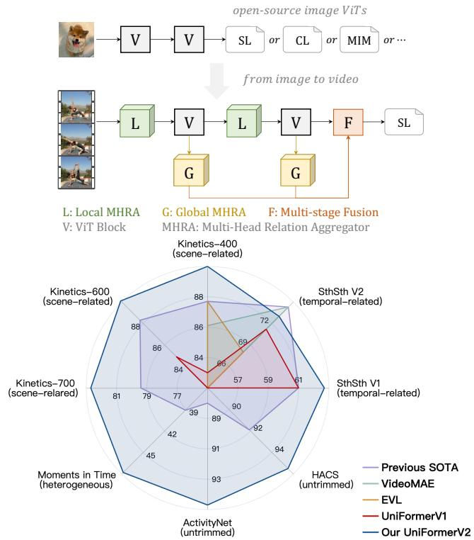
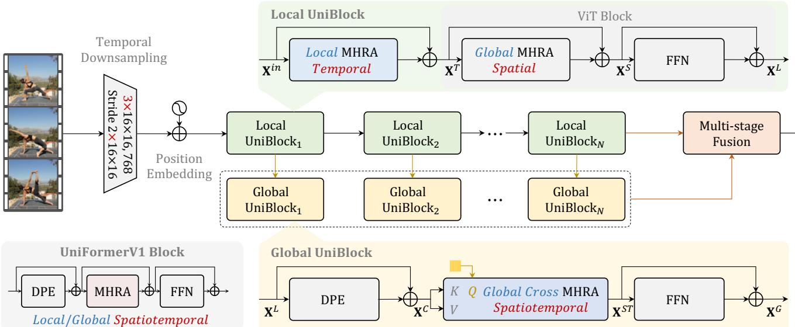
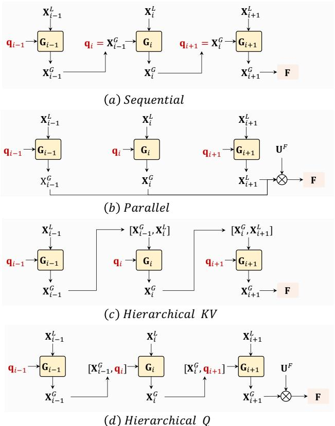
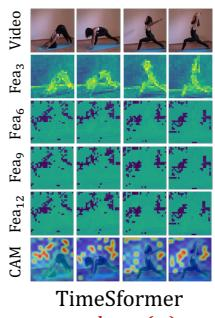
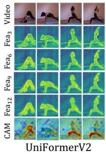
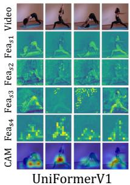

# UniFormerV2: Unlocking the Potential of Image ViTs for Video Understanding

Kunchang Li1,2,3\* Yali Wang1,3† Yinan He3 Yizhuo Li4,3\* Yi Wang3 Limin Wang5,3 Yu Qiao3,1†

1Shenzhen Institute of Advanced Technology, Chinese Academy of Sciences 2University of Chinese Academy of Sciences 3Shanghai AI Laboratory 4The University of Hong Kong 5State Key Laboratory for Novel Software Technology, Nanjing University Code & Models: https://github.com/OpenGVLab/UniFormerV2

## Abstract

The prolific performances ofVision Transformers (ViTs) in image tasks have prompted research into adapting the image ViTs for video tasks. However, the substantial gap between image and video impedes the spatiotemporal learning of these image-pretrained models. Though videospecialized models like UniFormer can transfer to the video domain more seamlessly, their unique architectures require prolonged image pretraining, limiting the scalability. Given the emergence ofpowerful open-source image ViTs, we propose unlocking their potentialfor video understanding with efficient UniFormer designs. We call the resulting model UniFormerV2, since it inherits the concise style of the Uni-Former block, while redesigning local and global relation aggregators that seamlessly integrate advantagesfrom both ViTs and UniFormer. Our UniFormerV2 achieves state-ofthe-art performances on 8 popular video benchmarks, including scene-related Kinetics-400/600/700, heterogeneous Moments in Time, temporal-related Something-Something V1/V2, and untrimmed ActivityNet and HACS. It is noteworthy that to the best of our knowledge, UniFormerV2 is thefirst to elicit 90% top-1 accuracy on Kinetics-400.

## 1. Introduction

The triumph of transformer-based language foundation models [16, 51, 5] has resulted in the swift growth of image foundation models [18, 24, 50, 73], which have been meticulously trained on massive web datasets with rich supervision, such as image-text contrastive learning [50, 30] and mask image modeling [24, 3]. The resulting Vision Transformers (ViTs) exhibit exceptional generalization capacity for a range of image tasks [43, 12, 53], motivating researchers to explore their applications for video tasks.

  
Figure 1: Comparison with SOTA methods using open sources. Our UniFormerV2 achieves state-of-the-art performances on popular scene-related, temporal-related, heterogeneous and untrimmed video benchmarks. Compared to VideoMAE [71] which requires thousands of epochs for pre-training, our method directly arms well-prepared image ViTs with efficient designs for robust video understanding.

In light of the success of adapting 2D convolution neural networks (CNNs) for spatiotemporal learning [63, 59, 39, 31], researchers have proposed a series of plug-and-play modules for ViTs, such as split space-time attention [4], token shift module [23], and motion-enhanced decoder [40]. Thanks to powerful image pretraining [66, 55, 50], these

ViT-based video learners surpass CNNs by a considerable margin on traditional scene-related benchmarks [32, 9, 10], which can be recognized easily by a single frame. However, when faced with complex temporal-related tasks [22], they perform much worse than CNN-based ones [34, 62]. The substantial domain gap between image and video presents a challenge to adapt image ViTs for video understanding.

Another prevalent paradigm is to design specialized ViTs [42, 37, 35], which can be effortlessly transferred to the video domain via simple technique, i.e., inflating spatial convolution or attention to spatiotemporal ones. In the advanced UniFormer [35], the authors unify convolution and self-attention as Multi-Head Relation Aggregator (MHRA) in a transformer format. By modeling local and global relations respectively in shallow and deep layers, it can not only handle both scene-related and temporal-related tasks effectively, but also significantly reduce the computation burden. However, as a unique architecture, UniFormer lacks image pretraining as a starting point. To obtain a robust visual representation, it has to go through prolonged pretraining on images before finetuning on videos, which makes it difficult to scale up. Considering the emergence of powerful opensource image ViTs [66, 3, 50], a natural question arises: Can we unlock the potential of image ViTs for video understanding with an efficient UniFormer design?

In this paper, we propose a simple yet effective paradigm for constructing powerful video networks, by arming the image-pretrained ViTs with efficient UniFormer designs (see Figure 1). We call the resulting model UniFormerV2, since it inherits the concise style of UniFormer but equips local and global UniBlocks with new MHRA. In the local UniBlock, we incorporate a local temporal MHRA before the spatial ViT block. Thus we can largely reduce temporal redundancy and leverage the well-pretrained ViT block, for learning local spatiotemporal representation effectively. As for the global UniBlock, we introduce a query-based cross MHRA. Unlike the costly global MHRA in the original UniFormer, our cross MHRA can summarize all the spatiotemporal tokens into a video token, for learning global spatiotemporal representation efficiently. Finally, we reorganize local and global UniBlocks as a multi-stage fusion architecture, which can adaptively integrate multi-scale spatiotemporal representation to capture complex dynamics.

We apply our paradigm on ViTs that are pretrained on three popular supervision, including supervised learning [55, 56], contrastive learning [50], and mask image modeling [24, 3]. Our results reveal that all enhanced models exhibit superior performance compared to previous ViTbased approaches, showcasing the generic nature of our UniFormerV2. In addition, we have constructed a compact Kinetics-710 benchmark, combining the action classes of Kinetics-400/600/700, and have removed repeated and leaked videos in the training sets of these benchmarks for enhanced fairness. As a result, the number of training videos has been reduced from 1.14M to 0.66M. After training on K710, our model can simply achieve higher accuracy on K400/600/700 via only 5-epoch finetuning.

To verify the robustness of our approach, we conduct experiments on 8 large-scale video benchmarks as shown in Figure 1, including scene-related datasets (i.e., Kinetics-400/600/700 [32, 9, 10], a heterogeneous dataset that contains complex inter-class and inter-class variation (i.e., Moments in Time [44]), temporal-related datasets (i.e., Something-Something V1/V2 [22]), and untrimmed datasets (i.e., ActivityNet [25] and HACS [78]). Our Uni-FormerV2 based on CLIP-ViT [50] achieves state-of-the-art results on all the benchmarks. It is worth mentioning that our model is the first to elicit a top-1 accuracy of 90.0% on Kinetics-400, to the best of our knowledge.

## 2. Related Works

Vision Transformer. Following the groundbreaking success of Transformer in NLP [60, 16], Vision Transformer (ViT) [18] has shown great promise in a variety of visual tasks, including object detection [7, 81], semantic segmentation [70, 13], low-level image processing [38, 15], action recognition [4, 1, 72], temporal localization [76, 61] and multi-modality learning [50, 64]. To further enhance the efficiency and effectiveness of ViT, researchers have explored various methods for modeling locality, including multi-scale architectures [65, 19], local window [41], early convolution embedding [69, 74] and convolutional position encoding [14, 17]. Alternatively, UniFormer [35] unifies convolution and self-attention as relation aggregator in a transformer manner, thus reducing large local redundancy.

Video Learning. 3D Convolutional Neural Networks (CNNs) once played a dominant role in video understanding [57, 11]. However, the optimization of 3D CNNs can be problematic, hence great efforts have been made to factorize 3D convolution in the spatiotemporal dimension [59, 49, 21] or channel dimension [58, 20, 33]. Other advanced methods propose plug-and-play modules to enhance the temporal modeling capability of 2D CNNs [39, 31, 36, 34, 62]. However, due to the restricted local receptive field, CNNs are apt to miss long-range dependencies. The success of global attention [18] motivates researchers to adapt image ViTs for video tasks [4, 45, 77, 1, 6, 48]. To make the video transformer more efficient, prior works introduce hierarchical structure with pooling self-attention [19], local self-attention [42] or unified attention [35]. Though these novel models are adept at temporal modeling, they rely on tiresome image pretraining. In contrast, various wellpretrained ViTs with rich supervision are open-sourced [66, 3, 50]. In this paper, we aim to extend efficient Uni-Former designs to ViT, arming it as a strong video learner.

## 3. Method

## 3.1. Revisit UniFormer

UniFormer [35] is originally proposed for efficient video understanding. It unifies convolution and self-attention as Multi-Head Relation Aggregator (MHRA) in a transformer format as shown in the bottom-left in Figure 2, along with Dynamic Position Embedding (DPE) and Feed-Forward Network (FFN). Specifically, the DPE is instantiated as 3×3×3 depth-wise spatiotemporal convolution to integrate 3D position information. And the FFN includes two linear layers for pointwise enhancement. Similar with Multi-Head Self-Attention (MHSA) [60], the MHRA learns token relation via multi-head fusion:

$$
\mathrm { R } _ { n } ( \mathbf { X } ) = \mathrm { A } _ { n } \mathrm { V } _ { n } ( \mathbf { X } ) ,\tag{1}
$$

$$
\mathrm { { M H R A } } ( \mathbf { X } ) = \mathrm { { C o n c a t } } ( \mathrm { { R } } _ { 1 } ( \mathbf { X } ) ; \cdots ; \mathrm { { R } } _ { N } ( \mathbf { X } ) ) \mathbf { U } ,\tag{2}
$$

where $\mathrm { R } _ { n } ( \cdot )$ refers to the relation aggregator in the n-th head. $\mathrm { A } _ { n }$ is an affinity matrix that describes token relation and $\mathrm { V } _ { n } ( \cdot )$ is a linear projection, while $\mathbf { U } \in \mathbb { R } ^ { C \times C }$ is a learnable fusion matrix. The crucial MHRA flexibly applies local and global spatiotemporal token affinity in the shallow and deep layers, respectively, tackling both video local redundancy and global dependency.

However, like other specialized video backbones [19, 37, 42], UniFormer is difficult to scale up due to the necessity of costly image pretraining. Considering the emergence of powerful image ViTs [66, 3, 50], it is preferable to arm those well-prepared models for video understanding.

## 3.2. Overall Framework of UniFormerV2

To fully utilize the exceptional pretraining capabilities of the image ViTs, it is imperative to retain the spatial modeling while significantly improving temporal modeling. Hence, we have redesigned UniFormer into efficient plugand-play modules to make ViT a robust video learner. We call the resulting model UniFormerV2 in Figure 2.

Firstly, we apply 3D convolution (i.e., 3×16×16) to project the input video as L spatiotemporal tokens $\mathbf { X } ^ { i n } \in$ $\mathbb { R } ^ { L \times C }$ , where L corresponds to the product of time, height, and width (T, H, and W, respectively) of the input video. Following the original ViT design [18], we perform spatial downsampling by a factor of 16. Additionally, to enhance temporal modeling, temporal downsampling is performed by a factor of 2. Next, we construct both local and global UniBlocks. Our local UniBlock leverages the spatial representation of ViT while efficiently reducing local temporal redundancy by inserting a local temporal MHRA before the image-pretrained ViT block. To capture full spatiotemporal dependency, we introduce a global UniBlock on top of each local UniBlock. Additionally, for computational efficiency, we design a query-based cross MHRA to aggregate all the spatiotemporal tokens as a global video token. Finally, all tokens with different-level global semantics from multiple stages are fused together to form a discriminative video representation.

## 3.3. Local UniBlock

To efficiently model temporal dependency upon the welllearned spatial representation, we insert the novel local temporal MHRA before the standard ViT block,

$$
\mathbf { X } ^ { T } = \mathrm { L T } \_ { \mathrm { M H R A } } \left( \mathrm { N o r m } \left( \mathbf { X } ^ { i n } \right) \right) + \mathbf { X } ^ { i n } ,\tag{3}
$$

$$
\mathbf { X } ^ { S } = \operatorname { G S } \mathrm { { \mathrm { . } M H R A } } \left( \operatorname { N o r m } \left( \mathbf { X } ^ { T } \right) \right) + \mathbf { X } ^ { T } ,\tag{4}
$$

$$
\mathbf { X } ^ { L } = \mathrm { F F N } \left( \operatorname { N o r m } \left( \mathbf { X } ^ { S } \right) \right) + \mathbf { X } ^ { S } .\tag{5}
$$

LT MHRA and GS MHRA refer to MHRA with local temporal affinity and global spatial affinity respectively. FFN consists of two linear projections separated by GeLU [26]. Additionally, following the normalization in Uni-Former [35], we adopt Batch Norm (BN) [28] before local MHRA, and Layer Norm (LN) [2] before global MHRA and FFN. Note that GS MHRA and FFN come from the image-pretrained ViT block. Driven by the architectural insight of UniFormer, we incorporate LT MHRA to mitigate local temporal redundancy effectively. Hence, the affinity in LT MHRA is local with a learnable parameter matrix $a _ { n } \in \mathbb { R } ^ { t \times 1 \times 1 }$ in the temporal tube $t \times 1 \times 1$

$$
\displaystyle \mathrm { A } _ { n } ^ { \mathrm { L T } } ( \mathbf { X } _ { i } , \mathbf { X } _ { j } ) = a _ { n } ^ { i - j } , \ w h e r e \ j \in \Omega _ { i } ^ { t \times 1 \times 1 } .\tag{6}
$$

This allows to efficiently learn the local temporal relation between one token $\mathbf { X } _ { i }$ and other tokens $\mathbf { X } _ { j }$ in the tube. Alternatively, GS MHRA belongs to the original ViT block. Therefore, the affinity in GS MHRA refers to a global spatial self-attention in the single frame $1 \times H \times W$

$$
\operatorname { A } _ { n } ^ { \operatorname { G S } } ( \mathbf { X } _ { i } , \mathbf { X } _ { j } ) = \frac { \exp \{ \operatorname { Q } _ { n } ( \mathbf { X } _ { i } ) ^ { T } \mathrm { K } _ { n } ( \mathbf { X } _ { j } ) \} } { \sum _ { j ^ { \prime } \in \Omega _ { 1 \times H \times W } } \exp \{ \operatorname { Q } _ { n } ( \mathbf { X } _ { i } ) ^ { T } \mathrm { K } _ { n } ( \mathbf { X } _ { j ^ { \prime } } ) \} } ,\tag{7}
$$

where $\mathrm { Q } _ { n } ( \cdot )$ and $\mathrm { K } _ { n } ( \cdot ) \in \mathbb { R } ^ { L \times \frac { C } { N } }$ are different linear projections in the n-th head.

Comparison to UniFormer: In the UniFormer [35], the local token affinity is jointly spatiotemporal, i.e., $\mathrm { A } _ { n } ^ { l o c a l } ( { \bf X } _ { i } , { \bf X } _ { j } ) { = } a _ { n } ^ { i - j }$ , where $j$ belongs to a 3D tube $\Omega _ { i } ^ { i \times h \times w }$ And the parameter matrix has to learn from scratch, which inevitably increases the training cost. In contrast, the spatiotemporal affinity in our local UniBlock is decomposed as local temporal one $\mathrm { A } _ { n } ^ { \mathrm { L T } }$ in Eq. (6), and global spatial one $\mathrm { A } _ { n } ^ { \mathrm { G S } }$ in Eq. (7). In this case, we can not only leverage the efficient video processing design of UniFormer but also inherit the effective image pretraining of ViT.

Comparison to ST-Adapter: ST-Adapter [47] is motivated by Adapter [27], thus it simply treats temporal depthwise convolution as adaptation and introduces an extra activation function. In contrast, inspired by UniFormer [35], we treat temporal depth-wise convolution as a local temporal relation aggregator, thus introducing extra BatchNorm [28] before the first linear projection V(·) without any activation function. As evidenced by Table 2, our local MHRA outperforms ST-Adapter (69.1% vs. 68.0%).

  
Figure 2: Overall framework of UniFormerV2. There are three key blocks, $i . e . ,$ local and global UniBlocks, and multistage fusion block. All these designs are efficient and effective. Detailed explanations can be found in Section 3.

## 3.4. Global UniBlock

To explicitly conduct long-range dependency modeling on the spatiotemporal scale, we present the global UniBlock as follows,

$$
\mathbf { X } ^ { C } = \mathrm { D P E } \left( \mathbf { X } ^ { L } \right) + \mathbf { X } ^ { L } ,\tag{8}
$$

$$
\mathbf { X } ^ { S T } = \mathrm { C } \mathrm { . M H R A } \left( \mathrm { N o r m } \left( \mathbf { q } \right) , \mathrm { N o r m } \left( \mathbf { X } ^ { C } \right) \right) ,\tag{9}
$$

$$
\mathbf { X } ^ { G } = \mathrm { F F N } \left( \operatorname { N o r m } \left( \mathbf { X } ^ { S T } \right) \right) + \mathbf { X } ^ { S T } .\tag{10}
$$

Following UniFormer [35], we apply DPE to dynamically integrate 3D position information. Moreover, we redesign the global C MHRA in a cross-attention style to efficiently construct a video representation,

$$
\operatorname { R } _ { n } ^ { \mathrm { { C } } } ( \mathbf { q } , \mathbf { X } ) = \operatorname { A } _ { n } ^ { \mathrm { { C } } } ( \mathbf { q } , \mathbf { X } ) \mathrm { { V } } _ { n } ( \mathbf { X } ) ,\tag{11}
$$

$$
\mathrm { C \mathrm { \mathrm { \mathrm { \mathrm { \mathrm { M H R A } } ( \mathbf { q } , X ) } } } } = \mathrm { C o n c a t } ( \mathrm { R } _ { 1 } ^ { \mathrm { C } } ( \mathbf { q } , \mathbf { X } ) ; \cdots ; \mathrm { R } _ { N } ^ { \mathrm { C } } ( \mathbf { q } , \mathbf { X } ) ) \mathbf { U } .\tag{12}
$$

$\mathrm { R } _ { n } ^ { \mathrm { C } } ( \mathbf { q } , \cdot )$ is the cross relation aggregator, which can convert a learnable query $\mathbf { q } \in \mathbb { R } ^ { 1 \times \bar { C } }$ into a video representation, via modeling dependency between q and all the spatiotemporal tokens X. First, it computes the cross affinity matrix $\mathrm { A } _ { n } ^ { \mathrm { C } } ( \mathbf { q } , \mathbf { X } )$ to learn relation between q and X,

$$
\operatorname { A } _ { n } ^ { \mathrm { C } } ( \mathbf { q } , \mathbf { X } _ { j } ) = \frac { \exp \{ \mathrm { Q } _ { n } ( \mathbf { q } ) ^ { T } \mathrm { K } _ { n } ( \mathbf { X } _ { j } ) \} } { \sum _ { j ^ { \prime } \in \Omega _ { T \times H \times W } } \exp \{ \mathrm { Q } _ { n } ( \mathbf { q } ) ^ { T } \mathrm { K } _ { n } ( \mathbf { X } _ { j ^ { \prime } } ) \} } .\tag{13}
$$

Then, it uses the linear projection to transform X as spatiotemporal context $\mathrm { V } _ { n } ( \mathbf { X } )$ . Subsequently, it aggregates such context $\mathrm { V } _ { n } ( \mathbf { X } )$ into the learnable query, with guidance of their affinity $\mathrm { A } _ { n } ^ { \mathrm { C } } ( \mathbf { q } , \mathbf { X } )$ . Finally, the enhanced query tokens from all the heads are further fused as a final video representation, by linear projection $\mathbf { U } \in \mathbb { R } ^ { C \times C }$ . Note the query token is zero-initialized for stable training.

Comparison to UniFormer: The global spatiotemporal MHRA present in UniFormer [35] is computationally heavy due to the quadratic complexity it entails. In contrast, our global MHRA in cross-attention style significantly reducing the computation complexity from $\bar { O } ( L ^ { 2 } )              1 0 O ( L )$ , where L is the number of tokens. More importantly, through the learnable query q, our global MHRA can adaptively incorporate spatiotemporal context from all L tokens to enhance video recognition. Furthermore, we add the global UniBlock on top of the local UniBlock, extracting multiscale spatiotemporal representations in token form. This design helps strengthen the discriminative video representation without compromising the pretrained architecture.

Comparison to DETR style: The methods inspired by DETR [7, 29] incorporate self-attention, cross-attention, and FFN. And they employ multiple queries with identical keys and values in cross-attention. On the other hand, our global block introduces DPE without self-attention. Meanwhile, only one query interacts with keys and values from distinct layers in our cross-attention.

## 3.5. Multi-Stage Fusion Block

We propose a multi-stage fusion block to integrate all video tokens from each global block as in Figure 3. For simplicity, we denote the i-th global block as $\mathbf { X } _ { i } ^ { \bar { G } } { = } \mathrm { G } _ { i } ( \mathbf { q } _ { i } , \mathbf { X } _ { i } ^ { L } )$ Given the tokens $\mathbf { X } _ { i } ^ { L }$ from the local UniBlock, the global block transforms the learnable query q into a video token $\mathbf { X } _ { i } ^ { G }$ . In this paper, we explore four fusion strategies to integrate the video tokens from all the global blocks $\{ \mathbf { X } _ { i } ^ { G } \} _ { i = 1 } ^ { N }$ into a final video representation F, and employ the sequential way to conduct fusion regarding efficacy and efficiency.

  
Figure 3: Multi-Stage Fusion Block.

(a) Sequential: We sequentially use the video token from the previous global block $\mathbf { X } _ { i - 1 } ^ { G }$ as the query token in the current global block q , where $\bar { \mathbf { X } _ { i } ^ { G } } { = } \mathrm { G } _ { i } ( \mathbf { X } _ { i - 1 } ^ { G } , \mathbf { X } _ { i } ^ { L } )$

(b) Parallel: We concatenate all the tokens $\{ \mathbf { X } _ { i } ^ { G } \} _ { i = 1 } ^ { N }$ 1 in parallel, and use a linear projection ${ \bf U } ^ { F } { \in } { \mathbb { R } } ^ { N \times ^ { \sum } C }$ to obtain the final token, where $\mathbf { F } { = } \mathbf { \bar { \mathrm { C o n c a t } } } ( \mathbf { X } _ { 1 } ^ { G } , . . . , \mathbf { X } _ { N } ^ { G } ) \mathbf { U } ^ { F }$

(c) Hierarchical KV: We use the video token from the previous global block $\mathbf { X } _ { i - } ^ { G }$ as a part of contextual tokens in the current global block, where $\mathbf { X } _ { i } ^ { G } { = } \mathrm { G } _ { i } ( \mathbf { q } _ { i } , [ \mathbf { X } _ { i - 1 } ^ { G } , \mathbf { X } _ { i } ^ { L } ] )$

(d) Hierarchical Q: We use the video token from the previous global block $\mathbf { X } _ { i - 1 } ^ { G }$ as a part of query tokens in the current global block, i.e., $\bar { \mathbf { X } } _ { i } ^ { G } { = } \mathrm { G } _ { i } ( [ \mathbf { X } _ { i - 1 } ^ { G } , \mathbf { q } _ { i } ] , \mathbf { X } _ { i } ^ { L } )$

Finally, we extract the class token FC from the final local UniBlock, and add it with the video token F by weighted sum, i.e., ${ \bf Z } = \alpha { \bf F } + ( 1 - \alpha ) { \bf F } ^ { C }$ , where α is a learnable parameter processed by the Sigmoid function.

## 4. Experiments

Datasets. To evaluate the learning capability of our UniFormerV2, we conduct experiments on 8 popular video benchmarks, including the trimmed videos less than 10 seconds, and the untrimmed videos more than 1 min. The trimmed video benchmarks include: (a) Scene-related Kinetics, i.e., Kinetics-400, 600 and 700; (b) Heterogeneous Moments in Time V1 [44]; (c) Temporal-related Something-Something V1/V2 [22]. For the untrimmed video recognition, we choose ActivityNet [25] and HACS [78]. More dataset details can be found in supplemental materials.

<table><tr><td>Global</td><td>Local</td><td>T-Down</td><td>GFLOPs</td><td>K400</td><td>SSV2</td></tr><tr><td>X</td><td>X</td><td>X</td><td>141</td><td>83.1</td><td>45.1</td></tr><tr><td>√</td><td>x</td><td>X</td><td>148</td><td>84.4</td><td>63.3</td></tr><tr><td>X</td><td>√</td><td>X</td><td>170</td><td>83.6</td><td>67.7</td></tr><tr><td>√</td><td>√</td><td>x</td><td>186</td><td>84.4</td><td>68.7</td></tr><tr><td>√</td><td>√</td><td>√</td><td>187</td><td>84.4</td><td>69.5</td></tr></table>

Table 1: Different components. The global block is crucial for scene-related benchmarks, while the local one is critical for temporal-related benchmarks.

Kinetics-710 for Post-Pretraining We propose a unified video benchmark for post-pretraining UniFormerV2. Different from [72] that exploits a web-scale video dataset (i.e., 60M video-text pairs), we build a much smaller video benchmark based on the Kinetics-400/600/700. Concretely, we merge the training set of these Kinetics datasets, and then delete the repeated videos based on Youtube IDs. Note that we have removed testing videos from different Kinetics datasets leaked in our combined training set for correctness. As a result, the total number of training videos is reduced from 1.14M to 0.66M. Additionally, we merge the action categories in these three datasets, which leads to 710 classes in total. Hence, we call this video benchmark Kinetics-710. In our experiments, we demonstrate the effectiveness of Kinetics-710. For post-pretraining, we simply use 8 input frames and adopt the same hyperparameters as training on the individual Kinetics dataset. After that, no matter how many frames are input (16, 32, or even 64), we only need 5-epoch finetuning for more than 1% top-1 accuracy improvement on Kinetics-400/600/700 (see Table 6).

Implement Details. Unless stated otherwise, we follow most of the training recipes in UniFormer [35], and the detailed training hyperparameters can be found in supplemental materials. We build UniFormerV2 based on ViTs pretrained with various supervisions (see Table 5), showing the generality of our design. For the best result, we adopt CLIP-ViT [50] as the backbone by default, due to its robust representation pretrained by vision-language contrastive learning. For most datasets, we insert the global UniBlocks in the last 4 layers of ViT-B/L to perform the multi-stage fusion. But for Sth-Sth V1/V2, we insert the global UniBlocks in the last 8/16 layers of ViT-B/L for better temporal modeling. The corresponding ablation studies are shown in Table 1, 2, 3. Finally, we adopt sparse sampling [63] with the resolution of 224 for all the datasets.

<table><tr><td>Design</td><td>|SSV2</td><td>Layer</td><td>Reduction</td><td>SSV2</td></tr><tr><td>Temporal MHSA [4]</td><td>65.2</td><td>1-4</td><td>1.5</td><td>67.6</td></tr><tr><td rowspan="2">Temporal Convolution ST-Adapter [47]</td><td>67.5</td><td>1-8</td><td>1.5</td><td>67.9</td></tr><tr><td>68.0</td><td>1-12</td><td>1.5</td><td>69.5</td></tr><tr><td>Local MHRA</td><td>69.1</td><td>1-12</td><td>4.0</td><td>68.9</td></tr><tr><td>Local MHRA + DPE</td><td>69.1</td><td>1-12</td><td>2.0</td><td>69.1</td></tr><tr><td>Local MHRA × 2</td><td>69.5</td><td>1-12</td><td>1.0</td><td>69.5</td></tr></table>

(a) Module design.  
(b) Location & Reduction.

Table 2: Local UniBlock. Our local MHRA outperforms its counterparts and we insert it in all the layers.
<table><tr><td colspan="2">Layer DPE</td><td>K400</td><td>|SSV2</td></tr><tr><td>9-12</td><td>X</td><td>84.2</td><td>68.1</td></tr><tr><td>9-12</td><td>√</td><td>84.4</td><td>68.5</td></tr><tr><td>5-12</td><td>√</td><td>84.4</td><td>69.5</td></tr><tr><td>1-12</td><td>√</td><td>84.4</td><td>69.4</td></tr></table>

Table 3: Global UniBlock. Deep layers are crucial for temporal modeling.
<table><tr><td>Query|</td><td>Design</td><td>|SSV2</td></tr><tr><td>1</td><td>Sequential</td><td>69.5</td></tr><tr><td>4</td><td>Sequential</td><td>69.1</td></tr><tr><td>16</td><td>Sequential</td><td>68.6</td></tr><tr><td>1</td><td>Parallel</td><td>69.1</td></tr><tr><td>1</td><td>Hierarchical KV</td><td>68.9</td></tr><tr><td>1</td><td>Hierarchical Q</td><td>69.5</td></tr></table>

Table 4: Fusion block.

<table><tr><td rowspan=3 colspan=1>Type</td><td></td><td></td><td></td><td></td></tr><tr><td rowspan=2 colspan=1>Method</td><td></td><td></td><td></td></tr><tr><td rowspan=1 colspan=1>Data</td><td rowspan=1 colspan=1>K400</td><td rowspan=1 colspan=1>SSV2</td></tr><tr><td rowspan=1 colspan=2>TimeSformer[4]</td><td rowspan=1 colspan=1>IN-21K</td><td rowspan=1 colspan=1>78.7</td><td rowspan=1 colspan=1>59.5</td></tr><tr><td rowspan=1 colspan=1>SL</td><td rowspan=1 colspan=1>ViTDeiT III</td><td rowspan=1 colspan=1>IN-21KIN-21K</td><td rowspan=1 colspan=1>81.682.7</td><td rowspan=1 colspan=1>67.566.5</td></tr><tr><td rowspan=1 colspan=1>CL</td><td rowspan=1 colspan=1>DINOCLIP</td><td rowspan=1 colspan=1>IN-1KCLIP-400M</td><td rowspan=1 colspan=1>78.784.4</td><td rowspan=1 colspan=1>65.869.5</td></tr><tr><td rowspan=2 colspan=1>MIM</td><td rowspan=2 colspan=1>MAEBeiT</td><td rowspan=2 colspan=1>IN-1KIN-22K</td><td rowspan=1 colspan=1>78.8</td><td rowspan=2 colspan=1>65.167.7</td></tr><tr><td rowspan=1 colspan=1>82.2</td></tr></table>

Table 5: Different pretrained ViTs. Our UniFormerV2 based on different open-source ViTs beats TimeSformer.

## 4.1. Ablation Studies

To evaluate the effectiveness of UniFormerV2, we investigate each key structure design. All the models are directly finetuned from CLIP-ViT-B/16 by default. We utilize “8×4×3” and “16×1×3” testing strategies for Kinetics and Something-Something respectively.

Different Components. Table 1 indicates that the global UniBlock is crucial for the scene-related benchmark (e.g., K400), since it can effectively provide holistic video representation for classification. Alternatively, the local UniBlock is critical for the temporal-related benchmark (e.g., SthSthV2), as it can efficiently describe detailed video representation. Furthermore, using temporal downsampling with double input frames (similar FLOPs) enlarges the temporal receptive field, which is also helpful for distinguishing complex temporal-related actions.

Local UniBlock. To explore the structure of local UniBlock, we conduct experiments in Table 2. It reveals that convolution is superior to self-attention for temporal modeling, and our local MHRA outperforms both methods. Following ST-Adapter [47], we add another local MHRA after the spatial MHRA for better performance. To achieve the best accuracy-FLOPs trade-off, local MHRA is incorporated in all layers while reducing the channel by 1.5 times.

<table><tr><td>Pretraining</td><td>Finetuning</td><td>Cost</td><td></td><td></td><td>|K400|K600|K700</td></tr><tr><td>None</td><td>Individual</td><td>1.00×</td><td>84.4</td><td>85.0</td><td>75.8</td></tr><tr><td>K400+K600+K700|K400+K600+K700|0.98×</td><td></td><td></td><td>85.6</td><td>86.0</td><td>75.6</td></tr><tr><td>K710</td><td>K400+K600+K700|0.67×</td><td></td><td>85.6</td><td>86.3</td><td>76.1</td></tr><tr><td>K710</td><td>Individual</td><td>0.67×</td><td>85.6</td><td>86.3</td><td>76.3</td></tr></table>

Table 6: Different training scripts. Our K710 pretraining saves 33% of costs with consistent improvement.

  
n0uℎ 0n (×)  
ùhë+ (√)

  
ùhë+ (√)  
Figure 4: Visualization comparisons. The frames are sampled from Kinetics-400 [32] according to different sampling strategies in different methods.

Global UniBlock and Multi-stage Fusion. Table 3 reveals that the features in the deep layers are critical for capturing long-term dependency, while the DPE and the middle information are necessary for identifying the motion difference. Furthermore, Table 4 shows that the simplest sequential fusion is adequate for integrating multi-stage features.

Pretraining Sources. To demonstrate the generality of our UniFormerV2 design, we apply it to the ViTs with various pertaining methods, including supervised learning [18, 56], contrastive learning[8, 50] and mask image modeling [24, 3]. Table 5 indicates that all the models beat TimeSformer [4], especially for SthSth V2 which relies on robust temporal modeling. The findings also suggest that a wellpretrained ViT enhances video performance.

Training Recipes. We compare different training and finetuning methods in Table 6. Note that when co-training with K400, K600 and K700, we remove the leaked videos in the validation set and introduce three classification heads. While K710 has only around 58% of the total training videos (0.66M vs. 1.14M for K400+K600+K700), it significantly enhances performances on Kinetics. Moreover, it decreases training costs by about 33%. Furthermore, direct training on K710 proves to be more effective than Kinetics co-training, especially for K600 (+1.3% vs. +1.0%) and K700 (+0.5 vs. -0.2%). Though co-finetuning shared the backbone and saved parameters, we individually fine-tune each dataset for better performance.

Visualization. In Figure 4, we compared UniFormerV2 with TimeSformer [4] and UniFormerV1 [35]. We use CAM [80] to show the most discriminative features that the network locates. The red parts indicate where the models focus more on, while the blue parts are ignored. It reveals that both UniFormerV1 and UniFormerV2 are good at capturing local details, but UniFormerV1 fails to activate discriminative parts in deeper layers due to the shrinking resolution. In contrast, TimeSformer only learns local features in the shallow layers, struggling to focus on meaningful areas. As for UniFormerV2, it surprisingly maintains local details in the deep layers and learns to focus on the woman’s leg. These results demonstrate that UniFormerV2 is effective to capture local details and long-term dependency.

<table><tr><td>Method</td><td>Backbone</td><td>Pretraining Data</td><td>Frame× Crop×Clip</td><td>Param (M)</td><td>FLOPs (T)</td><td colspan="2">K400</td></tr><tr><td colspan="2">Specialized backbone with supervised pretraining.</td><td></td><td></td><td></td><td></td><td>Top-1</td><td>Top-5</td></tr><tr><td>MViTv1-B [19] MViTv1-B</td><td colspan="2"></td><td>64×3×3</td><td>37</td><td>4.1</td><td>81.2</td><td>95.1</td></tr><tr><td>UniFormerV1-B [35]</td><td>UniFormer-B</td><td>IN-1K</td><td>32×3×4</td><td>50</td><td>3.1</td><td>83.0</td><td>95.4</td></tr><tr><td>VideoSwin-L</td><td>Swin-L</td><td>IN-21K</td><td>32×3×4</td><td>197</td><td>7.2</td><td>83.1</td><td>95.9</td></tr><tr><td>MViTv2-L 312↑ [37]</td><td>MViTv2-L</td><td>IN-21K</td><td>40×3×5</td><td>218</td><td>42.4</td><td>86.1</td><td>97.0</td></tr><tr><td colspan="2">Vanilla ViT with self-supervised pretraining for 1600 epochs.</td><td colspan="3"></td><td></td><td></td><td></td></tr><tr><td>VideoMAE-B [54]</td><td>ViT-B</td><td></td><td>16×3×5</td><td>87</td><td>2.7</td><td>81.5</td><td>95.1</td></tr><tr><td>VideoMAE-L [54]</td><td>ViT-L</td><td></td><td>16×3×5</td><td>305</td><td>9.0</td><td>85.2</td><td>96.8</td></tr><tr><td>VideoMAE-L 320↑ [54]</td><td>ViT-L</td><td></td><td>32×3×4</td><td>305</td><td>47.5</td><td>86.1</td><td>97.3</td></tr><tr><td>Well-prepared ViT with plug-and-play modules. Those models using in-house sources (data or models) are noted in gray.</td><td colspan="2"></td><td></td><td></td><td></td><td></td><td></td></tr><tr><td>TimeSformer-L [4] ViT-B IN-21K</td><td colspan="2"></td><td>96×3×1</td><td>121</td><td>7.1</td><td>80.7</td><td>94.7</td></tr><tr><td>ST-Adapter-B [47]</td><td>ViT-B</td><td>CLIP-400M</td><td>8×3×1</td><td>102</td><td>0.5</td><td>82.0</td><td>95.7</td></tr><tr><td>EVL-B [40]</td><td>ViT-B</td><td>CLIP-400M</td><td>8×3×1</td><td>119</td><td>0.4</td><td>82.9</td><td></td></tr><tr><td>EVL-L [40]</td><td>ViT-L</td><td>CLIP-400M</td><td>8×3×1</td><td>362</td><td>2.0</td><td>86.3</td><td></td></tr><tr><td>X-CLIP-B [46]</td><td>ViT-B</td><td>CLIP-400M</td><td>8×3×4</td><td>122</td><td>1.7</td><td>83.8</td><td>96.7</td></tr><tr><td>X-CLIP-L [46]</td><td>ViT-L</td><td>CLIP-400M</td><td>8×3×4</td><td>430</td><td>7.9</td><td>87.1</td><td>97.6</td></tr><tr><td>X-CLIP-L 336↑ [46]</td><td>ViT-L</td><td>CLIP-400M</td><td>16×3×4</td><td>430</td><td>37.0</td><td>87.7</td><td>97.4</td></tr><tr><td>CoCa 576↑[73]</td><td>ViT-g</td><td>JFT-3B+ALIGN-1.8B</td><td>N/A</td><td>1000+</td><td>N/A</td><td>88.9</td><td></td></tr><tr><td>MTV-H [72]</td><td>ViT-H+B+S+T</td><td>IN-21K+WTS-60M</td><td>32×3×4</td><td>1000+</td><td>44.5</td><td>89.1</td><td>98.2</td></tr><tr><td>UniFormerV2-B</td><td>ViT-B</td><td>CLIP-400M</td><td>8×3×1</td><td>115</td><td>0.4</td><td>84.0</td><td>96.3</td></tr><tr><td>UniFormerV2-B</td><td>ViT-B</td><td>CLIP-400M</td><td>8×3×4</td><td>115</td><td>1.6</td><td>84.4</td><td>96.3</td></tr><tr><td>UniFormerV2-L</td><td>ViT-L</td><td>CLIP-400M</td><td>8×3×1</td><td>354</td><td>2.0</td><td>87.3</td><td>97.7</td></tr><tr><td>UniFormerV2-L</td><td>ViT-L</td><td>CLIP-400M</td><td>8×3×4</td><td>354</td><td>8.0</td><td>87.7</td><td>97.9</td></tr><tr><td>UniFormerV2-B</td><td>ViT-B</td><td>CLIP-400M+K710-0.66M</td><td>8×3×4</td><td>115</td><td>1.6</td><td>85.6</td><td>97.0</td></tr><tr><td>UniFormerV2-L</td><td>ViT-L</td><td>CLIP-400M+K710-0.66M</td><td>8×3×4</td><td>354</td><td>8.0</td><td>88.8</td><td>98.2</td></tr><tr><td>UniFormerV2-L</td><td>ViT-L</td><td>CLIP-400M+K710-0.66M</td><td>32×3×2</td><td>354</td><td>16.0</td><td>89.3</td><td>98.3</td></tr><tr><td>UniFormerV2-L 336↑</td><td>ViT-L</td><td>CLIP-400M+K710-0.66M</td><td>32×3×2</td><td>354</td><td>37.6</td><td>89.7</td><td>98.3</td></tr><tr><td>UniFormerV2-L 336↑</td><td>ViT-L</td><td>CLIP-400M+K710-0.66M</td><td>64×3×2</td><td>354</td><td>75.3</td><td>90.0</td><td>98.4</td></tr></table>

Table 7: Results on scene-related Kinetics-400. Our UniFormerV2 with public sources outperforms most of the current methods in terms of accuracy and/or efficiency. And it firstly achieves 90.0% top-1 accuracy on Kinetics-400.
<table><tr><td rowspan=1 colspan=1>Method</td><td rowspan=1 colspan=1>Frame×Crop×Clip</td><td rowspan=1 colspan=1>Param(M)</td><td rowspan=1 colspan=1>FLOPs(T)</td><td rowspan=1 colspan=1>K600Top-1 Top-5</td></tr><tr><td rowspan=1 colspan=1>SlowFast101 [21]MoViNet-A5 320↑ [33]MViTv2-L 352↑ [37]</td><td rowspan=1 colspan=1>80×3×10120×1×140×3×4</td><td rowspan=1 colspan=1>6016218</td><td rowspan=1 colspan=1>7.00.345.5</td><td rowspan=1 colspan=1>81.8 95.182.7 95.787.9 97.9</td></tr><tr><td rowspan=2 colspan=1>X-CLIP-L [75]CoVeR 448↑ [75]CoCa576↑ [73]MTV-H [72]</td><td rowspan=2 colspan=1>16×3×416×3×1N/A32×3×4</td><td rowspan=1 colspan=1>430</td><td rowspan=1 colspan=1>7.9</td><td rowspan=1 colspan=1>88.3 97.7</td></tr><tr><td rowspan=1 colspan=1>4311000+1000+</td><td rowspan=1 colspan=1>17.6N/A44.5</td><td rowspan=1 colspan=1>87.989.489.6 98.3</td></tr><tr><td rowspan=1 colspan=1>UniFormerV2-L</td><td rowspan=1 colspan=1>32×3×2</td><td rowspan=1 colspan=1>354</td><td rowspan=1 colspan=1>16.0</td><td rowspan=1 colspan=1>89.5 98.3</td></tr><tr><td rowspan=2 colspan=1>UniFormerV2-L 336↑UniFormerV2-L 336↑</td><td rowspan=1 colspan=1>32×3×2</td><td rowspan=1 colspan=1>354</td><td rowspan=1 colspan=1>37.6</td><td rowspan=1 colspan=1>89.9 98.5</td></tr><tr><td rowspan=1 colspan=1>64×3×2</td><td rowspan=1 colspan=1>354</td><td rowspan=1 colspan=1>75.3</td><td rowspan=1 colspan=1>90.1 98.5</td></tr></table>

Table 8: Results on scene-related Kinetics-600.

<table><tr><td rowspan=1 colspan=1>Method</td><td rowspan=1 colspan=1>Frame×Crop×Clip</td><td rowspan=1 colspan=1>Param(M)</td><td rowspan=1 colspan=1>FLOPs(T)</td><td rowspan=1 colspan=1>K700Top-1 Top-5</td></tr><tr><td rowspan=1 colspan=1>SlowFast101 [21]MoViNet-A5 320↑ [33]MViTv2-L 312↑ [37]</td><td rowspan=1 colspan=1>80×3×10120×1×140×3×3</td><td rowspan=1 colspan=1>6016218</td><td rowspan=1 colspan=1>7.00.325.5</td><td rowspan=1 colspan=1>71.0 89.671.779.4 94.9</td></tr><tr><td rowspan=1 colspan=1>CoVeR 448↑ [75]MTV-H [72]CoCa 576↑ [73]</td><td rowspan=1 colspan=1>16×3×132×3×4N/A</td><td rowspan=1 colspan=1>4311000+1000+</td><td rowspan=1 colspan=1>17.644.5N/A</td><td rowspan=1 colspan=1>79.882.2 95.782.7</td></tr><tr><td rowspan=1 colspan=1>UniFormerV2-LUniFormerV2-L 336↑UniFormerV2-L 336↑</td><td rowspan=1 colspan=1>32×3×232×3×264×3×2</td><td rowspan=1 colspan=1>354354354</td><td rowspan=1 colspan=1>16.037.675.3</td><td rowspan=1 colspan=1>81.5 95.782.1 96.182.7 96.2</td></tr></table>

Table 9: Results on scene-related Kinetics-700.

## 4.2. Comparison to state-of-the-art

Kinetics. Table 7 reports the results on scene-related Kinetics-400. (1) Compared with the advanced MViTv2- L [37], which is specialized for video and requires prolonged image pertaining, our UniFormerV2-L achieves 1.2% higher performance with only 5% FLOPs. (2) Though VideoMAE [54] demonstrates that the vanilla ViT can be a strong video learner, it has to train the model from scratch for 1600 epochs, while our method effectively utilizes wellprepared ViTs to achieve significant improvement (87.3% vs. 85.2% with similar FLOPs). (3) The third part lists our counterparts based on image ViTs. Compared with the popular prompt tuning [47, 40], our method fully unlocks the potential of pretraining ViTs with remarkable improvement. For example, at similar FLOPs, our UniFormerV2-B achieves 1.1% and 2.0% higher top-1 accuracy than EVL-B [40] and ST-Adapter-B [47], respectively. Compared with X-CLIP-L [46] that utilizes the extra language knowledge, our UniFormerV2-L obtains 0.6% performance gain (87.7% vs. 87.1%). It is noteworthy that our single model, which only requires 1% video post-pretraining and 35% parameters, outperforms MTV-H [72] that uses in-house pretraining data and model ensemble, achieving a new stateof-the-art result of 90.0% on Kinetics-400. As for Kinetics-600 and 700, our model also obtains the state-of-the-art performances (90.1% and 82.7%, see Table 8 and 9).

<table><tr><td>Method</td><td>Frame× Crop×Clip</td><td>Param (M)</td><td>FLOPs (T)</td><td>MiT V1 Top-1 Top-5</td></tr><tr><td>AssembleNet101 [52] MoViNet-A5 320↑ [33]</td><td>N/A 120×1×1</td><td>53 16</td><td>0.8 0.3</td><td>34.3 62.7</td></tr><tr><td>ViViT-L [1]</td><td>32×3×1</td><td>612</td><td>11.9</td><td>39.1 - 38.5 64.2</td></tr><tr><td>CoVeR 448↑ [75]</td><td>16×3×1</td><td>431</td><td>17.6</td><td>46.1</td></tr><tr><td>MTV-H [72]</td><td>32×3×4</td><td>1000+</td><td>44.5</td><td>45.6 74.7</td></tr><tr><td>UniFormerV2-B</td><td>8×3×4</td><td>115</td><td>1.8</td><td>42.7 71.5</td></tr><tr><td>UniFormerV2-L</td><td>8×3×4</td><td>354</td><td>8.0</td><td>47.0 76.1</td></tr><tr><td>UniFormerV2-L 336↑</td><td>8×3×4</td><td>354</td><td>18.8</td><td>47.8 76.9</td></tr></table>

Table 10: Results on heterogeneous Moments in Time.

<table><tr><td>Method</td><td>PT Data</td><td>#F</td><td>ParamFLOPs (M)</td><td>(T)</td><td>SSV2 Top-1 Top-5</td></tr><tr><td colspan="6">Specialized backbone with supervised pretraining.</td></tr><tr><td>MViTv1-B [19]</td><td>K400</td><td>|32|</td><td>37|</td><td>1.4|</td><td>67.7 90.9</td></tr><tr><td>UniFormerV1-B [35]|IN-1K+K400</td><td></td><td>32</td><td>50</td><td>0.8</td><td>71.2 92.8</td></tr><tr><td>VideoSwin-B [42]</td><td>IN-21K+K400</td><td>32</td><td>89</td><td>1.0</td><td>69.6 92.7</td></tr><tr><td>MViTv2-L 312↑ [37]|IN-21K+K400]</td><td></td><td>40</td><td>213</td><td>8.5</td><td>73.3 92.7</td></tr><tr><td colspan="6">Vanilla ViT with self-supervised pretraining for 2400 epochs.</td></tr><tr><td>VideoMAE-B [54]</td><td></td><td>16|</td><td>87</td><td>1.1</td><td>70.8 92.4</td></tr><tr><td>VideoMAE-L [54]</td><td></td><td>16</td><td>305</td><td>3.6 74.3</td><td>94.6</td></tr><tr><td colspan="6">Well-prepared ViT with plug-and-play modules.</td></tr><tr><td>TimeSformer-L [4]</td><td>IN-21K</td><td>|96|</td><td>121|</td><td>7.1| 62.3</td><td>81.0</td></tr><tr><td>ViViT-L [1]</td><td>IN-21K+K40032</td><td>32</td><td>612</td><td>11.9</td><td>65.4 89.8</td></tr><tr><td>Mformer-L [4]</td><td>IN-21K+K400</td><td></td><td>109</td><td>3.6 68.1</td><td>91.2</td></tr><tr><td>MTV-B [72]</td><td>IN-21K+K400</td><td>32</td><td>310</td><td>11.2 68.5</td><td>90.4</td></tr><tr><td>EVL-B [40]</td><td>CLIP-400M</td><td>32</td><td>182</td><td>2.0 62.4</td><td></td></tr><tr><td>EVL-L [40]</td><td>CLIP-400M</td><td>32</td><td>484</td><td>9.6 66.7</td><td></td></tr><tr><td>ST-Adapter-B [40]</td><td>CLIP-400M</td><td>32</td><td>102</td><td>2.0 69.5</td><td>92.6</td></tr><tr><td>CoVeR 448↑ [75]</td><td>JFT-3B+KMI</td><td>16</td><td>431</td><td>17.6 70.8</td><td></td></tr><tr><td>UniFormerV2-B</td><td>CLIP-400M</td><td>16</td><td>163</td><td>0.6 69.5</td><td>92.3</td></tr><tr><td>UniFormerV2-B</td><td>CLIP-400M</td><td>32</td><td>163</td><td>1.1 70.7</td><td>93.2</td></tr><tr><td>UniFormerV2-L</td><td>CLIP-400M</td><td>16</td><td>574</td><td>2.6 72.1</td><td>93.6</td></tr><tr><td></td><td>CLIP-400M</td><td></td><td></td><td></td><td></td></tr><tr><td>UniFormerV2-L</td><td></td><td>32</td><td>574</td><td>5.2</td><td>73.0 94.5</td></tr></table>

Table 11: Results on temporal-related SthSth V2. “#F” means the frame number. “KMI” means “K400+MiT+IN”.

Moments in Time. Due to complex inter-class and intraclass variations, MiT is more challenging than Kinetics. As shown in Table 10, our model beats most of the recent methods, e.g., compared with ViViT-L [1], UniFormerV2-B obtains 4.2% performance gain but only with 19% model parameters and 15% FLOPs. Compared with MTV-H [72], UniFormerV2-L only uses 35% model parameters and 25% FLOPs to achieve 2.2% top-1 accuracy improvement.

<table><tr><td rowspan=1 colspan=1>Method</td><td rowspan=1 colspan=1>Backbone</td><td rowspan=1 colspan=1>Frame</td><td rowspan=1 colspan=1>Top-1 Top-5</td></tr><tr><td rowspan=1 colspan=1>TSN [63]</td><td rowspan=1 colspan=1>ResNet-50</td><td rowspan=1 colspan=1>16</td><td rowspan=1 colspan=1>19.9  47.3</td></tr><tr><td rowspan=1 colspan=1>TSM [39]</td><td rowspan=1 colspan=1>ResNet-50</td><td rowspan=1 colspan=1>16</td><td rowspan=1 colspan=1>47.2  77.1</td></tr><tr><td rowspan=1 colspan=1>TEA [36]</td><td rowspan=1 colspan=1>ResNet-50</td><td rowspan=1 colspan=1>16</td><td rowspan=1 colspan=1>51.9  80.3</td></tr><tr><td rowspan=1 colspan=1>CT-Net [34]</td><td rowspan=1 colspan=1>ResNet-50</td><td rowspan=1 colspan=1>16</td><td rowspan=1 colspan=1>52.5  80.9</td></tr><tr><td rowspan=1 colspan=1>TDN [62]</td><td rowspan=1 colspan=1>ResNet-50</td><td rowspan=1 colspan=1>16</td><td rowspan=1 colspan=1>53.9  82.1</td></tr><tr><td rowspan=1 colspan=1>UniFormerV1-S [35]</td><td rowspan=1 colspan=1>UniFormer-S</td><td rowspan=1 colspan=1>16</td><td rowspan=1 colspan=1>57.1   84.9</td></tr><tr><td rowspan=1 colspan=1>UniFormerV1-B [35]</td><td rowspan=1 colspan=1>UniFormer-B</td><td rowspan=1 colspan=1>32</td><td rowspan=1 colspan=1>61.0   87.6</td></tr><tr><td rowspan=1 colspan=1>UniFormerV2-B</td><td rowspan=1 colspan=1>ViT-B</td><td rowspan=1 colspan=1>16</td><td rowspan=1 colspan=1>56.8   84.2</td></tr><tr><td rowspan=1 colspan=1>UniFormerV2-B</td><td rowspan=1 colspan=1>ViT-B</td><td rowspan=1 colspan=1>32</td><td rowspan=1 colspan=1>59.4  86.2</td></tr><tr><td rowspan=2 colspan=1>UniFormerV2-LUniFormerV2-L</td><td rowspan=1 colspan=1>ViT-L</td><td rowspan=1 colspan=1>16</td><td rowspan=1 colspan=1>60.5   86.5</td></tr><tr><td rowspan=1 colspan=1>ViT-L</td><td rowspan=1 colspan=1>32</td><td rowspan=1 colspan=1>62.7  88.0</td></tr></table>

Table 12: Results on temporal-related SthSth V1.

<table><tr><td rowspan=1 colspan=1>Method</td><td rowspan=1 colspan=1>#F</td><td rowspan=1 colspan=1>ANet</td><td></td><td rowspan=1 colspan=1>Method</td><td rowspan=1 colspan=1>#F</td><td rowspan=1 colspan=1>HACS</td></tr><tr><td rowspan=3 colspan=1>DSN-R34 [79]MARL-R152 [67]NSNet-Swin-L [68]</td><td rowspan=1 colspan=1>32</td><td rowspan=1 colspan=1>82.6</td><td></td><td rowspan=1 colspan=1>CSN-R152 [58]</td><td rowspan=1 colspan=1>32</td><td rowspan=1 colspan=1>91.5</td></tr><tr><td rowspan=2 colspan=1>3232</td><td rowspan=2 colspan=1>85.790.2</td><td></td><td rowspan=1 colspan=1>TimeSformer [4]</td><td rowspan=1 colspan=1>8</td><td rowspan=2 colspan=1>91.891.9</td></tr><tr><td></td><td rowspan=1 colspan=1>ViViT-B [1]</td><td rowspan=1 colspan=1>32</td></tr><tr><td rowspan=2 colspan=1>UniFormerV2-LUniFormerV2-L</td><td rowspan=1 colspan=1>16</td><td rowspan=1 colspan=1>94.3</td><td></td><td rowspan=1 colspan=1>UniFormerV2-L</td><td rowspan=1 colspan=1>16</td><td rowspan=1 colspan=1>95.5</td></tr><tr><td rowspan=1 colspan=1>32</td><td rowspan=1 colspan=1>94.7</td><td></td><td rowspan=1 colspan=1>UniFormerV2-L</td><td rowspan=1 colspan=1>32</td><td rowspan=1 colspan=1>95.4</td></tr></table>

Table 13: Results on untrimmed ActivityNet and HACS. “#F” means the frame number. Top-1 accuracy is reported.

Something-Something. Table 11 presents the results on temporal-related SthSth V2. It reveals that the existing state-of-the-art methods are specialized or based on masked modeling, both of which require expensive pretraining. In contrast, our method is economically friendly, as it uses open-source ViTs. UniFormerV2-L achieves comparable performance with the latest MViTv2-L [37] (top-1: 73.0% vs. 74.3%) and VideoMAE-L [54] (top-5: 94.5% vs. 94.6%). Furthermore, the results demonstrate that previous plug-and-play methods perform much worse on the temporal-related task. For example, EVL-L [40] achieves 1.1% higher performance than VideoMAE-L on K400, but obtains 7.6% lower accuracy on SthSthV2. However, our method can arms image ViT for strong temporal modeling, delivering 6.4% performance gain than EVL with fewer computation costs on SthSth V2. Additionally, for SthSth V1 in Table 12, we achieve the new state-of-the-art performance (62.7%). These results demonstrate the effectiveness and efficiency of UniFormerV2 for temporal modeling.

ActivityNet and HACS. For the untrimmed videos, it is essential to capture long-range temporal information, since the action may occur multiple times at arbitrary moments. As shown in Table 13, our UniFormerV2 significantly outperforms the previous best methods on the large-scale untrimmed benchmark ActivityNet and HACS by 4.5% and 3.6%, respectively. These results demonstrate the strong long-term modeling capacity of our method.

## 5. Conclusion

In this paper, we serve UniFormer as efficient plug-andplay modules for image ViTs, enhancing their abilities as strong video learners. Extensive experiments demonstrate that our UniFormerV2 can unlock the full potentials of image ViTs, achieving state-of-the-art performances on 8 large-scale benchmarks. To the best of our knowledge, it is the first model to reach 90% top-1 accuracy on Kinetics-400. As the research community becomes increasingly open, we hope our method will be instrumental in building powerful yet cost-effective video foundation models.

## Acknowledgement

This work was supported in part by the National Key R&D Program of China (No. 2022ZD0160100, No. 2022ZD0160505, No. 2022ZD0160900), the National Natural Science Foundation of China (No. 62076119), the Joint Lab of CAS-HK, the National Natural Science Foundation of China under Grant (No. 62272450), the Shenzhen Research Program (RCJC20200714114557087), and in part by the Youth Innovation Promotion Association of Chinese Academy of Sciences (No. 2020355).

## References

[1] Anurag Arnab, Mostafa Dehghani, Georg Heigold, Chen Sun, Mario Luciˇ c, and Cordelia Schmid. Vivit: A video vi-´ sion transformer. In IEEE/CVF International Conference on Computer Vision, 2021. 2, 8

[2] Jimmy Ba, Jamie Ryan Kiros, and Geoffrey E. Hinton. Layer normalization. ArXiv, abs/1607.06450, 2016. 3

[3] Hangbo Bao, Li Dong, Songhao Piao, and Furu Wei. Beit: Bert pre-training of image transformers. In International Conference on Learning Representations, 2021. 1, 2, 3, 6

[4] Gedas Bertasius, Heng Wang, and Lorenzo Torresani. Is space-time attention all you need for video understanding? In International Conference on Machine Learning, 2021. 1, 2, 6, 7, 8

[5] Tom Brown, Benjamin Mann, Nick Ryder, Melanie Subbiah, Jared D Kaplan, Prafulla Dhariwal, Arvind Neelakantan, Pranav Shyam, Girish Sastry, Amanda Askell, et al. Language models are few-shot learners. Advances in neural information processing systems, 2020. 1

[6] Adrian Bulat, Juan-Manuel Perez-Rua, Swathikiran Sudhakaran, Brais Martinez, and Georgios Tzimiropoulos. Space-time mixing attention for video transformer. In Neural Information Processing Systems, 2021. 2

[7] Nicolas Carion, Francisco Massa, Gabriel Synnaeve, Nicolas Usunier, Alexander Kirillov, and Sergey Zagoruyko. End-toend object detection with transformers. In European conference on computer vision, 2020. 2, 4

[8] Mathilde Caron, Hugo Touvron, Ishan Misra, Herv’e J’egou, Julien Mairal, Piotr Bojanowski, and Armand Joulin. Emerging properties in self-supervised vision transformers. In

IEEE/CVF International Conference on Computer Vision, 2021. 6

[9] Joao Carreira, Eric Noland, Andras Banki-Horvath, Chloe˜ Hillier, and Andrew Zisserman. A short note about kinetics-600. ArXiv, abs/1808.01340, 2018. 2

[10] Joao Carreira, Eric Noland, Chloe Hillier, and Andrew Zis-˜ serman. A short note on the kinetics-700 human action dataset. ArXiv, abs/1907.06987, 2019. 2

[11] Joao Carreira and Andrew Zisserman. Quo vadis, action˜ recognition? a new model and the kinetics dataset. IEEE Conference on Computer Vision and Pattern Recognition, 2017. 2

[12] Zhe Chen, Yuchen Duan, Wenhai Wang, Junjun He, Tong Lu, Jifeng Dai, and Y. Qiao. Vision transformer adapter for dense predictions. ArXiv, abs/2205.08534, 2022. 1

[13] Bowen Cheng, Alex Schwing, and Alexander Kirillov. Perpixel classification is not all you need for semantic segmentation. In Neural Information Processing Systems, 2021. 2

[14] Xiangxiang Chu, Bo Zhang, Zhi Tian, Xiaolin Wei, and Huaxia Xia. Do we really need explicit position encodings for vision transformers? ArXiv, abs/2102.10882, 2021. 2

[15] Ziteng Cui, Kunchang Li, Lin Gu, Sheng Su, Peng Gao, Zhengkai Jiang, Yu Jiao Qiao, and Tatsuya Harada. You only need 90k parameters to adapt light: A light weight transformer for image enhancement and exposure correction. ArXiv, abs/2205.14871, 2022. 2

[16] Jacob Devlin, Ming-Wei Chang, Kenton Lee, and Kristina Toutanova. Bert: Pre-training of deep bidirectional transformers for language understanding. ArXiv, abs/1810.04805, 2018. 1, 2

[17] Xiaoyi Dong, Jianmin Bao, Dongdong Chen, Weiming Zhang, Nenghai Yu, Lu Yuan, Dong Chen, and Baining Guo. Cswin transformer: A general vision transformer backbone with cross-shaped windows. In IEEE/CVF Conference on Computer Vision and Pattern Recognition, 2022. 2

[18] Alexey Dosovitskiy, Lucas Beyer, Alexander Kolesnikov, Dirk Weissenborn, Xiaohua Zhai, Thomas Unterthiner, Mostafa Dehghani, Matthias Minderer, Georg Heigold, Sylvain Gelly, Jakob Uszkoreit, and Neil Houlsby. An image is worth 16x16 words: Transformers for image recognition at scale. In International Conference on Learning Representations, 2021. 1, 2, 3, 6

[19] Haoqi Fan, Bo Xiong, Karttikeya Mangalam, Yanghao Li, Zhicheng Yan, Jitendra Malik, and Christoph Feichtenhofer. Multiscale vision transformers. In IEEE/CVF International Conference on Computer Vision, 2021. 2, 3, 7, 8

[20] Christoph Feichtenhofer. X3d: Expanding architectures for efficient video recognition. In IEEE/CVF Conference on Computer Vision and Pattern Recognition, 2020. 2

[21] Christoph Feichtenhofer, Haoqi Fan, Jitendra Malik, and Kaiming He. Slowfast networks for video recognition. In IEEE/CVF International Conference on Computer Vision, 2019. 2, 7

[22] Raghav Goyal, Samira Ebrahimi Kahou, Vincent Michalski, Joanna Materzynska, Susanne Westphal, Heuna Kim, Valentin Haenel, Ingo Frund, Peter Yianilos, Moritz Mueller-¨ Freitag, Florian Hoppe, Christian Thurau, Ingo Bax, and

Roland Memisevic. The “something something” video database for learning and evaluating visual common sense. In IEEE International Conference on Computer Vision, 2017. 2, 5

[23] Chong-Wah Ngo Hao Zhang, Yanbin Hao. Token shift transformer for video classification. ACM Multimedia, 2022. 1

[24] Kaiming He, Xinlei Chen, Saining Xie, Yanghao Li, Piotr Doll’ar, and Ross B. Girshick. Masked autoencoders are scalable vision learners. In IEEE/CVF Conference on Computer Vision and Pattern Recognition, 2022. 1, 2, 6

[25] Fabian Caba Heilbron, Victor Escorcia, Bernard Ghanem, and Juan Carlos Niebles. Activitynet: A large-scale video benchmark for human activity understanding. In IEEE Conference on Computer Vision and Pattern Recognition, 2015. 2, 5

[26] Dan Hendrycks and Kevin Gimpel. Gaussian error linear units (gelus). arXiv: Learning, 2016. 3

[27] Neil Houlsby, Andrei Giurgiu, Stanislaw Jastrzebski, Bruna Morrone, Quentin de Laroussilhe, Andrea Gesmundo, Mona Attariyan, and Sylvain Gelly. Parameter-efficient transfer learning for nlp. In International Conference on Machine Learning, 2019. 3

[28] Sergey Ioffe and Christian Szegedy. Batch normalization: Accelerating deep network training by reducing internal covariate shift. In International conference on machine learning, 2015. 3, 4

[29] Andrew Jaegle, Felix Gimeno, Andrew Brock, Andrew Zisserman, Oriol Vinyals, and Joao Carreira. Perceiver: General˜ perception with iterative attention. In ICML, 2021. 4

[30] Chao Jia, Yinfei Yang, Ye Xia, Yi-Ting Chen, Zarana Parekh, Hieu Pham, Quoc Le, Yun-Hsuan Sung, Zhen Li, and Tom Duerig. Scaling up visual and vision-language representation learning with noisy text supervision. In International Conference on Machine Learning, 2021. 1

[31] Boyuan Jiang, Mengmeng Wang, Weihao Gan, Wei Wu, and Junjie Yan. Stm: Spatiotemporal and motion encoding for action recognition. 2019 IEEE International Conference on Computer Vision, 2019. 1, 2

[32] Will Kay, Joao Carreira, Karen Simonyan, Brian Zhang,˜ Chloe Hillier, Sudheendra Vijayanarasimhan, Fabio Viola, Tim Green, Trevor Back, Apostol Natsev, Mustafa Suleyman, and Andrew Zisserman. The kinetics human action video dataset. ArXiv, abs/1705.06950, 2017. 2, 6

[33] Dan Kondratyuk, Liangzhe Yuan, Yandong Li, Li Zhang, Mingxing Tan, Matthew Brown, and Boqing Gong. Movinets: Mobile video networks for efficient video recognition. In IEEE/CVF Conference on Computer Vision and Pattern Recognition, 2021. 2, 7, 8

[34] Kunchang Li, Xianhang Li, Yali Wang, Jun Wang, and Yu Qiao. Ct-net: Channel tensorization network for video classification. In International Conference on Learning Representations, 2020. 2, 8

[35] Kunchang Li, Yali Wang, Gao Peng, Guanglu Song, Yu Liu, Hongsheng Li, and Yu Qiao. Uniformer: Unified transformer for efficient spatial-temporal representation learning. In International Conference on Learning Representations, 2022. 2, 3, 4, 5, 6, 7, 8

[36] Yan Li, Bin Ji, Xintian Shi, Jianguo Zhang, Bin Kang, and Limin Wang. Tea: Temporal excitation and aggregation for action recognition. In IEEE/CVF conference on computer vision and pattern recognition, 2020. 2, 8

[37] Yanghao Li, Chaoxia Wu, Haoqi Fan, Karttikeya Mangalam, Bo Xiong, Jitendra Malik, and Christoph Feichtenhofer. Improved multiscale vision transformers for classification and detection. ArXiv, abs/2112.01526, 2021. 2, 3, 7, 8

[38] Jingyun Liang, Jie Cao, Guolei Sun, K. Zhang, Luc Van Gool, and Radu Timofte. Swinir: Image restoration using swin transformer. In IEEE/CVF International Conference on Computer Vision Workshops, 2021. 2

[39] Ji Lin, Chuang Gan, and Song Han. Tsm: Temporal shift module for efficient video understanding. In IEEE International Conference on Computer Vision, 2019. 1, 2, 8

[40] Ziyi Lin, Shijie Geng, Renrui Zhang, Peng Gao, Gerard de Melo, Xiaogang Wang, Jifeng Dai, Yu Qiao, and Hongsheng Li. Frozen clip models are efficient video learners. ArXiv, abs/2208.03550, 2022. 1, 7, 8

[41] Ze Liu, Yutong Lin, Yue Cao, Han Hu, Yixuan Wei, Zheng Zhang, Stephen Lin, and Baining Guo. Swin transformer: Hierarchical vision transformer using shifted windows. In IEEE/CVF International Conference on Computer Vision, 2021. 2

[42] Ze Liu, Jia Ning, Yue Cao, Yixuan Wei, Zheng Zhang, Stephen Lin, and Han Hu. Video swin transformer. In IEEE/CVF Conference on Computer Vision and Pattern Recognition, 2022. 2, 3, 8

[43] Huaishao Luo, Lei Ji, Ming Zhong, Yang Chen, Wen Lei, Nan Duan, and Tianrui Li. Clip4clip: An empirical study of clip for end to end video clip retrieval. ArXiv, abs/2104.08860, 2022. 1

[44] Mathew Monfort, Bolei Zhou, Sarah Adel Bargal, Alex Andonian, Tom Yan, Kandan Ramakrishnan, Lisa M. Brown, Quanfu Fan, Dan Gutfreund, Carl Vondrick, and Aude Oliva. Moments in time dataset: One million videos for event understanding. IEEE Transactions on Pattern Analysis and Machine Intelligence, 2020. 2, 5

[45] Daniel Neimark, Omri Bar, Maya Zohar, and Dotan Asselmann. Video transformer network. In IEEE/CVF International Conference on Computer Vision, 2021. 2

[46] Bolin Ni, Houwen Peng, Minghao Chen, Songyang Zhang, Gaofeng Meng, Jianlong Fu, Shiming Xiang, and Haibin Ling. Expanding language-image pretrained models for general video recognition. ArXiv, abs/2208.02816, 2022. 7, 8

[47] Junting Pan, Ziyi Lin, Xiatian Zhu, Jing Shao, and Hongsheng Li. Parameter-efficient image-to-video transfer learning. arXiv, abs/2206.13559, 2022. 3, 6, 7, 8

[48] Mandela Patrick, Dylan Campbell, Yuki Asano, Ishan Misra, Florian Metze, Christoph Feichtenhofer, Andrea Vedaldi, and Joao F Henriques. Keeping your eye on the ball: Trajec-˜ tory attention in video transformers. In Neural Information Processing Systems, 2021. 2

[49] Zhaofan Qiu, Ting Yao, and Tao Mei. Learning spatiotemporal representation with pseudo-3d residual networks. In IEEE International Conference on Computer Vision, 2017. 2

[50] Alec Radford, Jong Wook Kim, Chris Hallacy, Aditya Ramesh, Gabriel Goh, Sandhini Agarwal, Girish Sastry, Amanda Askell, Pamela Mishkin, Jack Clark, Gretchen Krueger, and Ilya Sutskever. Learning transferable visual models from natural language supervision. In International Conference on Machine Learning, 2021. 1, 2, 3, 5, 6

[51] Colin Raffel, Noam Shazeer, Adam Roberts, Katherine Lee, Sharan Narang, Michael Matena, Yanqi Zhou, Wei Li, and Peter J Liu. Exploring the limits of transfer learning with a unified text-to-text transformer. The Journal of Machine Learning Research, 2020. 1

[52] Michael S. Ryoo, AJ Piergiovanni, Mingxing Tan, and Anelia Angelova. Assemblenet: Searching for multi-stream neural connectivity in video architectures. In International Conference on Learning Representations, 2020. 8

[53] Sheng Shen, Liunian Harold Li, Hao Tan, Mohit Bansal, Anna Rohrbach, Kai-Wei Chang, Zhewei Yao, and Kurt Keutzer. How much can clip benefit vision-and-language tasks? In International Conference on Learning Representations, 2021. 1

[54] Zhan Tong, Yibing Song, Jue Wang, and Limin Wang. VideoMAE: Masked autoencoders are data-efficient learners for self-supervised video pre-training. In Neural Information Processing Systems, 2022. 7, 8

[55] Hugo Touvron, M. Cord, M. Douze, Francisco Massa, Alexandre Sablayrolles, and Herv’e J’egou. Training dataefficient image transformers & distillation through attention. In International Conference on Machine Learning, 2021. 1, 2

[56] Hugo Touvron, Matthieu Cord, and Herv’e J’egou. Deit iii: Revenge of the vit. ArXiv, abs/2204.07118, 2022. 2, 6

[57] Du Tran, Lubomir D. Bourdev, Rob Fergus, Lorenzo Torresani, and Manohar Paluri. Learning spatiotemporal features with 3d convolutional networks. In IEEE International Conference on Computer Vision, 2015. 2

[58] Du Tran, Heng Wang, L. Torresani, and Matt Feiszli. Video classification with channel-separated convolutional networks. In IEEE/CVF International Conference on Computer Vision, 2019. 2, 8

[59] Du Tran, Hong xiu Wang, Lorenzo Torresani, Jamie Ray, Yann LeCun, and Manohar Paluri. A closer look at spatiotemporal convolutions for action recognition. In IEEE Conference on Computer Vision and Pattern Recognition, 2018. 1, 2

[60] Ashish Vaswani, Noam M. Shazeer, Niki Parmar, Jakob Uszkoreit, Llion Jones, Aidan N. Gomez, Lukasz Kaiser, and Illia Polosukhin. Attention is all you need. In Neural Information Processing Systems, 2017. 2, 3

[61] Jiahao Wang, Guo Chen, Yifei Huang, Limin Wang, and Tong Lu. Memory-and-anticipation transformer for online action understanding, 2023. 2

[62] Limin Wang, Zhan Tong, Bin Ji, and Gangshan Wu. TDN: Temporal difference networks for efficient action recognition. In IEEE/CVF Conference on Computer Vision and Pattern Recognition, 2021. 2, 8

[63] Limin Wang, Yuanjun Xiong, Zhe Wang, Yu Qiao, Dahua Lin, Xiaoou Tang, and Luc Van Gool. Temporal segment

networks: Towards good practices for deep action recognition. In European conference on computer vision, 2016. 1, 5, 8

[64] Wenhui Wang, Hangbo Bao, Li Dong, Johan Bjorck, Zhiliang Peng, Qiang Liu, Kriti Aggarwal, Owais Mohammed, Saksham Singhal, Subhojit Som, and Furu Wei. Image as a foreign language: Beit pretraining for all vision and visionlanguage tasks. ArXiv, abs/2208.10442, 2022. 2

[65] Wenhai Wang, Enze Xie, Xiang Li, Deng-Ping Fan, Kaitao Song, Ding Liang, Tong Lu, Ping Luo, and Ling Shao. Pyramid vision transformer: A versatile backbone for dense prediction without convolutions. In IEEE/CVF International Conference on Computer Vision, 2021. 2

[66] Ross Wightman. Pytorch image models. https://github.com/rwightman/ pytorch-image-models, 2019. 1, 2, 3

[67] Wenhao Wu, Dongliang He, Xiao Tan, Shifeng Chen, and Shilei Wen. Multi-agent reinforcement learning based frame sampling for effective untrimmed video recognition. In IEEE/CVF International Conference on Computer Vision, 2019. 8

[68] Boyang Xia, Wenhao Wu, Haoran Wang, Rui Su, Dongliang He, Haosen Yang, Xiaoran Fan, and Wanli Ouyang. Nsnet: Non-saliency suppression sampler for efficient video recognition. ArXiv, abs/2207.10388, 2022. 8

[69] Tete Xiao, Mannat Singh, Eric Mintun, Trevor Darrell, Piotr Dollar, and Ross B. Girshick. Early convolutions help´ transformers see better. In Neural Information Processing Systems, 2021. 2

[70] Enze Xie, Wenhai Wang, Zhiding Yu, Anima Anandkumar, Jose M Alvarez, and Ping Luo. Segformer: Simple and efficient design for semantic segmentation with transformers. In Neural Information Processing Systems, 2021. 2

[71] Dejing Xu, Zhou Zhao, Jun Xiao, Fei Wu, Hanwang Zhang, Xiangnan He, and Yueting Zhuang. Video question answering via gradually refined attention over appearance and motion. In Proceedings of the 25th ACM international conference on Multimedia, 2017. 1

[72] Shen Yan, Xuehan Xiong, Anurag Arnab, Zhichao Lu, Mi Zhang, Chen Sun, and Cordelia Schmid. Multiview transformers for video recognition. In IEEE/CVF Conference on Computer Vision and Pattern Recognition, 2022. 2, 5, 7, 8

[73] Jiahui Yu, Zirui Wang, Vijay Vasudevan, Legg Yeung, Mojtaba Seyedhosseini, and Yonghui Wu. Coca: Contrastive captioners are image-text foundation models. Transactions on Machine Learning Research, 2022. 1, 7

[74] Kun Yuan, Shaopeng Guo, Ziwei Liu, Aojun Zhou, Fengwei Yu, and Wei Wu. Incorporating convolution designs into visual transformers. In IEEE/CVF International Conference on Computer Vision, 2021. 2

[75] Bowen Zhang, Jiahui Yu, Christopher Fifty, Wei Han, Andrew M. Dai, Ruoming Pang, and Fei Sha. Co-training transformer with videos and images improves action recognition. ArXiv, abs/2112.07175, 2021. 7, 8

[76] Chen-Lin Zhang, Jian Zhai Wu, and Yin Li. Actionformer: Localizing moments of actions with transformers. ArXiv, abs/2202.07925, 2022. 2

[77] Yanyi Zhang, Xinyu Li, Chunhui Liu, Bing Shuai, Yi Zhu, Biagio Brattoli, Hao Chen, Ivan Marsic, and Joseph Tighe. Vidtr: Video transformer without convolutions. In IEEE/CVF International Conference on Computer Vision, 2021. 2

[78] Hang Zhao, Antonio Torralba, Lorenzo Torresani, and Zhicheng Yan. Hacs: Human action clips and segments dataset for recognition and temporal localization. In IEEE/CVF International Conference on Computer Vision, 2019. 2, 5

[79] Yin-Dong Zheng, Zhaoyang Liu, Tong Lu, and Limin Wang. Dynamic sampling networks for efficient action recognition in videos. IEEE Transactions on Image Processing, 29, 2020. 8

[80] Bolei Zhou, Aditya Khosla, Agata Lapedriza, Aude Oliva,\` and Antonio Torralba. Learning deep features for discriminative localization. 2016 IEEE Conference on Computer Vision and Pattern Recognition, 2016. 6

[81] Xizhou Zhu, Weijie Su, Lewei Lu, Bin Li, Xiaogang Wang, and Jifeng Dai. Deformable detr: Deformable transformers for end-to-end object detection. ArXiv, abs/2010.04159, 2021. 2