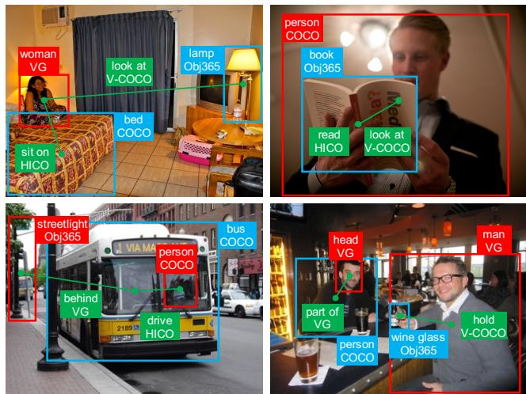
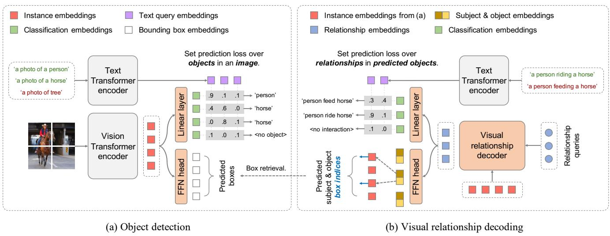
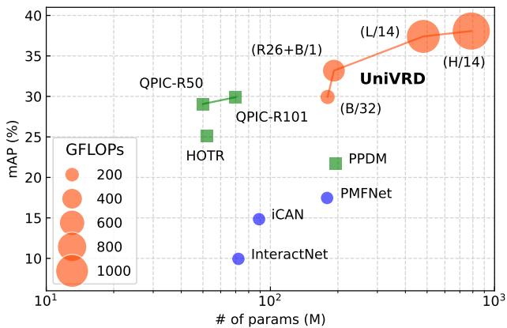
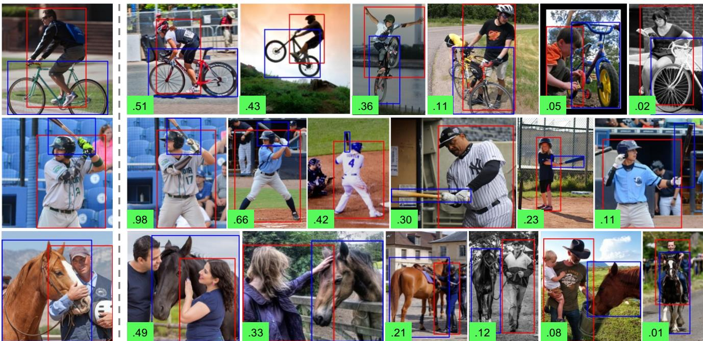

# Unified Visual Relationship Detection with Vision and Language Models

Long Zhao Liangzhe Yuan Boqing Gong Yin Cui Florian Schroff Ming-Hsuan Yang Hartwig Adam Ting Liu

Google Research {longzh,liuti}@google.com

## Abstract

This work focuses on training a single visual relationship detector predicting over the union of label spaces from multiple datasets. Merging labels spanning different datasets could be challenging due to inconsistent taxonomies. The issue is exacerbated in visual relationship detection when second-order visual semantics are introduced between pairs of objects. To address this challenge, we propose UniVRD, a novel bottom-up method for Unified Visual Relationship Detection by leveraging vision and language models (VLMs). VLMs provide well-aligned image and text embeddings, where similar relationships are optimized to be close to each other for semantic unification. Our bottom-up design enables the model to enjoy the benefit of training with both object detection and visual relationship datasets. Empirical results on both human-object interaction detection and scene-graph generation demonstrate the competitive performance of our model. UniVRD achieves 38.07 mAP on HICO-DET, outperforming the current best bottom-up HOI detector by 14.26 mAP. More importantly, we show that our unified detector performs as well as dataset-specific models in mAP, and achieves further improvements when we scale up the model. Our code will be made publicly available on GitHub1.

## 1. Introduction

Visual relationship detection (VRD) is a fundamental problem in computer vision, where visual relationships are typically defined over pairs of localized objects, connected with a predicate. Despite the availability of a diverse set of data with rich pair-wise object annotations [6, 21, 25, 32], existing VRD models, however, are typically focusing on training from a single data source. The resultant models are therefore restricted in both image domains and text vocabularies, limiting their generalization and scalability. Can we train a single visual relationship detector that unifies diverse datasets with heterogeneous label spaces?

  
Figure 1. Different VRD datasets provide different sets of unary object classes and binary relationships. We train a single visual relationship detector to unify their label spaces that generalizes across datasets. For each visual relationship, we highlight its subject in red, predicate in green, and object in blue.

Consider Figure 1, labels for objects and relations across datasets are non-disjoint and therefore could be synonymous (e.g., ‘read’ in HICO-DET [6] vs. ‘look at’ in V-COCO [21]), subsidiary (e.g., ‘person’ in COCO [43] vs. ‘woman’ / ‘man’ in Visual Genome [32]), or overlapping (e.g., ‘wine glass’ in Objects365 [59] vs. ‘glass’ in Visual Genome). Furthermore, VRD models need to infer relationships (i.e., predicates) of second-order visual semantics between objects. The combinatorial complexity elevates the challenge to a new level. Depends on context, the same object or predicate might appear in different tenses or forms (e.g., ‘man’ vs. ‘men’ or ‘wears’ vs. ‘wearing’ in Visual Genome) and their meanings may vary (e.g., ‘eating a sandwich’ vs. ‘eating (with) a fork’ in V-COCO). Therefore, manually curating a merged label space spanning different datasets for training a unified VRD model is difficult.

On the other hand, recent breakthroughs in vision and language models (VLMs) that are jointly trained on webscale image-text pairs (e.g., CLIP [54] and ALIGN [27]) provide an alternative direction to approach our challenge. Intuitively, benefiting from the large language encoders [14, 55] and contrastive image-text co-training, a pre-trained VLM should be able to encode “similar visual relationships” close to each other in the embedding space. These relationships contain similar action, subject, and object labels in semantics, e.g., “a person watching a television” vs. “a man looking at a TV”. They are commonly measured by distances between semantic words or language embeddings [48], which motivates us to use large language models for unification. Specifically, the learnt text embeddings of VLMs can be used to reconcile heterogeneous label spaces across VRD datasets of similar visual relationships, while their jointly trained image encoders ensure the alignment with the visual content.

In light of this, we propose UniVRD (Unified Visual Relationship Detection), a bottom-up framework consisting of an object detector and pair-wise relationship decoder in a cascaded manner. To fine-tune VLMs for object detection, we adopt an encoder-only architecture [50] and attach a minimal set of heads to each Transformer output token so that the learnt knowledge from the image-level pre-training can be preserved. A lightweight Transformer decoder [2] is then appended to the object detector for decoding pair-wise relationships from the predicted objects by formulating the optimization target as a set prediction problem [5]. Further, we use natural languages in place of categorical integers to define and unify the label space. Our bottom-up design and language-defined label space enable the model to enjoy various existing object detection and visual relationship detection datasets for training, yielding strong scalability and substantial performance improvements over existing bottom-up detection approaches.

We evaluate our approach on two VRD tasks: humanobject interaction (HOI) detection and scene graph generation (SGG). Crucially, we demonstrate competitive performances on both tasks — our model achieves the state of the art on HICO-DET (38.07 mAP), a substantial improvement of 14.26 mAP over the current best-performing bottom-up HOI detector. For the first time, we show that a unified model can perform as well as dataset-specific ones, and obtain notable improvements in mAP on long-tailed VRD datasets when the model is scaled up.

In summary, this paper makes the following main contributions: (1) a novel VRD framework that unifies multiple datasets which cannot be done by previous work without VLMs; (2) an effective and strong model training recipe, including improvements on models, losses, augmentations, training paradigms, etc.; (3) state-of-the-art results showing strong scalability and generalization of our model. Our design is simple, interoperable, and can easily leverage new advances in VLMs. We believe our work is first-of-its-kind that brings new insights to the community and as a flexible starting point for future research on tasks requiring visual relationship understanding.

## 2. Related Work

Visual relationship detection: Visual relationship detection/prediction (VRD) is first proposed in [48] then formulated as a dual-graph generation task called scene graph generation (SGG) by [69]. Prior methods [37, 69] refine the representations in a scene graph by a message passing mechanism. More recent works aim to eliminate data bias in SGG (i.e., unbiased/informative SGG) during the inference process by using graph semantic relationships [74], bi-level resampling strategies [37], or data augmentation [1].

Human-object interaction (HOI) detection [6], as a popular VRD task, aims to detect human-object pairs and infers their interactions. Existing HOI detectors can be summarized into two paradigms: bottom-up methods [17, 18, 19, 53, 64, 65] and single-stage methods [11, 29, 41, 60, 81, 92]. Bottom-up methods detect instances first and predict interactions based on them, while single-stage methods detect all HOI triplets directly and simultaneously in an end-toend manner. Our method uses a bottom-up design and outperforms both types of methods thanks to label unification and knowledge transferred from image-level pre-training.

Some prior works [17, 30, 46, 86] incorporate language priors [48] to VRD based on the observation that relationships are semantically related to each other in the language space. They use word embeddings [49] to cast relationships into a vector space so that similar visual relationships are close to each other. However, they are limited to a small and fixed set of semantic categories. Different from them, we use well-aligned image-text embeddings to capture semantic relationships in VRD, which are more powerful.

Unifying label spaces from multiple datasets: Training on multiple datasets is an effective way to improve model generalization. Prior works [23, 56, 71, 84, 90] focus on merging different visual semantic concepts across different label spaces for object detection or segmentation tasks. MSeg [34] manually unifies the taxonomies of different semantic segmentation datasets and utilizes Amazon Mechanical Turk to resolve inconsistent annotations. Zhou et al. [90] propose to learn a label space from visual data automatically for object detection, without requiring any manual effort. Zhao et al. [84] train a universal object detector by manually merging the taxonomies and generating crossdataset pseudo-labels. Most methods [34, 67, 84] find a performance drop when training a single unified model. Instead, we train a unified VRD model and show that it can perform as well as dataset-specific ones in mAP.

Vision and language models: Over the past several years, there are a surge of works that leverage vision and language models (VLMs) to build vision systems [27, 35, 54, 75, 80]. By using large amounts of image-text data for model training, VLMs are able to learn well-aligned image and text embeddings, yielding major improvements in open-vocabulary and zero-shot classification tasks [36, 76, 78, 83]. Some recent studies [72, 73, 76] propose to employ VLMs for VRD. They focus on designing efficient pretext tasks to capture object relationships and show promising few-shot and transfer learning ability. In contrast, we take the advantage of image-text embeddings from pre-trained VLMs [54, 80] for label space unification, which has never been explored.

## 3. Approach

The goal of VRD is to predict a set of hsubject, predicate, objecti triplets, representing the bounding box of a subject, that of an object, and multi-label relationship types, from a given image. The proposed UniVRD presents a bottom-up recipe: (1) adapting VLM for object detection by adding detection heads; (2) decoding visual relationships among the detected objects through their fine-tuned visual embeddings. Each of them is viewed as a direct set prediction problem [5]: we use Hungarian algorithm [33] to find a bipartite matching between ground-truth and prediction, and compute losses only on matched pairs. The trained model can be queried in different ways (e.g., natural languages or visual embeddings) to perform relationship detection. Our full pipeline is illustrated in Figure 2.

We consider training UniVRD on multiple datasets. After merging them, we have two label spaces: $\mathcal { C } _ { \mathrm { { o b j } } }$ for objects and $\mathcal { C } _ { \mathrm { r e l } }$ for relationships. Both of them can be ambiguous as discussed in Section 1, and we convert them to language spaces $\mathcal { C } _ { \mathrm { o b j } }  \mathcal { T } _ { \mathrm { o b j } } , \mathcal { C } _ { \mathrm { r e l } }  \mathcal { T } _ { \mathrm { r e l } }$ as shown later. We allow training with datasets containing no relationships and they downgrade to object detection datasets. Next, we describe the bottom-up recipe in the following sections.

## 3.1. Architecture

Object detector: Our model uses a standard Vision Transformer (ViT) [15] as the image encoder and a similar architecture as the text encoder, which is a common configuration in two-tower VLMs [27, 54, 80]. To adapt the image encoder for object detection, we fine-tune the model by predicting one object instance directly from each image token. We remove the pooling and final projection layers, and instead project each output token representation $( i . e .$ instance embedding2) to get the per-instance classification embedding by a linear layer. Bounding box coordinates are obtained by passing instance embeddings through a feedforward network (FFN). The final outcomes of the detector are a set of predicted bounding boxes $\begin{array} { r } { B \ = \ \{ b _ { i } \} _ { i = 1 } ^ { N } } \end{array}$ and their corresponding instance embeddings $\mathcal { Z } = \{ z _ { i } \} _ { i = 1 } ^ { N } ,$ where N is the maximum number of predicted objects and it equals to the number of tokens (i.e., sequence length) of the image encoder.

This encoder-only design resembles DETR [5], but is simplified by removing the decoder, leading to several advantages. First, it ensures that nearly all of the parameters (of both image and text encoders) can benefit from imagelevel pre-training, without the need for knowledge distillation [20] or detection-tailored pre-training [88]. Second, the fine-tuned instance embeddings can be directly utilized for visual relationship decoding without feature pooling in conventional bottom-up methods [18, 19, 53], which further reduces the model complexity.

Relationship decoder: We append a Transformer decoder to the object detector for decoding visual relationships from its output. In similar spirit to query-based models [5, 26], we learn a pre-defined number of latent input queries, $i . e . ,$ relation queries. The decoder then takes as input a set of relation queries and instance embeddings Z predicted by the object detector. These relation queries are fed to a Transformer stack that attends to the instance embeddings to produce relation embeddings $\mathcal { R } = \{ r _ { j } \} _ { j = { \frac { M } { \it \Delta \phi } } } ^ { M }$ , where M is the number of output relation embeddings from the decoder, equal to the number of learnt relation queries. Additionally, the keys and values computed from the learnt latents are concatenated to the keys and values obtained from $\mathcal { Z }$ like Perceiver Resampler [2], which has been proven more efficient than a plain Transformer decoder. We then apply one linear layer and one FFN on relation embeddings to predict per-relationship embeddings for classification and locations of subject and object boxes, respectively.

In contrast to single-stage methods [41, 60, 81], we let the model predict the indices of bounding boxes outputted by the object detector instead of box coordinates. This design avoids making redundant predictions for the same instance, which improves the model efficiency. Our model finds the indices of subject and object boxes through comparing the predicted relation embeddings $r \in \mathcal { R }$ with the instance embeddings $z \in { \mathcal { Z } }$ . To be specific, we project each relation embedding $\boldsymbol { r } _ { j }$ using a FFN into a subject embedding $f _ { \mathrm { s u b } } ( \pmb { r } _ { j } )$ and an object embedding $f _ { \mathrm { o b j } } ( \pmb { r } _ { j } )$ . The subject index $s _ { j }$ and object index $o _ { j }$ are obtained by:

$$
\begin{array} { r l } & { s _ { j } = \underset { z \in \mathcal { Z } } { \arg \operatorname* { m a x } } \left\{ \sin \big ( f _ { \mathrm { s u b } } ( r _ { j } ) , z ) \right\} , } \\ & { o _ { j } = \underset { z \in \mathcal { Z } } { \arg \operatorname* { m a x } } \left\{ \sin \big ( f _ { \mathrm { o b j } } ( r _ { j } ) , z ) \right\} , } \end{array}\tag{1}
$$

where $\sin ( \cdot , \cdot )$ measures the cosine similarity between two embeddings. We can then retrieve the corresponding subject box $b _ { s _ { j } }$ and object box $\boldsymbol { b } _ { o _ { j } }$ from B.

  
Figure 2. Overview of our method. (a) We first adapt a pre-trained vision and language model (VLM) for object detection. (b) We then append a decoder to the output instance embeddings for decoding pair-wise relationships from predicted objects. Query strings are embedded with the text encoder and used for classification in the unified language space. The pre-trained VLM encoders are marked in light gray and our attached modules are in light orange. Positive and negative text strings are highlighted in green and red, respectively.

Text embeddings for classification: We use text embeddings, rather than class integers, to classify detected objects. The text embeddings, also called text queries, are obtained by converting category names or textual object descriptions (e.g., ‘person’) to prompts (e.g., ‘a photo of a person’) [57] and passing them through the text encoder. For each object, the task of the detector then becomes to predict a bounding box and a class probability over text queries. We note that text queries can be different for each image. In effect, all images therefore have a shared discriminative label space Tobj, which is defined by a set of text strings. Note that we do not add a ‘background’ class to the label space like traditional detectors [5, 60], because this avoids imposing penalties on positive samples not exhaustively annotated, which commonly occur in merged datasets [84].

To classify detected relationships, we use text queries in a similar way as classifying objects in our object detector. The difference is that their label space $\mathcal { T } _ { \mathrm { r e l } }$ is defined by pairwise relationship triplets, rather than unary instance category names. To this end, we cast a set of relationship triplets hsubject, predicate, objecti (e.g., hperson, ride, horsei) into prompts (e.g., ‘a person riding a horse’) and feed them into the text encoder to get text queries.

## 3.2. Data Augmentation

Mosaics: We apply ‘mosaics’ image augmentation technique for training both our object detector and relationship decoder. It aims to increase the range of image scales seen by the model, which is achieved by assembling multiple images into grids of varying sizes: we randomly sample single images, 2 × 2 image grids, and 3 × 3 image grids, with probabilities of 0.4, 0.3, and 0.3, respectively. Using ‘mosaics’ image augmentation provides two major benefits to model training. First, this procedure allows us to use widely varying image scales while avoiding excessive padding and the need for variable model input size during training. Second, it effectively fuses samples from object detection and visual relationship detection datasets within a batch, when our model is trained in an end-to-end manner.

Text prompting: When generating text queries for object categories and relationship triplets, we augment the input text strings using prompt templates. To handle object categories, we use the prompt templates proposed by CLIP [54] (such as ‘a photo of a hobjecti’, where hobjecti is replaced by the category name). When training the object detector, we randomly sample from the 80 CLIP prompt templates to ensure that, within an image, every instance of a category has the same prompt, but prompt templates differ between categories and across images. This sampling technique largely reduces the number of text embeddings needed to be computed within each batch, which reduces the training time and memory cost.

We produce text queries for relationship triplets in a similar way as prompting object names. The major difference is that we use a single prompt template (i.e., ‘a hsubject hpredicatei-ing a hobjecti’, where hsubjecti and hobject are replaced by subject and object categories, respectively; hpredicatei-ing3 is the present continuous tense of the predicate) to prompt relationships. In addition, we use the word ‘and’ to represent the ‘no-interaction’ predicate category contained in some datasets (e.g., HICO-DET [6]). The same prompt template is used for inference and we do not apply prompt ensemble [50, 54], as no performance improvements are observed if CLIP-like prompt templates are employed. This is potentially because unlike object categories, each of which is usually a single word, relationship triples are combinations of subjects, predicates, and objects, which already capture rich semantic contents for the text encoder to generate meaningful language embeddings.

## 3.3. Model Training

Training strategy: Our whole network can be trained in either an end-to-end fashion or multiple stages. Empirically, we found the direct end-to-end training of the whole network from scratch does not work well, likely because of the dependency between the two modules and highly nonlinear property of the bipartite matching losses. Thus, we propose a cascade training paradigm that we found is more stable and effective in practice. Concretely, in the first stage, we initialize the object detector using images with bounding box annotations. In the second stage, we train the visual relationship decoder, where images with relationship annotations are used. Furthermore, we found whether to freeze or fine-tune the object detector in the second stage highly depends on the scale of the training data. When the training data are limited, a frozen object detector prevents overfitting; otherwise, fine-tuning it leads to notable performance improvements if more training data are available.

Loss functions: The training objective of our model is similar to DETR [5] by using the bipartite matching loss, but we adapt it for training bottom-up VRD models as follows.

To train the object detector, we use the ground-truth object category names and sampled negatives as text queries for each image. Negatives are randomly sampled categories in proportion to their frequency in the data from the unified label space, and we have at least 50 negatives per image [89]. The classification head then outputs logits over the per-image label space ${ \mathcal { T } } _ { \mathrm { { o b j } } } ^ { \prime } \subseteq { \mathcal { T } } _ { \mathrm { { o b j } } }$ defined by the text queries. To be specific, we let $f _ { \mathrm { c l s } } ( z )$ be the class embedding projected from the instance embedding z using a linear layer $f _ { \mathrm { c l s } } ,$ and $\mathbf { \Delta } _ { t _ { i } }$ be a text query from the label space $\mathcal { T } _ { \mathrm { { o b j } } } ^ { \prime }$ The classification loss can be written as:

$$
\begin{array} { c } { { \mathcal { L } _ { \mathrm { c l s } } ( z , \mathcal { T } _ { \mathrm { o b j } } ^ { \prime } ; \hat { y } ) = \mathcal { L } _ { \mathrm { C E } } ( e , \hat { y } ) } } \\ { { { \mathrm { a n d } } e = \left[ \sin ( f _ { \mathrm { c l s } } ( z ) , t _ { 1 } ) , \cdots , \sin ( f _ { \mathrm { c l s } } ( z ) , t _ { | \mathcal { T } _ { \mathrm { o b j } } ^ { \prime } | } ) \right] , } } \end{array}\tag{2}
$$

where $\hat { y }$ denotes the multi-hot ground-truth label. $\mathcal { L } _ { \mathrm { C E } }$ is the cross-entropy loss: $\begin{array} { r } { \mathcal { L } _ { \mathrm { C E } } = - \sum _ { i } \hat { y } _ { i } \log ( p _ { i } ) } \end{array}$ and $p _ { i } ~ =$ $\begin{array} { r } { \exp ( e _ { i } / \tau ) / \sum _ { i } \exp ( e _ { i } / \tau ) } \end{array}$ , where τ is a learnable temperature, and $\hat { y } _ { i }$ denotes the i-th element in $\begin{array} { r } { \hat { \pmb y } , } \end{array}$ , as $e _ { i }$ does in e. In practice, $\mathcal { L } _ { \mathrm { C E } }$ in Eq. (2) is replaced by the focal sigmoid cross-entropy loss [42, 91], since the training datasets have non-disjoint label spaces. We use the box loss $\mathcal { L } _ { \mathrm { { b o x } } } \left[ 5 \right]$ , i.e., a linear combination of the $\ell _ { 1 }$ loss and the generalized IoU loss [58], to train the box regression head $f _ { \mathrm { b o x } }$ by optimizing the difference between the predictions $\begin{array} { r } { \pmb { b } = f _ { \mathrm { b o x } } ( z ) } \end{array}$ and ground-truth box coordinates ˆb. Then the Hungarian loss for our object detector is defined as:

$$
\mathcal { L } _ { \mathrm { O D } } = \frac { 1 } { N } \sum _ { i = 1 } ^ { N } \mathcal { L } _ { \mathrm { c l s } } ( z _ { i } , \mathcal { T } _ { \mathrm { o b j } } ^ { \prime } ; \hat { y } _ { i } ) + \mathcal { L } _ { \mathrm { b o x } } ( \boldsymbol { b } _ { i } ; \hat { \boldsymbol { b } } _ { i } ) ,\tag{3}
$$

where $N$ is the number of image tokens.

We use a bipartite matching loss similar to Eq. (3) for optimizing the relationship decoder, with two major modifications. First, since the model predicts box indices rather than coordinates, the box loss ${ \mathcal L } _ { \mathrm { b o x } }$ in Eq. (3) is re-formulated into an index prediction loss $\mathcal { L } _ { \mathrm { i n d } }$ . In particular, given a ground-truth relationship containing a pair of subject and object boxes, we let their corresponding ground-truth onehot subject index sˆ and object index oˆ be the indices of their best-matching predicted boxes generated by the object detector. Let its matched relation embedding be r, we further define the index prediction loss as:

$$
\begin{array} { r } { \mathcal { L } _ { \mathrm { i n d } } ( \pmb { r } ; \hat { \pmb { s } } , \hat { \pmb { o } } ) = \mathcal { L } _ { \mathrm { c l s } } ^ { \prime } ( \pmb { r } , \pmb { \mathcal { Z } } ; \hat { \pmb { s } } ) + \mathcal { L } _ { \mathrm { c l s } } ^ { \prime } ( \pmb { r } , \pmb { \mathcal { Z } } ; \hat { \pmb { o } } ) , } \end{array}\tag{4}
$$

where $\mathcal { Z }$ denotes a set of instance embeddings calculated from the input image; $\mathcal { L } _ { \mathrm { c l s } } ^ { \prime }$ is a variant of $\mathcal { L } _ { \mathrm { c l s } }$ in Eq. (2) with $\mathcal { L } _ { \mathrm { C E } }$ replaced by the focal softmax cross-entropy loss, since both sˆ and oˆ are one-hot. Second, we replace sampled object text queries $\mathcal { T } _ { \mathrm { { o b j } } } ^ { \prime }$ by relationship text queries ${ \mathcal { T } } _ { \mathrm { r e l } } ^ { \prime } \subseteq$ $\mathcal { T } _ { \mathrm { r e l } }$ to classify visual relationships. The final Hungarian loss for visual relationship decoding can be written as:

$$
\mathcal { L } _ { \mathrm { V R D } } = \frac { 1 } { M } \sum _ { j = 1 } ^ { M } \mathcal { L } _ { \mathrm { c l s } } ( \boldsymbol { r } _ { j } , \mathcal { T } _ { \mathrm { r e l } } ^ { \prime } ; \boldsymbol { \hat { c } } _ { j } ) + \mathcal { L } _ { \mathrm { i n d } } ( \boldsymbol { r } _ { j } ; \boldsymbol { \hat { s } } _ { j } , \boldsymbol { \hat { o } } _ { j } ) ,\tag{5}
$$

where ${ \hat { \mathbf { c } } } _ { j }$ denotes the multi-hot ground-truth label for the $j -$ th predicted relationship. Note that our box index prediction loss shares a similar concept with the HO Pointers [29], but differs in the model design and loss computation.

## 3.4. Inference

Our inference pipeline assembles the outputs of the object detector and relationship decoder to form relationship triplets. Formally, given an input image, the object detector predicts a set of object boxes $\{ b _ { i } \} _ { i = 1 } ^ { N } .$ , and the relation decoder generates relation embeddings $\bar { \{ \boldsymbol { r } _ { j } \} } _ { j = 1 } ^ { M }$ together with their relevant subject indices $\{ s _ { j } \} _ { j = 1 } ^ { M }$ and object indices $\{ o _ { j } \} _ { j = 1 } ^ { M }$ . We combine them to obtain relationship triplets $\{ \langle b _ { s _ { j } } , b _ { o _ { j } } , r _ { j } \rangle \} _ { j = 1 } ^ { M }$ via box retrieval $( i . e .$ , using the box index to get the corresponding box coordinates). Then, given a text query embedding t representing a relationship string (e.g., ‘a person riding a horse’), the triplet score is computed by sim $( r _ { j } , t )$ . Among the top-K scored triplets, we perform pair-wise non-maximum suppression (PNMS) [81] within each relationship class, namely per-class PNMS, to filter out highly-overlapping results.

One-shot transfer: We note that the proposed model does not require query embeddings to be of textual origin, which means we can provide image- instead of text-derived embeddings as queries to the classification head without modifying or re-training the model. By leveraging embeddings of prototypical visual relationships as queries, our model can therefore perform image-conditioned relationship detection. This allows detection of visual relationships which might be hard to describe in text.

## 4. Experiments

The proposed method is evaluated on two popular VRD tasks: human-object interaction (HOI) detection and scene graph generation (SGG). We experiment with two configurations: training a single model with each individual VRD dataset (dataset-specific ones in Sections 4.2 and 4.3) and multiple VRD datasets (unified ones in Section 4.4). We analyze model performance and scalability under both configurations and improvements obtained by a unified model.

We note that our method is the first to use VLMs to unify multiple datasets for VRD. There are no such configurations in previous work, so making a perfectly controlled comparison on the pre-trained strategy and data is infeasible. Therefore, we perform system-level comparisons instead, where our goal is to situate our method in the context of current state-of-the-art methods.

## 4.1. Experimental Settings

Datasets: For HOI detection tasks, we conduct experiments on HICO-DET [6] and V-COCO [21]. The HICO-DET (HICO) dataset contains 37, 536 training images and 9, 515 test images, including 600 HOI triplets derived from the combinations of 117 verbs and 80 objects. We evaluate under the Default setting. V-COCO comprises 2, 533 training images, 2, 876 validation images, and 4, 946 test images. This benchmark is annotated with 24 actions and 80 objects. Note that the object classes in HICO-DET and V-COCO are identical to COCO [43].

We use Visual Genome (VG) [32] for SGG tasks. This dataset contains 108, 077 images annotated with free-form text for a wide array of objects and relationships (100, 298 object annotations and 36, 515 relation annotations). We adopt the most common data splits from [69] that remove rare categories by selecting the top-150 object categories and top-50 predicate categories by frequency. The entire dataset is then divided into training and test sets by the ratio of 7 to 3. To further improve the object detection accuracy of our model, we incorporate COCO [43] and Objects365 (O365) [59] during training.

Metrics: For both HOI detection and SGG tasks, models are required to first detect bounding boxes and then recognize object and predicate classes of a relationship. On the HICO dataset, we follow the default setting and report the mAP over three different category sets: all 600 HOI categories in HICO (Full), 138 HOI categories with fewer than 10 training instances (Rare), and 462 HOI categories with 10 or more training instances (Non-Rare). The common evaluation metric on V-COCO is role AP, which ignores object classes. We instead report mAP on V-COCO to make the evaluation protocol consistent across datasets. In addition, we report mAP for two scenarios: Scenario #1 includes cases even without any objects (for the four action categories of body motions, e.g., hperson, walki), and Scenario #2 ignores these cases. We follow the conventional mean Recall@K (K equals to 50 or 100) as the evaluation metrics [48, 69, 79] on VG and report mAP as well.

Implementation details: The proposed method is implemented using JAX [3] and the Scenic library [12]. All models are trained on TPUv3 hardware. We experiment with two VLMs: CLIP [54] and LiT [80]. We apply random crop, random horizontal flip, and mosaics as image augmentations. The number of relation queries is set to 100 and perclass PNMS threshold to 0.7. The object detector is trained following the setup in [50] using HICO, COCO, O365, and VG, except that the text encoder is frozen. The relationship decoder is optimized by the Adam optimizer [31] with a learning rate of $1 . 0 \times 1 0 ^ { - 4 }$ and 64 batch size. We use cosine learning rate decay [47] and per-example global norm gradient clipping. Please refer to the supplementary material for more details.

## 4.2. Human-Object Interaction Detection

Comparisons to the state of the art: Our framework is compared to both bottom-up and single-stage methods on HICO-DET. We do not include other studies about data augmentation [51, 85] and knowledge transfer [45, 68], which have different research targets but are complementary to our method. As illustrated in Table 1, our smallest model (ViT-B/32) matches the state-of-the-art performance, and consistent improvements can be achieved when we scale up the model. Our largest model with a ViT-H/14 backbone outperforms the previous best method by 4.32 mAP, setting the new state of the art. More importantly, compared to conventional bottom-up approaches, we improve them by 14.26 mAP, a 60% relative improvement. We hypothesize that these improvements result from (1) image-level pre-training by leveraging VLMs and (2) our bottom-up design, which makes it possible to utilize more object detection datasets. Please refer to the supplementary material for results on V-COCO, where we made similar conclusions.

Ablation study: Figure 3 studies the model scalability (including the parameter numbers and GFLOPs) for HOI detection. A remarkable improvement can be seen when the backbone is switched from ViT-B/32 to R26+B/1 (a hybrid architecture) with only a slight increase in model size and GFLOPs. Further, we can still obtain an increase of 0.7 mAP when changing ViT-L/14 to ViT-H/14 (our largest model), demonstrating the strong scalability of UniVRD.

<table><tr><td rowspan="2">Model</td><td rowspan="2">Extra-sup.</td><td colspan="3">Default (%)</td></tr><tr><td>mAPF</td><td>mAPR</td><td>mAPN</td></tr><tr><td>Single-stage methods</td><td></td><td></td><td></td><td></td></tr><tr><td>UnionDet [28]</td><td>x</td><td>17.58</td><td>11.72</td><td>19.33</td></tr><tr><td>DIRV [16]</td><td>x</td><td>21.78</td><td>16.38</td><td>23.39</td></tr><tr><td>PPDM-Hourglass [40]</td><td>x</td><td>21.94</td><td>13.97</td><td>24.32</td></tr><tr><td>HOI-Transformer [92]</td><td>x</td><td>23.46</td><td>16.91</td><td>25.41</td></tr><tr><td>GGNet [87]</td><td>x</td><td>23.47</td><td>16.48</td><td>25.60</td></tr><tr><td>HOTR [29]</td><td>x</td><td>25.10</td><td>17.34</td><td>27.42</td></tr><tr><td>QPIC [60]</td><td>x</td><td>29.07</td><td>21.85</td><td>31.23</td></tr><tr><td>CDN [81]</td><td>x</td><td>31.44</td><td>27.39</td><td>32.64</td></tr><tr><td>RLIP [76]</td><td>VG†</td><td>32.84</td><td>26.85</td><td>34.63</td></tr><tr><td>GEN-VLKT [41]</td><td>CLIP†</td><td>33.75</td><td>29.25</td><td>35.10</td></tr><tr><td>Bottom-up methods</td><td></td><td></td><td></td><td></td></tr><tr><td>InteractNet [19]</td><td>x</td><td>9.94</td><td>7.16</td><td>10.77</td></tr><tr><td>GPNN [53]</td><td>x</td><td>13.11</td><td>9.34</td><td>14.23</td></tr><tr><td>iCAN [18]</td><td>x</td><td>14.84</td><td>10.45</td><td>16.15</td></tr><tr><td>No-Frills [22]</td><td>Pose [4]</td><td>17.18</td><td>12.17</td><td>18.68</td></tr><tr><td>PMFNet [64]</td><td>Pose [43]</td><td>17.46</td><td>15.65</td><td>18.00</td></tr><tr><td>CHGNet [65]</td><td>x</td><td>17.57</td><td>16.85</td><td>17.78</td></tr><tr><td>DRG [17]</td><td>Text [49]</td><td>19.26</td><td>17.74</td><td>19.71</td></tr><tr><td>IP-Net [66]</td><td>x</td><td>19.56</td><td>12.79</td><td>21.58</td></tr><tr><td>VSGNet [63]</td><td>x</td><td>19.80</td><td>16.05</td><td>20.91</td></tr><tr><td>FCMNet [46]</td><td>Text [49]</td><td>20.41</td><td>17.34</td><td>21.56</td></tr><tr><td>ACP [30]</td><td>Text [49]</td><td>20.59</td><td>15.92</td><td>21.98</td></tr><tr><td>PD-Net [86]</td><td>Text [49]</td><td>20.81</td><td>15.90</td><td>22.28</td></tr><tr><td>DJ-RN [38]</td><td>Pose [4, 52]</td><td>21.34</td><td>18.53</td><td>22.18</td></tr><tr><td>IDN [39]</td><td>x</td><td>23.36</td><td>22.47</td><td>23.63</td></tr><tr><td>ATL [24]</td><td>x</td><td>23.81</td><td>17.43</td><td>25.72</td></tr><tr><td>UniVRD (CLIP: ViT-B/32)</td><td>CLIP†</td><td>29.93</td><td>22.94</td><td>32.02</td></tr><tr><td>UniVRD (CLIP: ViT-B/16)</td><td>CLIP†</td><td>31.88</td><td>23.04</td><td>34.52</td></tr><tr><td>UniVRD (CLIP: ViT-L/14)</td><td>CLIP†</td><td>37.41</td><td>28.90</td><td>39.95</td></tr><tr><td>UniVRD (LiT: ViT-B/32)</td><td>LiT†</td><td>29.38</td><td>23.64</td><td>31.09</td></tr><tr><td>UniVRD (LiT: R26+B/1)</td><td>LiT†</td><td>33.18</td><td>24.78</td><td>35.69</td></tr><tr><td>UniVRD (LiT: ViT-H/14)</td><td>LiT†</td><td>38.07</td><td>31.65</td><td>39.99</td></tr></table>

Table 1. System-level comparison on the HICO-DET test set. We report the Mean Average Precision (mAP) under the Default setting [6] containing the Full (F), Rare (R), and Non-Rare (N) sets. † denotes training supervisions obtained from the model pretraining stage. Best performances are highlighted in bold.

We provide a detailed ablation study on our method in Table 2, which identifies important factors affecting the performance. Especially from $( l ) – ( 6 )$ , we show how different text prompting and image augmentation techniques influence the model performance. From $( 7 ) - ( 9 )$ , we find using a cascade training paradigm substantially boosts the results, while freezing the object detector and text encoder avoids overfitting. This is because accurate object locations and well-aligned image-text embeddings can stabilize decoder optimization. However, allowing fine-tuning these modules leads to performance boosts when we train unified models due to the availability of more training data (see the supplementary material for more details). Additionally, we can see from (10)-(11) that performing per-class PNMS also leads to a favorable performance gain than vanilla PNMS [81]. To further show whether incorporating diverse object detection datasets can benefit HOI detection, we experiment with training our model by removing one object detection dataset each time in (12)-(14). Unsurprisingly, we observe notable performance drops, suggesting the importance of training with diverse object detection datasets.

  
Figure 3. Model scale vs. performance analysis for HOI detection on the HICO-DET test set. All circles stand for bottom-up methods. One-stage approaches are marked in green squares. Orange circles represent our models with different backbones and their marker sizes stand for GFLOPs (see the legend).

<table><tr><td>Ablation</td><td>mAPF</td></tr><tr><td>Full approach</td><td>29.93</td></tr><tr><td>Data augmentation (1) w/o CLIP prompts for the object detector (2) Use CLIP prompts for VRD (at training/inference)</td><td>-1.85 0.00</td></tr><tr><td>(3) Use CLIP prompt ensemble for VRD (at inference) (4) Use no random crop (5) Use no random horizontal flip (6) Use no mosaics augmentation</td><td>0.01 -1.33 -1.20 -1.76</td></tr><tr><td>Training and inference strategy (7) Use one-stage training schedule (8) Fine-tune the object detector in the second stage</td><td>-5.05 -1.03</td></tr><tr><td>(9) Fine-tune the text encoder in the second stage (10) Use no PNMS at all (at inference) (11) Use vanilla PNMS [81] (at inference)</td><td>-0.92 -2.01 -1.24</td></tr><tr><td>Object detection datasets (12) w/o Objects365 [59] for object detection (13) w/o COCO [43] for object detection</td><td>-3.96 -2.67</td></tr></table>

Table 2. Ablation study of the main methodological improvements. For simplicity, difference in mAP to the full approach is shown. All ablations are carried out for the UniVRD (CLIP) model with the ViT-B/32 backbone on the HICO-DET dataset.

<table><tr><td>Model</td><td>mR@50</td><td>mR@100</td></tr><tr><td>Specific methods</td><td></td><td></td></tr><tr><td>KERN [8]</td><td>6.4</td><td>7.3</td></tr><tr><td>GBNet [77]</td><td>7.1</td><td>8.5</td></tr><tr><td>PCPL [70]</td><td>9.5</td><td>11.7</td></tr><tr><td>BGNN [37]</td><td>10.7</td><td>12.6</td></tr><tr><td>DT2-ACBS [13]</td><td>22.0</td><td>24.4</td></tr><tr><td>General methods</td><td></td><td></td></tr><tr><td>GPS-Net [44]</td><td>5.9</td><td>7.1</td></tr><tr><td>GPS-Net [44] w/ Resampling [37]</td><td>7.4</td><td>9.5</td></tr><tr><td>GPS-Net [44] w/ IETrans + Rwt [82]</td><td>16.2</td><td>18.8</td></tr><tr><td>Motif [79]</td><td>6.7</td><td>7.7</td></tr><tr><td>Motif [79] w/ TDE [61]</td><td>8.2</td><td>9.8</td></tr><tr><td>Motif [79] w/ CogTree [74]</td><td>10.4</td><td>11.8</td></tr><tr><td>Motif [79] w/ DLFE [10]</td><td>11.7</td><td>13.8</td></tr><tr><td>Motif [79] w/ IETrans + Rwt [82]</td><td>15.5</td><td>18.0</td></tr><tr><td>VCTree [62]</td><td>6.7</td><td>8.0</td></tr><tr><td>VCTree [62] w/ TDE [61]</td><td>9.3</td><td>11.1</td></tr><tr><td>VCTree [62] w/ CogTree [74]</td><td>10.4</td><td>12.1</td></tr><tr><td>VCTree [62] w/ DLFE [10]</td><td>11.8</td><td>13.8</td></tr><tr><td>VCTree [62] w/ IETrans + Rwt [82]</td><td>12.0</td><td>14.9</td></tr><tr><td>SG-Transformer [74]</td><td>7.7</td><td>9.0</td></tr><tr><td>SG-Transformer [74] w/ CogTree [74]</td><td>11.1</td><td>12.7</td></tr><tr><td>SG-Transformer [74] w/ IETrans + Rwt [82]</td><td>16.2</td><td>18.8</td></tr><tr><td>AS-Net† [7]</td><td>6.1</td><td>7.2</td></tr><tr><td>HOTR† [29]</td><td>9.4</td><td>12.0</td></tr><tr><td>UniVRD (CLIP: ViT-B/32)</td><td>9.6</td><td>12.1</td></tr><tr><td>UniVRD (CLIP: ViT-B/16)</td><td>10.9</td><td>13.2</td></tr><tr><td>UniVRD (CLIP: ViT-L/14)</td><td>12.6</td><td>14.5</td></tr></table>

Table 3. Performance on the Visual Genome test set. We adopt the metric mean Recall@K (mR@K). † denotes methods designed for HOI detection and the results are reproduced with their open-source code. Best performances are highlighted in bold.

## 4.3. Scene Graph Generation

We categorize the SGG approaches into two categories: (1) general models [44, 62, 74, 79] referring to methods that can be equipped with model-agnostic baselines [10, 37, 61, 74, 82] in a plug-and-play manner; (2) specific models [8, 13, 37, 70, 77] indicating dedicated designed models with strong performance. Table 3 shows that our model achieves competitive performance compared with the state of the art. To see how models transfer between HOI detection and SGG, we also report the results of two HOI detectors [7, 29] on VG. We find that our model still outperforms them by a large margin. Note that the training data of SGG are highly biased and contain more noisy annotations than HOI detection, which make it hard for a model to achieve strong results without specific designs. Our model can be directly integrated with model-agnostic baselines (colored in gray) to further boost the results, since our design makes no specific assumptions on the targeted VRD tasks. We also note that DT2-ACBS [13] achieves the best performance among specific methods, since it proposed specific architectures and sampling strategies to handle the long-tailed issue in VG, which is orthogonal to our method.

## 4.4. Towards Unified VRD Models

One major advantage brought by unifying label spaces is the capability of training models over a pool of various datasets, but prior studies [34, 67] observe performance drops in single unified models. We next quantitatively compare our unified model with dataset-specific ones to see performance changes, especially, when models are scaled up.

We report the results of our model at different scales in Table 4, where we make three important observations. First, both $\mathrm { m A P } _ { \mathrm { S } \# 1 }$ and $\mathrm { m A P } _ { \mathrm { S } \# 2 }$ on V-COCO are significantly improved (with more than 5.5 mAP on average) by our unified models, because the training set is extremely small in V-COCO (around 5, 000 images). This improvements verify the effectiveness of our unified training schema: training models with other datasets simultaneously reduces overfitting and encourages models to transfer learnt knowledge to small-scale datasets like V-COCO. Second, our unified models perform as well as their dataset-specific counterparts in mAP on HICO-DET and VG. Notably, the improvements further increase on HICO-DET along with the growth of model sizes, suggesting the necessity for scaling up to large models when we train unified detectors across multiple datasets. Third, all unified models have slight performance drops in recalls on the VG dataset. This is potentially because training on more HOI datasets (i.e., HICO-DET and V-COCO) yields higher accuracy in the HOI domain, but loses ground on non-HOI relationships in VG.

Image-based relation retrieval: Our model can perform image-conditioned detection by simply replacing text query embeddings with image-derived ones. Here we show visual illustrations for this use case. To get the image query embedding, we first run inference on the query image and select the top-1 prediction. We then use its image embedding as query on the test images. Figure 4 visually shows examples of image-conditioned relationship retrievals for the given image queries ranked by similarity scores. By using image query embeddings, our model enables retrieval of relationships which would be hard to describe in text.

Limitations: Our algorithm currently does not specially handle extremely biased or long-tailed relationship categories, which may widely exist in the wild. Using auxiliary priors from data (through transferring [82] or resampling [37]) may further improve the performance on SGG datasets (e.g., VG). Our formulation currently does not explicitly formulate relationship hierarchies, where both objects and predicates are reasoned at a single shot. We leave incorporating more powerful VQA-VLMs (e.g., PaLI [9]) to model such hierarchies as exciting future work.

## 5. Conclusion

We presented a bottom-up recipe for training a single unified visual relationship detection (VRD) model across multiple datasets based on vision and language models. Our resulting detector shows competitive performances under both dataset-specific and unified configurations on two VRD tasks: human-object interaction detection and scene graph generation. For the first time, we show scaling up to large models can benefit unified models on VRD tasks. We hope our model serves as a strong baseline approach towards general VRD systems.

<table><tr><td colspan="3"></td><td colspan="3">HICO-DET</td><td colspan="2">V-COCO</td><td colspan="3">Visual Genome</td></tr><tr><td>Model</td><td>Backbone</td><td>GFLOPs</td><td> $\mathrm { { \ m A P _ { F } } }$ </td><td> $\mathrm { m A P _ { R } }$ </td><td> $\mathrm { m A P _ { N } }$ </td><td> $\mathrm { m A P } _ { \mathrm { S } \# 1 }$ </td><td> $\mathrm { m A P } _ { \mathrm { S } \# 2 }$ </td><td>mR@50</td><td>mR@100</td><td>mAP</td></tr><tr><td>UniVRD (CLIP)</td><td>ViT-B/32</td><td>185</td><td> $2 9 . 4 7 _ { \downarrow 0 . 4 6 }$ </td><td> $2 2 . 9 3 _ { \downarrow 0 . 0 1 }$ </td><td> $3 1 . 4 2 _ { \downarrow 0 . 6 0 }$ </td><td> $3 9 . 4 8 _ { \uparrow 5 . 2 1 }$ </td><td> $4 0 . 8 1 _ { \uparrow 5 . 7 3 }$ </td><td> $9 . 6 1 _ { \downarrow 0 . 0 1 }$ </td><td> $1 2 . 0 4 _ { \downarrow , 0 . 0 8 }$ </td><td> $\mathbf { 8 . 6 4 _ { \uparrow 0 . 1 6 } }$ </td></tr><tr><td>UniVRD (CLIP)</td><td>ViT-B/16</td><td>436</td><td> $\mathbf { 3 2 . 8 0 _ { \uparrow 0 . 9 2 } }$  </td><td> $2 4 . 6 4 _ { \uparrow { \bf 1 . 6 0 } }$  </td><td> $3 5 . 2 4 _ { \uparrow 0 . 7 2 }$  </td><td> $4 1 . 5 7 _ { \uparrow 5 . 3 2 }$  </td><td> $4 3 . 3 9 _ { \uparrow 6 . 4 9 }$ </td><td> $1 0 . 5 8 _ { \downarrow 0 . 3 2 }$ </td><td> $1 2 . 7 7 _ { \downarrow 0 . 4 7 }$ </td><td> $8 . 2 1 _ { \downarrow 0 . 7 6 }$ </td></tr><tr><td>UniVRD (CLIP)</td><td>ViT-L/14</td><td>992</td><td> $\mathbf { 3 8 . 6 1 } _ { \uparrow \mathbf { 1 . 2 0 } }$ </td><td> $3 3 . 3 9 _ { \uparrow 4 . 4 9 }$ </td><td> $4 0 . 1 6 _ { \uparrow { \bf 0 } . { \bf 2 1 } }$ </td><td> $4 5 . 1 9 _ { \uparrow 5 . 3 9 }$ </td><td> $4 6 . 5 2 _ { \uparrow 6 . 3 0 }$ </td><td> $1 2 . 5 5 _ { \downarrow 0 . 0 8 }$ </td><td> $1 4 . 4 8 _ { \downarrow 0 . 1 0 }$ </td><td> $9 . 8 5 _ { \downarrow 0 . 1 2 }$ </td></tr></table>

Table 4. Performance of our unified detectors (trained with HICO-DET, V-COCO, and VG) at different scales on multiple datasets. We also report the performance differences (↑ improvement and ↓ drop) compared with their dataset-specific counterparts.

  
Figure 4. Visual examples of image-conditioned relationship retrievals using relation embeddings. The leftmost images show the queries, and corresponding retrievals from the HICO-DET test set based on their relation embeddings are shown on the right. We mark subjects in red, objects in blue, and similarity scores in green boxes.

## References

[1] Sherif Abdelkarim, Aniket Agarwal, Panos Achlioptas, Jun Chen, Jiaji Huang, Boyang Li, Kenneth Church, and Mohamed Elhoseiny. Exploring long tail visual relationship recognition with large vocabulary. In ICCV, 2021.

[2] Jean-Baptiste Alayrac, Jeff Donahue, Pauline Luc, Antoine Miech, Iain Barr, Yana Hasson, Karel Lenc, Arthur Mensch, Katherine Millican, Malcolm Reynolds, Roman Ring, Eliza Rutherford, Serkan Cabi, Tengda Han, Zhitao Gong, Sina Samangooei, Marianne Monteiro, Jacob Menick, Sebastian Borgeaud, Andrew Brock, Aida Nematzadeh, Sa-

hand Sharifzadeh, Mikolaj Binkowski, Ricardo Barreira, Oriol Vinyals, Andrew Zisserman, and Karen Simonyan. Flamingo: A visual language model for few-shot learning. In NeurIPS, 2022.

[3] James Bradbury, Roy Frostig, Peter Hawkins, Matthew James Johnson, Chris Leary, Dougal Maclaurin, George Necula, Adam Paszke, Jake VanderPlas, Skye Wanderman-Milne, and Qiao Zhang. JAX: Composable transformations of Python+NumPy programs, 2018.

[4] Zhe Cao, Tomas Simon, Shih-En Wei, and Yaser Sheikh. Realtime multi-person 2D pose estimation using part affinity fields. In CVPR, 2017.

[5] Nicolas Carion, Francisco Massa, Gabriel Synnaeve, Nicolas Usunier, Alexander Kirillov, and Sergey Zagoruyko. End-toend object detection with transformers. In ECCV, 2020.

[6] Yu-Wei Chao, Yunfan Liu, Xieyang Liu, Huayi Zeng, and Jia Deng. Learning to detect human-object interactions. In WACV, 2018.

[7] Mingfei Chen, Yue Liao, Si Liu, Zhiyuan Chen, Fei Wang, and Chen Qian. Reformulating HOI detection as adaptive set prediction. In CVPR, 2021.

[8] Tianshui Chen, Weihao Yu, Riquan Chen, and Liang Lin. Knowledge-embedded routing network for scene graph generation. In CVPR, 2019.

[9] Xi Chen, Xiao Wang, Soravit Changpinyo, AJ Piergiovanni, Piotr Padlewski, Daniel Salz, Sebastian Goodman, Adam Grycner, Basil Mustafa, Lucas Beyer, Alexander Kolesnikov, Joan Puigcerver, Nan Ding, Keran Rong, Hassan Akbari, Gaurav Mishra, Linting Xue, Ashish Thapliyal, James Bradbury, Weicheng Kuo, Mojtaba Seyedhosseini, Chao Jia, Burcu Karagol Ayan, Carlos Riquelme, Andreas Steiner, Anelia Angelova, Xiaohua Zhai, Neil Houlsby, and Radu Soricut. PaLI: A jointly-scaled multilingual language-image model. In ICLR, 2023.

[10] Meng-Jiun Chiou, Henghui Ding, Hanshu Yan, Changhu Wang, Roger Zimmermann, and Jiashi Feng. Recovering the unbiased scene graphs from the biased ones. In ACM MM, 2021.

[11] Yuren Cong, Michael Ying Yang, and Bodo Rosenhahn. RelTR: Relation transformer for scene graph generation. IEEE TPAMI, 2023.

[12] Mostafa Dehghani, Alexey Gritsenko, Anurag Arnab, Matthias Minderer, and Yi Tay. SCENIC: A JAX library for computer vision research and beyond. In CVPR, 2022.

[13] Alakh Desai, Tz-Ying Wu, Subarna Tripathi, and Nuno Vasconcelos. Learning of visual relations: The devil is in the tails. In ICCV, 2021.

[14] Jacob Devlin, Ming-Wei Chang, Kenton Lee, and Kristina Toutanova. BERT: Pre-training of deep bidirectional transformers for language understanding. In NAACL-HLT, 2019.

[15] Alexey Dosovitskiy, Lucas Beyer, Alexander Kolesnikov, Dirk Weissenborn, Xiaohua Zhai, Thomas Unterthiner, Mostafa Dehghani, Matthias Minderer, Georg Heigold, Sylvain Gelly, Jakob Uszkoreit, and Neil Houlsby. An image is worth 16x16 words: Transformers for image recognition at scale. In ICLR, 2021.

[16] Hao-Shu Fang, Yichen Xie, Dian Shao, and Cewu Lu. DIRV: Dense interaction region voting for end-to-end human-object interaction detection. In AAAI, 2021.

[17] Chen Gao, Jiarui Xu, Yuliang Zou, and Jia-Bin Huang. DRG: Dual relation graph for human-object interaction detection. In ECCV, 2020.

[18] Chen Gao, Yuliang Zou, and Jia-Bin Huang. iCAN: Instance-centric attention network for human-object interaction detection. In BMVC, 2018.

[19] Georgia Gkioxari, Ross Girshick, Piotr Dollar, and Kaiming´ He. Detecting and recognizing human-object interactions. In CVPR, 2018.

[20] Xiuye Gu, Tsung-Yi Lin, Weicheng Kuo, and Yin Cui. Open-vocabulary object detection via vision and language knowledge distillation. In ICLR, 2022.

[21] Saurabh Gupta and Jitendra Malik. Visual semantic role labeling. arXiv preprint arXiv:1505.04474, 2015.

[22] Tanmay Gupta, Alexander Schwing, and Derek Hoiem. Nofrills human-object interaction detection: Factorization, layout encodings, and training techniques. In ICCV, 2019.

[23] Irtiza Hasan, Shengcai Liao, Jinpeng Li, Saad Ullah Akram, and Ling Shao. Generalizable pedestrian detection: The elephant in the room. In CVPR, 2021.

[24] Zhi Hou, Baosheng Yu, Yu Qiao, Xiaojiang Peng, and Dacheng Tao. Affordance transfer learning for human-object interaction detection. In CVPR, 2021.

[25] Drew A Hudson and Christopher D Manning. GQA: A new dataset for real-world visual reasoning and compositional question answering. In CVPR, 2019.

[26] Andrew Jaegle, Felix Gimeno, Andy Brock, Oriol Vinyals, Andrew Zisserman, and Joao Carreira. Perceiver: General perception with iterative attention. In ICML, 2021.

[27] Chao Jia, Yinfei Yang, Ye Xia, Yi-Ting Chen, Zarana Parekh, Hieu Pham, Quoc Le, Yun-Hsuan Sung, Zhen Li, and Tom Duerig. Scaling up visual and vision-language representation learning with noisy text supervision. In ICML, 2021.

[28] Bumsoo Kim, Taeho Choi, Jaewoo Kang, and Hyunwoo J Kim. UnionDet: Union-level detector towards real-time human-object interaction detection. In ECCV, 2020.

[29] Bumsoo Kim, Junhyun Lee, Jaewoo Kang, Eun-Sol Kim, and Hyunwoo J Kim. HOTR: End-to-end human-object interaction detection with transformers. In CVPR, 2021.

[30] Dong-Jin Kim, Xiao Sun, Jinsoo Choi, Stephen Lin, and In So Kweon. Detecting human-object interactions with action co-occurrence priors. In ECCV, 2020.

[31] Diederik P Kingma and Jimmy Ba. Adam: A method for stochastic optimization. In ICLR, 2015.

[32] Ranjay Krishna, Yuke Zhu, Oliver Groth, Justin Johnson, Kenji Hata, Joshua Kravitz, Stephanie Chen, Yannis Kalantidis, Li-Jia Li, David A Shamma, Michael S Bernstein, and Li Fei-Fei. Visual genome: Connecting language and vision using crowdsourced dense image annotations. IJCV, 2017.

[33] Harold W Kuhn. The Hungarian method for the assignment problem. Naval research logistics quarterly, 1955.

[34] John Lambert, Zhuang Liu, Ozan Sener, James Hays, and Vladlen Koltun. MSeg: A composite dataset for multidomain semantic segmentation. In CVPR, 2020.

[35] Junnan Li, Ramprasaath Selvaraju, Akhilesh Gotmare, Shafiq Joty, Caiming Xiong, and Steven Chu Hong Hoi. Align before fuse: Vision and language representation learning with momentum distillation. In NeurIPS, 2021.

[36] Liunian Harold Li, Pengchuan Zhang, Haotian Zhang, Jianwei Yang, Chunyuan Li, Yiwu Zhong, Lijuan Wang, Lu Yuan, Lei Zhang, Jenq-Neng Hwang, Kai-Wei Chang, and Jianfeng Gao. Grounded language-image pre-training. In CVPR, 2022.

[37] Rongjie Li, Songyang Zhang, Bo Wan, and Xuming He. Bipartite graph network with adaptive message passing for unbiased scene graph generation. In CVPR, 2021.

[38] Yong-Lu Li, Xinpeng Liu, Han Lu, Shiyi Wang, Junqi Liu, Jiefeng Li, and Cewu Lu. Detailed 2D-3D joint representation for human-object interaction. In CVPR, 2020.

[39] Yong-Lu Li, Xinpeng Liu, Xiaoqian Wu, Yizhuo Li, and Cewu Lu. HOI analysis: Integrating and decomposing human-object interaction. In NeurIPS, 2020.

[40] Yue Liao, Si Liu, Fei Wang, Yanjie Chen, Chen Qian, and Jiashi Feng. PPDM: Parallel point detection and matching for real-time human-object interaction detection. In CVPR, 2020.

[41] Yue Liao, Aixi Zhang, Miao Lu, Yongliang Wang, Xiaobo Li, and Si Liu. GEN-VLKT: Simplify association and enhance interaction understanding for HOI detection. In CVPR, 2022.

[42] Tsung-Yi Lin, Priya Goyal, Ross Girshick, Kaiming He, and Piotr Dollar. Focal loss for dense object detection. In ´ ICCV, 2017.

[43] Tsung-Yi Lin, Michael Maire, Serge Belongie, James Hays, Pietro Perona, Deva Ramanan, Piotr Dollar, and C Lawrence´ Zitnick. Microsoft COCO: Common objects in context. In ECCV, 2014.

[44] Xin Lin, Changxing Ding, Jinquan Zeng, and Dacheng Tao. GPS-Net: Graph property sensing network for scene graph generation. In CVPR, 2020.

[45] Xinpeng Liu, Yong-Lu Li, Xiaoqian Wu, Yu-Wing Tai, Cewu Lu, and Chi-Keung Tang. Interactiveness field in humanobject interactions. In CVPR, 2022.

[46] Yang Liu, Qingchao Chen, and Andrew Zisserman. Amplifying key cues for human-object-interaction detection. In ECCV, 2020.

[47] Ilya Loshchilov and Frank Hutter. SGDR: Stochastic gradient descent with warm restarts. In ICLR, 2017.

[48] Cewu Lu, Ranjay Krishna, Michael Bernstein, and Li Fei-Fei. Visual relationship detection with language priors. In ECCV, 2016.

[49] Tomas Mikolov, Kai Chen, Greg Corrado, and Jeffrey Dean. Efficient estimation of word representations in vector space. arXiv preprint arXiv:1301.3781, 2013.

[50] Matthias Minderer, Alexey Gritsenko, Austin Stone, Maxim Neumann, Dirk Weissenborn, Alexey Dosovitskiy, Aravindh Mahendran, Anurag Arnab, Mostafa Dehghani, Zhuoran Shen, Xiao Wang, Xiaohua Zhai, Thomas Kipf, and Neil Houlsby. Simple open-vocabulary object detection with vision transformers. In ECCV, 2022.

[51] Jihwan Park, SeungJun Lee, Hwan Heo, Hyeong Kyu Choi, and Hyunwoo J Kim. Consistency learning via decoding path augmentation for transformers in human object interaction detection. In CVPR, 2022.

[52] Georgios Pavlakos, Vasileios Choutas, Nima Ghorbani, Timo Bolkart, Ahmed AA Osman, Dimitrios Tzionas, and Michael J Black. Expressive body capture: 3D hands, face, and body from a single image. In CVPR, 2019.

[53] Siyuan Qi, Wenguan Wang, Baoxiong Jia, Jianbing Shen, and Song-Chun Zhu. Learning human-object interactions by graph parsing neural networks. In ECCV, 2018.

[54] Alec Radford, Jong Wook Kim, Chris Hallacy, Aditya Ramesh, Gabriel Goh, Sandhini Agarwal, Girish Sastry, Amanda Askell, Pamela Mishkin, Jack Clark, Gretchen Krueger, and Ilya Sutskever. Learning transferable visual models from natural language supervision. In ICML, 2021.

[55] Colin Raffel, Noam Shazeer, Adam Roberts, Katherine Lee, Sharan Narang, Michael Matena, Yanqi Zhou, Wei Li, and Peter J. Liu. Exploring the limits of transfer learning with a unified text-to-text transformer. JMLR, 2020.

[56] Rene Ranftl, Katrin Lasinger, David Hafner, Konrad´ Schindler, and Vladlen Koltun. Towards robust monocular depth estimation: Mixing datasets for zero-shot cross-dataset transfer. IEEE TPAMI, 2020.

[57] Yongming Rao, Wenliang Zhao, Guangyi Chen, Yansong Tang, Zheng Zhu, Guan Huang, Jie Zhou, and Jiwen Lu. DenseCLIP: Language-guided dense prediction with context-aware prompting. In CVPR, 2022.

[58] Hamid Rezatofighi, Nathan Tsoi, JunYoung Gwak, Amir Sadeghian, Ian Reid, and Silvio Savarese. Generalized intersection over union: A metric and a loss for bounding box regression. In CVPR, 2019.

[59] Shuai Shao, Zeming Li, Tianyuan Zhang, Chao Peng, Gang Yu, Xiangyu Zhang, Jing Li, and Jian Sun. Objects365: A large-scale, high-quality dataset for object detection. In ICCV, 2019.

[60] Masato Tamura, Hiroki Ohashi, and Tomoaki Yoshinaga. QPIC: Query-based pairwise human-object interaction detection with image-wide contextual information. In CVPR, 2021.

[61] Kaihua Tang, Yulei Niu, Jianqiang Huang, Jiaxin Shi, and Hanwang Zhang. Unbiased scene graph generation from biased training. In CVPR, 2020.

[62] Kaihua Tang, Hanwang Zhang, Baoyuan Wu, Wenhan Luo, and Wei Liu. Learning to compose dynamic tree structures for visual contexts. In CVPR, 2019.

[63] Oytun Ulutan, ASM Iftekhar, and Bangalore S Manjunath. VSGNet: Spatial attention network for detecting human object interactions using graph convolutions. In CVPR, 2020.

[64] Bo Wan, Desen Zhou, Yongfei Liu, Rongjie Li, and Xuming He. Pose-aware multi-level feature network for human object interaction detection. In ICCV, 2019.

[65] Hai Wang, Wei-shi Zheng, and Ling Yingbiao. Contextual heterogeneous graph network for human-object interaction detection. In ECCV, 2020.

[66] Tiancai Wang, Tong Yang, Martin Danelljan, Fahad Shahbaz Khan, Xiangyu Zhang, and Jian Sun. Learning human-object interaction detection using interaction points. In CVPR, 2020.

[67] Xudong Wang, Zhaowei Cai, Dashan Gao, and Nuno Vasconcelos. Towards universal object detection by domain attention. In CVPR, 2019.

[68] Xiaoqian Wu, Yong-Lu Li, Xinpeng Liu, Junyi Zhang, Yuzhe Wu, and Cewu Lu. Mining cross-person cues for body-part interactiveness learning in HOI detection. In ECCV, 2022.

[69] Danfei Xu, Yuke Zhu, Christopher B Choy, and Li Fei-Fei. Scene graph generation by iterative message passing. In CVPR, 2017.

[70] Shaotian Yan, Chen Shen, Zhongming Jin, Jianqiang Huang, Rongxin Jiang, Yaowu Chen, and Xian-Sheng Hua. PCPL: Predicate-correlation perception learning for unbiased scene graph generation. In ACM MM, 2020.

[71] Gengshan Yang, Joshua Manela, Michael Happold, and Deva Ramanan. Hierarchical deep stereo matching on highresolution images. In CVPR, 2019.

[72] Yuan Yao, Qianyu Chen, Ao Zhang, Wei Ji, Zhiyuan Liu, Tat-Seng Chua, and Maosong Sun. PEVL: Positionenhanced pre-training and prompt tuning for vision-language models. In EMNLP, 2022.

[73] Yuan Yao, Ao Zhang, Zhengyan Zhang, Zhiyuan Liu, Tat-Seng Chua, and Maosong Sun. CPT: Colorful prompt tun-

ing for pre-trained vision-language models. arXiv preprint arXiv:2109.11797, 2021.

[74] Jing Yu, Yuan Chai, Yujing Wang, Yue Hu, and Qi Wu. CogTree: Cognition tree loss for unbiased scene graph generation. In IJCAI, 2021.

[75] Jiahui Yu, Zirui Wang, Vijay Vasudevan, Legg Yeung, Mojtaba Seyedhosseini, and Yonghui Wu. CoCa: Contrastive captioners are image-text foundation models. TMLR, 2022.

[76] Hangjie Yuan, Jianwen Jiang, Samuel Albanie, Tao Feng, Ziyuan Huang, Dong Ni, and Mingqian Tang. RLIP: Relational language-image pre-training for human-object interaction detection. In NeurIPS, 2022.

[77] Alireza Zareian, Svebor Karaman, and Shih-Fu Chang. Bridging knowledge graphs to generate scene graphs. In ECCV, 2020.

[78] Alireza Zareian, Kevin Dela Rosa, Derek Hao Hu, and Shih-Fu Chang. Open-vocabulary object detection using captions. In CVPR, 2021.

[79] Rowan Zellers, Mark Yatskar, Sam Thomson, and Yejin Choi. Neural motifs: Scene graph parsing with global context. In CVPR, 2018.

[80] Xiaohua Zhai, Xiao Wang, Basil Mustafa, Andreas Steiner, Daniel Keysers, Alexander Kolesnikov, and Lucas Beyer. LiT: Zero-shot transfer with locked-image text tuning. In CVPR, 2022.

[81] Aixi Zhang, Yue Liao, Si Liu, Miao Lu, Yongliang Wang, Chen Gao, and Xiaobo Li. Mining the benefits of two-stage and one-stage HOI detection. In NeurIPS, 2021.

[82] Ao Zhang, Yuan Yao, Qianyu Chen, Wei Ji, Zhiyuan Liu, Maosong Sun, and Tat-Seng Chua. Fine-grained scene graph generation with data transfer. In ECCV, 2022.

[83] Shiyu Zhao, Zhixing Zhang, Samuel Schulter, Long Zhao, Vijay Kumar B.G, Anastasis Stathopoulos, Manmohan Chandraker, and Dimitris Metaxas. Exploiting unlabeled data with vision and language models for object detection. In ECCV, 2022.

[84] Xiangyun Zhao, Samuel Schulter, Gaurav Sharma, Yi-Hsuan Tsai, Manmohan Chandraker, and Ying Wu. Object detection with a unified label space from multiple datasets. In ECCV, 2020.

[85] Xubin Zhong, Changxing Ding, Zijian Li, and Shaoli Huang. Towards hard-positive query mining for DETRbased human-object interaction detection. In ECCV, 2022.

[86] Xubin Zhong, Changxing Ding, Xian Qu, and Dacheng Tao. Polysemy deciphering network for human-object interaction detection. In ECCV, 2020.

[87] Xubin Zhong, Xian Qu, Changxing Ding, and Dacheng Tao. Glance and gaze: Inferring action-aware points for one-stage human-object interaction detection. In CVPR, 2021.

[88] Yiwu Zhong, Jianwei Yang, Pengchuan Zhang, Chunyuan Li, Noel Codella, Liunian Harold Li, Luowei Zhou, Xiyang Dai, Lu Yuan, Yin Li, and Jianfeng Gao. RegionCLIP: Region-based language-image pretraining. In CVPR, 2022.

[89] Xingyi Zhou, Vladlen Koltun, and Philipp Krahenb¨ uhl.¨ Probabilistic two-stage detection. arXiv preprint arXiv:2103.07461, 2021.

[90] Xingyi Zhou, Vladlen Koltun, and Philipp Krahenb ¨ uhl. Sim-¨ ple multi-dataset detection. In CVPR, 2022.

[91] Xizhou Zhu, Weijie Su, Lewei Lu, Bin Li, Xiaogang Wang, and Jifeng Dai. Deformable DETR: Deformable transformers for end-to-end object detection. In ICLR, 2021.

[92] Cheng Zou, Bohan Wang, Yue Hu, Junqi Liu, Qian Wu, Yu Zhao, Boxun Li, Chenguang Zhang, Chi Zhang, Yichen Wei, et al. End-to-end human object interaction detection with HOI transformer. In CVPR, 2021.