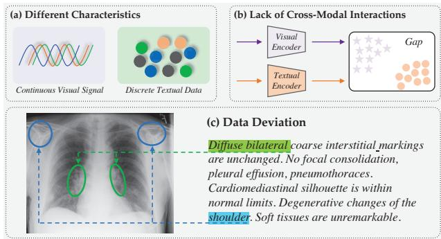
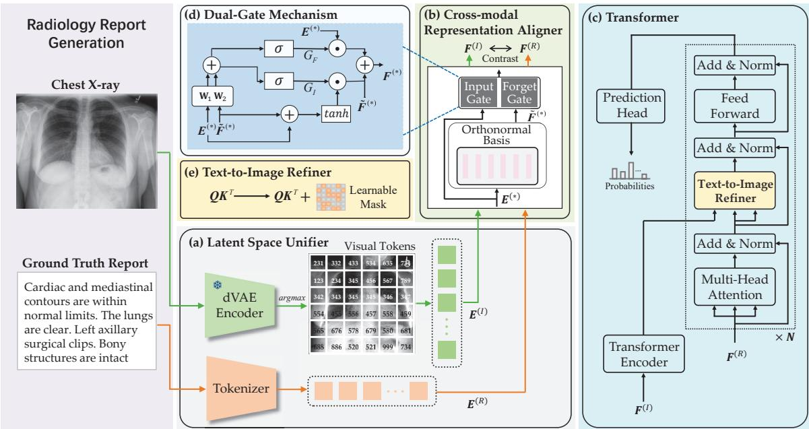
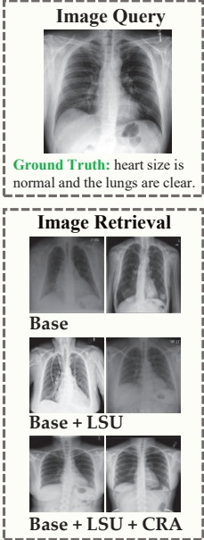
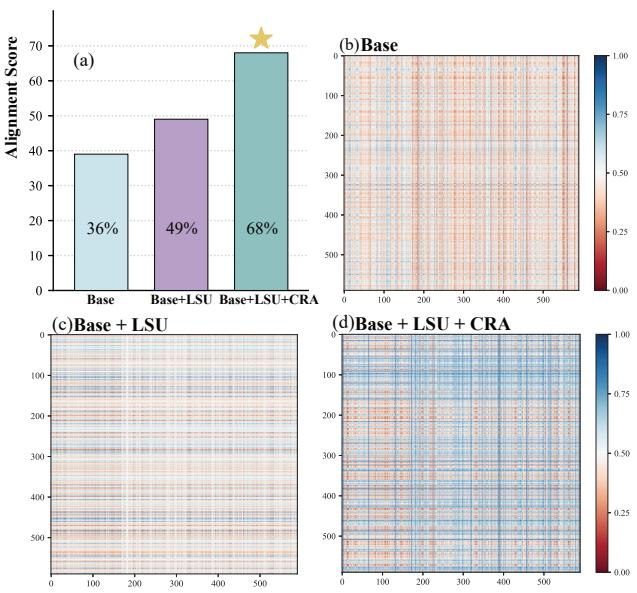
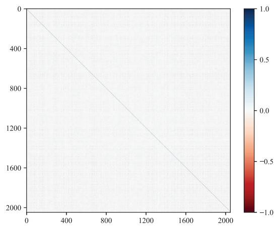
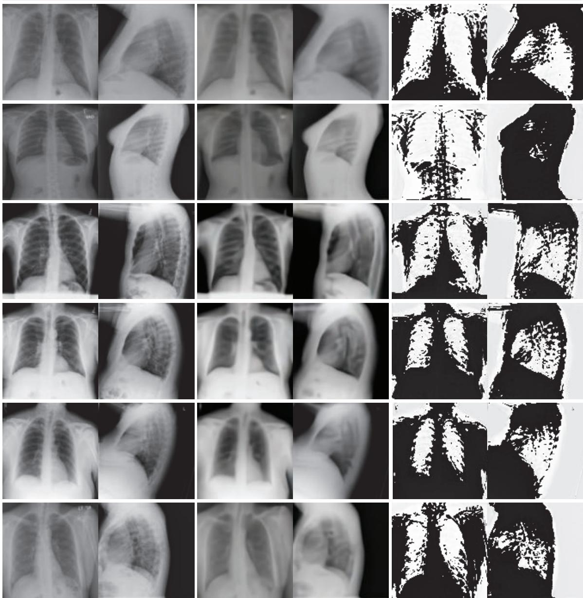
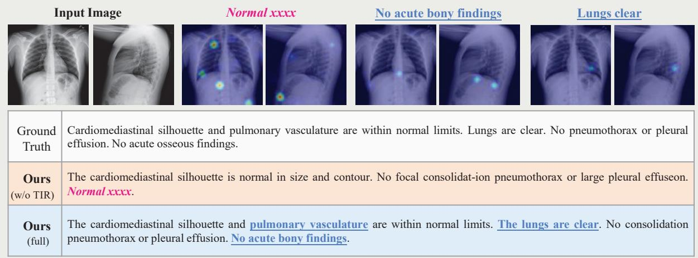

# Unify, Align and Refine: Multi-Level Semantic Alignment for Radiology Report Generation

Yaowei Li1,2, Bang Yang1,2, Xuxin Cheng1, Zhihong Zhu1, Hongxiang Li1, Yuexian Zou¹† 1School of Electronic and Computer Engineering, Peking University

2Peng Cheng Laboratory

{ywl, chengxx, zhihongzhu, lihongxiang}@stu.pku.edu.cn; {yangbang, zouyx}@pku.edu.cn

## Abstract

Automatic radiology report generation has attracted enormous research interest due to its practical value in reducing the workload of radiologists. However, simultaneously establishing global correspondences between the image (e.g., Chest X-ray) and its related report and local alignments between image patches and keywords remains challenging. To this end, we propose an Unify, Align and then Refine (UAR) approach to learn multi-level cross-modal alignments and introduce three novel modules: Latent Space Unifier (LSU), Cross-modal Representation Aligner (CRA) and Textto-Image Refiner (TIR). Specifically, LSU unifies multimodal data into discrete tokens, making it flexible to learn common knowledge among modalities with a shared network. The modality-agnostic CRA learns discriminative features via a set of orthonormal basis and a dual-gate mechanism first and then globally aligns visual and textual representations under a triplet contrastive loss. TIR boosts token-level local alignment via calibrating text-to-image attention with a learnable mask. Additionally, we design a two-stage training procedure to make UAR gradually grasp cross-modal alignments at different levels, which imitates radiologists' workflow: writing sentence by sentence first and then checking word by word. Extensive experiments and analyses on IU-Xray and MIMIC-CXR benchmark datasets demonstrate the superiority of our UAR against varied state-of-the-art methods.

## 1. Introduction

Automatic radiology report generation, as a potential intelligent assistant to relieve radiologists from the heavy workload, has attracted a surge of research interests in recent years [19, 30, 18, 24, 7, 35, 61, 67]. Mainstream methods adopt the de facto encoder-decoder framework, where a medical image (e.g., chest X-ray) is first encoded as latent representations via convolutional neural networks (CNNs) [50, 15], and then further decoded into a radiology report comprised of natural language sentences by recurrent neural networks (RNNs) [16, 10] or fully-attentive networks like Transformer [55]. The key problems in this task are twofold: 1) how to obtain comprehensive information associated with the input medical image and 2) how to accurately establish cross-modal alignments (CMA), e.g., matching generated words with their corresponding image regions.

  
Figure 1. Challenges of modeling cross-modal alignments in radiology report generation. At the encoding stage, it is intractable to globally align visual and textual semantics due to (a) their different characteristics (i.e., continuous signals vs. discrete data) and (b) the lack of cross-modal interactions. (c) During decoding, capturing the fine-grained alignment between keywords and image patches is difficult because of the data deviation problem.

This paper targets at improving CMA in automatic radiology report generation, which however, is hindered by three factors shown in Figure 1. First of all, continuous visual signals and discrete text data have the very different characteristics, resulting in semantic inconsistency and modality-independent encoding pipelines in common practices. Secondly, as illustrated in Figure 1 (b), the vision and text modalities are usually encoded via different backbones without cross-modal interactions [7, 67, 43], leading to disparities in the representation space. Thirdly, as shown in Figure 1 (c), there exists the so-called “data deviation" problem, where important details in the report (e.g., abnormalities) are sparse. As a result, the above three factors pose challenges to learning global and local CMA between radiographs and related reports. To this end, although there has emerged progresses for improving either global CMA [7, 61, 67, 43] or local CMA [19, 60, 68, 8], how to exploit multi-level CMA to enhance radiology report generation is underexplored.

Considering the above issues, we propose a Unify, Align and Refine (UAR) framework to facilitate multi-level CMA for generating faithful and believable radiology reports. Within UAR, we design a Latent Space Unifier (LSU) to tokenize images into discrete visual tokens with a discrete variational autoencoder (dVAE) [44]. By doing so, LSU unifies vision and text modalities into discrete tokens, making it flexible to design a shared network that seamlessly processes both modalities to learn common knowledge [59, 66]. Next, we introduce a modality-agnostic Cross-modal Representation Aligner (CRA) to learn global CMA. In implementation, CRA not only learns discriminative visual and textual features based on a set of orthonormal basis and a dual-gate mechanism, but also globally aligns both type of features under the supervision of a triplet contrastive loss [48]. What's more, we improve local CMA by integrating Transformer [55] with our proposed Text-to-Image Refiner (TIR). Different from the vanilla attention mechanism in Transformer, TIR additionally contains a learnable mask to re-calibrate text-to-image attention activations. TIR constrains the learnable mask with an auxiliary loss to focus word prediction on useful visual information. Last but not least, we design a two-stage training procedure to make the full model grasp CMA at different levels gradually.

We conduct experiments on two widely-adopted radiology report generation benchmarks, i.e., IU-Xray [12] and MIMIC-CXR [20]. The results demonstrate that our UAR outperforms state-of-the-art methods by a large margin, e.g., with up to 1.9% and 15% absolute improvements in terms of BLEU-4 [42] and CIDEr [56] on IU-Xray, respectively. Ablation study is also carried out to understand the effect of each module of our approach.

In brief, our contributions are three-fold:

• To facilitate multi-level cross-modal alignments, we propose a Unify, Align and Refine framework with three modules: Latent Space Unifier (LSU), Cross-modal Representation Aligner (CRA), and Text-to-Image Refiner (TIR).

• LSU unifies vision and text modalities into discrete tokens, based on which CRA learns to align the global semantics of both modalities whereas TIR encourages the tokenlevel text-to-image alignment.

• Extensive experiments and analyzes on IU-Xray and MIMIC-CXR datasets validate the superiority and effectiveness of our approach, which sets state-of-the-art performance and generates radiology reports accurately.

## 2. Related Work

## 2.1. Visual Captioning

As a member of cross-modal task [28, 9, 26, 29, 27, 49, 65], neural-network-based visual captioning methods [57, 58, 21, 64, 6] are rapidly emerging due to the boom in AIgenerated content [69, 46, 53, 25, 54]. Mainstream works use CNNs to extract global [13, 41, 13], grid [63, 39, 45] or region [22, 1, 40] features, and utilize RNNs [58, 13] with varied attention mechanisms [51, 1, 17, 40] to capture cross-modal interactions and generate descriptions in an auto-regressive manner. In recent years, a growing number of methods leverage the potential of the fully-attentive Transformer [55] in capturing long-range dependencies to boost captioning performance [11, 71, 33, 14]. However, these methods are designed to generate a one-sentence description, which is brief and could lack details. Although several works [23, 31] use hierarchical models to generate long paragraphs, they may fail to capture accurate concepts and keywords, which limits application of such models in radiology report generation.

## 2.2. Chest X-ray Report Generation

To adapt the conventional visual captioning framework to radiology report generation, various improvements has been proposed. HRGR [30] designs a retrieval-generation method, which decides to either generate a new sentence or retrieve an existing template for different topics. CMAS [18] utilizes two writers to describe the abnormal and normal regions respectively. PPKED [35] incorporates the posteriorand-prior knowledge for alleviating the data deviation problem. CA [36] compares the current input image with normal images to obtain discriminative abnormal features. Furthermore, for generating more coherent and consistent reports, reinforcement learning [30, 37, 18, 43] is employed to directly optimize desired metrics, graph-based methods [70, 24] are used to construct relationships between diseases, and curriculum learning [34] as a training strategy simulates the writing pattern of “easy first, then difficult".

Moreover, a portion of works [19] focus on improving cross-modal alignments (CMA) in radiology report generation. CoAtt [19] utilizes semantic information produced by an auxiliary tag prediction task to improve fine-grained CMA. Self-boosting [61] extracts the text-correlated visual feature via coupling the image-text matching branch. TieNet [60] employ a multi-level attention for highlighting the meaningful words and regions. R2GenCMN [7], CMM+RL [43] and JPG [67] treat trainable memory networks as the intermediary of vision and text modalities to enhance global CMA. However, these methods achieve CMA implicitly, which could result in insufficient and inaccurate semantic matching. By contrast, our approach uses explicit constraints to gradually grasp multi-level CMA.

## 3. Method

## 3.1. Overview

As shown in Figure $^ { 2 , }$ our proposed UAR is built upon the encoder-decoder framework and contains three novel modules: Latent Space Unifier (LSU), Cross-modal Representation Aligner (CRA), and Text-to-Image Refiner (TIR). Given a radiograph I, our UAR aims to generate a descriptive report $R = \{ r _ { 1 } , r _ { 2 } , . . . , r _ { T } \}$ of $T$ words automatically. During training, we formulate our approach as follows:

$$
E ^ { ( I ) } , E ^ { ( R ) } = \mathrm { L S U } ( I , R ) ;\tag{1}
$$

$$
\begin{array} { r } { \pmb { F } ^ { ( I ) } , \pmb { F } ^ { ( R ) } = \mathrm { C R A } ( \pmb { E } ^ { ( I ) } , \pmb { E } ^ { ( R ) } ) ; } \end{array}\tag{2}
$$

$$
h _ { t } = \mathrm { T r a n s f o r m e r } _ { \mathrm { T I R } } ( { \cal F } ^ { ( I ) } , { \cal F } _ { < t } ^ { ( R ) } ) ;\tag{3}
$$

$$
p _ { \theta } ( r _ { t } | R _ { < t } , I ) = \mathrm { s o f t m a x } ( \mathrm { H e a d } ( h _ { t } ) ) .\tag{4}
$$

Specifically, LSU(·) unifies I and R into discrete tokens and produces their embeddings ${ \pmb E } ^ { ( I ) }$ and $E ^ { ( R ) }$ respectively. $\mathrm { C R A } ( \cdot )$ takes embeddings as the input and outputs discriminative features ${ \pmb F } ^ { ( I ) }$ and ${ \pmb F } ^ { ( R ) }$ , which will be used to contrast and align with each other to enhance global cross-modal alignment (as introduced next). Next, TransformerTIR(·), a standard Transformer [55] integrated with our proposed TIR to improve fine-grained cross-modal alignment, calculates the hidden state at the t-th time step $( h _ { t } )$ based on the visual features ${ \pmb F } ^ { ( I ) }$ and the preceding textual features $F _ { 0 : t - 1 } ^ { ( R ) } .$ Finally, the hidden state $h _ { t }$ is mapped into the distribution over the vocabulary by Head(·) (i.e., a fully-connected layer and a softmax function). The basic training objective of our UAR for language modeling is defined as:

$$
\mathcal { L } _ { C E } = - \sum _ { t = 1 } ^ { T } \log p _ { \theta } ( r = r _ { t } | R _ { < t } , I )\tag{5}
$$

In the following, we will elaborate on our proposed LSU, CRA, and TIR, followed by the introduction of a two-stage training procedure.

## 3.2. Latent Space Unifier (LSU)

As shown in Figure 2 (a), LSU unifies image and text modalities into discrete tokens and obtain their embeddings.

For extracting visual embeddings ${ \pmb E } ^ { ( I ) }$ of the input radiograph $I ,$ we follow [44] and [4] to exploit a discrete variational autoencoder (dVAE), which involves three components, $i . e .$ , a codebook $\mathcal { V } _ { I }$ , an encoder that maps an image into distributions over the codebook, and a decoder that reconstructs the image from its discrete tokens sampled from the distribution. Please see [44] for more details of dVAE. Here, we only adopt the codebook and the encoder of dVAE and discard its decoder. Concretely, the encoder of dVAE compresses $I \in \mathbb { R } ^ { H \times W \times C }$ into $D \in \mathbb { R } ^ { L \times | \mathcal { V } _ { I } | }$ , where $L = H W \bar { / } M ^ { 2 }$ denotes the number of visual tokens, M is the downsampling factor, and $| \nu _ { I } |$ the size of the codebook. We apply the argmax operation on D to obtain L visual tokens, and then use a trainable look-up matrix $\mathbf { W _ { I } } \in \mathbb { R } ^ { | V _ { I } | }$ ×d to attain $\pmb { { E } } ^ { ( I ) } \in \mathbb { R } ^ { L \times d }$

As the radiology report R is already discrete data, we only need a vocabulary $\nu _ { R } \ : ( e . g .$ , constructed from the training corpus) and a trainable look-up matrix ${ \bf W _ { R } } \in \mathbb { R } ^ { | \mathcal { V } _ { R } | \times d }$ for extracting text embeddings $\pmb { E } ^ { ( \tilde { R } ) } \in \mathbb { R } ^ { T \times d }$

It is noteworthy that although the dVAE we use is pretrained on non-medical images, it produces reasonable reconstruction results for X-ray images (see Figure 6).

## 3.3. Cross-modal Representation Aligner (CRA)

As shown in Figure 2 (b), CRA is modality-agnostic. It processes visual and textual embeddings with the same set of orthonormal basis and a dual-gate mechanism to model crossmodal interactions, and enhances global semantic alignment under a triplet contrastive loss.

Specifically, we construct a set of orthonormal basis $\pmb { B } \in$ R2,048×d via Gram-Schmidt Orthogonalization [47]. Similar to Layer Normalization [2], we adjust B as follows:

$$
\hat { B } = \gamma \odot B + \beta ,\tag{6}
$$

where $\odot$ is element-wise multiplication, $\gamma$ and $\beta$ are gain and bias parameters of the same dimension as B. Next, we use $\hat { B }$ and the attention mechanism to process embeddings from different modalities:

$$
\begin{array} { r l } & { \tilde { \cal F } ^ { ( * ) } = \mathrm { A t t e n t i o n } ( E ^ { ( * ) } , \hat { \cal B } , \hat { \cal B } ) , } \\ & { \mathrm { A t t e n t i o n } ( Q , { \cal K } , { \cal V } ) = \mathrm { s o f t m a x } ( { \cal A } ) ( { \cal V } { \bf W } _ { V } ) , } \\ & { { \cal A } = ( Q { \bf W } _ { Q } ) ( { \cal K } { \bf W } _ { K } ) ^ { \top } / \sqrt { d } , } \end{array}\tag{7}
$$

where $* \in \{ I , R \}$ , A denotes attention activations, and all W are trainable parameters. In practice, we extend the above attention mechanism into a multi-head version as in [55]. By representing features with the same basis $\hat { B } _ { : }$ it could benefit feature alignment [62, 52]. Next, inspired by LSTM [16], we define a gate mechanism to control the information flow:

$$
G ( \boldsymbol { X } , \boldsymbol { Y } ) = \sigma ( \boldsymbol { X } \mathbf { W } _ { 1 } + \boldsymbol { Y } \mathbf { W } _ { 2 } ) ,\tag{8}
$$

where σ is the sigmoid function, $\mathbf { W } _ { 1 }$ and $\mathbf { W } _ { 2 }$ are trainable weights. We introduce a input gate $G _ { I } ( \cdot , \cdot )$ and a forget gate $G _ { F } ( \cdot , \cdot )$ to adaptively fuse $\breve { E ^ { ( * ) } }$ and $\tilde { \pmb { F } } ^ { ( * ) }$ to produce the final features $\bar { \pmb { F } ^ { ( * ) } }$ as follows:

$$
\begin{array} { r l } & { { \pmb F } ^ { ( * ) } = G _ { I } ( { \pmb E } ^ { ( * ) } , \tilde { { \pmb F } } ^ { ( * ) } ) \odot \operatorname { t a n h } \left( { \pmb E } ^ { ( * ) } + \tilde { { \pmb F } } ^ { ( * ) } \right) } \\ & { \qquad + G _ { F } ( { \pmb E } ^ { ( * ) } , \tilde { { \pmb F } } ^ { ( * ) } ) \odot { \pmb E } ^ { ( * ) } + \tilde { { \pmb F } } ^ { ( * ) } . } \end{array}\tag{9}
$$

Triplet Contrastive Loss In order to achieve global crossmodal alignment with explicit supervision signals, we intro-

  
Figure 2. Overview of our UAR framework. In addition to the widely-adopted Transformer shown in (c), it comprises three novel modules to boost multi-level cross-modal alignments: (a) Latent Space Unifier (Section3.2), (b) Cross-modal Representation Aligner (Section 3.3), and $( \mathrm { c } , \mathrm { e } )$ Text-to-Image Refiner (Section 3.4). In (d), we illustrate the flow chart of the dual-gate mechanism shown in (b)

duce the following training objective:

$$
\begin{array} { r } { \mathcal { L } _ { G l o b a l } = \mathrm { R e L U } \left( \alpha - \langle \pmb { F } ^ { ( I ) } , \pmb { F } ^ { ( R ) } \rangle + \langle \pmb { F } ^ { ( I ) } , \pmb { F } _ { - } ^ { ( R ) } \rangle \right) } \\ { + \mathrm { R e L U } \left( \alpha - \langle \pmb { F } ^ { ( I ) } , \pmb { F } ^ { ( R ) } \rangle + \langle \pmb { F } _ { - } ^ { ( I ) } , \pmb { F } ^ { ( R ) } \rangle \right) } \end{array}\tag{10}
$$

where $\langle \cdot , \cdot \rangle$ denotes cosine similarity, α is the margin value, and ${ \pmb F } _ { - } ^ { ( R ) }$ and ${ \pmb F } _ { - } ^ { ( I ) }$ indicate hard negative samples that have a high cosine similarity with the anchors ${ \pmb F } ^ { ( I ) }$ and ${ \pmb F } ^ { ( R ) }$

## 3.4. Text-to-Image Refiner (TIR)

TIR aims to enhance the correspondence between the radiology report R and its associated image I at the token level. This is achieved by affects text-to-image attention patterns with an additional learnable mask, as shown in Figure 2 (c) and (e). Specifically, we modify the definition of A (Eq. 7) in the vanilla text-to-image attention of the Transformer decoder as follows:

$$
A = \left( ( Q { \bf W } _ { Q } ) ( K { \bf W } _ { K } ) ^ { \top } + k \cdot \sigma ( M ) \right) / \sqrt { d }\tag{11}
$$

where k is a large scaling constant $( e . g . , 1 , 0 0 0 )$ and $\sigma ( M ) \in$ $\mathbb { R } ^ { T \times L }$ denotes the learnable mask that impacts the activations between T textual tokens and L visual tokens. To focus each text token on proper visual information, we constrain the mask with the following objective:

$$
\mathcal { L } _ { M a s k } = \sum _ { i = 1 } ^ { T } \sum _ { j = 1 } ^ { L } ( 1 - \sigma ( M _ { i j } ) ) .\tag{12}
$$

## 3.5. Two-Stage Training

So far, we have introduced three training objectives of our UAR approach: $\mathcal { L } _ { C E }$ (Eq. 5) for language modeling, $\mathcal { L } _ { G l o b a l }$ (Eq. 10) for enhancing global cross-modal alignment, and $\mathcal { L } _ { M a s k }$ (Eq. 12) that re-calibrates attention activations to boost local cross-modal alignment. The overall loss function of our approach is formulated as:

$$
\mathcal { L } = \lambda _ { 1 } \mathcal { L } _ { C E } + \lambda _ { 2 } \mathcal { L } _ { g l o b a l } + \lambda _ { 3 } \mathcal { L } _ { M a s k } .\tag{13}
$$

To learn cross-modal alignment incrementally and stably, we split the training process into two stages. In the first stage, $\{ \lambda _ { 1 } , \lambda _ { 2 } , \lambda _ { 3 } \} = \{ 1 , 1 , 0 \}$ . The model does not include a learnable mask in the text-to-image attention and is forced to learn coarse-grained semantic alignment besides language modeling. In the second stage, $\{ \lambda _ { 1 } , \lambda _ { 2 } , \lambda _ { 3 } \} = \{ 1 , 1 , 1 \}$ $i . e .$ , the model additionally emphasizes the learning of finegrained semantic alignment.

## 4. Experiments

## 4.1. Configurations

Datasets Our evaluation is performed on two publicly available radiology report generation benchmark datasets, namely IU-Xray [12] and MIMIC-CXR [20].

$\mathbf { I U - X r a y } ^ { 1 }$ , established by Indiana University, is a commonly-used dataset that comprises 7, 470 X-ray images along with 3, 955 corresponding reports. We use the same 70%-10%-20% training-validation-testing splits as previous works [7, 35, 67]. We keep words that appear more than 3 times, resulting a vocabulary of size around 1K.

<table><tr><td>DATASET</td><td>METHOD</td><td>BLEU-1</td><td>BLEU-2</td><td>BLEU-3</td><td>BLEU-4</td><td>METEOR</td><td>ROUGE-L</td><td>CIDER</td></tr><tr><td rowspan="10"></td><td>COATT [19]</td><td>0.455</td><td>0.288</td><td>0.205</td><td>0.154</td><td></td><td>0.369</td><td>0.277</td></tr><tr><td>HRGR [30]</td><td>0.438</td><td>0.298</td><td>0.208</td><td>0.151</td><td></td><td>0.322</td><td>0.343</td></tr><tr><td>CMAS-RL [18]</td><td>0.464</td><td>0.301</td><td>0.210</td><td>0.154</td><td></td><td>0.362</td><td>0.275</td></tr><tr><td>SENTSAT+KG [70]</td><td>0.441</td><td>0.291</td><td>0.203</td><td>0.417</td><td></td><td>0.304</td><td>0.304</td></tr><tr><td>R2GEN [8]</td><td>0.470</td><td>0.304</td><td>0.219</td><td>0.165</td><td></td><td>0.371</td><td></td></tr><tr><td>CMCL [34]</td><td>0.473</td><td>0.305</td><td>0.217</td><td>0.162</td><td>0.186</td><td>0.378</td><td></td></tr><tr><td>PPKED [35]</td><td>0.483</td><td>0.315</td><td>0.224</td><td>0.168</td><td>0.190</td><td>0.376</td><td>0.351</td></tr><tr><td>R2GENCMN* [7]</td><td>0.470</td><td>0.304</td><td>0.222</td><td>0.170</td><td>0.191</td><td>0.358</td><td>0.344</td></tr><tr><td>JPG [67]</td><td>0.479</td><td>0.319</td><td>0.222</td><td>0.174</td><td>0.193</td><td>0.377</td><td></td></tr><tr><td>CMM+RL [43]</td><td>0.494</td><td>0.321</td><td>0.235</td><td>0.181</td><td>0.201</td><td>0.384</td><td></td></tr><tr><td rowspan="9"></td><td>UAR (Ours)</td><td>0.530</td><td>0.365</td><td>0.263</td><td>0.200</td><td>0.218</td><td>0.405</td><td>0.501</td></tr><tr><td>ST [58]</td><td>0.299</td><td>0.184</td><td>0.121</td><td>0.084</td><td>0.124</td><td>0.263</td><td></td></tr><tr><td>ATT2IN [45]</td><td>0.325</td><td>0.203</td><td>0.136</td><td>0.096</td><td>0.134</td><td>0.276</td><td></td></tr><tr><td>ADAATT [39]</td><td>0.299</td><td>0.185</td><td>0.124</td><td>0.088</td><td>0.118</td><td>0.266</td><td></td></tr><tr><td>TOPDOWN [1]</td><td>0.317</td><td>0.195</td><td>0.130</td><td>0.092</td><td>0.128</td><td>0.267</td><td></td></tr><tr><td>R2GEN [8]</td><td>0.353</td><td>0.218</td><td>0.145</td><td>0.103</td><td>0.142</td><td>0.270</td><td></td></tr><tr><td>CMCL [34]</td><td>0.344</td><td>0.217</td><td>0.140</td><td>0.097</td><td>0.133</td><td>0.281</td><td></td></tr><tr><td>PPKED [35]</td><td>0.360</td><td>0.224</td><td>0.149</td><td>0.106</td><td>0.149</td><td>0.284</td><td>0.237</td></tr><tr><td>R2GENCMN* [7]</td><td>0.348</td><td>0.206</td><td>0.135</td><td>0.094</td><td>0.136</td><td>0.266</td><td>0.158</td></tr><tr><td></td><td>CMM+RL [43]</td><td>0.381</td><td>0.232 0.229</td><td>0.155</td><td>0.109 0.107</td><td>0.151</td><td>0.287</td><td></td></tr></table>

Table 1. Comparison with state-of-the-art methods on IU-Xray and MIMIC-CXR datasets.Optimalandsuboptimalperformance is highlighted. \*: Our re-implementations with the official code. Our UAR achieves competitive if not the best performance on all metrics.

• MIMIC-CXR2, provided by Beth Israel Deaconess Medical Center, is a recently released large chest X-ray dataset that contains 473, 057 radiographs and 206, 563 corresponding reports. We adopt the official splits and retain words that appear more than 10 times. We also preprocess the reports by tokenizing, converting them to lowercase, and removing non-alphabetic tokens. This results in a vocabulary of approximately 4,000 words.

Metrics We report four widespread automatic metrics: BLEU [42], METEOR [3], ROUGE-L [32] and CIDEr [56], and compute them with Microsoft COCO Evaluation Server [5]. BLEU [42] and METEOR [3] is originally proposed for machine translation evaluation. ROUGE-L [32] is initially introduced for summarization. CIDEr [56] is proposed for image captioning. Higher is better for all metrics.

Settings Our baseline model comprises a pre-trained ResNet101 [15] and a randomly initialized Transformer-Base [55] with 3 layers. For our UAR model, we replace ResNet101 with a pre-trained dVAE, whose details are left to Appendix. Following previous works [30, 35, 67], we use frontal and lateral X-ray images as input on IU-Xray, and only frontal X-ray images on MIMIC-CXR. To save computation cost, we resize images to 128 × 128 and randomly crop a region of size 112 × 112 at the training phase; we directly resize the image to 112 × 112 at the inference phase. We use the AdamW optimizer [38] to train the model. We employ distinct training stage arrangements and learning rate schedules, along with varying batch sizes, for different datasets. More implementation details are given in Appendix.

## 4.2. Comparison with State-of-the-Art Methods

We compare our UAR model with state-of-the-art (SOTA) methods of different backbones, including CNN-RNN [58, 39, 1, 19] and CNN-Transformer [8, 7, 35, 67]. Besides, we also consider SOTA methods using different technologies, including reinforcement learning [45, 30, 18, 43], knowledge graph [70], and curriculum learning [34]. As shown in Table 1, our approach achieves SOTA performance on the IU-Xray dataset, with up to 1.9% and 15% absolute gains in terms of BLEU-4 and CIDEr metrics. As for the MIMIC-CXR dataset, our UAR obtains competitive results compared to the strongest competitor, i.e., CMM+RL [43], which utilizes reinforcement learning to directly optimize metric scores. Notably, as our approach mainly involves network designing, incorporating existing technologies like reinforcement learning and curriculum learning may bring further improvements. Besides, the superiority of our approach against CoATT [19], R2GenCMN [7], and JPG [67] show the necessity of capturing multi-level cross-modal alignments.

<table><tr><td rowspan="2">SECTION</td><td rowspan="2">MODEL</td><td rowspan="2">LSU</td><td colspan="2">CRA</td><td rowspan="2">TIR</td><td rowspan="2">TWO-STAGE TRAINING</td><td colspan="7">DATASET: IU-XRAY [12]</td></tr><tr><td>Integration</td><td> $\mathcal { L } _ { g l o b a l }$ </td><td>BLEU-1</td><td>BLEU-2</td><td>BLEU-3 BLEU-4 METEOR</td><td></td><td></td><td>ROUGE-L</td><td>CIDER</td></tr><tr><td rowspan="2">3.2</td><td>BASE</td><td></td><td></td><td></td><td></td><td></td><td>0.424</td><td>0.268</td><td>0.189</td><td>0.144</td><td>0.171</td><td>0.339</td><td>0.271</td></tr><tr><td>(a)</td><td> $\surd$ </td><td></td><td></td><td></td><td></td><td>0.475</td><td>0.319</td><td>0.233</td><td>0.177</td><td>0.218</td><td>0.399</td><td>0.295</td></tr><tr><td rowspan="2">3.3</td><td>(b)</td><td></td><td> $\surd$ </td><td></td><td></td><td></td><td>0.446</td><td>0.283</td><td>0.196</td><td>0.141</td><td>0.174</td><td>0.360</td><td>0.330</td></tr><tr><td>(c)</td><td></td><td></td><td></td><td></td><td></td><td>0.426</td><td>0.274</td><td>0.192</td><td>0.143</td><td>0.184</td><td>0.356</td><td>0.409</td></tr><tr><td rowspan="2">3.4</td><td>(d)</td><td></td><td> $\surd$ </td><td>&gt;&gt;</td><td></td><td></td><td>0.471</td><td>0.302</td><td>0.213</td><td>0.158</td><td>0.187</td><td>0.390</td><td>0.393</td></tr><tr><td>(e)</td><td> $\surd$ </td><td> $\surd$ </td><td> $\surd$ </td><td></td><td></td><td>0.538</td><td>0.365</td><td>0.262</td><td>0.193</td><td>0.218</td><td>0.365</td><td>0.410</td></tr><tr><td></td><td>(f)</td><td> $\surd$ </td><td> $\surd$ </td><td> $\surd$ </td><td> $\surd$ </td><td></td><td>0.505</td><td>0.332</td><td>0.244</td><td>0.182</td><td>0.206</td><td>0.401</td><td>0.460</td></tr><tr><td>3.5</td><td>UAR (Ours)</td><td> $\surd$ </td><td> $\surd$ </td><td> $\surd$ </td><td> $\surd$ </td><td> $\surd$ </td><td>0.530</td><td>0.365</td><td>0.263</td><td>0.200</td><td>0.218</td><td>0.405</td><td>0.501</td></tr></table>

Table 2. Ablation studies on the proposed Latent Space Unifier (LSU), Cross-modal Representation Aligner (CRA), Text-to-Image Refiner (TIR), and the two-stage training procedure. In CRA, "Integration" means using the orthogonal subspace and the dual-gate mechanism simultaneously. As we can observe, our UAR model significantly outperforms the base model on all metrics

<table><tr><td rowspan=1 colspan=14>BL-1 BL-2 BL-3 BL-4MTORRG-LCIDER</td></tr><tr><td rowspan=1 colspan=1>Ours  0</td><td rowspan=1 colspan=2>.5300</td><td rowspan=1 colspan=1>.365</td><td></td><td rowspan=1 colspan=1>0.263</td><td></td><td rowspan=1 colspan=1>0.200</td><td></td><td rowspan=1 colspan=2>0.2180</td><td rowspan=1 colspan=1>.405</td><td></td><td rowspan=1 colspan=1>0.501</td></tr><tr><td rowspan=1 colspan=1>Uniform0</td><td rowspan=1 colspan=3>.4410.284</td><td></td><td rowspan=1 colspan=1>0.207</td><td></td><td rowspan=1 colspan=4>0.1580.179</td><td rowspan=1 colspan=1>0.378</td><td></td><td rowspan=1 colspan=1>0.428</td></tr><tr><td rowspan=1 colspan=1>Normal</td><td rowspan=1 colspan=1>0.467</td><td></td><td rowspan=1 colspan=1>0.303</td><td></td><td rowspan=1 colspan=1>0.210</td><td rowspan=1 colspan=3>0.1550</td><td rowspan=1 colspan=1>.197</td><td rowspan=1 colspan=2>0.371</td><td></td><td rowspan=1 colspan=1>0.427</td></tr></table>

Table 3. Effect of using subspaces subject to orthogonal (default), uniform, and normal distributions in the proposed CRA.

## 5. Ablation Study and Analysis

In this section, we delve deeper into each module of our UAR with both quantitative and qualitative results.

## 5.1. Effect of Latent Space Unifier

Quantitative Analysis As shown in Table 2 show, model (a) surpasses the base model on all metrics, e.g., 2.3% improvements on BLEU-4. Meanwhile, model (a) is also a strong competitor even compared with the SOTA methods listed in Table 1 on IU-Xray. The performance boost is possibly because LSU reconciles the distributions of visual and textual data and thus prompts the implicit learning of cross-modal alignments. To verify our hypothesis, we calculate the alignment score³ of different models. As shown in Figure 4 (a), we can observe that “Base + LSU" achieves higher alignment score than the base model, i.e., 49% vs. 36%. which proves the potential of LSU in implicitly aligning features of different modalities.

Qualitative Analysis We visualize the heatmaps of pairwise cosine similarity among all data samples in Figure 4 (b-d) As we can see in (b), samples similar to the query sample are relatively rare in the base model. Considering that radiology reports contain inherent patterns, high correlations shall be observed frequently. In (c), integrating the base model with LSU improves this situation to some extent via unifying multimodal characteristics. Furthermore, Figure 3 shows retrieval results of different models given the same image as the query. We can see that compared with the base model, “Base + LSU" gives higher cosine similarity between the query image and the ground-truth report, i.e., 0.4440 → 0.6060. These results further confirm that LSU can benefit global semantic alignments.

<table><tr><td rowspan=1 colspan=13>BL-1 BL-2 BL-3 BL-4MTORRG-LCIDER</td></tr><tr><td rowspan=1 colspan=2>Ours</td><td rowspan=1 colspan=1>0.530</td><td rowspan=1 colspan=1>0.365</td><td></td><td rowspan=1 colspan=1>0.263</td><td></td><td rowspan=1 colspan=1>0.200</td><td></td><td rowspan=1 colspan=1>0.218</td><td rowspan=1 colspan=1>0.405</td><td></td><td rowspan=1 colspan=1>0.501</td></tr><tr><td rowspan=1 colspan=2>No Gate</td><td rowspan=1 colspan=3>0.4390.296</td><td rowspan=1 colspan=1>0.208</td><td></td><td rowspan=1 colspan=3>0.1550.193</td><td rowspan=1 colspan=1>0.373</td><td rowspan=4 colspan=2>0.4050.376</td></tr><tr><td rowspan=3 colspan=2>Addition</td><td></td><td></td><td></td><td></td><td></td><td></td><td></td><td></td><td></td></tr><tr><td rowspan=1 colspan=2>Addition</td><td></td><td></td><td></td><td></td><td></td><td></td><td></td><td></td><td></td></tr><tr><td rowspan=1 colspan=1>on</td><td rowspan=1 colspan=1>0.487</td><td rowspan=1 colspan=1>0.318</td><td></td><td rowspan=1 colspan=1>0.225</td><td></td><td rowspan=1 colspan=2>0.167</td><td rowspan=1 colspan=1>0.214</td><td rowspan=1 colspan=1>0.386</td></tr></table>

Table 4. Effect of different fusing mechanisms in the proposed CRA, including dual-gate (default), “no gate": $\pmb { F } ^ { ( * ) } = \tilde { \pmb { F } } ^ { ( * ) }$ , and "addition": $\pmb { F } ^ { ( * ) } = \pmb { E } ^ { ( * ) } + \tilde { \pmb { F } } ^ { ( * ) }$

## 5.2. Effect of Cross-modal Representation Aligner

Quantitative Analysis By comparing models (b,c,d) with the base model in Table 2, we can observe that both the feature integration and the triplet contrastive loss of CRA can bring performance boosts. Specifically, the feature integration encourages the model to generate fluent and faithful reports and thus model (b) achieves higher BLEU and ROUGE-L scores than the base model. Meanwhile, the triplet contrastive loss promotes the generation of diverse sentences that are semantically consistent with ground truth report, resulting in higher CIDEr score of model (c) than the base model. By combining complementary merits of models (b) and (c), model (d) performs better. Moreover, compared with model (d), incorporating LSU and CRA (i.e., model (e)) brings furhter improvements, which can be attributed to the better cross-modal alignment ability shown in Figure 4 (a), where model (e) $( i . e . , \mathrm { \ ^ { * } B a s e \mathrm { \Sigma } + L S U + C R A ^ { * } } )$ gets the highest alignment score (68%).

<table><tr><td rowspan=11 colspan=2></td><td rowspan=1 colspan=4>Report Retrieval</td></tr><tr><td rowspan=2 colspan=1>Rank 10.8020</td><td rowspan=2 colspan=1>Cardiomegaly is present. There isinterstitial pulmonary edema withthe &lt;unk&gt; of xxxx &lt;unk&gt;. There isno pneumothorax. There is an&lt;unk&gt; 17 mm nodular opacityprojecting between the posterior left5th and 6th ribs. There is a 10 mmnodular density projecting over theright posterior &lt;unk&gt; rib. There is axxxx posterior.</td><td rowspan=1 colspan=1>Rank 10.6683</td><td rowspan=1 colspan=1>Stable cardiomegaly and mediastinal contour. Increasedinterstitial lung markings are seen possibly due tovolume &lt;unk&gt;. There is improved aeration of the lungbases with small residual left basilar effusion. No xxxxfocal consolidation or pneumothorax. Stable tunneled&lt;unk&gt; catheter. Visualized osseous structures appearintact.</td></tr><tr><td rowspan=1 colspan=1>Rank 20.6678</td><td rowspan=1 colspan=1>Lung volumes remain low. No infiltrates. Heart andpulmonary xxxx remain normal.</td></tr><tr><td rowspan=5 colspan=1>Rank 20.7758</td><td rowspan=5 colspan=1>&lt;unk&gt; noncalcified lung nodulesare present in the left lower lobe.The &lt;unk&gt; measures &lt;unk&gt; mm indiameter. &lt;unk&gt; nodule is presentnear the right hilum. It isapproximately 2 cm in diameter.The xxxx and mediastinum appearnormal. Heart size normal.</td><td></td><td></td></tr><tr><td rowspan=1 colspan=1>Rank 22★0.6060</td><td rowspan=1 colspan=1>Ground Truth</td></tr><tr><td rowspan=1 colspan=1>Base + LSU</td><td rowspan=1 colspan=1></td></tr><tr><td rowspan=1 colspan=1>Rank 1★0.7342</td><td rowspan=1 colspan=1>Ground Truth</td></tr><tr><td rowspan=1 colspan=1>Rank 20.7333</td><td rowspan=1 colspan=1>Lungs are clear. Heart size normal. No pneumothorax.</td></tr><tr><td rowspan=2 colspan=1>Rank 565★0.4440</td><td rowspan=2 colspan=1>Ground Truth</td><td rowspan=2 colspan=1>Rank 30.7299</td><td rowspan=2 colspan=1>The cardiac contours are normal. The lungs areclear. Thoracic spondylosis.</td></tr><tr><td rowspan=1 colspan=1></td></tr><tr><td rowspan=1 colspan=4>Base                                         Base + LSU + CRA</td></tr></table>

Figure 3. Image retrieval and report retrieval results of different models. “Base", “Base + LSU", and $\mathrm { ^ { * } B a s e + L S U + C R A ^ { * } }$ correspond to the base model, model (a) and model (e) in Table 2, respectively. In report retrieval, we highlight accurate, reasonable, and wrong phrases. We also foreground rankings and cosine similarities. As we can observe, the model is more likely to retrieve the ground-truth report by gradually integrating the base model with our proposed LSU and CRA, i.e., our approach effectively enhances global semantic alignments.

  
Figure 4. (a): Alignment scores of different models. (b-d): Heatmaps of pairwise cosine similarity among all data samples.

As the feature integration of CRA is composed of two parts: the orthogonal subspace 4 and the two-gate mechanism, we investigate different variants that can be substituted with our proposals in Table 3 and Table 4. We can see that our proposed orthogonal subspace outperforms the uniform and normal ones, and the dual-gate mechanism is superior in feature fusion than all other variants.

  
Figure 5. Visualization of Gram matrix for the memory matrix trained in R2GenCMN [7].

Qualitative Analysis Here, we first probe into the SOTA

Raw Image  
Reconstruction  
Residual  
  
Figure 6. Chest X-ray reconstructions of pre-trained dVAE on IU-Xray dataset [12]. From left to right, we visualize the raw radiograph, the reconstruction result and the residual image between the two in turn.

R2GenCMN model [7] that enhance global semantic alignments with a memory matrix. We visualize the Gram matrix of the pre-trained memory matrix in Figure 5. Surprisingly, almost all values in Gram matrix equal to 0, demonstrating that it is approximately an orthogonal subspace. This visualization result justifies our subspace design in CRA.

Likewise, we show the similarity heatmap of “Base + $\mathrm { L S U + C R A } ^ { \mathrm { 3 } }$ in Figure 4 (d), whose pattern is quite different to that of (b) and (c). In Figure 3, we can observe that “Base + LSU + CRA" performs the best in retrieval. On the one hand, retrieved reports have high similarity to the query image, and they are semantically consistent with the ground-truth report, e.g., lung are clear and the cardiac contours are normal. On the other hand, the ground-truth report can be retrieved precisely, i.e., ranking first with a similarity of 0.7342.

In brief, the above quantitative and qualitative analyses verify that our proposed LSU and CRA can effectively enhances global semantic alignments.

  
Figure 7. An example of radiology reports generated by our model without or with the proposed Text-to-Image Refiner (TIR). We highlight incomplete and detailed descriptions in the report. We also show the text-to-image attention heatmaps of specific descriptions at the top. Our full model learns accurate correspondences between image regions and keywords.

## 5.3. Effect of Text-to-Image Refiner

Quantitative Analysis By comparing model (e), (f), and our UAR model in Table 2, we have the following observations. 1) TIR can effectively improves the CIDEr metric, e.g., 5% absolute improvement for model (f) vs. model (e), showing that TIR is beneficial for generating accurate keywords in the radiology report. Moreover, excluding two-stage training leads to obvious performance degradation, i.e., our UAR model vs. model (f). This indicates the instability of multiobjective optimization and proves the effectiveness of our two-stage training procedure.

Qualitative Analysis In Figure 7, we illustrate the effect of TIR on radiology report generation. As we can see, the model without TIR outputs an useless description "Normal xxxx", where “xxxx“ is anonymized information used to protect patient privacy and results in an incomplete sentence. By contrast, our TIR remedies this content omission and interprets the visual content in detail. Additionally, text-to-image attention heatmaps demonstrate that our TIR is capable of focusing word prediction on proper visual information.

In all, TIR can capture accurate fine-grained correspondences between image regions and keywords. Our full model can generate more informative and meaningful radiology reports by enhancing multi-level semantic alignments.

## 5.4. Case Study of dVAE reconstructions

As shown in Figure 6, we present several reconstructions for chest X-ray images. We obeserve that pre-trained dVAE can generate reasonable and consistent reconstruction results, which demonstrates that the extracted visual tokens remain high-level semantic information, i.e., different tokens may represent different organs or regions. In other words, the unification of visual and textual characteristics facilitates the design of a shared network to flexibly achieve cross-modal alignment. Futhermore, most of the low-frequency structure are retained and the high-frequency information is ignored in reconstruction X-ray images. Despite the low-frequency structure already contains enough semantic information, the high-frequency information may be conducive to the judgement of specific abnormalities, e.g., bone structure, which will remain in future research.

## 6. Conclusion

In this paper, we make the first attempt to align visual and textual semantics at different levels with explicit constraints in automatic radiology report generation. To this end, we propose the UAR approach to unify multimodal data into discrete tokens, align visual and textual representations globally, and refine fine-grained text-to-image correspondences. Extensive experiments and analyses on two benchmark datasets, i.e., IU-Xray and MIMIC-CXR, demonstrate that our approach can generate more informative and meaningful radiology reports by boosting multi-level cross-modal alignments and thus achieves state-of-the-art performance.

## Acknowledgments

This paper was partially supported by NSFC (No: 62176008) and Shenzhen Science & Technology Research Program (No: GXWD20201231165807007- 20200814115301001).

## References

[1] Peter Anderson, Xiaodong He, Chris Buehler, Damien Teney, Mark Johnson, Stephen Gould, and Lei Zhang. Bottom-up and top-down attention for image captioning and visual question answering. In Proceedings of the IEEE conference on computer vision and pattern recognition, pages 6077–6086, 2018.2,5

[2] Jimmy Lei Ba, Jamie Ryan Kiros, and Geoffrey E Hinton. Layer normalization. arXiv preprint arXiv:1607.06450, 2016. 3,7

[3] Satanjeev Banerjee and Alon Lavie. Meteor: An automatic metric for mt evaluation with improved correlation with human judgments. In Proceedings of the acl workshop on intrinsic and extrinsic evaluation measures for machine translation and/or summarization, pages 65–72, 2005. 5

[4] Hangbo Bao, Li Dong, Songhao Piao, and Furu Wei. Beit: Bert pre-training of image transformers. In International Conference on Learning Representations, 2023. 3

[5] Xinlei Chen, Hao Fang, Tsung-Yi Lin, Ramakrishna Vedantam, Saurabh Gupta, Piotr Dollár, and C Lawrence Zitnick. Microsoft coco captions: Data collection and evaluation server. arXiv preprint arXiv:1504.00325, 2015. 5

[6] Zhenyu Chen, Ali Gholami, Matthias Nießner, and Angel X Chang. Scan2cap: Context-aware dense captioning in rgbd scans. In Proceedings of the IEEE/CVF Conference on Computer Vision and Pattern Recognition, pages 3193–3203, 2021.2

[7] Zhihong Chen, Yaling Shen, Yan Song, and Xiang Wan. Cross-modal memory networks for radiology report generation. In Proceedings of the 59th Annual Meeting of the Association for Computational Linguistics and the 11th International Joint Conference on Natural Language Processing (Volume 1: Long Papers), pages 5904–5914, 2021. 1, 2, 5, 7, 8

[8] Zhihong Chen, Yan Song, Tsung-Hui Chang, and Xiang Wan. Generating radiology reports via memory-driven transformer. In Proceedings of the 2020 Conference on Empirical Methods in Natural Language Processing (EMNLP), pages 1439–1449, 2020.2,5

[9] Xuxin Cheng, Zhihong Zhu, Hongxiang Li, Yaowei Li, and Yuexian Zou. Ssvmr: Saliency-based self-training for videomusic retrieval. In ICASSP 2023-2023 IEEE International Conference on Acoustics, Speech and Signal Processing (ICASSP), pages 1–5. IEEE, 2023. 2

[10] Junyoung Chung, Caglar Gulcehre, Kyunghyun Cho, and Yoshua Bengio. Empirical evaluation of gated recurrent neural networks on sequence modeling. In NeurIPS Workshop on Deep Learning, 2014. 1

[11] Marcella Cornia, Matteo Stefanini, Lorenzo Baraldi, and Rita Cucchiara. Meshed-memory transformer for image captioning. In Proceedings of the IEEE/CVF conference on computer vision and pattern recognition, pages 10578–10587, 2020. 2

[12] Dina Demner-Fushman, Marc D Kohli, Marc B Rosenman, Sonya E Shooshan, Laritza Rodriguez, Sameer Antani, George R Thoma, and Clement J McDonald. Preparing a collection of radiology examinations for distribution and

retrieval. Journal of the American Medical Informatics Association, 23(2):304–310, 2016. 2, 4, 5, 6, 8

[13] Jeffrey Donahue, Lisa Anne Hendricks, Sergio Guadarrama, Marcus Rohrbach, Subhashini Venugopalan, Kate Saenko, and Trevor Darrell. Long-term recurrent convolutional networks for visual recognition and description. In Proceedings of the IEEE conference on computer vision and pattern recognition, pages 2625–2634, 2015.2

[14] Zhiyuan Fang, Jianfeng Wang, Xiaowei Hu, Lin Liang, Zhe Gan, Lijuan Wang, Yezhou Yang, and Zicheng Liu. Injecting semantic concepts into end-to-end image captioning. In Proceedings of the IEEE/CVF conference on computer vision and pattern recognition, pages 18009–18019, 2022. 2

[15] Kaiming He, Xiangyu Zhang, Shaoqing Ren, and Jian Sun. Deep residual learning for image recognition. In Proceedings of the IEEE conference on computer vision and pattern recognition, pages 770–778, 2016. 1, 5

[16] Sepp Hochreiter and Jürgen Schmidhuber. Long short-term memory. Neural computation, 9(8):1735–1780, 1997. 1, 3

[17] Wenhao Jiang, Lin Ma, Yu-Gang Jiang, Wei Liu, and Tong Zhang. Recurrent fusion network for image captioning. In Proceedings of the European conference on computer vision (ECCV), pages 499–515, 2018. 2

[18] Baoyu Jing, Zeya Wang, and Eric Xing. Show, describe and conclude: On exploiting the structure information of chest xray reports. In Proceedings of the 57th Annual Meeting of the Association for Computational Linguistics, pages 6570–6580, 2019.1,2,5

[19] Baoyu Jing, Pengtao Xie, and Eric Xing. On the automatic generation of medical imaging reports. In Proceedings of the 56th Annual Meeting of the Association for Computational Linguistics (Volume 1: Long Papers), pages 2577–2586, 2018. 1,2,5

[20] Alistair EW Johnson, Tom J Pollard, Nathaniel R Greenbaum, Matthew P Lungren, Chih-ying Deng, Yifan Peng, Zhiyong Lu, Roger G Mark, Seth J Berkowitz, and Steven Horng. Mimic-cxr-jpg, a large publicly available database of labeled chest radiographs. arXiv preprint arXiv:1901.07042, 2019. 2, 4,5

[21] Justin Johnson, Andrej Karpathy, and Li Fei-Fei. Densecap: Fully convolutional localization networks for dense captioning. In Proceedings of the IEEE conference on computer vision and pattern recognition, pages 4565–4574, 2016. 2

[22] Andrej Karpathy and Li Fei-Fei. Deep visual-semantic alignments for generating image descriptions. In Proceedings of the IEEE conference on computer vision and pattern recognition, pages 3128–3137, 2015. 2

[23] Jonathan Krause, Justin Johnson, Ranjay Krishna, and Li Fei-Fei. A hierarchical approach for generating descriptive image paragraphs. In Proceedings of the IEEE conference on computer vision and pattern recognition, pages 317–325, 2017.2

[24] Christy Y Li, Xiaodan Liang, Zhiting Hu, and Eric P Xing. Knowledge-driven encode, retrieve, paraphrase for medical image report generation. In Proceedings of the AAAI Conference on Artificial Intelligence, volume 33, pages 6666–6673, 2019.1,2

[25] Dongxu Li, Junnan Li, and Steven CH Hoi. Blipdiffusion: Pre-trained subject representation for controllable text-to-image generation and editing. arXiv preprint arXiv:2305.14720, 2023. 2

[26] Hongxiang Li, Meng Cao, Xuxin Cheng, Yaowei Li, Zhihong Zhu, and Yuexian Zou. G2l: Semantically aligned and uniform video grounding via geodesic and game theory. arXiv preprint arXiv:2307.14277, 2023. 2

[27] Hongxiang Li, Meng Cao, Xuxin Cheng, Zhihong Zhu, Yaowei Li, and Yuexian Zou. Generating templated caption for video grounding. arXiv preprint arXiv:2301.05997 2023.2

[28] Junnan Li, Dongxu Li, Silvio Savarese, and Steven Hoi. Blip-2: Bootstrapping language-image pre-training with frozen image encoders and large language models. arXiv preprint arXiv:2301.12597, 2023. 2

[29] Wei Li, Linchao Zhu, Longyin Wen, and Yi Yang. Decap: Decoding clip latents for zero-shot captioning via text-only training. arXiv preprint arXiv:2303.03032, 2023. 2

[30] Yuan Li, Xiaodan Liang, Zhiting Hu, and Eric P Xing. Hybrid retrieval-generation reinforced agent for medical image report generation. Advances in neural information processing systems, 31, 2018. 1, 2, 5

[31] Xiaodan Liang, Zhiting Hu, Hao Zhang, Chuang Gan, and Eric P Xing. Recurrent topic-transition gan for visual paragraph generation. In Proceedings of the IEEE international conference on computer vision, pages 3362–3371, 2017. 2

[32] Chin-Yew Lin. Rouge: A package for automatic evaluation of summaries. In Text summarization branches out, pages 74–81, 2004. 5

[33] Kevin Lin, Linjie Li, Chung-Ching Lin, Faisal Ahmed, Zhe Gan, Zicheng Liu, Yumao Lu, and Lijuan Wang. Swinbert: End-to-end transformers with sparse attention for video captioning. In Proceedings of the IEEE/CVF Conference on Computer Vision and Pattern Recognition, pages 17949–17958, 2022.2

[34] Fenglin Liu, Shen Ge, and Xian Wu. Competence-based multimodal curriculum learning for medical report generation. In Proceedings of the 59th Annual Meeting of the Association for Computational Linguistics and the 11th International Joint Conference on Natural Language Processing (Volume 1: Long Papers), pages 3001–3012, 2021. 2, 5

[35] Fenglin Liu, Xian Wu, Shen Ge, Wei Fan, and Yuexian Zou. Exploring and distilling posterior and prior knowledge for radiology report generation. In Proceedings of the IEEE/CVF conference on computer vision and pattern recognition, pages 13753–13762, 2021. 1, 2, 5

[36] Fenglin Liu, Changchang Yin, Xian Wu, Shen Ge, Ping Zhang, and Xu Sun. Contrastive attention for automatic chest x-ray report generation. In Findings of the Association for Computational Linguistics: ACL-IJCNLP 2021, pages 269–280, 2021. 2

[37] Guanxiong Liu, Tzu-Ming Harry Hsu, Matthew McDermott, Willie Boag, Wei-Hung Weng, Peter Szolovits, and Marzyeh Ghassemi. Clinically accurate chest x-ray report generation. In Machine Learning for Healthcare Conference, pages 249– 269. PMLR, 2019. 2

[38] Ilya Loshchilov and Frank Hutter. Decoupled weight decay regularization. arXiv preprint arXiv:1711.05101, 2017. 5

[39] Jiasen Lu, Caiming Xiong, Devi Parikh, and Richard Socher. Knowing when to look: Adaptive attention via a visual sentinel for image captioning. In Proceedings of the IEEE conference on computer vision and pattern recognition, pages 375–383, 2017. 2, 5

[40] Jiasen Lu, Jianwei Yang, Dhruv Batra, and Devi Parikh. Neural baby talk. In Proceedings of the IEEE conference on computer vision and pattern recognition, pages 7219–7228, 2018.2

[41] Junhua Mao, Wei Xu, Yi Yang, Jiang Wang, and Alan L. Yuille. Deep captioning with multimodal recurrent neural networks (m-rnn). In Yoshua Bengio and Yann LeCun, editors, 3rd International Conference on Learning Representations, ICLR 2015, San Diego, CA, USA, May 7-9, 2015, Conference Track Proceedings, 2015. 2

[42] Kishore Papineni, Salim Roukos, Todd Ward, and Wei-Jing Zhu. Bleu: a method for automatic evaluation of machine translation. In Proceedings of the 40th annual meeting of the Association for Computational Linguistics, pages 311–318, 2002.2,5

[43] Han Qin and Yan Song. Reinforced cross-modal alignment for radiology report generation. In Findings of the Association for Computational Linguistics: ACL 2022, pages 448–458, 2022.1,2,5

[44] Aditya Ramesh, Mikhail Pavlov, Gabriel Goh, Scott Gray, Chelsea Voss, Alec Radford, Mark Chen, and Ilya Sutskever. Zero-shot text-to-image generation. In International Conference on Machine Learning, pages 8821–8831. PMLR, 2021. 2,3

[45] Steven J Rennie, Etienne Marcheret, Youssef Mroueh, Jerret Ross, and Vaibhava Goel. Self-critical sequence training for image captioning. In Proceedings of the IEEE conference on computer vision and pattern recognition, pages 7008–7024, 2017.2,5

[46] Robin Rombach, Andreas Blattmann, Dominik Lorenz, Patrick Esser, and Björn Ommer. High-resolution image synthesis with latent diffusion models. In Proceedings of the IEEE/CVF conference on computer vision and pattern recognition, pages 10684–10695, 2022.2

[47] Erhard Schmidt. Zur theorie der linearen und nichtlinearen integralgleichungen. Mathematische Annalen, 63(4):433–476, 1907.3

[48] Florian Schroff, Dmitry Kalenichenko, and James Philbin. Facenet: A unified embedding for face recognition and clustering. In Proceedings of the IEEE conference on computer vision and pattern recognition, pages 815–823, 2015.2

[49] Zhenwei Shao, Zhou Yu, Meng Wang, and Jun Yu. Prompting large language models with answer heuristics for knowledgebased visual question answering. In Proceedings of the IEEE/CVF Conference on Computer Vision and Pattern Recognition, pages 14974–14983, 2023. 2

[50] Karen Simonyan and Andrew Zisserman. Very deep convolutional networks for large-scale image recognition. International Conference on Learning Representations, 2015. 1

[51] Jingkuan Song, Lianli Gao, Zhao Guo, Wu Liu, Dongxiang Zhang, and Heng Tao Shen. Hierarchical 1stm with adjusted temporal attention for video captioning. In Proceedings of the 26th International Joint Conference on Artificial Intelligence, pages 2737–2743, 2017.2

[52] Gilbert Strang. The discrete cosine transform. SIAM review, 41(1):135–147, 1999. 3

[53] Hugo Touvron, Thibaut Lavril, Gautier Izacard, Xavier Martinet, Marie-Anne Lachaux, Timothée Lacroix, Baptiste Rozière, Naman Goyal, Eric Hambro, Faisal Azhar, et al. Llama: Open and efficient foundation language models. arXiv preprint arXiv:2302.13971, 2023. 2

[54] Hugo Touvron, Louis Martin, Kevin Stone, Peter Albert, Amjad Almahairi, Yasmine Babaei, Nikolay Bashlykov, Soumya Batra, Prajjwal Bhargava, Shruti Bhosale, et al. Llama 2: Open foundation and fine-tuned chat models. arXiv preprint arXiv:2307.09288, 2023. 2

[55] Ashish Vaswani, Noam Shazeer, Niki Parmar, Jakob Uszkoreit, Llion Jones, Aidan N Gomez, Łukasz Kaiser, and Illia Polosukhin. Attention is all you need. Advances in neural information processing systems, 30, 2017. 1, 2, 3, 5

[56] Ramakrishna Vedantam, C Lawrence Zitnick, and Devi Parikh. Cider: Consensus-based image description evaluation. In Proceedings of the IEEE conference on computer vision and pattern recognition, pages 4566–4575, 2015. 2, 5

[57] Subhashini Venugopalan, Huijuan Xu, Jeff Donahue, Marcus Rohrbach, Raymond Mooney, and Kate Saenko. Translating videos to natural language using deep recurrent neural networks. In Proceedings of the 2015 Conference of the North American Chapter of the Association for Computational Linguistics: Human Language Technologies, pages 1494–1504, 2015.2

[58] Oriol Vinyals, Alexander Toshev, Samy Bengio, and Dumitru Erhan. Show and tell: A neural image caption generator. In Proceedings of the IEEE conference on computer vision and pattern recognition, pages 3156–3164, 2015. 2, 5

[59] Peng Wang, An Yang, Rui Men, Junyang Lin, Shuai Bai, Zhikang Li, Jianxin Ma, Chang Zhou, Jingren Zhou, and Hongxia Yang. Unifying architectures, tasks, and modalities through a simple sequence-to-sequence learning framework. In ICML, 2022. 2

[60] Xiaosong Wang, Yifan Peng, Le Lu, Zhiyong Lu, and Ronald M Summers. Tienet: Text-image embedding network for common thorax disease classification and reporting in chest x-rays. In Proceedings of the IEEE conference on computer vision and pattern recognition, pages 9049–9058, 2018.2

[61] Zhanyu Wang, Luping Zhou, Lei Wang, and Xiu Li. A selfboosting framework for automated radiographic report generation. In Proceedings of the IEEE/CVF Conference on Computer Vision and Pattern Recognition, pages 2433–2442, 2021. 1,2

[62] Yiyan Wu and William Y Zou. Orthogonal frequency division multiplexing: A multi-carrier modulation scheme. IEEE Transactions on Consumer Electronics, 41(3):392–399, 1995. 3

[63] Kelvin Xu, Jimmy Ba, Ryan Kiros, Kyunghyun Cho, Aaron Courville, Ruslan Salakhudinov, Rich Zemel, and Yoshua

Bengio. Show, attend and tell: Neural image caption generation with visual attention. In International conference on machine learning, pages 2048–2057. PMLR, 2015. 2

[64] Bang Yang, Yuexian Zou, Fenglin Liu, and Can Zhang. Nonautoregressive coarse-to-fine video captioning. In Proceedings of the AAAI Conference on Artificial Intelligence, volume 35, pages 3119–3127, 2021. 2

[65] Shuzhou Yang, Moxuan Ding, Yanmin Wu, Zihan Li, and Jian Zhang. Implicit neural representation for cooperative lowlight image enhancement. arXiv preprint arXiv:2303.11722, 2023.2

[66] Haoxuan You, Luowei Zhou, Bin Xiao, Noel Codella, Yu Cheng, Ruochen Xu, Shih-Fu Chang, and Lu Yuan. Learning visual representation from modality-shared contrastive language-image pre-training. In Computer Vision-ECCV 2022: 17th European Conference, Tel Aviv, Israel, October 23–27, 2022, Proceedings, Part XXVII, pages 69–87. Springer, 2022.2

[67] Jingyi You, Dongyuan Li, Manabu Okumura, and Kenji Suzuki. Jpg-jointly learn to align: Automated disease prediction and radiology report generation. In Proceedings of the 29th International Conference on Computational Linguistics, pages 5989–6001, 2022. 1, 2, 5

[68] Jianbo Yuan, Haofu Liao, Rui Luo, and Jiebo Luo. Automatic radiology report generation based on multi-view image fusion and medical concept enrichment. In Medical Image Computing and Computer Assisted Intervention–MICCAI 2019: 22nd International Conference, Shenzhen, China, October 13– 17, 2019, Proceedings, Part VI 22, pages 721–729. Springer, 2019.2

[69] Aohan Zeng, Xiao Liu, Zhengxiao Du, Zihan Wang, Hanyu Lai, Ming Ding, Zhuoyi Yang, Yifan Xu, Wendi Zheng, Xiao Xia, et al. Glm-130b: An open bilingual pre-trained model. In The Eleventh International Conference on Learning Representations, 2022. 2

[70] Yixiao Zhang, Xiaosong Wang, Ziyue Xu, Qihang Yu, Alan Yuille, and Daguang Xu. When radiology report generation meets knowledge graph. In Proceedings of the AAAI Conference on Artificial Intelligence, volume 34, pages 12910– 12917, 2020.2,5

[71] Luowei Zhou, Hamid Palangi, Lei Zhang, Houdong Hu, Jason Corso, and Jianfeng Gao. Unified vision-language pretraining for image captioning and vqa. In Proceedings of the AAAI conference on artificial intelligence, volume 34, pages 13041–13049, 2020.2