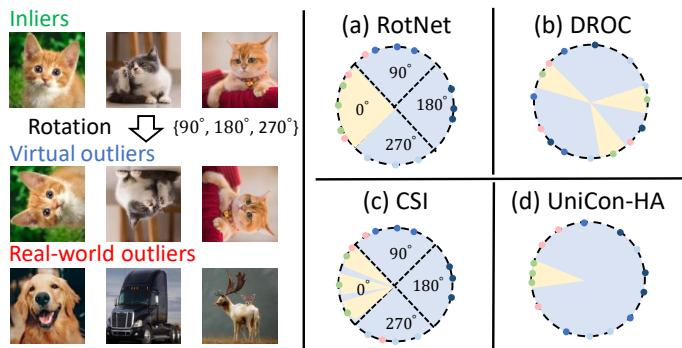
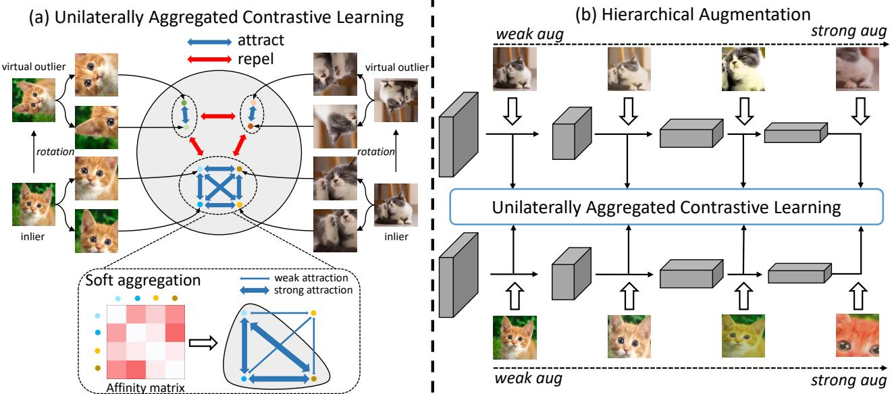

# Unilaterally Aggregated Contrastive Learning with Hierarchical Augmentation for Anomaly Detection

Guodong Wang1,2, Yunhong Wang2, Jie Qin3, Dongming Zhang4, Xiuguo Bao4, Di Huang1,2\* 1State Key Laboratory of Software Development Environment, Beihang University, Beijing, China 2School of Computer Science and Engineering, Beihang University, Beijing, China 3College of Computer Science and Technology, NUAA, Nanjing, China 4Natl. Comp. Net. Emer. Resp. Tech. Team/Coord. Ctr. of China, Beijing, China {wanggd,yhwang,dhuang}@buaa.edu.cn, qinjiebuaa@gmail.com, zhdm@cert.org.cn, baoxiuguo@139.com

## Abstract

Anomaly detection (AD), aiming tofind samples that deviate from the training distribution, is essential in safetycritical applications. Though recent self-supervised learning based attempts achieve promising results by creating virtual outliers, their training objectives are less faithful to AD which requires a concentrated inlier distribution as well as a dispersive outlier distribution. In this paper, we propose Unilaterally Aggregated Contrastive Learning with Hierarchical Augmentation (UniCon-HA), taking into account both the requirements above. Specifically, we explicitly encourage the concentration of inliers and the dispersion of virtual outliers via supervised and unsupervised contrastive losses, respectively. Considering that standard contrastive data augmentationfor generating positive views may induce outliers, we additionally introduce a soft mechanism to re-weight each augmented inlier according to its deviation from the inlier distribution, to ensure a purified concentration. Moreover, to prompt a higher concentration, inspired by curriculum learning, we adopt an easy-to-hard hierarchical augmentation strategy andperform contrastive aggregation at different depths of the network based on the strengths of data augmentation. Our method is evaluated under three AD settings including unlabeled one-class, unlabeled multi-class, and labeled multi-class, demonstrating its consistent superiority over other competitors.

## 1. Introduction

Anomaly detection (AD), a.k.a. outlier detection, aims to find anomalous observations that considerably deviate from the normality, with a broad range of applications, e.g. defect detection [4] and medical diagnosis [45]. Due to the inaccessibility of real-world outliers, it is typically required to develop outlier detectors solely based on in-distribution data (inliers). Conventional methods [7, 32, 30, 42, 68, 65] leverage generative models to fit the distribution by assigning high densities to inliers; however, they make use of raw images and are fragile caused by background statistics [42] or pixel correlations [30], unexpectedly assigning higher likelihoods to unseen outliers than inliers.

  
Figure 1: The decision regions (light yellow) of RotNet [26], DROC [49], CSI [51] and our UniCon-HA with rotation used to create virtual outliers. (a) RotNet models the inlier distribution by predicting rotation angles through a 4- way classifier; (b) DROC performs instance discrimination within the union of inliers and their rotations, resulting in a uniform distribution of data points; (c) CSI combines contrastive learning with a rotation classifier, enclosing a subregion for inliers; (d) Our UniCon-HA explicitly promotes the concentration of inliers and the dispersion of rotated virtual outliers, yielding the most compact decision region.

Alternatively, discriminative models [52, 47, 16, 43] describe the support of the training distribution using classifiers, circumventing the complicated process of density estimation. Furthermore, some studies [18, 26, 3] observe improved performance with the introduction of virtual outliers1, followed by a series of methods [49, 51, 61] exploring outliers in a more effective way. For example, classification-based AD methods [18, 26, 3] rely on transformations to generate virtual outliers for creating pretext tasks, with rotation prediction being the most effective. Recently, DROC [49] models the union of inliers and rotated ones via contrastive learning. CSI [51] combines contrastive learning with an auxiliary classification head for predicting rotations, further boosting the performance. Overall, these methods deliver better results than their counterparts without using rotation; unfortunately, their imperfect adaptation to AD leaves much room for improvement.

We remark that a good representation distribution for AD requires: (a) a compact distribution for inliers and (b) a dispersive distribution for (virtual) outliers. From our view, the existing methods [26, 49, 51] demonstrate unsatisfactory performance due to the lack of a comprehensive consideration of both aspects. RotNet [26] learns representations which only guarantee that they are distinguishable between labels, i.e. four rotation angles {0◦, 90◦, 180◦, 270◦}, resulting in less compact concentration for inliers and less dispersive distribution for outliers shown in Fig. 1(a). Though DROC [49] explicitly enlarges the instance-level distance via contrastive learning and generates a dispersive distribution for outliers, it inevitably pushes inliers away from each other, failing to meet the requirement of a compact inlier distribution [50] (Fig. 1(b)). CSI [51] extends DROC with a rotation classification head which restricts inliers to a sub-region determined by separating hyperplanes, making inliers lumped to some extent (Fig. 1(c)), but the insufficient degree of concentration by the predictor limits its potential.

We also notice a growing trend [41, 21, 63] in leveraging models pre-trained on large-scale datasets (e.g. ImageNet [12]) for AD. However, strictly speaking, they deviate from the objective of AD that outliers stem from an unknown distribution and similar outliers are unseen in training.

In this work, we focus on a strict setting where AD models are trained from scratch using inliers only. We present a novel method for AD based on contrastive learning, named Unilaterally Aggregated Contrastive Learning with Hierarchical Augmentation (UniCon-HA), to fulfill the goal of inlier concentration and outlier dispersion (Fig. 1(d)). The term unilaterally refers to the aggregation applied to inliers only. For inlier concentration, different from other contrastive learning-based AD alternatives [61, 48, 51, 49] that universally perform instance discrimination within the whole training set regardless of inliers or outliers, we take all inliers as one class and pull them together while push outliers away. For outlier dispersion, we perform instance discrimination within all virtual outliers to disperse them around the latent space unoccupied by inliers. Furthermore, considering that the standard augmentation pipeline for generating multiple positive views probably induces outliers as false positives [59, 1] (e.g. random crop at background regions), we propose to aggregate augmented views of inliers with a soft mechanism based on the magnitude of deviation from the inlier distribution, with distant samples assigned with lower weights. Finally, to prompt a higher concentration for inliers, inspired by curriculum learning (CL) [2], we adopt an easy-to-hard hierarchical augmentation and perform aggregation at different network depths based on the strengths of data augmentation. Notably, our formulation is free from any auxiliary branches for transformation prediction [51, 18] or pre-trained models [5, 15]. We evaluate our method in three typical AD scenarios including one-class, unlabeled multi-class, and labeled multi-class settings. Additionally, the results can be further improved with the introduction of outlier exposure (OE) [25], which is previously deemed harmful in contrastive learning-based CSI [51].

Our main contributions are three-fold:

• We present a novel contrastive learning method for AD, simultaneously encouraging the concentration for inliers and the dispersion for outliers, with soft aggregation to suppress the influence of potential outliers induced by data augmentation.

• For a higher concentration of inliers, we propose an easy-to-hard hierarchical augmentation strategy and perform contrastive aggregation distributed in the network where deeper layers are responsible for aggregation under stronger augmentations.

• Experimental results demonstrate the consistent improvement of our method over state-of-the-art competitors under various AD scenarios.

## 2. Related Work

Anomaly Detection. Recent efforts on AD can be broadly categorized as (a) reconstruction-based [56, 19, 54], (b) generative [7, 32, 42, 30], (c) discriminative [52, 46] and (d) self-supervised methods [51, 26, 49]. Generative methods model the density of training data, and examples situated in low-density regions are deemed as outliers. Unfortunately, the curse of dimensionality hinders accurate distribution estimation. Deep generative methods [30, 42] prove effective in high-dimensional data; however, they work on raw images and still suffer from background statistics [42] or pixel correlations [30]. One-class support vector machine (OC-SVM) [46] and support vector data description (SVDD) [52] are classic discriminative representatives for AD. While they are powerful with non-linear kernels, their performance is limited to the quality of underlying data representations. Early attempts on AD [52, 46] rely on kernel tricks and hand-crafted feature engineering, but recent ones [16, 62, 40, 44, 43] advocate the capability of deep neural networks to automatically learn high-level representations, outperforming their kernel-based counterparts. However, naive training results in a trivial solution with a constant mapping, a.k.a. hypersphere collapse. Previous methods regularize learning by introducing architectural constraints [43], auto-encoder pre-training [43, 44] etc, among which introducing outliers [51, 49, 26, 18, 25, 44, 33] is the most effective to prevent from hypersphere collapse [43]. Building upon the success of self-supervised learning, recent progress [51, 49, 61, 48] is made by adapting contrastive learning to AD with improved performance reported. For example, DROC [49] and CSI [51] leverage distributional augmentation $( e . g .$ , rotation) to simulate real-world outliers and model the inlier distribution by contrasting original samples with these simulated outliers. However, the learned representation is uniformly distributed on the hypersphere, contradicting the core principle of AD, which emphasizes that the inlier distribution should remain compact against outliers [43, 52]. Hence, to align contrastive learning more harmoniously with AD, we modify the optimization objective: unlike prior work [51, 49] performing instance discrimination within all training data (comprising both inliers and virtual outliers), our method explicitly encourages the concentration of inliers and the dispersion of outliers. This adaptation better adheres to the principles of AD.

Self-supervised Learning. Self-supervised learning (SSL), a generic learning framework that automatically generates data labels via either creating pretext tasks or performing contrastive learning, has achieved notable successes in enhancing visual representation learning. Common pretext tasks include predicting image rotations [17] or patch positions [13], coloring images [66] and solving jigsaw puzzles [37, 57], etc. In addition to hand-crafted designs for pretext tasks, contrastive learning [23, 10] serves as an alternative in the form of instance discrimination for generic representation learning, benefiting a diversity of downstream vision tasks, such as image recognition and object detection. As opposed to vanilla contrastive learning where each instance itself forms a category, SupCLR [29], a supervised extension of contrastive learning, considers multiple positive samples tagged by discriminative labels to help with pulling together intra-class points while pushing apart inter-class ones. This consistently surpasses the performance of the cross-entropy (CE) loss. Aligning with the core concept of AD that inliers are concentrated and outliers are dispersed, this work capitalizes on the advantages of both supervised and unsupervised contrastive learning by explicitly pulling together inliers and pushing apart outliers, respectively.

## 3. Method

In this section, we first revisit the preliminaries of unsupervised and supervised contrastive learning. Then we introduce our AD method based on contrastive learning, which is specialized to optimize the concentration of inliers and dispersion of virtual outliers along with a soft mechanism to ensure a purified concentration. Moreover, we leverage an easy-to-hard hierarchical augmentation to prompt a higher concentration of inliers along the network layers.

## 3.1. Preliminaries

Unsupervised Contrastive Learning. Unsupervised contrastive learning aims to learn representations from unlabeled data. The premise is that similar samples as positive pairs are supposed to have similar representations. The practical way to create positive pairs is to apply random augmentation to the same sample independently, e.g. two crops of the same image or multi-modal views of the same scene. Formally, let x be an anchor, $D _ { x } ^ { + }$ and $D _ { x } ^ { - }$ be the sets of positive and negative samples w.r.t. x, respectively. We consider the following common form of the contrastive loss:

$$
\begin{array} { l } { \displaystyle \mathcal { L } _ { \mathrm { c o n s } } ( x , D _ { x } ^ { + } , D _ { x } ^ { - } ) : = } \\ { \displaystyle - \frac { 1 } { | D _ { x } ^ { + } | } \sum _ { x ^ { \prime } \in D _ { x } ^ { + } } \log \frac { e ^ { z ( x ^ { \prime } ) ^ { T } z ( x ) / \tau } } { \sum _ { x ^ { \prime } \in D _ { x } ^ { + } \cup D _ { x } ^ { - } } e ^ { z ( x ^ { \prime } ) ^ { T } z ( x ) / \tau } } , } \end{array}\tag{1}
$$

where $| D _ { x } ^ { + } |$ denotes the cardinality of $D _ { x } ^ { + } , z ( \cdot )$ extracts the ℓ2-normalized representation of x and $\tau > 0$ is a temperature hyper-parameter. We, in this work, specifically consider the simple contrastive learning framework $i . e .$ . Sim-CLR based on instance discrimination. For a batch of unlabeled images $\boldsymbol { B } : = \{ x \} _ { i = 1 } ^ { N }$ , we first apply a composition of pre-defined identity-preserving augmentations $\tau$ to construct two views $\tilde { x } _ { i } ^ { 1 } : = t _ { 1 } ( x _ { i } )$ and $\tilde { x } _ { i } ^ { 2 } : = t _ { 2 } ( x _ { i } )$ of the same instance $x _ { i } ,$ , where $t _ { 1 } , t _ { 2 } \sim \tau$ . The contrastive loss of Sim-CLR is defined as follows:

$$
\begin{array} { r l r } & { } & { \mathcal { L } _ { \mathrm { S i m C L R } } ( \boldsymbol { B } ; \mathcal { T } ) = \displaystyle \frac { 1 } { 2 N } \sum _ { i = 1 } ^ { N } \mathcal { L } _ { \mathrm { c o n s } } ( \tilde { x } _ { i } ^ { 1 } , \{ \tilde { x } _ { i } ^ { 2 } \} , \tilde { B } - \{ \tilde { x } _ { i } ^ { 1 } , \tilde { x } _ { i } ^ { 2 } \} ) } \\ & { } & { + \mathcal { L } _ { \mathrm { c o n s } } ( \tilde { x } _ { i } ^ { 2 } , \{ \tilde { x } _ { i } ^ { 1 } \} , \tilde { B } - \{ \tilde { x } _ { i } ^ { 2 } , \tilde { x } _ { i } ^ { 1 } \} ) , } \end{array}\tag{2}
$$

where $\tilde { B } : = \tilde { B } ^ { 1 } \cup \tilde { B } ^ { 2 } , \tilde { B } ^ { 1 } : = \{ \tilde { x } ^ { 1 } \} _ { i = 1 } ^ { N }$ and $\tilde { B } ^ { 2 } : = \{ \tilde { x } ^ { 2 } \} _ { i = 1 } ^ { N } .$ In this case, $D _ { \tilde { x } _ { i } ^ { 1 } } ^ { + } : = \{ \tilde { x } _ { i } ^ { 2 } \} , \ D _ { \tilde { x } _ { i } ^ { 2 } } ^ { + } : = \{ \tilde { x } _ { i } ^ { 1 } \}$ and $D _ { \tilde { x } _ { i } ^ { 2 } } ^ { - } =$ $D _ { \tilde { x } _ { i } ^ { 1 } } ^ { - } : = \tilde { B } - \{ \tilde { x } _ { i } ^ { 2 } , \tilde { x } _ { i } ^ { 1 } \}$

Supervised Contrastive Learning. SupCLR [29] is a supervised extension of SimCLR by considering class labels. Different from the unsupervised contrastive loss in Eq. 1 where each sample has only one positive sample, i.e. the augmented view of itself, there are multiple positive samples sharing the same class label, resulting in multiple clusters in the representation space corresponding to their labels. Formally, given a batch of labeled training samples $\mathcal { C } : = \{ ( x _ { i } , y _ { i } ) \} _ { i = 1 } ^ { N }$ with class label $y _ { i } \in \mathcal { V } , \tilde { \mathcal { C } } ^ { 1 } : =$ $\{ ( \tilde { x } _ { i } ^ { 1 } , y _ { i } ) | \tilde { x } _ { i } ^ { 1 } \in \tilde { B } ^ { 1 } \} _ { i = 1 } ^ { N }$ and $\tilde { \mathcal { C } } ^ { 2 } : = \{ ( \tilde { x } _ { i } ^ { 2 } , y _ { i } ) | \tilde { x } _ { i } ^ { 2 } \in \tilde { B } ^ { 2 } \} _ { i = 1 } ^ { N }$ are the two sets of augmented views. The supervised contrastive loss is given as follows:

  
Figure 2: Overview of the proposed UniCon-HA for anomaly detection: (a) we explicitly encourage concentration of inliers and dispersion of virtual outliers generated by distributionally-shifted transformations with rotation being an example. To ensure a purified inlier concentration, we propose soft aggregation to re-weight each view of inliers generated by standard data augmentation e.g. random crop, based on its average similarities with all other inliers; (b) to prompt a higher concentration, we employ an easy-to-hard hierarchical augmentation strategy and distribute contrastive aggregation at different stages of the network based on the strengths of data augmentations.

$$
\mathcal { L } _ { \mathrm { S u p C L R } } ( \mathcal { C } ; \mathcal { T } ) = \frac { 1 } { 2 N } \sum _ { i = 1 } ^ { 2 N } \mathcal { L } _ { \mathrm { c o n s } } ( \tilde { x } _ { i } , D _ { x _ { i } } ^ { + } , D _ { x _ { i } } ^ { - } ) ,\tag{3}
$$

where $D _ { \tilde { x } _ { i } } ^ { + } : = \{ x | ( x , y _ { i } ) \in \tilde { \mathcal { C } } ^ { 1 } \cup \tilde { \mathcal { C } } ^ { 2 } \} - \{ \tilde { x } _ { i } \}$ and $D _ { \tilde { x } _ { i } } ^ { - } : =$ $\tilde { B } - \{ \tilde { x } _ { i } \} - D _ { \tilde { x } _ { i } } ^ { + }$

## 3.2. Unilaterally Aggregated Contrastive Learning

Recall that a good representation distribution for AD entails a concentrated grouping of inliers and an appropriate dispersion of outliers. Given that only inliers are available for training, a natural question arises: how to obtain outliers? Due to the inaccessibility of real-world outliers, some attempts are investigated to create virtual outliers, aiming at a trade-off in various manners, such as through transformations [51, 3, 26, 33] or by sourcing them from additional datasets, known as OE [25]. These methods, relying on virtual outliers, display the superiority over their counterparts based on inliers only; however, they all fall short in fully addressing both the requirements of a good representation distribution for AD.

Following the success of introducing virtual outliers, in this work, we directly treat the goal of encouraging inlier concentration and outlier dispersion as the optimization objective via a pure contrastive learning framework. We particularly design a novel contrastive loss, namely UniCLR, to unilaterally aggregate inliers and disperse outliers. Different from the existing contrastive learning methods for AD [49, 48, 61, 51] that equally treat each instance from inliers and virtual outliers as one class and perform universal instance discrimination, we take all inliers as one class while each outlier itself a distinct class.

Formally, given a training inlier set $\mathcal { D } _ { \mathrm { i n } }$ , we first apply distributionally-shifted augmentation S, e.g. rotation, to inliers to create a set of virtual outliers ${ \mathcal { D } } _ { \mathrm { v o u t } } \equiv \{ s ( x ) | x \in$ ${ \mathcal { D } } _ { \mathrm { i n } } \ \wedge s \in S \}$ . Note that $\mathcal { D } _ { \mathrm { i n } }$ and ${ \mathcal { D } } _ { \mathrm { v o u t } }$ are disjoint. For each image $x _ { i } ~ \in ~ { \mathcal { D } } _ { \mathrm { i n } } / { \mathcal { D } } _ { \mathrm { v o u t } }$ , we further apply identitypreserving augmentations T to create two views of $x _ { i }$ and finally obtain $\mathcal { \tilde { D } } _ { \mathrm { i n } } : = \tilde { \mathcal { D } } _ { \mathrm { i n } } ^ { 1 } \cup \tilde { \mathcal { D } } _ { \mathrm { i n } } ^ { 2 }$ and $\tilde { \mathcal { D } } _ { \mathrm { v o u t } } : = \tilde { \mathcal { D } } _ { \mathrm { v o u t } } ^ { 1 } \cup \tilde { \mathcal { D } } _ { \mathrm { v o u t } } ^ { 2 } ,$ based on which we prepare a batch $\tilde { B } : = \tilde { \mathcal { D } } _ { \mathrm { i n } } \cup \tilde { \mathcal { D } } _ { \mathrm { v o u t } }$ for training. The contrastive objective is given as:

$$
\mathcal { L } _ { \mathrm { U n i C L R } } ( \mathcal { D } _ { \mathrm { i n } } \cup \mathcal { D } _ { \mathrm { v o u t } } ; \mathcal { T } ) = \frac { 1 } { | \tilde { B } | } \sum _ { i = 1 } ^ { | \mathcal { D } _ { \mathrm { i n } } | + | \mathcal { D } _ { \mathrm { v o u t } } | } \mathcal { L } _ { \mathrm { U n i C L R } } ^ { i } ,\tag{4}
$$

$$
\begin{array} { r } { \mathcal { L } _ { \mathrm { U n i C L R } } ^ { i } = \left\{ \begin{array} { c } { \mathcal { L } _ { \mathrm { c o n s } } ( \tilde { x } _ { i } ^ { 1 } , \tilde { \mathcal { D } } _ { \mathrm { i n } } - \{ \tilde { x } _ { i } ^ { 1 } \} , \tilde { \mathcal { D } } _ { \mathrm { v o u t } } ) + } \\ { \mathcal { L } _ { \mathrm { c o n s } } ( \tilde { x } _ { i } ^ { 2 } , \tilde { \mathcal { D } } _ { \mathrm { i n } } - \{ \tilde { x } _ { i } ^ { 2 } \} , \tilde { \mathcal { D } } _ { \mathrm { v o u t } } ) , x _ { i } \in \mathcal { D } _ { \mathrm { i n } } , } \\ { \mathcal { L } _ { \mathrm { c o n s } } ( \tilde { x } _ { i } ^ { 1 } , \{ \tilde { x } _ { i } ^ { 2 } \} , \tilde { \mathcal { B } } - \{ \tilde { x } _ { i } ^ { 2 } , \tilde { x } _ { i } ^ { 1 } \} ) + } \\ { \mathcal { L } _ { \mathrm { c o n s } } ( \tilde { x } _ { i } ^ { 2 } , \{ \tilde { x } _ { i } ^ { 1 } \} , \tilde { \mathcal { B } } - \{ \tilde { x } _ { i } ^ { 1 } , \tilde { x } _ { i } ^ { 2 } \} ) , x _ { i } \in \mathcal { D } _ { \mathrm { v o u t } } . } \end{array} \right. } \end{array}\tag{5}
$$

Our formulation is structurally similar to SimCLR (Eq. 2) and SupCLR (Eq. 3), with some modifications for AD in consideration of both inlier aggregation and outlier dispersion. Though our method is originally designed for inliers without class labels, it can be easily extended to the labeled multi-class setting where inliers sharing the same label are positive views of each other while samples from either other classes or augmented by $s$ are negative.

Soft Aggregation. Data augmentation plays a central role in contrastive representation learning [10]. Though the commonly adopted augmentation pipeline in contrastive learning has witnessed the advanced progress in diverse downstream tasks, we observe that excessive distortion applied on the images inevitably shifts the original semantics, inducing outlier-like samples [59, 1]. Aggregating these semantic-drifting samples hinders the inlier concentration. A straightforward solution is to restrict the augmentation strength and apply weak augmentations to inliers; however, it cannot guarantee learning class-separated representations, $i . e .$ reliably aggregating different instances with similar semantics [22, 60]. To take advantage of the diverse samples by strong augmentations while diminishing the side effects of outliers, we propose to aggregate augmented views of inliers with a soft mechanism based on the magnitude of deviation from the inlier distribution, and follow the notions defined in Eq. 1 to formulate it as follows:

$$
\begin{array} { r l } & { \mathcal { L } _ { \mathrm { s o f t \_ c o n s } } ( x , D _ { x } ^ { + } , D _ { x } ^ { - } ) : = } \\ & { - \frac { 1 } { \sum _ { x ^ { \prime } \in D _ { x } ^ { + } } w _ { x } w _ { x ^ { \prime } } } \displaystyle \sum _ { x ^ { \prime } \in D _ { x } ^ { + } } \log \frac { w _ { x } w _ { x ^ { \prime } } e ^ { z ( x ^ { \prime } ) ^ { T } z ( x ) / \tau } } { \sum _ { x ^ { \prime } \in D _ { x } ^ { + } \cup D _ { x } ^ { - } } e ^ { z ( x ^ { \prime } ) ^ { T } z ( x ) / \tau } } , } \end{array}\tag{6}
$$

where $w _ { x }$ is the soft weight indicating the importance of sample x in aggregation. According to Eq. 6, a positive pair of x and $x ^ { \prime }$ receives more attention only if the corresponding $w _ { x }$ and $w _ { x ^ { \prime } }$ are both sufficiently large. Specifically, we measure $w _ { x } ( w _ { x ^ { \prime } } )$ for $x ( x ^ { \prime } )$ by calculating the normalized average similarities with other inliers, i.e. $D _ { x } ^ { + }$ , as follows:

$$
\omega _ { x _ { i } } = \frac { \sum _ { x _ { j } \in D _ { x } ^ { + } \backslash \left\{ x _ { i } \right\} } e ^ { z \left( x _ { i } \right) ^ { T } z \left( x _ { j } \right) / \tau _ { \omega } } } { \sum _ { x _ { k } \in D _ { x } ^ { + } } \sum _ { x _ { j } \in D _ { x } ^ { + } \backslash \left\{ x _ { k } \right\} } e ^ { z \left( x _ { k } \right) ^ { T } z \left( x _ { j } \right) / \tau _ { \omega } } } ,\tag{7}
$$

where $\tau _ { \omega }$ controls the sharpness of the weight distribution. Intuitively, if one is away from all other inliers, there is a

high probability that it is an outlier and vice versa. We apply soft aggregation (SA) only on inliers, i.e., replacing ${ \mathcal { L } } _ { \mathrm { c o n s } }$ with $\mathcal { L } _ { \mathrm { { s o f t \_ c o n s } } }$ only for $x _ { i } \in \mathcal { D } _ { \mathrm { i n } }$ in Eq. 5.

## 3.3. Hierarchical Augmentation

Though the proposed UniCLR is reasonably effective for aggregating inliers and separating them from outliers, one can further improve the performance by prompting a more concentrated distribution for inliers. Inspired by the success of deep supervision in classification, we propose to aggregate inliers with hierarchical augmentation (HA) at different depths of the network based on the strengths of data augmentation. In alignment with the feature extraction process that shallow layers learn low-level features while deep layers emphasize more on high-level task-related semantic features, motivated by curriculum learning (CL) [2], we set stronger augmentation strengths for deeper layers and vice versa, aiming at capturing the distinct representations of inliers from low-level properties and high-level semantics at shallow and deep layers, respectively. To this end, we apply a series of augmentations at different network stages and gradually increase the augmentation strength as the network goes deep. Each stage is responsible for unilaterally aggregating inliers and dispersing virtual outliers generated with the corresponding augmentation strengths.

Formally, we have four sets of augmentation $T _ { i }$ , corresponding to four stages $r e s _ { i }$ in ResNet [24]. Each $T _ { i }$ is composed of the same types of augmentations but with different augmentation strengths. Extra projection heads $g _ { i }$ are additionally attached at the end of $r e s _ { i }$ to down-sample and project the feature maps with the same shape as in the last stage. With $T _ { 1 } ~ \sim ~ T _ { 4 }$ applied to inliers $\mathcal { D } _ { \mathrm { i n } }$ and outliers ${ \mathcal { D } } _ { \mathrm { v o u t } }$ , we extract their features $z _ { i } ( x )$ with res and $g _ { i }$

$$
z _ { i } ( x ) = g _ { i } ( r e s _ { i } ( T _ { i } ( x ) ) ) , i = 1 , 2 , 3 , 4 .\tag{8}
$$

Based on the features extracted by projector $g _ { i }$ , we separately perform unilateral aggregation for inliers and dispersion for outliers at each stage. The overall training loss can be formulated as:

$$
\mathcal { L } _ { \mathrm { a l l } } = \frac { 1 } { 4 } \sum _ { i = 1 } ^ { 4 } \lambda _ { i } \mathcal { L } _ { \mathrm { U n i C L R } } ( \mathcal { D } _ { \mathrm { i n } } \cup \mathcal { D } _ { \mathrm { v o u t } } ) ; T _ { i } ) ,\tag{9}
$$

where $\lambda _ { i }$ balances the loss at different network stages.

Through enforcing supervision in shallow layers, the resulting inlier distribution under the strong augmentation becomes more compact and more distinguishable from outliers.

## 3.4. Inference

During testing, we remove all four projection heads $g _ { i }$ While the existing methods [51, 48] depend on specially designed detection score functions to obtain decent results, we observe that using the simple cosine similarity with the nearest one in the learned feature space is sufficiently effective. The detection score $s _ { i }$ for a test example $x _ { i }$ is given as:

(a) One-class CIFAR-10.
<table><tr><td>Method</td><td>Network</td><td>Plane</td><td>Car</td><td>Bird</td><td>Cat</td><td>Deer</td><td>Dog</td><td>Frog</td><td>Horse</td><td>Ship</td><td>Truck</td><td>Mean</td></tr><tr><td>AnoGAN [45]</td><td>DCGAN</td><td>67.1</td><td>54.7</td><td>52.9</td><td>54.5</td><td>65.1</td><td>60.3</td><td>58.5</td><td>62.5</td><td>75.8</td><td>66.5</td><td>61.8</td></tr><tr><td>PLAD [8]</td><td>LeNet</td><td>82.5±0.4</td><td>80.8±0.9</td><td>68.8±1.2</td><td>65.2±1.2</td><td>71.6±1.1</td><td>71.2±1.6</td><td>76.4±1.9</td><td>73.5±1.0</td><td>80.6±1.8</td><td>80.5±0.3</td><td>75.1</td></tr><tr><td>Geom [18]</td><td>WRN-16-8</td><td>74.7</td><td>95.7</td><td>78.1</td><td>72.4</td><td>87.8</td><td>87.8</td><td>83.4</td><td>95.5</td><td>93.3</td><td>91.3</td><td>86.0</td></tr><tr><td>Rot* [26]</td><td>ResNet-18</td><td>78.3±0.2</td><td>94.3±0.3</td><td>86.2±0.4</td><td>80.8±0.6</td><td>89.4±0.5</td><td>89.0±0.4</td><td>88.9±0.4</td><td>95.1±0.2</td><td>92.3±0.3</td><td>89.7±0.3</td><td>88.4</td></tr><tr><td>Rot+Trans* [26]</td><td>ResNet-18</td><td>80.4±0.3</td><td>96.4±0.2</td><td>85.9±0.3</td><td>81.1±0.5</td><td>91.3±0.3</td><td>89.6±0.3</td><td>89.9±0.3</td><td>95.9±0.1</td><td>95.0±0.1</td><td>92.6±0.2</td><td>89.8</td></tr><tr><td>GOAD*[3]</td><td>ResNet-18</td><td>75.5±0.3</td><td>94.1±0.3</td><td>81.8±0.5</td><td>72.0±0.3</td><td>83.7±0.9</td><td>84.4±0.3</td><td>82.9±0.8</td><td>93.9±0.3</td><td>92.9±0.3</td><td>89.5±0.2</td><td>85.1</td></tr><tr><td>CSI [51]</td><td>ResNet-18</td><td>89.9±0.1</td><td>99.1±0.0</td><td>93.1±0.2</td><td>86.4±0.2</td><td>93.9±0.1</td><td>93.2±0.2</td><td>95.1±0.1</td><td>98.7±0.0</td><td>97.9±0.0</td><td>95.5±0.1</td><td>94.3</td></tr><tr><td>iDECODe [27]</td><td>WRN-16-8</td><td>86.5±0.0</td><td>98.1±0.0</td><td>86.0±0.5</td><td>82.6±0.1</td><td>90.9±0.1</td><td>89.2±0.1</td><td>88.2±0.4</td><td>97.8±0.1</td><td>97.2±0.0</td><td>95.5±0.1</td><td>91.2</td></tr><tr><td>SSD [48]</td><td>ResNet-50</td><td>82.7</td><td>98.5</td><td>84.2</td><td>84.5</td><td>84.8</td><td>90.9</td><td>91.7</td><td>95.2</td><td>92.9</td><td>94.4</td><td>90.0</td></tr><tr><td>NDA [9]</td><td>DCGAN</td><td>98.5</td><td>76.5</td><td>79.6</td><td>79.1</td><td>92.4</td><td>71.7</td><td>97.5</td><td>69.1</td><td>98.5</td><td>75.2</td><td>84.3</td></tr><tr><td>UniCon-HA</td><td>ResNet-18</td><td> $9 1 . 7 { \pm } 0 . 1 $ </td><td>99.2±0</td><td>93.9±0.1</td><td> $8 9 . 5 { \pm } 0 . 2 $ </td><td>95.1±0.1</td><td> $9 4 . 1 \pm 0 . 2 $ </td><td> $9 6 . 6 { \pm } 0 . 1 $ </td><td> $9 8 . 9 2 0 . 0 $ </td><td>98.1±0.0</td><td>96.6±0.1</td><td>95.4</td></tr><tr><td>UniCon-HA + OE</td><td>ResNet-18</td><td> $9 4 . 6 { \pm } 0 . 1 $ </td><td> ${ \bf 9 9 . 3 { \pm } 0 . 0 }$ </td><td> $9 6 . 2 \pm 0 . 1 $ </td><td> $\mathbf { 9 } 2 . 6 { \pm } 0 . 3 $ </td><td> ${ \bf 9 6 . 2 } \pm 0 . 2 $ </td><td> ${ \bf 9 6 . 6 { \pm 0 . 1 } }$ </td><td> $\mathbf { 9 7 . 9 2 } 0 . 0 $ </td><td> $\mathbf { 9 9 . 1 \pm 0 . 1 }$ </td><td> $\mathbf { 9 9 . 0 } \pm 0 . 0$ </td><td>97.5±0.2</td><td>96.9</td></tr></table>

<table><tr><td rowspan=1 colspan=6>(b) One-class CIFAR-100 (20 super-classes).</td></tr><tr><td rowspan=1 colspan=5>Method          Network</td><td rowspan=1 colspan=1>AUROC</td></tr><tr><td rowspan=1 colspan=5>GEOM [18]      WRN-16-8</td><td rowspan=1 colspan=1>78.7</td></tr><tr><td rowspan=2 colspan=5>Rot [26]          ResNet-18</td><td rowspan=1 colspan=1>79.7</td></tr><tr><td rowspan=1 colspan=1>Rot+Trans [26]</td><td></td></tr><tr><td></td><td rowspan=2 colspan=3></td><td></td><td></td></tr><tr><td></td><td rowspan=1 colspan=2>ResNet-18</td><td rowspan=1 colspan=1>79.8</td></tr><tr><td rowspan=1 colspan=1>GOAD [3]</td><td></td><td rowspan=1 colspan=3>ResNet-18</td><td rowspan=1 colspan=1>74.5</td></tr><tr><td rowspan=1 colspan=5>CSI [51]         ResNet-18</td><td rowspan=1 colspan=1>89.6</td></tr><tr><td rowspan=1 colspan=5>UniCon-HA     ResNet-18</td><td rowspan=1 colspan=1>92.4</td></tr></table>

(c) One-class ImageNet-30.
<table><tr><td>Method</td><td>Network</td><td>AUROC</td></tr><tr><td>Rot [26]</td><td>ResNet-18</td><td>65.3</td></tr><tr><td>Rot+Attn [26]</td><td>ResNet-18</td><td>81.6</td></tr><tr><td>Rot+Trans+Attn [26]</td><td>ResNet-18</td><td>84.8</td></tr><tr><td>Rot+Trans+Attn+Resize [26]</td><td>ResNet-18</td><td>85.7</td></tr><tr><td>CSI [51]</td><td>ResNet-18</td><td>91.6</td></tr><tr><td>UniCon-HA</td><td>ResNet-18</td><td>93.2</td></tr></table>

Table 1: AUROC scores on one-class (a) CIFAR-10, (b) CIFAR-100 (20 super-classes) and (c) ImageNet-30. For CIFAR-10, we report the means and standard deviations of AUROC averaged over five trials. ∗ denotes the values from CSI [51].

$$
s _ { i } ( x _ { i } ; \{ x _ { m } \} ) = \operatorname* { m a x } _ { m } \mathrm { c o s i n e } ( f ( x _ { i } ) , f ( x _ { m } ) ) ,\tag{10}
$$

where $\{ x _ { m } \}$ denotes the set of training samples and $f ( \cdot )$ extracts the $\ell _ { 2 }$ normalized representation at the end of res . Following [51, 3], we observe improved performance using an ensemble of representations by test-time augmentation.

## 4. Experiments

We compare our method with the state-of-the-art across three AD settings: unlabeled one-class, unlabeled multiclass, and labeled multi-class. Our method is also evaluated on the realistic MvTec-AD dataset [4]. The area under the receiver operating characteristic curve (AUROC) is adopted as the evaluation metric.

## 4.1. Implementation Details

We use ResNet-18 [24] for all experiments to ensure fair comparison with [51, 49]. Our models are trained from scratch using SGD for 2,048 epochs, and the learning rate is set to 0.01 with a single cycle of cosine learning rate decay. Following [10], we employ a combination of random resized crop, color jittering, horizontal flip and gray-scale with increasing augmentation strengths for $T _ { 1 } \sim T _ { 4 }$ to generate positive views while use rotation $\{ 9 0 ^ { \circ } , 1 8 0 ^ { \circ } , 2 7 0 ^ { \circ } \}$ as the default $s$ to create virtual outliers. Thus, $\mathcal { D } _ { \mathrm { i n } }$ comprises all original training samples and $| \mathcal { D } _ { \mathrm { o u t } } |$ triples $| \mathcal { D } _ { \mathrm { i n } } |$ by applying $s \in S$ on $x \in \mathcal { D } _ { \mathrm { i n } }$ . We maintain a 1:3 ratio of inliers to virtual outliers during mini-batch training. Detailed augmentation configurations are available in the supplementary material. We exclusively apply SA at the last residual stage, i.e. res4 where the strongest augmentations are employed. We set τ and $\tau _ { \omega }$ as 0.5. For OE [25], we use 80 Million Tiny Images [53] as the auxiliary dataset, excluding images from CIFAR-10.

## 4.2. Results

Unlabeled One-class. In this setting, a single class serves as the inlier, while the remaining classes act as outliers. Following [26, 51, 49, 3], the experiments are performed on CIFAR-10 [31], CIFAR-100 (20 superclasses) [31] and ImageNet-30 [26]. In Tab. 1, we present a comprehensive comparison of our method with a range of alternatives including one-class classifiers, reconstructionbased methods and SSL methods. Notably, SSL methods using virtual outliers generated by shifting transformations such as rotation and translation, yield favorable results compared to those specifically tailored for one-class learning. Thanks to UniCLR with HA, we achieve enhanced performance across all the three datasets. Moreover, introducing supervision through Outlier Exposure (OE) [25] nearly solves the CIFAR-10 task, which is previously regarded as less effective in the contrastive based AD method [51]. We attribute the success to our contrastive aggregation strategy, which shapes a more focused inlier distribution when more outliers introduced.

(a) Unlabeled CIFAR-10.
<table><tr><td>Method</td><td>Network</td><td>SVHN</td><td>LSUN</td><td></td><td>ImageNet LSUN (FIX)</td><td>ImageNet (FIX)</td><td>CIFAR-100</td><td>Interp.</td></tr><tr><td>Rot [26]</td><td>ResNet-18 97.6±0.2</td><td></td><td> $8 9 . 2 { \pm } 0 . 7 $ </td><td> $9 0 . 5 { \pm } 0 . 3 $ </td><td> $7 7 . 7 { \pm } 0 . 3 $ </td><td> $8 3 . 2 \pm 0 . 1 $ </td><td> $7 9 . 0 { \pm } 0 . 1 $ </td><td> $6 4 . 0 { \scriptstyle \pm 0 . 3 }$ </td></tr><tr><td>Rot+Trans [26]</td><td>ResNet-18</td><td> $9 7 . 8 { \pm } 0 . 2 $ </td><td> $9 2 . 8 { \pm } 0 . 9$ </td><td> $9 4 . 2 { \pm } 0 . 7 $ </td><td> $8 1 . 6 { \pm } 0 . 4 $ </td><td> $8 6 . 7 \pm 0 . 1 $ </td><td> $8 2 . 3 { \pm } 0 . 2 $ </td><td> $6 8 . 1 \pm 0 . 8 $ </td></tr><tr><td>GOAD [3]</td><td>ResNet-18</td><td> $9 6 . 3 { \pm } 0 . 2 $ </td><td> $8 9 . 3 { \pm } 1 . 5 $ </td><td> $9 1 . 8 { \pm } 1 . 2 $ </td><td> $7 8 . 8 { \pm } 0 . 3 $ </td><td> $8 3 . 3 { \pm } 0 . 1 $ </td><td> $7 7 . 2 { \pm } 0 . 3 $ </td><td> $5 9 . 4 \pm 1 . 1$ </td></tr><tr><td>CSI [51]</td><td>ResNet-18</td><td> ${ \bf 9 9 . 8 \pm 0 . 0 }$ </td><td> $9 7 . 5 { \pm } 0 . 3 $ </td><td> $9 7 . 6 { \pm } 0 . 3 $ </td><td> $9 0 . 3 { \pm } 0 . 3 $ </td><td> $9 3 . 3 { \pm } 0 . 1 $ </td><td> $8 9 . 2 { \pm } 0 . 1 $ </td><td> $7 9 . 3 { \pm } 0 . 2 $ </td></tr><tr><td>UniCon-HA</td><td> $\mathrm { R e s N e t { - } } 1 8$ </td><td> $9 9 . 5 { \pm } 0 . 1 $ </td><td> ${ \bf 9 8 . 5 } \pm 0 . 2 $ </td><td> $\mathbf { 9 8 . 3 } \pm \mathbf { 0 . 2 }$ </td><td> $9 3 . 3 { \pm } 0 . 3 $ </td><td> $9 7 . 8 { \pm } 0 . 1 $ </td><td> $9 0 . 3 { \pm } 0 . 3 $ </td><td> ${ \bf 8 0 . 7 \pm 0 . 2 }$ </td></tr><tr><td> $\mathrm { U n i C o n - H A + O E }$ </td><td> $\mathrm { R e s N e t { - } } 1 8$ </td><td> $9 9 . 2 { \pm } 0 . 0 $ </td><td> $9 7 . 8 { \pm } 0 . 2 $ </td><td> $9 5 . 8 \pm 0 . 1 $ </td><td> ${ \bf 9 5 . 8 \pm 0 . 4 }$ </td><td> ${ \bf 9 8 . 3 { \pm 0 . 2 } }$ </td><td> ${ \bf 9 1 . 6 { \pm } } 0 . 2$ </td><td> $8 0 . 1 \pm 0 . 1$ </td></tr></table>

<table><tr><td>Method</td><td>Network</td><td>CUB-200</td><td>Dogs</td><td>Pets</td><td>Flowers</td><td>Food-101</td><td>Places-365</td><td>Caltech-256</td><td>DTD</td></tr><tr><td>Rot [26]</td><td>ResNet-18 76.5</td><td></td><td>77.2</td><td>70.0</td><td>87.2</td><td>72.7</td><td>52.6</td><td>70.9</td><td>89.9</td></tr><tr><td>Rot+Trans [26]</td><td>ResNet-18 74.5</td><td></td><td>77.8</td><td>70.0</td><td>86.3</td><td>71.6</td><td>53.1</td><td>70.0</td><td>89.4</td></tr><tr><td>GOAD [3]</td><td>ResNet-18 71.5</td><td></td><td>74.3</td><td>65.5</td><td>82.8</td><td>68.7</td><td>51.0</td><td>67.4</td><td>87.5</td></tr><tr><td>CSI [51]</td><td>ResNet-18 90.5</td><td></td><td>97.1</td><td>85.2</td><td>94.7</td><td>89.2</td><td>78.3</td><td>87.1</td><td>96.9</td></tr><tr><td>UniCon-HA</td><td>ResNet-18 91.2</td><td></td><td>97.4</td><td>88.0</td><td>95.1</td><td>91.2</td><td>84.5</td><td>89.6</td><td>96.5</td></tr></table>

Table 2: AUROC scores on unlabeled (a) CIFAR-10 and (b) ImageNet-30. For CIFAR-10, we report the means and standard deviations of AUROC averaged over five trials.

Unlabeled Multi-class. This setting expands the oneclass dataset to a multi-class scenario, wherein images from different datasets are treated as outliers. In the case of CIFAR-10 as the inlier dataset, we consider SVHN [35], CIFAR-100 [31], ImageNet [34], LSUN [64], ImageNet (Fix), LSUN (Fix) and linearly-interpolated samples of CIFAR-10 (Interp.) [14] as potential outliers. ImageNet (Fix) and LSUN (Fix) are the modified versions of ImageNet and LSUN, designed to address easily detectable artifacts resulting from resizing operations. For ImageNet-30, we consider CUB-200 [55], Dogs [28], Pets [38], Flowers [36], Food-101 [6], Places-365 [67], Caltech256 [20] and DTD [11] as outlier. Tab. 2 shows that our UniCon-HA outperforms other counterparts on most benchmarks. Though the training set follows a multi-center distribution, the straightforward aggregation of all data into a single center proves remarkably effective in AD.

Labeled Multi-class. In the multi-class setting with labeled data, rather than treating all inliers as a single class, as seen in the previous scenarios, we designate inliers sharing identical labels as positives. Conversely, inliers with differing labels or those generated by distributionally-shifted augmentations are negatives. From Tab. 4, by incorporating labels into the UniCLR loss, our method not only improves the performance in unlabeled multi-class setting but also consistently surpasses other competitors that employ virtual outliers, i.e. RotNet [26], GEOM [18], CSI [51] and DROC [49]. It suggests that our method generalizes well to labeled multi-class inliers.

Realistic Dataset. Following DROC [49], we learn patch representations of 32×32. Tab. 3 shows that our method outperforms the counterparts that also incorporate rotation augmentation. Though CutPaste [33] exhibits better performance than ours, it is crucial to understand that CutPaste is specially designed for industrial anomaly localization, making it unsuitable for our settings. For instance, CutPaste only achieves 69.4% while ours reaches 95.4% in the one-class CIFAR-10 scenario.

<table><tr><td>Level</td><td>RotNet [26]</td><td>DROC [49]</td><td>CutPaste [33]</td><td>Ours</td></tr><tr><td>Image</td><td>71.0</td><td>86.5</td><td>95.2</td><td>89.8</td></tr><tr><td>Pixel</td><td>92.6</td><td>90.4</td><td>96.0</td><td>94.3</td></tr></table>

Table 3: Image/pixel-level AUROC scores on MVTec-AD.

## 4.3. Ablation Study

We conduct ablation studies on (a) various shifting transformations and (b) aggregation strategies: SA and HA.

Shifting Transformation. In contrast to CSI [51], we investigate various shifting transformations beyond rotation, including CutPerm [51], Gaussian blur, Gaussian noise and Sobel filtering. From Tab. 5, our method consistently outperforms CSI under different shifting transformations, with rotation being the most effective. One plausible explanation is that rotation creates more distinguishable negative samples from the original ones, facilitating the learning process. Notably, different from CSI [51] and RotNet [26], we do not learn to differentiate specific transformation types. It encourages the community to rethink the necessity of transformation prediction through a classifier, such as the task of 4-way rotation prediction. Please refer to the supplementary material for further analysis on additional transformations.

(a) Labeled CIFAR-10.
<table><tr><td>Method</td><td>Network</td><td>SVHN</td><td>LSUN</td><td>ImageNet</td><td>LSUN (FIX)</td><td>ImageNet (FIX)</td><td>CIFAR100</td><td>Interp.</td></tr><tr><td>SupCLR [29]</td><td>ResNet-18</td><td> $9 7 . 3 { \pm } 0 . 1 $ </td><td> $9 2 . 8 { \pm } 0 . 5 $ </td><td> $9 1 . 4 { \pm } 1 . 2 $ </td><td> $9 1 . 6 { \pm } 1 . 5 $ </td><td> $9 0 . 5 { \pm } 0 . 5 $ </td><td> $8 8 . 6 \pm 0 . 2 $ </td><td> $7 5 . 7 \pm 0 . 1 $ </td></tr><tr><td>CSI [51]</td><td> $\mathrm { R e s N e t { - } } 1 8$ </td><td> $9 7 . 9 2 0 . 1 $ </td><td> $9 7 . 7 { \pm } 0 . 4 $ </td><td> $9 7 . 6 { \pm } 0 . 3 $ </td><td> $9 3 . 5 { \pm } 0 . 4 $ </td><td> $9 4 . 0 { \pm } 0 . 1 $ </td><td> $9 2 . 2 { \pm } 0 . 1 $ </td><td> $8 0 . 1 { \pm } 0 . 3 $ </td></tr><tr><td>UniCon-HA  $\mathrm { U n i C o n - H A + O E }$ </td><td> $\mathrm { R e s N e t { - } } 1 8$ </td><td> ${ \bf 9 9 . 8 \pm 0 . 1 }$ </td><td> $\mathbf { 9 9 . 1 } \pm \mathbf { 0 . 2 }$ </td><td> ${ \bf 9 9 . 0 { \pm } 0 . 1 }$ </td><td> $9 4 . 2 { \pm } 0 . 3 $ </td><td> $9 7 . 9 { \pm } 0 . 4 $ </td><td> $9 2 . 9 2 \substack { 0 . 2 }$ </td><td> $8 3 . 4 { \pm } 0 . 3 $ </td></tr><tr><td></td><td> $\mathrm { R e s N e t { - } } 1 8$ </td><td> $9 8 . 8 { \pm } 0 . 2 $ </td><td> $9 8 . 6 { \pm } 0 . 3 $ </td><td> $9 7 . 9 { \pm } 0 . 2 $ </td><td> ${ \bf 9 5 . 5 } \pm 0 . 3$ </td><td> ${ \bf 9 8 . 2 \pm 0 . 2 }$ </td><td> ${ \bf 9 3 . 4 } { \pm 0 . 2 }$ </td><td> ${ \bf 8 3 . 5 } \pm 0 . 1 $ </td></tr></table>

<table><tr><td>Method</td><td>Network</td><td>CUB-200</td><td>Dogs</td><td>Pets</td><td>Flowers</td><td>Food-101</td><td>Places-365</td><td>Caltech-256</td><td>DTD</td></tr><tr><td>Rot [26]</td><td>ResNet-18</td><td>388.0</td><td>96.7</td><td>95.0</td><td>89.7</td><td>79.8</td><td>90.5</td><td>90.6</td><td>90.1</td></tr><tr><td>Rot+Trans [26]</td><td>ResNet-18 86.3</td><td></td><td>95.6</td><td>94.2</td><td>92.2</td><td>81.2</td><td>89.7</td><td>90.2</td><td>92.1</td></tr><tr><td>GOAD [3]</td><td>ResNet-18 93.4</td><td></td><td>97.7</td><td>96.9</td><td>96.0</td><td>87.0</td><td>92.5</td><td>91.9</td><td>93.7</td></tr><tr><td>CSI [51]</td><td>ResNet-18 94.6</td><td></td><td>98.3</td><td>97.4</td><td>96.2</td><td>88.9</td><td>94.0</td><td>93.2</td><td>97.4</td></tr><tr><td>UniCon-HA</td><td>ResNet-18 94.9</td><td></td><td>98.1</td><td>97.8</td><td>96.7</td><td>90.9</td><td>94.6</td><td>95.2</td><td>97.7</td></tr></table>

Table 4: AUROC scores on labeled (a) CIFAR-10 and (b) ImageNet-30. For CIFAR-10, we report the means and standard deviations of AUROC averaged over five trials.
<table><tr><td>Method</td><td>Perm</td><td>Sobel</td><td>Noise</td><td>Blur</td><td>Rotation</td></tr><tr><td>CSI [51]</td><td>90.7</td><td>88.3</td><td>89.3</td><td>89.2</td><td>94.3</td></tr><tr><td>UniCon-HA</td><td>92.1</td><td>90.4</td><td>90.8</td><td>89.8</td><td>95.4</td></tr></table>

Table 5: Ablation study for shifting transformations. Mean AUROC (%) values are reported on one-class CIFAR-10.
<table><tr><td rowspan="2">Row</td><td rowspan="2">SA</td><td rowspan="2">HA</td><td rowspan="2">Rot. Cls.</td><td>One-class</td><td colspan="2">Multi-class CIFAR-10</td></tr><tr><td>CIFAR-10</td><td>Unlabeled</td><td>Labeled</td></tr><tr><td>1</td><td></td><td></td><td>√</td><td>94.3</td><td>92.4</td><td>93.3</td></tr><tr><td>2</td><td></td><td>4</td><td>√</td><td>94.6</td><td>92.8</td><td>93.9</td></tr><tr><td>3</td><td></td><td>2-3-4</td><td>√</td><td>95.1</td><td>93.7</td><td>95.0</td></tr><tr><td>4</td><td>√</td><td>2-3-4</td><td>√</td><td>95.3</td><td>94.2</td><td>95.4</td></tr><tr><td>5</td><td></td><td></td><td></td><td>92.4</td><td>89.4</td><td>90.6</td></tr><tr><td>6</td><td></td><td>4</td><td></td><td>94.8</td><td>93.0</td><td>93.7</td></tr><tr><td>7</td><td>√</td><td>4</td><td></td><td>95.0</td><td>93.3</td><td>93.9</td></tr><tr><td>8</td><td></td><td>2-3-4</td><td></td><td>95.1</td><td>93.8</td><td>94.7</td></tr><tr><td>9</td><td>√</td><td>2-3-4</td><td></td><td>95.4</td><td>94.1</td><td>95.2</td></tr></table>

Table 6: Ablation study for SA and HA. Numbers in HA denote the residual stage(s) performing aggregation.

Aggregation Strategy. Beyond using the UniCLR loss, we also employ the SA and HA strategies to prompt a more purified and compact concentration of inliers, respectively. To assess the efficacy of each strategy, we establish two baselines: one with a rotation classifier and one without, conducting vanilla contrastive learning on the union of inliers and virtual outliers. The results in Tab. 6 indicate that both single-stage and multi-stage aggregations yield improved outcomes through SA. This underscores the benefits of mitigating the impact of the outliers generated by unexpected data augmentation, thereby purifying the inlier distribution. Tab. 6 reveals two pivotal observations regarding HA: firstly, the presence of UniCLR diminishes the impact of a rotation classifier (2,3,4 vs. 6,8,9), thanks to promoting inlier concentration and outlier dispersion. Secondly, enabling solely $r e s _ { 4 }$ for contrastive aggregation significantly improves baselines (1 vs. 2, or 5 vs. 6). Broadly, HA leads to a noteworthy and consistent gain when applied across more stages (2 vs. 3, or 6 vs. 8).

## 5. Conclusion

In this work, we address AD with only access to normal images during training. We underline that the concentration of inliers and the dispersion of outliers are two critical factors, which are achieved by a supervised and unsupervised contrastive loss, respectively. To ensure a purified inlier concentration, we propose a soft mechanism to reweight each view of inliers generated by data augmentation based on its deviation from the inlier distribution. To further prompt a compact inlier concentration, we adopt an easyto-hard HA and perform aggregation at different network depths based on augmentation strengths. Experiments on three typical AD settings with different benchmarks demonstrate the superiority of our method.

Acknowledgments. This work is partly supported by the National Key R&D Program of China (2021ZD0110503), the National Natural Science Foundation of China (62022011 and 62276129), the Research Program of State Key Laboratory of Software Development Environment, and the Fundamental Research Funds for the Central Universities.

## References

[1] Yalong Bai, Yifan Yang, Wei Zhang, and Tao Mei. Directional self-supervised learning for heavy image augmentations. In CVPR, 2022. 2, 5

[2] Yoshua Bengio, Jer´ ome Louradour, Ronan Collobert, and Ja-ˆ son Weston. Curriculum learning. In ICML, 2009. 2, 5

[3] Liron Bergman and Yedid Hoshen. Classification-based anomaly detection for general data. In ICLR, 2020. 1, 2, 4, 6, 7, 8

[4] Paul Bergmann, Michael Fauser, David Sattlegger, and Carsten Steger. Mvtec ad–a comprehensive real-world dataset for unsupervised anomaly detection. In CVPR, 2019. 1, 6

[5] Paul Bergmann, Michael Fauser, David Sattlegger, and Carsten Steger. Uninformed students: Student-teacher anomaly detection with discriminative latent embeddings. In CVPR, 2020. 2

[6] Lukas Bossard, Matthieu Guillaumin, and Luc Van Gool. Food-101–mining discriminative components with random forests. In ECCV, 2014. 7

[7] Markus M Breunig, Hans-Peter Kriegel, Raymond T Ng, and Jorg Sander. Lof: identifying density-based local outliers. In¨ ACM SIGMOD, 2000. 1, 2

[8] Jinyu Cai and Jicong Fan. Perturbation learning based anomaly detection. In NeurIPS, 2022. 6

[9] Chengwei Chen, Yuan Xie, Shaohui Lin, Ruizhi Qiao, Jian Zhou, Xin Tan, Yi Zhang, and Lizhuang Ma. Novelty detection via contrastive learning with negative data augmentation. In IJCAI, 2021. 6

[10] Ting Chen, Simon Kornblith, Mohammad Norouzi, and Geoffrey Hinton. A simple framework for contrastive learning of visual representations. In ICML, 2020. 3, 5, 6

[11] Mircea Cimpoi, Subhransu Maji, Iasonas Kokkinos, Sammy Mohamed, and Andrea Vedaldi. Describing textures in the wild. In CVPR, 2014. 7

[12] Jia Deng, Wei Dong, Richard Socher, Li-Jia Li, Kai Li, and Li Fei-Fei. Imagenet: A large-scale hierarchical image database. In CVPR, 2009. 2

[13] Carl Doersch, Abhinav Gupta, and Alexei A Efros. Unsupervised visual representation learning by context prediction. In ICCV, 2015. 3

[14] Yilun Du and Igor Mordatch. Implicit generation and modeling with energy based models. In NeurIPS, 2019. 7

[15] Stanislav Fort, Jie Ren, and Balaji Lakshminarayanan. Exploring the limits of out-of-distribution detection. In NeurIPS, 2021. 2

[16] Zahra Ghafoori and Christopher Leckie. Deep multi-sphere support vector data description. In SDM, 2020. 1, 3

[17] Spyros Gidaris, Praveer Singh, and Nikos Komodakis. Unsupervised representation learning by predicting image rotations. In ICLR, 2018. 3

[18] Izhak Golan and Ran El-Yaniv. Deep anomaly detection using geometric transformations. In NeurIPS, 2018. 1, 2, 3, 6, 7

[19] Dong Gong, Lingqiao Liu, Vuong Le, Budhaditya Saha, Moussa Reda Mansour, Svetha Venkatesh, and Anton

van den Hengel. Memorizing normality to detect anomaly: Memory-augmented deep autoencoder for unsupervised anomaly detection. In ICCV, 2019. 2

[20] Gregory Griffin, Alex Holub, and Pietro Perona. Caltech-256 object category dataset. California Institute of Technology, 2007. 7

[21] Xingtai Gui, Yang Chang Di Wu, and Shicai Fan. Constrained adaptive projection with pretrained features for anomaly detection. 2022. 2

[22] Jeff Z HaoChen, Colin Wei, Adrien Gaidon, and Tengyu Ma. Provable guarantees for self-supervised deep learning with spectral contrastive loss. In NeurIPS, 2021. 5

[23] Kaiming He, Haoqi Fan, Yuxin Wu, Saining Xie, and Ross Girshick. Momentum contrast for unsupervised visual representation learning. In CVPR, 2020. 3

[24] Kaiming He, Xiangyu Zhang, Shaoqing Ren, and Jian Sun. Deep residual learning for image recognition. In CVPR, 2016. 5, 6

[25] Dan Hendrycks, Mantas Mazeika, and Thomas Dietterich. Deep anomaly detection with outlier exposure. In ICLR, 2019. 2, 3, 4, 6, 7

[26] Dan Hendrycks, Mantas Mazeika, Saurav Kadavath, and Dawn Song. Using self-supervised learning can improve model robustness and uncertainty. In NeurIPS, 2019. 1, 2, 3, 4, 6, 7, 8

[27] Ramneet Kaur, Susmit Jha, Anirban Roy, Sangdon Park, Edgar Dobriban, Oleg Sokolsky, and Insup Lee. idecode: Indistribution equivariance for conformal out-of-distribution detection. In AAAI, 2022. 6

[28] Aditya Khosla, Nityananda Jayadevaprakash, Bangpeng Yao, and Fei-Fei Li. Novel dataset for fine-grained image categorization: Stanford dogs. In CVPR workshop, 2011. 7

[29] Prannay Khosla, Piotr Teterwak, Chen Wang, Aaron Sarna, Yonglong Tian, Phillip Isola, Aaron Maschinot, Ce Liu, and Dilip Krishnan. Supervised contrastive learning. In NeurIPS, 2020. 3, 8

[30] Polina Kirichenko, Pavel Izmailov, and Andrew G Wilson. Why normalizing flows fail to detect out-of-distribution data. In NeurIPS, 2020. 1, 2

[31] Alex Krizhevsky, Geoffrey Hinton, et al. Learning multiple layers of features from tiny images. 2009. 6, 7

[32] Longin Jan Latecki, Aleksandar Lazarevic, and Dragoljub Pokrajac. Outlier detection with kernel density functions. In MLDM, 2007. 1, 2

[33] Chun-Liang Li, Kihyuk Sohn, Jinsung Yoon, and Tomas Pfister. Cutpaste: Self-supervised learning for anomaly detection and localization. In CVPR, 2021. 3, 4, 7

[34] Shiyu Liang, Yixuan Li, and R Srikant. Enhancing the reliability of out-of-distribution image detection in neural networks. In ICLR, 2018. 2, 7

[35] Yuval Netzer, Tao Wang, Adam Coates, Alessandro Bissacco, Bo Wu, and Andrew Y Ng. Reading digits in natural images with unsupervised feature learning. In NeurIPS workshop, 2011. 7

[36] M-E Nilsback and Andrew Zisserman. A visual vocabulary for flower classification. In CVPR, 2006. 7

[37] Mehdi Noroozi and Paolo Favaro. Unsupervised learning of visual representations by solving jigsaw puzzles. In ECCV, 2016. 3

[38] Omkar M Parkhi, Andrea Vedaldi, Andrew Zisserman, and CV Jawahar. Cats and dogs. In CVPR, 2012. 7

[39] Chen Qiu, Aodong Li, Marius Kloft, Maja Rudolph, and Stephan Mandt. Latent outlier exposure for anomaly detection with contaminated data. In ICML, 2022. 2

[40] Tal Reiss, Niv Cohen, Liron Bergman, and Yedid Hoshen. Panda: Adapting pretrained features for anomaly detection and segmentation. In CVPR, 2021. 3

[41] Tal Reiss and Yedid Hoshen. Mean-shifted contrastive loss for anomaly detection. In AAAI, 2023. 2

[42] Jie Ren, Peter J Liu, Emily Fertig, Jasper Snoek, Ryan Poplin, Mark Depristo, Joshua Dillon, and Balaji Lakshminarayanan. Likelihood ratios for out-of-distribution detection. In NeurIPS, 2019. 1, 2

[43] Lukas Ruff, Robert Vandermeulen, Nico Goernitz, Lucas Deecke, Shoaib Ahmed Siddiqui, Alexander Binder, Emmanuel Muller, and Marius Kloft. Deep one-class classifi-¨ cation. In ICML, 2018. 1, 3

[44] Lukas Ruff, Robert A Vandermeulen, Nico Gornitz, Alexan-¨ der Binder, Emmanuel Muller, Klaus-Robert M¨ uller, and¨ Marius Kloft. Deep semi-supervised anomaly detection. In ICLR, 2019. 2, 3

[45] Thomas Schlegl, Philipp Seebock, Sebastian M Waldstein,¨ Ursula Schmidt-Erfurth, and Georg Langs. Unsupervised anomaly detection with generative adversarial networks to guide marker discovery. In IPMI, 2017. 1, 6

[46] Bernhard Scholkopf, John C Platt, John Shawe-Taylor,¨ Alex J Smola, and Robert C Williamson. Estimating the support of a high-dimensional distribution. Neural computation, 13(7):1443–1471, 2001. 2, 3

[47] Bernhard Scholkopf, Robert C Williamson, Alex Smola,¨ John Shawe-Taylor, and John Platt. Support vector method for novelty detection. In NeurIPS, 2000. 1

[48] Vikash Sehwag, Mung Chiang, and Prateek Mittal. Ssd: A unified framework for self-supervised outlier detection. ICLR, 2021. 2, 3, 4, 5, 6

[49] Kihyuk Sohn, Chun-Liang Li, Jinsung Yoon, Minho Jin, and Tomas Pfister. Learning and evaluating representations for deep one-class classification. In ICLR, 2020. 1, 2, 3, 4, 6, 7

[50] Ingo Steinwart, Don Hush, and Clint Scovel. A classification framework for anomaly detection. JMLR, 6(2):211–232, 2005. 2

[51] Jihoon Tack, Sangwoo Mo, Jongheon Jeong, and Jinwoo Shin. Csi: Novelty detection via contrastive learning on distributionally shifted instances. In NeurIPS, 2020. 1, 2, 3, 4, 5, 6, 7, 8

[52] David MJ Tax and Robert PW Duin. Support vector data description. Machine learning, 54(1):45–66, 2004. 1, 2, 3

[53] Antonio Torralba, Rob Fergus, and William T Freeman. 80 million tiny images: A large data set for nonparametric object and scene recognition. IEEE TPAMI, 30(11):1958–1970, 2008. 6

[54] Shashanka Venkataramanan, Kuan-Chuan Peng, Rajat Vikram Singh, and Abhijit Mahalanobis. Attention guided anomaly localization in images. In ECCV, 2020. 2

[55] Catherine Wah, Steve Branson, Peter Welinder, Pietro Perona, and Serge Belongie. The caltech-ucsd birds-200-2011 dataset. California Institute of Technology, 2011. 7

[56] Guodong Wang, Shumin Han, Errui Ding, and Di Huang. Student-teacher feature pyramid matching for anomaly detection. In BMVC, 2021. 2

[57] Guodong Wang, Yunhong Wang, Jie Qin, Dongming Zhang, Xiuguo Bao, and Di Huang. Video anomaly detection by solving decoupled spatio-temporal jigsaw puzzles. In ECCV, 2022. 3

[58] Gaoang Wang, Yibing Zhan, Xinchao Wang, Mingli Song, and Klara Nahrstedt. Hierarchical semi-supervised contrastive learning for contamination-resistant anomaly detection. In ECCV, 2022. 2

[59] Yu Wang, Jingyang Lin, Jingjing Zou, Yingwei Pan, Ting Yao, and Tao Mei. Improving self-supervised learning with automated unsupervised outlier arbitration. In NeurIPS, 2021. 2, 5

[60] Yifei Wang, Qi Zhang, Yisen Wang, Jiansheng Yang, and Zhouchen Lin. Chaos is a ladder: A new theoretical understanding of contrastive learning via augmentation overlap. In ICLR, 2021. 5

[61] Jim Winkens, Rudy Bunel, Abhijit Guha Roy, Robert Stanforth, Vivek Natarajan, Joseph R Ledsam, Patricia MacWilliams, Pushmeet Kohli, Alan Karthikesalingam, Simon Kohl, et al. Contrastive training for improved outof-distribution detection. arXiv preprint arXiv:2007.05566, 2020. 2, 3, 4

[62] Peng Wu, Jing Liu, and Fang Shen. A deep one-class neural network for anomalous event detection in complex scenes. IEEE TNNLS, 31(7):2609–2622, 2019. 3

[63] Zhiyuan You et al. A unified model for multi-class anomaly detection. In NeurIPS, 2022. 2

[64] Fisher Yu, Ari Seff, Yinda Zhang, Shuran Song, Thomas Funkhouser, and Jianxiong Xiao. Lsun: Construction of a large-scale image dataset using deep learning with humans in the loop. arXiv preprint arXiv:1506.03365, 2015. 7

[65] Shuangfei Zhai, Yu Cheng, Weining Lu, and Zhongfei Zhang. Deep structured energy based models for anomaly detection. In ICML, 2016. 1

[66] Richard Zhang, Phillip Isola, and Alexei A Efros. Colorful image colorization. In ECCV, 2016. 3

[67] Bolei Zhou, Agata Lapedriza, Aditya Khosla, Aude Oliva, and Antonio Torralba. Places: A 10 million image database for scene recognition. IEEE TPAMI, 40(6):1452–1464, 2017. 7

[68] Bo Zong, Qi Song, Martin Renqiang Min, Wei Cheng, Cristian Lumezanu, Daeki Cho, and Haifeng Chen. Deep autoencoding gaussian mixture model for unsupervised anomaly detection. In ICLR, 2018. 1