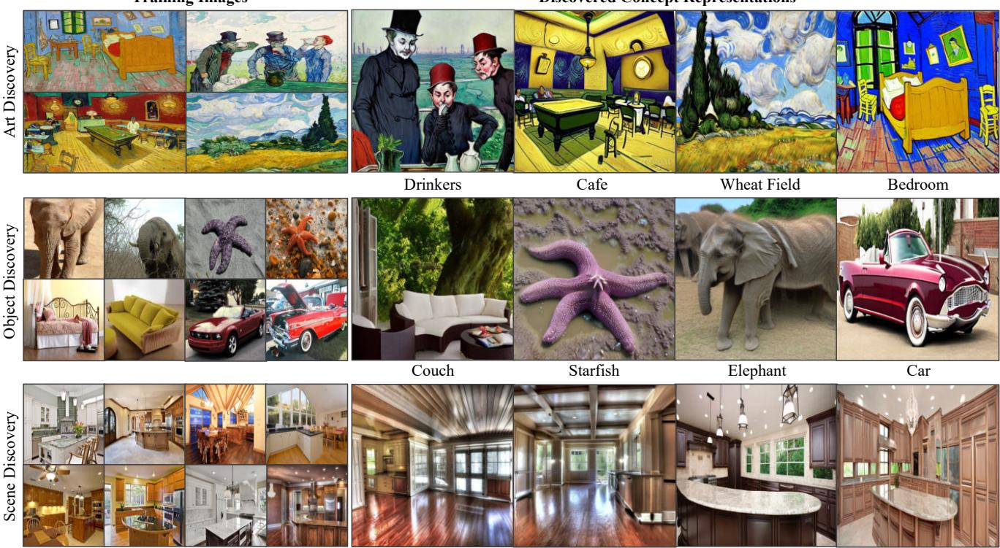
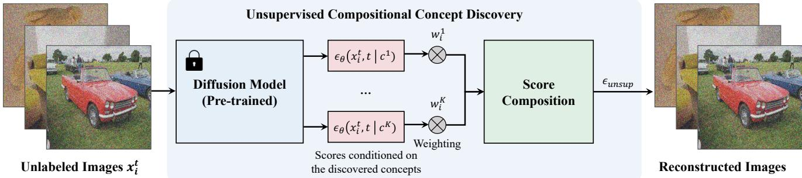
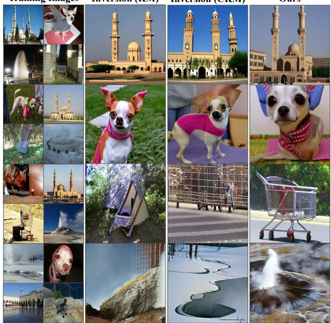
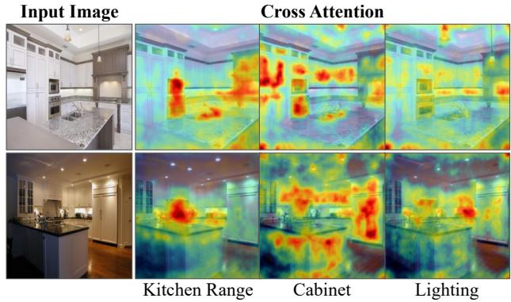
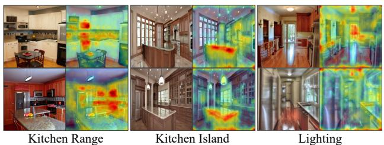
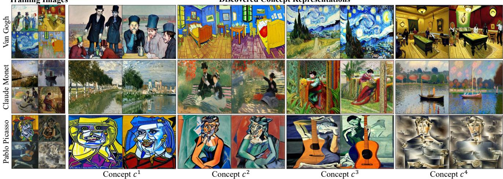
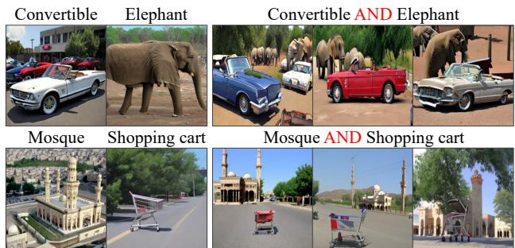
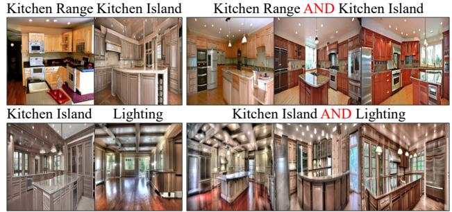
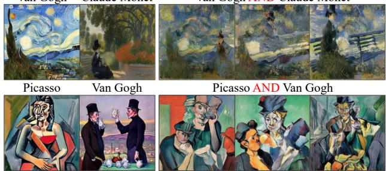
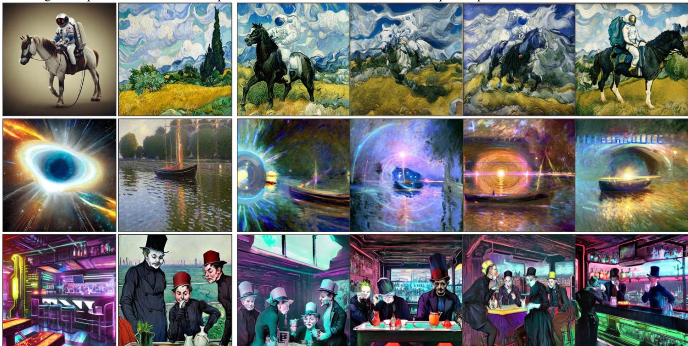

# Unsupervised Compositional Concepts Discovery with Text-to-Image Generative Models

Nan Liu1⇤ Yilun Du2⇤ Shuang Li2⇤ Joshua B. Tenenbaum2 Antonio Torralba2 1UIUC 2MIT

\* indicates equal contribution

Website: https://energy-based-model.github.io/unsupervised-concept-discovery/

  
Figure 1: Unsupervised Image Decomposition. Our approach is able to decompose a dataset of unlabeled images into different concepts. We name each decomposed concept for easy understanding.

## Abstract

Text-to-image generative models have enabled highresolution image synthesis across different domains, but require users to specify the content they wish to generate. In this paper, we consider the inverse problem – given a collection of different images, can we discover the generative concepts that represent each image? We present an unsupervised approach to discover generative concepts from a collection of images, disentangling different art styles in paintings, objects, and lighting from kitchen scenes, and

discovering image classes given ImageNet images. We show how such generative concepts can accurately represent the content of images, be recombined and composed to generate new artistic and hybrid images, and be further used as a representationfor downstream classification tasks.

## 1. Introduction

When presented with a set of images, we can infer and discover common concepts across images. For instance, given a set of images of kitchen scenes in Figure 1, we can grasp different illumination patterns in the kitchen and identify various elements within kitchens, such as dining tables, kitchen islands, and cabinets. Moreover, we possess the ability to conjure up vivid mental images of new scenes that combine elements between different kitchen scenes or visualize how these elements may manifest in unfamiliar settings – envisioning, for instance, how a dining table may appear in a forest.

Can we construct computer vision systems that may likewise understand, recombine, and imagine the visual world? Most existing work in concept discovery focus on discovering latent vectors or directions representing individual concepts [15, 24, 18, 44, 55], but require supervised data labeling each concept. Other works have focused on discovering compositional generative concepts from images but focus only on discovering objects [4, 34]. Recently, COMET [11] proposes an approach to decompose scenes into a set of generative concepts representing both global scene concepts, such as lighting and camera position, and local concepts, such as objects. However, the approach is only applied to simple datasets and fails to generate complex images.

In this work, we illustrate how we can leverage the rich semantic information in large text-to-image generative models to discover a set of diverse compositional generative concepts from unlabeled natural images. Our work extends the approach in [11] using the interpretation of diffusion models as EBMs [32] and decomposes each image into a set of different probability distributions. We illustrate how each decomposed probability distribution captures different global and local scene concepts in an image, ranging from ImageNet class identity to portions of images such as islands and cabinets in a kitchen.

In Figure 1, we show how our approach can discover compositional concepts across a wide set of different domains. In the top row of Figure 1, we illustrate how our approach can discover different art concepts, such as wheat fields, cafes, and bedrooms, from paintings by either Van Gogh or Claude Monet. In the middle row of Figure 1, we demonstrate how our approach can discover classes of images, such as couches, starfish, elephants, and cars, from a collection of unlabeled ImageNet images. Finally, in the bottom row of Figure 1, we show how our approach can discover the compositional components of a kitchen, such as lighting patterns and kitchen islands.

In this work, we contribute the following: (1) We illustrate a scalable approach to discover unsupervised compositional concepts in realistic images using existing generative models. (2) Our method achieves state-of-the-art performance on concept discovery across different domains, in both global and local concept discovery, such as automatically discovering painting styles, and decomposing scenes into lighting and objects. (3) We illustrate that the discovered generative concepts can be used for diverse tasks, such as generating novel creative images or as effective representations for downstream classification tasks.

## 2. Related Works

Compositional Generation. Compositional generation, where we seek to generate an image subject to a set of underlying specifications, has attracted increasing attention in recent years [10, 31, 32, 14, 45, 7, 6, 9, 22, 36, 53, 28, 52, 47, 23]. Existing work on compositional generation focuses either on modifying the feedforward generative process to focus on a set of specifications [14, 45, 7, 22, 23], or by composing a set of independent models specifying desired constraints [10, 31, 32, 36, 9, 53, 28]. Our work utilizes the compositional operators defined from [10, 32], but aims to discover a set of compositional components from an unlabeled dataset of images.

Unsupervised Concept Discovery. Existing works in concept discovery in computer vision typically focus on discovering a latent space to manipulate images [15, 24, 18, 44, 55, 42] but require supervised data to specify each concept. Some work has focused instead on discovering multiple concepts from images, but focus on discovering objects represented as separate segmentation masks [4, 34, 13]. Most similar to our work is that of COMET [11], which decomposes images into a set of composable energy functions representing both objects and scene-level factors such as lighting or camera position. Our work builds on this work, but represents each individual energy function with a diffusion model. We illustrate how this enables us to generate and decompose complex, high-resolution images.

Text-Conditioned Generative Modeling. In recent years, tremendous efforts have been made towards text-based 2D and 3D synthesis using various types of generative models, including GANs [17], VAEs [25], Normalizing Flows [40], Energy-Based Models [27, 12] and Diffusion Models [46, 20]. Diffusion models have become the de facto method for 2D text-to-image synthesis [35, 43, 39, 42, 29, 5, 3, 1, 54, 2, 16, 41, 15, 26] and text-to-3D synthesis [37, 30]. Most relevant to our work, textual inversion [15] leverages pretrained text-to-image diffusion models to map a visual concept to a single-word representation (i.e., a supervised approach). In contrast, we demonstrate how such diffusion models can be leveraged to discover multiple visual representations from a set of images simultaneously without using image labels.

## 3. Background

In this section, we introduce background knowledge on diffusion models and on composing different concepts with diffusion models.

  
Figure 2: Compositional Concept Discovery. We discover a set of compositional concepts given a dataset of unlabeled images. Score functions representing each concept $\{ c ^ { 1 } , \ldots , { \dot { c } } ^ { K } \}$ are composed together to form a score function $\epsilon _ { \mathrm { u n s u p } }$ that is trained to denoise images. The inferred concepts can be used to generate new images.

## 3.1. Denoising Diffusion Probabilistic Models

Denoising Diffusion Probabilistic Models (DDPMs) [46, 20] are a class of generative models where the generation of images $\scriptstyle { \mathbf { { \mathit { x } } } } _ { 0 }$ is formed by iteratively denoising an image corrupted with Gaussian noise. Given a randomly sampled noise $\epsilon \sim \mathcal { N } ( 0 , 1 )$ , and a set of t different noise levels $\epsilon ^ { t } = $ $\alpha ^ { t } \epsilon$ added to a clean image ${ \pmb x } _ { 0 } ^ { 1 }$ , a denoising model $\epsilon _ { \theta }$ is trained to denoise the image at specified noise level t:

$$
\mathcal { L } _ { \mathrm { M S E } } = | | \epsilon - \epsilon _ { \theta } ( \pmb { x } _ { 0 } + \epsilon ^ { t } , t ) ) | | ^ { 2 }\tag{1}
$$

To generate an image from the diffusion model, a sample $\mathbf { \nabla } _ { \mathbf { \mathcal { X } } \mathcal { T } }$ at noise level $T$ is initialized from Gaussian noise $\mathcal { N } ( 0 , 1 )$ . This sample $\mathbf { \nabla } _ { \mathbf { \mathcal { X } } \mathcal { T } }$ is used for generation by iterative denoising:

$$
\pmb { x } ^ { t - 1 } = \pmb { x } ^ { t } - \gamma \epsilon _ { \theta } ( \pmb { x } ^ { t } , t ) + \xi , \xi \sim \mathcal { N } \big ( 0 , \sigma _ { t } ^ { 2 } I \big ) ,\tag{2}
$$

where $\gamma$ is the step s $\mathrm { z e } ^ { 2 }$ . The final sample $\scriptstyle { \mathbf { { \mathit { x } } } } _ { 0 }$ after denoising corresponds to a generated image. The denoising function $\epsilon _ { \theta }$ learns the score of an underlying EBM (unnormalized) probability distribution [51, 49, 32] and thus the above expression is equivalent to

$$
\begin{array} { r } { \pmb { x } ^ { t - 1 } = \pmb { x } ^ { t } - \gamma \nabla _ { \pmb { x } } E _ { \theta } ( \pmb { x } ^ { t } ) + \xi , \quad \xi \sim \mathcal { N } \big ( 0 , \sigma _ { t } ^ { 2 } I \big ) , } \end{array}\tag{3}
$$

where the denoising network $\epsilon _ { \theta } ( \pmb { x } ^ { t } , t )$ represents an unnormalized (EBM) density of data $\overset { \cdot } { p } ( \pmb { x } ) \overset { \cdot } { \propto } \overset { - } { e } ^ { - E _ { \theta } ( \pmb { x } ) }$ by parameterizing $\nabla _ { \pmb { x } } E _ { \theta } ( \pmb { x } )$ with the denoising function. This EBM interpretation of diffusion models enables the composition of different diffusion models together as discussed in Section 3.2 and further enables us to decompose images into multiple sets of different diffusion models.

## 3.2. Composable Diffusion Models

Given two separate DDPM models $\epsilon _ { c _ { 1 } }$ and $\epsilon _ { c _ { 2 } }$ which parameterize two conditional EBM distributions $[ 1 2 ] p ( \pmb { x } | \pmb { c } _ { 1 } )$

and $p ( \pmb { x } | \pmb { c } _ { 2 } )$ specifying the likelihood of images exhibiting concept $c _ { 1 }$ and $^ { c _ { 2 } , }$ composable diffusion [32] proposes to generate images with both attributes by modifying the iterative denoising procedure using the hybrid denoising score ✏comb:

$$
\pmb { x } ^ { t - 1 } = \pmb { x } ^ { t } - \gamma \big ( \epsilon _ { \mathrm { c o m b } } ( \pmb { x } ^ { t } , t ) \big ) + \xi , \quad \xi \sim \mathcal { N } ( 0 , \sigma _ { t } ^ { 2 } I ) .\tag{4}
$$

The hybrid denoising function $\epsilon _ { \mathrm { c o m b } }$ corresponds to a composition of score functions:

$$
\epsilon _ { \mathrm { c o m b } } ( { \pmb x } ^ { t } , t ) = \epsilon _ { c _ { 1 } } ( { \pmb x } ^ { t } , t ) + \epsilon _ { c _ { 2 } } ( { \pmb x } ^ { t } , t ) - \epsilon _ { \phi } ( { \pmb x } ^ { t } , t ) ,\tag{5}
$$

where $\epsilon _ { \phi }$ corresponds to a DDPM representing the unconditional image distribution $p ( { \pmb x } )$ . Sampling using this hybrid denoising function corresponds to sampling from the composite EBM distribution [32] 3:

$$
p ( \pmb { x } | \pmb { c } _ { 1 } , \pmb { c } _ { 2 } ) \propto \frac { p ( \pmb { x } | \pmb { c } _ { 1 } ) p ( \pmb { x } | \pmb { c } _ { 2 } ) } { p ( \pmb { x } ) } .\tag{6}
$$

This property of composable diffusion enables us to construct and sample from complex novel compositions of different concepts at test time. In this paper, we aim to infer a set of composable concepts from training images in an unsupervised manner.

## 4. Method

In this section, we introduce our unsupervised approach that discovers compositional concepts from a set of images using a pretrained diffusion model. We first formulate how we may decompose data points into unsupervised concepts with diffusion models. Next, we illustrate how we may infer these unsupervised concepts using learned latent representations (i.e., word embeddings) in a text-to-image generative model.

## 4.1. Unsupervised Compositional Discovery

Given a dataset of images $\{ x _ { i } \}$ , we aim to discover a set of independent compositional concepts $\{ c _ { i } ^ { 1 } , \cdots , c _ { i } ^ { K } \}$ for each image $\mathbf { \Delta } _ { \mathbf { \mathcal { X } } _ { i } }$ in an unsupervised manner, each specifying a conditional EBM distribution $p ( \pmb { x } _ { i } | \pmb { c } _ { i } ^ { k } )$ , which represent different components of the image. In particular, the probability of each individual image $\mathbf { \Delta } _ { \mathbf { \mathcal { X } } _ { i } }$ can be decomposed as a product of K independent concepts:

$$
\begin{array} { r } { p _ { \mathrm { d e c o m p } } ( \pmb { x } _ { i } ) = p ( \pmb { x } _ { i } | \pmb { c } _ { i } ^ { 1 } , \dots , \pmb { c } _ { i } ^ { K } ) \propto p ( \pmb { x } _ { i } ) \prod _ { k = 1 } ^ { K } \frac { p ( \pmb { x } _ { i } | \pmb { c } _ { i } ^ { k } ) } { p ( \pmb { x } _ { i } ) } , } \end{array}\tag{7}
$$

where we represent each individual probability distribution $p ( \pmb { x } | \pmb { c } _ { i } ^ { k } )$ using a different denoising model $\epsilon _ { k } ( \pmb { x } ^ { t } , t )$

Modeling this decomposed distribution $p _ { \mathrm { d e c o m p } } ( \pmb { x } _ { i } )$ corresponds to sampling from the score function of a composite EBM [32]:

$$
\nabla _ { \pmb { x } } E ( \pmb { x } _ { i } ) + \sum _ { k = 1 } ^ { K } ( \nabla _ { \pmb { x } } E ( \pmb { x } _ { i } | \pmb { c } _ { i } ^ { k } ) - \nabla _ { \pmb { x } } E ( \pmb { x } _ { i } ) )\tag{8}
$$

This then corresponds to constructing a new noise prediction model $\epsilon _ { \mathrm { u n s u p } } \mathrm { . }$

$$
\epsilon _ { \mathrm { u n s u p } } ( \pmb { x } _ { i } ^ { t } , t ) = \epsilon ( \pmb { x } _ { i } ^ { t } , t ) + \sum _ { k = 1 } ^ { K } \bigl ( \epsilon ( \pmb { x } _ { i } ^ { t } , t | \pmb { c } _ { i } ^ { k } ) - \epsilon ( \pmb { x } _ { i } ^ { t } , t ) \bigr ) ,\tag{9}
$$

where $\epsilon ( x _ { i } ^ { t } , t )$ corresponds to the unconditional score prediction. To discover an independent set of compositional concepts for an image, we then wish to learn a denoising function such that for each image $\mathbf { \Delta } _ { \mathbf { \mathcal { X } } _ { i } }$ and noise $\epsilon ^ { t } \mathbf { \lambda }$

$$
\mathcal { L } _ { \mathrm { M S E } } = | | \epsilon - \epsilon _ { \mathrm { u n s u p } } ( \pmb { x } _ { i } + \epsilon ^ { t } , t ) ) | | ^ { 2 } .\tag{10}
$$

To ensure that the set of decomposed concepts $\boldsymbol { c } _ { i } ^ { k }$ in each image is consistent across different images in our dataset, we parameterize each $\boldsymbol { c } _ { i } ^ { k }$ as the weighted sum $\mathbf { \Delta } w _ { i } ^ { k }$ of a library of K concepts $c ^ { k }$ shared across all images. We optimize both a set of concepts $c ^ { k }$ as well as a set of per image/concept weight assignments $\mathbf { \Delta } w _ { i } ^ { k }$ , where $\begin{array} { r } { \sum _ { k } \mathbf { \bar { w } } _ { i } ^ { k } = 1 } \end{array}$ for each image i. Our final modified score prediction corresponds to:

$$
\begin{array} { r } { \epsilon _ { \mathrm { u n s u p } } ( \pmb { x } _ { i } ^ { t } , t ) = \epsilon ( \pmb { x } _ { i } ^ { t } , t ) + \sum _ { k = 1 } ^ { K } \pmb { w } _ { i } ^ { k } \big ( \epsilon ( \pmb { x } _ { i } ^ { t } , t | \pmb { c } ^ { k } ) - \epsilon ( \pmb { x } _ { i } ^ { t } , t ) \big ) . } \end{array}\tag{11}
$$

This corresponds to representing each image with the product distribution

$$
p _ { \mathrm { d e c o m p } } ( \pmb { x } _ { i } ) \propto p ( \pmb { x } _ { i } ) \prod _ { k = 1 } ^ { K } \left( \frac { p ( \pmb { x } _ { i } | \pmb { c } ^ { k } ) } { p ( \pmb { x } _ { i } ) } \right) ^ { \pmb { w } _ { i } ^ { k } } .\tag{12}
$$

When the vector of weights ${ \pmb w } _ { i }$ for each image is one-hot, images are “clustered” into K separate concepts $c ^ { k }$ , where each image is represented by a single concept $c ^ { k }$ that represents its class identity (i.e. dog or cat). In contrast, when the vector of weights ${ \pmb w } _ { i }$ is mixed across multiple different concepts $c ^ { k }$ , each image can be decomposed into a set of factors representing multiple image attributes, such as scene lighting and objects.

Algorithm 1 Unsupervised Concept Discovery   
1: Require Diffusion model $\epsilon _ { \theta } ( \pmb { x } _ { i } ^ { t } , t | c )$ , training im  
ages $\{ \pmb { x } _ { 1 } , \hdots , \pmb { x } _ { N } \}$ , weights $\{ w _ { 1 } , \dotsc , w _ { N } \} , w _ { i } \in$   
$\mathbb { R } ^ { K } , \bar { K }$ randomly initialized concept embeddings   
$\{ c ^ { 1 } , \ldots , c ^ { K } \}$ , learning rate .   
2: for $i = 0 , \ldots , N$ do   
3: Initialize a Gaussian noise $\epsilon \sim \mathcal { N } ( 0 , 1 )$   
4: Initialize a noise $\epsilon ^ { t } = \alpha ^ { t } \epsilon$ at a random time step t   
5: $\pmb { x } _ { i } ^ { t } = \pmb { x } _ { i } + \epsilon ^ { t }$ // add t levels of noise   
6: $\epsilon _ { k } \gets \epsilon _ { \theta } ( \pmb { x } _ { i } ^ { t } , t | \mathbf { c } ^ { k } )$ // compute K conditional scores   
7: $\epsilon _ { \phi } \gets \epsilon _ { \theta } ( \pmb { x } _ { i } ^ { t } , t | \phi ) _ { . }$ // compute unconditional score   
8: $\begin{array} { r } { \epsilon _ { \mathrm { u n s u p } } \gets \epsilon _ { \phi } + \sum _ { k = 1 } ^ { K } \pmb { w } _ { i } ^ { k } \big ( \epsilon _ { k } - \epsilon _ { \phi } \big ) } \end{array}$ Equation (11)   
9: $\mathcal { L } _ { \mathrm { M S E } } = \| \epsilon - \epsilon _ { \mathrm { u n s u p } } \| ^ { 2 }$ // train score to denoise   
10: // update the weight wi and all K concepts.   
11: $\begin{array} { r } { \pmb { w } _ { i } = \pmb { w } _ { i } - \lambda \nabla _ { \pmb { w } _ { i } } . } \end{array}$ LMSE   
12: $\pmb { c } ^ { k } = \pmb { c } ^ { k } - \lambda \nabla _ { c ^ { k } }$ MSE   
13: end for

To discover concepts, we train $\epsilon _ { \mathrm { u n s u p } }$ on each image with the objective in Equation (10) and jointly optimize per image weights ${ \pmb w } _ { i }$ and shared concepts $c ^ { k } { \mathrm { ; } }$

$$
\begin{array} { r } { \pmb { w } _ { i } = \pmb { w } _ { i } - \lambda \nabla _ { \pmb { w } _ { i } } \mathcal { L } _ { \mathrm { M S E } } , } \\ { \pmb { c } ^ { k } = \pmb { c } ^ { k } - \lambda \nabla _ { \pmb { c } ^ { k } } \mathcal { L } _ { \mathrm { M S E } } , } \end{array}\tag{13}
$$

where  is the learning rate. We provide the full pseudocode for discovering concepts in Algorithm 1.

## 4.2. Parameterizing Concepts with Text-to-Image Generative Models

In section 4.1, we aim to construct a set of K different conditional denoising networks $\epsilon ( \boldsymbol { \mathbf { \mathit { x } } } _ { i } ^ { t } , t | \boldsymbol { \mathbf { \mathit { c } } } ^ { k } )$ and an unconditional denoising network $\epsilon ( x _ { i } ^ { t } , t )$ which can jointly denoise images across our dataset. Directly discovering this score functions from scratch using a dataset of images is difficult as there may be substantial ambiguity on how images should be factored, with this difficulty compounded by the small dataset.

To more efficiently parameterize and discover these K different score functions, we propose to parameterize each denoising prediction network $\boldsymbol { \epsilon } ( \boldsymbol { x } _ { i } ^ { t } , t | \boldsymbol { c } ^ { k } )$ using a randomly initialized word embedding $c ^ { k }$ in a text-to-image diffusion model so that $\epsilon ( \pmb { x } _ { i } ^ { t } , t | \pmb { c } ^ { k } ) = \epsilon _ { \theta } ( \pmb { x } _ { i } ^ { t } , t | \pmb { c } ^ { k } )$ . Parameterizing a denoising function in text embedding space is substantially lower dimensional than discovering the score function from scratch, enabling learning / concept discovery from limited sets of data. Furthermore, the semantic space of text eliminates a lot of ambiguity when discovering concepts.

Note, that while in our current implementation, we optimize each shared concept $c ^ { k }$ using a word embedding and a weight vector ${ \pmb w } _ { i } \in \mathbb { R } ^ { \pmb { \tilde { K } } }$ for each image xi, we can parameterize these K different denoising networks $\epsilon _ { \theta } ( \pmb { x } _ { i } ^ { t } , t | \mathbf { c } ^ { k } )$ in other ways. For instance, we can directly parameterize these K score functions by optimizing all parameters of the text-to-image model per concept or by optimizing a small adapter in a similar fashion as [42] on the model weights.

## 5. Experiments

In this section, we compare our approach with baseline methods in concept discovery on three different tasks, including object discovery, indoor scene discovery, and artistic concept discovery. We further show the results of compositional image generation and representation learning using the discovered concepts. We also provide visualizations and analysis on sensitivity and robustness in Appendix A.

## 5.1. Datasets

ImageNet [8]. For the experiment, we select 4 sets of class combinations, denoted as ImageNet $S _ { 1 } , \ S _ { 2 } , \ S _ { 3 }$ and $S _ { 4 }$ Each set consists of 5 classes from ImageNet, with 5 randomly chosen images per class. During testing, we generate 64 images per concept for evaluation.

ADE20K [56]. In this experiment, our goal is to discover concepts from kitchen images in the ADE20K dataset. We randomly select 25 images as the training data.

Artistic Paintings. To further demonstrate the ability of our method to discover a wide range of visual concepts, we collected a dataset of artistic paintings from the internet. The dataset includes 5 paintings by Van Gogh, 7 painting samples by Claude Monet, and 5 painting images by Pablo Picasso.

## 5.2. Evaluation Metrics

Classification Accuracy. To evaluate the effectiveness of each method on decomposing unlabeled ImageNet images into a set of meaningful classes, we utilize a pre-trained classification model to compute image classification accuracy. For each class present in the training data, we feed the generated images into the pre-trained ResNet-50 and extract the largest value from the logit values of target classes (i.e., the 5 class targets in our setting). To evaluate the accuracy of our model predictions, we establish a threshold of 10 for the logit value. Predictions with logit values above this threshold are counted as correct, while those below are deemed incorrect. We find that this threshold represents a high prediction confidence from ResNet-50. Finally, we report the per-set accuracy and average accuracy across all the sets as our final results.

CLIP Accuracy. To further evaluate the accuracy of decomposed concepts in ImageNet, we compute a CLIP accuracy using the pairwise CLIP similarity score between generated images from each concept with the set of classes present in the training data, using pre-trained CLIP encoders [38]. The highest-scoring caption is then selected as the model prediction. We count a prediction as correct if the CLIP similarity score is greater than a certain threshold (i.e., 0.3 in our experiments).

KL Divergence. We use Kullback-Leibler divergence to further evaluate the effectiveness of capturing diverse image concepts on ImageNet. This dataset primarily consists of object concepts, making it an ideal choice for measuring and illustrating the differences we are interested in. Ideally, each decomposed concept should reflect a separate class in the data, resulting in an equal number of generated images per class. We assign an image to a class based on the class label that receives the highest logit value. We then compute the KL divergence between the distribution of classes inferred in this manner with a uniform distribution of classes in the training data (ground truth). In our experiments, we calculate KL divergence by computing logits with regards to both pre-trained ResNet-50 and CLIP encoders.

Representation Accuracy. Our proposed method aims to discover a set of concept representations, which can be further used for downstream tasks, such as classification. Thus, we also evaluate the quality of representations using clustering for classification. First, we utilize K-means clustering, where we assign a cluster to an ImageNet class based on the most frequent class of training images in that cluster. In test time, we count each test example as correct if it is assigned to the cluster with the same image label.

We use the pretrained Stable Diffusion v2.1 model in our experiments. For image generation, we utilize classifierfree guidance [21] to sample 64 images for each ImageNet class with 50 steps using the DDIM sampler [48].

## 5.3. Baselines

COMET [11] is the first work that utilizes a composite of EBMs to decompose images into a set of concepts in an unsupervised manner, but it scales poorly to more complex in-the-wild images. In contrast, our approach enables automatic concept discovery across in-the-wild images.

Textual Inversion [15] is one of the first works to utilize the text-to-image diffusion model to learn a mapping from a set of similar images to a single-word representation. Unlike our unsupervised method, textual inversion optimizes a single representation using a set of similar images, thus assuming a correspondence between training images and the target word representation. In contrast, our method enables unsupervised learning of multiple concepts simultaneously in one single training run. To provide a fair comparison, we developed a baseline using textual inversion to map all images into an unconditional word representation. Each ImageNet set has 5 distinct classes, so the single unconditional representation may ideally learn a uniform distribution of all 5 image concepts. For evaluation, we sample 320 images for classification accuracy. In contrast, we sampled 64 samples for each of the 5 concepts, thus a total of 320 images, in our method for ImageNet dataset.

Inversion (KM)  
Training Images
<table><tr><td rowspan="2">Models</td><td colspan="2">ImageNet S1</td><td colspan="2">ImageNet S2</td><td colspan="2">ImageNet  $S _ { 3 }$ </td><td colspan="2">ImageNet S4</td><td colspan="2">Average</td></tr><tr><td>Acc ↑</td><td>KL↓</td><td>Acc ↑</td><td>KL↓</td><td>Acc ↑</td><td>KL↓</td><td>Acc ↑</td><td>KL↓</td><td>Acc ↑</td><td>KL↓</td></tr><tr><td>Textual Inversion [15]</td><td>4.06</td><td>0.5756</td><td>7.19</td><td>0.1152</td><td>36.88</td><td>0.1525</td><td>63.44</td><td>0.4958</td><td>27.89</td><td>0.3348</td></tr><tr><td>Textual Inversion (KM)</td><td>44.37</td><td>0.3799</td><td>22.50</td><td>0.0926</td><td>37.81</td><td>0.2123</td><td>78.75</td><td>0.3576</td><td>45.86</td><td>0.2606</td></tr><tr><td>Textual Inversion (CKM)</td><td>48.13</td><td>0.0282</td><td>24.38</td><td>0.2367</td><td>63.75</td><td>0.1569</td><td>69.38</td><td>0.2249</td><td>51.41</td><td>0.1617</td></tr><tr><td>Ours</td><td>56.88</td><td>0.1613</td><td>26.56</td><td>0.2929</td><td>56.56</td><td>0.1323</td><td>82.81</td><td>0.0285</td><td>55.70</td><td>0.1538</td></tr><tr><td></td><td>CLIP↑</td><td>KL↓</td><td>CLIP↑</td><td>KL↓</td><td>CLIP↑</td><td>KL↓</td><td>CLIP↑</td><td>KL↓</td><td>CLIP↑</td><td>KL↓</td></tr><tr><td>Textual Inversion [15]</td><td>13.13</td><td>0.4195</td><td>3.44</td><td>0.1182</td><td>9.38</td><td>0.0554</td><td>33.75</td><td>0.7193</td><td>14.93</td><td>0.3281</td></tr><tr><td>Textual Inversion (KM)</td><td>29.06</td><td>0.1299</td><td>9.38</td><td>0.0803</td><td>12.19</td><td>0.3325</td><td>44.37</td><td>0.3799</td><td>23.75</td><td>0.2307</td></tr><tr><td>Textual Inversion (CKM)</td><td>40.31</td><td>0.0020</td><td>10.00</td><td>0.3384</td><td>14.37</td><td>0.1490</td><td>69.69</td><td>0.4232</td><td>33.59</td><td>0.2281</td></tr><tr><td>Ours</td><td>42.19</td><td>0.2091</td><td>30.00</td><td>0.1518</td><td>30.63</td><td>0.1513</td><td>51.56</td><td>0.0224</td><td>38.60</td><td>0.1337</td></tr></table>

Table 1: Quantitative Evaluation of Discovered Concepts. We assess the accuracy of decomposed concepts in capturing each ImageNet class in the data using pre-trained ResNet-50 and CLIP classifiers. We also report the KL divergence of discovered classes.

Textual  
Textual  
Inversion (CKM)  
Ours  
  
Figure 3: Object Decomposition. Our proposed method can discover different object categories from a set of unlabeled images.

Textual Inversion + K-means is a modified version of textual inversion [15]. Since images are unlabeled, we utilize K-means clustering [33] to obtain pseudo-labels. In our experiments, we use two variants of K-means clustering: K-means (KM) in pixel space and CLIP-based Kmeans (CKM). We first utilize K-means clustering to obtain pseudo-labels for the given training images, and then train textual inversion on such image-label pairs.

  
Figure 4: Cross Attention Concept Visualization. We visualize the attention maps of three discovered concepts from unlabelled images. The concepts focus on different portions of the dataset.

  
Figure 5: Kitchen Scene Decomposition. We show generated images (odd columns) along with the attention maps of the corresponding concept (even columns) with respect to the image.

## 5.4. Unsupervised Concept Discovery

Our method can decompose images from different domains into concepts, including objects, components in indoor scenes and artistic styles, without using any labels.

## 5.4.1 Object Discovery

We show that our proposed method can automatically discover object concepts from a set of unlabeled images.

Discovered Concept Representations  
  
Figure 6: Unsupervised Concept Decomposition on Arts. Our method allows unsupervised concept decomposition from just a few paintings (i.e., 5 7 per artist), with each concept ci representing a distinct concept. For instance, in the first row, c1 represents “drinkers”, while in the third row, c3 represents “guitarist”.

Qualitative results. We first demonstrate that our method can faithfully decompose ImageNet images into a set of object concepts. We qualitatively compare our method with multiple variants of textual inversion [15] in Figure 3. Although all three methods achieve similar performance on “mosque” and “Chihuahua” in the top two rows, both clustering-based textual inversion methods (KM and CKM) fail to capture visual concepts of “shopping cart” and “geyser” in the bottom two rows. In contrast, our method can capture all four concepts faithfully. We further evaluate COMET [11] on this setting, but find that it obtains low performance in our setting as it fails to generate photorealistic images. See appendix A for additional qualitative results of COMET and other approaches.

Quantitative results. In Table 1, we compare our method with baselines quantitatively using image classification accuracy. Our proposed method achieves a higher or comparable classification performance across different sets of ImageNet combinations using pre-trained ResNet-50 [19] and CLIP [38]. Furthermore, we evaluate the diversity of discovered concepts using discrete KL divergence between prediction distribution and target distribution. Intuitively, a lower KL divergence value indicates that the probability distribution of the generated images is closer to the uniform distribution, thus implying greater diversity in the generated images. Compared to the baselines, our method achieves a consistently low KL divergence across different ImageNet sets. In contrast, the baselines exhibit a wider range of KL scores, suggesting that our proposed approach is more stable in terms of learning diverse concepts across these sets. As shown in the rightmost column of Table 1, the averaged results across all four sets further show that our method achieves the best performance on both accuracy and KL divergence, indicating its ability to learn diverse concepts.

## 5.4.2 Indoor Scene Discovery

To further verify the effectiveness of our approach, we demonstrate our method can decompose kitchen scenes into multiple sets of factors.

Qualitative results. We evaluate our method on concept discovery for indoor scenes, specifically kitchen scenes from ADE20K [56]. Since our method discovers concepts in an unsupervised manner, there is no label for the learned concepts. Thus, we utilize Diffusion Attentive Attribution Maps (DDAM) [50] to visualize the relation between learned concepts and image contents. Specifically, DAAM utilizes word-pixel scores from cross attention layers to generate heap maps for visualization. As shown in Figure 4, we obtain DDAM associated with each concept by running DDIM inversion [48] on the training image. Our method can decompose the kitchen scenes into different components such as kitchen range (i.e., stove and microwave), cabinets, and lighting effects. Furthermore, we visualize images that are generated conditioned on each individual inferred concept in Figure 5. Both figures show that our model can decompose challenging kitchen scenes into a set of meaningful factors.

## 5.4.3 Artistic Concept Discovery

Art has been a long-standing topic being studied in the computer vision and computer graphics community. Here we provide qualitative evaluations in the artistic domain to further demonstrate the versatility of our method.

Qualitative results. As shown in Figure 6, we demonstrate concept decomposition on artistic paintings from different artists, including Van Gogh, Claude Monet, and Pablo Picasso. In the second row, we show that our model can decompose training images into different concepts, including “trees on the side”, “a lady sitting on a bench”, “an embroidering lady” and “a boat”, with similar artistic styles to the original images. In the next section, we will discuss that the discovered concepts can be further composed together to generate images.

  
Figure 7: Object Composition. Our proposed method can generate images that showcase a composition of object concepts.

## 5.5. Composing Discovered Concepts

After a set of factors is discovered from a collection of images, our method can further compose these concepts for compositional image generation using compositional operators from previous works [10, 32]. As our approach is unsupervised and there is no label for the discovered concepts, we add names for the discovered concepts manually for easy understanding. As shown in the previous section, our method can decompose images into meaningful concepts, such as objects in indoor scenes and artistic styles. These concepts can be further composed with other concepts to generate images with specific styles.

Object Composition. We are able to use the conjunction operator (e.g., AND) from Composable-Diffusion [32] to generate images that contain combinations of concepts that are unseen during training. As shown in Figure 7, we show examples of generated images with the combination of a convertible car and elephants, as well as a composition of a shopping cart and a mosque.

Scene Composition. We further demonstrate the proposed method can enable scene composition using discovered concepts other than objects in the kitchen setting. As shown in Figure 8, our approach can discover concepts such as lighting and kitchen islands, and generate scenes with the specified objects and lighting effects.

Style Composition. We can also combine artistic concepts discovered from paintings to generate images. As shown in Figure 9, we compose two types of discovered artistic styles to generate images using the conjunction operator. For example, images in the first row combine Van Gogh’s starry night with Claude Monet’s Camille Monet. Images in the second row combine Van Gogh’s drinkers with the Cubism style of Picasso.

  
Figure 8: Kitchen Concept Composition. Our method demonstrates the ability to compose different components, such as kitchen ranges and lighting effects.

  
Figure 9: Style Composition. Our proposed method can compose artistic concepts learned from paintings, with each style named after the respective artist for better understanding.

External Composition. Finally, our method can combine discovered concepts with external or existing knowledge from pre-trained generative models to generate images with new combinations. As shown in Figure 10, we combine textual descriptions with discovered concepts to create images that depict “an astronaut riding a horse“ AND wheat field in the first row, “intergalactic wormhole“ AND a boat in the second row, and “cyberpunk bar” AND drinkers in the last row, where the former is the text input, the latter is our discovered concepts and “AND” is the conjunction operator.

## 5.6. Representation Learning

By decomposing images into a weighted combination of compositional concepts, our approach discovers a representation for each training image. We can further obtain a representation for a test image $\mathbf { \Delta } _ { \mathbf { \mathcal { X } } _ { \mathcal { j } } }$ by optimizing Equation (10) and obtaining a weight vector ${ \pmb w } _ { j } ~ \in ~ \mathbb { R } ^ { K }$ for the image, while freezing the discovered concept representations $c ^ { k }$ We assess how this representation can be used for down stream tasks such as classification.

Quantitative Results. We evaluate the effectiveness of the representation learned by our model for image classification. First, we use the optimized weight ${ \pmb w } _ { i }$ for each training image $\mathbf { \Delta } _ { \mathbf { \mathcal { X } } _ { i } }$ to fit a logistic regression model that predicts the ImageNet class based on the weight representation for each training image. We then evaluate the accuracy of the model on test images $\mathbf { \Delta } _ { \mathbf { \mathcal { X } } _ { j } }$ using the optimized weights ${ \pmb w } _ { j }$

Existing Concept  
Discovered Concept  
Concept Composition  
  
Figure 10: External Composition. We demonstrate the ability to seamlessly integrate discovered concepts with existing concepts (text) to generate images with specified factors. For clarity, we omit the text descriptions. For instance, the $1 ^ { \mathrm { s t } } , \hat { 2 } ^ { \mathrm { n d } } , 3 ^ { \mathrm { r d } }$ images in the $1 ^ { \mathrm { s t } }$ column are created using the phrase “an astronaut riding a horse”. “intergalactic wormhole” and “cyberpunk bar”, respectively.

<table><tr><td>Methods</td><td>ImageNet  $S _ { 1 } \uparrow$ </td><td>ImageNet  $S _ { 2 } \uparrow$ </td><td>ImageNet  $S _ { 3 } \uparrow$ </td><td>ImageNet  $S _ { 4 }$  ↑</td><td>Average ↑</td></tr><tr><td>K-means</td><td>37.00</td><td>34.00</td><td>37.00</td><td>21.00</td><td>32.25</td></tr><tr><td>Textual Inversion</td><td>24.00</td><td>24.00</td><td>25.00</td><td>24.00</td><td>24.25</td></tr><tr><td>Ours</td><td>58.00</td><td>51.00</td><td>59.00</td><td>83.00</td><td>62.75</td></tr><tr><td>K-means (CLIP)</td><td>65.00</td><td>77.00</td><td>87.00</td><td>65.00</td><td>73.50</td></tr></table>

Table 2: Generative Representation Evaluation. Generative representations of images learned by our method can accurately classify images. K-means (CLIP) is a supervised method and achieves the best average result.

In this experiment, we compare our method with two variants of K-means clustering methods, one in pixel space and another in CLIP space. We also fit a logistic regression model on representations per image found using textual inversion [15]. We evaluate the accuracy of these methods for predicting ImageNet class on a test set of 100 images. As shown in Table 2, our method achieves the best performance of 62.75% mean accuracy compared to all the other unsupervised methods. The method of CLIP-based K-means clustering is better than our method because the CLIP representation is directly trained in a supervised way on millions of image-text pairs.

## 6. Conclusion

We presented an approach to decompose datasets of images into a set of compositional generative concepts. Our approach is effective across a variety of datasets, including artistic paintings, indoor scenes, and ImageNet images. Additionally, we illustrated how discovered generative concepts can be combined with both each other and external concepts to generate novel images. Finally, we illustrated how discovered generative concepts can serve as a representation of an image which can be used for downstream tasks such as image classification. We hope our work opens a new direction of research on how generative models may not only be used to generate images but also as way to understand and represent images.

Acknowledgments. Yilun Du is supported by a NSF Graduate Fellowship.

## References

[1] Manuel Brack, Felix Friedrich, Dominik Hintersdorf, Lukas Struppek, Patrick Schramowski, and Kristian Kersting. Sega: Instructing diffusion using semantic dimensions. arXiv preprint arXiv:2301.12247, 2023. 2

[2] Manuel Brack, Patrick Schramowski, Felix Friedrich, Dominik Hintersdorf, and Kristian Kersting. The stable artist: Steering semantics in diffusion latent space. arXiv preprint arXiv:2212.06013, 2022. 2

[3] Tim Brooks, Aleksander Holynski, and Alexei A Efros. Instructpix2pix: Learning to follow image editing instructions. arXiv preprint arXiv:2211.09800, 2022. 2

[4] Christopher P Burgess, Loic Matthey, Nicholas Watters, Rishabh Kabra, Irina Higgins, Matt Botvinick, and Alexander Lerchner. Monet: Unsupervised scene decomposition and representation. arXiv preprint arXiv:1901.11390, 2019. 2

[5] Hila Chefer, Yuval Alaluf, Yael Vinker, Lior Wolf, and Daniel Cohen-Or. Attend-and-excite: Attention-based semantic guidance for text-to-image diffusion models. arXiv preprint arXiv:2301.13826, 2023. 2

[6] Wonwoong Cho, Hareesh Ravi, Midhun Harikumar, Vinh Khuc, Krishna Kumar Singh, Jingwan Lu, David I. Inouye, and Ajinkya Kale. Towards enhanced controllability of diffusion models, 2023. 2

[7] Yuren Cong, Martin Renqiang Min, Li Erran Li, Bodo Rosenhahn, and Michael Ying Yang. Attribute-centric compositional text-to-image generation. arXiv preprint arXiv:2301.01413, 2023. 2

[8] Jia Deng, Wei Dong, Richard Socher, Li-Jia Li, Kai Li, and Li Fei-Fei. Imagenet: A large-scale hierarchical image database. In 2009 IEEE conference on computer vision and pattern recognition, pages 248–255. Ieee, 2009. 5, 13

[9] Yilun Du, Conor Durkan, Robin Strudel, Joshua B Tenenbaum, Sander Dieleman, Rob Fergus, Jascha Sohl-Dickstein, Arnaud Doucet, and Will Grathwohl. Reduce, reuse, recycle: Compositional generation with energy-based diffusion models and mcmc. arXiv preprint arXiv:2302.11552, 2023. 2

[10] Yilun Du, Shuang Li, and Igor Mordatch. Compositional visual generation with energy based models. Advances in Neural Information Processing Systems, 33:6637–6647, 2020. 2, 8

[11] Yilun Du, Shuang Li, Yash Sharma, B. Joshua Tenenbaum, and Igor Mordatch. Unsupervised learning of compositional energy concepts. In Advances in Neural Information Processing Systems, 2021. 2, 5, 7, 13, 17

[12] Yilun Du and Igor Mordatch. Implicit generation and generalization in energy-based models. arXiv preprint arXiv:1903.08689, 2019. 2, 3

[13] Yilun Du, Kevin A. Smith, Tomer Ullman, Joshua B. Tenenbaum, and Jiajun Wu. Unsupervised discovery of 3d physical objects. In International Conference on Learning Representations, 2021. 2

[14] Weixi Feng, Xuehai He, Tsu-Jui Fu, Varun Jampani, Arjun Akula, Pradyumna Narayana, Sugato Basu, Xin Eric Wang, and William Yang Wang. Training-free structured diffusion

guidance for compositional text-to-image synthesis. arXiv preprint arXiv:2212.05032, 2022. 2

[15] Rinon Gal, Yuval Alaluf, Yuval Atzmon, Or Patashnik, Amit H Bermano, Gal Chechik, and Daniel Cohen-Or. An image is worth one word: Personalizing text-toimage generation using textual inversion. arXiv preprint arXiv:2208.01618, 2022. 2, 5, 6, 7, 9, 13, 14

[16] Tejas Gokhale, Hamid Palangi, Besmira Nushi, Vibhav Vineet, Eric Horvitz, Ece Kamar, Chitta Baral, and Yezhou Yang. Benchmarking spatial relationships in text-to-image generation. arXiv preprint arXiv:2212.10015, 2022. 2

[17] Ian Goodfellow, Jean Pouget-Abadie, Mehdi Mirza, Bing Xu, David Warde-Farley, Sherjil Ozair, Aaron Courville, and Yoshua Bengio. Generative adversarial networks. Communications ofthe ACM, 63(11):139–144, 2020. 2

[18] Erik Hark ¨ onen, Aaron Hertzmann, Jaakko Lehtinen, and ¨ Sylvain Paris. Ganspace: Discovering interpretable gan controls. Advances in Neural Information Processing Systems, 33:9841–9850, 2020. 2

[19] Kaiming He, Xiangyu Zhang, Shaoqing Ren, and Jian Sun. Deep residual learning for image recognition. In Proceedings of the IEEE conference on computer vision and pattern recognition, pages 770–778, 2016. 7

[20] Jonathan Ho, Ajay Jain, and Pieter Abbeel. Denoising diffusion probabilistic models. Advances in Neural Information Processing Systems, 33:6840–6851, 2020. 2, 3

[21] Jonathan Ho and Tim Salimans. Classifier-free diffusion guidance. arXiv preprint arXiv:2207.12598, 2022. 5, 14

[22] Lianghua Huang, Di Chen, Yu Liu, Yujun Shen, Deli Zhao, and Jingren Zhou. Composer: Creative and controllable image synthesis with composable conditions. arXiv preprint arXiv:2302.09778, 2023. 2

[23] Ziqi Huang, Kelvin CK Chan, Yuming Jiang, and Ziwei Liu. Collaborative diffusion for multi-modal face generation and editing. In Proceedings of the IEEE/CVF Conference on Computer Vision and Pattern Recognition, pages 6080– 6090, 2023. 2

[24] Ali Jahanian, Lucy Chai, and Phillip Isola. On the” steerability” of generative adversarial networks. arXiv preprint arXiv:1907.07171, 2019. 2

[25] Diederik P Kingma and Max Welling. Auto-encoding variational bayes. arXiv preprint arXiv:1312.6114, 2013. 2

[26] Nupur Kumari, Bingliang Zhang, Richard Zhang, Eli Shechtman, and Jun-Yan Zhu. Multi-concept customization of text-to-image diffusion. In Proceedings of the IEEE/CVF Conference on Computer Vision and Pattern Recognition, pages 1931–1941, 2023. 2

[27] Yann LeCun, Sumit Chopra, Raia Hadsell, M Ranzato, and Fujie Huang. A tutorial on energy-based learning. Predicting structured data, 1(0), 2006. 2

[28] Shuang Li, Yilun Du, Joshua B Tenenbaum, Antonio Torralba, and Igor Mordatch. Composing ensembles of pretrained models via iterative consensus. arXiv preprint arXiv:2210.11522, 2022. 2

[29] Jun Hao Liew, Hanshu Yan, Daquan Zhou, and Jiashi Feng. Magicmix: Semantic mixing with diffusion models. arXiv preprint arXiv:2210.16056, 2022. 2

[30] Chen-Hsuan Lin, Jun Gao, Luming Tang, Towaki Takikawa, Xiaohui Zeng, Xun Huang, Karsten Kreis, Sanja Fidler, Ming-Yu Liu, and Tsung-Yi Lin. Magic3d: Highresolution text-to-3d content creation. arXiv preprint arXiv:2211.10440, 2022. 2

[31] Nan Liu, Shuang Li, Yilun Du, Josh Tenenbaum, and Antonio Torralba. Learning to compose visual relations. Advances in Neural Information Processing Systems, 34:23166–23178, 2021. 2

[32] Nan Liu, Shuang Li, Yilun Du, Antonio Torralba, and Joshua B Tenenbaum. Compositional visual generation with composable diffusion models. In Computer Vision–ECCV 2022: 17th European Conference, Tel Aviv, Israel, October 23–27, 2022, Proceedings, Part XVII, pages 423–439. Springer, 2022. 2, 3, 4, 8, 12, 14

[33] Stuart Lloyd. Least squares quantization in pcm. IEEE transactions on information theory, 28(2):129–137, 1982. 6

[34] Francesco Locatello, Dirk Weissenborn, Thomas Unterthiner, Aravindh Mahendran, Georg Heigold, Jakob Uszkoreit, Alexey Dosovitskiy, and Thomas Kipf. Objectcentric learning with slot attention, 2020. 2

[35] Alex Nichol, Prafulla Dhariwal, Aditya Ramesh, Pranav Shyam, Pamela Mishkin, Bob McGrew, Ilya Sutskever, and Mark Chen. Glide: Towards photorealistic image generation and editing with text-guided diffusion models. arXiv preprint arXiv:2112.10741, 2021. 2

[36] Weili Nie, Arash Vahdat, and Anima Anandkumar. Controllable and compositional generation with latent-space energybased models. Advances in Neural Information Processing Systems, 34, 2021. 2

[37] Ben Poole, Ajay Jain, Jonathan T Barron, and Ben Mildenhall. Dreamfusion: Text-to-3d using 2d diffusion. arXiv preprint arXiv:2209.14988, 2022. 2

[38] Alec Radford, Jong Wook Kim, Chris Hallacy, Aditya Ramesh, Gabriel Goh, Sandhini Agarwal, Girish Sastry, Amanda Askell, Pamela Mishkin, Jack Clark, et al. Learning transferable visual models from natural language supervision. In International conference on machine learning, pages 8748–8763. PMLR, 2021. 5, 7, 14

[39] Aditya Ramesh, Prafulla Dhariwal, Alex Nichol, Casey Chu, and Mark Chen. Hierarchical text-conditional image generation with clip latents. arXiv preprint arXiv:2204.06125, 2022. 2

[40] Danilo Rezende and Shakir Mohamed. Variational inference with normalizing flows. In International conference on machine learning, pages 1530–1538. PMLR, 2015. 2

[41] Robin Rombach, Andreas Blattmann, Dominik Lorenz, Patrick Esser, and Bjorn Ommer. High-resolution image¨ synthesis with latent diffusion models. In Proceedings of the IEEE/CVF Conference on Computer Vision and Pattern Recognition, pages 10684–10695, 2022. 2

[42] Nataniel Ruiz, Yuanzhen Li, Varun Jampani, Yael Pritch, Michael Rubinstein, and Kfir Aberman. Dreambooth: Fine tuning text-to-image diffusion models for subject-driven generation. arXiv preprint arXiv:2208.12242, 2022. 2, 5

[43] Chitwan Saharia, William Chan, Saurabh Saxena, Lala Li, Jay Whang, Emily Denton, Seyed Kamyar Seyed

Ghasemipour, Burcu Karagol Ayan, S Sara Mahdavi, Rapha Gontijo Lopes, et al. Photorealistic text-to-image diffusion models with deep language understanding. arXiv preprint arXiv:2205.11487, 2022. 2

[44] Yujun Shen, Jinjin Gu, Xiaoou Tang, and Bolei Zhou. Interpreting the latent space of gans for semantic face editing. In Proceedings ofthe IEEE/CVF conference on computer vision and pattern recognition, pages 9243–9252, 2020. 2

[45] Changhao Shi, Haomiao Ni, Kai Li, Shaobo Han, Mingfu Liang, Gal Mishne, and Martin Renqiang Min. Compositional image generation and manipulation with latent diffusion models, 2023. 2

[46] Jascha Sohl-Dickstein, Eric Weiss, Niru Maheswaranathan, and Surya Ganguli. Deep unsupervised learning using nonequilibrium thermodynamics. In International Conference on Machine Learning, pages 2256–2265. PMLR, 2015. 2, 3

[47] Kihyuk Sohn, Albert Shaw, Yuan Hao, Han Zhang, Luisa Polania, Huiwen Chang, Lu Jiang, and Irfan Essa. Learning disentangled prompts for compositional image synthesis. arXiv preprint arXiv:2306.00763, 2023. 2

[48] Jiaming Song, Chenlin Meng, and Stefano Ermon. Denoising diffusion implicit models. arXiv preprint arXiv:2010.02502, 2020. 5, 7

[49] Yang Song and Stefano Ermon. Generative modeling by estimating gradients of the data distribution. Advances in neural information processing systems, 32, 2019. 3

[50] Raphael Tang, Akshat Pandey, Zhiying Jiang, Gefei Yang, Karun Kumar, Jimmy Lin, and Ferhan Ture. What the daam: Interpreting stable diffusion using cross attention. arXiv preprint arXiv:2210.04885, 2022. 7

[51] Pascal Vincent. A connection between score matching and denoising autoencoders. Neural computation, 23(7):1661– 1674, 2011. 3

[52] Ruichen Wang, Zekang Chen, Chen Chen, Jian Ma, Haonan Lu, and Xiaodong Lin. Compositional text-to-image synthesis with attention map control of diffusion models. arXiv preprint arXiv:2305.13921, 2023. 2

[53] Zihao Wang, Lin Gui, Jeffrey Negrea, and Victor Veitch. Concept algebra for text-controlled vision models. arXiv preprint arXiv:2302.03693, 2023. 2

[54] Qiucheng Wu, Yujian Liu, Handong Zhao, Ajinkya Kale, Trung Bui, Tong Yu, Zhe Lin, Yang Zhang, and Shiyu Chang. Uncovering the disentanglement capability in text-to-image diffusion models. arXiv preprint arXiv:2212.08698, 2022. 2

[55] Zongze Wu, Dani Lischinski, and Eli Shechtman. Stylespace analysis: Disentangled controls for stylegan image generation. In Proceedings of the IEEE/CVF Conference on Computer Vision and Pattern Recognition, pages 12863–12872, 2021. 2

[56] Bolei Zhou, Hang Zhao, Xavier Puig, Sanja Fidler, Adela Barriuso, and Antonio Torralba. Scene parsing through ade20k dataset. In Proceedings of the IEEE conference on computer vision and pattern recognition, pages 633–641, 2017. 5, 7, 13