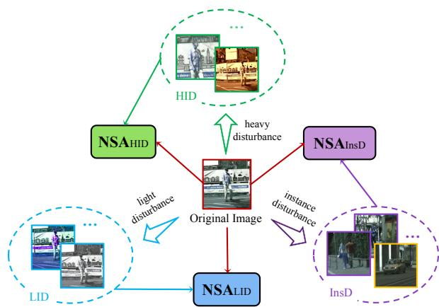
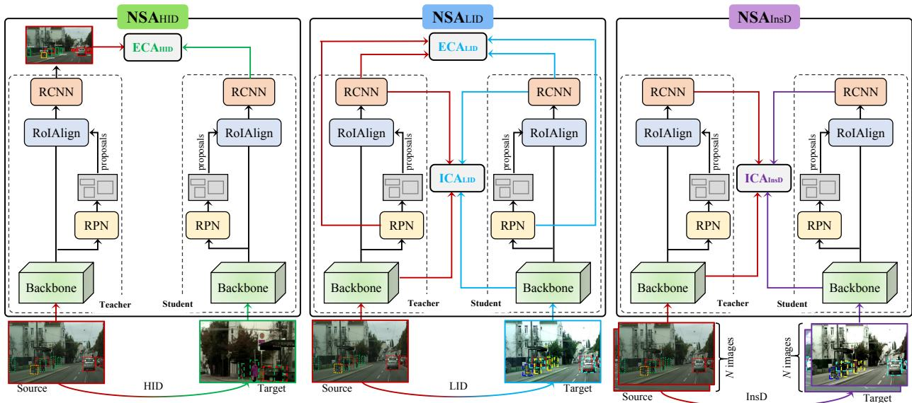
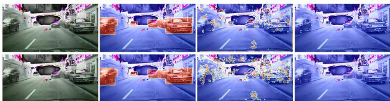
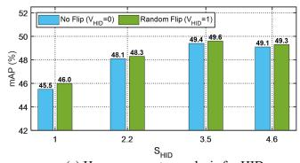
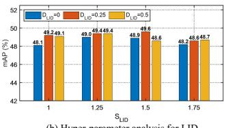

# Unsupervised Domain Adaptive Detection with Network Stability Analysis

Wenzhang Zhou1,3∗, Heng Fan2,∗, Tiejian Luo1,3, Libo Zhang1,3,† 1Institute of Software, Chinese Academy of Sciences, Beijing, China 2Department of Computer Science and Engineering, University of North Texas, Denton, USA 3University of Chinese Academy of Sciences, Beijing, China

## Abstract

Domain adaptive detection aims to improve the generality ofa detector, learnedfrom the labeled source domain, on the unlabeled target domain. In this work, drawing inspiration from the concept of stability from the control theory that a robust system requires to remain consistent both externally and internally regardless of disturbances, we propose a novelframework that achieves unsupervised domain adaptive detection through stability analysis. In specific, we treat discrepancies between images and regionsfrom different domains as disturbances, and introduce a novel simple but effective Network Stability Analysis (NSA) framework that considers various disturbancesfor domain adaptation. Particularly, we explore three types ofperturbations including heavy and light image-level disturbances and instancelevel disturbance. For each type, NSA performs external consistency analysis on the outputsfrom raw and perturbed images and/or internal consistency analysis on their features, using teacher-student models. By integrating NSA into Faster R-CNN, we immediately achieve state-of-the-art results. In particular, we set a new record of 52.7% mAP on Cityscapes-to-FoggyCityscapes, showing the potential of NSA for domain adaptive detection. It is worth noticing, our NSA is designed for general purpose, and thus applicable to one-stage detection model (e.g., FCOS) besides the adopted one, as shown by experiments. Code is released at https://github.com/tiankongzhang/NSA.

## 1. Introduction

Benefited by deep neural networks [27, 49, 13], object detection has witnessed considerable progress in recent years [28, 33, 43, 51, 62, 10]. Modern detectors are usually trained and tested on large-scale annotated datasets [8, 34]. Despite excellence, they easily degenerate when applied to images from a new target domain, which heavily limits their practical applications. To mitigate this, a naive solution is to collect a dataset for the new target domain to re-train a detector. Nevertheless, dataset creation is a nontrivial task that needs a large amount of labor. Besides, a new target domain could be arbitrary and it is impossible to collect datasets for all new target domains. To deal with this, researchers explore unsupervised domain adaptation (UDA) detection, aiming to transfer knowledge learned from an annotated source domain to an unlabeled target domain.

  
Figure 1. Illustration of the proposed NSA framework that applies the specially designed ${ \mathrm { N S A } } _ { \mathrm { H I D } }$ $\mathrm { N S A } _ { \mathrm { L I D } }$ and $\mathrm { N S A } _ { \mathrm { I n s D } }$ for different disturbances including HID, LID and InsD, respectively.

Existing UDA detection can be generally classified into three families. The first branch focuses on aligning feature distributions of different domains to reduce their gap using, e.g., adversarial learning [5, 46, 64] and maximum mean discrepancy [35, 36, 37]. Despite effectiveness, these approaches may suffer from three limitations. First, they usually require both source and target datasets for training, restraining their usage. Besides, they are problematic with local misalignment, principally because of unknown internal distribution of feature space distribution due to the lack of target domain annotations. Finally, a large amount of useful information among samples for different domain datasets is ignored, resulting in inferior performance. Another line leverages self-training for UDA detection [45, 24, 25]. The core idea is to generate high-quality pseudo labels on the target domain and apply them for detector training. Although this strategy improves detection on the target domain, it heavily relies on initial detection results, making them unstable. The third direction is to exploit the teacherstudent model [2, 7]. Using consistency constraints of detector predictions regardless of external disturbance on input, these approaches exhibit robust domain adaptive detection. Despite this, they ignore the consistency for internal features and external predictions under different disturbances, resulting in degradation on the new target domain.

Contributions. Different than the above methods, we study UDA detection from a new perspective. Particularly, we observe that the changes of attributes (e.g., scale, view, translation, color) for object and styles for instances are the major causes for domain differences. For a desired stable detector, both feature representations and prediction results should be consistent under these changes. Drawing inspiration from stability concept in control theory [1] where the good system needs to perform consistently in both external predictions and internal status in presence of disturbances, we propose a novel framework for UDA detection via Network Stability Analysis (NSA). The key idea is that, we regard discrepancy caused by distribution changes between two domains as data disturbance, and analyze influence of various disturbances on internal features and external predictions.

More specifically, in this paper we consider three types of disturbances, Heavy and Light Image-level Disturbances (HID and LID) and Instance-level Disturbance (InsD), that involve general perturbations of color, view, texture, scale, translation and instance style in the images. The reason for disturbance division is that variations in images are significantly different and it is difficulty to use a single disturbance for analysis. For each type of disturbance, NSA performs external consistency analysis (ECA) on outputs of the original and the disturbed images and/or internal consistency analysis (ICA) on their features, both with teacher-student models. Considering each disturbance focuses on different aspects, the NSA is different, accordingly. Concretely, HID majorly focuses on large object or region variations in scales and views. Since the internal features greatly vary while the external detection results are coincident, we only perform ECA in NSA (i.e., NSA for HID). Different from HID, LID mainly contains slight scale and view changes in objects and small pixel displacements, and the local semantics in the internal feature maps are highly similar. Thus, we perform both ECA and ICA in $\mathrm { N S A } _ { \mathrm { L I D } }$ (i.e. NSA for LID). InsD describes differences in instances belonging to the same category. Intuitively, objects of the same class may have adjacent spatial distributions. Inspired by this, we perform ICA in $\mathrm { N S A } _ { \mathrm { I n s D } }$ (i.e., NSA for InsD). Specifically, with real and pseudo labels, we build an undirected graph based on pixel or instance features and further acquire the feature centers of all classes, which exist in an image batch, and select negative samples for each node in the undirected graph from the background region. Finally, the stable feature distribution for all classes is learned with a contrastive loss function. Fig. 1 illustrates our idea.

By integrating our NSA of different disturbances into the popular Faster R-CNN [43], we immediately achieve stateof-the-art results on multiple benchmarks (i.e, Cityscapes [6], FoggyCityscapes [47], RainCityscapes [19], KITTI [9], Sim10k [23] and BDD100k [57]), revealing the great potential of NSA for domain adaptive detection. Note that, NSA is designed for general purpose. We show this by plugging NSA into the one-stage detector (e.g., FCOS [51]), and results demonstrate promising performance.

In summary, our contributions are as follows: (i) we propose a novel unified Network Stability Analysis (NSA) framework for domain adaptive detection; (ii) we introduce the external consistency analysis (ECA) and internal consistency analysis (ICA) for NSA; and (iii) we integrate our NSA for different disturbances into existing detectors and consistently achieve state-of-the-art results.

## 2. Related Work

Object Detection. Deep object detection has been greatly advanced [27, 49, 13] in recent years. Currently, the modern detectors can be generally categorized into two- or onestage architectures. The two-stage detectors (e.g., R-CNN [11] and Fast/Faster R-CNN [10, 43]) first extract proposals from an image and then perform classification and regression on these proposals to achieve detection. Because of the excellent results, two-stage framework has been extensively studied with many extensions [3, 38]. Different from the two-stage framework, one-stage detectors (e.g., YOLO [42], CornerNet [28] and FCOS [51]) remove the proposal stage and directly output object category and location. In this work, we apply Faster R-CNN [43] as our base detector for its outstanding performance, but show generality of our NSA for one-stage detection frameworks.

UDA Detection. UDA detection aims at improving performance of a detector, trained on the labeled source domain, on the new target domain. Due to its importance, numerous approaches have been proposed. One trend is to align the feature distribution with adversarial learning. The main idea is to design an effective discriminator on various feature spaces, including image-level [29], pixel-level [26, 18, 17], instance-level [5, 50, 12] and category-level [55, 52, 58], for detection. Recently, some works [22, 61] explore the alignment of fine-grained feature distribution based on combination of multi-levels and effectively reduce the distribution differences between source and target domains. Despite improvements, they ignore the possible misalignment caused by noise pixels or instances, especially in the background region, or noisy pseudo labels. Besides, another popular line is to adopt self-training to generate pseudo labels on target domain for retraining detector [56, 45, 24, 25, 63, 7]. However, these methods heavily depend on initial detection results. In this work, we study UAD by analyzing network stability, which significantly differs from above methods.

  
Figure 2. Network Stability Analysis (NSA) on different disturbances for UDA detection. Left: We perform ${ \mathrm { N S A } } _ { \mathrm { H I D } }$ to ensure consistency of detections in images from different domains for HID. Middle: We perform $\mathrm { N S A } _ { \mathrm { L I D } }$ to analyze consistencies of inside features and outside predictions for different images with LID. Right: We perform $\mathrm { N S A } _ { \mathrm { I n s D } }$ by using proximity principle to model feature distribution of instances of the same category or similar regions in InsD. The dashed rectangles in images (bottom) represent objects under disturbances.

Consistency Learning for UDA detection. Consistencybased learning aims to handle the consistent problem under different perturbations. The methods of [39, 20] apply consistency learning on network external predictions. The work of [54] explores pixel-level consistency for internal feature representation learning. Inspired by this, researchers introduce consistency learning into UDA detection by considering it as a consistency problem of two domains. These approaches are called teacher-student models. The approach of [7] leverages the unbiased mean teacher model to reduce the discrepancies in different domains for detection. The method of [41] introduces a simple data augmentation technique named DomainMix with teacher-student model to learn domain-invariant representations and shows excellent results. AT [32] uses domain adversarial learning and weak-strong data augmentation to reduce domain gap. PT [4] presents a probabilistic teacher to obtain uncertainty of unlabeled target data with an evolving teacher, and trains the student network in a mutually beneficial manner.

Differences from other works. In this work, we propose NSA for UDA detection. Our method is related to but different from the above consistency learning or teacher-student methods for UDA detection. First, we consider consistency constraints in both external outputs and internal feature representations while others mainly focus on constraints in one of external model predictions and internal feature. Second, we explore effective network stability analysis method under various and general disturbances while existing methods only study one kind and their performance may degenerate in complex scenarios. In general, our NSA method is a unified solution on what and how to apply consistency on various disturbances for UDA detection.

## 3. NSA-based UDA (NSA-UDA) Detection

## 3.1. Overall NSA-UDA Framework

Fig. 2 shows the overall framework of NSA-UDA. As in Fig. 2, given an image x, we first apply three disturbances, i.e., HID, LID and InsD (as described later), on x to obtain perturbed images $\{ \boldsymbol { x } _ { k } \} _ { k \in \mathcal { D } }$ , where $\mathcal { D } = \{ \mathrm { H I D } , \mathrm { L I D } , \mathrm { I n s D } \}$ Afterward, we perform NSA for each case. Mathematically, we describe all disturbances with a unified model,

$$
\mathcal { L } _ { \mathrm { N S A - U D A } } = \mathcal { L } _ { \mathrm { d e t } } + \sum _ { k \in \mathcal { D } } \gamma _ { k } \mathcal { L } _ { \mathrm { N S A } _ { k } } ( x , x _ { k } )\tag{1}
$$

where $\mathcal { L } _ { \mathrm { d e t } }$ denotes the loss of the base student detector as explained later, and $\mathcal { L } _ { \mathrm { N S A } _ { k } }$ the loss of $\mathrm { N S A } _ { k } . \ \gamma _ { k }$ is a weight to balance the loss. For ${ \mathrm { N S A } } _ { k }$ , it contains ECA and/or $\mathrm { I C A }$ Without losing generality, $\mathcal { L } _ { \mathrm { N S A } _ { k } }$ can be written as follows,

$$
{ \mathcal { L } } _ { \mathrm { N S A } _ { k } } ( x , x _ { k } ) = { \mathcal { L } } _ { \mathrm { N S A } _ { k } } ^ { \mathrm { E C A } } ( x , x _ { k } ) + { \mathcal { L } } _ { \mathrm { N S A } _ { k } } ^ { \mathrm { I C A } } ( x , x _ { k } )\tag{2}
$$

where $\mathcal { L } _ { \mathrm { N S A } _ { k } } ^ { \mathrm { E C A } }$ and $\mathcal { L } _ { \mathrm { N S A } _ { k } } ^ { \mathrm { I C A } }$ denote the losses for ECA and ICA under disturbance $k \in \tilde { \mathcal { D } }$

Base Detection Architecture. In this work, teacher or student detector is defined as the base detection. As in Eq. (1), $\mathcal { L } _ { \mathrm { d e t } }$ is base student detection loss. In this work, we leverage the two-stage Faster R-CNN [43] as our base detector for identifying object category and regressing its box. However, it is worth noticing that, the one-stage detector such as FOCS [51] could also be used as the base detector, as shown in our experiments. In general, the detection loss $\mathcal { L } _ { \mathrm { d e t } }$ can be expressed as follows,

$$
\mathcal { L } _ { \mathrm { d e t } } ( x , \widehat { y } ) = \mathcal { L } _ { \mathrm { d e t } } ^ { \mathrm { c l s } } ( x , \widehat { y } ) + \mathcal { L } _ { \mathrm { d e t } } ^ { \mathrm { r e g } } ( x , \widehat { y } )\tag{3}
$$

where $\mathcal { L } _ { \mathrm { d e t } } ^ { \mathrm { c l s } }$ and $\mathcal { L } _ { \mathrm { d e t } } ^ { \mathrm { r e g } }$ are the classification and regression loss functions, respectively. yb represents the labels of the source domain or pseudo-labels of the target domain.

## 3.2. NSA with Disturbance

In this work, we regard the discrepancies of domain distributions as input disturbances, and analyze the stability of networks under different disturbances using teacher-student model, aiming at decreasing the impact of disturbances for achieving UDA detection. In specific, given an image x, teacher detector parameterized with $\theta _ { t } \ ( i . e .$ ., Faster R-CNN) and student detector parameterized with $\theta _ { s }$ that has identical architecture of teacher detector, we conduct stability analysis $\mathrm { N S A } _ { \mathrm { H I D } } , \mathrm { N S A } _ { \mathrm { L I D } }$ and $\mathrm { N S A } _ { \mathrm { I n s D } }$ , externally and internally, for disturbances HID, LID and InsD, respectively.

## 3.2.1 NSAHID for Heavy Image-level Disturbance

Heavy Image-level Disturbance (or HID). HID represents large object changes in view and scale with random texture and color variations. To obtain these changes in heavy disturbance, we employ a few common transformation strategies such as random resize, random horizontal flip, center crop, color and texture enhancement to simulate them, where the scale changes randomly in the range [1, SHID] $( S _ { \mathrm { H I D } }$ is empirically set to 3.5) and two states of the view change are provided, $i . e . , V _ { \mathrm { H I D } } = 1$ and $V _ { \mathrm { H I D } } = 0$ , which indicate the image with and without random horizontal flip, respectively. An example of the image with HID can be seen in Fig. 2 (bottom left). Please refer to more examples and pseudo code of HID in supplementary material.

$\mathrm { N S A } _ { \mathrm { H I D } } . \ \mathrm { N S A } _ { \mathrm { H I D } }$ aims to ensure externally consistent and stable predictions for the detector under heavy image-level disturbances in object scales and views. We formulate the ECA of NSAHID as follows,

$$
\mathcal { L } _ { \mathrm { N S A } _ { \mathrm { H I D } } } ^ { \mathrm { E C A } } ( x , x _ { \mathrm { H I D } } ) = \mathcal { L } _ { \mathrm { d e t } } ( x _ { \mathrm { H I D } } , \widehat { y } , \theta _ { s } )\tag{4}
$$

where $\theta _ { s }$ denotes the parameters of the student detector, and $\widehat { y }$ is the source domain labels or target domain pseudo-labels obtained by the teacher detector.

Since for HID, it is difficult to internally analyze the consistency on feature maps due to large displacement of pixellevel features, we do not perform the ICA in ${ \mathrm { N S A } } _ { \mathrm { H I D } }$ . Thus, we can obtain $\mathcal { L } _ { \mathrm { N S A } _ { \mathrm { H I D } } } ^ { \mathrm { I C A } } ( x , x _ { \mathrm { H I D } } ) = 0$

By plugging $\mathcal { L } _ { \mathrm { N S A _ { H I D } } } ^ { \mathrm { E C A } }$ and $\mathcal { L } _ { \mathrm { N S A _ { H I D } } } ^ { \mathrm { I C A } }$ into Eq. (2), we can compute $\mathcal { L } _ { \mathrm { N S A } _ { \mathrm { H D } } } ( x , x _ { \mathrm { H I D } } )$ . Fig. 2 (left) illustrates NSAHID.

## 3.2.2 $\mathbf { N S A _ { L I D } }$ for Light Image-level Disturbance

Light Image-level Disturbance (or LID). LID represents object variations in small scale and translation with random texture and color variations, which are simulated by some data transformation strategies in the experiment. Specifically, the scale changes randomly in $[ 1 , S _ { \mathrm { L I D } } ] \ ( S _ { \mathrm { L I D } }$ is empirically set to 1.5). For translation, we utilize deviation degree, defined by ratio of offset distance and stride of feature block, for measurement and randomly set its value from $[ 0 , D _ { \mathrm { L I D } } ] \left( D _ { \mathrm { L I D } } \right.$ is empirically set to 0.25). An example of image with LID is shown in Fig. 2 (bottom middle), and please refer to more examples in supplementary material.

$\mathrm { N S A } _ { \mathrm { L I D } \cdot } \mathrm { N S A } _ { \mathrm { L I D } }$ aims to explore both external and internal consistency regulations with ECA and ICA, respectively.

The ECA is used for consistency analysis on prediction results, and mathematically formulated as follows,

$$
\begin{array} { r } { \mathcal { L } _ { \mathrm { N S A } _ { \mathrm { L I D } } } ^ { \mathrm { E C A } } ( x , x _ { \mathrm { L I D } } ) = \displaystyle \sum _ { l , k } ^ { L _ { \mathrm { e p } } , C \mathrm { e p } } \frac { | | A _ { l } ^ { \mathrm { p i x } } ( O _ { l , k } ^ { \mathrm { p i x } } ( x , \theta _ { t } ) - O _ { l , k } ^ { \mathrm { p i x } } ( x _ { \mathrm { L I D } } , \theta _ { s } ) ) | | _ { 2 } } { | | A _ { l } ^ { \mathrm { p i x } } | | _ { 1 } } } \\ { + \varrho \displaystyle \sum _ { l = 0 , k } ^ { L _ { \mathrm { e i } } , C _ { \mathrm { e i } } } \frac { | | A _ { l } ^ { \mathrm { i n s } } ( O _ { l , k } ^ { \mathrm { i n s } } ( x , \theta _ { t } ) - O _ { l , k } ^ { \mathrm { i n s } } ( x _ { \mathrm { L I D } } , \theta _ { s } ) ) | | _ { 2 } } { | | A _ { l } ^ { \mathrm { i n s } } | | _ { 1 } } } \end{array}\tag{5}
$$

where $O _ { l } ^ { \mathrm { { p i x } } } ( \cdot )$ and $O _ { l } ^ { \mathrm { i n s } } ( \cdot )$ are prediction results generated from teacher or student detectors at pixel and instance levels, respectively. $L _ { \mathrm { e p } }$ and $L _ { \mathrm { e i } }$ are the numbers of external prediction layers $O ^ { \mathrm { p i x } }$ and $O ^ { \mathrm { i n s } }$ , respectively. $C _ { \mathrm { e p } }$ and $C _ { \mathrm { e i } }$ respectively indicate the set of external prediction categories at pixel- and instance-levels, $i . e . , \{ { ^ { \circ } c l a s s ^ { , } } , { ^ { \circ } b o x ^ { , } } \}$ in Faster-RCNN or {‘class’, ‘box’ and ‘centerness’} in FCOS. The indicator $\varrho$ is binary: 1 for the adoption of an instance-level prediction head in the detector $( i . e .$ ., Faster R-CNN); 0 otherwise $( i . e . , \mathrm { F C O S } ) . \ A _ { l } ^ { \mathrm { p i x } }$ represents the weight coefficient of each pixel in prediction maps from the $l ^ { \mathrm { t h } }$ layer, and $A _ { l } ^ { \mathrm { i n s } }$ is the weight vector of instances. For the foreground pixels and instances, their weights are 1, otherwise 0. Thus, $A _ { l } ^ { \mathrm { p i x } }$ and $A _ { l } ^ { \mathrm { i n s } }$ are obtained as follow,

$$
A _ { l } ^ { \mathrm { p i x } } = \left\{ ^ { 1 . 0 , M _ { l } ^ { \mathrm { p i x } } > 0 } _ { 0 . 0 , \mathrm { o t h e r w i s e } } \right. \quad A _ { l } ^ { \mathrm { i n s } } = \left\{ ^ { 1 . 0 , M _ { l } ^ { \mathrm { i n s } } > 0 } _ { 0 . 0 , \mathrm { o t h e r w i s e } } \right.\tag{6}
$$

where $M _ { l } ^ { \mathrm { p i x } }$ and $M _ { l } ^ { \mathrm { i n s } }$ are respectively class matrix for pixels and vector for instances from labels and pseudo-labels. For each pixel in $M _ { l } ^ { p i x }$ (or each instance in $M _ { l } ^ { i n s } )$ , it is assigned with the class label if belonging to foreground object based on the label $( i . e . ,  { \mathrm { ~  ~ \cdot ~ } } > 0 ^ {  { \prime } } )$ , otherwise 0.

  
Figure 3. Visualization of $A _ { l } ^ { p }$ $\boldsymbol { W } _ { l } ^ { t }$ and $B _ { l } ^ { p }$ on unlabeled target domain using Faster R-CNN detector under Cityscapes-to-FoggyCityscapes adaptation. The first and second rows show the attention areas of weights for $W _ { t } = 1 . 0$ and $W _ { t } = 0 . 1$ using feature maps after the $3 ^ { \mathrm { t h } } \left( i . e . , l = 3 \right)$ block in backbone. From left to right, they are the original image and heat maps of $A _ { 3 } ^ { p } , W _ { 3 } ^ { t }$ and $B _ { 3 } ^ { p }$ . We can observe that $A _ { 3 } ^ { p }$ mainly focuses on the foreground objects, $\mathrm { ~ } W _ { 3 } ^ { t }$ on the local textures and $B _ { 3 } ^ { p }$ on the sampling points of objects, as expected.

Different from ECA, ICA is applied for the consistency analysis on feature maps, and expressed as follows,

$$
\begin{array} { r } { \mathcal { L } _ { \mathrm { N S A _ { \mathrm { L I D } } } } ^ { \mathrm { I C A } } ( x , x _ { \mathrm { L I D } } ) = \displaystyle \sum _ { l = 0 } ^ { L _ { \mathrm { i p } } } \frac { \vert \vert B _ { l } ^ { \mathrm { p i x } } ( F _ { l } ^ { \mathrm { p i x } } ( x , \theta _ { t } ) - F _ { l } ^ { \mathrm { p i x } } ( x _ { \mathrm { L I D } } , \theta _ { s } ) ) \vert \vert _ { 2 } } { \vert \vert B _ { l } ^ { \mathrm { p i x } } \vert \vert _ { 1 } } + } \\ { \varrho \displaystyle \sum _ { l = 0 } ^ { L _ { \mathrm { i i } } } \frac { \vert \vert B _ { l } ^ { \mathrm { i n s } } ( F _ { l } ^ { \mathrm { i n s } } ( x , \theta _ { t } ) - F _ { l } ^ { \mathrm { i n s } } ( x _ { \mathrm { L I D } } , \theta _ { s } ) ) \vert \vert _ { 2 } } { \vert \vert B _ { l } ^ { \mathrm { i n s } } \vert \vert _ { 1 } } } \end{array}\tag{7}
$$

where $L _ { \mathrm { i p } }$ and $L _ { \mathrm { i i } }$ denote the numbers of pixel-level internal feature layers $F _ { l } ^ { \mathrm { p i x } }$ and instance-level internal feature layers $F _ { l } ^ { \mathrm { i n s } } . \ F _ { l } ^ { \mathrm { p i x } } ( \cdot )$ and $F _ { l } ^ { \mathrm { i n s } } ( \cdot )$ are feature maps and vectors generated from teacher or student detectors. $B _ { l } ^ { \mathrm { p i x } }$ is the weight coefficient of each pixel in feature maps, and $B _ { l } ^ { \mathrm { i n s } }$ denotes the weight vector of instances.

For $\bar { B } _ { l } ^ { \mathrm { { p i x } } }$ , we aim to increase the weights of edges or local contour areas, especially for foreground objects, and meanwhile reduce the interference of abundant smooth patches. To such end, we first estimate the smoothness of local texture as follows,

$$
S _ { i , j } = | | F _ { i , j } ( \theta _ { t } ) - H _ { i , j } ( F ( \theta _ { t } ) , r ) | | _ { 1 }\tag{8}
$$

$$
S = \mathcal { R } ( S )\tag{9}
$$

where $H _ { i j } ( F ( \theta _ { t } ) , r )$ represents the average value of a $r \times$ r window centered at $( i , j )$ on feature $F$ obtained from teacher detector. $\mathcal { R } ( \cdot )$ denotes the normalization operation using maximum and minimum values. Next, the local texture is divided into the three categories according to the smoothness, and we assign the different weights to the three types of local texture. After this, we divide the local texture into three kinds according to the smoothness, and assign different weights to each type as follows,

$$
W _ { t } = \left\{ \begin{array} { l l } { 1 . 0 , } & { S \in ( \eta _ { 2 } \overline { { s } } , \infty ] } \\ { 0 . 1 , } & { S \in ( \eta _ { 1 } \overline { { s } } , \eta _ { 2 } \overline { { s } } ] } \\ { 0 . 0 , } & { S \in [ 0 , \eta _ { 1 } \overline { { s } } ] } \end{array} \right.\tag{10}
$$

Here $\eta _ { 1 }$ and $\eta _ { 2 }$ are constant coefficients, and s is the average value of S. Finally, $B _ { l } ^ { \mathrm { p i x } }$ can be obtained by merging $W _ { t }$ and

$A _ { l } ^ { \mathrm { p i x } }$ and sampling center points of local areas using by Ψ,

$$
B _ { l } ^ { \mathrm { p i x } } = \varPsi ( W _ { t } \cdot A _ { l } ^ { \mathrm { p i x } } , S _ { l } )\tag{11}
$$

Here $\varPsi ( \cdot , \cdot )$ represents the operation where center points of local areas are sampled using consistent constraints between the value of center point and the maximum value in a sliding window with stride 1 on $S _ { l }$ map. As displayed in Fig. 3, we visualize $A _ { l } ^ { \mathrm { p i x } }$ , Wt and $B _ { l } ^ { \mathrm { p i x } }$ on unlabeled target domain using Faster R-CNN detector under Cityscapes-to-FoggyCityscapes adaptation.

In $B _ { l } ^ { \mathrm { i n s } }$ , for the foreground instances, the weights are set to 1, otherwise 0. Thus, $B _ { l } ^ { \mathrm { i n s } }$ is obtained by a formula similar to the Eq.6.

By plugging Eq. (5) and (7) into Eq. (2), we can compute $\mathcal { L } _ { \mathrm { N S A } _ { \mathrm { L I D } } } ( x , x _ { \mathrm { L I D } } )$ . Fig. 2 (middle) illustrates ${ \mathrm { N S A } } _ { \mathrm { L I D } }$

## 3.2.3 NS $\mathbf { A _ { I n s D } }$ for Instance-level Disturbance

Instance-level Disturbance (or InsD). InsD is an important disturbance in the detection task. It represents variations of objects of the same class in style, scale and view.

Instance Graph. To learn a stable UDA detector, in InsD we explore the relation among different instances on feature maps. Specifically, we first extract the instance-level features of objects and background region features to build an instance graph $\mathcal { G } ( V , E , D )$ on each of feature layers, where $V \in \mathbb { R } ^ { N _ { g } } , \bar { E } \in \dot { \mathbb { R } } ^ { N _ { g } \times N _ { g } }$ , and $D \in \mathbb { R } ^ { N _ { g } \times ( C + N _ { b } ^ { \bullet } ) }$ represent the nodes, edges and distances from those nodes to the center of each category and each of $N _ { b }$ samples of background areas in the feature space. $N _ { g }$ is the number of nodes, and $C + N _ { b }$ includes C classes of the foreground objects and $N _ { b }$ background samples that are similar to foreground objects. For the pixel-level feature maps, we use the sliding window strategy and the conditions of areas of objects within a certain range and $W _ { t } = 1$ to obtain instance-level features of objects and background region features as nodes.

Assume that $F _ { i }$ and $F _ { j }$ denote instance-level feature vectors of nodes $V _ { i }$ and $V _ { j }$ in G, the edge $E _ { i , j }$ is computed as

$$
E _ { i , j } = 1 - \langle \frac { F _ { i } ( { \boldsymbol { \theta } } _ { s } ) } { | | F _ { i } ( { \boldsymbol { \theta } } _ { s } ) | | _ { 2 } } , \frac { F _ { j } ( { \boldsymbol { \theta } } _ { t } ) } { | | F _ { j } ( { \boldsymbol { \theta } } _ { t } ) | | _ { 2 } } \rangle\tag{12}
$$

where $\langle \cdot , \cdot \rangle$ denotes the dot product function. Then, the $N _ { b }$ background samples can be obtained by sorting the values of edges. Subsequently, we further acquire the feature centers of $C$ classes by the following formula,

$$
F _ { k , c t } ( \theta _ { t } ) = \frac { \sum _ { i } ^ { N _ { g } } I ( k = c _ { i } ) \cdot F _ { i } ( \theta _ { t } ) } { \sum _ { i } ^ { N _ { g } } I ( k = c _ { i } ) }\tag{13}
$$

where $F _ { k , c t }$ is the feature center of $k ^ { \mathrm { { t h } } }$ class, and $c _ { i }$ indicates the class number of $i ^ { \mathrm { { t h } } }$ node. Based on the above feature centers of $C$ classes and $N _ { b }$ background samples, the

distance set of D is easy to obtain as follows,

$$
D _ { i , k } ^ { c t } = \langle \frac { F _ { i } ( { \boldsymbol { \theta } } _ { s } ) } { | | F _ { i } ( { \boldsymbol { \theta } } _ { s } ) | | _ { 2 } } , \frac { F _ { k , c t } ( { \boldsymbol { \theta } } _ { t } ) } { | | F _ { k , c t } ( { \boldsymbol { \theta } } _ { t } ) | | _ { 2 } } \rangle\tag{14}
$$

$$
D _ { i , j } ^ { b g } = \langle \frac { F _ { i } ( \theta _ { s } ) } { | | F _ { i } ( \theta _ { s } ) | | _ { 2 } } , \frac { F _ { j , b g } ( \theta _ { t } ) } { | | F _ { j , b g } ( \theta _ { t } ) | | _ { 2 } } \rangle\tag{15}
$$

where $D _ { i , k } ^ { c t }$ and $D _ { i , k } ^ { b g }$ represent the distances from $i ^ { \mathrm { { t h } } }$ node in $\mathcal { G }$ to feature center of $k ^ { \mathrm { { t h } } }$ class and the node of $j ^ { \mathrm { t h } }$ of $N _ { b }$ background samples.

With the instance graph G illustrated in supplementary material due to limited space, we perform stability analysis for InsD as follows.

$\mathrm { \mathbf { N S A _ { I n s D } . \ N S A _ { I n s D } } }$ focuses on the internal consistency on different instances under InsD. The ICA of $\mathrm { N S A } _ { \mathrm { I n s D } }$ is modeled using the contrastive loss as follows,

$$
{ \mathcal { L } } _ { \mathrm { N S A _ { \mathrm { I n s D } } } } ^ { \mathrm { I C A } } ( x , x _ { \mathrm { I n s D } } ) = - \sum _ { m = 0 } ^ { L _ { \mathrm { i n s } } } { \frac { \sum _ { i = 0 } ^ { N _ { g } } W _ { \mathrm { I n s D } } ^ { m } ( i ) \cdot \log ( p _ { i } ^ { m } ) } { \sum _ { i = 0 } ^ { N _ { g } } W _ { \mathrm { I n s D } } ^ { m } ( i ) } }\tag{16}
$$

$$
p _ { i } ^ { m } = \frac { \sum _ { k = 0 } ^ { C } I ( c _ { i } ^ { m } = k ) \cdot \exp ( D _ { i , k } ^ { c t , m } ) } { \sum _ { k = 0 } ^ { C } \exp ( D _ { i , k } ^ { c t , m } ) + \sum _ { j = 0 } ^ { N _ { b } } \exp ( D _ { i , j } ^ { b g , m } ) }\tag{17}
$$

where $I ( c _ { i } ^ { m } = k ) = 1 { \mathrm { i f } } c _ { i } ^ { m } = k _ { : }$ otherwise 0. $W _ { \mathrm { I n s D } } ^ { m }$ is the weights of nodes in ${ \mathcal { G } } ^ { m }$ , and $W _ { \mathrm { I n s D } } ^ { m } ( i ) = 1$ if the $i ^ { \mathrm { { t h } } }$ node belongs to the foreground object, otherwise 0. $L _ { \mathrm { i n s } }$ denotes the number of internal feature layers.

In InsD, since the prediction results of object categories and bounding boxes are pre-determined, the ECA is not necessary. Therefore, we can obtain $\mathcal { L } _ { \mathrm { N S A } _ { \mathrm { I n s D } } } ^ { \mathrm { E C A } } = 0$

By plugging $\mathcal { L } _ { \mathrm { N S A _ { \mathrm { I n s D } } } } ^ { \mathrm { I C A } }$ and $\mathcal { L } _ { \mathrm { N S A _ { \mathrm { I n s D } } } } ^ { \mathrm { E C A } }$ into Eq. (2), we can compute $\mathcal { L } _ { \mathrm { N S A } _ { \mathrm { I n s D } } }$ . Fig. 2 (right) illustrates $\mathrm { N S A } _ { \mathrm { I n s D } }$

## 3.3. Optimization

The training process of our NSA-UDA has three stages. In Stage 1 (S1), the teacher network is trained on only the source domain with Eq. (3) with common data augmentations as in [7, 32]. Then, in Stage 2 (S2), we further train the student network by Eq. (2) and update the teacher network by exponential moving average (EMA) on only source domain after initializing $\theta _ { s }$ with the trained $\theta _ { t }$ as follows,

$$
\theta _ { t } = \delta \cdot \theta _ { t } + ( 1 - \delta ) \cdot \theta _ { s }\tag{18}
$$

where $\theta _ { t }$ and $\theta _ { s }$ represent the parameters of the teacher and student networks. δ is the EMA rate. In the final Stage (S3), the student and teacher networks are optimized by Eq. (2) and (18) on source and target domain datasets.

## 4. Experiments

Implementation. Our proposed NSA-UDA is implemented in PyTorch [40]. We use Faster R-CNN [43] with VGG16 [49] pre-trained on ImageNet [21] as the teacher detector to develop our NSA-UDA. Note that, our method is general and we show this by integrating it into another popular one-stage detection framework FCOS [51] with promising results. The optimizer for training our network employs the SGD approach with a momentum of 0.9 and weight decay of 1e-4. The learning rate is set to 3e-4. The $\eta _ { 1 }$ and $\eta _ { 2 }$ in Eq. (10) are respectively 1.3 and 1.6, and γHID, γLID and γ in Eq. (1) are empirically set to 1.0, 0.006 and 0.001. The EMA rate δ in Eq. (18) is 0.97.

## 4.1. Experimental Settings and Datasets

We conduct extensive experiments under four settings. Weather adaptation. For weather adaptation, we use three datasets with various weathers including Cityscapes [6] (C), FoggyCityscapes [47] (F), and RainCityscapes [19] (R). Cityscapes is a popular scene understanding benchmark with 2,975 images for training and 500 images for validation. FoggyCityscapes and RainCityscapes are synthesized with fog and rain based on Cityscapes. Among them, FoggyCityscapes has the same number of images in training and validation sets as Cityscapes, but RainCityscapes has 9,432 and 1,188 images for training and validation, respectively. In weather adaptation, we perform two groups of experiments by using Cityscapes as the source domain and FoggyCityscapes or RainCityscapes as the target domain, i.e., C→F and C→R.

Small-to-Large adaptation. For small-to-large adaptation, we use Cityscapes [6] as source domain and BDD100k [57] (B) as target domain, i.e., C→B. In specific, we use a subset of BDD100k, which consists of 36,728 training and 5,258 validation images from 8 classes, for the experiment.

Cross-Camera adaptation. For the cross-camera adaptation, we leverage KITTI [9] (K), Cityscapes and FoggyCityscapes for our experiments. Similar to Cityscapes, KITTI is a traffic scene dataset containing 7,481 training images. In the experiment, we utilize KITTI as the source domain and Cityscapes or FoggyCityscapes as the target domain, i.e., K→C and K→F, and only consider the category of car for evaluation as in [29, 61].

Synthetic-to-Real adaptation. For synthetic-to-real adaptation, we use SIM10k [23] (M), Cityscapes and FoggyCityscapes for experiments. SIM10k contains 10k images and 8,550 images are used for training and the rest for validation. In this setting, SIM10k is the source domain and Cityscapes or FoggyCityscapes is the target domain, $i . e . ,$ M→C and M→F. Similar to [29], we conduct the evaluation on the car class.

## 4.2. State-of-the-art Comparison

In this section, we report the experimental evaluation results and comparisons. Note, for fair comparisons, all compared methods adopt [43] as baseline for implementation.

Table 1. Experiments from C→F using average precision (AP, in %). Note that, the best two results are highlighted in red and blue fonts, respectively, for all state-of-the-art comparison tables.
<table><tr><td></td><td>Method</td><td>Backbone</td><td>mAP</td></tr><tr><td></td><td>Baseline</td><td>VGG-16</td><td>18.8</td></tr><tr><td></td><td>GPA [56] [CVPR’2020]</td><td>ResNet-50</td><td>39.5</td></tr><tr><td></td><td>CFFA [59] [CVPR’2020]</td><td>VGG-16</td><td>38.6</td></tr><tr><td></td><td>DSS [53] [CVPR’2020]</td><td>ResNet-50</td><td>40.9</td></tr><tr><td></td><td>D-adapt [22] [ICLR’2022]</td><td>VGG-16</td><td>41.3</td></tr><tr><td></td><td>UMT [7] [CVPR’2021]</td><td>VGG-16</td><td>41.7</td></tr><tr><td>MeGA-CDA [52] [CVPR&#x27;2021]</td><td></td><td>VGG-16</td><td>41.8</td></tr><tr><td></td><td>TIA [58] [CVPR’2022]</td><td>VGG-16</td><td>42.3</td></tr><tr><td></td><td>SDA [60] [arXiv’2021]</td><td>VGG-16</td><td>45.2</td></tr><tr><td></td><td>TDD [14] [CVPR’2022]</td><td>VGG-16</td><td>43.1</td></tr><tr><td>SIGMA [31] [CVPR&#x27;2022]</td><td></td><td>VGG-16</td><td>43.5</td></tr><tr><td>Baseline w. Data Aug. (Ours)</td><td></td><td>VGG-16</td><td>34.2</td></tr><tr><td></td><td>NSA-UDA (Ours)</td><td>VGG-16</td><td>52.7</td></tr><tr><td>Oracle (S2)</td><td>Oracle (S1)</td><td>VGG-16 VGG-16</td><td>46.7 53.0</td></tr></table>

Table 2. Experiments from C→R using AP (%).
<table><tr><td>Method</td><td>Backbone</td><td>mAP</td></tr><tr><td>DA-Faster [5] [CVPR&#x27;2018]</td><td>VGG-16</td><td>32.8</td></tr><tr><td>SCL [48] [arXiv’2019]</td><td>VGG-16</td><td>37.3</td></tr><tr><td>SDA [60] [arXiv&#x27;2021]</td><td>VGG-16</td><td>41.5</td></tr><tr><td>Baseline w. Data Aug. (Ours)</td><td>VGG-16</td><td>48.5</td></tr><tr><td>NSA-UDA (Ours)</td><td>VGG-16</td><td>58.7</td></tr><tr><td>Oracle (S1)</td><td>VGG-16</td><td>41.4</td></tr><tr><td>Oracle (S2)</td><td>VGG-16</td><td>44.4</td></tr></table>

Evaluation on Weather adaptation. Tab. 1 exhibits the results from C→F. As shown in Tab. 1, NSA-UDA achieves the best mAP of 52.7% and outperforms the second best SDA with 45.2% mAP by 7.5%. Compared with UMT that leverages teacher-student learning for domain adaptive detection with 41.7% mAP, our method shows clear improvement with 11.0% gains even using a weaker backbone. In addition, compared to our baseline with 34.2% mAP, we obtain 18.5% mAP gains, evidencing the effectiveness of NSA. Tab. 2 lists the results from C → R. As shown, our NSA-UDA obtains the best result with 58.7% mAP, outperforming the second best SDA with 41.5% mAP by 17.2%. Evaluation on Small-to-Large adaptation. We display the results from C→B in Tab. 3. As shown in Tab. 3, our NSA-UDA obtains the best mAP of 35.5%, outperforming the second best PT with 34.9% mAP. Compared with our baseline of 28.5% mAP, we achieve a gain of 7.0%, showing the effectiveness of our NSA model.

Evaluation on Cross-Camera adaptation. Tab. 4 exhibits the results and comparison from K→C. As shown in Tab. 4, the proposed NSA-UDA achieves the second performance with 55.6% $\mathrm { \bf A P } _ { \mathrm { c a r } } .$ . PT performs the best with 60.2% mAP score. However, it is worth noting that PT requires pseudo labels on target domain for self-training, while our NSA can improve generality with only labeled source domain. Compared with our baseline of 46.6%, we show a gain of 9.0%, verifying the effectiveness of our method.

Table 3. Experiments from C→B using AP (%).
<table><tr><td>Method</td><td>Backbone</td><td>mAP</td></tr><tr><td>Baseline</td><td>VGG-16</td><td>23.4</td></tr><tr><td>DA-Faster [5] [CVPR&#x27;2018] SW-Faster [60] [arXiv’2021]</td><td>VGG-16 VGG-16</td><td>24.0 25.3</td></tr><tr><td>SW-Faster-ICR-CCR [60] [arXiv&#x27;2021]</td><td>VGG-16</td><td>26.9</td></tr><tr><td>TDD [14] [CVPR’2022]</td><td>VGG-16</td><td></td></tr><tr><td>PT [4] [ICML&#x27;2022]</td><td>VGG-16</td><td>33.6</td></tr><tr><td>Baseline w. Data Aug. (Ours)</td><td>VGG-16</td><td>34.9</td></tr><tr><td>NSA-UDA (Ours)</td><td>VGG-16</td><td>28.5 35.5</td></tr><tr><td>Oracle (S1)</td><td>VGG-16</td><td>48.2</td></tr><tr><td>Oracle (S2)</td><td>VGG-16</td><td></td></tr><tr><td></td><td></td><td>49.1</td></tr></table>

Table 4. Experiments from K/M→C using $\mathrm { A P _ { c a r } }$ (%).
<table><tr><td></td><td>Method</td><td>Backbone</td><td> $\mathrm { \mathbf { A P } } _ { \mathrm { c a r } }$ </td></tr><tr><td></td><td>Baseline</td><td>VGG-16</td><td>30.2/30.1</td></tr><tr><td></td><td>DA-Faster [5] [CVPR&#x27;2018]</td><td>VGG-16</td><td>38.5/39.0</td></tr><tr><td></td><td>MAF [15] [CCV’2019]</td><td>VGG-16</td><td>41.0/41.1</td></tr><tr><td></td><td>ATF [16] [ECCV’2020]</td><td>VGG-16</td><td>42.1/42.8</td></tr><tr><td>SC-DA [64] [CVPR’2019]</td><td></td><td>VGG-16</td><td>42.5/43.0</td></tr><tr><td>SAPNet [29] [ECCV’2020]</td><td></td><td>VGG-16</td><td>43.4/44.9</td></tr><tr><td></td><td>TIA [58] [CVPR&#x27;2022]</td><td>VGG-16</td><td>44.0/-</td></tr><tr><td></td><td>DSS [53] [CVPR’2021]</td><td>ResNet-50</td><td>42.7/44.5</td></tr><tr><td></td><td>SSD [44] [1CCV’2021]</td><td>ResNet-50</td><td>47.6/49.3</td></tr><tr><td>SIGMA [31] [CVPR&#x27;2022]</td><td></td><td>VGG-16</td><td>45.8/53.7</td></tr><tr><td>TDD [14] [CVPR&#x27;2022]</td><td></td><td>VGG-16</td><td>47.4/53.4</td></tr><tr><td></td><td>PT [4] [ICML&#x27;2022]</td><td>VGG-16</td><td>60.2/55.1</td></tr><tr><td>Baseline w. Data Aug. (Ours)</td><td></td><td>VGG-16</td><td>46.6/44.2</td></tr><tr><td>NSA-UDA (Ours)</td><td></td><td>VGG-16</td><td>55.6/56.3</td></tr><tr><td></td><td>Oracle (S1)</td><td>VGG-16</td><td>64.9</td></tr><tr><td></td><td>Oracle (S2)</td><td>VGG-16</td><td>67.7</td></tr></table>

Evaluation on Synthetic-to-Real adaptation. In Tab. 4, we report the results from M→C. Our NSA-UDA obtains the best result with 56.3% $\mathbf { A P } _ { \mathrm { c a r } } .$ Compare with the second best PT [4] with 55.1% $\mathrm { A P _ { c a r } } .$ we show 1.2% performance gains. Besides, our method significantly improves the baseline from 44.2% to 56.3%, showing its advantages.

Please refer to supplementary material for more results.

## 4.3. Ablation Study

NSA-UDA with Different Disturbances. To analyze different disturbances, we experiment our NSA-UDA on C→F with different disturbances in S2, as shown in Tab. 5. From Tab. 5, we observe that NSA-UDA with HID significantly improves the baseline from 34.2% mAP to 44.2% mAP. When designing NSA-UDA with all three disturbances, we achieve the best performance with 49.6% mAP. In addition, when applying our three disturbances to another sota method PT [4] without our NSA strategy, the result of PT is improved to 44.9% mAP compared to the original perturbation with 42.7% mAP, which however is still much lower than our result with 52.7% mAP in S3, fairly evidencing the effectiveness of our NSA.

NSA-UDA with Different Detectors. We show the generality of NSA by applying it to FCOS [34] and Deformable DETR [65]. As shown in Tab. 6, our NSA-UDA respectively achieves 44.2% mAP on FCOS and 40.9% mAP on

(a) Hyper-parameter analysis for HID  
Table 5. NSA-UDA with different disturbances on C→F.
<table><tr><td>Method</td><td>TDA(Ours)  ${ \mathrm { N S A } } _ { \mathrm { H I D } }$ </td><td> $\mathrm { N S A } _ { \mathrm { L I D } }$ </td><td> $\mathrm { N S A } _ { \mathrm { I n s D } }$ </td><td>mAP (%)</td></tr><tr><td rowspan="5">NSA-UDA</td><td>√</td><td></td><td></td><td>34.2</td></tr><tr><td>√</td><td>√</td><td></td><td>44.2</td></tr><tr><td>√</td><td>√</td><td>√</td><td>48.9</td></tr><tr><td>√</td><td>√</td><td></td><td>√ 45.9</td></tr><tr><td>√</td><td>√ √</td><td>√</td><td>49.6</td></tr><tr><td rowspan="2">PT [4]</td><td></td><td></td><td></td><td>42.7</td></tr><tr><td>√</td><td></td><td></td><td>44.9</td></tr></table>

Table 6. NSA-UDA with different detectors on C→F. The backbones for Faster R-CNN/FCOS and Deformable DETR are VGG-16 and ResNet-50.
<table><tr><td colspan="2">Method</td><td>Detector</td><td>mAP (%)</td></tr><tr><td colspan="2">Baseline w. Data Aug. (Ours) NSA-UDA (Ours)</td><td>Faster R-CNN Faster R-CNN</td><td>34.2 52.7</td></tr><tr><td colspan="2">CFA [17] [ECCV’2020]</td><td>FCOS</td><td>36.0</td></tr><tr><td colspan="2">SCAN [30] [AAAΓ 2022]</td><td>FCOS</td><td>42.1</td></tr><tr><td colspan="2">MGADA [61] [CVPR&#x27;2022]</td><td>FCOS</td><td>43.6 21.0</td></tr><tr><td colspan="2">Baseline w. Data Aug. (Ours) NSA-UDA (Ours)</td><td>FCOS FCOS</td><td>44.2</td></tr><tr><td colspan="2">Baseline w. Data Aug. (Ours) NSA-UDA (Ours)</td><td>Deformable DETR Deformable DETR</td><td>28.5 40.9</td></tr><tr><td colspan="4">Table 7. Effect of training stages on different adaption settings.</td></tr><tr><td colspan="4">C</td></tr><tr><td>S1 S3 S2</td><td>C Q →F</td><td>→B R</td><td>K ↓ C</td><td>K→F Q</td><td>W W J</td></tr><tr><td>√</td><td>34.2</td><td>48.5 55.1</td><td>28.5 46.6 33.7 52.9</td><td>22.6 41.9</td><td>44.2 26.6 52.2 40.4</td></tr><tr><td>√ √ √</td><td>49.6 52.7</td><td>58.7 35.5</td><td>55.6</td><td>50.0</td><td>56.3 46.0</td></tr><tr><td></td><td></td><td></td><td></td><td></td><td></td></tr></table>

Table 8. Weight analysis of Table 9. Weight analysis of $\underline { { \gamma _ { L I D } } }$ in ${ \underline { { N S A _ { L I D } } } } .$ $\underline { { \gamma _ { I n s D } } }$ in $\underline { { N S A _ { I n s D } . } }$
<table><tr><td> $\gamma _ { L I D }$   $6 \mathrm { e } { - } 4 \ 6 \mathrm { e } { - } 3 \ 6 \mathrm { e } { - } 2 \ 6 \mathrm { e } { - } 1$ </td></tr><tr><td>mAP (%) 48.3 49.6 49.2 48.7</td></tr></table>

<table><tr><td> $\gamma _ { L I D }$  1e-4 1e-3 1e-2 1e-1</td></tr><tr><td>mAP (%) 49.1 49.6 48.3 48.2</td></tr></table>

Deformable DETR, significantly outperforming the baselines and other methods [17, 30, 61] on FCOS.

NSA-UDA with Different Training Stages. To verify the effect of different training stages, we conduct extensive experiments on seven adaptions as displayed in Tab. 7. From Tab. 7, compared with S1 $( i . e . $ , baseline with data augmentation), S2 (i.e., our NSA) can significantly improve performance using only source domain data in all settings, showing the generality of our analysis. When employing target domain pseudo labels, S3 further boosts the performance.

NSA-UDA with Different Disturbing Degrees. To study the impact of disturbances, we conduct comparisons with different hyper-parameters in ${ \mathrm { N S A } } _ { \mathrm { H I D } }$ and ${ \mathrm { N S A } } _ { \mathrm { L I D } }$ . As in Fig. 4, HID with relatively large scale variation and flip can improve our performance. In particular, $S _ { \mathrm { H I D } } ~ = ~ 3 . 5$ with random flip $( i . e . , V _ { \mathrm { H I D } } = 1 )$ achieves the best mAP score of 49.6%. For LID, adding small disturbances in scale and displacement can boost the detector, and the best 49.6% mAP score is obtained with $D _ { \mathrm { L I D } } = 0 . 2 5$ and $S _ { \mathrm { L I D } } = 1 . 5$ NSA-UDA with Local-Texture Division. To study different division and weight assignment for local texture in Eq.

  
Figure 4. Hyper-parameter analysis in disturbance for NSA-UDA.

Table 10. Weight analysis of different types of local texture.
<table><tr><td>W1  $\mathbf { W } _ { t } ^ { 2 }$   $\mathbf { W } _ { t } ^ { 3 }$ </td><td>1.0 1.0 1.0 1.0 0.1 1.0 0.1 1.0</td></tr><tr><td>0.0 mAP (%) 49.6</td><td>0.0 1.0 1.0 48.6 48.8 48.1</td></tr></table>

<table><tr><td colspan="2">Table 11. Analysis of ECA and ICA in  ${ \mathrm { N S A } } _ { \mathrm { L I D } } .$ </td></tr><tr><td> $\underline { { \mathrm { N S A } _ { \mathrm { L I D } } ^ { \mathrm { E C A } } } }$   $\mathrm { N S A _ { L I D } ^ { I C A } }$ </td><td>mAP (%) 45.9</td></tr><tr><td colspan="2">√</td></tr></table>

<table><tr><td colspan="2">Table 12. Number of local textures in  ${ \underline { { \mathrm { N S A } _ { \mathrm { L I D } } } } } .$ </td></tr><tr><td>Num. of Types</td><td> $\mathrm { m A P } \left( \% \right)$ </td></tr><tr><td>1 2</td><td>48.0 48.5</td></tr><tr><td>3</td><td>49.6</td></tr><tr><td>4</td><td></td></tr><tr><td></td><td>49.0</td></tr></table>

(10), we conduct ablations on number of types for local texture in Tab. 12 and different weights in Tab. 10. As shown in Tab. 12, when number of local textures is three, our NSA achieves the best mAP score of 49.6%, demonstrating the necessity and rationality of division of local texture. Meanwhile, Tab. 10 shows 1/0.1/0.0 achieves satisfying results.

ECA and ICA of LID. To investigate ECA and ICA in $N S A _ { L I D } .$ , we conduct ablations in S2 from C→F on ECA and ICA in $\mathrm { N S A } _ { \mathrm { L I D } }$ in Tab. 11. From Tab .11, We see obvious gains by ECA and ICA, showing their effectiveness.

NSA-UDA with Different Disturbance Weights. To probe the effect of weights γ in Eq.(1) in paper, we conduct ablations in S2 from C→F for LID in Tab. 8 and for InsD in Tab. 9. As shown in Tab .8, $\gamma _ { L I D } = 0 . 0 0 6$ achieves the best mAP score of 49.6%. Larger or smaller value of $\gamma _ { L I D }$ can reduce the performance of our $N S A _ { L I D }$ . Meanwhile, in Tab .9, $\gamma _ { I n s D } = 0 . 0 0 1$ achieves the best mAP of 49.6%.

## 5. Conclusion

In this paper, we explore UDA detection from a different perspective. In particular, we regard discrepancies between different domains as disturbances and propose a network stability analysis (NSA) framework for domain adaptive detection under different disturbances. By utilizing NSA on Faster R-CNN, our UDA detector, NSA-UDA, shows stateof-the-art performance on multiple benchmarks. In addition, our NSA is general and applicable to different detection frameworks.

Acknowledgement. Libo Zhang was supported by Youth Innovation Promotion Association, CAS (2020111). Heng Fan and his employer received no financial support for this work.

## References

[1] Andrea Bacciotti andLionel Rosier. Liapunov functions and stability in control theory, 2005.

[2] Qi Cai, Yingwei Pan, Chong-Wah Ngo, Xinmei Tian, Lingyu Duan, and Ting Yao. Exploring object relation in mean teacher for cross-domain detection. In CVPR, 2019.

[3] Zhaowei Cai and Nuno Vasconcelos. Cascade r-cnn: Delving into high quality object detection. In CVPR, 2018.

[4] Meilin Chen, Weijie Chen, Shicai Yang, Jie Song, Xinchao Wang, Lei Zhang, Yunfeng Yan, Donglian Qi, Yueting Zhuang, Di Xie, et al. Learning domain adaptive object detection with probabilistic teacher. In ICML, 2022.

[5] Yuhua Chen, Wen Li, Christos Sakaridis, Dengxin Dai, and Luc Van Gool. Domain adaptive faster R-CNN for object detection in the wild. In CVPR, 2018.

[6] Marius Cordts, Mohamed Omran, Sebastian Ramos, Timo Rehfeld, Markus Enzweiler, Rodrigo Benenson, Uwe Franke, Stefan Roth, and Bernt Schiele. The cityscapes dataset for semantic urban scene understanding. In CVPR, 2016.

[7] Jinhong Deng, Wen Li, Yuhua Chen, and Lixin Duan. Unbiased mean teacher for cross-domain object detection. In CVPR, 2021.

[8] Mark Everingham, Luc Van Gool, Christopher KI Williams, John Winn, and Andrew Zisserman. The pascal visual object classes (voc) challenge. IJCV, 88(2):303–338, 2010.

[10] Ross Girshick. Fast r-cnn. In ICCV, 2015.

[9] Andreas Geiger, Philip Lenz, and Raquel Urtasun. Are we ready for autonomous driving? the KITTI vision benchmark suite. In CVPR, 2012.

[11] Ross Girshick, Jeff Donahue, Trevor Darrell, and Jitendra Malik. Rich feature hierarchies for accurate object detection and semantic segmentation. In CVPR, 2014.

[12] Dayan Guan, Jiaxing Huang, Aoran Xiao, Shijian Lu, and Yanpeng Cao. Uncertainty-aware unsupervised domain adaptation in object detection. TMM, 24:2502–2514, 2021.

[13] Kaiming He, Xiangyu Zhang, Shaoqing Ren, and Jian Sun. Deep residual learning for image recognition. In CVPR, 2016.

[14] Mengzhe He, Yali Wang, Jiaxi Wu, Yiru Wang, Hanqing Li, Bo Li, Weihao Gan, Wei Wu, and Yu Qiao. Cross domain object detection by target-perceived dual branch distillation. In CVPR, 2022.

[15] Zhenwei He and Lei Zhang. Multi-adversarial faster-rcnn for unrestricted object detection. In ICCV, 2019.

[16] Zhenwei He and Lei Zhang. Domain adaptive object detection via asymmetric tri-way faster-rcnn. In ECCV, 2020.

[17] Cheng-Chun Hsu, Yi-Hsuan Tsai, Yen-Yu Lin, and Ming-Hsuan Yang. Every pixel matters: Center-aware feature alignment for domain adaptive object detector. In ECCV, 2020.

[18] Han-Kai Hsu, Chun-Han Yao, Yi-Hsuan Tsai, Wei-Chih Hung, Hung-Yu Tseng, Maneesh Singh, and Ming-Hsuan Yang. Progressive domain adaptation for object detection. In WACV, 2020.

[19] Xiaowei Hu, Chi-Wing Fu, Lei Zhu, and Pheng-Ann Heng. Depth-attentional features for single-image rain removal. In CVPR, 2019.

[20] Jisoo Jeong, Seungeui Lee, Jeesoo Kim, and Nojun Kwak. Consistency-based semi-supervised learning for object detection. In Advances in Neural Information Processing Systems, volume 32, 2019.

[21] Deng Jia, Dong Wei, Socher Richard, Li Li-Jia, Li Kai, and Fei-Fei Li. Imagenet: A large-scale hierarchical image database. In CVPR, 2009.

[22] Junguang Jiang, Baixu Chen, Jianmin Wang, and Mingsheng Long. Decoupled adaptation for cross-domain object detection. In ICLR, 2022.

[23] Matthew Johnson-Roberson, Charles Barto, Rounak Mehta, Sharath Nittur Sridhar, Karl Rosaen, and Ram Vasudevan. Driving in the matrix: Can virtual worlds replace humangenerated annotations for real world tasks? In ICRA, 2017.

[24] Mehran Khodabandeh, Arash Vahdat, Mani Ranjbar, and William G. Macready. A robust learning approach to domain adaptive object detection. In ICCV, 2019.

[25] Seunghyeon Kim, Jaehoon Choi, Taekyung Kim, and Changick Kim. Self-training and adversarial background regularization for unsupervised domain adaptive one-stage object detection. In ICCV, 2019.

[26] Taekyung Kim, Minki Jeong, Seunghyeon Kim, Seokeon Choi, and Changick Kim. Diversify and match: A domain adaptive representation learning paradigm for object detection. In CVPR, 2019.

[27] Alex Krizhevsky, Ilya Sutskever, and Geoffrey E Hinton. Imagenet classification with deep convolutional neural networks. In NIPS, 2012.

[28] Hei Law and Jia Deng. Cornernet: Detecting objects as paired keypoints. In ECCV, 2018.

[29] Congcong Li, Dawei Du, Libo Zhang, Longyin Wen, Tiejian Luo, Yanjun Wu, and Pengfei Zhu. Spatial attention pyramid network for unsupervised domain adaptation. In ECCV, 2020.

[30] Wuyang Li, Xinyu Liu, Xiwen Yao, and Yixuan Yuan. Scan: Cross domain object detection with semantic conditioned adaptation. AAAI, 36(2), 2022.

[31] Wuyang Li, Xinyu Liu, and Yixuan Yuan. Sigma: Semanticcomplete graph matching for domain adaptive object detection. In CVPR, 2022.

[32] Yu-Jhe Li, Xiaoliang Dai, Chih-Yao Ma, Yen-Cheng Liu, Kan Chen, Bichen Wu, Zijian He, Kris Kitani, and Peter Vajda. Cross-domain adaptive teacher for object detection. In CVPR, 2022.

[33] Tsung-Yi Lin, Priya Goyal, Ross Girshick, Kaiming He, and Piotr Dollar. Focal loss for dense object detection. In ICCV, 2017.

[34] Tsung-Yi Lin, Michael Maire, Serge Belongie, James Hays, Pietro Perona, Deva Ramanan, Piotr Dollar, and C Lawrence Zitnick. Microsoft coco: Common objects in context. In ECCV, 2014.

[35] Mingsheng Long, Yue Cao, Jianmin Wang, and Michael Jordan. Learning transferable features with deep adaptation networks. In ICML, 2015.

[36] Mingsheng Long, Han Zhu, Jianmin Wang, and Michael I Jordan. Unsupervised domain adaptation with residual transfer networks. In NIPS, 2016.

[37] Mingsheng Long, Han Zhu, Jianmin Wang, and Michael I. Jordan. Deep transfer learning with joint adaptation networks. In ICML, 2017.

[38] Xin Lu, Buyu Li, Yuxin Yue, Quanquan Li, and Junjie Yan. Grid r-cnn. In CVPR, 2019.

[39] Luke Melas-Kyriazi and Arjun K. Manrai. Pixmatch: Unsupervised domain adaptation via pixelwise consistency training. In 2021 IEEE/CVF Conference on Computer Vision and Pattern Recognition (CVPR), pages 12430–12440, 2021.

[40] Adam Paszke, Sam Gross, Francisco Massa, Adam Lerer, James Bradbury, Gregory Chanan, Trevor Killeen, Zeming Lin, Natalia Gimelshein, Luca Antiga, et al. Pytorch: An imperative style, high-performance deep learning library. NeurIPS, 2019.

[41] Rindra Ramamonjison, Amin Banitalebi-Dehkordi, Xinyu Kang, Xiaolong Bai, and Yong Zhang. Simrod: A simple adaptation method for robust object detection. In ICCV, 2021.

[42] Joseph Redmon, Santosh Divvala, Ross Girshick, and Ali Farhadi. You only look once: Unified, real-time object detection. In CVPR, 2016.

[43] Shaoqing Ren, Kaiming He, Ross B. Girshick, and Jian Sun. Faster R-CNN: towards real-time object detection with region proposal networks. TPAMI, 39(6):1137–1149, 2017.

[44] Farzaneh Rezaeianaran, Rakshith Shetty, Rahaf Aljundi, Daniel Olmeda Reino, Shanshan Zhang, and Bernt Schiele. Seeking similarities over differences: Similarity-based domain alignment for adaptive object detection. In ICCV, 2021.

[45] Aruni RoyChowdhury, Prithvijit Chakrabarty, Ashish Singh, SouYoung Jin, Huaizu Jiang, Liangliang Cao, and Erik Learned-Miller. Automatic adaptation of object detectors to new domains using self-training. In CVPR, 2019.

[46] Kuniaki Saito, Yoshitaka Ushiku, Tatsuya Harada, and Kate Saenko. Strong-weak distribution alignment for adaptive object detection. In CVPR, 2019.

[47] Christos Sakaridis, Dengxin Dai, and Luc Van Gool. Semantic foggy scene understanding with synthetic data. IJCV, 126(9):973–992, 2018.

[48] Zhiqiang Shen, Harsh Maheshwari, Weichen Yao, and Marios Savvides. SCL: towards accurate domain adaptive object detection via gradient detach based stacked complementary losses. arXiv, 2019.

[49] Karen Simonyan and Andrew Zisserman. Very deep convolutional networks for large-scale image recognition. In ICLR, 2015.

[50] Peng Su, Kun Wang, Xingyu Zeng, Shixiang Tang, Dapeng Chen, Di Qiu, and Xiaogang Wang. Adapting object detectors with conditional domain normalization. In ECCV, 2020.

[51] Zhi Tian, Chunhua Shen, Hao Chen, and Tong He. FCOS: fully convolutional one-stage object detection. In ICCV, 2019.

[52] Vibashan VS, Vikram Gupta, Poojan Oza, Vishwanath A. Sindagi, and Vishal M. Patel. Mega-cda: Memory guided attention for category-aware unsupervised domain adaptive object detection. In CVPR, 2021.

[53] Yu Wang, Rui Zhang, Shuo Zhang, Miao Li, Yangyang Xia, Xishan Zhang, and Shaoli Liu. Domain-specific suppression for adaptive object detection. In CVPR, 2021.

[54] Zhenda Xie, Yutong Lin, Zheng Zhang, Yue Cao, Stephen Lin, and Han Hu. Propagate yourself: Exploring pixel-level consistency for unsupervised visual representation learning. In Proceedings of the IEEE/CVF Conference on Computer Vision and Pattern Recognition (CVPR), pages 16684– 16693, June 2021.

[55] Chang-Dong Xu, Xing-Ran Zhao, Xin Jin, and Xiu-Shen Wei. Exploring categorical regularization for domain adaptive object detection. In CVPR, 2020.

[56] Minghao Xu, Hang Wang, Bingbing Ni, Qi Tian, and Wenjun Zhang. Cross-domain detection via graph-induced prototype alignment. In CVPR, 2020.

[57] Fisher Yu, Haofeng Chen, Xin Wang, Wenqi Xian, Yingying Chen, Fangchen Liu, Vashisht Madhavan, and Trevor Darrell. Bdd100k: A diverse driving dataset for heterogeneous multitask learning. In CVPR, 2020.

[58] Liang Zhao and Limin Wang. Task-specific inconsistency alignment for domain adaptive object detection. In CVPR, 2022.

[59] Yangtao Zheng, Di Huang, Songtao Liu, and Yunhong Wang. Cross-domain object detection through coarse-to-fine feature adaptation. In CVPR, 2020.

[60] Qianyu Zhou, Qiqi Gu, Jiangmiao Pang, Zhengyang Feng, Guangliang Cheng, Xuequan Lu, Jianping Shi, and Lizhuang Ma. Self-adversarial disentangling for specific domain adaptation. arXiv, 2021.

[61] Wenzhang Zhou, Dawei Du, Libo Zhang, Tiejian Luo, and Yanjun Wu. Multi-granularity alignment domain adaptation for object detection. In CVPR, 2022.

[62] Xingyi Zhou, Dequan Wang, and Philipp Krahenb ¨ uhl. Ob-¨ jects as points. arXiv, 2019.

[63] Jun-Yan Zhu, Taesung Park, Phillip Isola, and Alexei A. Efros. Unpaired image-to-image translation using cycleconsistent adversarial networks. In ICCV, 2017.

[64] Xinge Zhu, Jiangmiao Pang, Ceyuan Yang, Jianping Shi, and Dahua Lin. Adapting object detectors via selective crossdomain alignment. In CVPR, 2019.

[65] Xizhou Zhu, Weijie Su, Lewei Lu, Bin Li, Xiaogang Wang, and Jifeng Dai. Deformable detr: Deformable transformers for end-to-end object detection. In ICLR, 2021.