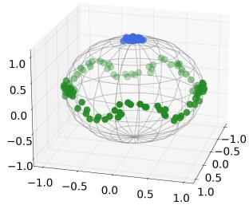
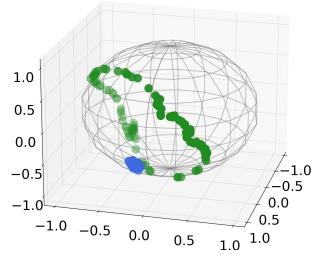
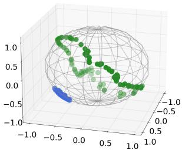
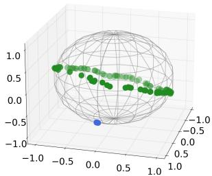
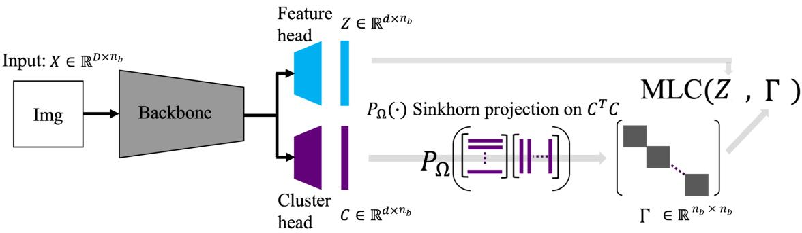
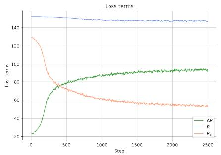
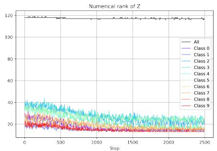
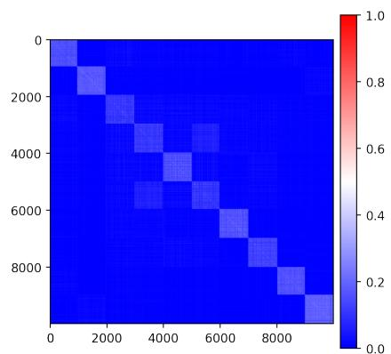

# Unsupervised Manifold Linearizing and Clustering

Tianjiao Ding1 Shengbang Tong2 Kwan Ho Ryan Chan1 Xili Dai3 Yi Ma2 Benjamin D. Haeffele1

## Abstract

We consider the problem of simultaneously clustering and learning a linear representation ofdata lying close to a union oflow-dimensional manifolds, afundamental task in machine learning and computer vision. When the manifolds are assumed to be linear subspaces, this reduces to the classical problem of subspace clustering, which has been studied extensively over the past two decades. Unfortunately, many real-world datasets such as natural images can not be well approximated by linear subspaces. On the other hand, numerous works have attempted to learn an appropriate transformation ofthe data, such that data is mapped from a union of general non-linear manifolds to a union of linear subspaces (with points from the same manifold being mapped to the same subspace). However, many existing works have limitations such as assuming knowledge of the membership of samples to clusters, requiring high sampling density, or being shown theoretically to learn trivial representations. In this paper, we propose to optimize the Maximal Coding Rate Reduction metric with respect to both the data representation and a novel doubly stochastic cluster membership, inspired by state-of-the-art subspace clustering results. We give a parameterization of such a representation and membership, allowing efficient mini-batching and one-shot initialization. Experiments on CIFAR-10, -20, -100, and TinyImageNet-200 datasets show that the proposed method is much more accurate and scalable than state-of-the-art deep clustering methods, andfurther learns a latent linear representation ofthe data.

## 1. Introduction

## 1.1. Clustering: from Linear to Non-linear Models

Clustering is a fundamental problem in machine learning, allowing one to group data into clusters based on assumptions about the geometry of each cluster. As early as the 1950s, the classic k-means [43, 23, 30, 46] algorithm emerged to cluster data that concentrate around distinct centroids, with numerous variants [8, 2, 4] following. This assumption of distinct centroids was later generalized in subspace clustering methods, which aim to cluster data lying close to a union of low-dimensional linear (or affine) subspaces5. This motivated numerous lines of research in the past two decades, leading to various formulations [20, 22, 44, 41, 28, 75, 40, 33] with efficient algorithms [76, 75, 15] and theoretical guarantees on the correctness of the clustering [58, 59, 71, 72, 36, 63, 74, 55, 69]. Subspace clustering has been used in a wide range of appli cations, such as segmenting image pixels [45, 70, 42], video frames [65, 61, 37], or rigid-body motions [66, §11], along with clustering face images [24, 29, 22] or human actions [73, 25, 50].

  
(a)

  
(b)

  
(c)

  
(d)  
Figure 1: (a) Input data X where 100 points in green lie on a curve and 100 in blue lie close to a point. (b) Stage 0: Features $f _ { \pmb { \theta } } ( \pmb { X } )$ from a neural network f✓ whose parameters ✓ are randomly initialized. (c) Stage 1: Features after self-supervised learning. (d) Stage 2: Features further improved by the proposed Manifold Linearizing and Clustering (MLC).

However, while subspace clustering methods have achieved state-of-the-art performance for certain tasks and datasets, the geometric assumption upon which they rely (namely that the datapoints lie on a union of linear or affine subspaces) is often grossly violated for common high-dimensional datasets. For instance, even in a dataset as simple as MNIST hand-written digits [34], images of a single digit do not lie close to a low-dimensional subspace; directly applying subspace clustering methods thus fails. Instead, a more natural idea is to assume that each cluster is defined by a non-linear low-dimensional manifold and to learn or design a non-linear transformation of the data so that points from one manifold are mapped to one linear subspace. In some cases, one may be able to hand-craft an appropriate transformation of the data, with polynomial or exponential kernel mappings being examples that have been explored in the literature [21], and the authors of [39] show that a subspace clustering method achieves 99% clustering accuracy on MNIST when the data is passed through the scattering-transform [9].

Unfortunately though, hand-crafted design requires one to assume specific and simple families of manifolds which is often unrealistic and challenging to apply on complicated data such as natural images. On the other hand, the authors of [21] propose to cluster data via treating a local neighborhood of the manifold approximately as a linear subspace and applying subspace clustering techniques to local neighborhoods. However, this method requires sufficient sampling density to succeed, which implies a prohibitive number of samples when the manifolds have moderate dimension or curvature. More recently, numerous works propose to learn an appropriate transformation of the data via deep networks and then perform subspace clustering in a latent feature space [53, 31, 1, 80, 32]. Unfortunately, it has been shown that many of these formulations are ill-posed and provably learn trivial representations6, with much of the claimed benefit coming from ad-hoc post-processing rather than the method itself [27]. This motivates the one of the primary questions we consider here:

Question 1. Can we efficiently transform data near a union oflow-dimensional manifolds, so that the transformed data lie close to a union of low-dimensional linear subspaces to allowfor easy clustering?

## 1.2. Learning Diverse and Discriminative Features: from Supervised to Unsupervised Learning

Meanwhile, learning a compact representation from multi-modal data has been a topic of its own interest in machine learning [7]. An ideal property of the learned representation is between-cluster discrimination, namely, features from different clusters should be well separated, which is often pursued via a loss such as the classic crossentropy (CE) objective. However, an important yet often ignored property is that the learned representation maintains within-cluster diversity. This allows distances of samples within a cluster to be preserved under the learned transformation, which may facilitate downstream tasks such as generation [16], denoising [68], and semantic interpretation [78, §B.3.1] (see also §A). Unfortunately, the representation learned by CE fails to achieve this property and exhibits neural collapse, a phenomenon discovered by [51] with extensive theoretical and empirical analysis [47, 85, 62, 83] (even for non-CE objectives [84]), where latent features from one cluster tend to collapse to a single point. In contrast, [78] recently proposed Maximal Coding Rate Reduction (MCR2) as an objective to pursue both of the mentioned ideal properties. In particular, MCR2 learns a unionof-orthogonal-subspaces representation: features from each cluster spread uniformly in a low-dimensional subspace (compact & within-cluster diverse), and the subspaces corresponding to different clusters are orthogonal to each other (between-cluster discriminative). Nevertheless, MCR2 requires ground-truth labels to learn such a representation. This leads to our second question of interest:

Question 2. For data lying close to a union of manifolds, can we learn a union-of-orthogonal-subspaces representation, without access to the ground-truth labels?

## 1.3. Our Contributions

To address the two interrelated questions, we start with the basic idea of blending the philosophies from MCR2 and subspace clustering to explore the best of both worlds. This idea leads us to the following contributions.

• Formulation (§2): We propose Manifold Linearizing and Clustering (MLC) objective (4), which optimizes the MCR2 loss over both the representation and a novel doubly stochastic cluster membership . The latter consists of pair-wise similarities between samples, and it is constrained to be doubly stochastic, inspired by stateof-the-art subspace clustering results [39, 18].

• Algorithm (§3): We describe how to parameterize and initialize the representation and membership, as well as to optimize MLC (4). Even though the membership is doubly stochastic, which may appear large in size and hard to constrain, we give an efficient parameterization of it that allows for mini-batching and notably one-shot initialization. That is, the membership is initialized with no additional training whatsoever leveraging already-initialized representation, which is stable, structured, and efficient.

• Experiments (§4): On CIFAR-10, we demonstrate that MLC learns a union-of-orthogonal-subspaces representation, and achieves more accurate clustering than state-of-the-art subspace clustering methods. Moreover, on CIFAR-10, -20, -100, and TinyImageNet-200, we show that MLC yields higher clustering accuracy using less running time than state-of-the-art deep clustering methods, even when there are many or imbalanced clusters.

## 1.4. Additional Related Work

Beyond the above, we make connections to a few emerging deep-learning-based works related to this paper.

Self-supervised Representation Learning. An important line of research that learns a representation without using ground-truth labels is that of self-supervised learning. It has seen remarkable recent progress thanks to the so-called joint-embedding approach. The basic idea of the latter is to learn a representation such that augmentations of the same input have similar features, while features from different inputs do not collapse to a single point. Extending this idea, self-supervised methods such as SimCLR [12], BYOL [26], and VICReg [5] are able to learn representations on par with those obtained from supervised learning methods; see [57] for an excellent review. Encouraging as it may sound, these methods do not aim to learn a union-oforthogonal-subspaces representation, nor do they explicitly model clustering in their design. Nevertheless, we shall see that self-supervised methods are key stepping stones for the proposed method, as they will be used to initialize parts of our model.

Clustering and Representation Learning. Numerous works have proposed to jointly perform clustering and representation learning, leveraging the success of selfsupervised learning. Roughly speaking, most methods consider the following two steps. The first step is to use selfsupervised learning to initialize the representation. Indeed, state-of-the-art methods such as SCAN [64] and SPICE [48] adopt SimCLR [12] and MoCoV2 [14] as their pre-trained features. Starting from the initial representation, the second step is to iteratively refine the representation and clustering, using the idea of pseudo-labeling [10, 64, 52, 48]. Despite the promising clustering performance, the representation learned by these methods is not constrained to be both between-cluster discriminative and within-cluster diverse. In contrast, our approach learns a representation with these two ideal properties (Figure 4) and also achieves state-ofthe-art clustering performance (Tables 3, 4 and 6). Finally, the work most closely related to this paper is that of Neural Manifold Clustering and Embedding (NMCE) [38] – we note similarities and differences in terms of formulation, algorithm, and empirical performance at the end of §2.2.

Table 1: Summary of prior works and our contributions.
<table><tr><td></td><td colspan="2">Manifold</td><td colspan="2">Self-supervised Initialization</td></tr><tr><td></td><td>Linearizing</td><td>Clustering</td><td>Representation</td><td>Membership</td></tr><tr><td>MCR² [78]</td><td>yes</td><td>no</td><td>n/a</td><td>n/a</td></tr><tr><td>SCAN [64]</td><td>No</td><td>yes</td><td>one shot</td><td>one shot</td></tr><tr><td>NMCE [38]</td><td>yes</td><td>yes</td><td>one shot</td><td>no</td></tr><tr><td>MLC (Ours)</td><td>yes</td><td>yes</td><td colspan="2">one shot</td></tr></table>

## 2. Formulation

We begin by making clear the problem of interest.

Problem 1 (Unsupervised Manifold Linearizing and Clustering). Suppose $\bar { \pmb X } = [ \pmb x _ { 1 } , \dots , \pmb x _ { n } ] \in \mathbb { R } ^ { D \times n }$ is a dataset of n points lying on an union of k low-dimensional manifolds $\cup _ { j = 1 } ^ { \bar { k } } { \mathcal { M } } _ { j }$ . Given X, we aim to simultaneously

1. Cluster the samples: find yˆ such that $\pmb { x } _ { i } \in \mathcal { M } _ { \hat { y } ( i ) } ;$

2. Learn a linear representation: find a transformation $f : \mathbb { R } ^ { D }  \mathbb { R } ^ { d }$ , such that features $f ( { \pmb x } _ { i } ) ^ { * } { \bf s }$ from the same cluster spread uniformly in a low-dimensional linear subspace, and the subspaces arising from different clusters are orthogonal.

In §2.1, we review the principle of Maximal Coding Rate Reduction (MCR2) which is designed to learn ideal representations in a supervised manner, i.e., when the ground-truth membership is given. Then in §2.2, we discuss the challenges of simultaneous clustering and learning a representation (i.e., addressing Problem 1 in its entirety), for which we propose our MLC objective (4). Later in $\ S 3 .$ , we further give an algorithm to optimize MLC (4).

## 2.1. Supervised Manifold Linearizing via MCR2

When the cluster membership is given as supervision, MCR2 [78] is designed to solve part 2) of Problem 1. To begin with, let $f _ { \pmb \theta } : \mathbf { \bar { \mathbb { R } } } ^ { D }  \mathbb { S } ^ { d - 1 }$ be a transformation parameterized by a neural network; this in turn gives the features $Z : = [ z _ { 1 } , \ldots , z _ { n } ] \in \mathbb { R } ^ { d \times n }$ of data with $z _ { i } : = f _ { \pmb \theta } ( \pmb x _ { i } ) \in$ $\mathbb { S } ^ { d - 1 }$ . MCR2 aims to learn an ideal representation by utilizing the coding rate measures. Define the coding rate

$$
R ( Z ; \epsilon ) : = \log \operatorname* { d e t } \left( I + { \frac { d } { n \epsilon ^ { 2 } } } Z Z ^ { \top } \right) .
$$

Intuitivel ${ \mathrm { y } } ^ { 7 } , R ( Z ; \epsilon )$ measures some volume of features in $z$ up to $\epsilon > 0$ precision, so maximizing it would diversify features of all the samples. Likewise, one can apply the measure to features of each cluster and take weighted mean over the clusters; namely, define $R _ { c } ( Z , { \bf { I I } } ; \epsilon )$ as

$$
\sum _ { j = 1 } ^ { k } \frac { \langle \Pi _ { j } , \mathbf { 1 } \rangle } { n } \log \operatorname* { d e t } \left( I + \frac { d } { \langle \Pi _ { j } , \mathbf { 1 } \rangle \epsilon ^ { 2 } } Z \operatorname { D i a g } ( \Pi _ { j } ) Z ^ { \top } \right) .
$$

Here $\mathbf { I I } = [ \pmb { \Pi } \pmb { \Pi } _ { 1 } , \dots , \pmb { \Pi } _ { k } ] \in \mathbb { R } ^ { n \times k }$ is a given point-cluster membership such that $\Pi _ { i j } = 1$ if $\mathbf { \pmb { x } } _ { i } \in { \mathcal { M } } _ { j }$ and $\Pi _ { i j } = 0$ otherwise, 1 is a vector of all ones so $\langle \Pi _ { j } , \mathbf { 1 } \rangle$ is the number of points in cluster $j ,$ and for any $\pmb { v } \in \mathbb { R } ^ { n }$ , Diag(v) denotes a diagonal matrix with the entries of v along the diagonal. Minimizing $R _ { c } ( Z , { \bf { I I } } ; \epsilon )$ thus pushes features in each cluster to stay close. $\tt M C R ^ { 2 }$ learns an ideal representation by maximizing the coding rate reduction (hence the acronym)

$$
\operatorname* { m a x } _ { \theta } \quad R ( Z ; \epsilon ) - R _ { c } ( Z , \Pi ; \epsilon ) \quad \mathrm { s . t . } \quad Z = f _ { \theta } ( X )\tag{1}
$$

Notably, it has been shown that given ⇧, the features obtained by maximizing the rate reduction has the property that the features of each cluster spread uniformly within a subspace (within-cluster diverse), and subspaces from different clusters are orthogonal (between-cluster discriminative), under relatively mild assumptions [78, Theorem 2.1].

## 2.2. Unsupervised Manifold Linearizing and Clustering

While MCR2 is designed to learn ideal representations (§1) when the membership ⇧ is given, here we are interested in the unsupervised setting where one does not have access to membership annotations. To address both parts 1) and 2) of Problem 1, a natural idea is to optimize $\tt M C R ^ { 2 }$ over both the representation Z and membership ⇧ via

$$
\operatorname* { m a x } _ { \pmb { \theta } , { \bf { I I } } \in \Omega _ { 0 } } R ( \pmb { Z } ; \epsilon ) - R _ { c } ( \pmb { Z } , { \bf { I I } } ; \epsilon ) \quad \mathrm { s . t . } \quad \pmb { Z } = f _ { \pmb { \theta } } ( \pmb { X } ) .\tag{2}
$$

Here $\begin{array} { r } { \Omega _ { \circ } : = \{ \Pi \in \mathbb { R } ^ { n \times k } : \forall i \in [ n ] , \ \exists \hat { y } ( i ) \quad \mathrm { s . t . } \ \Pi _ { i \hat { y } ( i ) } = } \end{array}$ 1 and $\Pi _ { i j } = 0 \mathrm { f o r } j \neq \hat { y } ( i ) \}$ is the set of all ‘hard’ assignments, i.e., each row of ⇧ is a one-hot vector. However, this optimization is in general combinatorial: its complexity grows exponentially in n and k, and it does not allow smooth and gradual changes of ⇧. Further, a second challenge is the chicken-and-egg nature of this problem: If one already has an ideal representation $z ,$ then existing subspace clustering methods can be applied on $z$ to estimate the membership. Likewise, if one is given the ground-truth membership ⇧ of clusters, then solving (1) would lead to an ideal representation. However, the $z$ and ⇧ at the beginning of optimization are typically far from ideal.

In the rest of this section, we propose a so-called doubly stochastic membership to deal with the combinatorial challenge. To tackle the chicken-and-egg nature, we parameterize and initialize the representation and membership in an efficient and effective way, as we will discuss in $\ S 3$

Doubly Stochastic Subspace Clustering. To address the combinatorial nature of estimating the memberships, we draw inspiration from the closely related problem of subspace clustering, where the goal is to cluster n samples assumed to lie close to a union of k low-dimensional subspaces (§1.1). In this case, one typically does not directly learn an $n \times k$ matrix denoting memberships of n points into k subspaces. Instead, one first learns an affinity matrix $\mathbf { T } \in \mathbb { R } ^ { n \times n }$ signaling the similarities between pairs of points, and then applies spectral clustering on the learned  to obtain a final clustering [20, 22, 44, 41, 28, 75]. In particular, requiring doubly-stochastic constraints on the affinity  is shown theoretically to suppress false inter-cluster connections for clustering [18] along with state-of-the-art empirical performance for subspace clustering [39].

Inspired by the above, we propose a constraint set ⌦ for matrix  to be the set of $n \times n$ doubly stochastic matrices,

$$
\Omega = \{ \mathbf { r } \in \mathbb { R } ^ { n \times n } : \mathbf { r } \geq 0 , \quad \mathbf { r 1 } = \mathbf { r } ^ { \top } \mathbf { 1 } = \mathbf { 1 } \} .\tag{3}
$$

However, this constraint alone is insufficient for strong clustering performance: Consider optimizing $\tt M C R ^ { 2 }$ with respect to $\mathbf { T } \in \Omega$ only, and note that the objective is convex with respect to . Since we maximize a convex function with respect to convex constraints $\Omega ,$ an optimal  would lie at an extreme point of $\Omega ,$ , which for doubly stochastic matrices is a permutation matrix. This is not ideal for clustering, as it implies that every point is assigned to its own distinct cluster, and there is no incentive to merge points into larger clusters. To resolve this issue, we use a negative entropy regularization ${ \textstyle \sum _ { i j } } \Gamma _ { i j } \log ( \Gamma _ { i j } )$ to  which biases  toward the uniform matrix $\scriptstyle { \frac { 1 } { n } } \mathbf { 1 } \mathbf { 1 } ^ { \intercal }$ . By tuning the coefficient of such regularization, we can also tune the sparsity level of . This regularization can be conveniently integrated into the network architecture, as we will see in $\ S 3$ Now we are ready to state our proposed formulation Manifold Linearizing and Clustering (MLC):

$$
\begin{array} { r l } { \displaystyle \operatorname* { m a x } _ { \theta } } & { R ( Z ; \epsilon ) - R _ { c } ( Z , \Gamma ; \epsilon ) } \\ { \mathrm { s . t . } } & { Z = f _ { \theta } ( X ) , \ \Gamma = h _ { \theta } ( X ) \in \Omega , \mathrm { ~ w h e r e ~ } } \\ & { R _ { c } ( Z , \Gamma ; \epsilon ) = \displaystyle \frac { 1 } { n } \sum _ { j = 1 } ^ { n } \log \operatorname* { d e t } \bigg ( I + \frac { d } { \epsilon ^ { 2 } } Z \mathrm { D i a g } ( ( \Gamma ) _ { j } ) Z ^ { \top } \bigg ) . } \end{array}\tag{4}
$$

Note that both Z and  are parameterized by neural networks. While a doubly stochastic membership  may seem large in size and hard to constrain, we explain in $\ S 3$ how we parameterize  so that the constraints are satisfied by construction and efficient mini-batching is allowed.

Comparison with NMCE. A recent paper (NMCE) [38] studies the same Problem 1 as in this paper, and also proposes to optimize $\tt M C R ^ { 2 }$ over both the representation and membership. Their method adopts an n k matrix ⇧ to model the point-cluster membership; in contrast MLC uses a dou-$b l y$ stochastic point-point membership  inspired from the state-of-the-art subspace clustering (as stated above). Although seemingly not particularly significant, we note that in practice this allows for significantly simpler initialization strategies since we can initialize with a $n \times n$ estimate of an affinity matrix rather than a $n \times k$ estimate of cluster membership. We further elaborate on algorithmic differences at the end of §3.2, and give empirical evidence that MLC is more accurate (Table 3) and stable against randomness (§F).

  
Figure 2: Overall architecture for optimizing the proposed Manifold Linearizing and Clustering (MLC) objective (4). Given a mini-batch of $n _ { b }$ input samples X each lying in $\mathbb { R } ^ { D }$ , their d-dimensional representation is given by Z . Further, their doubly stochastic membership matrix  is given by taking an inner product kernel of the output of the cluster head C followed by a doubly stochastic projection.

## 3. Algorithm

In this section, we describe how to parameterize the representation Z and doubly stochastic membership  (§3.1), as well as how to initialize them (§3.2) – in an efficient and effective manner. We summarize the meta-algorithm in Algorithm 1, and the overall architecture in Figure 2.

## 3.1. Efficient Parameterization

Parameterizing Z. As is common practice, we take an existing network architecture such as ResNet-18 as the backbone. We append a few affine layers with non-linearities as thefeature head to further transform the output of the backbone to $\mathbb { R } ^ { d }$ , followed by a projection layer to respect the unit sphere $\mathbb { S } ^ { d - 1 }$ constraint.

Parameterizing . Different from parameterizing Z, this is much less trivial: If one were to directly take  as decision variables in ⌦, it would lead to maintaining $O ( n ^ { 2 } )$ variables, which is prohibitive for large datasets $( \mathrm { e } . \mathrm { g } . , n = 1 0 ^ { 6 }$ for ImageNet). To allow efficient computation, we again draw inspiration from subspace clustering: There, the membership  given data $\boldsymbol { X }$ often takes the form of $g ( X ) ^ { \top } g ( X )$ for some transformation $^ { g , }$ such as in the inner product kernel [28, 18] where $g ( X ) = X$ or the least square regression [44] where $g ( X ) = ( I + { }$ $\lambda X ^ { \top } X ) ^ { - 1 / 2 } \bar { X }$ . It is then tempting to take a neural network g✓ and use $C ^ { \top } C$ as the membership where ${ \boldsymbol { C } } =$ $g _ { \pmb { \theta } } ( \pmb { X } )$ . Nevertheless, such a matrix is in general not doubly stochastic, i.e., $C ^ { \top } C \notin \Omega$ . To obtain a doubly stochastic membership, we further apply a Sinkhorn projection layer $P _ { \Omega , \eta } ( \cdot ) \left[ 5 6 \right.$ , 19], which gives $\Gamma = P _ { \Omega , \eta } ( C ^ { \top } C ) \in \Omega$ , where ⌘ is the coefficient of entropy regularization.8 As in parameterizing Z, we implement $g _ { \pmb { \theta } }$ by taking the same backbone and appending layers of the same type to be the cluster head. As we shall see soon in §3.2, such a parameterization further allows us to initialize both Z and  in one shot using self-supervised learning.

Complexity. Thanks to the above parameterization, we can do forward and backward passes efficiently via minibatches. For a mini-batch of $n _ { b }$ samples $( n _ { b } \ll n \mathrm { t y p i c a l l y ) }$ , the mini-batched versions of $z , C$ and  have sizes $d \times n _ { b }$ $d \times n _ { b }$ and $n _ { b } \times n _ { b }$ , respectively (Figure 2).9

## 3.2. Efficient Initialization

Since the proposed MLC objective (4) is non-convex, it is important to properly initialize both Z and  to converge to good (local) minimum.

Initializing Z: Self-supervised Representation Learning. Randomly initialized features could be far from being ideal (in the sense defined in §1), and further may not respect the invariance to augmentation, i.e., the augmented samples should have their representation close to each other. Thus, we initialize the features using a selfsupervised learning called total coding rate (TCR) [38]

$$
\begin{array} { r l } { \underset { \theta } { \operatorname* { m a x } } } & { \displaystyle R \Big ( \frac { Z + Z ^ { \prime } } { 2 } ; \epsilon \Big ) + \lambda \sum _ { i = 1 } ^ { n } | z _ { i } ^ { \top } z _ { i } ^ { \prime } | , } \\ { \mathrm { s . t . } } & { z _ { i } ^ { \prime } , z _ { i } \in \mathbb { S } ^ { d - 1 } , \quad \forall i \in [ n ] , } \end{array}\tag{5}
$$

where for every $i , z _ { i }$ and $ { \boldsymbol { z } } _ { i } ^ { \prime }$ are features of different augmentations of the i-th sample. This essentially requires that features from different augmentations of the same sample should be as close as possible, whereas features from different samples should be as uncorrelated as possible. 10

Initializing . An ideal initialization of  would be such that if $\Gamma _ { i j }$ has a high value then points $i , j$ are likely to be from the same true cluster and vice versa. Luckily, after the self-supervised feature initialization mentioned above, Z already have some structures which we can utilize. Thus, we propose to initialize  with $P _ { \Omega , \eta } ( Z ^ { \top } Z )$ ; this is easily implemented by copying the parameters from the feature head to the cluster head once after the self-supervised initialization of the features, thanks to the parameterization of  discussed in §3.1.

With the parameterization and initialization of our doubly stochastic membership  set up, we are ready to contrast it with a popular alternative in the sequel.

Doubly Stochastic Membership vs. Point-Cluster Membership. Different from the doubly stochastic point-point membership  proposed in this paper, prior deep representation learning and clustering works [64, 38, 48] often model a point-cluster membership. That is, an n k matrix ⇧ where each row represents the probability of a point belonging to k clusters. ⇧ is parameterized by a neural network (or a cluster head if one wishes), initialized randomly or otherwise via an extra training stage after the representation Z is initialized. We highlight a few advantages of using a doubly stochastic point-point membership over a point-cluster one:

• Stable: As  is initialized deterministically, the performance of MLC is more stable compared to incorporating randomness in initializing the cluster head. We further justify this point empirically in §F.

• Structured: Initialization of  takes advantage of structures from self-supervised initialized Z. As a side benefit, MLC automatically gains from developments of selfsupervised representation learning.

• Efficient: Once Z is initialized,  can be initialized with no additional cost whatsoever, compared to using any extra training stage to initialize the cluster head. In contrast, e.g., SCAN [64] trains the cluster head with 10 different random initializations, which is time-consuming.

Data Augmentation. Beyond initializing Z, it is often desirable to incorporate augmentation in optimizing the MLC objective (4). Specifically, from $\{ X ^ { ( a ) } \ { \stackrel { \bullet } { \in } } \ \mathbb { R } ^ { D \times { \stackrel { \smile } { n } } } \} _ { a = 1 } ^ { A }$ the dataset X under A different augmentations, one computes $( Z ^ { ( a ) } \in \mathbb { R } ^ { d \times n } , \Gamma ^ { ( a ) } \in \mathbb { R } ^ { d \times n } )$ ) for each augmentation a, and use in (4)

$$
Z = P _ { \mathbb { S } ^ { d - 1 } } \left( { \frac { 1 } { A } } \sum _ { a = 1 } ^ { A } { Z ^ { ( a ) } } \right) , \quad \mathbf { \Gamma } ^ { \mathbf { \Gamma } } = { \frac { 1 } { A } } \sum _ { a = 1 } ^ { A } \mathbf { r } ^ { ( a ) } \in \Omega .\tag{6}
$$

Note that one can benefit from parallelization by putting $\pmb { X } ^ { ( a ) } , \pmb { Z } ^ { ( a ) } , \pmb { \Gamma } ^ { ( a ) }$ for each augmentation a on one comput-

Algorithm 1 MLC: Manifold Linearizing and Clustering   
Input: $X \in \mathbb { R } ^ { D \times n } , ~ \epsilon , \eta > 0 , ~ d , k , n _ { b } , T , A \in \mathbb { Z } _ { \ge 0 }$   
1: initialize Z by self-supervised representation learning   
. (5)   
2: initialize  via parameter copying   
3: for $t = 1 , \dots , T$ do   
4: $\bar { \pmb X } \in \mathbb { R } ^ { D \times n _ { b } } $ sample a batch from X   
5: $\bar { \pmb X } ^ { ( 1 ) } , \dots , \bar { \pmb X } ^ { ( A ) }$ apply A augmentations to $\bar { X }$   
6: Z¯, ¯ forward pass with $\{ \bar { X } ^ { ( \bar { a } ) } \} _ { a = 1 } ^ { A }$ and network   
parameters ✓ . (6)   
7: $\nabla _ { \theta } ( 4 ) $ backward pass   
8: ✓ update ✓ using some optimizer on $\nabla _ { \pmb { \theta } } ( 4 )$   
9: end for   
10: run spectral clustering on  to estimate labels yˆ   
Output: Z, yˆ

ing device, since $\Gamma ^ { ( a ) }$ only depends on $X ^ { ( a ) }$ but not from other augmentations.

## 4. Experiments on Real-World Datasets

We empirically verify that MLC learns a union-oforthogonal-subspaces representation, and yields more accurate clustering than state-of-the-art subspace clustering methods (§4.1). Further, we show that MLC outperforms state-of-the-art deep clustering methods, even when there are many or imbalanced clusters (§4.2).

Metrics. To evaluate the clustering quality, we run spectral clustering on learned membership matrix , and report the normalized mutual information (NMI, [60]) and clustering accuracy (ACC, [35]), as are commonly used in clustering tasks. To evaluate the learned representation, we define the following metric: for a collection of points $W = [ \pmb { w } _ { 1 } , \dots , \pmb { w } _ { l } ] \in \mathbb { R } ^ { d \times l } ( l > d )$ with associated singular values $\lbrace \sigma _ { i } \rbrace _ { i = 1 } ^ { d }$ , define the numerical rank of W as arg minr $\left\{ r : \sum _ { i = 1 } ^ { r } \sigma _ { i } ^ { 2 } / \sum _ { i = 1 } ^ { d } \sigma _ { i } ^ { 2 } > 0 . 9 5 \right\}$ . Now, one can measure the numerical rank of the learned representation Z, as well as that of each ground-truth cluster11 of Z. A low numerical rank of W implies that points in W lie close to a low-dimensional subspace. We further report the cosine similarity of learned representation, which is simply $| z _ { i } ^ { \top } z _ { j } |$ for points i and j, since $\| z _ { i } \| = 1$ by construction in (4). Finally, to compare the efficiency of methods we report the training time in §4.2, where the experiments are run on 2 Nvidia RTX3090 GPUs.

## 4.1. Comparison with Subspace Clustering

To demonstrate the ability of MLC to cluster the samples and linearize the manifolds, we conduct experiments on

  
(a) Coding rate of all features $R ,$ that of (b) Numerical ranks of all features $z$ and clustered features $R _ { c } .$ , and the rate reduction features from each ground-truth cluster $i ,$ $\Delta R = R - R _ { c }$ $\{ z _ { j } : y ( j ) = i \}$

  
Figure 3: Coding rates (as loss terms in MLC (4)) and numerical ranks (§4.1) of the Figure 4: Cosine similarity $| Z _ { \mathrm { { \scriptscriptstyle M L C } } } ^ { \mathrm { { T } } } Z _ { \mathrm { { \scriptscriptstyle M L C } } } |$ features learned by MLC on CIFAR-10 as epoch varies. of the features $Z _ { \mathrm { M L C } }$ learned by MLC.

CIFAR-10, which consists of RGB images from 10 classes such as planes, birds, and deers. As mentioned in §1 subspace clustering methods rely crucially on the assumption that data lie close to a union of linear subspaces, which many real-world dataset may not satisfy. To show that this is the case, we additionally compare the proposed method with subspace clustering methods. As we shall see, applying subspace clustering directly on self-supervised features of CIFAR-10 will yield low clustering accuracy. In contrast, MLC is able to achieve high clustering accuracy, and moreover, produce a union-of-orthogonal-subspaces representation on which subspace clustering methods can also achieve high accuracy.

Data. We use the training split of CIFAR-10 containing 50000 RGB images, each of size $3 \times 3 2 \times 3 2$ We use the augmentation specified in the Appendix to perform self-supervised representation learning via TCR (5) and get $\boldsymbol { Z } _ { \mathrm { T C R } }$ . For a fair comparison, the so-learned ${ \cal Z } _ { \mathrm { T C R } }$ are used both as initialization for MLC (line 1 of Algorithm 1), and as the input for subspace clustering methods12. In MLC, for each image in each batch we randomly sample $A = 2$ augmentations to apply to the image. As an additional comparison, we also run subspace clustering methods on the features $\boldsymbol { Z } _ { \mathrm { M L C } }$ learned by MLC.

Methods. We compare with the elastic-net subspace clustering with active-set solver (EnSC, [75]) and sparse subspace clustering with orthogonal matching pursuit solver (SSC-OMP, [76]), using off-the-shelf implementation provided by the authors13. We search the parameters of EnSC over $( \gamma , \tau ) \ \in \ \{ 1 , 5 , 1 0 , 5 0 , 1 0 0 \} \ \times \ \{ 0 . 9 , 0 . 9 5 , 1 \}$ and those of SSC over $( k _ { \mathrm { m a x } } , \epsilon ) \in \{ 3 , 5 , 1 0 , 2 0 \}$ X $\{ 1 0 ^ { - 4 } , 1 0 ^ { - 5 } , 1 0 ^ { - 6 } , 1 0 ^ { - 7 } \}$ , and report the run with the highest clustering accuracy for each method. We summarize detailed parameters for MLC in the Appendix.

Table 2: Clustering accuracy and normalized mutual information of subspace clustering (EnSC, SSC-OMP) and proposed manifold linearizing and clustering (MLC). X contains $6 \cdot 1 0 ^ { 4 }$ images from 10 classes of CIFAR-10, $\boldsymbol { Z } _ { \mathrm { T C R } }$ are features learned via self-supervised learning TCR, $Z _ { \mathrm { M L C } }$ are features learned by MLC.
<table><tr><td>Method</td><td>Input Data</td><td>ACC</td><td>NMI</td></tr><tr><td rowspan="2">EnSC</td><td> $\boldsymbol { Z } _ { \mathrm { T C R } }$ </td><td>72.2</td><td>67.9</td></tr><tr><td> $Z _ { \mathrm { M L C } }$ </td><td>81.5</td><td>79.2</td></tr><tr><td rowspan="2">SSC-OMP</td><td> $\boldsymbol { Z } _ { \mathrm { T C R } }$ </td><td>67.8</td><td>64.5</td></tr><tr><td> $Z _ { \mathrm { M L C } }$ </td><td>78.4</td><td>76.3</td></tr><tr><td>MLC</td><td>X</td><td>86.3</td><td>78.3</td></tr></table>

Results. Figure 3 reports the coding rates (as loss terms in (4) and numerical ranks of features learned by MLC as epoch varies. As a first note, the coding rate R of all features (the blue curve in 3a) decreases only slightly as epoch goes, indicating that the overall representation is diverse in the feature space. Indeed, the numerical rank of all features (the dark curve in Figure 3b) stays 118 which is close to the dimension 128 of the feature space. This is in sharp contrast to the deep subspace clustering methods where all the features collapse to a one-dimensional subspace [27]. Moreover, as the coding rate $R _ { c }$ of clustered features (the orange curve in Figure 3a) goes down, the numerical ranks of features from each ground-truth cluster decrease. For instance, the representation from true cluster 3 has a numerical rank of 37 in the first step and 24 in the last step. This implies that most representation gets linearized better and clustered more accurately, even though the MLC objective (4) is unsupervised, i.e., it does not use ground-truth labels.

Last but not least, note that the features within each groundtruth cluster spread well in a low-dimensional subspace, $\mathrm { { e . g . } }$ ., the numerical ranks for the true clusters at the last step are within [13, 23]. This achieves the desired within-cluster diverse property (§1), as opposed to the neural collapse phenomenon that appears with the cross-entropy loss.

Now we compare MLC with subspace clustering methods. Table 2 reports clustering accuracy and normalized mutual information for applying EnSC, SSC-OMP on selfsupervised features $\boldsymbol { Z } _ { \mathrm { T C R } }$ , features $Z _ { \mathrm { M L C } }$ learned by MLC, and applying MLC on X, where X is $6 \cdot 1 0 ^ { 4 }$ images from 10 classes of CIFAR-10. In addition, we plot the cosine similarity of the features learned by MLC in Figure 4. Remarkably, the highest clustering accuracy is 86.3% achieved by MLC on X, which surpasses EnSC (72.2%) and SSC-OMP (67.8%) on $\pmb { Z } _ { \mathrm { T C R } }$ by a large margin, even though $\pmb { Z } _ { \mathrm { T C R } }$ is used both as initialization for MLC and input for EnSC and SSC-OMP. Interestingly, using instead the features $\boldsymbol { Z } _ { \mathrm { M L C } }$ learned by MLC, the clustering performance of EnSC and SSC-OMP increases and even becomes comparable to MLC, e.g., EnSC achieves 79.2% normalized mutual information compared to 78.3% of MLC. This suggests that $Z _ { \mathrm { M L C } }$ has a union-of-subspace structure that can be utilized by subspace clustering. Indeed, as seen in Figure 4, features from different clusters tend to have a small similarity, i.e., being orthogonal to each other. This demonstrates the betweencluster discrimination (§1) as desired.

## 4.2. Comparison with Deep Clustering

We further compare the proposed MLC with state-of-theart deep clustering methods on large-scale datasets (CIFAR-10, -20, -100, and TinyImageNet-200). Different than MLC, most methods reported (all except NMCE as discussed in §2.2) do not aim to learn a union-of-orthogonal-subspaces representation. Be that as it may, MLC achieves comparable or better clustering accuracy than state-of-the-art methods using less running time, even when the dataset presents many or imbalanced clusters.

Datasets. Beyond CIFAR-10 (§4.1), we further use CIFAR-20, CIFAR-100 and TinyImageNet-200 to evaluate the performance of our method. Both CIFAR-100 and CIFAR-20 contain the same 50000 train images and 10000 test images with size $3 2 \times 3 2 \times 3 .$ while the former are split into 100 clusters and the latter 20 super clusters. Finally, TinyImageNet contains 100000 train images and 10000 test images with size $6 4 \times 6 4 \times 3$ split into 200 clusters.

Baseline Methods. We include clustering accuracy and normalized mutual information reported by SCAN [64], GCC [82], NNM [17], IMC [49], NMCE [38], SPICE [48] on aforementioned datasets whenever applicable. In addition, to compare the running time as well as to have more baseline methods when there are many clusters, we conduct experiments with MLC, SCAN [64], and IMC [49] on CIFAR-

Table 3: Clustering accuracy and normalized mutual information of different methods on CIFAR-10 and CIFAR-20. For a fair comparison, all methods use ResNet-18 as backbone.
<table><tr><td>Method vs. Dataset &amp; Metric</td><td>CIFAR-10 ACC NMI</td><td>ACC</td><td>CIFAR-20</td></tr><tr><td>SCAN-SimCLR (ECCV &#x27;20)</td><td>.876 .787</td><td>.468</td><td>NMI .459</td></tr><tr><td>GCC-SimCLR (ICCV ’21) NNM-SimCLR (CVPR &#x27;21)  $\mathrm { I M C } { - } . \mathrm { S w A V } _ { ( \mathrm { K B S } ^ { \prime } 2 2 ) }$ </td><td>.856 .843 .891</td><td>.764 .748</td><td>.472 .472 .477 .484</td></tr><tr><td> $\mathtt { N M C E - T C R } _ { ( \mathrm { A r x i v } ^ { \prime } 2 2 ) }$   $\mathsf { M L C - T C R } _ { \mathsf { ( O u r s ) } }$ </td><td>.830 .863</td><td>.811 .761 .783</td><td>.490 .503 .437 .488 .522 .546</td></tr><tr><td>SCAN-MOCOV2 (ECCV &#x27;20)</td><td>.874</td><td>.786 .455</td><td>.472</td></tr><tr><td> $\mathtt { S P I C E - M o C o V 2 } _ { ( \mathrm { T I P } ^ { , } 2 2 ) }$ </td><td>.918</td><td>.850 .535</td><td>.565</td></tr><tr><td> $\mathtt { M L C - M O C o V 2 \mathrm { \ t O u r s } } )$ </td><td>.922</td><td>.855</td><td>.583 .596</td></tr></table>

Table 4: Clustering accuracy and normalized mutual information of different methods on CIFAR-100 and TinyImageNet-200. For a fair comparison, all methods use ResNet-18 as backbone.
<table><tr><td>Method vs. Dataset &amp; Metric</td><td colspan="2">CIFAR-100</td><td colspan="2">TinyImageNet-200</td></tr><tr><td></td><td>ACC</td><td>NMI</td><td>ACC</td><td>NMI</td></tr><tr><td>SCAN-SimCLR (ECCV &#x27;20)</td><td>34.3</td><td>55.7</td><td>一</td><td>一</td></tr><tr><td>GCC-SimCLR (ICCV ’21)</td><td></td><td></td><td>13.8</td><td>34.7</td></tr><tr><td>IMC-SWAV (KBS 22)</td><td>43.9</td><td>58.3</td><td>28.2</td><td>52.6</td></tr><tr><td>SPICE-MOCOV2 (TIP&#x27;22)</td><td></td><td></td><td>30.5</td><td>44.9</td></tr><tr><td> $\mathsf { M L C - T C R } _ { \mathsf { ( O u r s ) } }$ </td><td>49.4</td><td>68.3</td><td>33.5</td><td>67.5</td></tr></table>

Table 5: Running time in minutes and clustering accuracy on CIFAR-100. For a fair comparison, all methods use ResNet-18 as backbone.
<table><tr><td>Method vs.</td><td colspan="4">Running Time</td><td>ACC</td></tr><tr><td>Metric &amp; Stage</td><td>I</td><td>ⅡI</td><td>III</td><td>Total</td><td></td></tr><tr><td>SCAN-SimCLR (ECCV &#x27;20)</td><td>308.3</td><td>33.3</td><td>54.7</td><td>396.3</td><td>34.3</td></tr><tr><td>IMC-SWAV (KBS &#x27;22)</td><td>529.4</td><td></td><td>一</td><td>529.4</td><td>43.9</td></tr><tr><td>MLC-TCR (Ours)</td><td>266.7</td><td>17.7</td><td></td><td>284.4</td><td>49.4</td></tr></table>

100. Training details are left to §B.2. For a fair comparison, all methods reported use ResNet-18 as the backbone, commonly adopted by the literature. Note that each method chooses one or more pre-training that best fits its objective, such as SimCLR [12], SwAV [11], TCR [38], MoCoV2 [14]. Hence, for clarity, we indicate the pre-training used after the method, e.g., SCAN-SimCLR means SCAN method initialized with SimCLR.

Results on CIFAR-10, -20. Table 3 presents clustering accuracy and normalized mutual information of various methods. Overall, MLC is the most accurate, among methods using either the same pre-training (middle and bottom rows) or any pre-training. To begin with, using TCR as pre-training, MLC achieves 86.3% and 52.2% clustering accuracies on CIFAR-10 and -20, which are 3.3 and 8.5 percentage points higher respectively than those achieved by NMCE14. Remarkably, when MLC is initialized with MoCoV2 pre-training, it yields even higher clustering accuracies of 92.2% on CIFAR-10 and 58.3% on CIFAR-20, surpassing previous state-of-the-art methods SPICE-MoCoV2 (91.8%, 53.5%) and IMC-SwAV (89.1%, 49.0%). Interestingly, while the clustering performance of MLC-TCR is competitive on CIFAR-20, it is less so on CIFAR-10. After investigation, we find that the learned clusters appear semantically meaningful, even though they do not agree with the ground-truth labels of CIFAR-10 used for evaluation; we leave the details to §A.

Table 6: Clustering accuracy on imbalanced datasets: (a) Imb-CIFAR-10, (b) Imb-CIFAR-100. For a fair comparison, all methods use ResNet-18 as backbone.
<table><tr><td>Method / Dataset</td><td>(a)</td><td>(b)</td></tr><tr><td> $\mathrm { S C A N } _ { \mathrm { ( E C C V } ^ { \prime } 2 0 ) }$ </td><td>62.9</td><td>31.1</td></tr><tr><td> $\mathrm { I M C } { - } \mathrm { S w A V } _ { ( \mathrm { K B S } ^ { , } 2 2 ) }$ </td><td>65.7</td><td>38.2</td></tr><tr><td> $\mathsf { M L C } _ { \mathsf { ( O u r s ) } }$ </td><td>80.0</td><td>46.1</td></tr></table>

Results on CIFAR-100, TinyImageNet-200. We report clustering accuracy and normalized mutual information on both datasets in Table 4, and further show running time on CIFAR-100 in Table 5. Notably, MLC outperforms SCAN and IMC-SwAV on CIFAR-100 and TinyImageNet-200 by a large margin, while using lower running time: E.g., on CIFAR-100, MLC yields an accuracy of 49.4% in 291 minutes, whereas IMC-SwAV has 43.9% using 529 minutes, and SCAN has 34.3% in 396 minutes.

Results on Imbalanced Clusters. Note that for CIFAR-10 or CIFAR-100 each cluster contains approximately the same number of samples. On the other hand, natural images are typically imbalanced, i.e., the clusters have unequal number of samples. To mimic this setting, we take a naive approach to construct the following imbalanced datasets. For the 10 clusters of CIFAR-10, we remove half of the samples from odd-numbered clusters (i.e., clusters $1 , 3 , \ldots , 9 )$ from both the training and test split. We refer to the reduced dataset Imb-CIFAR-10. Likewise we construct Imb-CIFAR-100. We run two state-of-the-art methods IMC-SwAV and SCAN as well as the proposed MLC on Imb-CIFAR-10 and Imb-CIFAR-100.

Table 6 shows clustering accuracy on the imbalanced datasets Imb-CIFAR-10 and Imb-CIFAR-100. As a first observation, the clustering accuracy of all methods is lower on the imbalanced datasets than on the balanced counterparts, as expected. Notably, MLC suffers from the least performance drop, e.g., when moving from CIFAR-10 to Imb-CIFAR-10 the accuracy of MLC drops from 86% to 80%, whereas that of SCAN and IMC-SwAV decreases from above 87% to below 66%.

## 5. Conclusion

This paper studies the problem of simultaneously clustering and learning an union-of-orthogonal-subspaces representation for data, when data lies close to a union of lowdimensional manifolds. To address the problem we propose an objective based on maximal coding rate reduction and doubly stochastic membership inspired by the state-ofthe-art subspace clustering results. We provide an efficient and effective parameterization of the membership variables as well as a meta-algorithm to optimize the representation and membership jointly. We further conduct experiments on datasets with larger number of clusters and imbalanced clusters and show that the proposed method achieves stateof-the-art performance. We believe that our work provides a general and unified framework for unsupervised learning of structured representations for multi-modal data.

Acknowledgements This work was partially supported by ONR grant N00014-22-1-2102, the joint Simons Foundation-NSF DMS grant 2031899, a research grant from TBSI, NSF grant 1704458, the Northrop Grumman Mission Systems Research in Applications for Learning Machines (REALM) initiative, and NSF graduate fellowship DGE2139757.

## References

[1] Mahdi Abavisani and Vishal M Patel. Deep multimodal subspace clustering networks. IEEE Journal of Selected Topics in Signal Processing, 12(6):1601–1614, Apr. 2018. 2

[2] David Arthur and Sergei Vassilvitskii. k-means++: The advantages of careful seeding. In the Eighteenth Annual ACM-SIAM Symposium on Discrete Algorithms. Society for Industrial and Applied Mathematics, June 2006. 1

[3] Christina Baek, Ziyang Wu, Kwan Ho Ryan Chan, Tianjiao Ding, Yi Ma, and Benjamin D Haeffele. Efficient maximal coding rate reduction by variational forms. In IEEE/CVF Conference on Computer Vision and Pattern Recognition, pages 500–508, 2022. 5, 16

[4] Bahman Bahmani, Benjamin Moseley, Andrea Vattani, Ravi Kumar, and Sergei Vassilvitskii. Scalable K-Means++. Proceedings VLDB Endowment, 5(7), Mar. 2012. 1

[5] Adrien Bardes, Jean Ponce, and Yann LeCun. Vicreg: Variance-invariance-covariance regularization for selfsupervised learning. arXiv preprint arXiv:2105.04906, 2021. 3

[6] Adrien Bardes, Jean Ponce, and Yann LeCun. VI-CReg: Variance-Invariance-Covariance regularization for Self-Supervised learning. In International Conference on Learning Representations, 2022. 14

[7] Yoshua Bengio, Aaron Courville, and Pascal Vincent. Representation learning: a review and new perspectives. IEEE Trans. Pattern Anal. Mach. Intell., 35(8):1798–1828, Aug. 2013. 2

[8] Paul Bradley, Olvi Mangasarian, and W Street. Clustering via concave minimization. In Advances in neural information processing systems, 1996. 1

[9] Joan Bruna and Stephane Mallat. Invariant scattering convo- ´ lution networks. IEEE transactions on pattern analysis and machine intelligence, 35(8):1872–1886, Aug. 2013. 2

[10] Mathilde Caron, Piotr Bojanowski, Armand Joulin, and Matthijs Douze. Deep clustering for unsupervised learning of visual features. In European conference on computer vision, pages 132–149, July 2018. 3

[11] Mathilde Caron, Ishan Misra, Julien Mairal, Priya Goyal, Piotr Bojanowski, and Armand Joulin. Unsupervised learning of visual features by contrasting cluster assignments. Advances in neural information processing systems, 2020. 8

[12] Ting Chen, Simon Kornblith, Mohammad Norouzi, and Geoffrey Hinton. A simple framework for contrastive learning of visual representations. In International conference on machine learning, pages 1597–1607. PMLR, 2020. 3, 8

[13] Ting Chen, Simon Kornblith, Kevin Swersky, Mohammad Norouzi, and Geoffrey E Hinton. Big self-supervised models are strong semi-supervised learners. Advances in neural information processing systems, 33:22243–22255, 2020. 14

[14] Xinlei Chen, Haoqi Fan, Ross Girshick, and Kaiming He. Improved baselines with momentum contrastive learning. Mar. 2020. 3, 8, 14

[15] Yanxi Chen, Gen Li, and Yuantao Gu. Active orthogonal matching pursuit for sparse subspace clustering. IEEE Signal Process. Lett., 25(2):164–168, Feb. 2018. 1

[16] Xili Dai, Shengbang Tong, Mingyang Li, Ziyang Wu, Michael Psenka, Kwan Ho Ryan Chan, Pengyuan Zhai, Yaodong Yu, Xiaojun Yuan, Heung Yeung Shum, and Yi Ma. Ctrl: Closed-loop transcription to an ldr via minimaxing rate reduction. Entropy, 2022. 2

[17] Zhiyuan Dang, Cheng Deng, Xu Yang, Kun Wei, and Heng Huang. Nearest neighbor matching for deep clustering. In 2021 IEEE/CVF Conference on Computer Vision and Pattern Recognition (CVPR). IEEE, June 2021. 8

[18] Tianjiao Ding, Derek Lim, Rene Vidal, and Benjamin D Haeffele. Understanding doubly stochastic clustering. In the 39th International Conference on Machine Learning, volume 162 of Proceedings of Machine Learning Research, pages 5153–5165. PMLR, 2022. 2, 4, 5

[19] Marvin Eisenberger, Aysim Toker, Laura Leal-Taixe, Florian´ Bernard, and Daniel Cremers. A unified framework for implicit sinkhorn differentiation. In IEEE/CVF Conference on Computer Vision and Pattern Recognition, pages 509–518, 2022. 5, 14, 16

[20] Ehsan Elhamifar and Rene Vidal. Sparse subspace clustering. In IEEE Conference on Computer Vision and Pattern Recognition, pages 2790–2797, June 2009. 1, 4

[21] Ehsan Elhamifar and Rene Vidal. Sparse manifold clustering´ and embedding. Advances in neural information processing systems, 24, 2011. 2

[22] Ehsan Elhamifar and Rene Vidal. Sparse subspace clustering: Algorithm, theory, and applications. IEEE transactions on pattern analysis and machine intelligence, 35(11):2765– 2781, 2013. 1, 2, 4

[23] Edward Forgey. Cluster analysis of multivariate data: Efficiency vs. interpretability of classification. Biometrics, 1965. 1

[24] A S Georghiades, P N Belhumeur, and D J Kriegman. From few to many: illumination cone models for face recognition under variable lighting and pose. IEEE Trans. Pattern Anal. Mach. Intell., 23(6):643–660, June 2001. 2

[25] Behnam Gholami and Vladimir Pavlovic. Probabilistic temporal subspace clustering. In 2017 IEEE Conference on Computer Vision and Pattern Recognition (CVPR). IEEE, July 2017. 2

[26] Jean-Bastien Grill, Florian Strub, Florent Altche, Corentin´ Tallec, Pierre Richemond, Elena Buchatskaya, Carl Doersch, Bernardo Avila Pires, Zhaohan Guo, Mohammad Gheshlaghi Azar, et al. Bootstrap your own latent-a new approach to self-supervised learning. Advances in neural information processing systems, 33:21271–21284, 2020. 3

[27] Benjamin D Haeffele, Chong You, and Rene Vidal. A cri- ´ tique of Self-Expressive deep subspace clustering. In International Conference on Learning Representations, 2020. 2, 7

[28] Reinhard Heckel and Helmut Bolcskei. Robust subspace¨ clustering via thresholding. IEEE transactions on information theory, 61(11):6320–6342, 2015. 1, 4, 5

[29] J Ho, Ming-Husang Yang, Jongwoo Lim, Kuang-Chih Lee, and D Kriegman. Clustering appearances of objects under varying illumination conditions. In 2003 IEEE Computer Society Conference on Computer Vision and Pattern Recognition, 2003. Proceedings., volume 1, pages I–I, June 2003. 2

[30] R C Jancey. Multidimensional group analysis. Australian Journal ofBotany, 14:127–130, 1966. 1

[31] Pan Ji, Tong Zhang, Hongdong Li, Mathieu Salzmann, and Ian Reid. Deep subspace clustering networks. In Advances in Neural Information Processing Systems, volume 2017- Decem, pages 24–33, 2017. 2

[32] Mohsen Kheirandishfard, Fariba Zohrizadeh, and Farhad Kamangar. Deep low-rank subspace clustering. In 2020 IEEE/CVF Conference on Computer Vision and Pattern Recognition Workshops. IEEE, June 2020. 2

[33] Connor Lane, Ron Boger, Chong You, Manolis Tsakiris, Benjamin Haeffele, and Rene Vidal. Classifying and comparing approaches to subspace clustering with missing data. In Proceedings of the IEEE/CVF International Conference on Computer Vision Workshops, pages 0–0, 2019. 1

[34] Yann LeCun. The mnist database of handwritten digits. http://yann. lecun. com/exdb/mnist/, 1998. 2

[35] Minsik Lee, Jieun Lee, Hyeogjin Lee, and Nojun Kwak. Membership representation for detecting block-diagonal

structure in low-rank or sparse subspace clustering. Proceedings ofthe IEEE Computer Society Conference on Computer Vision and Pattern Recognition, 07-12-June:1648– 1656, 2015. 6

[36] Chun-Guang Li, Chong You, and Rene Vidal. On geometric´ analysis of affine sparse subspace clustering. IEEE J. Sel. Top. Signal Process., 12(6):1520–1533, Dec. 2018. 1

[37] Sheng Li, Kang Li, and Yun Fu. Temporal subspace clustering for human motion segmentation. In 2015 IEEE International Conference on Computer Vision (ICCV). IEEE, Dec. 2015. 1

[38] Zengyi Li, Yubei Chen, Yann LeCun, and Friedrich T Sommer. Neural manifold clustering and embedding. arXiv [cs.LG], Jan. 2022. 3, 4, 5, 6, 8, 14, 15, 16, 17

[39] Derek Lim, Rene Vidal, and Benjamin D Haeffele. Doubly´ stochastic subspace clustering. arXiv [cs.LG], Nov. 2020. 2, 4

[40] John Lipor, David Hong, Yan Shuo Tan, and Laura Balzano. Subspace clustering using ensembles of K-Subspaces. Sept. 2017. 1

[41] Guangcan Liu, Zhouchen Lin, Shuicheng Yan, Ju Sun, Yong Yu, and Yi Ma. Robust recovery of subspace structures by low-rank representation. IEEE transactions on pattern analysis and machine intelligence, 35(1):171–184, Jan. 2013. 1, 4

[42] Li Liu, Liang Kuang, and Yunfeng Ji. Multimodal MRI brain tumor image segmentation using sparse subspace clustering algorithm. Comput. Math. Methods Med., 2020:8620403, July 2020. 1

[43] Stuart Lloyd. Least squares quantization in PCM. Technical report, Bell Laboratories, 1957. 1

[44] Can-Yi Lu, Hai Min, Zhong-Qiu Zhao, Lin Zhu, De-Shuang Huang, and Shuicheng Yan. Robust and efficient subspace segmentation via least squares regression. In European conference on computer vision, pages 347–360. Springer, 2012. 1, 4, 5

[45] Yi Ma, Harm Derksen, Wei Hong, and John Wright. Segmentation of multivariate mixed data via lossy data coding and compression. IEEE transactions on pattern analysis and machine intelligence, 29(9):1546–1562, 2007. 1, 3

[46] James B McQueen. Some methods for classification and analysis of multivariate observations. In Fifth Berkeley Symposium on Mathematical Statistics and Probability, pages 281–297, 1967. 1

[47] Dustin G Mixon, Hans Parshall, and Jianzong Pi. Neura collapse with unconstrained features. Nov. 2020. 2

[48] Chuang Niu, Hongming Shan, and Ge Wang. SPICE: Semantic Pseudo-Labeling for image clustering. IEEE Trans. Image Process., 31:7264–7278, Nov. 2022. 3, 6, 8

[49] Foivos Ntelemis, Yaochu Jin, and Spencer A Thomas. Information maximization clustering via Multi-View Self-Labelling. arXiv [cs.CV], Mar. 2021. 8, 15

[50] Giancarlo Paoletti, Jacopo Cavazza, Cigdem Beyan, and Alessio Del Bue. Subspace clustering for action recognition with covariance representations and temporal pruning. In 2020 25th International Conference on Pattern Recognition (ICPR), pages 6035–6042, Jan. 2021. 2

[51] Vardan Papyan, X Y Han, and David L Donoho. Prevalence of neural collapse during the terminal phase of deep learning training. Proceedings of the National Academy of Sciences ofthe United States ofAmerica, 117(40):24652–24663, Oct. 2020. 2

[52] Sungwon Park, Sungwon Han, Sundong Kim, Danu Kim, Sungkyu Park, Seunghoon Hong, and Meeyoung Cha. Improving unsupervised image clustering with robust learning. In IEEE/CVF Conference on Computer Vision and Pattern Recognition, pages 12278–12287, 2021. 3

[53] Xi Peng, Jiashi Feng, Shijie Xiao, Jiwen Lu, Zhang Yi, and Shuicheng Yan. Deep sparse subspace clustering. arXiv [cs.CV], Sept. 2017. 2

[54] Herbert Robbins and Sutton Monro. A stochastic approximation method. Ann. Math. Stat., 22(3):400–407, 1951. 15

[55] Daniel P Robinson, Rene Vidal, and Chong You. Basis pursuit and orthogonal matching pursuit for subspacepreserving recovery: Theoretical analysis. arXiv [cs.LG], Dec. 2019. 1

[56] Michael E Sander, Pierre Ablin, Mathieu Blondel, and Gabriel Peyre. Sinkformers: Transformers with doubly ´ stochastic attention. In International Conference on Artificial Intelligence and Statistics, Oct. 2021. 5

[57] Ravid Shwartz-Ziv and Yann LeCun. To compress or not to compress- Self-Supervised learning and information theory: A review. Apr. 2023. 3

[58] Mahdi Soltanolkotabi and Emmanuel J Candes. A geomet- ´ ric analysis of subspace clustering with outliers. Annals of statistics, 40(4):2195–2238, 2012. 1

[59] Mahdi Soltanolkotabi, Ehsan Elhamifar, and Emmanuel J Candes. Robust subspace clustering. Annals of statistics, 42(2):669–699, 2014. 1

[60] Strehl and Ghosh. Cluster ensembles – a knowledge reuse framework for combining multiple partitions. Journal of machine learning research, 2002. 6

[61] Stephen Tierney, Junbin Gao, and Yi Guo. Subspace clustering for sequential data. In 2014 IEEE Conference on Computer Vision and Pattern Recognition. IEEE, June 2014. 1

[62] Tom Tirer and Joan Bruna. Extended unconstrained features model for exploring deep neural collapse. In International Conference on Machine Learning, Feb. 2022. 2

[63] Manolis Tsakiris and Rene Vidal. Theoretical analysis of sparse subspace clustering with missing entries. In Jennifer Dy and Andreas Krause, editors, International Conference on Machine Learning, pages 4975–4984, 2018. 1

[64] Wouter Van Gansbeke, Simon Vandenhende, Stamatios Georgoulis, Marc Proesmans, and Luc Van Gool. SCAN: Learning to classify images without labels. In European conference on computer vision. Springer, 2020. 3, 6, 8, 15

[65] Rene Vidal, Yi Ma, and Shankar Sastry. Generalized princi-´ pal component analysis (GPCA). IEEE Trans. Pattern Anal. Mach. Intell., 27(12):1945–1959, Dec. 2005. 1

[66] Rene Vidal, Yi Ma, and S Shankar Sastry.´ Generalized principal component analysis, volume 40. 2016. 1, 14

[67] Ulrike von Luxburg. A tutorial on spectral clustering. Statistics and computing, 17(4):395–416, 2007. 16

[68] Bo Wang and Zhuowen Tu. Sparse subspace denoising for image manifolds. In 2013 IEEE Conference on Computer Vision and Pattern Recognition, pages 468–475, June 2013. 2

[69] Peng Wang, Huikang Liu, Anthony Man-Cho So, and Laura Balzano. Convergence and recovery guarantees of the K-Subspaces method for subspace clustering. In Kamalika Chaudhuri, Stefanie Jegelka, Le Song, Csaba Szepesvari, Gang Niu, and Sivan Sabato, editors, the 39th International Conference on Machine Learning, volume 162 of Proceedings of Machine Learning Research, pages 22884–22918. PMLR, 2022. 1

[70] Xiaofang Wang, Yuxing Tang, Simon Masnou, and Liming Chen. A Global/Local affinity graph for image segmentation. IEEE Trans. Image Process., 24(4):1399–1411, Apr. 2015. 1

[71] Yining Wang, Yu-Xiang Wang, and Aarti Singh. A deterministic analysis of noisy sparse subspace clustering for dimensionality-reduced data. In International Conference on Machine Learning, 2015. 1

[72] Yu-Xiang Wang and Huan Xu. Noisy sparse subspace clustering. Journal ofMachine Learning Research, 2016. 1

[73] Fei Wu, Yongli Hu, Junbin Gao, Yanfeng Sun, and Baocai Yin. Ordered subspace clustering with Block-Diagonal priors. IEEE Trans Cybern, 46(12):3209–3219, Dec. 2016. 2

[74] Chong You, Chun-Guang Li, Daniel Robinson, and Rene Vidal. Is an affine constraint needed for affine subspace clustering? In International Conference on Computer Vision (ICCV). IEEE, Oct. 2019. 1

[75] Chong You, Chun Guang Li, Daniel P Robinson, and Rene Vidal. Oracle based active set algorithm for scalable elastic net subspace clustering. In the IEEE conference on computer vision and pattern recognition, pages 3928–3937, 2016. 1, 4, 7

[76] Chong You, Daniel P Robinson, and Rene Vidal. Scalable´ sparse subspace clustering by orthogonal matching pursuit. In IEEE Conference on Computer Vision and Pattern Recognition, June 2016. 1, 7

[77] Yang You, Igor Gitman, and Boris Ginsburg. Large batch training of convolutional networks. arXiv [cs.CV], Aug. 2017. 14

[78] Yaodong Yu, Kwan Ho Ryan Chan, Chong You, Chaobing Song, and Yi Ma. Learning diverse and discriminative representations via the principle of maximal coding rate reduction. In Neural Information Processing Systems, June 2020. 2, 3, 4, 7, 15

[79] Yaodong Yu, Kwan Ho Ryan Chan, Chong You, Chaobing Song, and Yi Ma. Learning diverse and discriminative representations via the principle of maximal coding rate reduction. Advances in Neural Information Processing Systems, 33:9422–9434, 2020. 14, 16

[80] Junjian Zhang, Chun-Guang Li, Chong You, Xianbiao Qi, Honggang Zhang, Jun Guo, and Zhouchen Lin. Self-Supervised convolutional subspace clustering network. In IEEE/CVF conference on computer vision and pattern recognition, 2019. 2

[81] Shangzhi Zhang, Chong You, Rene Vidal, and Chun-Guang ´ Li. Learning a self-expressive network for subspace cluster-

ing. In IEEE Conference on Computer Vision and Pattern Recognition, Oct. 2021. 7

[82] Huasong Zhong, Jianlong Wu, Chong Chen, Jianqiang Huang, Minghua Deng, Liqiang Nie, Zhouchen Lin, and Xian-Sheng Hua. Graph contrastive clustering. In 2021 IEEE/CVF International Conference on Computer Vision (ICCV). IEEE, Oct. 2021. 8

[83] Jinxin Zhou, Xiao Li, Tianyu Ding, Chong You, Qing Qu, and Zhihui Zhu. On the optimization landscape of neural collapse under MSE loss: Global optimality with unconstrained features. In International Conference in Machine Learning, Mar. 2022. 2

[84] Jinxin Zhou, Chong You, Xiao Li, Kangning Liu, Sheng Liu, Qing Qu, and Zhihui Zhu. Are all losses created equal: A neural collapse perspective. In Alice H Oh, Alekh Agarwal, Danielle Belgrave, and Kyunghyun Cho, editors, Advances in Neural Information Processing Systems, 2022. 2

[85] Zhihui Zhu, Tianyu Ding, Jinxin Zhou, Xiao Li, Chong You, Jeremias Sulam, and Qing Qu. A geometric analysis of neural collapse with unconstrained features. Adv. Neural Inf. Process. Syst., 34:29820–29834, 2021. 2