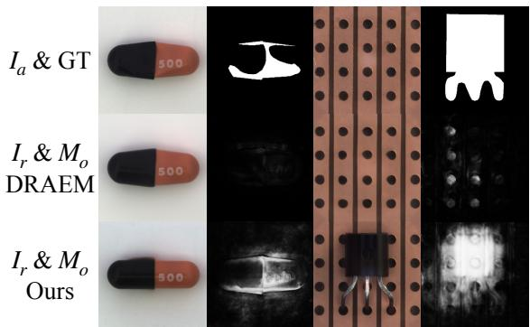
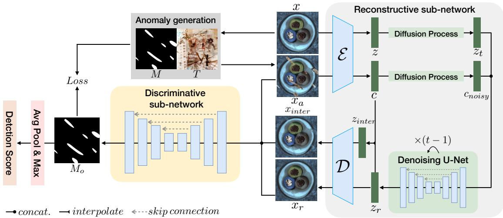
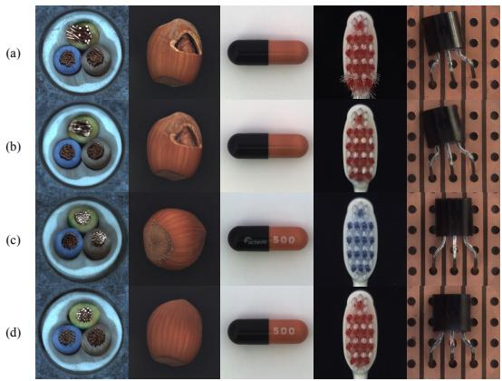
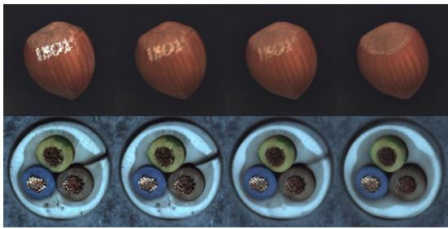
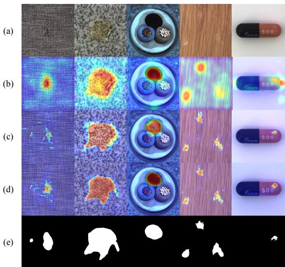
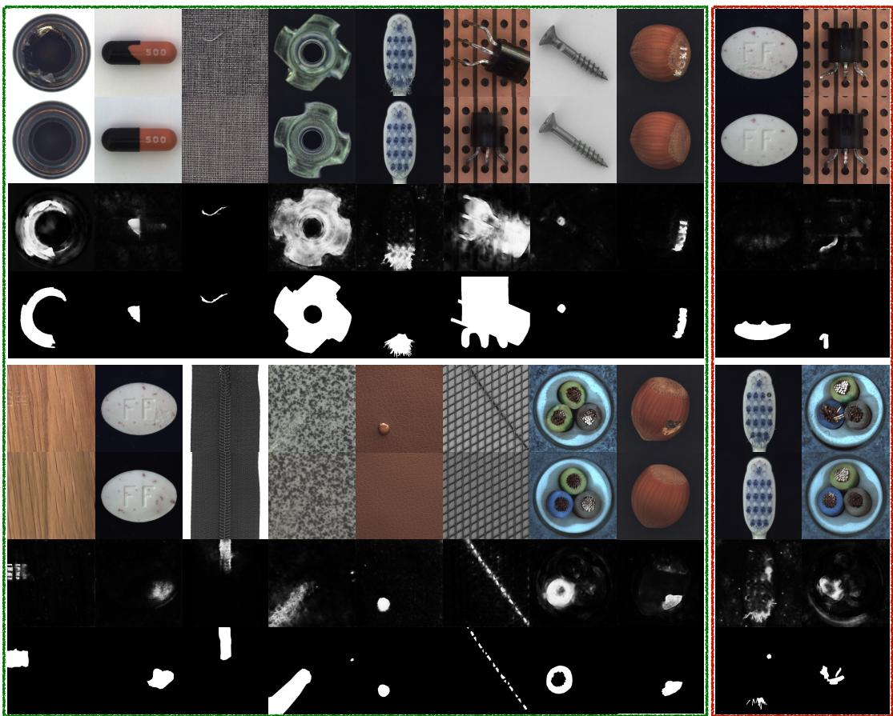

# Unsupervised Surface Anomaly Detection with Diffusion Probabilistic Model

Xinyi Zhang1,\* Naiqi Li1,\*,† Jiawei Li2 Tao Dai3,† Yong Jiang1 Shu-Tao Xia1,4

1 Tsinghua Shenzhen International Graduate School, Tsinghua University 2 Huawei Manufacturing 3 Shenzhen University

4 Research Center of Artificial Intelligence, Peng Cheng Laboratory

xinyi-zh21@mails.tsinghua.edu.cn, linaiqi@sz.tsinghua.edu.cn, li-jw15@tsinghua.org.cn, daitao.edu@gmail.com, jiangy@sz.tsinghua.edu.cn xiast@sz.tsinghua.edu.cn

## Abstract

Unsupervised surface anomaly detection aims at discovering and localizing anomalous patterns using only anomaly-free training samples. Reconstruction-based models are among the most popular and successful methods, which rely on the assumption that anomaly regions are more difficult to reconstruct. However, there are three major challenges to the practical application of this approach: 1) the reconstruction quality needs to befurther improved since it has a great impact on the final result, especiallyfor images with structural changes; 2) it is observed thatfor many neural networks, the anomalies can also be well reconstructed, which severely violates the underlying assumption; 3) since reconstruction is an ill-conditioned problem, a test instance may correspond to multiple normal patterns, but most current reconstruction-based methods have ignored this critical fact. In this paper, we propose DiffAD, a method for unsupervised anomaly detection based on the latent diffusion model, inspired by its ability to generate high-quality and diverse images. We further propose noisy condition embedding and interpolated channels to address the aforementioned challenges in the general reconstruction-based pipeline. Extensive experiments show that our method achieves state-of-the-art performance on the challenging MVTec dataset, especially in localization accuracy.

## 1. Introduction

With the great success of deep neural networks in various computer vision tasks, their application in surface anomaly detection, which aims to detect anomalous patterns that deviate from normal samples, has also received unprecedented attention. However, unlike traditional supervised computer vision tasks such as image recognition, anomalous samples are quite rare in real-world scenarios. Therefore, unsupervised methods for anomaly detection are of great significance in practice.

  
Figure 1. The reconstructed samples $I _ { r }$ of traditional autoencoderbased methods often fail into direct copies of the anomalous inputs $I _ { a }$ (medium), especially for samples with structural deformations (top). With our DiffAD, the generated samples are semantically anomaly-free while keeping consistent in other non-anomalous regions (bottom), yielding pleasing detection and localization results $M _ { o } ,$ , closely matching the ground truth (GT).

Reconstruction-based models are among the most popular and successful methods of unsupervised anomaly detection. Based on the assumption that anomaly regions are more difficult to reconstruct, they try to detect anomalies by comparing the input images with their reconstructed counterparts.

To address the absence of anomalous samples, data augmentation techniques are widely used in the reconstructionbased framework. For instance, DRAEM [32] synthesizes anomalous samples by blending predefined texture images with normal training instances. Utilizing the synthetic anomalous samples, an autoencoder-based reconstructive sub-network is trained to repair the anomalous regions while keeping the non-anomalous parts unchanged. Both the reconstructive and original images are concatenated and fed to a following discriminative sub-network, which produces a segmentation map as the final anomaly detection result.

However, there are three major challenges to the practical application of this approach. First, though current reconstruction networks are good at repairing textural anomalies, they are vulnerable to structural changes in the images. Considering the significant impact of reconstruction quality on the final result, it is necessary to explore more recent and state-of-the-art models for image reconstruction. Second, it is observed that for many neural networks, anomalies can also be well reconstructed, which violates the underlying assumption. Specifically, the reconstruction network may return a direct copy of the input image with anomalies, resulting in detection failure. Third, since reconstruction is an ill-conditioned problem, a test instance may correspond to multiple normal patterns. However, most current reconstruction-based methods ignore this important fact, so it is necessary to take into account the diversity of reconstructions.

In this paper, we propose DiffAD, a novel reconstructionbased method for anomaly detection, which simultaneously addresses the challenges mentioned above. Our method utilizes the recently proposed diffusion model (DM) as the reconstruction component. The denoising diffusion probabilistic model [11] is a parameterized Markov chain trained to produce samples by learning to reverse a diffusion process, which gradually adds noise to the training data until the original signal is destroyed. At the sampling stage, it is capable of generating high-quality and diverse samples from random Gaussian noise. To ameliorate the heavy computation burden of diffusion models, we use the latent diffusion model (LDM) [22] which is trained in the learned latent space. Our method introduces noisy condition embedding, which diffuses the latent representation of the test image with noise before it is used to condition the generation process. This avoids the reconstruction network from synthesizing a direct copy of the anomalous region and forces it to use global information, thus making the normal and anomalous parts more distinctive. Furthermore, we proposed the interpolated channels in the anomaly detection pipeline. Its basic idea is to interpolate the latent features generated by the diffusion model and that of the original input to produce additional channels, which are concatenated with the original and the reconstructed images before being sent to the segmentation sub-network. Intuitively, the interpolated channels make our model aware of diversity during reconstruction.

Extensive experiments on the MVTec-AD dataset [2] demonstrate the effectiveness of our approach by improving performance on the tasks of both anomaly detection and anomaly localization. The main contributions of our method are summarized as follows:

• We propose a novel method for unsupervised anomaly detection called DiffAD. To the best of our knowledge, this is the first reconstruction-based method that takes advantage of the latent diffusion model.

• We propose noisy condition embedding, which maintains the distinction between normal and anomalous regions during reconstruction.

• We propose interpolated channels, which make our model aware of the diversity during reconstruction and ameliorate the distractions brought by the pixel-level differences between the reconstructed and original images.

• Extensive experiments demonstrate that our proposed method is effective and can greatly improve anomaly detection and localization performance on the MVTec-AD dataset.

## 2. Related Work

## 2.1. Anomaly Detection

Classical anomaly detection methods consider the task as an extension of the one-class classification problem. The early proposed OC-SVM [26] and SVDD [28] learn data distribution by using support vectors machine. PatchSVDD [31] utilizes a patch-based method to enable anomaly segmentation.

Methods based on memory bank such as SPADE [7], PaDiM [8], and PatchCore [24] assume that discriminative features extracted by the pre-trained network with normal samples can be leveraged to calculate distance metrics for anomaly measurement. These methods focusing on feature extraction are limited by heavy storage and retrieval costs. Knowledge distillation based methods were first introduced in [3], which uses a single teacher network to guide multiple student networks during training, and determines anomalies by comparing the difference in outputs between the teacher and student networks. Reverse distillation [9] has also been developed to utilize different architectures of teacher and student to maintain the distinction of anomaly.

Methods based on reconstructive networks hypothesize that when taking anomalous samples as input, reconstruction models trained on normal samples only succeed in normal regions, but fail in abnormal parts. Autoencoder (AE) [4], Variational Autoencoder (VAE) [14], and Generative Adversarial Network (GAN) [1, 20] have been introduced into this task. However, due to their powerful generalization ability, the anomalies are also well reconstructed, returning a direct copy of the input image, and thus resulting in detection failure. Some works [15, 30, 33] tried to ameliorate overfitting by transforming the reconstruction task into inpainting, which train the reconstructive network with masked images. These methods, however, fuse the outputs of multiple masked inputs, suffering from heavy computation costs and not practical for realistic scenarios. Recently, DRAEM achieves excellent performance by restoring the simulated anomalous samples and utilizing a discriminative network to segment the anomalies. However, DRAEM is undermined by the limited generative ability of the AEbased reconstructive network, failing to handle hard anomalous cases with structural deformation.

  
Figure 2. The framework of the proposed DiffAD, which consists of two sub-networks: (i) Reconstructive sub-network takes normal data x as training samples and simulated anomalous images $x _ { a }$ , which is generated by random mask M and texture source image $T ,$ as condition embedding. This sub-network is capable of sampling normal image $x _ { r }$ from noise with the anomalous condition. (ii) Discriminative sub-network takes the concatenation of anomalous images $x _ { a } .$ , reconstructed images $x _ { r } .$ , and the additional interpolated channels $x _ { i n t e r }$ as input, producing pixel-level segmentation masks $M _ { o }$ . Loss is calculated between $M _ { o }$ and $M .$

In this paper, we replace the AE-based reconstructive network with the latent diffusion model. By leveraging the powerful generative ability of diffusion models, we can reduce models’ reliance on input images, yielding samples strictly following normal modes.

## 2.2. Diffusion Probabilistic Models

Denoising Diffusion Probabilistic Models (DDPM) [11] have recently achieved state-of-the-art results in various image generation tasks and are also widely developed in other applications [25, 5]. Gradually adding noise to the training data until the original signal is destroyed, DDPM is a parameterized Markov chain trained to produce samples by learning to reverse a diffusion process. At the sampling stage, it is capable of generating high-quality and diverse samples from random Gaussian noises. However, DDPM samples images by denoising a noise step by step, leading to low inference speed. DDIM [27] utilizes non-Markovian processes to accelerate the sampling process, increasing the sampling speed by 10 to 50 times. The recently proposed latent diffusion models [22] departure to the latent space, which is lower-dimensional and computationally much more efficient, further reducing the training and sampling overheads and making diffusion models more practical in application scenarios.

Recently, Teng et al. [29] attempt to introduce scorebased generative model into the unsupervised defect detection task. The anomalous samples, injected with noise, are projected into normal data distribution space through two separate SDE functions. They obtain anomaly masks by separately extracting feature maps and calculating distances. However, they are unaware of the large sample variation in the same class, resulting in unpleasant performance. In contrast, we introduce the noisy condition embedded latent diffusion model as the reconstruction backbone, providing semantically anomaly-free but structurally similar reconstructions, enabling pixel-level accurate comparisons.

## 3. Method

We propose a novel reconstruction-based method for unsupervised surface anomaly detection. We follow the previous work [32] to create simulated anomalous training samples to compensate for the absence of real anomalous samples, and utilize the recent latent diffusion model as the backbone of our reconstructive sub-network, which is capable of generating high-quality and diverse samples. However, there still exist two main challenges: 1) the “direct copy” problem: anomalies can also be well reconstructed.

2) the misalignment problem: several normal samples can correspond to a given anomalous input, posing challenges to pixel-level comparison and segmentation. We propose the noisy condition embedding in Section 3.3 to solve the first problem. Interpolated channels proposed in Section 3.4 provide a solution to the latter one.

## 3.1. Overall Architecture

The proposed method is composed of a reconstructive sub-network and a discriminative sub-network as shown in Figure 2. The reconstructive sub-network, which is a latent diffusion model accompanied by the noisy condition embedding, learns the distribution of normal samples. When in the sampling stage, taking the anomalous samples as condition inputs, it is capable of generating high-quality normal samples comparable to the anomalous conditions in overall appearance. Next, the discriminative sub-network produces segmentation maps from the concatenation of the input image, its reconstructed version, and the additional interpolated channels which help to distinguish anomalies. Since anomalies usually account for a small area of the whole image, we use a Focal Loss [17] to train the discriminative sub-network, which ameliorates the data imbalance problem. The anomalous training samples are created by a combination of randomly generated anomaly maps and texture source images from the DTD dataset [6] following previous work [32].

## 3.2. Latent Diffusion Models

Diffusion models (DM) are generative models that are capable of sampling from the data distribution by learning the reverse process $p _ { \theta } ( x _ { 0 : T } )$ , which is defined as a Markov chain initialized as Gaussian noise [11]. The forward process or diffusion process $q \big ( x _ { 1 : T } | x _ { 0 } \big )$ gradually adds Gaussian noise to the training data. These models utilize the forward process to get $x _ { t } .$ , a noisy version of the input x, and then train a network $\epsilon _ { \theta } ( x _ { t } , t )$ to predict how to denoise. The training objective can be simplified as

$$
L _ { D M } = \mathbb { E } _ { x , \epsilon \sim \mathcal { N } ( 0 , 1 ) , t } \left[ \| \epsilon - \epsilon _ { \theta } ( x _ { t } , t ) \| _ { 2 } ^ { 2 } \right] ,
$$

with t uniformly sampled from $\{ 1 , . . . , T \}$

The latent diffusion model (LDM) [22] leaves the pixellevel generation to Autoencoders, and focuses on training and sampling in a lower dimensional latent space.

To adapt the LDM model to the anomaly detection task, for a given normal image $\boldsymbol { x } \in \mathbb { R } ^ { H \times W \times 3 }$ in RGB space, we train an encoder $\mathcal { E } ,$ , which is a VAE [14] with KL-penalty, to learn the pixel-level reconstruction of normal samples and encode x into a latent vector $z = \mathcal { E } ( x )$ , where $\boldsymbol { z } \in \mathbb { R } ^ { h \times w \times c }$ Then a UNet-based LDM is followed to learn semantic feature generation, which trains the denoising process directly on the noisy latent vectors $z _ { t }$ . The objective is modified as

$$
L _ { L D M } = \mathbb { E } _ { z , \epsilon \sim \mathcal { N } ( 0 , 1 ) , t } \left[ \| \epsilon - \epsilon _ { \theta } ( z _ { t } , t ) \| _ { 2 } ^ { 2 } \right] .
$$

Sampling also takes place in the latent space. The latent vector $z _ { r }$ sampled from the distribution $p ( z )$ is decoded to an image through a decoder as , and the final output is obtained as $x _ { r } = \mathcal { D } ( z _ { r } )$ .

## 3.3. Noisy Condition Embedding

Diffusion models are capable of modeling the conditional distribution of the form $p ( z | y )$ , controlling the synthesis process through condition y such as text [21] and class-labels [10]. A common approach to introducing images as conditions is through direct concatenation with the input images [25]. However, in the unsupervised scenario of anomaly detection, the simulated anomalous samples are quite similar to the normal ones, compared with other image-to-image translation tasks [13]. Simple concatenation would make the model fall into a shortcut, which appears as relying too much on conditions and vulnerable to severe structural changes in real anomalous samples. Thus, we propose a noisy condition embedding to instruct sample generation while avoiding the model excessively relying on the condition.

Given a normal sample x, we generate a simulated anomalous sample $x _ { a }$ through data augmentations and texture pasting following DRAEM. The simulated anomalous sample is firstly encoded into a latent vector by an encoder $\mathbf { c } = \mathcal { E } ( x _ { a } )$ , which is viewed as the initial state $\mathbf { c } _ { 0 }$ and followed by passing the diffusion process $q$ over $T$ iterations, with a series of variance $\beta _ { 1 } , . . . , \beta _ { T }$ of the added noise:

$$
q ( \mathbf { c } _ { 1 : T } | \mathbf { c } _ { 0 } ) = \prod _ { t = 1 } ^ { T } q ( \mathbf { c } _ { t } | \mathbf { c } _ { t - 1 } )
$$

$$
q ( \mathbf { c } _ { t } | \mathbf { c } _ { t - 1 } ) = \mathcal { N } ( \mathbf { c } _ { t } | \sqrt { 1 - \beta _ { t } } \mathbf { c } _ { t - 1 } , \beta _ { t } \mathbf { I } )
$$

We choose a random time point t to get the noisy condition vector $\mathbf { c } _ { n o i s y }$ with the notation $\alpha _ { t } ~ = ~ 1 - \beta _ { t }$ and $\begin{array} { r } { \bar { \alpha } _ { t } = \prod _ { s = 1 } ^ { t } \alpha _ { s } \colon } \end{array}$

$$
{ \bf c } _ { n o i s y } = \sqrt { \bar { \alpha } _ { t } } { \bf c } + \sqrt { 1 - \bar { \alpha } _ { t } } \epsilon
$$

We then learn the conditional LDM via

$$
L _ { L D M } = \mathbb { E } _ { z , \epsilon \sim \mathcal { N } ( 0 , 1 ) , t } \left[ \| \epsilon - \epsilon _ { \theta } ( z _ { t } , t , \mathbf { c } _ { n o i s y } ) \| _ { 2 } ^ { 2 } \right] .
$$

Taking $\mathbf { c } _ { n o i s y }$ as condition in LDM training process, the model can be more robust. Even taking real anomalous samples with severe deformations as conditions in the sampling stage, the generated samples can still be semantically anomaly-free while keeping the overall appearance as similar as possible to the anomalous conditions.

## 3.4. Interpolated Channels

After obtaining the reconstructed images, a discriminative sub-network is followed to produce pixel-level anomaly segmentation maps. We use a U-net-based segmentation backbone [23] with modules of the form convolution-BatchNorm-ReLu [12] as our discriminative sub-network which usually takes the channel-wise concatenation of the reconstructed output $x _ { r }$ and the anomalous input image $x _ { a }$ as the network input. However, some subtle differences in the normal pixels between the reconstructed and original images are inevitable, e.g. some texture changes in the background regions, which may distract the discriminative sub-network. To alleviate the side effects caused by nonanomalous differences, we propose the interpolated channels, allowing the discriminative sub-network to recognize diversity during reconstruction and distinguish real anomalies.

  
Figure 3. Visual comparisons between (a) the anomalous inputs; the reconstruction outputs of (b) autoencoder, (c) DDPM, and (d) our DiffAD. Our reconstructions are semantically anomaly-free and similar to the original inputs in overall appearance.

We interpolate the latent vector c and ${ \bf z } _ { r }$ , which is encoded from the anomalous input image $x _ { a }$ and the normal vector reconstructed by LDM, to get the intermediate states:

$$
{ \bf z } _ { i n t e r } = \lambda \cdot { \bf c } + ( 1 - \lambda ) \cdot { \bf z } _ { r }
$$

where $\lambda \in \left[ 0 , 1 \right]$

Then we decode ${ \bf z } _ { i n t e r }$ into image space through decoder to get $x _ { i n t e r }$ and concatenate the additional interpolated channels with $x _ { a }$ and $x _ { r }$ to form the discriminative network input. Passing through the encoder and decoder, the non-anomalous regions of intermediate state $x _ { i n t e r }$ follow the learned distribution of generated samples, while some anomalous features are still remaining, enabling the discriminative sub-network to locate anomalies more accurately.

## 4. Experiments and Results

In this section, we first describe our experimental setup and the implementation details of our DiffAD. Second, we summarize three challenges in the anomaly detection task and our corresponding solutions. To evaluate the effectiveness of our solutions, we conduct ablation studies on the individual components of DiffAD. Finally, we compare DiffAD with other unsupervised anomaly detection methods in both detection and localization tasks and provide qualitative and quantitative results.

  
(b) x˜a  
(a) xa  
(c) xinter  
(d) xr  
Figure 4. Visual comparisons between (a) the anomalous input $x _ { a }$ (b) the VAE-reconstructed version ${ \tilde { x } } _ { a } .$ , (c) interpolated channels xinter and (d) the reconstruction output of our method $x _ { r }$ . As shown above, $x _ { i n t e r }$ is more similar to $x _ { r }$ in the texture of nonanomalous regions such as the body of hazelnut or the background of cable, while still keeping some anomalous features.

## 4.1. Experiments Setup

To evaluate the effectiveness of our method, we choose the recent challenging MVTec-AD dataset [2], which contains 10 object and 5 feature classes of industrial anomalous samples with mask annotations. Following prior works, the image-level Area Under the Receiver Operating Curve (AU-ROC) is used for evaluation in the anomaly detection task. To authentically reflect the localization accuracy, in addition to the pixel-based AUROC, the pixel-wise average precision (AP) is also reported, which is more appropriate for samples with small anomalies [32].

In our experiments, the input image size is set as 256 256 and encoded by a VAE into a latent vector with size $3 2 \times 3 2 \times 4 .$ The simulated anomalous samples generated following DRAEM are also encoded into 32 32 4 features and passed through the diffusion process with a random time step $t ~ \in ~ [ 0 , 1 0 0 0 ]$ to get a noisy condition embedding. The LDM is trained in the latent space for 4000 epochs and samples reconstructive normal images with clean anomalous condition inputs. The following discriminative sub-network is trained in image space for 700 epochs independently. We implement our models on the Pytorch framework [19] on NVIDIA Tesla V100 GPUs.

## 4.2. Ablation Studies

We summarize three main challenges in the reconstruction-based anomaly detection task: 1) The autoencoder is limited in the reconstruction ability to amend structural deformations. 2) The anomalies can be well reconstructed as well as normal regions, falling into “direct copy”. 3) Some differences in the non-anomalous regions brought by the generative model may distract the discriminative sub-network.

<table><tr><td>Method</td><td colspan="2">Recon. Net backbone condition</td><td>Discr. Net input</td><td>Results Det. Loc.</td></tr><tr><td>DRAEM</td><td>AE</td><td>X</td><td> $c o n c a t ( x _ { a } , x _ { r } )$ </td><td>98.0 97.3 / 68.4</td></tr><tr><td> $D i f f A D _ { f \& r }$ </td><td>DM</td><td>forward+reverse</td><td> $c o n c a t ( x _ { a } , x _ { r } )$ </td><td>94.6 93.6 / 57.3</td></tr><tr><td> $D i f f A D _ { c }$ </td><td>DM</td><td>c</td><td> $c o n c a t ( x _ { a } , x _ { r } )$ </td><td>95.8 93.9 / 61.1</td></tr><tr><td> $D i f f A D _ { n o . i n t e r }$ </td><td>DM</td><td> $\mathbf { c } _ { n o i s y }$ </td><td> $c o n c a t ( x _ { a } , x _ { r } )$ </td><td>96.4 97.0/ 65.1</td></tr><tr><td> $D i f f A D _ { \tilde { x } _ { a } . i n t e r }$ </td><td>DM</td><td> $\mathbf { c } _ { n o i s y }$ </td><td> $c o n c a t ( x _ { a } , \tilde { x } _ { a } , x _ { r } )$ </td><td>97.4 97.3 / 67.0</td></tr><tr><td> $\overline { { D i f f A D } }$ </td><td>DM</td><td> $\mathbf { c } _ { n o i s y }$ </td><td> $c o n c a t ( x _ { a } , x _ { i n t e r } , x _ { r } )$ </td><td>98.7 98.3 / 74.6</td></tr></table>

Table 1. Ablation studies with detection (Det.) and localization (Loc.) performance, grouped into (i) the architecture of reconstructive sub-network, (ii) the input of discriminative sub-network, and (iii) the performance of our DiffAD for reference.

<table><tr><td rowspan=1 colspan=2>Class</td><td rowspan=1 colspan=1>[1]  [16]  [33]  [32]  Ours</td></tr><tr><td rowspan=5 colspan=1>txuure</td><td rowspan=5 colspan=1>CarpetGridLeatherTileWood</td><td rowspan=1 colspan=1>82.1  99.4  84.2  97.0  98.3</td></tr><tr><td rowspan=1 colspan=1>74.3  99.6  99.6  99.9  100</td></tr><tr><td rowspan=1 colspan=1>80.8 97.1  100  100  100</td></tr><tr><td rowspan=1 colspan=1>72.0 95.5 98.7 99.6  100</td></tr><tr><td rowspan=1 colspan=1>92.0 95.7 93.0 99.1  100</td></tr><tr><td rowspan=10 colspan=1>obet</td><td rowspan=1 colspan=1>Bottle</td><td rowspan=1 colspan=1>79.4 99.6  99.9  99.2  100</td></tr><tr><td rowspan=1 colspan=1>Cable</td><td rowspan=1 colspan=1>71.1 99.1  81.9 91.8  94.6</td></tr><tr><td rowspan=1 colspan=1>Capsule</td><td rowspan=1 colspan=1>72.1 96.2  88.4 98.5  97.5</td></tr><tr><td rowspan=2 colspan=1>HazelnutMetal Nut</td><td rowspan=1 colspan=1>87.4 98.5 83.3  100  100</td></tr><tr><td rowspan=1 colspan=1>69.4 99.5 88.5 98.7  99.5</td></tr><tr><td rowspan=2 colspan=1>PillScrew</td><td rowspan=1 colspan=1>67.1 98.3 83.8 98.9  97.7</td></tr><tr><td rowspan=1 colspan=1>100  100  84.5 93.9  97.2</td></tr><tr><td rowspan=2 colspan=1>ToothbrushTransistor</td><td rowspan=1 colspan=1>70.0 98.7  100  100  100</td></tr><tr><td rowspan=1 colspan=1>80.8 98.3  90.9  93.1  96.1</td></tr><tr><td rowspan=1 colspan=1>Zipper</td><td rowspan=1 colspan=1>74.4 99.0 98.1  100  100</td></tr><tr><td rowspan=1 colspan=2>Average</td><td rowspan=1 colspan=1>78.2 98.3  91.7  98.0  98.7</td></tr></table>

Table 2. Results for anomaly detection with AUROC metric on MVTec-AD, compared with other reconstruction-based methods.

To address the above issues, we propose three solutions: 1) Replace the AE-based reconstructive sub-network with diffusion models. 2) Introduce noisy condition embedding to enhance global information. 3) Concatenate the interpolated channels to emphasize the real anomalies.

We then conduct ablation studies to verify the effectiveness of our proposed solutions.

## 4.2.1 DM with Noisy Condition Embedding

As shown in Figure 3, we provide visual comparisons of the anomalous inputs and the reconstruction outputs of the autoencoder, DDPM (a basic diffusion model), and our DiffAD. The autoencoder fails especially on anomalies that are close to the normal image distribution, such as samples with structural changes or missing parts: regions where some object features are missing usually contain other features which are also in the learned distribution, leading to good reconstructions of anomalies. On the contrary, by generating samples based on the distribution of all normal data without specific inputs, the diffusion model yields high-quality synthesis of normal samples but different from anomalous samples especially in classes with high sample diversity, making pixel-level segmentation impossible. However, our method successfully reduced the “direct copy” problem in the anomalous regions without affecting the overall appearance.

Aside from visual comparisons, we can also use a quantitative metric to evaluate how much “direct copy” has been reduced by our diffusion-based method. Intuitively, when “direct copy” occurs, the anomalous area between the anomalous inputs and the reconstructed images remains similar. Based on such facts, we can measure the degree of direct copy with PSNR on the GT anomaly-masked regions (A higher PSNR indicates a severer direct copy). Particularly, our DiffAD achieves 36.73 dB, while the autoencoder gets 38.49 dB, which shows that our method can reduce direct copy. On the other hand, a good reconstruction not only reduces direct copy, but also is similar to normal samples. To verify this, we also calculate the FID score to measure distribution distance with normal samples (A smaller FID means closer to normal). As a result, the autoencoder’s average FID is 121.7, while ours is 69.2. These observations show our diffusion-based method has superior reconstruction ability over the AE-based method.

In the diffusion-based image-to-image translation task, there exist two common practices to instruct the generation process: 1) Perturb the unseen input image with a forward process and do reverse sampling based on the noisy input to make it follow the distribution of training data [18]. 2) Insert input images as conditions to the training process of diffusion model by direct concatenation [25]. However, in the scenario of anomaly detection, disturbing the anomalous samples with a diffusion process needs to carefully select the time step t, for a small t may retain anomalous features while a large t may lose too much information. Direct concatenation of the anomalous samples during training may cause the diffusion model to rely too much on conditions since the distributions of the simulated anomalous samples and the normal ones are quite similar. Some hard cases could result in reconstructions retaining anomalous features because the model would still depend on the conditions during sampling. On the contrary, with our noisy condition embedding, the generated samples can remain semantically non-anomalous while still appearing consistent with the inputs.

<table><tr><td colspan="2">Class</td><td>RDistillation [9]</td><td>PaDim[8]</td><td>PatchCore [24]</td><td>RIAD*[33]</td><td>DRAEM* [32]</td><td>Ours</td></tr><tr><td rowspan="3">textuure</td><td rowspan="3">Carpet Grid Leather Tile</td><td>98.9 / 56.8</td><td>99.0 / 60.7</td><td>98.9 / 64.6</td><td>96.3 /61.4</td><td>95.5 / 53.5</td><td>98.1 / 74.1</td></tr><tr><td>99.3 / 49.6</td><td>97.1 / 35.7</td><td>98.7 / 29.1</td><td>98.8 / 36.4</td><td>99.7 / 65.7</td><td>99.7 / 73.7</td></tr><tr><td>99.4 / 47.7</td><td>99.0 / 53.5</td><td>99.3 / 48.5</td><td>99.4 / 49.1</td><td>98.6 / 75.3</td><td>99.1 / 73.7</td></tr><tr><td rowspan="6"></td><td rowspan="6">Wood Bottle Cable Capsule Hazelnut</td><td>95.6/ 53.2 95.3 / 48.8</td><td>94.1 / 52.4 94.1 / 46.3</td><td>95.6 / 67.5 95.0/ 59.4</td><td>89.1 / 52.6 85.8 / 38.2</td><td>99.2/ 92.3 96.4/ 77.7</td><td>99.4 / 95.1</td></tr><tr><td>98.7 / 78.7</td><td>98.2 / 77.3</td><td>98.6 / 82.5</td><td>98.4 / 76.4</td><td>99.1 / 86.5</td><td>96.7 / 80.0 98.8 / 87.4</td></tr><tr><td>97.4/ 52.8</td><td>96.7 / 45.4</td><td>98.4 / 74.7</td><td>84.2 / 24.4</td><td>94.7 / 52.4</td><td></td></tr><tr><td>98.7 / 45.3</td><td>98.6 / 46.7</td><td>98.8 / 48.5</td><td></td><td></td><td>96.8 / 64.9</td></tr><tr><td>98.9 / 61.2</td><td>98.1 / 61.1</td><td>98.7 / 58.1</td><td>92.8 / 38.2 96.1 / 33.8</td><td>94.3 / 49.4 99.7 / 92.9</td><td>98.2 / 54.4</td></tr><tr><td>97.3 / 79.5</td><td>97.3 / 77.4</td><td>98.4 / 94.6</td><td>92.5 / 64.3</td><td>99.5 / 96.3</td><td>99.4 / 85.9 99.1 / 94.4</td></tr><tr><td rowspan="6">obet</td><td>Metal Nut Pill</td><td>98.2 / 78.5</td><td>95.7 / 61.2</td><td>97.1 / 85.5</td><td>95.7 / 51.6</td><td>97.6 / 48.5</td><td>97.7 / 68.9</td></tr><tr><td>Screw</td><td>99.6 / 53.3</td><td>98.4 / 21.7</td><td>99.4 / 39.3</td><td>98.8 / 43.9</td><td>97.6 / 58.2</td><td></td></tr><tr><td>Toothbrush</td><td></td><td></td><td></td><td></td><td></td><td>99.0 / 58.5</td></tr><tr><td>Transistor</td><td>99.1 / 50.5</td><td>98.8 / 54.7</td><td>98.7 / 47.2</td><td>98.9 / 50.6</td><td>98.1 / 44.7</td><td>99.2 / 70.1</td></tr><tr><td>Zipper</td><td>92.5 / 55.1</td><td>97.6 / 72.0</td><td>96.3 / 74.7</td><td>87.7 / 39.2</td><td>90.9 / 50.7</td><td>93.7 / 60.2</td></tr><tr><td colspan="2">Average</td><td>98.2 / 57.0 98.4 / 58.2 97.8 / 57.9</td><td>97.4 / 55.0</td><td>98.8 / 72.7 98.1 / 63.1</td><td>97.8 / 63.4 94.2 / 48.2</td><td>98.8 / 81.5 97.3 / 68.4</td><td>99.0 / 77.8 98.3 / 74.6</td></tr></table>

Table 3. Results for anomaly localization with AUROC / AP metric on MVTec-AD. Methods based on reconstruction are marked with \*. The best results among all types of models are in bold, and the best of reconstruction-based methods are highlighted by underline.

We provide qualitative results of the mentioned methods in Table 1 : (i) using autoencoder as reconstructive sub-network (DRAEM [32]), (ii) injecting noise to inputs and then reconstructing based on diffusion models (Dif-$f A D _ { f \& r } )$ , (iii) concatenating the latent vector c of the simulated anomalous sample as the condition during training of diffusion models $( D i f f A D _ { c } )$ and (iv) using our noisy condition embedding (DiffAD). Our method shows superior performances both in visual results of the reconstruction outputs and quantitative results in the following detection and localization tasks.

## 4.2.2 Interpolated Channels

To ameliorate the distractions brought by differences in the non-anomalous pixels between the reconstructed and original images, we propose interpolated channels. Generated from the interpolation of the anomalous vector and the reconstruction, the intermediate states closely match the reconstructive images in non-anomalous regions, while retaining some anomalous features, which help the discriminative sub-networks localize the anomalies. To verify the claim that interpolated latent leads to more similar reconstruction in the normal regions, we compare PSNR of nonanomalous regions (formally defined as the complement of the GT anomaly mask) of various methods. Specifically, we compute PSNR between the interpolated latent $x _ { i n t e r }$ and the reconstruction $x _ { r }$ (denoted as $p _ { 1 } )$ , PSNR between the VAE-reconstructed image $\scriptstyle { \tilde { x } } _ { a }$ and $x _ { r } \ ( p _ { 2 } )$ , and PSNR between the anomalous input $x _ { a }$ and $x _ { r } \ ( p _ { 3 } )$ . Experiments showed that $p _ { 1 } = 3 5 . 4 1 > p _ { 2 } = 3 0 . 2 4 > p _ { 3 } = 2 8 . 0 8$

  
Figure 5. Qualitative comparisons with other methods: (a) the anomalous images, (b) the anomalous maps generated by Patch-Core, (c) the anomalous maps of DRAEM, (d) our anomalous maps, and (e) the ground truth.

  
Figure 6. Qualitative examples. From top to bottom: the original anomalous input, our reconstruction, our predicted anomaly mask, and the ground truth mask. In some cases such as hazelnut and wood, our predicted masks are more accurate than the given ground truth masks. We also provide some unsatisfying outputs in the red box, which have pleasing reconstruction results but inaccurate segmentation results.

As expected, the results quantitatively show that the interpolated latent is more similar to the reconstruction in normal regions, and helps ameliorate distractions brought on by pixel-level differences in normal regions.

Table 1 reports the results of our DiffAD variants trained (i) without the interpolated channels $( D i f f A D _ { n o . i n t e r } ) _ { } $ , (ii) with decoding the latent vector c of the anomalous input into $\scriptstyle { \tilde { x } } _ { a }$ as the additional channels, $i . e . \ \lambda \ = \ 1 \ ( D i f \ / -$ $f A D _ { \tilde { x } _ { a - } i n t e r } \ )$ and (iii) with our interpolated channels with $\lambda = 0 . 5 \ ( D i f f A D )$ . We also provide visual comparisons in Figure 4. When trained without interpolated channels, the discriminative sub-networks significantly drop in both detection and localization performance. However, the performance gaps can be narrowed by using a simple concatenation with the VAE-reconstructed sample.

## 4.3. Comparison with State-of-the-art Methods

## 4.3.1 Anomaly Detection

For the anomaly detection task, we choose four reconstruction-based methods as our baselines, including GANomaly[1], OCR-GAN[16], RIAD[33] and DRAEM[32]. More comparisons are shown in the supplementary materials. Our method significantly outperforms other baselines, achieving the highest AUROC in 4 out of 5 feature classes and 9 out of 15 classes in general as shown in Table 2. We also achieve comparable results in other classes and the best average score among all the baselines.

Our method shows superior performance in texture type classes, where all the regions of the images belong to the detection area, without distinction between object and background. In the object type classes, however, the backgrounds of some images are not very clean, with some textures or contaminants that may cause distractions to the discriminative sub-network.

## 4.3.2 Anomaly Localization

As shown in Table 3, we compare the pixel-level anomaly localization performance with the recent state-of-the-art baselines, including representation-based methods (e.g.

Reverse Distillation [9], PaDim [8] and PatchCore [24] ) and reconstruction-based methods (RIAD [33] and DRAEM[32]). Our DiffAD outperforms the state-of-theart in terms of both AUROC and AP among all types of methods, surpassing the former SOTA by a margin of 0.2 percentage points in AUROC and 6.2 percentage points in AP. As shown in Figure 5, PatchCore produces rough segmentation results and misclassification of normal areas as abnormal. DRAEM, on the other hand, tends to ignore some minor anomalies. However, our DiffAD generates precise anomalous masks. More visual results are provided in 6 (green box). As illustrated in some cases such as the hazelnut with letters and the wood with scratch, we yield more accurate predicted anomalous masks than the ground truth, which suggests that our method is sometimes underestimated due to the ambiguous annotations. Reviewing some unpleasing cases with lower scores, as shown in Figure 6 (red box), we are surprised to find that the reconstruction outputs are quite correct while the discriminative sub-network either fails to distinguish the anomalies or mistakes some background changes for anomalies. As one test instance may correspond to multiple normal patterns, it is inferred that the basic U-net-based segmentation backbone is not capable enough to differentiate real anomalies despite irrelevant changes in normal regions.

## 5. Conclusion

We present a new method for anomaly detection called DiffAD, which is based on the diffusion model. Our goal is to overcome the challenges of reconstruction-based anomaly detection methods, such as limited ability to handle structural deformations, the over-generalizing ability of the models that reconstructs the anomalies as well as the normal regions, and the variety of the corresponding normal patterns for given anomalous samples. To address these challenges, we propose using latent diffusion models instead of traditional autoencoder-based sub-networks for reconstruction. We also introduce noisy condition embedding and interpolated channels to guide the generation and reduce misalignment between the reconstructed and original images. We conduct extensive experiments to evaluate the effectiveness of our approach, and the results demonstrate its promise. In future work, we plan to further develop the use of attention mechanisms to improve the discriminative sub-network’s ability. Overall, we believe that our DiffAD has the potential to further improve the performance of surface anomaly detection based on reconstruction.

## Acknowledgement

This work is supported in part by the National Key R&D Program of China, under Grant (2022YFB3105000), the National Natural Science Foundation of China, under Grant (6230070671,62171248), Shenzhen Science and Technology Program (Grant No. JCYJ20220818101014030, JCYJ20220818101012025), and the PCNL KEY project (PCL2021A07).

## References

[1] Samet Akcay, Amir Atapour-Abarghouei, and Toby P Breckon. Ganomaly: Semi-supervised anomaly detection via adversarial training. In Proceedings of the Asian Conference on Computer Vision, pages 622–637. Springer, 2019.

[2] Paul Bergmann, Michael Fauser, David Sattlegger, and Carsten Steger. MVTec AD–A comprehensive real-world dataset for unsupervised anomaly detection. In Proceedings ofthe IEEE/CVF conference on computer vision and pattern recognition, pages 9592–9600, 2019.

[3] Paul Bergmann, Michael Fauser, David Sattlegger, and Carsten Steger. Uninformed students: Student-teacher anomaly detection with discriminative latent embeddings. In Proceedings of the IEEE/CVF conference on computer vision and pattern recognition, pages 4183–4192, 2020.

[4] Paul Bergmann, Sindy Lowe, Michael Fauser, David Sattleg-¨ ger, and Carsten Steger. Improving unsupervised defect segmentation by applying structural similarity to autoencoders. arXiv preprint arXiv:1807.02011, 2018.

[5] Shoufa Chen, Peize Sun, Yibing Song, and Ping Luo. Diffusiondet: Diffusion model for object detection. arXiv preprint arXiv:2211.09788, 2022.

[6] Mircea Cimpoi, Subhransu Maji, Iasonas Kokkinos, Sammy Mohamed, and Andrea Vedaldi. Describing textures in the wild. In Proceedings of the IEEE conference on computer vision and pattern recognition, pages 3606–3613, 2014.

[7] Niv Cohen and Yedid Hoshen. Sub-image anomaly detection with deep pyramid correspondences. arXiv preprint arXiv:2005.02357, 2020.

[8] Thomas Defard, Aleksandr Setkov, Angelique Loesch, and Romaric Audigier. Padim: a patch distribution modeling framework for anomaly detection and localization. In Pattern Recognition. ICPR International Workshops and Challenges, Proceedings, Part IV, pages 475–489. Springer, 2021.

[9] Hanqiu Deng and Xingyu Li. Anomaly detection via reverse distillation from one-class embedding. In Proceedings of the IEEE/CVF Conference on Computer Vision and Pattern Recognition, pages 9737–9746, 2022.

[10] Prafulla Dhariwal and Alexander Nichol. Diffusion models beat gans on image synthesis. Advances in Neural Information Processing Systems, 34:8780–8794, 2021.

[11] Jonathan Ho, Ajay Jain, and Pieter Abbeel. Denoising diffusion probabilistic models. Advances in Neural Information Processing Systems, 33:6840–6851, 2020.

[12] Sergey Ioffe and Christian Szegedy. Batch normalization: Accelerating deep network training by reducing internal covariate shift. In International conference on machine learning, pages 448–456. pmlr, 2015.

[13] Phillip Isola, Jun-Yan Zhu, Tinghui Zhou, and Alexei A Efros. Image-to-image translation with conditional adversarial networks. In Proceedings of the IEEE conference on

computer vision and pattern recognition, pages 1125–1134, 2017.

[14] Diederik P Kingma and Max Welling. Auto-encoding variational bayes. arXiv preprint arXiv:1312.6114, 2013.

[15] Zhenyu Li, Ning Li, Kaitao Jiang, Zhiheng Ma, Xing Wei, Xiaopeng Hong, and Yihong Gong. Superpixel masking and inpainting for self-supervised anomaly detection. In Bmvc, 2020.

[16] Yufei Liang, Jiangning Zhang, Shiwei Zhao, Runze Wu, Yong Liu, and Shuwen Pan. Omni-frequency channelselection representations for unsupervised anomaly detection. arXiv preprint arXiv:2203.00259, 2022.

[17] Tsung-Yi Lin, Priya Goyal, Ross Girshick, Kaiming He, and Piotr Dollar. Focal loss for dense object detection. In ´ Proceedings of the IEEE international conference on computer vision, pages 2980–2988, 2017.

[18] Chenlin Meng, Yutong He, Yang Song, Jiaming Song, Jiajun Wu, Jun-Yan Zhu, and Stefano Ermon. Sdedit: Guided image synthesis and editing with stochastic differential equations. In International Conference on Learning Representations, 2021.

[19] Adam Paszke, Sam Gross, Soumith Chintala, Gregory Chanan, Edward Yang, Zachary DeVito, Zeming Lin, Alban Desmaison, Luca Antiga, and Adam Lerer. Automatic differentiation in pytorch. 2017.

[20] Pramuditha Perera, Ramesh Nallapati, and Bing Xiang. Ocgan: One-class novelty detection using gans with constrained latent representations. In Proceedings of the IEEE/CVF Conference on Computer Vision and Pattern Recognition, pages 2898–2906, 2019.

[21] Scott Reed, Zeynep Akata, Xinchen Yan, Lajanugen Logeswaran, Bernt Schiele, and Honglak Lee. Generative adversarial text to image synthesis. In International conference on machine learning, pages 1060–1069. PMLR, 2016.

[22] Robin Rombach, Andreas Blattmann, Dominik Lorenz, Patrick Esser, and Bjorn Ommer. High-resolution image¨ synthesis with latent diffusion models. In Proceedings of the IEEE/CVF Conference on Computer Vision and Pattern Recognition, pages 10684–10695, 2022.

[23] Olaf Ronneberger, Philipp Fischer, and Thomas Brox. Unet: Convolutional networks for biomedical image segmentation. In Medical Image Computing and Computer-Assisted Intervention–MICCAI 2015: Proceedings, Part III 18, pages 234–241. Springer, 2015.

[24] Karsten Roth, Latha Pemula, Joaquin Zepeda, Bernhard Scholkopf, Thomas Brox, and Peter Gehler. Towards to-¨ tal recall in industrial anomaly detection. In Proceedings of the IEEE/CVF Conference on Computer Vision and Pattern Recognition, pages 14318–14328, 2022.

[25] Chitwan Saharia, Jonathan Ho, William Chan, Tim Salimans, David J Fleet, and Mohammad Norouzi. Image superresolution via iterative refinement. IEEE Transactions on Pattern Analysis and Machine Intelligence, 2022.

[26] Bernhard Scholkopf, John C Platt, John Shawe-Taylor,¨ Alex J Smola, and Robert C Williamson. Estimating the support of a high-dimensional distribution. Neural computation, 13(7):1443–1471, 2001.

[27] Jiaming Song, Chenlin Meng, and Stefano Ermon. Denoising diffusion implicit models. arXiv preprint arXiv:2010.02502, 2020.

[28] David MJ Tax and Robert PW Duin. Support vector data description. Machine learning, 54:45–66, 2004.

[29] Yapeng Teng, Haoyang Li, Fuzhen Cai, Ming Shao, and Siyu Xia. Unsupervised visual defect detection with score-based generative model. arXiv preprint arXiv:2211.16092, 2022.

[30] Xudong Yan, Huaidong Zhang, Xuemiao Xu, Xiaowei Hu, and Pheng-Ann Heng. Learning semantic context from normal samples for unsupervised anomaly detection. In Proceedings of the AAAI Conference on Artificial Intelligence, volume 35, pages 3110–3118, 2021.

[31] Jihun Yi and Sungroh Yoon. Patch svdd: Patch-level svdd for anomaly detection and segmentation. In Proceedings of the Asian Conference on Computer Vision, 2020.

[32] Vitjan Zavrtanik, Matej Kristan, and Danijel Skocaj. Draem-ˇ a discriminatively trained reconstruction embedding for surface anomaly detection. In Proceedings of the IEEE/CVF International Conference on Computer Vision, pages 8330– 8339, 2021.

[33] Vitjan Zavrtanik, Matej Kristan, and Danijel Skocaj. Recon-ˇ struction by inpainting for visual anomaly detection. Pattern Recognition, 112:107706, 2021.