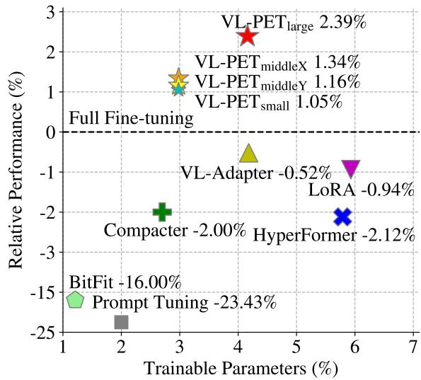
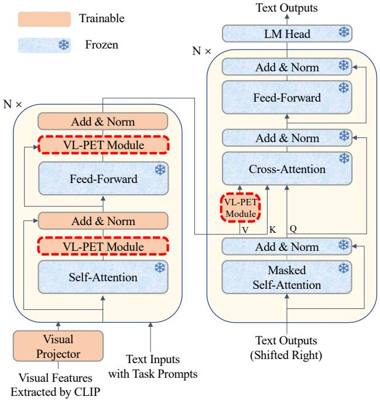
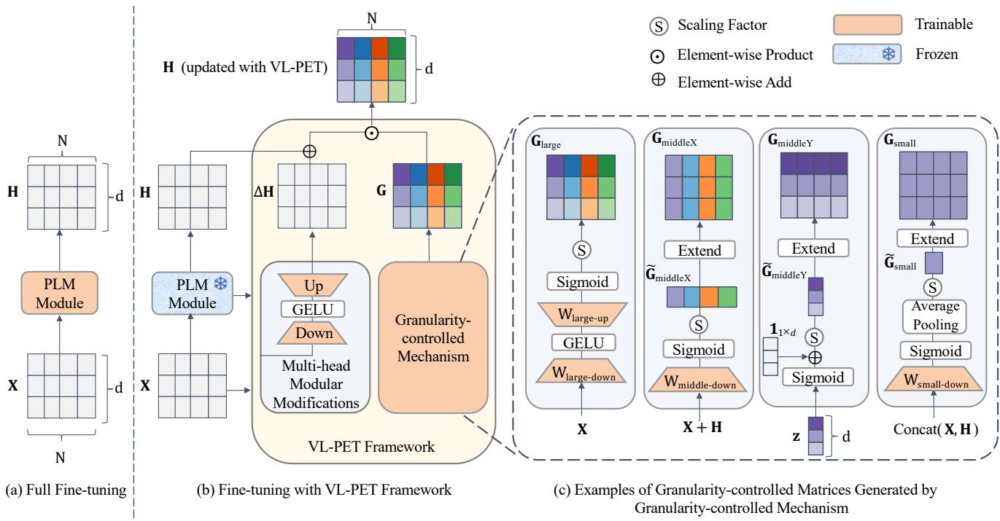
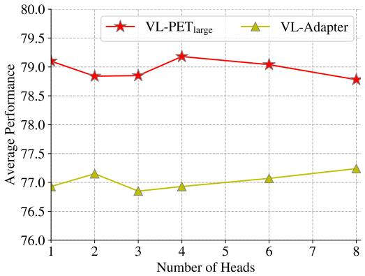
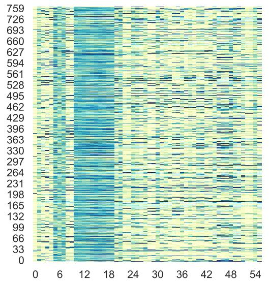
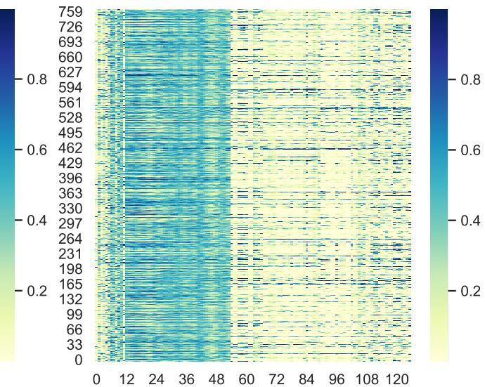

# VL-PET: Vision-and-Language Parameter-Efficient Tuning via Granularity Control

Zi-Yuan Hu1,3 Yanyang Li1 Michael R. Lyu1 Liwei Wang1,2\* 1The Chinese University of Hong Kong 2Centre for Perceptual and Interactive Intelligence 3Shanghai Artificial Intelligence Laboratory {zyhu22,yyli21,lyu,lwwang}@cse.cuhk.edu.hk

## Abstract

As the model size of pre-trained language models (PLMs) grows rapidly, full fine-tuning becomes prohibitively expensive for model training and storage. In vision-and-language (VL),parameter-efficient tuning (PET) techniques are proposed to integrate modular modifications (e.g., Adapter and LoRA) into encoder-decoder PLMs. By tuning a small set of trainable parameters, these techniques perform on par with full fine-tuning. However, excessive modular modifications and neglecting the functionality gap between the encoders and decoders can lead to performance degradation, while existing PET techniques (e.g., VL-Adapter) overlook these critical issues. In this paper, we propose a Vision-and-Language Parameter-Efficient Tuning (VL-PET) framework to impose effective control over modular modifications via a novel granularitycontrolled mechanism. Considering different granularitycontrolled matrices generated by this mechanism, a variety of model-agnostic VL-PET modules can be instantiatedfrom ourframeworkfor better efficiency and effectiveness trade-offs. We further propose lightweight PET module designs to enhance VL alignment and modeling for the encoders and maintain text generation for the decoders. Extensive experiments conducted on four image-text tasks and four video-text tasks demonstrate the efficiency, effectiveness and transferability of our VL-PET framework. In particular, our $V L { - } P E T _ { \mathrm { l a r g e } }$ with lightweight PET module designs significantly outperforms VL-Adapter by 2.92% (3.41%) and LoRA by 3.37% (7.03%) with BART-base (T5- base) on image-text tasks. Furthermore, we validate the enhanced effect of employing our VL-PET designs on existing PET techniques, enabling them to achieve significant performance improvements. Our code is available at https://github.com/HenryHZY/VL-PET.

  
Figure 1. Relative average performance gain of difference PET techniques w.r.t to full fine-tuning. Experiments are conducted with three seeds on four image-text tasks based on BART-base.

## 1. Introduction

Recently, the paradigm of pre-training transformer-based models on large-scale corpus and then fine-tuning them for downstream tasks has achieved great success in various domains, such as natural language processing (NLP) [50, 9, 33, 27, 45, 2], computer vision (CV) [10, 35, 36, 34, 13, 1], and vision-and-language (VL) [6, 28, 23, 29, 8, 42, 51]. However, as the model size of pre-trained language models (PLMs) and the number of tasks grow rapidly, fine-tuning the entire parameter set of PLMs (i.e., full fine-tuning) and preserving a task-specific copy of PLMs becomes prohibitively expensive for model training and storage.

To mitigate these problems, parameter-efficient tuning (PET) techniques are proposed to save model storage space. As stated in [12], most PET techniques freeze the whole PLM backbone and integrate trainable modular modifications (i.e., additional small trainable PET modules, such as

Adapter [15] and LoRA [16]) into PLM. By only tuning a small set of trainable parameters, these techniques achieve performance comparable to full fine-tuning. Despite the significant achievements of PET in NLP [40, 12, 32, 54, 21, 38, 16, 31] and CV [18, 41, 4, 19, 3, 7, 53], the potential of PET in VL has not been fully explored and requires further VL-specific investigation to bridge the natural modality gap between vision and language. In VL, most PET techniques follow NLP-specific modular modifications [39, 20, 55, 56, 22, 52, 37], while lacking VLspecific designs. Moreover, these techniques mainly focus on discriminative tasks (e.g., image-text retrieval), limiting the generalization ability of PLMs. Although the state-ofthe-art PET approach VL-Adapter [49] has studies challenging VL tasks, including discriminative and generative tasks (e.g., image captioning), it directly migrates those NLP-specific modular modifications without deep exploration about the most appropriate design for VL domains.

To conduct a more thorough investigation into VLspecific PET techniques, we raise and analyze two critical issues neglected by existing PET techniques in VL: (1) Integrating heavy and excessive modular modifications [12, 46] into PLMs can greatly affect the intermediate output of the PLMs, leading to instability and performance degradation. Therefore, it is crucial to take measures to impose effective control over these modular modifications to achieve better performance on VL tasks. However, state-ofthe-art PET techniques (e.g., VL-Adapter) directly integrate modular modifications into PLMs without effective control. (2) For PLMs used in VL tasks, there exists functionality gap between the encoders and decoders [8]. Specifically, the encoders focus on VL alignment and modeling, while the decoders focus on auto-regressive text generation conditioned on the visual-language representations. PLMs rely on the cross-attention modules inside the decoders to bridge the gap between the encoders and decoders. Therefore, it is essential to introduce tailored modular modification designs for each module, thereby enhancing their unique abilities and achieving better performance. However, state-of-theart PET techniques directly assign identical modular modifications to PLMs without exploring the unique ability of each PLM module, leading to suboptimal performance.

In this paper, we propose a novel Vision-and-Language Parameter-Efficient Tuning (VL-PET) framework to address the above issues. We introduce a novel granularitycontrolled mechanism to generate a granularity-controlled matrix as effective control over the modular modifications introduced by PET techniques. Considering different granularity control levels, a variety of granularitycontrolled matrices are generated by the proposed mechanism with different trainable parameter complexities. With these granularity-controlled matrices and a novel multihead modular modification, a variety of model-agnostic

VL-PET modules can be instantiated from our VL-PET framework for better efficiency and effectiveness tradeoffs. Furthermore, conventional PET module designs typically integrate modular modifications (i.e., PET modules such as Adapter) into all self-attention, cross-attention, and feed-forward modules of the PLM backbones. Due to the unique abilities of the encoders and decoders, we propose lightweight PET module designs that facilitate suitable modular modifications integration into the encoders and decoders. For encoders, we integrate our instantiated VL-PET modules into self-attention and feed-forward for better VL alignment and modeling. For decoders, we only integrate our instantiated VL-PET modules into cross-attention to maintain decoder knowledge and enhance text generation. We further assign our instantiated VL-PET module to the value matrix inside the cross-attention, enabling refined and enhanced control over the decoders. Subsequent experiments demonstrate that lightweight designs significantly outperform conventional designs with fewer parameters.

Extensive experiments are conducted on four image-text tasks with BART-base [27], including visual question answering (VQAv2 [11] and GQA [17]), visual reasoning (NLVR2 [47]) and image captioning (MSCOCO [5]). As shown in Figure 1, all of the proposed VL-PET modules with lightweight PET module designs outperform the stateof-the-art PET techniques. In particular, $\mathrm { V L - P E T _ { l a r g e } }$ (i.e., one of our instantiated VL-PET modules) significantly outperforms VL-Adapter by 2.92% and LoRA by 3.37%. Furthermore, we transfer our model-agnostic VL-PET modules to another larger backbone (i.e., T5-base [45]), where the observed trends of performance improvement remain consistent with those observed in BART-base. Our VL-$\mathrm { P E T _ { l a r g e } }$ still significantly surpasses VL-Adapter by 3.41% and LoRA by 7.03% in the same image-text tasks. However, state-of-the-art PET techniques do not show similar improvements with this larger PLM, and some techniques even exhibit performance degradation due to their heavy and excessive modular modifications integration. For completeness, we also transfer VL-PET modules to four videotext tasks, including video question answering (TVQA [24] and How2QA [29]) and video captioning (TVC [25] and YC2C [57]). Comprehensive experiments and thorough ablation studies demonstrate the efficiency, effectiveness and transferability of our VL-PET framework. Moreover, we validate the enhanced effect of employing VL-PET designs (e.g., granularity-controlled mechanism and lightweight PET module designs) on existing PET techniques (e.g., Compacter [21] and VL-Adapter), enabling them to achieve significant performance improvements.

## 2. Related Work

Generative Pre-trained Language Model. Fine-tuning pre-trained language models (PLMs) for downstream tasks has achieved great success in various domains. However, the architecture of PLMs also limits its applicability to downstream tasks. PLMs with encoder-only architecture [9, 33] are effective for discriminative tasks, while PLMs with decoder-only architecture [43, 44, 2] are better suited for generative tasks. PLMs with encoder-decoder architecture [50, 27, 45] are more generalized, as they can handle both discriminative and generative tasks. To demonstrate the effectiveness of our VL-PET framework on challenging downstream tasks (e.g., discriminative and generative tasks), we adopt encoder-decoder generative PLMs (e.g., BART-base [27] and T5-base [45]) as our backbones.

Parameter-efficient Tuning. Parameter-efficient Tuning (PET) techniques are proposed to alleviate the exorbitant cost of model storage. By fine-tuning PLMs with only a small set of trainable parameters, PET techniques perform on par with full fine-tuning. Existing PET techniques can be divided into two research categories: (1) As stated in [12], most PET techniques add new trainable parameters into PLMs (e.g., adapter-based PET techniques [15] and prompt-based PET techniques [26]); (2) Other PET techniques fine-tune a partial parameter set of the original PLMs (e.g., BitFit [54]). Despite the rapid development of PET techniques in NLP [40, 12, 32, 54, 21, 38, 16, 31] and CV [18, 41, 4, 19, 3, 7, 53], most PET techniques in VL are prompt-based or mainly focus on discriminative tasks [39, 20, 55, 56, 22, 52, 37], which limits the generalization ability of PLMs. State-of-the-art PET techniques [49, 48] focus on some challenging VL tasks with encoder-decoder generative PLMs. Regardless of the risk of performance degradation caused by excessive modular modifications and the neglect of the unique abilities of the encoders and decoders, VL-Adapter [49] directly migrates NLP-specific modular modifications without making VLspecific designs. In this work, we propose a VL-PET framework with a granularity-controlled mechanism, multi-head modular modifications and lightweight PET module designs to tackle these issues neglected by existing PET techniques.

## 3. VL-PET Framework

In this section, we propose a novel Vision-and-Language Parameter-Efficient Tuning (VL-PET) framework for encoder-decoder generative PLMs. An illustration of our model is shown in Fig. 2. We propose a novel granularity-controlled mechanism to generate a granularitycontrolled matrix at different granularity control levels, which regulates the output of the modular modifications introduced by PET techniques. As shown in Fig. 3, considering different granularity control levels and a multi-head modular modification, a variety of model-agnostic VL-PET modules can be instantiated from the proposed VL-PET framework. We further propose lightweight PET module designs to facilitate suitable VL-PET module integration into the encoders and decoders.

  
Figure 2. Illustration of an encoder-decoder generative pre-trained language model backbone with model-agnostic VL-PET modules and lightweight PET module designs.

## 3.1. Preliminary

As stated in [12], most PET techniques can be attributed to introducing trainable modular modifications (e.g., Adapter [15] and LoRA [16]) into PLMs and updating the outputs of frozen PLM modules (e.g., self-attention, feed-forward, cross-attention and value matrix of crossattention). With this unified perspective, tuning with a trainable PET module can be formulated as follows:

$$
\mathbf { H }  \mathbf { H } + \Delta \mathbf { H }\tag{1}
$$

where $\mathbf { H } \in \mathbb { R } ^ { N \times d }$ refers to an intermediate hidden state of length N and dimension d from a PLM module, and $\Delta \mathbf { H } \in \mathbb { R } ^ { N \times d }$ refers to a modular modification introduced by a PET module. In VL tasks, state-of-the-art methods usually migrate PET techniques [21, 38, 15] from NLP and CV without making VL-specific designs. Moreover, these techniques fail to impose effective control over these modular modifications, while excessive modular modifications may lead to performance degradation. Therefore, we aim to tackle this issue with a granularity-controlled mechanism.

## 3.2. Granularity-controlled Mechanism

To impose effective control over the modular modifications ∆H, we propose a granularity-controlled mechanism that assigns a granularity-controlled matrix $\mathbf { G } \in \mathbb { R } ^ { N \times d }$ to the updating of the intermediate hidden state H. Adopting a unified perspective from Eq. (1), the granularity-controlled mechanism can be expressed as a unified formula:

  
Figure 3. Comparison between full fine-tuning and fine-tuning with VL-PET framework. PLM module refers to a sub-module of PLMs (e.g., self-attention, feed-forward, cross-attention and value matrix of cross-attention). We denote X of length N and dimension d as the input of a PLM module, H as the output of a PLM module, ∆H as a multi-head modular modification, z as a trainable vector of dimension $d , \mathbf { 1 } _ { 1 \times d }$ as an all-one matrix and G as a granularity-controlled matrix generated by the granularity-controlled mechanism.

$$
\mathbf { H } \gets \mathbf { G } \odot \left( \mathbf { H } + \Delta \mathbf { H } \right)\tag{2}
$$

where ⊙ denotes element-wise product. Given the input $\mathbf { X } \in \mathbb { R } ^ { N \times d }$ and output H of a PLM module, a granularitycontrolled matrix G can be generated at different granularity levels according to necessities. In this paper, we generate G into four granularity control levels (i.e., large, middleX, middleY and small). Specifically, we directly generate a trainable matrix $\mathbf { G } _ { \mathrm { l a r g e } } \in \mathbb { R } ^ { N \times \mathbf { \bar { d } } }$ at the large level. At the middleX level, we first generate a trainable matrix $\widetilde { \mathbf { G } } _ { \mathrm { m i d d l e X } } \in \mathbb { R } ^ { N \times 1 }$ and then extend it to $\mathbf { G } _ { \mathrm { m i d d l e X } } \in \mathbb { R } ^ { N \times d }$ without extra trainable parameters. Similarly, we first generate a trainable matrix $\widetilde { \mathbf { G } } _ { \mathrm { m i d d l e Y } } \in \mathbb { R } ^ { 1 \times d }$ and $ { \widetilde { \mathbf { G } } } _ { \mathrm { s m a l l } } \ \in$ $\mathbb { R } ^ { 1 \times 1 }$ for the middleY and small, respectively, and then extend them to $\mathbf { G } _ { \mathrm { m i d d l e Y } } \in \mathbb { R } ^ { N \times d }$ and $\mathbf { G } _ { \mathrm { s m a l l } } \in \mathbb { R } ^ { N \times d }$ without additional trainable parameters.

Given a specific granularity-controlled matrix, a specific VL-PET module can be instantiated from our VL-PET framework. Next, we provide one granularity-controlled matrix generation method for each granularity level, respectively, as shown in Fig. 3 and Tab. 1.

<table><tr><td>Level</td><td>Trainable Matrix</td><td>Granularity-controlled Matrix</td><td>Trainable Parameter Complexity</td></tr><tr><td>Large</td><td> $\mathbf { G } _ { \mathrm { l a r g e } } \in \mathbb { R } ^ { N \times d }$ </td><td> $\mathbf { G } _ { \mathrm { l a r g e } } \in \mathbb { R } ^ { N \times d }$ </td><td>O(dr)</td></tr><tr><td>MiddleX</td><td> $\widetilde { \mathbf { G } } _ { \mathrm { m i d d l e X } } \in \mathbb { R } ^ { N \times 1 }$ </td><td> $\mathbf { G } _ { \mathrm { m i d d l e X } } \in \mathbb { R } ^ { N \times d }$ </td><td>O(d)</td></tr><tr><td>MiddleY</td><td> $\widetilde { \mathbf { G } } _ { \mathrm { m i d d l e Y } } \in \mathbb { R } ^ { 1 \times d }$ </td><td> $\mathbf { G } _ { \mathrm { m i d d l e Y } } \in \mathbb { R } ^ { N \times d }$ </td><td>O(d)</td></tr><tr><td>Small</td><td> $\widetilde { \mathbf { G } } _ { \mathrm { s m a l l } } \in \mathbb { R } ^ { 1 \times 1 }$ </td><td> $\mathbf { G } _ { \mathrm { s m a l l } } \in \mathbb { R } ^ { N \times d }$ </td><td>O(d)</td></tr></table>

Table 1. The proposed granularity-controlled matrices at different granularity control levels, which are extended from trainable matrices. Trainable parameter complexity is determined by the method for generating a trainable matrix.

(1) Large Level. At this level, we generate a granularitycontrolled matrix $\mathbf { G } _ { \mathrm { l a r g e } } \in \mathbb { R } ^ { N \times d }$ with a bottleneck architecture as follows:

$$
\mathbf { G } _ { \mathrm { l a r g e } } = s \cdot \sigma ( \phi ( \mathbf { X } \mathbf { W } _ { \mathrm { l a r g e - d o w n } } ) \mathbf { W } _ { \mathrm { l a r g e - u p } } )\tag{3}
$$

where $\mathbf { W } _ { \mathrm { l a r g e - d o w n } } \in \mathbb { R } ^ { d \times r }$ is a down projection layer which projects features from dimension d to projected hidden dimension r, ϕ is a non-linear GELU function [14], $\mathbf { W } _ { \mathrm { l a r g e - u p } } \ \in \ \mathbb { R } ^ { r \times d }$ is an up projection layer, σ is a sigmoid function and s is a scaling factor, which is a hyperparameter specialized for different PLMs. Therefore, the trainable parameter complexity of $\mathbf { G } _ { \mathrm { l a r g e } }$ is O(dr).

(2) MiddleX Level. We first define an all-one matrix as $\mathbf { 1 } _ { m \times n } \in \mathbb { R } ^ { m \times n }$ . The intermediate output of the granularitycontrolled mechanism at middleX level is $\tilde { \mathbf { G } } _ { \mathrm { m i d d l e X } } \in$ $\mathbb { R } ^ { N \times 1 }$ , which can be calculated as follows:

<table><tr><td>Method</td><td>Trainable Params (%)</td><td>VQA Acc. (%)</td><td>GQA Acc. (%)</td><td> $\mathrm { \Delta N L V R ^ { 2 } }$ </td><td>COCO Acc. (%) Cap. (CIDEr)</td><td>Avg.</td></tr><tr><td colspan="7">Backbone: BART-base</td></tr><tr><td>Full Fine-tuning*</td><td>100</td><td> $6 6 . 8 8 _ { 0 . 1 7 }$ </td><td> $5 6 . 7 9 _ { 0 . 4 1 }$ </td><td> $7 3 . 6 6 _ { 0 . 2 1 }$ </td><td> $1 1 2 . 0 1 _ { 0 . 9 3 }$ </td><td> $7 7 . 3 3 _ { 0 . 3 9 }$ </td></tr><tr><td> $\mathrm { B i t F i t } ^ { \pm } \ [ 5 4 ]$ </td><td>1.21</td><td> $5 2 . 9 4 _ { 0 . 5 2 }$ </td><td> $4 3 . 1 5 _ { 0 . 9 4 }$ </td><td> $5 2 . 2 9 _ { 0 . 7 6 }$ </td><td> $1 1 1 . 4 4 _ { 0 . 4 1 }$ </td><td> $6 4 . 9 6 _ { 0 . 1 7 }$ </td></tr><tr><td>Prompt Tuning [26]</td><td>2.00</td><td> $4 4 . 1 2 _ { 0 . 4 5 }$ </td><td> $3 6 . 3 7 _ { 0 . 3 5 }$ </td><td> $5 1 . 3 4 _ { 0 . 8 3 }$ </td><td> $1 0 5 . 0 2 _ { 0 . 2 4 }$ </td><td> $5 9 . 2 1 _ { 0 . 2 1 }$ </td></tr><tr><td>Compacter* [21]</td><td>2.70</td><td> $6 4 . 6 3 _ { 0 . 0 9 }$ </td><td> $5 2 . 7 0 _ { 0 . 2 4 }$ </td><td> $7 1 . 1 1 _ { 0 . 3 5 }$ </td><td> $1 1 4 . 6 9 _ { 0 . 4 2 }$ </td><td> $7 5 . 7 8 _ { 0 . 2 1 }$ </td></tr><tr><td> $\mathrm { H y p e r F o r m e r ^ { \pm } \ [ 3 8 ] }$ </td><td>5.79</td><td> $6 4 . 6 2 _ { 0 . 6 7 }$ </td><td> $5 2 . 5 5 _ { 0 . 6 4 }$ </td><td> $7 0 . 7 4 _ { 1 . 4 5 }$ </td><td> $1 1 4 . 8 4 _ { 0 . 3 8 }$ </td><td> $7 5 . 6 9 _ { 0 . 7 4 }$ </td></tr><tr><td> $\mathrm { L o R A } ^ { \pm } \left[ 1 6 \right]$ </td><td>5.93</td><td> $6 5 . 1 5 _ { 0 . 1 6 }$ </td><td> $5 3 . 6 6 _ { 0 . 8 4 }$ </td><td> $7 2 . 5 8 _ { 0 . 7 3 }$ </td><td> $1 1 5 . 0 1 _ { 0 . 2 6 }$ </td><td> $7 6 . 6 0 _ { 0 . 3 2 }$ </td></tr><tr><td> $\mathrm { V L - A d a p t e r } ^ { \bullet } \ [ 4 9 ]$ </td><td>4.18</td><td> $6 5 . 7 6 \mathrm { _ 0 . 2 8 }$ </td><td> $5 4 . 1 6 _ { 0 . 4 4 }$ </td><td> $\underline { { 7 3 . 1 9 _ { 0 . 7 1 } } }$ </td><td> $1 1 4 . 6 1 _ { 0 . 2 6 }$ </td><td> $7 6 . 9 3 _ { 0 . 2 5 }$ </td></tr><tr><td> $\mathrm { \Delta V L - P E T _ { \mathrm { s m a l l } } }$ </td><td>2.98</td><td> $6 5 . 4 3 _ { 0 . 0 6 }$ </td><td> $5 4 . 0 3 _ { 0 . 1 4 }$ </td><td> $7 2 . 4 3 _ { 0 . 2 2 }$ </td><td> $1 2 0 . 6 8 _ { 0 . 3 5 }$ </td><td> $7 8 . 1 4 _ { 0 . 1 1 }$ </td></tr><tr><td> $\mathrm { V L \mathrm { - } P E T _ { \mathrm { m i d d l e X } } }$ </td><td>2.98</td><td> $6 5 . 5 4 _ { 0 . 0 9 }$ </td><td> $\underline { { 5 4 . 5 3 } } _ { 0 . 1 5 }$ </td><td> $7 2 . 6 6 _ { 0 . 1 7 }$ </td><td> $\underline { { 1 2 0 . 7 2 } } 0 . 5 1$ </td><td> $\underline { { 7 8 . 3 7 _ { 0 . 1 4 } } }$ </td></tr><tr><td> $\mathrm { V L \mathrm { - } P E T _ { \mathrm { m i d d l e Y } } }$ </td><td>2.98</td><td> $6 5 . 3 6 _ { 0 . 1 5 }$ </td><td> $5 3 . 8 3 _ { 0 . 3 9 }$ </td><td> $7 3 . 4 3 _ { 0 . 7 8 }$ </td><td> $1 2 0 . 3 1 _ { 0 . 0 9 }$ </td><td> $7 8 . 2 3 _ { 0 . 1 9 }$ </td></tr><tr><td> $\mathrm { V L - P E T _ { l a r g e } }$ </td><td>4.16</td><td> ${ \bf 6 6 . 1 7 _ { 0 . 2 7 } }$ </td><td> ${ \bf 5 5 . 1 1 _ { 0 . 1 7 } }$ </td><td> $7 3 . 4 3 _ { 0 . 3 5 }$ </td><td> $\mathbf { 1 } 2 2 . \mathbf { 0 3 } _ { 0 . 4 6 }$ </td><td> $\mathbf { 7 9 . 1 8 } _ { 0 . 1 4 }$ </td></tr></table>

<table><tr><td colspan="7">Backbone: T5-base</td></tr><tr><td>Full Fine-tuning*</td><td>100</td><td> $6 7 . 1 0 _ { 0 . 1 0 }$ </td><td> $5 6 . 3 0 _ { 0 . 3 0 }$ </td><td> $7 4 . 3 0 _ { 0 . 4 0 }$ </td><td> $1 1 2 . 2 0 _ { 0 . 3 0 }$ </td><td> $7 7 . 5 0 _ { 0 . 3 0 }$ </td></tr><tr><td> $\mathrm { B i t F i t } ^ { \bullet } \ [ 5 4 ]$ </td><td>0.83</td><td> $5 5 . 1 0 _ { 0 . 2 0 }$ </td><td> $4 5 . 5 0 _ { 0 . 2 0 }$ </td><td> $5 1 . 7 0 _ { 1 . 1 0 }$ </td><td> $1 0 1 . 2 0 _ { 0 . 2 0 }$ </td><td> $6 3 . 4 0 _ { 0 . 1 0 }$ </td></tr><tr><td>Prompt Tuning* [26]</td><td>1.26</td><td> $4 7 . 4 0 _ { 0 . 7 0 }$ </td><td> $4 0 . 6 0 _ { 0 . 4 0 }$ </td><td> $5 1 . 0 0 _ { 0 . 4 0 }$ </td><td> $9 6 . 1 0 _ { 0 . 9 0 }$ </td><td> $5 8 . 8 0 _ { 0 . 6 0 }$ </td></tr><tr><td> $\mathrm { L o R A } ^ { \bullet } \ [ 1 6 ]$ </td><td>7.54</td><td> $6 3 . 7 0 _ { 0 . 2 0 }$ </td><td> $5 3 . 3 0 _ { 0 . 1 0 }$ </td><td> $7 0 . 0 0 _ { 0 . 3 0 }$ </td><td> $1 1 0 . 3 0 _ { 0 . 4 0 }$ </td><td> $7 4 . 3 0 _ { 0 . 1 0 }$ </td></tr><tr><td> $\mathrm { V L - A d a p t e r } ^ { \bullet } \ [ 4 9 ]$ </td><td>7.98</td><td> ${ \bf 6 7 . 1 0 } _ { 0 . 1 0 }$ </td><td> $5 6 . 0 0 _ { 0 . 4 0 }$ </td><td> $7 2 . 7 0 _ { 0 . 3 0 }$ </td><td> $1 1 1 . 8 0 _ { 0 . 1 0 }$ </td><td> $7 6 . 9 0 _ { 0 . 2 0 }$ </td></tr><tr><td> $\mathrm { L S T } ^ { \bullet } \ [ 4 8 ]$ </td><td>7.46</td><td> $6 6 . 5 0 _ { 0 . 1 0 }$ </td><td> $5 5 . 9 0 _ { 0 . 1 0 }$ </td><td> $7 1 . 6 0 _ { 0 . 3 0 }$ </td><td> $1 1 3 . 5 0 _ { 0 . 3 0 }$ </td><td> $7 6 . 9 0 _ { 0 . 1 0 }$ </td></tr><tr><td> $\mathrm { \Delta V L - P E T _ { \mathrm { s m a l l } } }$ </td><td>4.51</td><td> $6 5 . 8 8 _ { 0 . 3 1 }$ </td><td> $5 4 . 9 6 _ { 1 . 0 1 }$ </td><td> $7 2 . 6 4 _ { 0 . 0 9 }$ </td><td> $1 2 0 . 0 5 _ { 0 . 4 1 }$ </td><td> $7 8 . 3 8 _ { 0 . 3 7 }$ </td></tr><tr><td> $\mathrm { V L \mathrm { - } P E T _ { \mathrm { m i d d l e X } } }$ </td><td>4.50</td><td> $6 6 . 6 3 _ { 0 . 1 4 }$ </td><td> $5 5 . 8 7 _ { 0 . 2 5 }$ </td><td> ${ \bf 7 4 . 1 1 } _ { 0 . 3 7 }$ </td><td> $\underline { { 1 2 0 . 4 1 } } _ { 0 . 3 1 }$ </td><td> $7 9 . 2 6 _ { 0 . 2 6 }$ </td></tr><tr><td> $\mathrm { V L \mathrm { - } P E T _ { \mathrm { m i d d l e Y } } }$ </td><td>4.50</td><td> $6 6 . 6 2 _ { 0 . 2 0 }$ </td><td> $5 5 . 8 7 _ { 0 . 1 3 }$ </td><td> $7 3 . 9 1 _ { 0 . 4 5 }$ </td><td> $1 2 0 . 2 6 _ { 0 . 4 0 }$ </td><td> $7 9 . 1 7 _ { 0 . 0 8 }$ </td></tr><tr><td> $\mathrm { V L - P E T _ { l a r g e } }$ </td><td>7.31</td><td> $6 6 . 9 5 _ { 0 . 2 1 }$ </td><td> $\pmb { 5 6 . 0 6 } _ { 0 . 2 1 }$ </td><td> $\underline { { 7 3 . 4 2 _ { 0 . 4 6 } } }$ </td><td> $\mathbf { 1 2 1 . 6 6 } _ { 0 . 0 6 }$ </td><td> $7 9 . 5 2 _ { 0 . 2 1 }$ </td></tr></table>

Table 2. Performance on image-text tasks with different PLM backbones. We report the average result with three seeds for a fair comparison, where the subscript is the standard deviation. As analyzed in Sec. 4.2, our special VL-PET designs (e.g., lightweight PET module designs) enable our proposed method to surpass other PET techniques in the downstream tasks (e.g., COCO Captioning). (Bold refers to the best result among all PET techniques and underline refers to the second-best result among all PET techniques. ♣: We reproduce the results with three seeds in [49], which only provides results with one seed. ♠: We present the results with three seeds from [48].)

to calculate the intermediate output $\widetilde { \mathbf { G } } _ { \mathrm { m i d d l e Y } } \in \mathbb { R } ^ { 1 \times d } \colon$

$$
\widetilde { \bf G } _ { \mathrm { m i d d l e X } } = \boldsymbol { s } \cdot \boldsymbol { \sigma } ( ( { \bf X } + { \bf H } ) { \bf W } _ { \mathrm { m i d d l e - d o w n } } )\tag{4}
$$

where $\mathbf { W } _ { \mathrm { m i d d l e - d o w n } } \ \in \ \mathbb { R } ^ { d \times 1 }$ is a down projection layer. Next, we use an all-one matrix $\mathbf { 1 } _ { 1 \times d } ~ \in ~ \mathbb { R } ^ { 1 \times d }$ to copy $\widetilde { \mathbf { G } } _ { \mathrm { m i d d l e X } }$ d times to construct $\mathbf { G } _ { \mathrm { m i d d l e X } } \in \mathbb { R } ^ { N \times d } ;$

$$
\widetilde { \mathbf { G } } _ { \mathrm { m i d d l e Y } } = s \cdot ( \sigma ( z ) + \mathbf { 1 } _ { 1 \times d } )\tag{6}
$$

$$
\mathbf { G } _ { \mathrm { m i d d l e X } } = \widetilde { \mathbf { G } } _ { \mathrm { m i d d l e X } } \mathbf { 1 } _ { 1 \times d }
$$

The trainable parameter complexity of $\mathbf { G } _ { \mathrm { m i d d l e Y } }$ is $\mathcal O ( d )$ Similarly, we extend $ { \widetilde { \mathbf { G } } } _ { \mathrm { m i d d l e Y } }$ to $\mathbf { G } _ { \mathrm { m i d d l e Y } }$ as follow:

(5)

The trainable parameter complexity of $\mathbf { G } _ { \mathrm { m i d d l e X } }$ is $\mathcal O ( d )$

(3) MiddleY Level. The granularity-controlled matrix $\mathbf { G } _ { \mathrm { m i d d l e Y } } \in \mathbb { R } ^ { N \times d }$ can be viewed as a variant of $\mathbf { G } _ { \mathrm { m i d d l e X } }$ as shown in Fig. 3. Instead of utilizing hidden states from the PLM backbone, we adopt a trainable vector $z \in \mathbb { R } ^ { 1 \times d }$

$$
\mathbf { G } _ { \mathrm { m i d d l e Y } } = \mathbf { 1 } _ { N \times 1 } \widetilde { \mathbf { G } } _ { \mathrm { m i d d l e X } }\tag{7}
$$

(4) Small Level. Compared to other levels, the granularitycontrolled mechanism produces the smallest intermediate output $\widetilde { \mathbf { G } } _ { \mathrm { s m a l l } } \in \mathbb { R } ^ { 1 \times 1 }$ at this level. We concatenate X and H along the d dimension to compute $\widetilde { \mathbf { G } } _ { \mathrm { s m a l l } } \mathrm { : }$

$$
\widetilde { \bf G } _ { \mathrm { s m a l l } } = s \cdot \psi \big ( \sigma \big ( \mathrm { C o n c a t ( { \bf X } , { \bf H } ) { \bf W } _ { \mathrm { s m a l l - d o w n } } } \big ) \big )\tag{8}
$$

where $\mathbf { W _ { \mathrm { s m a l l - d o w n } } } \in \mathbb { R } ^ { 2 d \times 1 }$ is a down projection layer and ψ denotes average pooling along the dimension N. Therefore, the trainable parameter complexity of this level is $\mathcal O ( d )$ . In the end, we expand $\widetilde { \mathbf { G } } _ { \mathrm { s m a l l } }$ to $\mathbf { \bar { G } } _ { \mathrm { s m a l l } } \in \mathbb { R } ^ { N \times d } \mathbf { \bar { \Lambda } }$

$$
\mathbf { G } _ { \mathrm { s m a l l } } = \mathbf { 1 } _ { N \times 1 } \widetilde { \mathbf { G } } _ { \mathrm { s m a l l } } \mathbf { 1 } _ { 1 \times d }\tag{9}
$$

## 3.3. VL-PET Module with Lightweight Designs

Multi-head Modular Modification. Prior to introducing our lightweight PET module designs, we introduce a novel and more effective modular modification into the PLMs in a multi-head manner. Supposed that $N _ { h }$ is the number of heads and $\mathbf { X } ^ { \prime } \in \mathbb { R } ^ { N \times d }$ is the input, a multi-head modular modification $\Delta \mathbf { H } ^ { \prime } \in \mathbb { R } ^ { N \times d }$ is defined as:

$$
\Delta { \bf H } ^ { \prime } = \phi ( \mathrm { C o n c a t } ( { \bf X } ^ { \prime } { \bf W } _ { \mathrm { d o w n } } ^ { ( 1 ) } , \cdot \cdot \cdot , { \bf X } ^ { \prime } { \bf W } _ { \mathrm { d o w n } } ^ { ( N _ { h } ) } ) ) { \bf W } _ { \mathrm { u p } }\tag{10}
$$

where $\mathbf { W } _ { \mathrm { d o w n } } ^ { ( i ) } \ \in \ \mathbb { R } ^ { d \times \frac { r } { N _ { h } } }$ is a down projection layer for headi and $\mathbf { W } _ { \mathbf { u p } } ~ \in ~ \mathbb { R } ^ { r \times d }$ is a up projection layer. Considering a multi-head modular modification and different granularity-controlled matrices describe in Sec. 3.2, a variety of model-agnostic VL-PET modules can be instantiated from our VL-PET framework for better efficiency and effectiveness trade-offs.

Lightweight PET Module Designs. Conventional PET module designs typically apply modular modifications to all self-attention, cross-attention, and feed-forward modules of the PLM backbones. In VL tasks, state-of-the-art PET techniques [49] follow these designs for encoder-decoder PLMs, neglecting the unique abilities of the encoders and decoders. To mitigate this issue, we propose lightweight PET module designs that facilitate suitable modular modifications integration into the encoders and decoders. Specifically, our lightweight designs present a simple yet efficient idea that decoder PET modules should be lightweight and refined compared to encoder PET modules.

Since PLMs are trained on text-only data, adapting PLM encoders to learn unseen visual representation is crucial for VL tasks. Therefore, we aim to enhance the visual-language alignment and modeling ability of the encoders with relatively heavy encoder PET modules. Specifically, we integrate our instantiated VL-PET modules (utilizing $\mathbf { G } _ { \mathrm { l a r g e } } ,$ $\mathbf { G } _ { \mathrm { m i d d l e X } } , \mathbf { G } _ { \mathrm { m i d d l e Y } } \mathrm { o r } \mathbf { G } _ { \mathrm { s m a l l } } )$ into both self-attention and feed-forward modules. As a result, we set X′ as the output of self-attention or feed-forward modules for Eq. (10).

For the decoder VL-PET modules, we want to avoid heavy and excessive modular modification in the PLM decoders as they are already good at text generation. Since PLMs utilize cross-attention to bridge the functionality and modality gap between the encoders and decoders, we only integrate PET modules into cross-attention modules. Specifically, we employ our VL-PET modules (utilizing $\textbf { G } = \textbf { 1 } _ { N \times d }$ for parameter-efficiency) to the value matrices of cross-attention only, enabling lightweight and refined control over the decoders. In this case, we set $\mathbf { X } ^ { \prime }$ as the input of value matrices (i.e., the final output of the encoders).

<table><tr><td>Method</td><td>Trainable Params (%)</td><td>TVQA Acc. (%)</td><td>How2QA Acc. (%)</td><td>TVC Cap. (CIDEr)</td><td>YC2C Cap. (CIDEr)</td><td> $\operatorname { A v g } .$ </td></tr><tr><td>Full Fine-tuning</td><td>100</td><td>77.69</td><td>74.79</td><td>50.56</td><td>151.71</td><td>88.69</td></tr><tr><td>BitFit</td><td>0.38</td><td>66.05</td><td>65.42</td><td>31.16</td><td>115.23</td><td>69.47</td></tr><tr><td>Prompt Tuning</td><td>1.18</td><td>24.51</td><td>27.76</td><td>30.22</td><td>108.04</td><td>47.63</td></tr><tr><td>Compacter</td><td>1.89</td><td>73.78</td><td>72.14</td><td>41.39</td><td>140.52</td><td>81.96</td></tr><tr><td>LoRA</td><td>5.17</td><td>75.51</td><td>72.69</td><td>44.17</td><td>142.72</td><td>83.77</td></tr><tr><td>VL-Adapter</td><td>3.39</td><td>77.06</td><td>74.73</td><td>46.72</td><td>153.28</td><td>87.95</td></tr><tr><td>VL-PETsmall</td><td>2.18</td><td>77.69</td><td>74.89</td><td>47.92</td><td>150.24</td><td>87.69</td></tr><tr><td>VL-PETmiddleY</td><td>2.17</td><td>77.76</td><td>75.40</td><td>48.30</td><td>150.25</td><td>87.93</td></tr><tr><td>VL-PETmiddleY</td><td>2.17</td><td>77.58</td><td>75.15</td><td>47.93</td><td>151.13</td><td>87.95</td></tr><tr><td> $\mathrm { \Delta V L - P E T _ { l a r g e } }$ </td><td>3.37</td><td>76.97</td><td>75.60</td><td>47.53</td><td>154.41</td><td>88.63</td></tr></table>

Table 3. Performance on video-text tasks with BART-base. We report the result with one seed due to the submission limit of VALUE benchmark. (Bold: best result among all PET techniques. Underline: second-best result among all PET techniques.)
<table><tr><td>Method</td><td>Params (%)</td><td>VQA (%)</td><td>GQA (%)</td><td>NLVR2 (%)</td><td>COCO (CIDEr)</td><td> $\operatorname { A v g } .$ </td></tr><tr><td>VL-PET w/o G</td><td>2.97</td><td> $6 5 . 2 2 _ { 0 . 1 4 }$ </td><td> $\overline { { 5 3 . 3 5 _ { 0 . 3 9 } } }$ </td><td> $7 2 . 6 5 _ { 0 . 4 4 }$ </td><td> $1 2 0 . 1 9 _ { 0 . 6 8 }$ </td><td> $7 7 . 8 5 _ { 0 . 3 4 }$ </td></tr><tr><td>VL-PET8small</td><td>2.98</td><td> $6 5 . 4 3 _ { 0 . 0 6 }$ </td><td> $5 4 . 0 3 _ { 0 . 1 4 }$ </td><td> $7 2 . 4 3 _ { 0 . 2 2 }$ </td><td> $1 2 0 . 6 8 _ { 0 . 3 5 }$ </td><td> $7 8 . 1 4 _ { 0 . 1 1 }$ </td></tr><tr><td> $\mathrm { V L - P E T _ { m i d d l e X } }$ </td><td>2.98</td><td> $6 5 . 5 4 _ { 0 . 0 9 }$ </td><td> $5 4 . 5 3 \mathrm { _ 0 . 1 5 }$ </td><td> $7 2 . 6 6 _ { 0 . 1 7 }$ </td><td> $1 2 0 . 7 2 \mathrm { _ { 0 . 5 1 } }$ </td><td> $\underline { { 7 8 . 3 7 _ { 0 . 1 4 } } }$ </td></tr><tr><td> $\mathrm { V L - P E T _ { \mathrm { m i d d l e Y } } }$ </td><td>2.98</td><td> $6 5 . 3 6 _ { 0 . 1 5 }$ </td><td> $5 3 . 8 3 _ { 0 . 3 9 }$ </td><td> $7 3 . 4 3 _ { 0 . 7 8 }$ </td><td> $1 2 0 . 3 1 _ { 0 . 0 9 }$ </td><td> $7 8 . 2 3 \mathrm { _ { 0 . 1 9 } }$ </td></tr><tr><td> $\mathbf { V L - P E T _ { l a r g e } }$ </td><td>4.16</td><td> $6 6 . 1 7 _ { 0 . 2 7 }$ </td><td> ${ \bf 5 5 . 1 1 _ { 0 . 1 7 } }$ </td><td> $7 3 . 4 3 _ { 0 . 3 5 }$ </td><td> $\mathbf { 1 } 2 2 . 0 3 _ { 0 . 4 6 }$ </td><td> $7 9 . 1 8 _ { 0 . 1 4 }$ </td></tr></table>

Table 4. Effectiveness of granularity-controlled mechanism in BART-base. (Bold: best result. Underline: second-best result.)

## 4. Experiments

## 4.1. Experimental Settings

Datasets. In this work, we conduct experiments on four image-text downstream tasks and four video-text downstream tasks. Image-text tasks consist of visual question answering (VQAv2 [11] and GQA [17]), visual reasoning $\mathrm { ( N L V R ^ { 2 } }$ [47]) and image captioning (MSCOCO [5]). Video-text tasks consist of video question answering (TVQA [24] and How2QA [29]) and video captioning (TVC [25] and YC2C [57]) from VALUE [30] benchmark.

Baselines and Evaluations. Our baselines consist of state-of-the-art PET techniques, including BitFit [54], Prompt Tuning [26], Compacter [21], HyperFormer [38], LoRA [16], VL-Adapter [49] and LST [48]. To compare these baselines with conventional PET module designs, we propose four VL-PET modules (denoted as VL-PETlarge, $\mathrm { V L \mathrm { - } P E T _ { \mathrm { m i d d l e X } } . }$ $\mathrm { V L \mathrm { - } P E T _ { \mathrm { m i d d l e Y } } }$ and $\mathrm { V L \mathrm { - } P E T _ { \mathrm { s m a l l } } ) }$ with lightweight PET module designs described in Sec. 3.2. We also include full fine-tuning (i.e., train the entire PLMs without PET modules) to facilitate a comprehensive comparison. Following [49], we adopt a trainable linear layer as the visual projector and prepend a task-specific prompt to the input sentence for each task, such as “vqa: [Q]”. We share the PET module for different tasks and perform multi-task learning via unified text generation [49] to acquire cross-task knowledge. We run each experiment with three seeds on image-text tasks and one seed on video-text tasks due to the submission limit of the VALUE benchmark.

<table><tr><td colspan="3">Decoder VL-PET1arge</td><td rowspan="2"></td><td rowspan="2"></td><td rowspan="2"></td><td rowspan="2"></td><td rowspan="2">Params (%) VQA (%) GQA (%) NLVR2 (%) COCO (CIDEr)</td><td rowspan="2">Avg.</td></tr><tr><td>Self</td><td>Cross</td><td>FF</td></tr><tr><td>√</td><td>x</td><td>x</td><td>4.16</td><td> $6 6 . 2 9 _ { 0 . 1 1 }$ </td><td> $5 4 . 3 7 _ { 0 . 6 1 }$ </td><td> $7 2 . 7 7 _ { 0 . 1 2 }$ </td><td> $1 1 7 . 2 4 _ { 1 . 0 7 }$ </td><td> $7 7 . 6 7 _ { 0 . 3 8 }$ </td></tr><tr><td>x</td><td>√</td><td>x</td><td>4.16</td><td> $6 6 . 2 4 _ { 0 . 0 7 }$ </td><td> $5 4 . 6 2 _ { 0 . 2 5 }$ </td><td> $7 3 . 2 6 _ { 0 . 3 3 }$ </td><td> $1 1 8 . 6 8 _ { 0 . 4 2 }$ </td><td> $7 8 . 2 0 _ { 0 . 2 5 }$ </td></tr><tr><td>x</td><td>x</td><td>√</td><td>4.16</td><td> $6 6 . 2 1 _ { 0 . 0 8 }$ </td><td> $5 4 . 5 7 _ { 0 . 3 5 }$ </td><td> $7 3 . 3 5 _ { 0 . 2 4 }$ </td><td> $1 1 6 . 7 8 _ { 0 . 3 5 }$ </td><td> $7 7 . 7 3 \mathrm { _ { 0 . 1 4 } }$ </td></tr><tr><td>√</td><td>√</td><td>x</td><td>4.74</td><td> $6 6 . 6 6 _ { 0 . 2 2 }$ </td><td> $5 5 . 1 2 _ { 0 . 2 8 }$ </td><td> $7 3 . 1 6 _ { 0 . 5 1 }$ </td><td> $1 1 6 . 9 0 _ { 0 . 9 8 }$ </td><td> $7 7 . 9 6 _ { 0 . 1 5 }$ </td></tr><tr><td>√</td><td>x</td><td>√</td><td>4.74</td><td> $6 6 . 3 1 _ { 0 . 2 1 }$ </td><td> $5 4 . 9 5 _ { 0 . 0 6 }$ </td><td> $7 3 . 1 1 _ { 0 . 2 9 }$ </td><td> $1 1 6 . 1 4 _ { 0 . 1 3 }$ </td><td> $7 7 . 6 2 _ { 0 . 0 5 }$ </td></tr><tr><td>x</td><td>√</td><td>√</td><td>4.74</td><td> $6 6 . 4 5 _ { 0 . 2 4 }$ </td><td>55.130.16</td><td>73.660.23</td><td>116.940.49</td><td>78.050.04</td></tr><tr><td>√</td><td>√</td><td>√</td><td>5.31</td><td> $6 6 . 5 7 _ { 0 . 3 0 }$ </td><td> $5 4 . 7 7 _ { 0 . 2 6 }$ </td><td> $7 3 . 5 4 _ { 0 . 3 6 }$ </td><td> $1 1 5 . 6 5 _ { 0 . 4 6 }$ </td><td> $7 7 . 6 3 _ { 0 . 1 7 }$ </td></tr></table>

Table 5. Experiments on where to integrate $\mathrm { V L - P E T _ { l a r g e } }$ into the PLM decoders. (Self, Cross and FF indicate self-attention, crossattention and feed-forward modules of the PLM decoders. $\checkmark :$ insert. ✗: not insert. Bold: best average performance.)
<table><tr><td>Method</td><td>Params (%)</td><td></td><td>VQA (%) GQA (%)</td><td>NLVR2 (%)</td><td>COCO (CIDEr)</td><td>Avg.</td></tr><tr><td> $\overline { { \mathrm { D e c o d e r } { \bf V } { \bf L } { \cdot } \mathrm { P E T } _ { \mathrm { l a r g e } } ( \mathrm { C r o s s } ) } }$ </td><td>4.16</td><td> $\overline { { 6 6 . 2 4 _ { 0 . 0 7 } } }$ </td><td> $\overline { { 5 4 . 6 2 _ { 0 . 2 5 } } }$ </td><td>73.260.33</td><td> $1 1 8 . 6 8 _ { 0 . 4 2 }$ </td><td> $7 8 . 2 0 _ { 0 . 2 5 }$ </td></tr><tr><td>Decoder VL-PETlarge (CrossK)</td><td>4.16</td><td> $6 3 . 2 5 _ { 0 . 2 9 }$ </td><td> $5 3 . 3 2 _ { 0 . 2 5 }$ </td><td> $6 7 . 1 4 _ { 1 . 1 2 }$ </td><td> $1 1 4 . 5 2 _ { 0 . 5 4 }$ </td><td> $7 4 . 5 5 _ { 0 . 2 9 }$ </td></tr><tr><td>Decoder  $\mathbf { V L - P E T _ { l a r g e } ^ { - \infty } \left( C r o s s V \right) }$ </td><td>4.16</td><td> $6 6 . 1 7 _ { 0 . 2 7 }$ </td><td> $5 5 . 1 1 _ { 0 . 1 7 }$ </td><td> $7 3 . 4 3 _ { 0 . 3 5 }$ </td><td> $1 2 2 . 0 3 _ { 0 . 4 6 }$ </td><td> $7 9 . 1 8 _ { 0 . 1 4 }$ </td></tr></table>

Table 6. Experiments on how to apply $\mathrm { V L - P E T _ { l a r g e } }$ to the crossattention modules of the PLM decoders. (Cross: the whole crossattention module. CrossK: the key matrix of Cross. CrossV: the value matrix of Cross. Bold: best average performance.)
<table><tr><td colspan="2">LN</td><td rowspan="2"></td><td rowspan="2"></td><td rowspan="2"></td><td rowspan="2"></td><td rowspan="2">Params (%) VQA (%) GQA (%) NLVR2 (%) COCO (CIDEr)</td><td rowspan="2"> $\operatorname { A v g } .$ </td></tr><tr><td>Encoder LN</td><td>Decoder LN</td></tr><tr><td>x</td><td>x</td><td>4.14</td><td> $6 6 . 1 7 _ { 0 . 0 8 }$ </td><td>54.680.16</td><td> $7 2 . 4 2 _ { 0 . 0 8 }$ </td><td> $\overline { { 1 2 1 . 0 9 _ { 0 . 4 2 } } }$ </td><td> $7 8 . 5 9 _ { 0 . 1 3 }$ </td></tr><tr><td>√</td><td>x</td><td>4.16</td><td> $6 6 . 1 7 _ { 0 . 2 7 }$ </td><td> $5 5 . 1 1 _ { 0 . 1 7 }$ </td><td> $7 3 . 4 3 _ { 0 . 3 5 }$ </td><td> $1 2 2 . 0 3 _ { 0 . 4 6 }$ </td><td> $7 9 . 1 8 _ { 0 . 1 4 }$ </td></tr><tr><td>x</td><td>√</td><td>4.16</td><td> $6 6 . 1 4 _ { 0 . 2 4 }$ </td><td> $5 5 . 0 6 _ { 0 . 5 8 }$ </td><td> $7 3 . 0 8 _ { 0 . 2 2 }$ </td><td> $1 2 0 . 0 9 _ { 0 . 3 1 }$ </td><td> $7 8 . 5 9 _ { 0 . 1 9 }$ </td></tr><tr><td>√</td><td>√</td><td>4.18</td><td> $6 6 . 2 3 _ { 0 . 1 2 }$ </td><td>54.600.57</td><td> $7 2 . 8 0 _ { 0 . 2 6 }$ </td><td> $1 2 1 . 1 8 _ { 0 . 2 2 }$ </td><td> $7 8 . 7 0 _ { 0 . 1 3 }$ </td></tr></table>

Table 7. Effectiveness of layer normalization (LN). (✓: LN is trainable. ✗: LN is frozen. Bold: best average performance.)

The average performance of multiple tasks serves as the criterion for evaluating model performance. To measure the efficiency of the models, we report the percentage of trainable parameters, excluding the frozen vision encoder, which is only used for offline visual feature extraction. We provide the implementation details in the Appendix.

## 4.2. Main Results on Image-Text Tasks

To valid the efficiency, effectiveness and transferability of our VL-PET framework and model-agnostic VL-PET modules, we conduct experiments on image-text tasks with different PLM backbones (i.e., BART-base and T5-base).

Image-Text Tasks with BART-base. Tab. 2 has shown us the performance of full fine-tuning, state-of-the-art PET techniques and four VL-PET instantiations on image-text tasks with BART-base. All of our four VL-PET modules with lightweight PET module designs significantly outperform other PET techniques, as shown in Fig. 1, which demonstrates the efficiency and effectiveness of the proposed VL-PET framework. Specifically, $\mathbf { V L - P E T _ { l a r g e } }$ outperforms VL-Adapter and LoRA in all downstream tasks. $\mathrm { V L - P E T _ { l a r g e } }$ relatively surpasses VL-Adapter by 2.92% with comparable trainable parameters $( 4 . 1 6 \% ~ <$ 4.18%) and LoRA by 3.37% with fewer trainable parameters $( 4 . 1 6 \% < 5 . 9 3 \% )$ $\mathrm { V L - P E T _ { \mathrm { s m a l l } } , \Delta V L - P E T _ { \mathrm { m i d d l e X } } }$ and $\mathrm { V L \mathrm { - } P E T _ { \mathrm { m i d d l e Y } } }$ also surpass VL-Adapter by 1.57%, 1.87% and 1.69% respectively, while utilizing far fewer trainable parameters $( 2 . 9 8 \% < 4 . 1 8 \% )$ . We observe that our VL-PET method performs comparable to or even outperform full fine-tuning, while most of the gains can be attributed to improvements in the COCO captioning task. This phenomenon justifies the necessity of our special VL-PET designs (e.g., lightweight PET module designs) for encoders and decoders, which helps to preserve the text generation ability of the pre-trained decoders.

Figure 4. Effectiveness of the multi-head modular modification.
<table><tr><td>Method</td><td>#Params</td><td>VQA (%)</td><td>GQA (%)</td><td>NLVR2 (%)</td><td>COCO (CIDEr)</td><td>Avg.</td></tr><tr><td> $\mathrm { V L \mathrm { - } P E T _ { l a r g e } \ ( B A R T \mathrm { - } b }$  ase)</td><td></td><td></td><td></td><td></td><td></td><td></td></tr><tr><td>Single-task Learning</td><td>584M</td><td> $6 6 . 1 3 _ { 0 . 1 7 }$ </td><td> $5 3 . 6 8 _ { 0 . 1 8 }$ </td><td> $5 0 . 3 6 _ { 1 . 2 4 }$ </td><td>121.630.72</td><td> $7 2 . 9 5 _ { 0 . 4 0 }$ </td></tr><tr><td>Multi-task Learning</td><td>146M</td><td> $6 6 . 1 7 _ { 0 . 2 7 }$ </td><td> $5 5 . 1 1 _ { 0 . 1 7 }$ </td><td> $7 3 . 4 3 _ { 0 . 3 5 }$ </td><td> $1 2 2 . 0 3 _ { 0 . 4 6 }$ </td><td> $7 9 . 1 8 _ { 0 . 1 4 }$ </td></tr><tr><td> $\mathrm { V L \mathrm { - } P E T _ { l a r g e } \left( T 5 \mathrm { - } b a s e \right) }$ </td><td></td><td></td><td></td><td></td><td></td><td></td></tr><tr><td>Single-task Learning</td><td>964M</td><td> $6 6 . 2 9 _ { 0 . 0 9 }$ </td><td> $5 4 . 4 3 _ { 0 . 1 9 }$ </td><td> $6 0 . 1 6 _ { 2 . 2 1 }$ </td><td> $1 2 2 . 5 8 _ { 0 . 3 3 }$ </td><td> $7 5 . 8 7 _ { 0 . 5 6 }$ </td></tr><tr><td>Multi-task Learning</td><td>241M</td><td> $6 6 . 9 5 _ { 0 . 2 1 }$ </td><td> $5 6 . 0 6 _ { 0 . 2 1 }$ </td><td> $7 3 . 4 2 _ { 0 . 4 6 }$ </td><td> $1 2 1 . 6 6 _ { 0 . 0 6 }$ </td><td> $7 9 . 5 2 _ { 0 . 2 1 }$ </td></tr></table>

Table 8. Effectiveness of multi-task learning with different PLMs.

Image-Text Tasks with T5-base. Since the instantiated VL-PET modules are model-agnostic modules, we transfer them to another larger PLM backbone, i.e., T5-base. As shown in Tab. 2, the observed trends of performance improvement of VL-PET modules in T5-base remain consistent with those observed in BART-base. All of four VL-PET modules with lightweight PET module designs significantly outperform other PET techniques. In particular, $\mathrm { V L - P E T _ { l a r g e } }$ outperforms LST, LoRA and VL-Adapter on most downstream tasks with fewer trainable parameters $( 7 . 3 1 \% < 7 . 4 6 \% < 7 . 5 4 \% < 7 . 9 8 \% )$ , except for slightly lower performance on VQA compared to VL-Adapter. Specifically, $\mathrm { \Delta V L - P E T _ { \mathrm { s m a l l } } } .$ $\mathrm { V L \mathrm { - } P E T _ { \mathrm { m i d d l e X } } . }$ , VL-$\mathrm { P E T _ { m i d d l e Y } }$ and $\mathbf { V L - P E T _ { l a r g e } }$ surpasses $\mathbf { V L - A d a p t e r }$ and LST by 1.92%, 3.07%, 2.95% and 3.41% respectively. They also surpasses LoRA by 5.49%, 6.68%, 6.55% and 7.03% respectively. The performances of the VL-PET modules have shown a significant improvement in a larger PLM. However, other PET techniques do not exhibit a similar improvement and some of them even perform was even worse than their BART-base counterparts. These results demonstrate the effectiveness, efficiency, and transferability of our proposed VL-PET framework.

<table><tr><td>Method</td><td>Params (%)</td><td>VQA (%)</td><td>GQA (%)</td><td> $\mathrm { N L V R ^ { 2 } } \left( \% \right)$ </td><td>COCO (CIDEr)</td><td>Avg.</td></tr><tr><td>Compacter</td><td>2.70</td><td> $6 4 . 6 3 _ { 0 . 0 9 }$ </td><td> $5 2 . 7 0 _ { 0 . 2 4 }$ </td><td> $7 1 . 1 1 _ { 0 . 3 5 }$ </td><td> $1 1 4 . 6 9 _ { 0 . 4 2 }$ </td><td> $7 5 . 7 8 _ { 0 . 2 1 }$ </td></tr><tr><td> $+ \bf G _ { \mathrm { s m a l l } } + \bf L W$ </td><td>2.08</td><td> $6 4 . 1 4 _ { 0 . 0 5 }$ </td><td> $5 2 . 8 4 _ { 0 . 4 5 }$ </td><td> $7 1 . 0 4 _ { 0 . 5 4 }$ </td><td> $1 1 8 . 7 7 _ { 0 . 3 1 }$ </td><td> $7 6 . 7 0 _ { 0 . 0 8 }$ </td></tr><tr><td> $+ \mathrm { \bf G } _ { \mathrm { m i d d l e X } } + \mathrm { \bf L W }$ </td><td>2.07</td><td> $6 4 . 3 5 _ { 0 . 1 0 }$ </td><td> $5 3 . 1 0 _ { 0 . 7 3 }$ </td><td> $7 0 . 5 7 _ { 0 . 4 4 }$ </td><td> $1 1 9 . 0 2 _ { 0 . 3 7 }$ </td><td> $7 6 . 7 6 _ { 0 . 1 7 }$ </td></tr><tr><td> $+ \mathrm { \bf G } _ { \mathrm { m i d d l e Y } } + \mathrm { \bf L W }$ </td><td>2.07</td><td> $6 4 . 0 0 _ { 0 . 1 2 }$ </td><td> $5 2 . 4 9 _ { 0 . 6 0 }$ </td><td> $7 0 . 8 1 _ { 0 . 6 8 }$ </td><td> $1 1 7 . 4 8 _ { 0 . 1 1 }$ </td><td> $7 6 . 2 0 _ { 0 . 3 3 }$ </td></tr><tr><td> $+ \mathbf { G } _ { \mathrm { l a r g e } } + \mathbf { L W }$ </td><td>3.28</td><td> $\mathbf { 6 5 . 6 0 } _ { 0 . 1 5 }$ </td><td> ${ \bar { \bf 5 4 . 0 5 } } _ { 0 . 3 0 }$ </td><td> $\mathbf { 7 1 . 6 6 } _ { 0 . 1 7 }$ </td><td> $\mathbf { 1 1 9 . 5 5 } _ { 0 . 2 3 }$ </td><td> $7 7 . 7 2 _ { 0 . 1 5 }$ </td></tr><tr><td> $\scriptstyle \mathbf { V L - A d a p t e r }$ </td><td>4.18</td><td> $6 5 . 7 6 _ { 0 . 2 8 }$ </td><td> $5 4 . 1 6 _ { 0 . 4 4 }$ </td><td> $7 3 . 1 9 _ { 0 . 7 1 }$ </td><td> $1 1 4 . 6 1 _ { 0 . 2 6 }$ </td><td> $7 6 . 9 3 _ { 0 . 2 5 }$ </td></tr><tr><td> $+ \bf G _ { \mathrm { s m a l l } } + \bf L W$ </td><td>2.98</td><td> $6 5 . 5 6 _ { 0 . 1 7 }$ </td><td> $5 4 . 3 4 _ { 0 . 3 2 }$ </td><td> $7 1 . 9 5 _ { 0 . 2 3 }$ </td><td> $\mathbf { 1 1 9 . 1 0 } _ { 0 . 2 5 }$ </td><td> $7 7 . 7 4 _ { 0 . 1 1 }$ </td></tr><tr><td> $+ \mathrm { \bf G } _ { \mathrm { m i d d l e X } } + \mathrm { \bf L W }$ </td><td>2.98</td><td> $6 5 . 7 3 _ { 0 . 1 2 }$ </td><td> $5 4 . 9 0 _ { 0 . 1 0 }$ </td><td> $7 3 . 0 4 _ { 0 . 5 0 }$ </td><td> $1 1 8 . 3 4 _ { 0 . 9 1 }$ </td><td> $7 8 . 0 0 _ { 0 . 3 1 }$ </td></tr><tr><td> $+ \mathrm { \bf G } _ { \mathrm { m i d d l e Y } } + \mathrm { \bf L W }$ </td><td>2.98</td><td> $6 5 . 6 7 _ { 0 . 1 7 }$ </td><td> $5 4 . 1 1 _ { 0 . 2 9 }$ </td><td> $7 3 . 1 8 _ { 0 . 3 4 }$ </td><td> $1 1 7 . 3 8 _ { 0 . 5 2 }$ </td><td> $7 7 . 5 8 _ { 0 . 0 8 }$ </td></tr><tr><td> $+ \mathbf { G } _ { \mathrm { l a r g e } } + \mathbf { L W }$ </td><td>4.16</td><td> ${ \bf 6 6 . 3 1 } _ { 0 . 2 3 }$ </td><td> ${ \bf 5 5 . 0 9 } _ { 0 . 3 7 }$ </td><td> $7 3 . 4 6 _ { 0 . 3 7 }$ </td><td> $1 1 9 . 0 5 _ { 0 . 8 3 }$ </td><td> $7 8 . 4 7 _ { 0 . 1 1 }$ </td></tr></table>

Table 9. Transferring VL-PET designs to existing PET techniques. Experiments are conducted on image-text tasks with the BART-base backbone. (LW: lightweight designs and trainable encoder LNs. Bold: the best result for different PET techniques.)

## 4.3. Transfer VL-PET Modules to Video-Text Tasks

In Tab. 3, we also test our instantiated VL-PET modules with lightweight PET module designs on video-text tasks. The four VL-PET modules outperform most state-of-theart PET techniques and attain performance comparable to full fine-tuning with the BART-base backbone. Concretely, $\mathrm { V L - P E T _ { l a r g e } }$ surpasses VL-Adapter by 0.77% with comparable trainable parameters $( 3 . 3 7 \% < 3 . 3 9 \% )$ and LoRA by 5.80% with fewer trainable parameters $( 3 . 3 7 \% < 5 . 1 7 \% )$ $\mathrm { \Delta V L - P E T _ { \mathrm { s m a l l } } } .$ $\mathrm { V L \mathrm { - } P E T _ { \mathrm { m i d d l e X } } }$ and $\mathrm { V L \mathrm { - } P E T _ { \mathrm { m i d d l e Y } } }$ perform on par with VL-Adapter with fewer trainable parameters $( 2 . 1 8 \% < 3 . 3 9 \% )$ and also outperform LoRA by a large margin. These results reveal the efficiency and effectiveness of our VL-PET framework.

## 4.4. Ablation Studies

In this section, we conduct ablation studies on image-text tasks with BART-base over three seeds by default. More experiments (e.g., visual projector, scaling factor, task prompt and weight initialization) are provided in the Appendix.

Granularity-controlled Mechanism. In Tab. 4, we study the necessity of the proposed granularity-controlled mechanism. The results indicate that VL-PET modules with granularity control significantly outperform the VL-PET modules without granularity control, which demonstrates the effectiveness of our granularity-controlled mechanism.

Multi-head Modular Modification. We ablate the number of heads for multi-head modular modification of encoder $\mathrm { V L - P E T _ { l a r g e } }$ in Fig. 4 and apply this design to encoder VL-Adapter for comparison. The best number of heads for VL-$\mathrm { P E T _ { l a r g e } }$ and VL-Adapter are 4 and 8, respectively. The superior performance of multi-head over single-head in either $\mathrm { V L - P E T _ { l a r g e } }$ or VL-Adapter indicates the effectiveness and transferability of our multi-head modular modification.

Lightweight PET Module Designs. Tab. 5 shows our exploration of simple yet effective designs. Compared to conventional designs, the results point out that integrating decoder PET modules in the cross-attention modules only is sufficient to achieve the best performance with fewer trainable parameters. Subsequent experiments in Tab. 6 that apply VL-PET to finer-grained PLM modules (i.e., value matrices of cross-attention) further improve the result, indicating the importance of positions of modular modifications.

Layer Normalization (LN). Unlike VL-Adapter [49] which sets all LN as trainable, our experimental results in Tab. 7 indicate that utilizing trainable encoder LNs and frozen decoder LNs is a more effective strategy.

Multi-Task Learning. Multi-task learning fine-tunes a single model for all tasks simultaneously, while single-task learning fine-tunes a single model for each task separately. As shown in Tab. 8, multi-task learning outperforms singletask learning on most tasks with far fewer model parameters for all tasks (BART-base: 146M<584M, T5-base: 241M<964M). In particular, the performance on NLVR2 under multi-task learning surpasses the one of single-task learning by a large margin, demonstrating that our VL-PET framework can acquire cross-task knowledge under multitask learning. Therefore, multi-task learning is crucial for enhancing performance and reducing model storage space.

## 4.5. Applying VL-PET Designs to Existing Methods

In this section, we validate the transferability of some of our VL-PET designs to state-of-the-art PET techniques (e.g., Compacter [21] and VL-Adapter [49]). As described in Sec. 3.2 and Sec. 3.3, we first impose effective control over the modular modifications introduced by these PET techniques. To simplify the validation of lightweight PET module designs, we only retain the decoder PET modules in the cross-attention modules from their conventional designs. As done in VL-PET, we similarly freeze the PLM backbone, except for the encoder LNs. Results in Tab. 9 demonstrate that applying our VL-PET designs to existing PET techniques leads to significant performance improvements. In particular, Compacter and VL-Adapter with $\mathbf { G } _ { \mathrm { m i d d l e X } }$ outperform their original versions by 1.29% and 1.39%, respectively, while utilizing fewer trainable parameters $( 2 . 0 7 \% < 2 . 7 0 \%$ and $2 . 9 8 \% < \ 4 . 1 8 \%$ ). Compacter and VL-Adapter with $\mathbf { G } _ { \mathrm { l a r g e } }$ even outperform their original performance by 2.56% and 2.00%, respectively. These results again validate the universality of our VL-PET designs.

  
(a) VQA input: "vqa: <question><visual>" with G 56×768  
(b) NLVR2 input: "nlvr: <question><visual>" with G 126×768  
Figure 5. Visualizations of $\mathbf { G } _ { \mathrm { l a r g e } }$ for two randomly picked inputs from VQAv2 and $\mathrm { \tt N L V R } ^ { \mathrm { 2 } }$

## 4.6. Qualitative Analysis

The granularity-controlled mechanism described in Sec. 3.2 dynamically assigns importance weights to each element in the intermediate hidden states. To gain more insight into how it works, some visualizations are provided in Fig. 5, where we visualize the heatmap of $\mathbf { G } _ { \mathrm { l a r g e } } \in$ $\mathbb { R } ^ { N \times \breve { d } }$ in the first encoder self-attention module of BARTbase (hidden dimension d=768). Given two randomly picked inputs from VQAv2 and NLVR2, $\mathbf { G } _ { \mathrm { l a r g e } }$ changes dynamically based on the inputs and thus assigns different importance weights to the hidden states. For some text tokens, large weights are densely assigned to almost all of their elements. For other tokens (especially vision tokens), large weights are sparsely distributed on their elements. Such learned weight assignment strategies attest that our granularity-controlled mechanism is a non-trivial method.

## 5. Conclusion

In this paper, we analyze and tackle some critical issues overlooked by existing PET techniques on VL tasks (e.g., effective control over modular modifications, the encoderdecoder connections and the unique abilities of encoders and decoders). We propose a novel VL-PET framework to effectively control the modular modifications introduced by PET techniques via a granularity-controlled mechanism. Considering different granularity control levels, multi-head modular modifications and lightweight PET module designs, a variety of model-agnostic VL-PET modules can be instantiated from the proposed VL-PET framework for better efficiency and effectiveness trade-offs. Extensive experiments conducted on image-text and video-text tasks demonstrate the efficiency, effectiveness and transferability of our VL-PET framework. Moreover, we validate the universality of our VL-PET designs (e.g., granularity-controlled mechanism and lightweight PET module designs) by transferring them to existing PET techniques, enabling them to achieve significant performance improvements. Although our work focuses on VL tasks, the ideas and designs presented in this work (e.g., granularity-controlled mechanism, multihead modular modifications and lightweight PET module designs) have the potential to be applied to other domains (e.g., NLP and CV).

## Acknowledgments

This research was partially funded by the Centre for Perceptual and Interactive Intelligence (CPII) Ltd under the Innovation and Technology Commission (ITC)’s InnoHK. Liwei Wang is a Principal Investigator of CPII under the InnoHK. This work was also partially supported by the UGC under Research Matching Grant Scheme and Direct Grant at CUHK, and Research Grants Council of the Hong Kong Special Administrative Region, China (No. CUHK 14206921 of the General Research Fund).

## References

[1] Hangbo Bao, Li Dong, and Furu Wei. BEiT: BERT pretraining of image transformers. In ICLR, 2022.

[2] Tom B. Brown, Benjamin Mann, Nick Ryder, Melanie Subbiah, Jared Kaplan, Prafulla Dhariwal, Arvind Neelakantan, Pranav Shyam, Girish Sastry, Amanda Askell, Sandhini Agarwal, Ariel Herbert-Voss, Gretchen Krueger, Tom Henighan, Rewon Child, Aditya Ramesh, Daniel M. Ziegler, Jeffrey Wu, Clemens Winter, Christopher Hesse, Mark Chen, Eric Sigler, Mateusz Litwin, Scott Gray, Benjamin Chess, Jack Clark, Christopher Berner, Sam McCandlish, Alec Radford, Ilya Sutskever, and Dario Amodei. Language models are few-shot learners. In NeurIPS, 2020.

[3] Hao Chen, Ran Tao, Han Zhang, Yidong Wang, Wei Ye, Jindong Wang, Guosheng Hu, and Marios Savvides. Convadapter: Exploring parameter efficient transfer learning for convnets. CoRR, abs/2208.07463, 2022.

[4] Shoufa Chen, Chongjian Ge, Zhan Tong, Jiangliu Wang, Yibing Song, Jue Wang, and Ping Luo. Adaptformer: Adapting vision transformers for scalable visual recognition. CoRR, abs/2205.13535, 2022.

[5] Xinlei Chen, Hao Fang, Tsung-Yi Lin, Ramakrishna Vedantam, Saurabh Gupta, Piotr Dollar, and C. Lawrence Zitnick.´ Microsoft COCO captions: Data collection and evaluation server. CoRR, abs/1504.00325, 2015.

[6] Yen-Chun Chen, Linjie Li, Licheng Yu, Ahmed El Kholy, Faisal Ahmed, Zhe Gan, Yu Cheng, and Jingjing Liu. Uniter: Universal image-text representation learning. In ECCV, 2020.

[7] Zhe Chen, Yuchen Duan, Wenhai Wang, Junjun He, Tong Lu, Jifeng Dai, and Yu Qiao. Vision transformer adapter for dense predictions. CoRR, abs/2205.08534, 2022.

[8] Jaemin Cho, Jie Lei, Hao Tan, and Mohit Bansal. Unifying vision-and-language tasks via text generation. In ICML, 2021.

[9] Jacob Devlin, Ming-Wei Chang, Kenton Lee, and Kristina Toutanova. Bert: Pre-training of deep bidirectional transformers for language understanding. In NAACL, 2019.

[10] Alexey Dosovitskiy, Lucas Beyer, Alexander Kolesnikov, Dirk Weissenborn, Xiaohua Zhai, Thomas Unterthiner, Mostafa Dehghani, Matthias Minderer, Georg Heigold, Sylvain Gelly, Jakob Uszkoreit, and Neil Houlsby. An image is worth 16x16 words: Transformers for image recognition at scale. In ICLR, 2021.

[11] Yash Goyal, Tejas Khot, Douglas Summers-Stay, Dhruv Batra, and Devi Parikh. Making the v in vqa matter: Elevating the role of image understanding in visual question answering. In CVPR, 2017.

[12] Junxian He, Chunting Zhou, Xuezhe Ma, Taylor Berg-Kirkpatrick, and Graham Neubig. Towards a unified view of parameter-efficient transfer learning. In ICLR, 2022.

[13] Kaiming He, Xinlei Chen, Saining Xie, Yanghao Li, Piotr Dollar, and Ross Girshick. Masked autoencoders are scalable´ vision learners. In CVPR, 2022.

[14] Dan Hendrycks and Kevin Gimpel. Gaussian error linear units (gelus). arXiv preprint arXiv:1606.08415, 2016.

[15] Neil Houlsby, Andrei Giurgiu, Stanislaw Jastrzebski, Bruna Morrone, Quentin De Laroussilhe, Andrea Gesmundo, Mona Attariyan, and Sylvain Gelly. Parameter-efficient transfer learning for nlp. In ICML, 2019.

[16] Edward J. Hu, Yelong Shen, Phillip Wallis, Zeyuan Allen-Zhu, Yuanzhi Li, Shean Wang, Lu Wang, and Weizhu Chen. Lora: Low-rank adaptation of large language models. In ICLR, 2022.

[17] Drew A Hudson and Christopher D Manning. Gqa: A new dataset for real-world visual reasoning and compositional question answering. In CVPR, 2019.

[18] Menglin Jia, Luming Tang, Bor-Chun Chen, Claire Cardie, Serge Belongie, Bharath Hariharan, and Ser-Nam Lim. Visual prompt tuning. In ECCV, 2022.

[19] Shibo Jie and Zhi-Hong Deng. Fact: Factor-tuning for lightweight adaptation on vision transformer. CoRR, abs/2212.03145, 2022.

[20] Chen Ju, Tengda Han, Kunhao Zheng, Ya Zhang, and Weidi Xie. Prompting visual-language models for efficient video understanding. In ECCV, 2022.

[21] Rabeeh Karimi Mahabadi, James Henderson, and Sebastian Ruder. Compacter: Efficient low-rank hypercomplex adapter layers. In NeurIPS, 2021.

[22] Muhammad Uzair Khattak, Hanoona Abdul Rasheed, Muhammad Maaz, Salman Khan, and Fahad Shahbaz Khan. Maple: Multi-modal prompt learning. CoRR, abs/2210.03117, 2022.

[23] Jie Lei, Linjie Li, Luowei Zhou, Zhe Gan, Tamara L. Berg, Mohit Bansal, and Jingjing Liu. Less is more: Clipbert for video-and-language learning via sparse sampling. In CVPR, 2021.

[24] Jie Lei, Licheng Yu, Mohit Bansal, and Tamara L. Berg. Tvqa: Localized, compositional video question answering. In EMNLP, 2018.

[25] Jie Lei, Licheng Yu, Tamara L. Berg, and Mohit Bansal. Tvr: A large-scale dataset for video-subtitle moment retrieval. In ECCV, 2020.

[26] Brian Lester, Rami Al-Rfou, and Noah Constant. The power of scale for parameter-efficient prompt tuning. In EMNLP, 2021.

[27] Mike Lewis, Yinhan Liu, Naman Goyal, Marjan Ghazvininejad, Abdelrahman Mohamed, Omer Levy, Veselin Stoyanov, and Luke Zettlemoyer. Bart: Denoising sequence-tosequence pre-training for natural language generation, translation, and comprehension. In ACL, 2020.

[28] Junnan Li, Dongxu Li, Caiming Xiong, and Steven Hoi. Blip: Bootstrapping language-image pre-training for unified vision-language understanding and generation. In ICML, 2022.

[29] Linjie Li, Yen-Chun Chen, Yu Cheng, Zhe Gan, Licheng Yu, and Jingjing Liu. Hero: Hierarchical encoder for video+language omni-representation pre-training. In EMNLP, 2020.

[30] Linjie Li, Jie Lei, Zhe Gan, Licheng Yu, Yen-Chun Chen, Rohit Pillai, Yu Cheng, Luowei Zhou, Xin Eric Wang, William Yang Wang, et al. Value: A multi-task benchmark for video-and-language understanding evaluation. In NeurIPS, 2021.

[31] Xiang Lisa Li and Percy Liang. Prefix-tuning: Optimizing continuous prompts for generation. In ACL, 2021.

[32] Haokun Liu, Derek Tam, Mohammed Muqeeth, Jay Mohta, Tenghao Huang, Mohit Bansal, and Colin Raffel. Few-shot parameter-efficient fine-tuning is better and cheaper than incontext learning. CoRR, abs/2205.05638, 2022.

[33] Yinhan Liu, Myle Ott, Naman Goyal, Jingfei Du, Mandar Joshi, Danqi Chen, Omer Levy, Mike Lewis, Luke Zettlemoyer, and Veselin Stoyanov. Roberta: A robustly optimized BERT pretraining approach. CoRR, abs/1907.11692, 2019.

[34] Ze Liu, Han Hu, Yutong Lin, Zhuliang Yao, Zhenda Xie, Yixuan Wei, Jia Ning, Yue Cao, Zheng Zhang, Li Dong, et al. Swin transformer v2: Scaling up capacity and resolution. In arXiv preprint arXiv:2111.09883, 2021.

[35] Ze Liu, Yutong Lin, Yue Cao, Han Hu, Yixuan Wei, Zheng Zhang, Stephen Lin, and Baining Guo. Swin transformer: Hierarchical vision transformer using shifted windows. In ICCV, 2021.

[36] Ze Liu, Jia Ning, Yue Cao, Yixuan Wei, Zheng Zhang, Stephen Lin, and Han Hu. Video swin transformer. In CVPR, 2022.

[37] Haoyu Lu, Mingyu Ding, Yuqi Huo, Guoxing Yang, Zhiwu Lu, Masayoshi Tomizuka, and Wei Zhan. Uniadapter: Unified parameter-efficient transfer learning for cross-modal modeling. CoRR, abs/2302.06605, 2023.

[38] Rabeeh Karimi Mahabadi, Sebastian Ruder, Mostafa Dehghani, and James Henderson. Parameter-efficient multi-task fine-tuning for transformers via shared hypernetworks. In ACL, 2021.

[39] Oscar Manas, Pau Rodr˜ ´ıguez, Saba Ahmadi, Aida Nematzadeh, Yash Goyal, and Aishwarya Agrawal. MAPL: parameter-efficient adaptation of unimodal pre-trained models for vision-language few-shot prompting. CoRR, abs/2210.07179, 2022.

[40] Yuning Mao, Lambert Mathias, Rui Hou, Amjad Almahairi, Hao Ma, Jiawei Han, Wen-tau Yih, and Madian Khabsa. Unipelt: A unified framework for parameter-efficient language model tuning. In ACL, 2022.

[41] Junting Pan, Ziyi Lin, Xiatian Zhu, Jing Shao, and Hongsheng Li. St-adapter: Parameter-efficient imageto-video transfer learning for action recognition. CoRR, abs/2206.13559, 2022.

[42] Alec Radford, Jong Wook Kim, Chris Hallacy, Aditya Ramesh, Gabriel Goh, Sandhini Agarwal, Girish Sastry, Amanda Askell, Pamela Mishkin, Jack Clark, Gretchen Krueger, and Ilya Sutskever. Learning transferable visual models from natural language supervision. In ICML, 2021.

[43] Alec Radford, Karthik Narasimhan, Tim Salimans, Ilya Sutskever, et al. Improving language understanding by generative pre-training. 2018.

[44] Alec Radford, Jeffrey Wu, Rewon Child, David Luan, Dario Amodei, Ilya Sutskever, et al. Language models are unsupervised multitask learners. OpenAI blog, 1(8):9, 2019.

[45] Colin Raffel, Noam Shazeer, Adam Roberts, Katherine Lee, Sharan Narang, Michael Matena, Yanqi Zhou, Wei Li, and Peter J. Liu. Exploring the limits of transfer learning with a unified text-to-text transformer. J. Mach. Learn. Res., 21:140:1–140:67, 2020.

[46] Sebastian Ruder, Jonas Pfeiffer, and Ivan Vulic. Modular and´ parameter-efficient fine-tuning for nlp models. In Proceedings of the 2022 Conference on Empirical Methods in Natural Language Processing: Tutorial Abstracts, pages 23–29, 2022.

[47] Alane Suhr, Stephanie Zhou, Ally Zhang, Iris Zhang, Huajun Bai, and Yoav Artzi. A corpus for reasoning about natural language grounded in photographs. In ACL, 2019.

[48] Yi-Lin Sung, Jaemin Cho, and Mohit Bansal. LST: ladder side-tuning for parameter and memory efficient transfer learning. CoRR, abs/2206.06522, 2022.

[49] Yi-Lin Sung, Jaemin Cho, and Mohit Bansal. Vl-adapter: Parameter-efficient transfer learning for vision-and-language tasks. In CVPR, 2022.

[50] Ashish Vaswani, Noam Shazeer, Niki Parmar, Jakob Uszkoreit, Llion Jones, Aidan N Gomez, Łukasz Kaiser, and Illia Polosukhin. Attention is all you need. In NeurIPS, 2017.

[51] Wenhui Wang, Hangbo Bao, Li Dong, Johan Bjorck, Zhiliang Peng, Qiang Liu, Kriti Aggarwal, Owais Khan Mohammed, Saksham Singhal, Subhojit Som, and Furu Wei. Image as a foreign language: Beit pretraining for all vision and vision-language tasks. CoRR, abs/2208.10442, 2022.

[52] Hao Yang, Junyang Lin, An Yang, Peng Wang, Chang Zhou, and Hongxia Yang. Prompt tuning for generative multimodal pretrained models. CoRR, abs/2208.02532, 2022.

[53] Bruce X. B. Yu, Jianlong Chang, Lingbo Liu, Qi Tian, and Chang Wen Chen. Towards a unified view on visual parameter-efficient transfer learning. CoRR, abs/2210.00788, 2022.

[54] Elad Ben Zaken, Shauli Ravfogel, and Yoav Goldberg. Bitfit: Simple parameter-efficient fine-tuning for transformer-based masked language-models. In ACL, 2022.

[55] Kaiyang Zhou, Jingkang Yang, Chen Change Loy, and Ziwei Liu. Conditional prompt learning for vision-language models. In CVPR, 2022.

[56] Kaiyang Zhou, Jingkang Yang, Chen Change Loy, and Ziwei Liu. Learning to prompt for vision-language models. Int. J. Comput. Vis., 130(9):2337–2348, 2022.

[57] Luowei Zhou, Chenliang Xu, and Jason J. Corso. Towards automatic learning of procedures from web instructional videos. In AAAI, 2018.