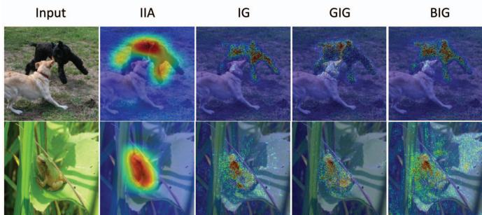
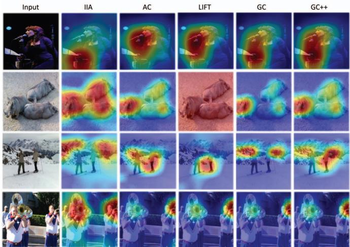
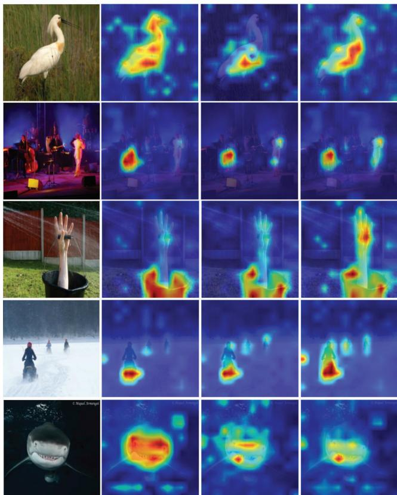
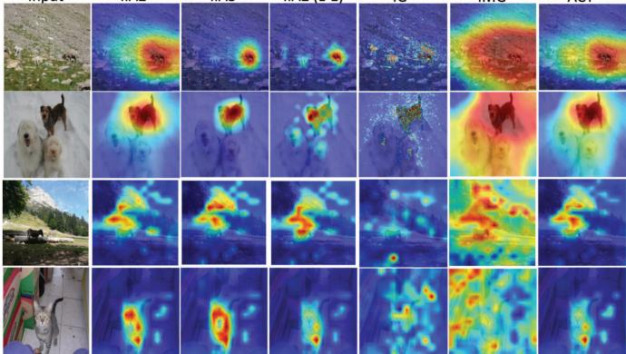

# Visual Explanations via Iterated Integrated Attributions

Oren Barkan\*1

Yehonatan Elisha∗1

Yuval Asher2

Amit Eshel2

Noam Koenigstein2

1The Open University

2Tel Aviv University

https://github com/iia-iccv23/iia

## Abstract

We introduce Iterated Integrated Attributions (IIA) - a generic method for explaining the predictions of vision models. IIA employs iterative integration across the input image, the internal representations generated by the model, and their gradients, yielding precise and focused explana tion maps. We demonstrate the effectiveness of IIA through comprehensive evaluations across various tasks, datasets, and network architectures. Our results showcase that IIA produces accurate explanation maps, outperforming other state-of-the-art explanation techniques.

## 1. Introduction

The emergence of deep learning has ushered in significant breakthroughs within the realm of artificial intelligence, particularly in computer vision. Advanced deep Convolutional Neural Networks (CNNs) architectures [50, 30, 32, 41], and recent Vision Transformer (ViT) models [20, 28] have demonstrated state-of-the-art performance in image classification [37, 50], object detection [29, 17, 10], and semantic segmentation [17, 4] tasks. Yet, many deep learning models lack interpretability, making it difficult to explain the reasoning behind their predictions. As a result, Explainable AI (XAI) has become a prominent research area in computer vision, and numerous methods have been proposed for explaining and interpreting the internal workings of different neural network architectures in various application domains [60, 49, 46, 15, 7, 44, 6, 8, 26].

Explanation methods attempt to produce an explanation map in the form of a heatmap (also known as relevance or saliency map) that attributes the prediction to the input by highlighting specific regions in the input image. Early gradient-based methods produced explanation maps based on the gradient of the prediction w.r.t. the input image [49, 50, 52]. Then, Grad-CAM [46] and the follow-up works by [12, 33, 5] proposed to compute the explanation maps based on the internal activation maps (also known as Class Activation Maps (CAM)) and their corresponding gradients. In parallel, path integration methods such as Integrated Gradients (IG) [54] proposed to produce an explanation map by accumulating the gradients of the linear interpolations between the input and reference images. The aforementioned techniques were formulated and evaluated on CNNs. Following the advent of Transformer-based architectures [55], a variety of approaches has also been proposed for interpreting Vision Transformer (ViT) models [15, 56, 14].

This paper presents Iterated Integrated Attributions (IIA) - a universal technique for explaining vision models, applicable to both CNN and ViT architectures. IIA employs iterative integration across the input image, the internal representations generated by the model, and their gradients. Thereby, IIA leverages information from the activation (or attention) maps created by all network layers, including those from the input image. We present comprehensive objective and subjective evaluations that demonstrate the effectiveness of IIA in generating faithful explanations for both CNN and ViT models. Our results show that IIA outperforms current stateof-the-art methods on various explanation and segmentation tests across all datasets, model architectures, and metrics.

## 2. Related Work

Explaining CNNs Explanation methods for CNNs have been studied extensively. Saliency-based methods [16, 49, 43, 62, 60, 61] and activation-based methods [21] use the feature-maps obtained by forward propagation in order to interpret the output prediction. Perturbation-based methods [23, 24] measures the output’s sensitivity w.r.t. the input using random perturbations applied in the input space. Gradient methods produce explanation maps based on the gradient itself or via a function that combines the activation maps with their gradients [48, 53]. A prominent example is the Grad-CAM (GC) [46] method that uses the pooled gradients and the activation maps to produce explanation maps. GC attracted much attention from the XAI community with several follow-up works [12, 25, 33, 5]. Another relevant line of work is path integration methods. Integrated Gradients (IG) [54] integrates over the interpolated image gradients. Blur IG (BIG) [59] is concerned with the introduction of information using a baseline and opts to use a path that progressively removes Gaussian blur from the attributed image. Guided IG (GIG) [36] improves upon IG by introducing the idea of an adaptive path method. By calculating the integration along a different path, high gradient areas are avoided which often leads to an overall reduction in irrelevant attributions. Differing from IG, GIG, and BIG, IIA employs iterated integration, enabling interpolation of the complete set of activation (attention) maps across all network layers. Moreover, IIA does not limit the integrand to plain gradients but accommodates any arbitrary function involving the activation (attention) maps and their gradients.. Gradient-free methods produce explanation maps via manipulation over the activation maps without relying on gradient information [57, 19]. For instance, LIFT-CAM employs the DeepLIFT [47] technique to estimate the activation maps SHAP values [42], which are then combined with the activation maps to produce the explanation map. However, since these methods do not consider gradient information, their ability to effectively guide explanations towards the predicted class is limited.

Explaining ViTs Initial attempts to interpret Transformers utilized the inherent attention scores of ViT models to gain insights into input processing [55, 11]. However, the challenge lay in effectively combining scores from different layers. Simple averaging of attention scores for each token, for instance, often resulted in signal blurring [1, 15]. Abnar and Zuidema introduced the Rollout method, which computes attention scores for input tokens at each layer by considering raw attention scores within a layer as well as those from preceding layers [1]. Rollout showed improvements over the use of a single attention layer, but its reliance on simplistic aggregation assumptions often led to highlighting irrelevant tokens. LRP [3], proposed to propagate gradients from the output layer to the beginning, considering all the components in the transformer’s layers beyond the attention layers. Chefer et al. [15] presented Transformer Attribution (T-Attr), a class-specific Deep Taylor Decomposition method in which relevance propagation is applied for positive and negative attributions. More recently, the authors introduced Generic Attention Explainability (GAE) [14], a generalization of T-Attr for explaining Bi-Modal transformers. Both T-Attr and GAE are considered state-of-the-art methods for explaining ViT models and have been shown to outperform multiple strong baselines such as LRP, partial LRP [56], ViT-GC [15], and Rollout [1]. IIA distinguishes itself from the aforementioned approaches in three key ways: Firstly, IIA introduces and utilizes the Gradient Rollout (GR)

\- a variant of Rollout that combines attention matrices with their gradients. Secondly, IIA employs GR as the integrand in its iterative integration process, conducting integration across interpolated attention matrices. Lastly, IIA stands out as a universal method, capable of generating explanations for both CNNs and ViTs.

## 3. Iterated Integrated Attributions

We start by describing the problem setup. Then, we briefly overview IG [54] and continue to describe IIA in detail.

## 3.1. Problem Setup

Let $\textbf { x } \in$ Rc0×p0×q0 be an input image. We define a generic neural network model with L intermediate layers, each is a function $h ^ { l } \ ( 1 \ \leq \ l \ \leq \ L )$ that outputs $\mathbf { x } ^ { l } : = h ^ { l } ( \mathbf { x } ^ { l - 1 } )$ , with $\mathbf { x } ^ { 0 } : = \mathbf { x }$ . The final layer is a classification head $f$ that produces the prediction $f ( \mathbf { x } ^ { L } )$ , and the score for the class y is given by $f _ { y } ( \mathbf { x } ^ { L } )$ . Additionally, we define the application of the neural network to the input x by

$$
\phi ( \mathbf { x } ) = f ( \mathbf { x } ^ { L } ) .\tag{1}
$$

For example, if φ is a ResNet (ViT) model, each $h ^ { l }$ would be implemented as a residual convolutional (transformer encoder) block. Our goal is to generate an explanation map m $\in \mathbb { R } ^ { p _ { 0 } \times q _ { 0 } }$ that quantifies the attribution of each element in x to the prediction $\phi ( \mathbf { x } )$ . The attribution can be computed w.r.t. $\phi _ { y } ( \mathbf { x } )$ - the score assigned to the class y. Typically, the class of interest y is either set to the target (ground-truth) class or to the predicted class, which is the class receiving the highest score in $\phi ( \mathbf { x } )$

## 3.2. IG

In what follows, we quickly overview IG [54], which is a special case of IIA. Given the input x and a reference $\mathbf { r } \in \mathbb { R } ^ { c _ { 0 } \times p _ { 0 } \times q _ { 0 } }$ (that is designed to represent missing information, hence usually set to the zero image), we define a linear interpolant by

$$
\mathbf { v } = \mathbf { r } + a ( \mathbf { x } - \mathbf { r } ) ,\tag{2}
$$

with $a \in [ 0 , 1 ]$ . IG produces an explanation map by integrating gradients along the linear path between r and x as follows:

$$
\mathbf { m } _ { I G } = \int _ { 0 } ^ { 1 } \frac { \partial \phi _ { y } ( \mathbf { v } ) } { \partial \mathbf { v } } \circ \frac { \partial \mathbf { v } } { \partial a } d a = ( \mathbf { x } - \mathbf { r } ) \circ \int _ { 0 } ^ { 1 } \frac { \partial \phi _ { y } ( \mathbf { v } ) } { \partial \mathbf { v } } d a ,\tag{3}
$$

where ◦ stands for the Hadamard (elementwise) product. In practice, the integral in Eq. 3 is numerically approximated as follows:

$$
\mathbf { m } _ { I G } \approx \frac { \mathbf { x } - \mathbf { r } } { n } \circ \sum _ { k = 1 } ^ { n } \frac { \partial \phi _ { y } ( \mathbf { v } ) } { \partial \mathbf { v } } ,\tag{4}
$$

by setting $\textstyle a = { \frac { k } { n } }$ in Eq. 2. The approximation in Eq. 4 simply sums the gradients of n interpolants on the linear path from r to x. Finally, since $\mathbf { m } _ { I G }$ is in $\mathbb { R } ^ { c _ { 0 } \times p _ { 0 } \times q _ { 0 } }$ (typically, $c _ { 0 } = 3$ since x is a RGB image), mean reduction along the channel axis is performed to obtain a 2D explanation map.

## 3.3. IIA - A Generic Formulation

IIA diverges from IG in several aspects: First, IIA does not confine gradient computation to the input x. In fact, recent studies have suggested that gradients derived from internal activation maps can yield improved explanation maps [46, 12, 25]. Secondly, IIA employs an iterated integral across multiple intermediate representations (such as activation or attention maps) generated during the network’s forward pass. This enables the iterative accumulation of gradients w.r.t. the representations of interest. Lastly, unlike IG, IIA does not restrict the integrand to plain gradients, but encompasses a function of the entire set of representations produced by the network and their gradients. In this section, we assume a generic neural network model. In Sec. 3.4, we describe the utilization of IIA for CNN and ViT models.

As outlined above, IIA utilizes linear interpolations on the intermediate representations generated during the forward propagation of the input through the layers of the model. In order to incorporate interpolation, we modify the computation in the l-th layer to accommodate an interpolation to the intermediate representation of interest (produced as part of the computational pipeline of $h ^ { l } )$ . To facilitate the formulation of the IIA approach, we introduce a set of notations: First, the input to the l-th layer undergoes processing by a function $u ^ { l }$ to obtain the intermediate representation of interest, denoted as $\mathbf { u } ^ { l }$ . Subsequently, an interpolation step is (optionally) performed to derive the interpolant $\mathbf { v } ^ { l }$ (interpolated version of $\mathbf { u } ^ { l } )$ . Finally, the interpolant $\mathbf { v } ^ { l }$ is processed by a function $v ^ { l }$ that completes the original computational pipeline, yielding the input to the subsequent layer in the model. This entire process can be expressed mathematically using the following equations:

$$
\begin{array} { r } { \mathbf { h } ^ { l } = v ^ { l } ( \mathbf { v } ^ { l } ) , } \end{array}\tag{5}
$$

with

$$
\mathbf { v } ^ { l } = \mathbf { r } ^ { l } + ( a _ { l } ) ^ { b _ { l } } ( \mathbf { u } ^ { l } - \mathbf { r } ^ { l } ) ,\tag{6}
$$

and

$$
\mathbf { u } ^ { l } = u ^ { l } ( \mathbf { h } ^ { l - 1 } ) .\tag{7}
$$

The rationale behind Eqs. 5-7 is as follows: $u ^ { l }$ is a function that computes the intermediate representation of interest $\mathbf { u } ^ { l }$ (the representation that is to be interpolated) based on the input to the l-th layer $\mathbf { h } ^ { l - 1 }$ $\mathbf { u } ^ { l }$ is further subtracted by a corresponding reference1 representation $\mathbf r ^ { l } = \mathrm { m i n } ( \mathbf u ^ { l } )$

which is the minimum value in each channel of $\mathbf { u } ^ { l }$ that is subsequently broadcast to a tensor with the same dimensions as $\mathbf { u } ^ { l } .$ . Additionally, in Eq. $6 , b _ { l }$ is an indicator parameter that determines whether the interpolation is effectively applied to $\mathbf { u } ^ { l }$ during the propagation via the l-th layer in the model $( b _ { l } = 1 )$ or not $( b _ { l } = 0 )$ , and $a _ { l } \in [ 0 , 1 ]$ controls the interpolation step, hence playing a similar role as a from Eq. 3, resulting in the interpolant $\mathbf { v } ^ { l }$ . Finally, $v ^ { l }$ is a function that receives the (interpolated) intermediate representation $\mathbf { v } ^ { l }$ and completes the required computation for producing the expected output from the l-th layer. Hence, the dimensions of $\mathbf { h } ^ { l }$ must match those of $h ^ { l } ( \mathbf { x } ^ { l - 1 } )$ ). Moreover, if $b _ { j } = 0$ for all $j \leq l , u ^ { l } = h ^ { l }$ and $v ^ { l }$ is the identity mapping, then $\mathbf { h } ^ { l }$ and $h ^ { l } ( { \bf x } ^ { l - 1 } )$ are identical. Note that the implementation of $u ^ { l }$ $v ^ { l }$ , and the choice of representations to be interpolated all vary based on the model’s architecture (as will be detailed in Sec. 3.4).

We further define ${ \bf b } = [ b _ { 0 } , . . . , b _ { L } ] \in \{ 0 , 1 \} ^ { L + 1 } , { \bf h } ^ { - 1 } =$ $\mathbf { x } ,$ and set $u ^ { 0 }$ and $v ^ { 0 }$ to the identity mapping. Therefore, we have

$$
\mathbf { u } ^ { 0 } = \mathbf { x } { \mathrm { ~ a n d ~ } } \mathbf { h } ^ { 0 } = \mathbf { v } ^ { 0 } .\tag{8}
$$

Finally, the IIA explanation map is defined as follows:

$$
{ \bf m } _ { \bf b } ^ { l } = \int _ { 0 } ^ { 1 } \int _ { 0 } ^ { 1 } \dots ( { \bf u } ^ { l } - { \bf r } ^ { l } ) \circ \int _ { 0 } ^ { 1 } { \bf q } ^ { l } d a _ { l } \dots d a _ { 0 } ,\tag{9}
$$

where the integrand ${ \bf q } ^ { l }$ is a function of the first l intermediate representations produced by the model (including the input representation) and their gradients.

It is worth exploring the versatility of Eq. 9: ${ \bf q } ^ { l }$ determines the integrand that is a function of the participating representations and their gradients from the first l layers in the model. b determines which of the representations produced by the first l layers are effectively interpolated: if $b _ { j } = 1 ( 0 \leq j \leq l )$ , then the integration is effectively applied w.r.t. the variable $a _ { j }$ , otherwise $b _ { j } = 0$ and both Eqs. 6 and 9 become agnostic to $\boldsymbol { a } _ { j } .$ . For example, one can observe that by setting $\mathbf { \bar { b } } _ { 0 } = [ 1 , 0 . . . , 0 ] , l = 0 , \bar { u } ^ { l } = h ^ { l }$ (for $\begin{array} { r } { l > 0 ) , \mathbf { q } ^ { l } = \frac { \partial f _ { y } ( \mathbf { h } ^ { L } ) } { \partial \mathbf { v } ^ { l } } } \end{array}$ , and $v ^ { l }$ to the identity mapping, Eq. 9 (IIA) degenerates to Eq. 3 (IG) as follows:

$$
{ \bf m } _ { { \bf b } _ { 0 } } ^ { 0 } = ( { \bf u } ^ { 0 } - { \bf r } ^ { 0 } ) \circ \int _ { 0 } ^ { 1 } \frac { \partial f _ { y } ( { \bf h } ^ { L } ) } { \partial { \bf v } ^ { 0 } } d a _ { 0 }
$$

$$
= ( \mathbf { x } - \mathbf { r } ^ { 0 } ) \circ \int _ { 0 } ^ { 1 } \frac { \partial \phi _ { y } ( \mathbf { v } ^ { 0 } ) } { \partial \mathbf { v } ^ { 0 } } d a _ { 0 } .
$$

The first equality follows from Eq. 9, and the second is due to Eqs. 1 and 8. Finally, by dropping the zero index, we receive Eq. 3.

IIA (Eq. 9) provides the freedom to run over multiple interpolated representations (including the input) in an iterative manner. Once l is set, the integrand ${ \bf q } ^ { l }$ changes based on the interpolated representations $\mathbf { h } ^ { j } \left( j \leq l \right)$ in the preceding layers that participate in the interpolation process, where participation is determined by the indicator vector b. For example, if we set $l = L$ and $\mathbf { b } = [ 1 , 1 , \ldots , 1 ]$ $\mathbf { m } _ { b } ^ { L }$ will be the outcome of a $L$ iterated integrals over $\mathbf { q } ^ { L }$ . Thus, in computing $\mathbf { m } _ { b } ^ { L }$ , all the intermediate representations within the network (including the input) are iteratively interpolated.

In practice, $\mathbf { m } _ { b } ^ { l }$ is numerically approximated using:

$$
\begin{array} { c } { { { \displaystyle { \bf m } _ { \bf b } ^ { l } \approx \frac { 1 } { n } \sum _ { k _ { 0 } = 1 } ^ { n } \frac { 1 } { n } \sum _ { k _ { 1 } = 1 } ^ { n } \cdot \cdot \cdot \cdot \frac { 1 } { n } ( { \bf u } ^ { l } - { \bf r } ^ { l } ) \circ \sum _ { k _ { l } = 1 } ^ { n } { \bf q } ^ { l } } } } \\ { { = \displaystyle { \frac { 1 } { n ^ { \beta } } \sum _ { k _ { 0 } = 1 } ^ { n ^ { b _ { 0 } } } \sum _ { k _ { 1 } = 1 } ^ { n ^ { b _ { 1 } } } \cdot \cdot \cdot \cdot ( { \bf u } ^ { l } - { \bf r } ^ { l } ) \circ \sum _ { k _ { l } = 1 } ^ { n ^ { b _ { l } } } { \bf q } ^ { l } } , } } \end{array}\tag{10}
$$

$\begin{array} { r } { \beta = \sum _ { i = 0 } ^ { l } b _ { i } } \end{array}$ , and $\begin{array} { r } { a _ { j } = \frac { k _ { j } } { n } \left( \mathrm { E q . ~ } 6 \right) } \end{array}$ . Again, Eq. 10 degenerates to Eq. 4 for $\mathbf { b } _ { 0 } = [ 1 , 0 . . . , 0 ]$ and $l = 0$ . Note that if ${ \bf q } ^ { l }$ is not a 2D tensor, a subsequent mean reduction step is required to obtain a 2D explanation map (followed by a resize operation to align with the spatial dimensions of the input $\mathbf { x } ,$ if needed).

## 3.4. IIA Implementation

CNN Models In CNNs, $\phi$ follows a CNN architecture (e.g., ResNet [31]). In this case, all $h ^ { l }$ are residual convolutional blocks producing 3D tensors, i.e., activation maps. In our implementation, we choose to apply the interpolation on the activation maps, hence we set all $\hat { v ^ { l } }$ to the identity mapping, $u ^ { l } = h ^ { l }$ , and the min reduction operation in the computation of $\mathbf { r } ^ { l }$ is applied channel-wise (followed by broadcasting). Additionally, we set the integrand $\mathbf { q } ^ { l } = \mathbf { v } ^ { l } \circ \frac { \partial f ( \mathbf { h } ^ { L } ) } { \partial \mathbf { v } ^ { l } }$ The motivation for this choice is as follows: $\mathbf { v } ^ { l }$ is the (interpolated) activation map that highlights regions where filters are activated, facilitating pattern detection. Its gradient quantifies the attribution level of the particular class of interest to each element in the activation map. Thus, we anticipate that areas where both the gradient and activation exhibit substantial magnitude with a consistent sign will yield effective explanations. This characteristic is achieved through the Hadamard product between $\mathbf { v } ^ { l }$ and its gradient. Finally, we apply a mean reduction to the channel axis, followed by a resize operation to obtain a 2D explanation map.

ViT Models In the case of ViT [20], the input x is a 2D tensor corresponding to a sequence of tokens (vectors), where the first token is the [CLS] token, and the rest represent patches from the input image. In our implementation, we opted to interpolate the attention matrices. To this end, we set $u ^ { l }$ to the attention function which involves the softmax operation on the scaled dot-product between the query and key representations across multiple attention heads. Assuming there are $p$ attention heads, for each head, we perform interpolation on the attention matrix. In this process, the reference $\mathbf { r } ^ { l }$ is assigned as the zero tensor since all entries in the attention matrices are positive due to the softmax operation. Accordingly, $v ^ { l }$ continues the self-attention computation by multiplying the interpolated attention matrices with the value representations for each head. This is followed by the necessary computational steps that generate a new set of token representations for the subsequent transformer encoder layer [20]. Finally, we propose setting the integrand ${ \bf q } ^ { l }$ to the Gradient Rollout (GR) - a variant of the Attention Rollout (AR) method [1]. Similarly to AR, GR amalgamates information from the [CLS] attention across all attention heads in the model. However, with a notable distinction, each (interpolated) attention matrix is substituted by the Hadamard product of the attention matrix and its corresponding gradient. The exact implementation of GR is detailed in our git repository. Given that the output of GR is already in the form of a 2D tensor, only a subsequent resize operation is necessary to achieve an explanation map that corresponds to the spatial dimensions of the input image. Finally, it is noteworthy that our experimentation indicates that replacing the matrix product operation with the matrix sum (as part of the GR computation) leads to comparable performance.

Due to the large combinatorial space $( 2 ^ { L }$ possible combinations for b), and the fact we evaluate on large models, in this work, we consider double and triple integration in our complete experiments.

For double integration (IIA2), we set $l = L ,$ and $\mathbf { b } =$ $[ 1 , 0 , 0 , . . . , 0 , 0 , 1 ]$ , in Eq. $1 0 , \mathrm { i . e . , } b _ { 0 } = 1$ and $b _ { L } = 1$ , and the rest $b _ { l } = 0 ( 1 < l < L )$ . This means IIA effectively interpolates over the input image and the activation (attention) maps from the last layer in the CNN (ViT) model. Interpolating on the input image, enables us to examine various interpolations of the image and study the significance of pixel features along the integration path. Moreover, integrating on the last layer allows us to explore the importance of the aggregated information from the different layers of the network, as it combines all the network’s features.

For triple integration (IIA3), we further interpolate on the penultimate layer $L - 1 , \mathrm { i . e . , } b _ { 0 } = 1 , b _ { L - 1 } = 1 , b _ { L } = 1$ , and the rest $b _ { l } = 0 ( 1 < l < L )$ . This is motivated by the fact that the penultimate layer captures more comprehensive objects and features, as it is closer to the classification head. By including a broader aggregation of features, it assists in predicting specific classes. In contrast, earlier layers primarily focus on detecting low-level features such as edges.

Finally, for both IIA2 and IIA3, we set $n = 1 0$ and $l = L$ in Eq. 10, i.e., 10 interpolation steps for each selected layer, and the integrand is computed w.r.t. the last layer.

## 3.5. Computational Complexity

The computational complexity of IIA is determined by the order of the iterated integral being computed. We utilized the approximation from Eq. 10, which is based on nested sums (each comprising n terms). Each term necessitates the application of ${ \bf q } ^ { l }$ , whose computational complexity varies based on the specific implementation. For instance, in Sec. $3 . 4 , \mathbf { q } ^ { l }$ combines both activation (attention) maps and their gradients, leading to computations involving both forward and backward passes. Therefore, if the computational complexity of ${ \bf q } ^ { l }$ is $\mathcal { O } ( Q )$ , the overall computational complexity of Eq. 10 is $\mathcal { O } ( n ^ { \beta } Q )$ . Yet, the com plexity induced by $n ^ { \bar { \beta } }$ can be significantly reduced through the utilization of batch processing via GPUs. For exam ple, in IIA2 (iterated integration on the input and the last layer), performing n interpolations on the input in a batch is straightforward. Next, we can extend this process to internal layers: creating batches for all interpolations of each activation map, concatenating these batches into a single batch, propagating it from the last layer to the prediction head, and computing gradients of f w.r.t. the activation maps. Formally, the runtime complexity of IIA can be expressed as $\begin{array} { r } { R ( I I A _ { M } ) = ( \sum _ { m = 1 } ^ { M } \frac { n ^ { m } } { B } c _ { i _ { m - 1 } , i _ { m } } ) + \frac { n ^ { M } } { B } c _ { i _ { M } , K } , } \end{array}$ where $c _ { i , j }$ denotes the cost of propagating the data from layer i to layer $j$ (or backpropagating from j to i), K denotes the index of the prediction layer $f ,$ n indicates the number of interpolation steps, B is the maximal batch size that can be accommodated by the GPU, and M is the number of layers where interpolation is effectively applied (e.g., in IIA2, $M = 2 )$ . Note that the first and second terms in $R ( I I A _ { M } )$ are the costs of the forward and backward passes, respectively. Assuming a GPU with $B \geq n ^ { M }$ , it follows that $\begin{array} { r } { \frac { n ^ { m } } { B } \doteq \mathcal { O } ( 1 ) } \end{array}$ for all $1 \ \leq \ m \ \leq \ M$ , resulting in the cost of $I I A _ { M }$ being bounded by a single forward-backward pass. For example, for IIA2 and IIA3 with $n = 1 0 .$ , having $B = 1 0 0$ and $B = 1 0 0 0$ , respectively, is adequate to achieve $\frac { n ^ { M } } { B } = \mathcal { O } ( 1 )$ , which should be manageable with a high performance GPU. In these scenarios, the runtimes of GC, IG, and IIA are comparable. Theoretically, if $B \geq n ^ { M }$ IIA can become faster than IG, since in IG the gradients are backpropagated through the entire network back to the input, while in IIA2 gradients are backpropagated to the layer iM (usually one of the penultimate layers). Lastly, distributing IIA computations across multiple machines can yield further speed-up.

## 4. Experimental Setup and Results

Our evaluation include five models: ViT-Base (ViT-B), ViT-Small (ViT-S) [20], ResNet101 (RN) [30], DenseNet201 (DN) [32], and ConvNext-Base (CN) [41]. Preprocessing details and links to all models are provided in our GitHub repository.

Evaluation Tasks and Metrics We present an extensive evaluation of both explanation and segmentation tasks. It is worth noting that having superior segmentation accuracy does not necessarily equate to having superior explanatory proficiency. Nevertheless, we conduct segmentation tests to ensure comprehensive comparison with previous works [15, 14, 33, 58]. The explanation metrics include Area Under the Curves (AUCs) of Positive (POS) and Negative (NEG) perturbations tests [15], AUC of the Insertion (INS) and Deletion (DEL) tests [45], AUC of the Softmax Information Curve (SIC) and Accuracy Information Curve (AIC) [35], Average Drop Percentage (ADP), and Percentage Increase in Confidence (PIC) [12]. For POS, DEL, and ADP the lower the better, while for NEG, INS, SIC, AIC, and PIC the higher the better. The segmentation metrics include Pixel Accuracy (PA), mean-intersection-over-union (mIoU), mean-averageprecision (mAP), and the mean-F1 score (mF1) [15]. A detailed description of the metrics is provided in Appendix A. Finally, in Appendix C, we provide extensive evaluation on sanity tests [2] that further validate IIA as a machinery for generating faithful explanation maps.

Datasets Explanation maps are produced for the ImageNet [18] ILSVRC 2012 (IN) validation set, consisting of 50K images from 1000 classes. We follow the same setup from [15], where for each image, an explanation map is produced twice: (1) w.r.t. the ground-truth class (Target) and (2) w.r.t. the class predicted by the model (Predicted), i.e., the class that received the highest score. Accordingly, results are reported for both the predicted and target classes. Segmentation tests are conducted on three datasets: (1) ImageNet-Segmentation [27] (IN-Seg): This is a subset of ImageNet validation set consisting of 4,276 images from 445 classes for which annotated segmentations are available. (2) Microsoft Common Objects in COntext 2017 [39] (COCO): This is a validation set that contains 5,000 annotated segmentation images from 80 different classes. Some images consist of multi-label annotations (multiple annotated objects). In our evaluation, all annotated objects in the image are considered as the ground-truth. (3) PASCAL Visual Object Classes 2012 [22] (VOC): A validation set that contains annotated segmentations for 1,449 images from 20 classes.

Evaluated Methods and Hyperparameter Setting The following explanation methods for CNN models are evaluated as baselines: (1) Grad-CAM (GC) [46]. (2) Grad-CAM++ (GC++) [12]. (3) FullGrad (FG) [53]. (4) Ablation-CAM (AC) [19]. (5) Layer-CAM (LC) [33]. (6) LIFT-CAM (LIFT) [34], a state-of-the-art method that was shown to outperform other strong baselines like ScoreCAM [57]. (7) Integrated Gradients (IG) [54]. (8) Guided IG (GIG) [36]. (9) Blur IG (BIG) [59]. (10) X-Grad-CAM (XGC) [25]. For ViT models, we considered the following two methods: (11) Transformer Attribution (T-Attr) [15], a state-of-theart method that was shown to outperform a variety of other strong baselines such as LRP [9], partial LRP [56], Raw-Attention [14], GC [14] for transformers, and Rollout. (12)

  
Figure 1. Explanation maps produced for IIA (IIA3) and three path integral baselines using CN w.r.t. the ‘Kerry blue terrier’ (top) and ’tailed frog, bell toad, ribbed toad, tailed toad, Ascaphus trui (bottom) classes.

Generic Attention Explainability (GAE) [14] - This is another state-of-the-art method that was shown to outperform T-Attr on several metrics. When applied, hyperparameters for all methods were configured according to the recommended configuration by the authors. (13) Our generic IIA method is evaluated on both CNN and ViT models. A detailed description of the baselines is provided in Appendix B.

## 4.1. Results

Explanation Tests Tables 1 and 2 present explanation tests for CNN and ViT models, respectively. The results encompass all combinations of datasets, models, explanation methods, explanation metrics, and settings (target and predicted). Notably, IIA consistently outperforms all baselines across all metrics and architectures. Among the IIA variants, IIA3 surpasses IIA2 for both ViTs (Tab. 2) and CNNs (Tab. 1, holding true for the vast majority of model-metric combinations). This trend underscores the advantage of triple integration, which incorporates information from layer L − 1. In CNNs, GC and GC++ are the runner up, utilizing both activation and gradients, and outperforming other methods across most metrics. Furthermore, path integration methods (IG, BIG, and GIG) exhibit competitive results on POS and DEL metrics but demonstrate weaker performance on other metrics. This divergence could be attributed to the granular output maps generated by integration-based methods, as depicted in Fig. 1. These methods focus solely on integration within the input space, ignoring activations, and thus might overlook key features. Notably, achieving high performance on POS and poor performance on NEG metrics reinforces this observation. As path integration methods yield sparse maps that may impact performance in certain metrics, we also report results for the SIC and AIC metrics [35], employed in the evaluation of GIG[36] and BIG[59]. However, the inclusion of SIC and AIC metrics does not alter the observed trends in the results. This finding emphasizes that IIA is exceptionally effective in generating high-quality explanation maps.

Segmentation Tests Tables 3 and 4 present segmentation tests results on CNN and ViT models, respectively. The results are reported for all combinations of datasets, models, explanation methods, and segmentation metrics. For these experiments, we exclusively consider the top 5 performing CNN explanation methods from Tab. 1. Once again, it is evident that IIA is the best performer, yielding the most accurate segmentation results for both CNN and ViT models.

  
Figure 2. Qualitative Results: Explanation maps produced using ConvNext w.r.t. the classes (top to bottom): ‘accordion, piano accordion, squeeze box’, ‘warthog’, ‘alp’, and ‘trombone’.

Qualitative Evaluation Figures 2 and 3 present a qualitative comparison of the explanation maps obtained by the top-performing CNN explanation methods and ViT explanation methods, respectively. These examples are randomly selected from multiple classes within the IN dataset. Arguably, IIA (IIA3) produces the most accurate explanation maps in terms of class discrimination and localization. These results align well with the trends observed in Tabs. 1-4. For example, in Fig. 2, IA distinguishes itself by capturing multiple objects related to the target class, setting it apart from the other methods. We further observe that in the case of class ‘accordion, piano accordion, and squeeze box’, IIA focuses mostly on the correct item, while the gradient-free methods like AC and LIFT focus mostly on different parts of the image, showcasing their class-agnostic behavior. Interestingly, in the second row, LIFT generates a flat explanation map, a phenomenon warranting further investigation in future research. Additional qualitative results for both CNN and ViT models are provided in Appendix E.

## 4.2. Ablation Study

In this work, we employ IIA with double and triple in tegrals. In this section, we investigate the contribution and necessity of these choices. To this end, we consider three alternatives: (1) IMG - only the input image is interpolated, i.e., we set $b _ { 0 } = 1$ and $b _ { j } = 0$ for all $j > 0 .$ . (2) ACT - only the representation (activation or attention maps) produced by the L-th layer in the model is interpolated, i.e., we set $b _ { L } = 1$ and $b _ { j } = 0$ for all $j < L$ . Note that for both IMG and ACT, we set l = L in Eq. 10, i.e., the integrand is computed w.r.t. the L-th layer. (3) IIA2 (L-1) - performs double integral, but interpolates on the layer L − 1 instead of the last layer L (by setting $b _ { 0 } = 1 , b _ { L - 1 } = 1$ , and $b _ { j } = 0$ for all other layers).

<table><tr><td rowspan=1 colspan=5>GC   GC++ LIFT</td><td rowspan=1 colspan=3>AC   IG    GIG</td><td rowspan=1 colspan=3>BIG  FG   LC</td><td rowspan=1 colspan=3>XGC IIA2  IIA3</td></tr><tr><td rowspan=2 colspan=1>NEG</td><td rowspan=1 colspan=1>Predicted</td><td rowspan=1 colspan=9>56.41 55.20  55.39 54.98 45.66 43.97 42.25 54.81 53.52</td><td rowspan=1 colspan=1>53.46</td><td rowspan=1 colspan=2>56.29 56.63</td></tr><tr><td rowspan=1 colspan=1>Target</td><td rowspan=1 colspan=1>56.54</td><td rowspan=1 colspan=1>55.95</td><td rowspan=1 colspan=1>55.23</td><td rowspan=1 colspan=1>55.46</td><td rowspan=1 colspan=1>42.02</td><td rowspan=1 colspan=1>41.93</td><td rowspan=1 colspan=1>41.22</td><td rowspan=1 colspan=1>54.65</td><td rowspan=1 colspan=1>54.19</td><td rowspan=1 colspan=1>53.93</td><td rowspan=1 colspan=1>56.22</td><td rowspan=1 colspan=1>56.89</td></tr><tr><td rowspan=1 colspan=1>POS</td><td rowspan=1 colspan=1>Predicted</td><td rowspan=1 colspan=1>17.82</td><td rowspan=1 colspan=1>18.01</td><td rowspan=1 colspan=1>17.53</td><td rowspan=1 colspan=1>19.38</td><td rowspan=1 colspan=1>17.24</td><td rowspan=1 colspan=1>17.68</td><td rowspan=1 colspan=1>17.44</td><td rowspan=1 colspan=1>18.06</td><td rowspan=1 colspan=1>17.92</td><td rowspan=1 colspan=1>21.02</td><td rowspan=1 colspan=1>16.62</td><td rowspan=1 colspan=1>16.19</td></tr><tr><td rowspan=1 colspan=1></td><td rowspan=1 colspan=1>Target</td><td rowspan=1 colspan=1>17.65</td><td rowspan=1 colspan=1>18.12</td><td rowspan=1 colspan=1>17.48</td><td rowspan=1 colspan=1>19.73</td><td rowspan=1 colspan=1>16.93</td><td rowspan=1 colspan=1>17.48</td><td rowspan=1 colspan=1>17.26</td><td rowspan=1 colspan=1>17.89</td><td rowspan=1 colspan=1>17.79</td><td rowspan=1 colspan=1>20.61</td><td rowspan=1 colspan=1>16.69</td><td rowspan=1 colspan=1>15.78</td></tr><tr><td rowspan=1 colspan=1>INS</td><td rowspan=1 colspan=1>Predicted</td><td rowspan=1 colspan=1>48.14</td><td rowspan=1 colspan=1>47.56</td><td rowspan=1 colspan=1>45.39</td><td rowspan=1 colspan=1>47.85</td><td rowspan=1 colspan=1>39.87</td><td rowspan=1 colspan=1>37.92</td><td rowspan=1 colspan=1>36.04</td><td rowspan=1 colspan=1>42.68</td><td rowspan=1 colspan=1>46.11</td><td rowspan=1 colspan=1>43.26</td><td rowspan=1 colspan=1>48.01</td><td rowspan=1 colspan=1>49.12</td></tr><tr><td rowspan=1 colspan=1></td><td rowspan=1 colspan=1>Target</td><td rowspan=1 colspan=1>48.22</td><td rowspan=1 colspan=1>47.27</td><td rowspan=1 colspan=1>44.94</td><td rowspan=1 colspan=1>47.75</td><td rowspan=1 colspan=1>37.55</td><td rowspan=1 colspan=1>34.41</td><td rowspan=1 colspan=1>34.68</td><td rowspan=1 colspan=1>43.08</td><td rowspan=1 colspan=1>45.91</td><td rowspan=1 colspan=1>43.13</td><td rowspan=1 colspan=1>48.05</td><td rowspan=1 colspan=1>48.53</td></tr><tr><td rowspan=1 colspan=1>DEL</td><td rowspan=1 colspan=1>Predicted</td><td rowspan=1 colspan=1>13.97</td><td rowspan=1 colspan=1>14.17</td><td rowspan=1 colspan=1>15.32</td><td rowspan=1 colspan=1>14.23</td><td rowspan=1 colspan=1>13.49</td><td rowspan=1 colspan=1>14.18</td><td rowspan=1 colspan=1>13.95</td><td rowspan=1 colspan=1>14.64</td><td rowspan=1 colspan=1>14.31</td><td rowspan=1 colspan=1>14.98</td><td rowspan=1 colspan=1>13.18</td><td rowspan=1 colspan=1>12.74</td></tr><tr><td rowspan=2 colspan=1>RNADP</td><td rowspan=1 colspan=1>Target</td><td rowspan=1 colspan=1>13.63</td><td rowspan=1 colspan=1>13.94</td><td rowspan=1 colspan=1>15.48</td><td rowspan=1 colspan=1>15.05</td><td rowspan=1 colspan=1>13.46</td><td rowspan=1 colspan=1>14.31</td><td rowspan=1 colspan=1>14.26</td><td rowspan=1 colspan=1>14.98</td><td rowspan=1 colspan=1>13.71</td><td rowspan=1 colspan=1>14.72</td><td rowspan=1 colspan=1>12.82</td><td rowspan=1 colspan=1>12.16</td></tr><tr><td rowspan=1 colspan=1>Predicted</td><td rowspan=1 colspan=1>17.87</td><td rowspan=1 colspan=1>16.91</td><td rowspan=1 colspan=1>18.03</td><td rowspan=1 colspan=1>16.19</td><td rowspan=1 colspan=1>37.52</td><td rowspan=1 colspan=1>35.28</td><td rowspan=1 colspan=1>40.85</td><td rowspan=1 colspan=1>21.06</td><td rowspan=1 colspan=1>24.34</td><td rowspan=1 colspan=1>17.02</td><td rowspan=1 colspan=1>12.79</td><td rowspan=1 colspan=1>12.84</td></tr><tr><td rowspan=1 colspan=1></td><td rowspan=1 colspan=1>Target</td><td rowspan=1 colspan=1>17.83</td><td rowspan=1 colspan=1>15.97</td><td rowspan=1 colspan=1>17.36</td><td rowspan=1 colspan=1>15.30</td><td rowspan=1 colspan=1>36.51</td><td rowspan=1 colspan=1>36.00</td><td rowspan=1 colspan=1>41.98</td><td rowspan=1 colspan=1>20.29</td><td rowspan=1 colspan=1>23.78</td><td rowspan=1 colspan=1>16.39</td><td rowspan=1 colspan=1>12.31</td><td rowspan=1 colspan=1>12.40</td></tr><tr><td rowspan=1 colspan=1>PIC</td><td rowspan=1 colspan=1>Predicted</td><td rowspan=1 colspan=1>36.69</td><td rowspan=1 colspan=1>36.53</td><td rowspan=1 colspan=1>35.95</td><td rowspan=1 colspan=1>35.52</td><td rowspan=1 colspan=1>19.94</td><td rowspan=1 colspan=1>18.72</td><td rowspan=1 colspan=1>24.53</td><td rowspan=1 colspan=1>31.59</td><td rowspan=1 colspan=1>35.43</td><td rowspan=1 colspan=1>36.18</td><td rowspan=1 colspan=1>42.96</td><td rowspan=1 colspan=1>42.91</td></tr><tr><td rowspan=1 colspan=1></td><td rowspan=1 colspan=1>Target</td><td rowspan=1 colspan=1>37.84</td><td rowspan=1 colspan=1>38.37</td><td rowspan=1 colspan=1>37.64</td><td rowspan=1 colspan=1>37.31</td><td rowspan=1 colspan=1>21.43</td><td rowspan=1 colspan=1>15.81</td><td rowspan=1 colspan=1>23.94</td><td rowspan=1 colspan=1>33.18</td><td rowspan=1 colspan=1>35.64</td><td rowspan=1 colspan=1>37.54</td><td rowspan=1 colspan=1>45.21</td><td rowspan=1 colspan=1>45.06</td></tr><tr><td rowspan=1 colspan=1>SIC</td><td rowspan=1 colspan=1>Predicted</td><td rowspan=1 colspan=1>76.91</td><td rowspan=1 colspan=1>76.44</td><td rowspan=1 colspan=1>76.73</td><td rowspan=1 colspan=1>73.36</td><td rowspan=1 colspan=1>54.67</td><td rowspan=1 colspan=1>55.04</td><td rowspan=1 colspan=1>56.98</td><td rowspan=1 colspan=1>75.35</td><td rowspan=1 colspan=1>73.93</td><td rowspan=1 colspan=1>72.64</td><td rowspan=1 colspan=1>78.52</td><td rowspan=1 colspan=1>79.92</td></tr><tr><td rowspan=1 colspan=1></td><td rowspan=1 colspan=1>Target</td><td rowspan=1 colspan=1>76.87</td><td rowspan=1 colspan=1>76.62</td><td rowspan=1 colspan=1>76.81</td><td rowspan=1 colspan=1>73.55</td><td rowspan=1 colspan=1>51.54</td><td rowspan=1 colspan=1>54.87</td><td rowspan=1 colspan=1>55.23</td><td rowspan=1 colspan=1>75.39</td><td rowspan=1 colspan=1>73.71</td><td rowspan=1 colspan=1>72.71</td><td rowspan=1 colspan=1>78.13</td><td rowspan=1 colspan=1>79.94</td></tr><tr><td rowspan=1 colspan=1>AIC</td><td rowspan=1 colspan=1>Predicted</td><td rowspan=1 colspan=1>74.36</td><td rowspan=1 colspan=1>71.97</td><td rowspan=1 colspan=1>72.76</td><td rowspan=1 colspan=1>70.35</td><td rowspan=1 colspan=1>51.92</td><td rowspan=1 colspan=1>53.38</td><td rowspan=1 colspan=1>53.36</td><td rowspan=1 colspan=1>71.49</td><td rowspan=1 colspan=1>65.77</td><td rowspan=1 colspan=1>69.85</td><td rowspan=1 colspan=1>75.49</td><td rowspan=1 colspan=1>76.12</td></tr><tr><td rowspan=1 colspan=1></td><td rowspan=1 colspan=1>Target</td><td rowspan=1 colspan=1>72.49</td><td rowspan=1 colspan=1>71.42</td><td rowspan=1 colspan=1>73.45</td><td rowspan=1 colspan=1>70.48</td><td rowspan=1 colspan=1>52.71</td><td rowspan=1 colspan=1>52.54</td><td rowspan=1 colspan=1>54.24</td><td rowspan=1 colspan=1>71.38</td><td rowspan=1 colspan=1>66.18</td><td rowspan=1 colspan=1>70.24</td><td rowspan=1 colspan=1>75.88</td><td rowspan=1 colspan=1>76.59</td></tr><tr><td rowspan=1 colspan=1>NEG</td><td rowspan=1 colspan=1>Predicted</td><td rowspan=1 colspan=1>52.86</td><td rowspan=1 colspan=1>53.82</td><td rowspan=1 colspan=1>53.98</td><td rowspan=1 colspan=1>53.68</td><td rowspan=1 colspan=1>45.24</td><td rowspan=1 colspan=1>41.43</td><td rowspan=1 colspan=1>40.72</td><td rowspan=1 colspan=1>52.06</td><td rowspan=1 colspan=1>54.12</td><td rowspan=1 colspan=1>52.13</td><td rowspan=1 colspan=1>55.94</td><td rowspan=1 colspan=1>57.19</td></tr><tr><td rowspan=1 colspan=1></td><td rowspan=1 colspan=1>Target</td><td rowspan=1 colspan=1>53.02</td><td rowspan=1 colspan=1>53.05</td><td rowspan=1 colspan=1>53.24</td><td rowspan=1 colspan=1>53.27</td><td rowspan=1 colspan=1>44.56</td><td rowspan=1 colspan=1>42.12</td><td rowspan=1 colspan=1>40.03</td><td rowspan=1 colspan=1>52.65</td><td rowspan=1 colspan=1>53.21</td><td rowspan=1 colspan=1>52.91</td><td rowspan=1 colspan=1>56.61</td><td rowspan=1 colspan=1>57.34</td></tr><tr><td rowspan=1 colspan=1>POS</td><td rowspan=1 colspan=1>Predicted</td><td rowspan=1 colspan=1>17.52</td><td rowspan=1 colspan=1>17.85</td><td rowspan=1 colspan=1>18.23</td><td rowspan=1 colspan=1>18.19</td><td rowspan=1 colspan=1>17.42</td><td rowspan=1 colspan=1>18.03</td><td rowspan=1 colspan=1>18.14</td><td rowspan=1 colspan=1>18.26</td><td rowspan=1 colspan=1>17.58</td><td rowspan=1 colspan=1>20.83</td><td rowspan=1 colspan=1>15.67</td><td rowspan=1 colspan=1>15.28</td></tr><tr><td rowspan=1 colspan=1></td><td rowspan=1 colspan=1>Target</td><td rowspan=1 colspan=1>17.34</td><td rowspan=1 colspan=1>17.51</td><td rowspan=1 colspan=1>18.05</td><td rowspan=1 colspan=1>18.41</td><td rowspan=1 colspan=1>17.53</td><td rowspan=1 colspan=1>17.32</td><td rowspan=1 colspan=1>17.61</td><td rowspan=1 colspan=1>17.92</td><td rowspan=1 colspan=1>18.03</td><td rowspan=1 colspan=1>18.12</td><td rowspan=1 colspan=1>15.25</td><td rowspan=1 colspan=1>15.21</td></tr><tr><td rowspan=1 colspan=1>INS</td><td rowspan=1 colspan=1>Predicted</td><td rowspan=1 colspan=1>45.65</td><td rowspan=1 colspan=1>45.19</td><td rowspan=1 colspan=1>43.86</td><td rowspan=1 colspan=1>49.18</td><td rowspan=1 colspan=1>37.22</td><td rowspan=1 colspan=1>32.99</td><td rowspan=1 colspan=1>31.02</td><td rowspan=1 colspan=1>42.01</td><td rowspan=1 colspan=1>44.14</td><td rowspan=1 colspan=1>42.07</td><td rowspan=1 colspan=1>50.36</td><td rowspan=1 colspan=1>51.23</td></tr><tr><td rowspan=1 colspan=1></td><td rowspan=1 colspan=1>Target</td><td rowspan=1 colspan=1>46.21</td><td rowspan=1 colspan=1>45.27</td><td rowspan=1 colspan=1>43.94</td><td rowspan=1 colspan=1>49.75</td><td rowspan=1 colspan=1>36.83</td><td rowspan=1 colspan=1>33.58</td><td rowspan=1 colspan=1>33.92</td><td rowspan=1 colspan=1>42.08</td><td rowspan=1 colspan=1>44.91</td><td rowspan=1 colspan=1>42.14</td><td rowspan=1 colspan=1>50.91</td><td rowspan=1 colspan=1>51.45</td></tr><tr><td rowspan=1 colspan=1>DEL</td><td rowspan=1 colspan=1>Predicted</td><td rowspan=1 colspan=1>13.43</td><td rowspan=1 colspan=1>14.17</td><td rowspan=1 colspan=1>15.18</td><td rowspan=1 colspan=1>14.73</td><td rowspan=1 colspan=1>12.36</td><td rowspan=1 colspan=1>13.08</td><td rowspan=1 colspan=1>13.29</td><td rowspan=1 colspan=1>14.21</td><td rowspan=1 colspan=1>13.64</td><td rowspan=1 colspan=1>14.78</td><td rowspan=1 colspan=1>11.68</td><td rowspan=1 colspan=1>11.29</td></tr><tr><td rowspan=1 colspan=1>CN</td><td rowspan=1 colspan=1>Target</td><td rowspan=1 colspan=1>13.32</td><td rowspan=1 colspan=1>14.39</td><td rowspan=1 colspan=1>14.86</td><td rowspan=1 colspan=1>14.44</td><td rowspan=1 colspan=1>12.83</td><td rowspan=1 colspan=1>13.45</td><td rowspan=1 colspan=1>13.69</td><td rowspan=1 colspan=1>14.55</td><td rowspan=1 colspan=1>14.28</td><td rowspan=1 colspan=1>14.29</td><td rowspan=1 colspan=1>11.24</td><td rowspan=1 colspan=1>10.80</td></tr><tr><td rowspan=1 colspan=1>ADP</td><td rowspan=1 colspan=1>Predicted</td><td rowspan=1 colspan=1>22.46</td><td rowspan=1 colspan=1>22.35</td><td rowspan=1 colspan=1>29.13</td><td rowspan=1 colspan=1>24.38</td><td rowspan=1 colspan=1>36.98</td><td rowspan=1 colspan=1>35.79</td><td rowspan=1 colspan=1>41.73</td><td rowspan=1 colspan=1>30.75</td><td rowspan=1 colspan=1>37.62</td><td rowspan=1 colspan=1>25.68</td><td rowspan=1 colspan=1>16.73</td><td rowspan=1 colspan=1>16.47</td></tr><tr><td rowspan=1 colspan=1></td><td rowspan=1 colspan=1>Target</td><td rowspan=1 colspan=1>22.39</td><td rowspan=1 colspan=1>21.13</td><td rowspan=1 colspan=1>28.06</td><td rowspan=1 colspan=1>23.03</td><td rowspan=1 colspan=1>35.62</td><td rowspan=1 colspan=1>34.12</td><td rowspan=1 colspan=1>40.82</td><td rowspan=1 colspan=1>29.64</td><td rowspan=1 colspan=1>36.61</td><td rowspan=1 colspan=1>24.74</td><td rowspan=1 colspan=1>16.28</td><td rowspan=1 colspan=1>15.94</td></tr><tr><td rowspan=1 colspan=1>PIC</td><td rowspan=1 colspan=1>Predicted</td><td rowspan=1 colspan=1>23.16</td><td rowspan=1 colspan=1>24.42</td><td rowspan=1 colspan=1>22.34</td><td rowspan=1 colspan=1>24.59</td><td rowspan=1 colspan=1>17.65</td><td rowspan=1 colspan=1>13.12</td><td rowspan=1 colspan=1>20.69</td><td rowspan=1 colspan=1>22.13</td><td rowspan=1 colspan=1>22.17</td><td rowspan=1 colspan=1>23.26</td><td rowspan=1 colspan=1>27.11</td><td rowspan=1 colspan=1>27.44</td></tr><tr><td rowspan=1 colspan=1></td><td rowspan=1 colspan=1>Target</td><td rowspan=1 colspan=1>24.53</td><td rowspan=1 colspan=1>24.26</td><td rowspan=1 colspan=1>22.59</td><td rowspan=1 colspan=1>24.33</td><td rowspan=1 colspan=1>18.15</td><td rowspan=1 colspan=1>13.46</td><td rowspan=1 colspan=1>20.48</td><td rowspan=1 colspan=1>23.93</td><td rowspan=1 colspan=1>22.38</td><td rowspan=1 colspan=1>23.59</td><td rowspan=1 colspan=1>27.95</td><td rowspan=1 colspan=1>28.13</td></tr><tr><td rowspan=1 colspan=1>SIC</td><td rowspan=1 colspan=1>Predicted</td><td rowspan=1 colspan=1>65.93</td><td rowspan=1 colspan=1>67.94</td><td rowspan=1 colspan=1>54.75</td><td rowspan=1 colspan=1>63.95</td><td rowspan=1 colspan=1>53.36</td><td rowspan=1 colspan=1>58.35</td><td rowspan=1 colspan=1>57.27</td><td rowspan=1 colspan=1>62.84</td><td rowspan=1 colspan=1>69.11</td><td rowspan=1 colspan=1>59.12</td><td rowspan=1 colspan=1>69.63</td><td rowspan=1 colspan=1>70.46</td></tr><tr><td rowspan=1 colspan=1></td><td rowspan=1 colspan=1>Target</td><td rowspan=1 colspan=1>66.86</td><td rowspan=1 colspan=1>67.63</td><td rowspan=1 colspan=1>56.22</td><td rowspan=1 colspan=1>64.78</td><td rowspan=1 colspan=1>53.48</td><td rowspan=1 colspan=1>58.48</td><td rowspan=1 colspan=1>57.40</td><td rowspan=1 colspan=1>63.93</td><td rowspan=1 colspan=1>68.93</td><td rowspan=1 colspan=1>59.09</td><td rowspan=1 colspan=1>69.43</td><td rowspan=1 colspan=1>70.21</td></tr><tr><td rowspan=1 colspan=1>AIC</td><td rowspan=1 colspan=1>Predicted</td><td rowspan=1 colspan=1>75.64</td><td rowspan=1 colspan=1>75.52</td><td rowspan=1 colspan=1>57.06</td><td rowspan=1 colspan=1>71.53</td><td rowspan=1 colspan=1>51.68</td><td rowspan=1 colspan=1>55.82</td><td rowspan=1 colspan=1>53.82</td><td rowspan=1 colspan=1>67.15</td><td rowspan=1 colspan=1>75.41</td><td rowspan=1 colspan=1>62.38</td><td rowspan=1 colspan=1>77.89</td><td rowspan=1 colspan=1>78.75</td></tr><tr><td rowspan=1 colspan=1></td><td rowspan=1 colspan=1>Target</td><td rowspan=1 colspan=1>76.92</td><td rowspan=1 colspan=1>75.81</td><td rowspan=1 colspan=1>60.82</td><td rowspan=1 colspan=1>71.85</td><td rowspan=1 colspan=1>50.98</td><td rowspan=1 colspan=1>55.25</td><td rowspan=1 colspan=1>53.86</td><td rowspan=1 colspan=1>69.53</td><td rowspan=1 colspan=1>74.12</td><td rowspan=1 colspan=1>61.78</td><td rowspan=1 colspan=1>77.62</td><td rowspan=1 colspan=1>78.64</td></tr><tr><td rowspan=1 colspan=1>NEG</td><td rowspan=1 colspan=1>Predicted</td><td rowspan=1 colspan=1>57.40</td><td rowspan=1 colspan=1>57.16</td><td rowspan=1 colspan=1>58.01</td><td rowspan=1 colspan=1>56.63</td><td rowspan=1 colspan=1>40.74</td><td rowspan=1 colspan=1>37.31</td><td rowspan=1 colspan=1>36.67</td><td rowspan=1 colspan=1>56.79</td><td rowspan=1 colspan=1>56.96</td><td rowspan=1 colspan=1>55.74</td><td rowspan=1 colspan=1>57.32</td><td rowspan=1 colspan=1>58.01</td></tr><tr><td rowspan=1 colspan=1></td><td rowspan=1 colspan=1>Target</td><td rowspan=1 colspan=1>58.56</td><td rowspan=1 colspan=1>58.33</td><td rowspan=1 colspan=1>58.07</td><td rowspan=1 colspan=1>57.78</td><td rowspan=1 colspan=1>41.32</td><td rowspan=1 colspan=1>41.95</td><td rowspan=1 colspan=1>40.88</td><td rowspan=1 colspan=1>58.05</td><td rowspan=1 colspan=1>58.49</td><td rowspan=1 colspan=1>56.87</td><td rowspan=1 colspan=1>58.51</td><td rowspan=1 colspan=1>59.15</td></tr><tr><td rowspan=1 colspan=1>POS</td><td rowspan=1 colspan=1>Predicted</td><td rowspan=1 colspan=1>17.75</td><td rowspan=1 colspan=1>17.81</td><td rowspan=1 colspan=1>18.87</td><td rowspan=1 colspan=1>18.67</td><td rowspan=1 colspan=1>17.31</td><td rowspan=1 colspan=1>17.46</td><td rowspan=1 colspan=1>17.38</td><td rowspan=1 colspan=1>17.84</td><td rowspan=1 colspan=1>17.62</td><td rowspan=1 colspan=1>18.67</td><td rowspan=1 colspan=1>16.82</td><td rowspan=1 colspan=1>16.51</td></tr><tr><td rowspan=1 colspan=1></td><td rowspan=1 colspan=1>Target</td><td rowspan=1 colspan=1>17.52</td><td rowspan=1 colspan=1>17.78</td><td rowspan=1 colspan=1>17.79</td><td rowspan=1 colspan=1>19.69</td><td rowspan=1 colspan=1>17.00</td><td rowspan=1 colspan=1>17.41</td><td rowspan=1 colspan=1>17.34</td><td rowspan=1 colspan=1>17.46</td><td rowspan=1 colspan=1>16.92</td><td rowspan=1 colspan=1>18.57</td><td rowspan=1 colspan=1>16.63</td><td rowspan=1 colspan=1>16.01</td></tr><tr><td rowspan=1 colspan=1>INS</td><td rowspan=1 colspan=1>Predicted</td><td rowspan=1 colspan=1>51.09</td><td rowspan=1 colspan=1>50.89</td><td rowspan=1 colspan=1>50.63</td><td rowspan=1 colspan=1>50.41</td><td rowspan=1 colspan=1>37.58</td><td rowspan=1 colspan=1>33.31</td><td rowspan=1 colspan=1>31.32</td><td rowspan=1 colspan=1>50.44</td><td rowspan=1 colspan=1>50.60</td><td rowspan=1 colspan=1>49.62</td><td rowspan=1 colspan=1>50.98</td><td rowspan=1 colspan=1>51.86</td></tr><tr><td rowspan=1 colspan=1></td><td rowspan=1 colspan=1>Target</td><td rowspan=1 colspan=1>51.98</td><td rowspan=1 colspan=1>51.64</td><td rowspan=1 colspan=1>50.31</td><td rowspan=1 colspan=1>50.56</td><td rowspan=1 colspan=1>38.94</td><td rowspan=1 colspan=1>34.11</td><td rowspan=1 colspan=1>32.76</td><td rowspan=1 colspan=1>51.61</td><td rowspan=1 colspan=1>49.76</td><td rowspan=1 colspan=1>49.28</td><td rowspan=1 colspan=1>51.90</td><td rowspan=1 colspan=1>52.65</td></tr><tr><td rowspan=1 colspan=1>DEL</td><td rowspan=1 colspan=1>Predicted</td><td rowspan=1 colspan=1>13.61</td><td rowspan=1 colspan=1>13.63</td><td rowspan=1 colspan=1>13.29</td><td rowspan=1 colspan=1>15.31</td><td rowspan=1 colspan=1>13.26</td><td rowspan=1 colspan=1>13.27</td><td rowspan=1 colspan=1>13.54</td><td rowspan=1 colspan=1>14.34</td><td rowspan=1 colspan=1>13.85</td><td rowspan=1 colspan=1>14.75</td><td rowspan=1 colspan=1>13.02</td><td rowspan=1 colspan=1>12.79</td></tr><tr><td rowspan=2 colspan=1>DNADP</td><td rowspan=1 colspan=1>Target</td><td rowspan=1 colspan=1>13.42</td><td rowspan=1 colspan=1>13.57</td><td rowspan=1 colspan=1>13.36</td><td rowspan=1 colspan=1>15.21</td><td rowspan=1 colspan=1>13.12</td><td rowspan=1 colspan=1>13.84</td><td rowspan=1 colspan=1>13.68</td><td rowspan=1 colspan=1>14.18</td><td rowspan=1 colspan=1>13.69</td><td rowspan=1 colspan=1>14.37</td><td rowspan=1 colspan=1>12.19</td><td rowspan=1 colspan=1>11.93</td></tr><tr><td rowspan=1 colspan=1>Predicted</td><td rowspan=1 colspan=1>17.46</td><td rowspan=1 colspan=1>17.01</td><td rowspan=1 colspan=1>19.45</td><td rowspan=1 colspan=1>17.13</td><td rowspan=1 colspan=1>35.61</td><td rowspan=1 colspan=1>34.51</td><td rowspan=1 colspan=1>40.04</td><td rowspan=1 colspan=1>20.21</td><td rowspan=1 colspan=1>24.23</td><td rowspan=1 colspan=1>19.59</td><td rowspan=1 colspan=1>13.42</td><td rowspan=1 colspan=1>13.56</td></tr><tr><td rowspan=1 colspan=1></td><td rowspan=1 colspan=1>Target</td><td rowspan=1 colspan=1>17.52</td><td rowspan=1 colspan=1>16.06</td><td rowspan=1 colspan=1>18.76</td><td rowspan=1 colspan=1>16.21</td><td rowspan=1 colspan=1>29.72</td><td rowspan=1 colspan=1>29.14</td><td rowspan=1 colspan=1>34.74</td><td rowspan=1 colspan=1>19.35</td><td rowspan=1 colspan=1>23.59</td><td rowspan=1 colspan=1>18.88</td><td rowspan=1 colspan=1>13.95</td><td rowspan=1 colspan=1>13.93</td></tr><tr><td rowspan=1 colspan=1>PIC</td><td rowspan=1 colspan=1>Predicted</td><td rowspan=1 colspan=1>34.68</td><td rowspan=1 colspan=1>35.21</td><td rowspan=1 colspan=1>34.13</td><td rowspan=1 colspan=1>31.22</td><td rowspan=1 colspan=1>22.35</td><td rowspan=1 colspan=1>16.62</td><td rowspan=1 colspan=1>26.18</td><td rowspan=1 colspan=1>31.05</td><td rowspan=1 colspan=1>33.81</td><td rowspan=1 colspan=1>30.39</td><td rowspan=1 colspan=1>39.54</td><td rowspan=1 colspan=1>39.69</td></tr><tr><td rowspan=1 colspan=1></td><td rowspan=1 colspan=1>Target</td><td rowspan=1 colspan=1>34.82</td><td rowspan=1 colspan=1>35.38</td><td rowspan=1 colspan=1>34.59</td><td rowspan=1 colspan=1>31.85</td><td rowspan=1 colspan=1>23.96</td><td rowspan=1 colspan=1>20.56</td><td rowspan=1 colspan=1>23.51</td><td rowspan=1 colspan=1>31.33</td><td rowspan=1 colspan=1>33.95</td><td rowspan=1 colspan=1>31.32</td><td rowspan=1 colspan=1>39.98</td><td rowspan=1 colspan=1>39.83</td></tr><tr><td rowspan=1 colspan=1>SIC</td><td rowspan=1 colspan=1>Predicted</td><td rowspan=1 colspan=1>75.62</td><td rowspan=1 colspan=1>74.75</td><td rowspan=1 colspan=1>74.72</td><td rowspan=1 colspan=1>73.94</td><td rowspan=1 colspan=1>54.59</td><td rowspan=1 colspan=1>58.55</td><td rowspan=1 colspan=1>57.66</td><td rowspan=1 colspan=1>72.93</td><td rowspan=1 colspan=1>74.34</td><td rowspan=1 colspan=1>73.94</td><td rowspan=1 colspan=1>77.71</td><td rowspan=1 colspan=1>78.13</td></tr><tr><td rowspan=1 colspan=1></td><td rowspan=1 colspan=1>Target</td><td rowspan=1 colspan=1>75.79</td><td rowspan=1 colspan=1>74.91</td><td rowspan=1 colspan=1>74.35</td><td rowspan=1 colspan=1>73.31</td><td rowspan=1 colspan=1>53.45</td><td rowspan=1 colspan=1>59.02</td><td rowspan=1 colspan=1>56.85</td><td rowspan=1 colspan=1>73.64</td><td rowspan=1 colspan=1>73.93</td><td rowspan=1 colspan=1>74.22</td><td rowspan=1 colspan=1>76.85</td><td rowspan=1 colspan=1>77.27</td></tr><tr><td rowspan=2 colspan=1>AIC</td><td rowspan=1 colspan=1>Predicted</td><td rowspan=1 colspan=1>74.22</td><td rowspan=1 colspan=1>71.82</td><td rowspan=1 colspan=1>72.65</td><td rowspan=1 colspan=1>70.21</td><td rowspan=1 colspan=1>54.74</td><td rowspan=1 colspan=1>54.56</td><td rowspan=1 colspan=1>56.08</td><td rowspan=1 colspan=1>70.63</td><td rowspan=1 colspan=1>71.82</td><td rowspan=1 colspan=1>70.12</td><td rowspan=1 colspan=2>75.22  77.16</td></tr><tr><td rowspan=1 colspan=1>Target</td><td rowspan=1 colspan=1>74.18</td><td rowspan=1 colspan=4>72.14  73.29 70.97 54.91</td><td rowspan=1 colspan=1>54.77</td><td rowspan=1 colspan=6>56.25 71.31  71.88 70.36 75.49 76.99</td></tr></table>

Table 1. Explanation tests results on the IN dataset (CNN models): For POS, DEL and ADP, lower is better. For NEG, INS, PIC, SIC and AIC, higher is better. See Sec. 4 for details.

<table><tr><td></td><td></td><td></td><td>T-Attr</td><td>GAE</td><td>IIA2</td><td>IIA3</td></tr><tr><td rowspan="10"></td><td rowspan="2">NEG</td><td>Predicted</td><td>54.16</td><td>54.61</td><td>56.01</td><td>57.68</td></tr><tr><td>Target</td><td>55.04</td><td>55.67</td><td>57.47</td><td>58.31</td></tr><tr><td rowspan="2">POS</td><td>Predicted</td><td>17.03</td><td>17.32</td><td>15.19</td><td>14.96</td></tr><tr><td>Target</td><td>16.04</td><td>16.72</td><td>15.81</td><td>15.02</td></tr><tr><td rowspan="2">INS</td><td>Predicted</td><td>48.58</td><td>48.96</td><td>49.31</td><td>50.71</td></tr><tr><td>Target</td><td>49.19</td><td>49.65</td><td>50.49</td><td>51.26</td></tr><tr><td rowspan="2">DEL</td><td>Predicted</td><td>14.20</td><td>14.37</td><td>12.89</td><td>12.25</td></tr><tr><td>Target</td><td>13.77</td><td>13.99</td><td>13.12</td><td>12.38</td></tr><tr><td rowspan="2">ADP</td><td>Predicted</td><td>54.02</td><td>37.84</td><td>33.93</td><td>34.05</td></tr><tr><td>Target</td><td>56.68</td><td>36.09</td><td>31.08</td><td>32.64</td></tr><tr><td rowspan="2">PIC</td><td>Predicted</td><td>13.37</td><td>23.65</td><td>26.18</td><td>30.41</td></tr><tr><td>Target</td><td>14.97</td><td>25.53</td><td>28.97</td><td>31.75</td></tr><tr><td rowspan="3">SIC</td><td rowspan="2"></td><td>Predicted</td><td>68.59</td><td>68.35</td><td>68.92</td><td>69.68</td></tr><tr><td>Target</td><td>68.53</td><td>68.26</td><td>70.34</td><td>70.61</td></tr><tr><td>Predicted AIC</td><td>61.34</td><td>57.92</td><td>62.38</td><td></td><td>64.46</td></tr><tr><td rowspan="2"></td><td rowspan="2"></td><td>Target</td><td>62.82</td><td>60.67</td><td>63.93</td><td>64.59</td></tr><tr><td>Predicted</td><td>53.29</td><td>52.81</td><td>55.76</td><td>56.39</td></tr><tr><td rowspan="10">ViT-S</td><td rowspan="2">NEG</td><td>Target</td><td>53.93</td><td>53.58</td><td>58.71</td><td>59.46</td></tr><tr><td>Predicted</td><td>14.16</td><td>14.75</td><td>13.06</td><td>12.15</td></tr><tr><td rowspan="2">POS</td><td>Target</td><td>13.08</td><td>14.38</td><td>12.97</td><td>11.86</td></tr><tr><td>Predicted</td><td>45.72</td><td>45.21</td><td>46.55</td><td>47.68</td></tr><tr><td rowspan="2">INS</td><td>Target</td><td>46.12</td><td>45.69</td><td>47.83</td><td>48.53</td></tr><tr><td>Predicted</td><td>11.28</td><td>11.92</td><td>11.18</td><td>10.31</td></tr><tr><td rowspan="2">DEL</td><td>Target</td><td>11.06</td><td>11.69</td><td>10.98</td><td>10.16</td></tr><tr><td>Predicted</td><td>51.94</td><td>36.98</td><td>36.74</td><td>36.40</td></tr><tr><td rowspan="2">ADP</td><td>Target</td><td>50.59</td><td>64.72</td><td>39.58</td><td>39.43</td></tr><tr><td>Predicted</td><td>13.67</td><td>8.68</td><td>15.49</td><td>17.79</td></tr><tr><td rowspan="2">PIC</td><td>Target</td><td>15.00</td><td>10.02</td><td>18.14</td><td>19.59</td></tr><tr><td>Predicted</td><td>69.46</td><td>70.19</td><td>70.54</td><td>72.13</td></tr><tr><td rowspan="2">SIC</td><td>Target</td><td>69.38</td><td>72.44</td><td>73.43</td><td>74.52</td></tr><tr><td>Predicted</td><td>63.86</td><td>64.49</td><td>65.02</td><td>65.58</td></tr><tr><td rowspan="2">AIC</td><td></td><td></td><td></td><td></td><td></td></tr><tr><td>Target</td><td>63.45</td><td>65.05</td><td>66.89</td><td>67.62</td></tr></table>

Table 2. Explanation tests results on the IN dataset (ViT models): For POS, DEL and ADP, lower is better. For NEG, INS, PIC, SIC and AIC, higher is better. See Sec. 4 for details.

Table 5 reports the results for the RN and ViT-B models on the IN dataset under the target settings. For the sake of completeness, we further include the results for IG, IIA2, and IIA3 (Tabs. 1 and 2). We see that IIA2 and IIA3 perform the best. While ACT is inferior to IIA2, it outperforms IMG. This underscores the need to interpolate on the activations. Yet, the contributions from both IMG and ACT are complementary, as can be seen in IIA2 that combines both.

Interestingly, IIA2 (L-1) outperforms IIA2 and IIA3 in terms of POS and DEL metrics, on the RN model. Figure 4 demonstrates this trend visually. This finding suggests that IIA2 (L-1) generates more focused maps as it utilizes the penultimate layer, which has a higher spatial feature map resolution of 14 × 14 (compared to $7 \times 7$ in the last convolutional layer in RN), hence is capable of producing more focused explanation maps that lead to better performance on POS and DEL metrics. This is due to the fact that the deletion of the most relevant pixels results in fewer pixels being removed, and the mask is more focused on a subset of pixels compared to IIA2. IIA2 (that operates on the last layer with lower resolution) produces less focused explanation maps that may highlight irrelevant areas. Such coarse highlighting leads to a slower decrease in the prediction score during the deletion process. Yet, on all other metrics (except POS and DEL) IIA2 (L-1) is inferior to IIA2. Moreover, in the case of ViT, where the resolution is fixed across all layers (as all layers output the same number of token representations), IIA2 outperforms IIA2 (L-1) across the board. Thus, we conclude that under the same spatial resolution, the last layer (both in RN and ViT) enables better feature aggregation than the penultimate layer.

<table><tr><td rowspan="16"></td><td rowspan="2"></td><td></td><td>GC</td><td>GC++</td><td>LIFT</td><td>AC</td><td>IIA2</td><td>IIA3</td></tr><tr><td>PA</td><td>77.01</td><td>77.54</td><td>63.77</td><td>77.04</td><td>78.94</td><td>79.36</td></tr><tr><td rowspan="9">IN-SEG</td><td>mAP CN</td><td>81.01</td><td>85.63</td><td>69.40</td><td>86.93</td><td>87.32</td><td>88.13</td></tr><tr><td>mIoU</td><td>56.58</td><td>58.35</td><td>53.81</td><td>58.42</td><td>60.98</td><td>61.57</td></tr><tr><td>mF1</td><td>36.88</td><td>38.26</td><td>35.91</td><td>41.29</td><td>41.96</td><td>42.32</td></tr><tr><td>PA</td><td>71.93</td><td>71.96</td><td>71.68</td><td>70.36</td><td>72.35</td><td>73.31</td></tr><tr><td>mAP RN mIoU</td><td>84.21</td><td>84.23</td><td>83.79</td><td>81.14</td><td>84.83</td><td>85.64</td></tr><tr><td></td><td>53.06</td><td>53.29</td><td>52.17</td><td>52.91</td><td>53.74</td><td>54.68</td></tr><tr><td>mF1</td><td>42.51</td><td>42.68</td><td>41.95</td><td>42.08</td><td>43.91</td><td>44.42</td></tr><tr><td>PA</td><td>73.00</td><td>73.21</td><td>72.87</td><td>72.44</td><td>73.64</td><td>73.56</td></tr><tr><td rowspan="3">DN</td><td>mAP</td><td>85.04</td><td>85.53</td><td>84.82</td><td>84.62</td><td>86.03</td><td>86.19</td></tr><tr><td>mIoU mF1</td><td>54.18 41.74</td><td>54.57 42.58</td><td>54.11 41.61</td><td>54.89</td><td>55.04</td><td>55.62</td></tr><tr><td>PA</td><td></td><td></td><td></td><td>43.51</td><td>43.89</td><td>44.17</td></tr><tr><td rowspan="11">COCO</td><td rowspan="5">CN</td><td>mAP</td><td>68.75 75.02</td><td>66.49 75.21</td><td>60.37 67.98</td><td>64.10 76.09</td><td>70.38 76.21</td><td>70.73 76.52</td></tr><tr><td>mIoU</td><td>43.46</td><td>44.01</td><td>37.08</td><td>44.27</td><td>46.48</td><td>46.90</td></tr><tr><td>mF1</td><td>28.96</td><td>29.85</td><td>26.92</td><td>30.81</td><td></td><td>32.56</td></tr><tr><td>PA</td><td>64.17</td><td></td><td>64.02</td><td></td><td>32.45</td><td></td></tr><tr><td>mAP</td><td>74.19</td><td>64.39 74.27</td><td>73.78</td><td>63.90 72.80</td><td>64.89</td><td>65.77 75.49</td></tr><tr><td rowspan="5">RN</td><td>mIoU</td><td>42.37</td><td>43.25</td><td>42.59</td><td>42.88</td><td>75.12 44.56</td><td>44.93</td></tr><tr><td>mF1</td><td>31.64</td><td>32.82</td><td>31.77</td><td>32.41</td><td></td><td>35.03</td></tr><tr><td>PA</td><td>63.50</td><td></td><td></td><td></td><td>34.95</td><td></td></tr><tr><td>mAP</td><td></td><td>64.06</td><td>63.25</td><td>64.51</td><td>64.68</td><td>64.45</td></tr><tr><td>mIoU</td><td>72.61 43.02</td><td>73.07</td><td>72.15</td><td>73.85</td><td>74.14</td><td>74.39</td></tr><tr><td rowspan="3">DN</td><td>mF1</td><td>31.04</td><td>43.75</td><td>42.85</td><td>44.16</td><td>44.30</td><td>44.57</td></tr><tr><td>PA</td><td></td><td>32.31</td><td>30.83</td><td>33.93</td><td>34.72</td><td>34.98</td></tr><tr><td rowspan="8">RN</td><td>mAP CN</td><td>72.54 77.27</td><td>72.09 79.47</td><td>63.32 68.83</td><td>69.83 80.45</td><td>72.96 80.81</td><td>73.02 82.47</td></tr><tr><td>mIoU</td><td>50.28</td><td>50.63</td><td>48.86</td><td>49.76</td><td>52.11</td><td>52.64</td></tr><tr><td>mF1</td><td>35.24</td><td>35.67</td><td>33.26</td><td>34.51</td><td>36.83</td><td>36.89</td></tr><tr><td>PA</td><td>68.74</td><td>69.01</td><td>68.61</td><td>68.00</td><td>69.45</td><td>70.12</td></tr><tr><td>mAP</td><td>79.68</td><td>79.96</td><td>79.41</td><td>78.02</td><td>80.58</td><td>81.26</td></tr><tr><td>mIoU</td><td></td><td>49.91</td><td>49.15</td><td>49.32</td><td>50.40</td><td>53.68</td></tr><tr><td>mF1</td><td>49.44 33.08</td><td>33.56</td><td>32.69</td><td>32.74</td><td>34.57</td><td>34.82</td></tr><tr><td>PA</td><td>68.43</td><td>68.78</td><td>68.24</td><td>68.36</td><td>69.33</td><td>70.15</td></tr><tr><td rowspan="3">DN</td><td>mAP</td><td>78.68</td><td>79.06</td><td>78.52</td><td>78.62</td><td>79.96</td><td>80.27</td></tr><tr><td>mIoU</td><td></td><td></td><td></td><td></td><td></td><td></td></tr><tr><td></td><td>49.29</td><td>49.68</td><td>49.03</td><td>49.11</td><td>50.26</td><td>50.44</td></tr><tr><td rowspan="2"></td><td>mF1</td><td>32.92</td><td>33.83</td><td>32.28</td><td>32.56</td><td>34.18</td><td>34.50</td></tr></table>

Table 3. Segmentation tests on three datasets (CNN models). For all metrics, higher is better. See Sec. 4 for details.

<table><tr><td></td><td></td><td></td><td>T-Attr</td><td>GAE</td><td>IIA2</td><td>IIA3</td></tr><tr><td rowspan="8">IN-Seg</td><td rowspan="8">ViT-B</td><td>PA</td><td>79.70</td><td>76.30</td><td>79.80</td><td>80.71</td></tr><tr><td>mAP</td><td>86.03</td><td>85.28</td><td>87.27</td><td>87.38</td></tr><tr><td>mIoU</td><td>61.95</td><td>58.34</td><td>62.59</td><td>63.04</td></tr><tr><td>mF1</td><td>40.17</td><td>41.85</td><td>44.91</td><td>45.16</td></tr><tr><td>PA</td><td>80.86</td><td>76.66</td><td>81.44</td><td>81.49</td></tr><tr><td>mAP</td><td>86.13</td><td>84.23</td><td>86.91</td><td>86.85</td></tr><tr><td>mIoU</td><td>63.61</td><td>57.70</td><td>64.09</td><td>64.47</td></tr><tr><td>mF1</td><td>43.60</td><td>40.72</td><td>46.14</td><td>46.70</td></tr><tr><td rowspan="8">COCO</td><td rowspan="5">ViT-B</td><td>PA</td><td>68.89</td><td>67.10</td><td>68.81</td><td>69.32</td></tr><tr><td>mAP</td><td>78.57</td><td>78.72</td><td>80.64</td><td>81.03</td></tr><tr><td>mIoU</td><td>46.62</td><td>46.51</td><td>47.75</td><td>47.89</td></tr><tr><td>mF1</td><td>26.28</td><td>31.70</td><td>33.87</td><td>34.01</td></tr><tr><td>PA</td><td>69.90</td><td>67.95</td><td>70.31</td><td>70.60</td></tr><tr><td>mAP</td><td>79.28</td><td>78.65</td><td>80.53</td><td>80.89</td></tr><tr><td rowspan="3">ViT-S</td><td>mIoU</td><td>48.62</td><td>46.52</td><td>50.86</td><td>51.26</td></tr><tr><td>mF1</td><td>30.88</td><td>30.96</td><td>35.64</td><td>35.75</td></tr><tr><td>PA</td><td></td><td></td><td></td><td></td></tr><tr><td rowspan="7">VOC</td><td rowspan="5">ViT-B</td><td></td><td>73.70</td><td>71.32</td><td>75.36</td><td>75.59</td></tr><tr><td>mAP</td><td>81.08</td><td>80.88</td><td>81.96</td><td>81.87</td></tr><tr><td>mIoU</td><td>53.09</td><td>51.82</td><td>53.64</td><td>53.79</td></tr><tr><td>mF1</td><td>31.50</td><td>35.72</td><td>36.41</td><td>36.46</td></tr><tr><td>PA</td><td>74.96</td><td>71.85</td><td>76.44</td><td>76.53</td></tr><tr><td>mAP ViT-S</td><td>81.76</td><td>80.60</td><td>82.79</td><td>82.61</td></tr><tr><td rowspan="2"></td><td>mIoU</td><td>55.37</td><td>51.55</td><td>55.92</td><td>55.78</td></tr><tr><td>mF1</td><td>36.03</td><td>34.95</td><td>39.33</td><td>39.26</td></tr></table>

Table 4. Segmentation tests on three datasets (ViT models).

<table><tr><td></td><td>IMG</td><td>ACT</td><td>IG</td><td>IIA2 (L-1)</td><td>IIA2</td><td>IIA3</td></tr><tr><td rowspan="7">RN</td><td>NEG</td><td>51.33</td><td>53.74</td><td>42.02 52.07</td><td>56.22</td><td>56.89</td></tr><tr><td>POS 19.94</td><td>21.76</td><td>16.93</td><td>12.61</td><td>16.69</td><td>15.78</td></tr><tr><td>INS 44.54</td><td>45.38</td><td>37.55</td><td>46.82</td><td>48.05</td><td>48.53</td></tr><tr><td>DEL 15.28</td><td>14.36</td><td>13.46</td><td>10.32</td><td>12.82</td><td>12.16</td></tr><tr><td>ADP 17.21</td><td>15.30</td><td>36.51</td><td>38.46</td><td>12.31</td><td>12.40</td></tr><tr><td>PIC 35.12</td><td>39.59</td><td>21.43</td><td>21.08</td><td>45.21</td><td>45.06</td></tr><tr><td>SIC 72.79 AIC</td><td>75.37</td><td>51.54</td><td>72.26</td><td>78.13</td><td>79.94</td></tr><tr><td></td><td>68.87</td><td>71.29</td><td>52.71</td><td>67.28</td><td>75.88</td><td>76.59</td></tr><tr><td rowspan="8">ViT-B</td><td>NEG</td><td>48.15</td><td>46.43</td><td>40.94</td><td>56.52</td><td>57.47</td><td>58.31</td></tr><tr><td>POS</td><td>19.40</td><td>22.83</td><td>22.43</td><td>17.78</td><td>15.81</td><td>15.02</td></tr><tr><td>INS</td><td>45.86</td><td>41.66</td><td>35.07</td><td>50.24</td><td>50.49</td><td>51.26</td></tr><tr><td>DEL</td><td>16.31</td><td>18.19</td><td>17.90</td><td>14.76</td><td>13.12</td><td>12.38</td></tr><tr><td>ADP</td><td>34.39</td><td>39.62</td><td>41.35</td><td>38.19</td><td>31.08</td><td>32.64</td></tr><tr><td>PIC</td><td>25.78</td><td>22.90</td><td>16.89</td><td>25.64</td><td>28.97</td><td>31.75</td></tr><tr><td>SIC</td><td>68.83</td><td>69.16</td><td>58.91</td><td>69.22</td><td>70.34</td><td>70.61</td></tr><tr><td>AIC</td><td>62.86</td><td>63.51</td><td>54.93</td><td>63.42</td><td>63.93</td><td>64.59</td></tr></table>

Table 5. Ablation study results on the IN dataset (Sec. 4.2).

## 5. Conclusion

We introduced Iterated Integrated Attributions (IIA) - a universal machinery for generating explanations for vision models. IIA employs iterative accumulation of information from interpolated internal network representations and their gradients. Our experiments highlight IIA’s effectiveness in explaining both CNN and ViT models, consistently outperforming state-of-the-art explanation methods across diverse tasks, datasets, models, and metrics.

Input  
IIA  
T-ATTR  
GAE  
  
Figure 3. Qualitative Results: Explanation maps produced using ViT-B w.r.t. the classes (top to bottom): ‘spoonbill’, ‘cello, violoncello’, ’bucket, pail’, ‘snowmobile’, and ‘tiger shark’.

IIA2  
Input  
IIA3  
IIA2 (L-1)  
IG  
IMG  
ACT  
  
Figure 4. Explanation maps produced using RN (rows 1,2) and ViT (rows 3,4) w.r.t. the classes (top to bottom): ‘bighorn, bighorn sheep, cimarron, Rocky Mountain bighorn, Rocky Mountain sheep, Ovis canadensis’,’Irish terrier’, ’alp’, ’Egyptian cat’.

## References

[1] Samira Abnar and Willem Zuidema. Quantifying attention flow in transformers. arXiv preprint arXiv:2005.00928, 2020. 2, 4, 18

[2] Julius Adebayo, Justin Gilmer, Michael Muelly, Ian Goodfellow, Moritz Hardt, and Been Kim. Sanity checks for saliency maps. In Advances in Neural Information Processing Systems, pages 9505–9515, 2018. 5, 15

[3] Sebastian Bach, Alexander Binder, Gregoire Montavon,´ Frederick Klauschen, Klaus-Robert Muller, and Wojciech¨ Samek. On pixel-wise explanations for non-linear classifier decisions by layer-wise relevance propagation. PloS one, 10(7):e0130140, 2015. 2

[4] Vijay Badrinarayanan, Alex Kendall, and Roberto Cipolla. Segnet: A deep convolutional encoder-decoder architecture for image segmentation. IEEE transactions on pattern analysis and machine intelligence, 39(12):2481–2495, 2017. 1

[5] Oren Barkan, Omri Armstrong, Amir Hertz, Avi Caciularu, Ori Katz, Itzik Malkiel, and Noam Koenigstein. Gam: Explainable visual similarity and classification via gradient activation maps. In Proceedings ofthe 30th ACM International Conference on Information & Knowledge Management, pages 68–77, 2021. 1, 2

[6] Oren Barkan, Yonatan Fuchs, Avi Caciularu, and Noam Koenigstein. Explainable recommendations via attentive multi-persona collaborative filtering. In Proceedings of the 14th ACM Conference on Recommender Systems, pages 468– 473, 2020. 1

[7] Oren Barkan, Edan Hauon, Avi Caciularu, Ori Katz, Itzik Malkiel, Omri Armstrong, and Noam Koenigstein. Grad-sam: Explaining transformers via gradient self-attention maps. In Proceedings of the 30th ACM International Conference on Information & Knowledge Management, pages 2882–2887, 2021. 1

[8] Oren Barkan, Tom Shaked, Yonatan Fuchs, and Noam Koenigstein. Modeling users’ heterogeneous taste with diversified attentive user profiles. User Modeling and User-Adapted Interaction, pages 1–31, 2023. 1

[9] Alexander Binder, Gregoire Montavon, Sebastian Lapuschkin,´ Klaus-Robert Muller, and Wojciech Samek. Layer-wise rele-¨ vance propagation for neural networks with local renormalization layers. In International Conference on Artificial Neural Networks, pages 63–71. Springer, 2016. 5

[10] Nicolas Carion, Francisco Massa, Gabriel Synnaeve, Nicolas Usunier, Alexander Kirillov, and Sergey Zagoruyko. End-toend object detection with transformers. In European conference on computer vision, pages 213–229, 2020. 1

[11] Nicolas Carion, Francisco Massa, Gabriel Synnaeve, Nicolas Usunier, Alexander Kirillov, and Sergey Zagoruyko. Endto-end object detection with transformers. In European conference on computer vision, pages 213–229. Springer, 2020. 2

[12] Aditya Chattopadhay, Anirban Sarkar, Prantik Howlader, and Vineeth N Balasubramanian. Grad-cam++: Generalized gradient-based visual explanations for deep convolutional networks. In 2018 IEEE Winter Conference on Applications

of Computer Vision (WACV), pages 839–847. IEEE, 2018. 1, 2, 3, 5, 13, 14

[13] Aditya Chattopadhay, Anirban Sarkar, Prantik Howlader, and Vineeth N Balasubramanian. Grad-cam++: Generalized gradient-based visual explanations for deep convolutional networks. In 2018 IEEE Winter Conference on Applications ofComputer Vision (WACV), pages 839–847, 2018. 13

[14] Hila Chefer, Shir Gur, and Lior Wolf. Generic attention-model explainability for interpreting bi-modal and encoder-decoder transformers. In Proceedings ofthe IEEE/CVF International Conference on Computer Vision, pages 397–406, 2021. 1, 2, 5, 6, 15, 19

[15] Hila Chefer, Shir Gur, and Lior Wolf. Transformer interpretability beyond attention visualization. In Proceedings of the IEEE/CVF Conference on Computer Vision and Pattern Recognition, pages 782–791, 2021. 1, 2, 5, 13, 15, 19

[16] Piotr Dabkowski and Yarin Gal. Real time image saliency for black box classifiers. In Advances in Neural Information Processing Systems, pages 6970–6979, 2017. 1, 13

[17] Jifeng Dai, Yi Li, Kaiming He, and Jian Sun. R-fcn: Object detection via region-based fully convolutional networks. Advances in neural information processing systems, 29, 2016. 1

[18] J. Deng, W. Dong, R. Socher, L.-J. Li, K. Li, and L. Fei-Fei. ImageNet: A Large-Scale Hierarchical Image Database. In Computer Vision and Pattern Recognition (CVPR), 2009. 5, 15

[19] Saurabh Satish Desai and H. G. Ramaswamy. Ablationcam: Visual explanations for deep convolutional network via gradient-free localization. 2020 IEEE Winter Conference on Applications ofComputer Vision (WACV), pages 972–980, 2020. 2, 5, 14

[20] Alexey Dosovitskiy, Lucas Beyer, Alexander Kolesnikov, Dirk Weissenborn, Xiaohua Zhai, Thomas Unterthiner, Mostafa Dehghani, Matthias Minderer, Georg Heigold, Sylvain Gelly, et al. An image is worth 16x16 words: Transformers for image recognition at scale. arXiv preprint arXiv:2010.11929, 2020. 1, 4, 5

[21] Dumitru Erhan, Yoshua Bengio, Aaron Courville, and Pascal Vincent. Visualizing higher-layer features of a deep network. University ofMontreal, 1341(3):1, 2009. 1

[22] Mark Everingham, Luc Van Gool, Christopher K. I. Williams, John M. Winn, and Andrew Zisserman. The pascal visual object classes (voc) challenge. International Journal ofComputer Vision, 88:303–338, 2009. 5

[23] Ruth Fong, Mandela Patrick, and Andrea Vedaldi. Understanding deep networks via extremal perturbations and smooth masks. In Proceedings of the IEEE International Conference on Computer Vision, pages 2950–2958, 2019. 1

[24] Ruth C Fong and Andrea Vedaldi. Interpretable explanations of black boxes by meaningful perturbation. In Proceedings of the IEEE International Conference on Computer Vision, pages 3429–3437, 2017. 1

[25] Ruigang Fu, Qingyong Hu, Xiaohu Dong, Yulan Guo, Yinghui Gao, and Biao Li. Axiom-based grad-cam: Towards accurate visualization and explanation of cnns. ArXiv, abs/2008.02312, 2020. 2, 3, 5, 14

[26] Keren Gaiger, Oren Barkan, Shir Tsipory-Samuel, and Noam Koenigstein. Not all memories created equal: Dynamic user representations for collaborative filtering. IEEE Access, 11:34746–34763, 2023. 1

[27] Matthieu Guillaumin, Daniel Kuttel, and Vittorio Ferrari. Im-¨ agenet auto-annotation with segmentation propagation. International Journal ofComputer Vision, 110(3):328–348, 2014. 5

[28] Kaiming He, Xinlei Chen, Saining Xie, Yanghao Li, Piotr Dollar, and Ross Girshick. Masked autoencoders are scalable´ vision learners. In Proceedings ofthe IEEE/CVF Conference on Computer Vision and Pattern Recognition, pages 16000– 16009, 2022. 1

[29] Kaiming He, Georgia Gkioxari, Piotr Dollar, and Ross Gir-´ shick. Mask r-cnn. In Proceedings ofthe IEEE international conference on computer vision, pages 2961–2969, 2017. 1

[30] Kaiming He, X. Zhang, Shaoqing Ren, and Jian Sun. Deep residual learning for image recognition. 2016 IEEE Conference on Computer Vision and Pattern Recognition (CVPR), pages 770–778, 2016. 1, 5

[31] Kaiming He, Xiangyu Zhang, Shaoqing Ren, and Jian Sun. Deep residual learning for image recognition. In Proceedings of the IEEE Conference on Computer Vision and Pattern Recognition, pages 770–778, 2016. 4

[32] Gao Huang, Zhuang Liu, and Kilian Q. Weinberger. Densely connected convolutional networks. 2017 IEEE Conference on Computer Vision and Pattern Recognition (CVPR), pages 2261–2269, 2017. 1, 5

[33] Peng-Tao Jiang, Chang-Bin Zhang, Qibin Hou, Ming-Ming Cheng, and Yunchao Wei. Layercam: Exploring hierarchical class activation maps for localization. IEEE Transactions on Image Processing, 30:5875–5888, 2021. 1, 2, 5, 14

[34] Hyungsik Jung and Youngrock Oh. Towards better explanations of class activation mapping. 2021 IEEE/CVF International Conference on Computer Vision (ICCV), pages 1316–1324, 2021. 5, 14

[35] Andrei Kapishnikov, Tolga Bolukbasi, Fernanda Viegas, and´ Michael Terry. Xrai: Better attributions through regions. In Proceedings of the IEEE/CVF International Conference on Computer Vision, pages 4948–4957, 2019. 5, 6, 13, 14

[36] Andrei Kapishnikov, Subhashini Venugopalan, Besim Avci, Ben Wedin, Michael Terry, and Tolga Bolukbasi. Guided integrated gradients: An adaptive path method for removing noise. In Proceedings ofthe IEEE/CVF conference on computer vision and pattern recognition, pages 5050–5058, 2021. 2, 5, 6, 14

[37] Alex Krizhevsky, Ilya Sutskever, and Geoffrey E Hinton. Imagenet classification with deep convolutional neural networks. In F. Pereira, C.J. Burges, L. Bottou, and K.Q. Weinberger, editors, Advances in Neural Information Processing Systems, volume 25. Curran Associates, Inc., 2012. 1

[38] Yann LeCun, Leon Bottou, Yoshua Bengio, and Patrick ´ Haffner. Gradient-based learning applied to document recognition. Proceedings of the IEEE, 86(11):2278–2324, 1998. 18

[39] Tsung-Yi Lin, Michael Maire, Serge Belongie, Lubomir Bourdev, Ross Girshick, James Hays, Pietro Perona, Deva

Ramanan, C. Lawrence Zitnick, and Piotr Dollar. Mi-´ crosoft coco: Common objects in context, 2014. cite arxiv:1405.0312Comment: 1) updated annotation pipeline description and figures; 2) added new section describing datasets splits; 3) updated author list. 5

[40] D Liu, R Nicolescu, and R Klette. Stereo-based bokeh effects for photography. Machine Vision and Applications, pages 1–13, May 2016. 14

[41] Zhuang Liu, Hanzi Mao, Chaozheng Wu, Christoph Feichtenhofer, Trevor Darrell, and Saining Xie. A convnet for the 2020s. 2022 IEEE/CVF Conference on Computer Vision and Pattern Recognition (CVPR), pages 11966–11976, 2022. 1, 5

[42] Scott M. Lundberg and Su-In Lee. A unified approach to interpreting model predictions. In NIPS, 2017. 2, 14

[43] Aravindh Mahendran and Andrea Vedaldi. Visualizing deep convolutional neural networks using natural pre-images. International Journal ofComputer Vision, 120(3):233–255, 2016. 1

[44] Itzik Malkiel, Dvir Ginzburg, Oren Barkan, Avi Caciularu, Jonathan Weill, and Noam Koenigstein. Interpreting bertbased text similarity via activation and saliency maps. In Proceedings of the ACM Web Conference 2022, pages 3259– 3268, 2022. 1

[45] Vitali Petsiuk, Abir Das, and Kate Saenko. Rise: Randomized input sampling for explanation of black-box models. arXiv preprint arXiv:1806.07421, 2018. 5, 13

[46] Ramprasaath R Selvaraju, Michael Cogswell, Abhishek Das, Ramakrishna Vedantam, Devi Parikh, and Dhruv Batra. Gradcam: Visual explanations from deep networks via gradientbased localization. In Proceedings ofthe IEEE international conference on computer vision, pages 618–626, 2017. 1, 3, 5, 14

[47] Avanti Shrikumar, Peyton Greenside, and Anshul Kundaje. Learning important features through propagating activation differences. In ICML, 2017. 2, 14

[48] Avanti Shrikumar, Peyton Greenside, Anna Shcherbina, and Anshul Kundaje. Not just a black box: Learning important features through propagating activation differences. ArXiv, abs/1605.01713, 2016. 1

[49] Karen Simonyan, Andrea Vedaldi, and Andrew Zisserman. Deep inside convolutional networks: Visualising image classification models and saliency maps. arXiv preprint arXiv:1312.6034, 2013. 1

[50] Karen Simonyan and Andrew Zisserman. Very deep convolutional networks for large-scale image recognition. arXiv preprint arXiv:1409.1556, 2014. 1

[51] K. Simonyan and A. Zisserman. Very deep convolutional networks for large-scale image recognition. In International Conference on Learning Representations (ICLR), 2015. 15

[52] Jost Tobias Springenberg, Alexey Dosovitskiy, Thomas Brox, and Martin Riedmiller. Striving for simplicity: The all convolutional net. arXiv preprint arXiv:1412.6806, 2014. 1

[53] Suraj Srinivas and Franc¸ois Fleuret. Full-gradient representation for neural network visualization. In NeurIPS, 2019. 1, 5, 14

[54] Mukund Sundararajan, Ankur Taly, and Qiqi Yan. Axiomatic attribution for deep networks. In Proceedings of the 34th

International Conference on Machine Learning, ICML 2017, pages 3319–3328, 2017. 1, 2, 5, 14

[55] Ashish Vaswani, Noam Shazeer, Niki Parmar, Jakob Uszkoreit, Llion Jones, Aidan N Gomez, Lukasz Kaiser, and Illia Polosukhin. Attention is all you need. In Advances in neural information processing systems, pages 5998–6008, 2017. 1, 2

[56] Elena Voita, David Talbot, Fedor Moiseev, Rico Sennrich, and Ivan Titov. Analyzing multi-head self-attention: Specialized heads do the heavy lifting, the rest can be pruned. In Proceedings of the 57th Annual Meeting of the Association for Computational Linguistics, pages 5797–5808, 2019. 1, 2, 5

[57] Haofan Wang, Zifan Wang, Mengnan Du, Fan Yang, Zijian Zhang, Sirui Ding, Piotr Mardziel, and Xia Hu. Score-cam: Score-weighted visual explanations for convolutional neural networks. 2020 IEEE/CVF Conference on Computer Vision and Pattern Recognition Workshops (CVPRW), pages 111– 119, 2020. 2, 5

[58] Haofan Wang, Zifan Wang, Mengnan Du, Fan Yang, Zijian Zhang, Sirui Ding, Piotr Mardziel, and Xia Hu. Score-cam: Score-weighted visual explanations for convolutional neural networks. In Proceedings of the IEEE/CVF conference on computer vision and pattern recognition workshops, pages 24–25, 2020. 5

[59] Shawn Xu, Subhashini Venugopalan, and Mukund Sundararajan. Attribution in scale and space. In Proceedings of the IEEE/CVF Conference on Computer Vision and Pattern Recognition, pages 9680–9689, 2020. 2, 5, 6, 14

[60] Matthew D Zeiler and Rob Fergus. Visualizing and understanding convolutional networks. In European conference on computer vision, pages 818–833. Springer, 2014. 1

[61] Bolei Zhou, David Bau, Aude Oliva, and Antonio Torralba. Interpreting deep visual representations via network dissection. IEEE transactions on pattern analysis and machine intelligence, 2018. 1

[62] Bolei Zhou, Aditya Khosla, Agata Lapedriza, Aude Oliva, and Antonio Torralba. Learning deep features for discriminative localization. In Proceedings of the IEEE conference on computer vision and pattern recognition, pages 2921–2929, 2016. 1