# WaterMask: Instance Segmentation for Underwater Imagery

Shijie Lian1, Hua Li1\*, Runmin Cong2,3\*, Suqi Li1, Wei Zhang2,3, Sam Kwong4,5 1Hainan University 2Key Laboratory of Machine Intelligence and System Control, Ministry of Education 3Shandong University 4City University of Hong Kong 5Lingnan University, Hong Kong

1{lianshijie, lihua, lisuqi}@hainanu.edu.cn 2{rmcong, davidzhang}@sdu.edu.cn 3cssamk@cityu.edu.hk

## Abstract

Underwater image instance segmentation is afundamental and critical step in underwater image analysis and understanding. However, the paucity of general multiclass instance segmentation datasets has impeded the development of instance segmentation studies for underwater images. In this paper, we propose the first underwater image instance segmentation dataset (UIIS), which provides 4628 images for 7 categories with pixel-level annotations. Meanwhile, we also design WaterMask for underwater image instance segmentation for the first time. In Water-Mask, we first devise Difference Similarity Graph Attention Module (DSGAT) to recover lost detailed information due to image quality degradation and downsampling to help the network prediction. Then, we propose Multi-level Feature Refinement Module (MFRM) to predictforeground masks and boundary masks separately byfeatures at different scales, and guide the network through Boundary Mask Strategy (BMS) with boundary learning loss to providefiner prediction results. Extensive experimental results demonstrates that WaterMask can achieve significant gains of2.9, 3.8 mAP over Mask R-CNN when using ResNet-50 and ResNet-101. Code and Dataset are available at https: //github.com/LiamLian0727/WaterMask.

## 1. Introduction

The field of underwater image vision is dedicated to the analysis and understanding of underwater images, and thus to the exploration, exploitation and protection of marine resources [17]. And instance segmentation assigns each pixel in the image to a specific semantic category and distinguishes different individual objects in the same category [11, 12, 33]. Since it is valuable in estimating object interactions and inferring scene geometry, instance segmentation is of great use in many underwater vision scenarios, such as underwater robot vision, autonomous underwater vehicle autopilot and underwater target recognition detection.

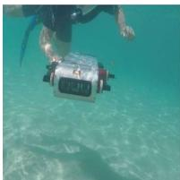

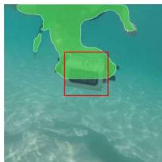

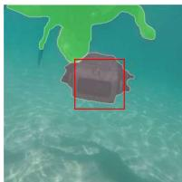

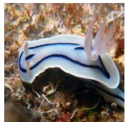  
(a) Original

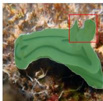  
(b) Mask RCNN

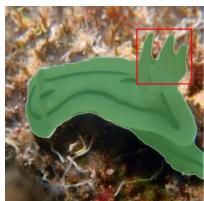  
(c) Ours  
Figure 1: A simple comparison of Mask R-CNN and WaterMask R-CNN on UIIS dataset. The first, second and third columns indicate the original image, results of Mask R-CNN and our WaterMask R-CNN, respectively.

However, image instance segmentation for general underwater scenes has not been explored thoroughly. On the one hand, there is no general underwater image instance segmentation dataset to promote training and evaluation of instance segmentation models. The existing annotated data is either related to the application of instance segmentation for a specific object, like fish [10] and buildings [34], or only applicable for certain tasks such as object detection [27], semantic segmentation [14]. These datasets are not general for the task of multi-class instance segmentation of underwater images. On the other hand, quality degradation of underwater images is inevitable due to wavelength and distance-related attenuation and scattering [1]. Moreover, sea snow formed by plankton and other organisms in the ocean may also cause varying degrees of noise, which is harmful for imaging quality. This leads to the fact that directly transferring the existing instance segmentation algorithms for natural images to underwater images, it will have a certain degradation on the segmentation results. We illustrate a simple case of utilizing Mask RCNN [12] for underwater scenes in Figure 1. We can see that Mask R-CNN incorrectly assumes that the detector is part of the diver, but our WaterMask specifically designed for underwater images not only infers the correct segmentation, the segmentation mask also fits the object boundary precisely.

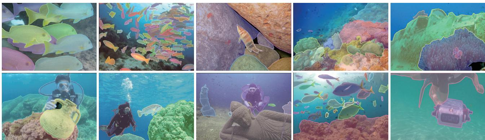  
Figure 2: The figure shows pixel-level instance segmentation of specific object classes: humans, robots, fish, coral reefs, undersea rocks, and undersea wrecks/ruins, and the segmented masks are superimposed on the image.

To alleviate this issue, we propose the first underwater image instance segmentation (UIIS) dataset, aiming to promote the development of instance segmentation for underwater tasks. UIIS dataset contains 4628 images for 7 categories with pixel-level annotations, including fish, coral reef, aquatic plant, etc. Simultaneously, we propose WaterMask for multi-object underwater image instance segmentation according to the intrinsic characteristics of underwater imagery. As far as we know, this is the first model specifically designed for underwater images. Underwater instances (especially boundaries) are difficult to segment due to occlusion of similar instance clusters (e.g., fish swarms and coral reefs), quality degradation, and sea snow. Classical instance segmentation methods[7, 12, 4, 20] are unable to accurately localize underwater object regions due to too many downsampling operations. As a result, the shape and details of the objects may be lost and distorted after segmentation. WaterMask reconstructs the highest resolution feature maps in the feature pyramid network based on our proposed Difference Similarity Graph Attention Module (DSGAT) and uses these features to complement missing details, helping the model to align objects. We then designed the Multi-level Feature Refinement Module (MFRM) for WaterMask, which infers different resolution masks by supplementing the degradation information so that higher resolution features can be utilized to fully predict the boundaries. Additionally, we devise Boundary Mask Strategy (BMS) with boundary learning loss to prevent network overfitting by emphasizing the boundaries of the high-resolution masks, which guides the network to output more accurate instance masks.

We conducted extensive experiments to evaluate the effectiveness of our method. Firstly, we integrate Water-Mask into the Mask R-CNN [12] framework, called WaterMask R-CNN. which achieves 2.9, 3.8 mAP improvement on the UIIS in ResNet-50 and ResNet-101 backbones. Moreover, It tends to gain more improvement on a more stringent evaluation mechanism due to the network’s precise localization of the mask boundary part, as shown in Table 2. Secondly, we also demonstrate the generalization ability of our approach on another pixel-based instance segmentation frameworks, Cascade R-CNN [3]. In summary, the main contributions of this work are concluded as follows:

• We construct the first general underwater image instance segmentation(UIIS) dataset containing 4,628 images for 7 categories with pixel-level annotations for underwater instance segmentation task.

• We propose the first underwater instance segmentation model WaterMask, as far as we know. In WaterMask, we devise DSGAT and MFRM modules to reconstruct and refine the image features with underwater imaging degradation, and Boundary Mask Strategy with boundary learning loss to optimize the boundaries of underwater clustered instances.

• Extensive experiments on public evaluation criteria demonstrate the effectiveness of the proposed UIIS dataset and WaterMask.

## 2. Related Work

Underwater Image Segmentation Dataset. The existing underwater image datasets mainly include EUVP datasets [16], UIEBD datasets [21] and SAUD datasets [18] for image enhancement and color correction, SUN dataset(underwater scenes) [30] and WishFish [35] dataset for underwater scene recognition and underwater target detection. Islam [14] et al. annotated and built the first underwater semantic segmentation dataset containing 1500 images, which achieved wide acceptance. Nahuel [10] et al. created the DeepFish dataset for instance segmentation of different fishes.

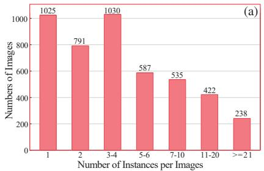

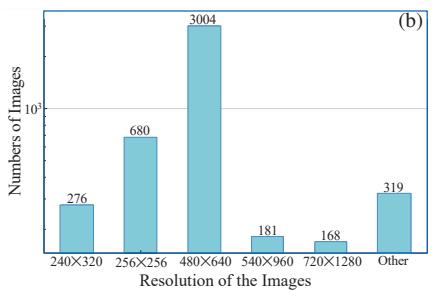

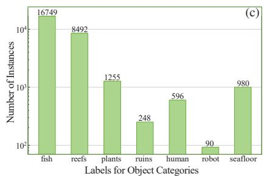  
Figure 3: UIIS dataset. (a) Distribution of the number of instances per image in the UIIS dataset. (b) Distribution of image resolutions in the UIIS dataset. (c) The number of instances per category in the UIIS dataset.

<table><tr><td rowspan=1 colspan=1>Category</td><td rowspan=1 colspan=1>Descriptions</td></tr><tr><td rowspan=1 colspan=1>Fish</td><td rowspan=1 colspan=1>Fish and other vertebrates</td></tr><tr><td rowspan=1 colspan=1>Reefs</td><td rowspan=1 colspan=1>Coral reefs and other invertebrates</td></tr><tr><td rowspan=1 colspan=1>Aquatic plants</td><td rowspan=1 colspan=1>Aquatic plants and flora</td></tr><tr><td rowspan=1 colspan=1>Wrecks/ruins</td><td rowspan=1 colspan=1>Underwater damaged man-made artifacts</td></tr><tr><td rowspan=1 colspan=1>Human divers</td><td rowspan=1 colspan=1>Human and the diving equipment they carry</td></tr><tr><td rowspan=1 colspan=1>Robots</td><td rowspan=1 colspan=1>AUV, ROV and other underwater robots</td></tr><tr><td rowspan=1 colspan=1>Sea-floor</td><td rowspan=1 colspan=1>Rocks and reefs on the seafloor</td></tr></table>

Table 1: Category descriptions of in UIIS dataset.

Instance Segmentation. Classical instance segmentation methods [12, 3, 4, 7, 13, 28] are usually based on a Mask R-CNN-style structure [12], which generates bounding boxes by object detectors, and then uses the RoIAlign [12] operation to extract the corresponding instance features from the feature pyramid [22] into a low-resolution regular grid for pixel-level mask prediction. Cascade RCNN [3] uses a sequence of detectors to return accurate bounding boxes for fine segmentation. PointRend [20] treats image segmentation as a rendering problem, adaptively selecting the location of point-based segmentation predictions. BMask R-CNN [7] has a similar motivation to ours, using object boundary information to improve the accuracy of mask localization and to better align the predicted masks with object boundaries. QueryInst [9] applies the Transformer structure in instance segmentation, treating the instances of interest as learnable query, and performs instance segmentation in this way. Mask2Former [6] extracts local features for segmentation by limiting the attention interval of crossattention in the Transformer decoder and works well.

## 3. UIIS Dataset

We propose the first dataset UIIS for general underwater image instance segmentation, which contains a total of 4628 RGB underwater images with pixel-level annotations.

## 3.1. Dataset Collection and Annotation

Dataset Collection. We collected about 25,000 images from various domains for underwater image enhancement [21, 16, 15, 2, 32], semantic segmentation [24, 14], and object detection [35, 27] etc. These images include different natural underwater scenes and are adapted to various domains such as marine exploration, marine ecological maintenance and human-robot intelligent cooperation applications. After that, we obtained about 5000 images filtered by Underwater Color Image Quality Evaluation (UCIQE) [31] and Underwater Image Quality Measurement (UIQM) [26] metrics, and annotated them in detail.

Dataset Annotation. The UIIS dataset contains object categories such as fish, coral reefs, aquatic plants, and wrecks/ruins, which are major research components for marine exploration and marine ecological maintenance. In addition, it contains pixel annotations of human divers, robots/instruments, and seafloor/reefs, which are the main targets for investigation of cooperative human-robot-object intelligence applications. Detailed category definitions can be found in Table 1. We assembled 15 volunteers with basic dataset annotation experience and fundamental knowledge of marine biology to annotate the dataset. We adopted sparsely annotated polygons to annotate each instance in the image, and the resulting annotated data will be stored as a mainstream COCO-style format [23] to facilitate the use of this dataset by most general frameworks and models. Each image was annotated by at least three volunteers and then evaluated by another person to select the best annotation and refine it. To classify potential confused objects such as plants/coral reefs, vertebrates/invertebrates, we followed the guidance in [8] and [25]. We also filtered out images that could not reach consensus or could not be finely labeled to ensure the rigor of the dataset, and finally we obtained 4628 images and corresponding annotations.

## 3.2. Dataset Statistic and Challenges

In this section, we illustrate the broad picture and challenges of the UIIS dataset by providing some visual samples in Figure 2 and the statistical analysis in Figure 3. More visual samples about UIIS dataset can be seen in Appendix.

Challenge in the number of instance. In UIIS dataset, an image often has multiple instances. As in Figure 2, generally the above images have more than five instances. In Figure 3 (a), we counted the number of instances in the dataset and the scenes with more than 5 instances accounted for

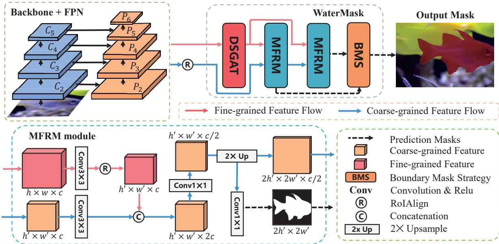  
Figure 4: Framework of WaterMask. WaterMask consists of DSGAT (defined in Section 4.1), MFRM (defined in Section 4.2) and BMS (defined in Section 4.3). DSGAT reconstructs the highest resolution feature $P _ { 2 }$ in the feature pyramid network to generate global fine-grained features. Then, MFRM downsamples the region of interest from the reconstructed globa features, and fuses them with the local coarse-grained features in $P _ { 3 } - P _ { 6 }$ to predict foreground masks and boundary masks with different resolutions. The final output masks are optimized by BMS to achieve finer boundaries of underwater instances.

## 4. WaterMask

38.5% of the total and more than 10 instances accounted for 14.2%, in which the image with the most instances had 162 instances. Meanwhile, the increase of instances in underwater images is often caused by situations such as aggregation of fish or clustering of corals. As in the second image in Figure 2, instances tend to gather closely and occlude each other, which demanding higher segmentation accuracy in terms of instance boundaries.

Challenges in small or large instances The prediction of too small or too large instances is a very general but challenging problem in the field of instance segmentation. In UIIS dataset, we collected some tiny samples (e.g., part of the fish in Figure 2) and huge samples (e.g., the wreck in the fifth image of Figure 2). We counted instances of too small or too large instances in the dataset, with a total of 3319 instances less than 14×14 pixels, accounting for 11.7% of the total, in addition to 6485 instances of size larger than 128x128 pixels, accounting for 22.8% of the total, which illustrates the challenge of the UIIS dataset.

Challenges in various image resolutions and image scenarios. UIIS dataset has images of various resolutions, matching low-resolution images taken with handheld cameras and medium-resolution to high-resolution images taken with industrial equipment in underwater tasks, to meet the resolution demands for various tasks. Moreover, UIIS dataset also contains images with significant quality degradation, high saturation or high contrast images to evaluate the performance of the network in different ocean scenarios.

Figure 4 shows the overview of WaterMask. The features are input into DSGAT for reconstruction to recover the lost detailed information, then MFRM refines the multi-level segmentation features and generate the prediction masks at different scales. Finally, BMS guides the network through the boundaries to predict the fine segmentation masks.

## 4.1. Difference Similarity Graph Attention Module

Although underwater images generally suffer from quality degradation, underwater instances are mostly clustered, which makes it possible for underwater images to have similar visual information in multiple places, retaining different degraded details under different water and lighting conditions. Therefore, we propose DSGAT for collecting this similar visual information by computing the attention between image patches so that each patch can be complemented by the visual information of multiple other similar patches, and reconstructing the image details by extracting and combining information through GAT operations.

DSGAT accepts the highest resolution feature $P _ { 2 }$ in the feature pyramid [22] as input. $P _ { 2 } \in \mathbb { R } ^ { h \times w \times c }$ , where h and w denote the spatial dimension and c represents the number of feature channels of the input. To reduce the number of parameters processed by subsequent GAT operations, DS-GAT is first fed $P _ { 2 }$ to a $s \times s$ convolutional layer with stride s. Then each row of pixels in the output feature $P _ { 2 } ^ { \prime } \in \mathbb { R } ^ { h / s \times w / s \times d }$ is treated as a graph node $h _ { i } ~ \in ~ \mathbb { R } ^ { d }$ which is mapped to a patch of $4 s \times 4 s$ size in the original image. Thus, the graph consisting of image patches can be represented as ${ \cal H } _ { i n } = \{ \vec { h _ { 1 } } , \vec { h _ { 2 } } , \dots \vec { h _ { n } } \} , n = h / s \times w / s$ In addition, the presence of edges between every two nodes in the graph means that the information will be aggregated through the edges using GAT. Therefore, in order to collect as numerous different degenerate residual detail features as possible and to reduce computational cost and memory consumption, we connect only the k nodes with the farthest Euclidean distance from each node.

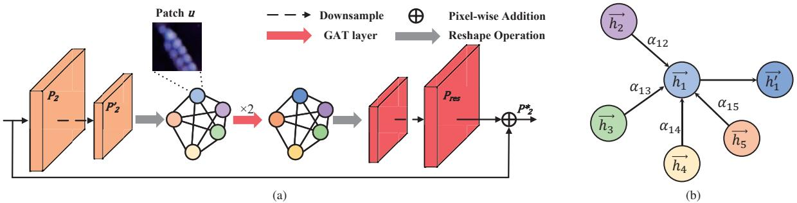  
Figure 5: (a) Structure of DSGAT. (b) An illustration of the attention mechanism by node $\vec { h _ { 1 } }$ on its neighbors.

To transform the input features into higher-level features and make the network better expressive, we use a shared learnable weight matrix $W \in \mathbf { \bar { \mathbb { R } } } ^ { d ^ { \prime } \times d }$ to linearly transform each node and then use the shared self-attentive weight matrix $l \in \mathbb { R } ^ { 2 d ^ { \prime } \times 1 }$ to compute the attention coefficients for the node pairs. We only calculate $a _ { i j }$ for node $j \in \mathcal N _ { i }$ where ${ \mathcal { N } } _ { i }$ is the first-order neighbor nodes of node i in the graph. To better compare the coefficients a between different nodes, we normalize all selected j using the softmax function. Therefore, the formula for $a _ { i j }$ is:

$$
a _ { i j } = \frac { e x p ( \sigma ( l ^ { \mathrm { T } } [ W \vec { h _ { i } } \ \lVert \ W \vec { h _ { j } } ] ) ) } { \sum _ { n \in \mathcal { N } _ { i } } e x p ( \sigma ( l ^ { \mathrm { T } } [ W \vec { h _ { i } } \ \lVert \ W \vec { h _ { n } } ] ) ) } ,\tag{1}
$$

where $\cdot ^ { \mathrm { T } }$ represents transposition and ∥ is the concatenation operation, σ is the LeakyReLU function. Let δ be the ELU activation function, the features of the final output can be expressed as :

$$
\vec { h _ { i } ^ { \prime } } = \delta ( \sum _ { n \in \mathcal { N } _ { i } } a _ { i j } W \vec { h _ { j } } ) .\tag{2}
$$

As a result, information from its neighbors is aggregated and adopted to update the feature definitions according to Equation (2), an example of which is shown in Figure 5(b). Meanwhile, we set $d ^ { \prime }$ equal to d, and the output features of DSGAT model will have the same dimension as the input features, $e . g . , H _ { o u t } = \{ \vec { h _ { 1 } ^ { \prime } } , \vec { h _ { 2 } ^ { \prime } } , \dotsc h _ { n } ^ { \prime } \} , h _ { i } ^ { \prime } \in \mathbb { R } ^ { d }$ . Then, the features represented by the output graph $H _ { o u t }$ are deconvoluted and up-sampled as $P _ { r e s } \in \mathbb { R } ^ { h \times w \times d }$ as the residual information stream to complement the detailed information lost due to quality degradation and network downsampling.

## 4.2. Multi-level Feature Refinement Module

The receptive field of the fine-grained features $P _ { 2 } ^ { * }$ reconstructed by DSGAT is too small to be used directly for instance segmentation, so we also prepare a MFRM, consisting of ROIAlign [12] and convolutional layers, to fuse the coarse-grained feature flow from the feature pyramid [22] layer $P _ { 3 } - P _ { 6 }$ with the fine-grained feature flow reconstructed by DSGAT to help the network perform higher quality segmentation.

Before proceeding to MFRM, the features extracted from the feature pyramid by the 14×14 RoIAlign operation are first sent to the two $3 \times 3$ convolutional layers to generate the initial instance feature $F _ { 1 }$ . After that, we iteratively refine the initial $F _ { 1 }$ by MFRM using the fine-grained features generated by DSGAT. At each stage, we use the RoIAlign operation to extract local fine-grained features of the corresponding size from $P _ { 2 } ^ { * }$ and concatenate them with the features obtained in the previous stage, after which we perform a 1×1 convolution and an $2 \times$ upsampling operation on these features to generate the output features for that stage. Since the use of 1×1 convolution reduces the number of feature channels to half the number of input channels before upsampling, the process of refining the instance features does not increase the number of feature parameters, thus incurring additional computational costs. MFRM will be executed twice, and we call the outputs of both times $F _ { 2 }$ and $F _ { 3 }$ , which will be used as foreground prediction and boundary prediction, respectively.

## 4.3. Boundary Mask Strategy

We feed the features $F _ { 2 }$ and $F _ { 3 }$ generated by MFRM into the 1×1 convolution layer to generate instance masks $M _ { 2 }$ and $M _ { 3 }$ with different resolutions. The pixels in $F _ { 2 }$ have a large receptive field and contain rich high-level information, which is beneficial for predicting the approximate location of the instance mask, but because of the low feature resolution, the boundaries of the prediction results tend to be rough. Conversely, $F _ { 3 }$ , while the high-resolution mask reduces the boundary error, also causes the network to overpredict other pixels of the mask. Therefore, we perform 2× upsampling operation on $M _ { 2 }$ and replace its bounding part with the corresponding part of $M _ { 3 }$ . We designed a convolutional layer $\nabla ^ { 2 } p$ using the Laplacian operator to generate boundary from the base of the binary mask, $\nabla ^ { 2 } p$ with stride of 1, padding of 1, convolutional kernel size of $b \times b$ and weight vector ⃗p can be formulated as follows:

$$
\begin{array} { r } { p _ { i j } = \left\{ \begin{array} { l l } { b ^ { 2 } - 1 , } & { \mathrm { i f } i = j = \frac { b - 1 } { 2 } } \\ { \quad - 1 , } & { \mathrm { o t h e r w i s e } , } \end{array} \right. } \end{array}\tag{3}
$$

where $i , j$ denote the position of the pixel $p _ { i j }$ in ${ \vec { p . } }$ Thus, the boundary mask determination function can be expressed as:

$$
B ( M ) = \left\{ \begin{array} { l l } { 1 , } & { \mathrm { i f ~ } \left| \nabla ^ { 2 } p ( M ) \right| \leq \mu b ^ { 2 } } \\ { 0 , } & { \mathrm { o t h e r w i s e } , } \end{array} \right.\tag{4}
$$

where $\mu$ is a hyperparameter to control the size of boundary, representing that a pixel in the binary mask is considered a boundary pixel only if it is surrounded by at least $\mu b ^ { 2 }$ pixels whose values are not equal to it. $\mu$ is set as 0.15 empirically. The final output mask $M _ { o u t }$ can be defined as:

$$
M _ { o u t } = f _ { 2 \times } ( M _ { 2 } ) \odot B _ { 2 \times } + M _ { 3 } \odot ( 1 - B _ { 2 \times } ) ,\tag{5}
$$

where ⊙ denotes pixel-wise multiplication, $f _ { 2 \times }$ is 2× upsampling operation using bilinear interpolation, $B _ { 2 \times }$ is a boundary determination matrix, expressed as $f _ { 2 \times } ( B ( M _ { 2 } ) ) ,$ .

## 4.4. Boundary Learning Loss

Instance segmentation models are often accustomed to using binary cross-entropy (BCE) as mask loss. However, the quality degradation phenomenon often leads to blurred boundaries of objects in underwater images, while the pixels used for training boundary classification are much smaller than those used for mask classification, resulting in the BCE loss only provide an accurate but blurred localization of the boundary region, which prevents the network to effectively learn information from the boundary. To solve this problem, we designed Boundary Learning Loss (BLL) to allocate more weights to the boundary regions and thus compel the network to pay more attention to the classification within the boundary pixels, thereby making more accurate predictions. BLL is formulated as follows:

$$
\mathcal { L } _ { B } = \frac { \sum _ { i } ^ { H \times W } R _ { 2 \times } ^ { i } \cdot B C E \left( M _ { 3 } ^ { i } , G _ { 3 } ^ { i } \right) } { \sum _ { i } ^ { H \times W } R _ { 2 \times } ^ { i } } ,\tag{6}
$$

where H and W are height and width of the mask $M _ { 3 }$ $G _ { k }$ is the ground truth corresponding to $M _ { k } ,$ , i denotes the i-th pixel, $B C E \left( \right)$ returns the binary cross-entropy loss of a pixel, ∨ denotes the union of two regions, $R _ { 2 \times } ^ { i }$ represents the boundary region that ought to be focused on, and is defined here as $f _ { 2 \times } ( B ( M _ { 2 } ) \lor ( B ( G _ { 2 } ) )$ .

We also perform 1×1 convolution on $F _ { 1 }$ to generate the in-process mask $M _ { 1 }$ and use BCE loss for $M _ { 1 }$ and $M _ { 2 }$ to insure that the parameters learned by the network in the process are reliable, from which the total loss of the mask part can be expressed as:

$$
\mathcal { L } _ { m a s k } = \mathcal { L } _ { B } + \sum _ { k \subset [ 1 , 2 ] } \lambda _ { k } \mathcal { L } _ { B C E } ( M _ { k } , G _ { k } ) ,\tag{7}
$$

where $\lambda _ { k }$ is hyperparameter to balance the weight (We empirically set $\lambda _ { 1 } = 0 . 2 5$ and $\lambda _ { 2 } = 0 . 6 5$ in experiments).

## 5. Experiments

## 5.1. Implementation Details

We divide the UIIS into two parts, in which 3937 images are used for training and 691 images are used for validation. Meanwhile, we adopt the standard mask AP metric [23] as an evaluation metric to show the performance of the model comprehensively through a series of different IoU thresholds and different scales, including mAP, $\mathrm { A P } _ { 5 0 } , \mathrm { A P } _ { 7 5 } .$ $\mathbf { A P } _ { S } , \mathbf { A P } _ { M }$ , and $\mathsf { A P } _ { L }$ . We also list the mAP performance of the model on fish, human divers and wrecks/ruins classes to assess the applicability of the model in common underwater domains such as underwater ecological conservation, underwater human-machine interaction and marine exploration. All backbone and method hyper-parameters are the same as the original work, except for our newly designed parts. In DSGAT, we set the graph nodes for the original image patch size to $1 2 \times 1 2$ and the number of neighboring nodes $k = 1 1$ for each node. In Boundary Mask Strategy, we set the convolution kernel size of $\nabla ^ { 2 } p$ to $7 \times 7$ for training and 9×9 for testing. We train 2 images on each GPU, using SGD optimizer with a starting learning rate of 2.5e-3. We implement WaterMask with PyTorch and MMDetection [5], and use an NVIDIA A5000 GPU to train.We also implement our network by using the MindSpore Lite tool1 In addition, all models presented in the ablation experiments are trained with 1× learning schedule.

## 5.2. Experimental Results

## Comparisons with baseline framework.

We first evaluated our WaterMask head on the Mask R-CNN framework [12] with different backbone networks and different learning schedules in Table 2. The Water-Mask R-CNN performs much better than the Mask R-CNN in the vast majority of metrics under various configurations. Without additional conditions, the WaterMask R-CNN achieved 1.6 and 3.3 points of AP improvement over Mask R-CNN on ResNet-50-FPN and ResNet-101-FPN, respectively, when using the 1× training strategy. In Figure 6, we can observe that the WaterMask R-CNN outperforms the Mask R-CNN by 6.1 mAP points when using a more stringent evaluation criterion, such as $\mathsf { A P } _ { 8 0 }$ . This illustrates that the addition of WaterMask to the framework improves the AP of the model because WaterMask head infers a highquality mask that fits more closely to the edges of the object through a reasonable mask prediction mechanism, rather than stack a large number of parameters.

<table><tr><td>Method</td><td>Backbone</td><td>Schedule</td><td> $\mathrm { m A P }$ </td><td> $\mathrm { { A P } _ { 5 0 } }$ </td><td> $\mathrm { A P _ { 7 5 } }$ </td><td> $\mathsf { A P } _ { S }$ </td><td> $\mathsf { A P } _ { M }$ </td><td> $\mathsf { A P } _ { L }$ </td><td> $\mathsf { A P } _ { f }$ </td><td> $\mathsf { A P } _ { h }$ </td><td> $\mathsf { A P } _ { r }$ </td></tr><tr><td>Mask R-CNN</td><td>R50-FPN</td><td>1×</td><td>21.7</td><td>39.5</td><td>21.0</td><td>8.2</td><td>18.3</td><td>29.9</td><td>42.0</td><td>42.0</td><td>16.6</td></tr><tr><td>WaterMask R-CNN</td><td>R50-FPN</td><td>1×</td><td>23.3</td><td>39.7</td><td>24.8</td><td>8.2</td><td>19.2</td><td>33.7</td><td>43.8</td><td>46.5</td><td>14.4</td></tr><tr><td>Mask R-CNN‡</td><td>R50-FPN</td><td>3×</td><td>23.5</td><td>42.3</td><td>23.7</td><td>7.8</td><td>19.3</td><td>34.9</td><td>44.3</td><td>46.4</td><td>15.8</td></tr><tr><td>WaterMask R-CNN‡</td><td>R50-FPN</td><td>3×</td><td>26.4</td><td>43.6</td><td>28.8</td><td>9.1</td><td>21.1</td><td>38.1</td><td>46.9</td><td>54.0</td><td>18.2</td></tr><tr><td>Mask R-CNN</td><td>R101-FPN</td><td>1×</td><td>22.3</td><td>40.2</td><td>24.5</td><td>8.0</td><td>19.7</td><td>30.7</td><td>42.8</td><td>46.3</td><td>16.7</td></tr><tr><td>WaterMask R-CNN</td><td>R101-FPN</td><td>1×</td><td>25.6</td><td>41.7</td><td>27.9</td><td>8.8</td><td>21.3</td><td>36.0</td><td>45.3</td><td>53.9</td><td>19.0</td></tr><tr><td>Mask R-CNN‡</td><td>R101-FPN</td><td>3×</td><td>23.4</td><td>40.9</td><td>25.3</td><td>9.3</td><td>19.8</td><td>32.5</td><td>43.6</td><td>49.0</td><td>18.0</td></tr><tr><td>WaterMask R-CNN‡</td><td>R101-FPN</td><td>3×</td><td>27.2</td><td>43.7</td><td>29.3</td><td>9.0</td><td>21.8</td><td>38.7</td><td>46.3</td><td>54.8</td><td>20.9</td></tr><tr><td>Cascade Mask R-CNN‡</td><td>R101-FPN</td><td>3×</td><td>25.5</td><td>42.8</td><td>27.8</td><td>7.5</td><td>20.1</td><td>35.0</td><td>43.9</td><td>52.9</td><td>22.3</td></tr><tr><td>Cascade WaterMask R-CNN‡</td><td>R101-FPN</td><td>3×</td><td>27.1</td><td>42.9</td><td>30.4</td><td>8.3</td><td>21.0</td><td>38.9</td><td>47.0</td><td>55.8</td><td>22.5</td></tr></table>

Table 2: Comparison with Mask R-CNN and Cascade Mask R-CNN on UIIS dataset. Models with ‡ were trained with 3× schedule using multi-scale training.

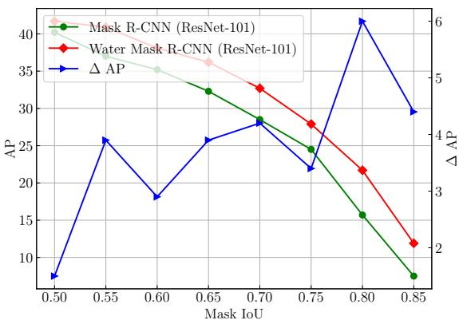  
Figure 6: mAP curves of Mask R-CNN and WaterMask R-CNN under different mask IoU thresholds on the UIIS with 1× schedule. The blue line shows the AP gains of Water-Mask R-CNN over Mask R-CNN.

When using the 3× training strategy, WaterMask R-CNN boosts the AP by 2.9 and 3.8 on the two backbone networks. While using the 3× strategy and ResNet-101-FPN, although reconstructing images by DSGAT pairs may hinder WaterMask’s prediction on small objects (0.3 AP behind in $\mathsf { A P } _ { S } )$ , this also helps the network to better predict large object masks with high accuracy (6.2 AP above in $\mathsf { A P } _ { L } )$ We also conducted experiments on the Cascade Mask R-CNN framework. Compared with Cascade Mask R-CNN [3], Cascade WaterMask R-CNN achieved significant improvements in various metrics, which shows the generalization ability of our WaterMask.

## Comparisons with state-of-the-art methods.

We present our proposed WaterMask on the UIIS dataset and compare it with the state-of-the-art methods. Table 3 demonstrates that WaterMask R-CNN outperforms traditional natural image instance segmentation algorithms such as Mask R-CNN [12], BMask R-CNN [7], and Point

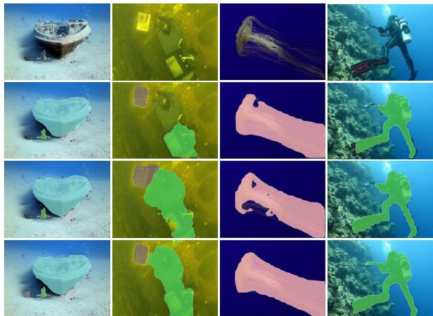  
Figure 7: Qualitative comparison on the UIIS dataset. The first row represents the original image, and the second, third and fourth rows represent the results of Mask R-CNN, QueryInst and ours, respectively.

Rend [20] with 3.8AP, 5.1AP, and 1.3AP improvement in mAP respectively. Although WaterMask RCNN has a 0.7AP lag in $\mathsf { A P } _ { S }$ compared to $\mathrm { R ^ { 3 } { - } C N N }$ [28], it achieves an average improvement of $2 . 4 \mathrm { A P }$ in all other metrics. Additionally, WaterMask is also highly competitive when compared with state-of-the-art algorithms that utilize Transformer structures, such as QueryInst [9], Mask Transfiner [19] and Mask2Former [6]. When compared with Mask2Former, our Cascade WaterMask R-CNN exhibits a 0.6AP lag in $\mathsf { A P } _ { r }$ but boasts significant advantages in $\mathsf { A P } _ { f }$ (5.9AP lead), $\mathsf { A P } _ { h }$ (3.9AP lead), and mAP (1.4AP lead). In conclusion, our proposed WaterMask instance segmentation algorithm shows promising results and outperforms previous methods on the UIIS dataset.

We also illustrate some visual comparisons with Mask R-CNN [12] and QueryInst [9] on the test set of UIIS in Figure 7, which demonstrates that our method consistently succeeds in segmenting the overall shape of the salient instances, even in challenging regions such as those depicted in the second and third columns of the figure. Furthermore, our method produces more accurate boundary and detailrich prediction mask, as can be seen in the last column of Figure 7. In addition, more qualitative comparisons can be seen in Appendix. In summary, WaterMask exhibits strong performance in high saturation and mass degradation cases.

<table><tr><td>Method</td><td>Backbone</td><td> $\mathrm { m A P }$ </td><td> $\mathrm { { A P } _ { 5 0 } }$ </td><td> $\mathrm { A P _ { 7 5 } }$ </td><td> $\mathsf { A P } _ { S }$ </td><td> $\mathsf { A P } _ { M }$ </td><td> $\mathrm { A P } _ { L }$ </td><td> $\mathsf { A P } _ { f }$ </td><td> $\mathsf { A P } _ { h }$   $\mathsf { A P } _ { r }$ </td><td></td><td>Params</td></tr><tr><td>Mask R-CNN‡ [12]</td><td>ResNet-101</td><td>23.4</td><td>40.9</td><td>25.3</td><td>9.3</td><td>19.8</td><td>32.5</td><td>43.6</td><td>49.0</td><td>18.0</td><td>63M</td></tr><tr><td>Mask Scoring R-CNN‡ [13]</td><td>ResNet-101</td><td>24.6</td><td>41.9</td><td>26.5</td><td>8.4</td><td>20.0</td><td>34.3</td><td>44.2</td><td>52.8</td><td>16.0</td><td>79M</td></tr><tr><td>Cascade Mask R-CNN‡ [3]</td><td>ResNet-101</td><td>25.5</td><td>42.8</td><td>27.8</td><td>7.5</td><td>20.1</td><td>35.0</td><td>43.9</td><td>52.9</td><td>22.3</td><td>88M</td></tr><tr><td>BMask R-CNN‡ [7]</td><td>ResNet-101</td><td>22.1</td><td>36.2</td><td>24.4</td><td>5.8</td><td>17.5</td><td>35.0</td><td>40.7</td><td>50.0</td><td>17.7</td><td>66M</td></tr><tr><td>Point Rend [20]</td><td>ResNet-101</td><td>24.8</td><td>41.7</td><td>25.4</td><td>7.8</td><td>21.6</td><td>34.2</td><td>44.8</td><td>50.4</td><td>18.6</td><td>75M</td></tr><tr><td>Point Rend‡ [20]</td><td>ResNet-101</td><td>25.9</td><td>43.4</td><td>27.6</td><td>8.2</td><td>20.2</td><td>38.6</td><td>43.3</td><td>54.1</td><td>20.6</td><td>75M</td></tr><tr><td>R3-CNN‡ [28]</td><td>ResNet-101</td><td>24.9</td><td>40.5</td><td>27.8</td><td>9.7</td><td>21.4</td><td>33.6</td><td>45.4</td><td>52.2</td><td>20.2</td><td>77M</td></tr><tr><td>SOLOv2 [29]]</td><td>ResNet-101</td><td>24.5</td><td>40.9</td><td>25.1</td><td>5.6</td><td>19.4</td><td>37.6</td><td>36.4</td><td>48.3</td><td>20.6</td><td>65M</td></tr><tr><td>QueryInst [9]</td><td>ResNet-101</td><td>26.0</td><td>42.8</td><td>27.3</td><td>8.2</td><td>21.7</td><td>35.1</td><td>43.3</td><td>54.1</td><td>20.6</td><td>191M</td></tr><tr><td>Mask Transfiner‡[19]</td><td>ResNet-101</td><td>24.6</td><td>42.1</td><td>26.0</td><td>7.2</td><td>19.4</td><td>36.1</td><td>43.8</td><td>26.3</td><td>19.8</td><td>63M</td></tr><tr><td>Mask2Former‡ [6]</td><td>ResNet-101</td><td>25.7</td><td>38.0</td><td>27.7</td><td>6.3</td><td>18.9</td><td>38.1</td><td>41.1</td><td>51.9</td><td>23.1</td><td>63M</td></tr><tr><td>WaterMask R-CNN</td><td>ResNet-101</td><td>25.6</td><td>41.7</td><td>27.9</td><td>8.8</td><td>21.3</td><td>36.0</td><td>45.3</td><td>53.9</td><td>19.0</td><td>67M</td></tr><tr><td>WaterMask R-CNN‡</td><td>ResNet-101</td><td>27.2</td><td>43.7</td><td>29.3</td><td>9.0</td><td>21.8</td><td>38.9</td><td>46.3</td><td>54.8</td><td>20.9</td><td>67M</td></tr><tr><td>Cascade WaterMask R-CNN‡</td><td>ResNet-101</td><td>27.1</td><td>42.9</td><td>30.4</td><td>8.3</td><td>21.0</td><td>38.9</td><td>47.0</td><td>55.8</td><td>22.5</td><td>107M</td></tr></table>

Table 3: Comparison with the State-of-the-art Methods on UIIS. Models with ‡ were trained with 3× schedule using multi-scale training. The data marked in red are the best, and those in blue are the second best.

<table><tr><td>Methods</td><td>mAP</td><td> $\mathrm { { A P } _ { 5 0 } }$ </td><td> $\mathrm { A P } _ { 7 5 }$   $\mathsf { A P } _ { S }$ </td><td> $\mathrm { A P } _ { M }$ </td><td> $\mathrm { A P } _ { L }$ </td></tr><tr><td>w/o DSGAT</td><td>24.2</td><td>40.2</td><td>25.7</td><td>8.2 20.9</td><td>33.3</td></tr><tr><td>w/o MFRM</td><td>23.1</td><td>38.4</td><td>24.6</td><td>8.4 20.1</td><td>31.8</td></tr><tr><td>w/o BMS</td><td>22.5</td><td>41.2</td><td>23.1</td><td>8.4 19.0</td><td>31.1</td></tr><tr><td>w/o BLL</td><td>23.9</td><td>40.7</td><td>25.4</td><td>8.7 20.9</td><td>32.9</td></tr><tr><td>WaterMask</td><td>25.6</td><td>41.7</td><td>27.9</td><td>8.8 21.3</td><td>36.0</td></tr></table>

Table 4: Effectiveness of each component in WaterMask. ResNet-101-FPN and 1× training schedule is adopted.

<table><tr><td>Patch</td><td>|mAP|</td><td> $\mathrm { { A P } _ { 5 0 } }$   $\mathrm { A P } _ { 7 5 }$ </td><td> $| \mathbf { A P } _ { S } $   $\mathrm { A P } _ { M }$ </td><td> $ { \Delta }  { \mathbf { P } } _ { L }$ </td></tr><tr><td>8×8</td><td>=</td><td>1</td><td></td><td></td></tr><tr><td>12×12</td><td>25.6</td><td>41.7 27.9</td><td>8.8</td><td>21.3 36.0</td></tr><tr><td>16×16|</td><td>24.2</td><td>40.6 25.8</td><td>8.4</td><td>21.6 32.0</td></tr><tr><td>20×20</td><td>23.5</td><td>38.1 25.2</td><td>8.7</td><td>20.1 32.5</td></tr></table>

Table 5: Different Size of Patch. Each graph node corresponds to a 4s × 4s patch, where s is downsampling stride.
<table><tr><td rowspan=1 colspan=1>k</td><td rowspan=1 colspan=1>mAP</td><td rowspan=1 colspan=1>AP50 $\mathrm { A P } _ { 7 5 }$ </td><td rowspan=1 colspan=1> $\mathsf { A P } _ { S }$  $\mathrm { A P } _ { M }$  $ { \Delta }  { \mathbf { P } } _ { L }$ </td></tr><tr><td rowspan=1 colspan=1>5</td><td rowspan=1 colspan=1>23.1</td><td rowspan=1 colspan=1>39.223.8</td><td rowspan=1 colspan=1>8.6 19.931.8</td></tr><tr><td rowspan=1 colspan=1>7</td><td rowspan=1 colspan=1>24.0</td><td rowspan=1 colspan=1>40.325.2</td><td rowspan=1 colspan=1>8.0 21.131.8</td></tr><tr><td rowspan=1 colspan=1>9</td><td rowspan=1 colspan=1>24.9</td><td rowspan=1 colspan=1>42.226.6</td><td rowspan=1 colspan=1>8.3 21.234.9</td></tr><tr><td rowspan=1 colspan=1>11</td><td rowspan=1 colspan=1>25.6</td><td rowspan=1 colspan=1>41.727.9</td><td rowspan=1 colspan=1>8.8 21.336.0</td></tr><tr><td rowspan=1 colspan=1>13</td><td rowspan=1 colspan=1>25.5</td><td rowspan=1 colspan=1>41.427.3</td><td rowspan=1 colspan=1>8.1 20.936.3</td></tr></table>

Table 6: Different value of k. k is the number of farthest nodes to be connected.

## 5.3. Ablation Studies

Effectiveness of each component in WaterMask. We show the results of the following ablation experiments in Table 4. (1) DSGAT. We verify the effectiveness of DS-GAT by remove DSGAT from WaterMask. With DSGAT, the model obtains a gain of 1.4 AP, which indicates that the DSGAT reconstructed features can indeed help the model to make better inference by collecting as much degraded details as possible to compensate for the loss of information due to mass degradation and downsampling operations. (2) MFRM. When analyzing the validity of MFRM, we disable the feature fusion function in the module and keep only its main body. By using MFRM, WaterMask has a 2.5AP improvement, indicating that fusing the reconstructed global fine-grained features into the local mask prediction as supplementary details improves the quality of the mask prediction, while increasing the model-aware domain. In addition, large scale objects benefit more from reconstructed features, as shown by their 4.2AP improvement on $\mathrm { A P } _ { L } .$ (3) BMS. From Table 4, it can be seen that utilizing the BMS can give the model 3.1 AP improvement in mAP, which is caused by the fact that BMS allows the network to predict different positions of the mask using features of different scales. (4) Boundary learning loss. To verify the effect of boundary learning loss (BLL), we find that adopting BLL leads to a 1.7AP improvement of the model on mAP, which is due to the BLL guiding the network to focus more on the segmentation of the boundary part.

Different Size of Patch. We also discuss the size of the original image patch corresponding to each graph node in DSGATin Table 5. The downsampling stride s rages from 2 to 5, and we can see that when s = 2, the memory required by the model has exceeded the upper limit of the device. In the other cases in, s = 3 achieves the best results.

Different Number of Neighboring Node. We likewise discuss the number of neighboring nodes connected to each node in DSGAT. It can be seen in Table 6 that the model achieves the best performance-consumption balance when the number of neighbor nodes k = 11.

## 6. Conclusion

In this paper, we have constructed the first general underwater image instance segmentation dataset with pixel-level annotations, which enables us to comprehensively explore the underwater instance segmentation task. According to the intrinsic characteristics of underwater imagery, we have proposed WaterMask for underwater instance segmentation.

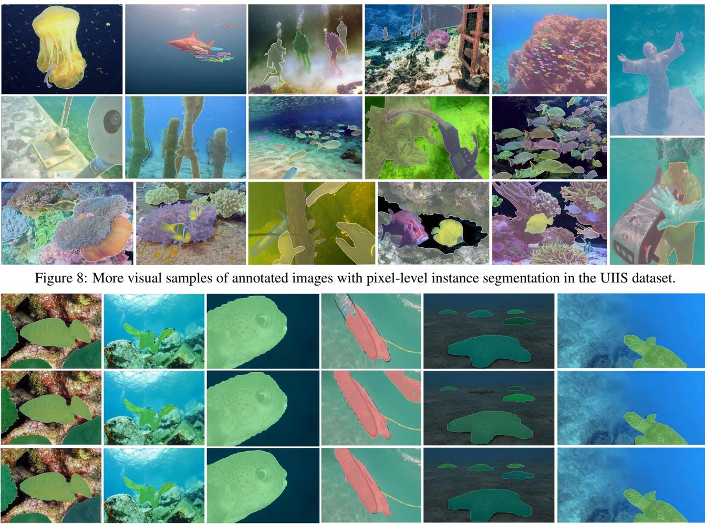  
Figure 9: More qualitative comparisons of the UIIS dataset. The first, second and third rows illustrate the results of Mask R-CNN, QueryInst and our method, respectively.

Extensive experiments have demonstrated the effectiveness of UIIS dataset and WaterMask. In future work, we will extend the UIIS dataset with larger-scale and more challenging underwater images for complex underwater exploration.

Acknowledgment. This work was supported in part by Hainan Provincial Natural Science Foundation of China under Grant 622RC623; in part by the National Natural Science Foundation of China under Grant 62201179; in part by the specific research fund of The Innovation Platform for Academicians of Hainan Province; in part by the Taishan Scholar Project of Shandong Province under Grant tsqn202306079; in part by Young Elite Scientist Sponsorship Program by the China Association for Science and Technology under Grant 2020QNRC001; in part by CAAI-Huawei MindSpore Open Fund; in part by the Natural Science Foundation of Shandong Province for Distinguished Young Scholars under Grant ZR2020JQ29; in part by Project for Self-Developed Innovation Team of Jinan City under Grant 2021GXRC038; in part by the Hong Kong Innovation and Technology Commission (InnoHK Project

CIMDA); in part by the Hong Kong GRF-RGC General Research Fund under Grant 11203820 (9042598)).

## A. Appendix

We present more visual samples and analysis of our UI-IIS Dataset in Figure 8, where the different instances in the image are labeled with different color masks. As can be seen, the images in the UIIS dataset cover a wide range of underwater scenes with different saturation, chromatic aberration and quality degradation, which is beneficial for network training in general underwater scenes. Moreover, we also illustrate more visual comparisons with Mask R-CNN [12] and QueryInst [9] on the UIIS test set in Figure 9. We can see that our approach can successfully segment the boundary masks of the fitting instances, such as those depicted in the second, third and last columns. Even in challenging regions, our network always predicts the correct and reliable output masks completely, such as those depicted in the fourth and fifth columns in Figure 9. In conclusion, WaterMask can achieve superior segmentation performances.

## References

[1] Derya Akkaynak, Tali Treibitz, Tom Shlesinger, Yossi Loya, Raz Tamir, and David Iluz. What is the space of attenuation coefficients in underwater computer vision? In IEEE Conference on Computer Vision and Pattern Recognition, July 2017.

[2] Dana Berman, Deborah Levy, Shai Avidan, and Tali Treibitz. Underwater single image color restoration using haze-lines and a new quantitative dataset. IEEE Transactions on Pattern Analysis and Machine Intelligence, 43(8):2822–2837, 2021.

[3] Zhaowei Cai and Nuno Vasconcelos. Cascade r-cnn: Delving into high quality object detection. In IEEE Conference on Computer Vision and Pattern Recognition, pages 6154– 6162, 2018.

[4] Kai Chen, Jiangmiao Pang, Jiaqi Wang, Yu Xiong, Xiaoxiao Li, Shuyang Sun, Wansen Feng, Ziwei Liu, Jianping Shi, Wanli Ouyang, et al. Hybrid task cascade for instance segmentation. In IEEE Conference on Computer Vision and Pattern Recognition, pages 4974–4983, 2019.

[5] Kai Chen, Jiaqi Wang, Jiangmiao Pang, Yuhang Cao, Yu Xiong, Xiaoxiao Li, Shuyang Sun, Wansen Feng, Ziwei Liu, Jiarui Xu, Zheng Zhang, Dazhi Cheng, Chenchen Zhu, Tianheng Cheng, Qijie Zhao, Buyu Li, Xin Lu, Rui Zhu, Yue Wu, Jifeng Dai, Jingdong Wang, Jianping Shi, Wanli Ouyang, Chen Change Loy, and Dahua Lin. MMDetection: Open mmlab detection toolbox and benchmark. arXiv preprint arXiv:1906.07155, 2019.

[6] Bowen Cheng, Ishan Misra, Alexander G. Schwing, Alexander Kirillov, and Rohit Girdhar. Masked-attention mask transformer for universal image segmentation. In IEEE Conference on Computer Vision and Pattern Recognition, pages 1290–1299, June 2022.

[7] Tianheng Cheng, Xinggang Wang, Lichao Huang, and Wenyu Liu. Boundary-preserving mask r-cnn. In European Conference on Computer Vision, pages 660–676. Springer, 2020.

[8] ETI BioInformatics. Marine Species Identification Portal. http://species-identification.org/, 2009. Accessed: 11-8-2022.

[9] Yuxin Fang, Shusheng Yang, Xinggang Wang, Yu Li, Chen Fang, Ying Shan, Bin Feng, and Wenyu Liu. Instances as queries. In IEEE International Conference on Computer Vision, pages 6910–6919, October 2021.

[10] Nahuel E Garcia-D’Urso, Alejandro Galan-Cuenca, Pau Climent-Perez, Marcelo Saval-Calvo, Jorge Azorin-Lopez,´ and Andres Fuster-Guillo. Efficient instance segmentation using deep learning for species identification in fish markets. In International Joint Conference on Neural Networks, pages 1–8, 2022.

[11] Abdul Mueed Hafiz and Ghulam Mohiuddin Bhat. A survey on instance segmentation: state of the art. International Journal of Multimedia Information Retrieval, 9(3):171–189, Sep 2020.

[12] Kaiming He, Georgia Gkioxari, Piotr Dollar, and Ross Gir-´ shick. Mask r-cnn. In IEEE International Conference on Computer Vision, pages 2961–2969, 2017.

[13] Zhaojin Huang, Lichao Huang, Yongchao Gong, Chang Huang, and Xinggang Wang. Mask scoring r-cnn. In IEEE Conference on Computer Vision and Pattern Recognition, June 2019.

[14] Md Jahidul Islam, Chelsey Edge, Yuyang Xiao, Peigen Luo, Muntaqim Mehtaz, Christopher Morse, Sadman Sakib Enan, and Junaed Sattar. Semantic segmentation of underwater imagery: Dataset and benchmark. In IEEE/RSJ International Conference on Intelligent Robots and Systems, pages 1769– 1776, 2020.

[15] Md Jahidul Islam, Peigen Luo, and Junaed Sattar. Simultaneous Enhancement and Super-Resolution of Underwater Imagery for Improved Visual Perception. In Robotics: Science and Systems, Corvalis, Oregon, USA, July 2020.

[16] Md Jahidul Islam, Youya Xia, and Junaed Sattar. Fast underwater image enhancement for improved visual perception. IEEE Robotics and Automation Letters, 5(2):3227– 3234, 2020.

[17] Muwei Jian, Xiangyu Liu, Hanjiang Luo, Xiangwei Lu, Hui Yu, and Junyu Dong. Underwater image processing and analysis: A review. Signal Processing: Image Communication, 91:116088, 2021.

[18] Qiuping Jiang, Yuese Gu, Chongyi Li, Runmin Cong, and Feng Shao. Underwater image enhancement quality evaluation: Benchmark dataset and objective metric. IEEE Transactions on Circuits and Systems for Video Technology, 32(9):5959–5974, 2022.

[19] Lei Ke, Martin Danelljan, Xia Li, Yu-Wing Tai, Chi-Keung Tang, and Fisher Yu. Mask transfiner for high-quality instance segmentation. In IEEE Conference on Computer Vision and Pattern Recognition, pages 4412–4421, 2022.

[20] Alexander Kirillov, Yuxin Wu, Kaiming He, and Ross Girshick. Pointrend: Image segmentation as rendering. In IEEE Conference on Computer Vision and Pattern Recognition, pages 9799–9808, 2020.

[21] Chongyi Li, Chunle Guo, Wenqi Ren, Runmin Cong, Junhui Hou, Sam Kwong, and Dacheng Tao. An underwater image enhancement benchmark dataset and beyond. IEEE Transactions on Image Processing, 29:4376–4389, 2020.

[22] Tsung-Yi Lin, Piotr Dollar, Ross Girshick, Kaiming He,´ Bharath Hariharan, and Serge Belongie. Feature pyramid networks for object detection. In IEEE Conference on Computer Vision and Pattern Recognition, pages 2117–2125, 2017.

[23] Tsung-Yi Lin, Michael Maire, Serge Belongie, James Hays, Pietro Perona, Deva Ramanan, Piotr Dollar, and C Lawrence´ Zitnick. Microsoft coco: Common objects in context. In European Conference on Computer Vision, pages 740–755. Springer, 2014.

[24] Zhiwei Ma, Haojie Li, Zhihui Wang, Dan Yu, Tianyi Wang, Yingshuang Gu, Xin Fan, and Zhongxuan Luo. An underwater image semantic segmentation method focusing on boundaries and a real underwater scene semantic segmentation dataset. arXiv preprint arXiv:2108.11727, 2021.

[25] Oceana Inc. The Ocean Animal Encyclopedia. https: //oceana.org/marine-life/, 2001. Accessed: 11- 8-2022.

[26] Karen Panetta, Chen Gao, and Sos Agaian. Human-visualsystem-inspired underwater image quality measures. IEEE Journal ofOceanic Engineering, 41(3):541–551, 2016.

[27] Malte Pedersen, Joakim Bruslund Haurum, Rikke Gade, and Thomas B. Moeslund. Detection of marine animals in a new underwater dataset with varying visibility. In IEEE Conference on Computer Vision and Pattern Recognition Workshops, June 2019.

[28] Leonardo Rossi, Akbar Karimi, and Andrea Prati. Recursively refined r-cnn: Instance segmentation with self-roi rebalancing. In Nicolas Tsapatsoulis, Andreas Panayides, Theo Theocharides, Andreas Lanitis, Constantinos Pattichis, and Mario Vento, editors, Computer Analysis of Images and Patterns, pages 476–486, Cham, 2021. Springer International Publishing.

[29] Xinlong Wang, Rufeng Zhang, Tao Kong, Lei Li, and Chunhua Shen. Solov2: Dynamic and fast instance segmentation. In H. Larochelle, M. Ranzato, R. Hadsell, M.F. Balcan, and H. Lin, editors, Advances in Neural Information Processing Systems, volume 33, pages 17721–17732. Curran Associates, Inc., 2020.

[30] Jianxiong Xiao, James Hays, Krista A. Ehinger, Aude Oliva, and Antonio Torralba. Sun database: Large-scale scene recognition from abbey to zoo. In 2010 IEEE Computer Society Conference on Computer Vision and Pattern Recognition, pages 3485–3492, 2010.

[31] Miao Yang and Arcot Sowmya. An underwater color image quality evaluation metric. IEEE Transactions on Image Processing, 24(12):6062–6071, 2015.

[32] Ning Yang, Qihang Zhong, Kun Li, Runmin Cong, Yao Zhao, and Sam Kwong. A reference-free underwater image quality assessment metric in frequency domain. Signal Processing: Image Communication, 94:116218, 2021.

[33] Tao Zhang, Shiqing Wei, and Shunping Ji. E2ec: An endto-end contour-based method for high-quality high-speed instance segmentation. In IEEE Conference on Computer Vision and Pattern Recognition, pages 4443–4452, 2022.

[34] Xinhua Zhao, Litao Jing, and Zeshuai Du. Research on image segmentation method of underwater pipeline oil leakage point. In IEEE International Conference on Mechatronics and Automation, pages 165–170, 2020.

[35] Peiqin Zhuang, Yali Wang, and Yu Qiao. Wildfish: A large benchmark for fish recognition in the wild. In the 26th ACM International Conference on Multimedia, pages 1301–1309, 2018.