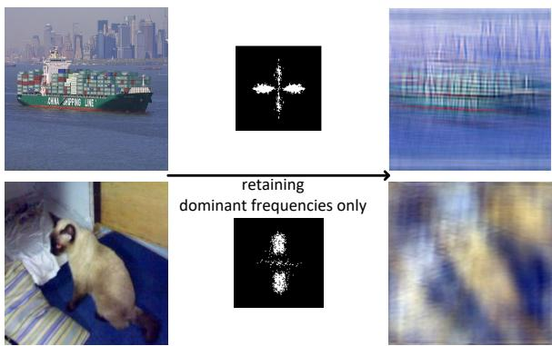
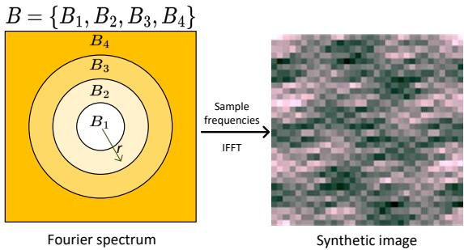
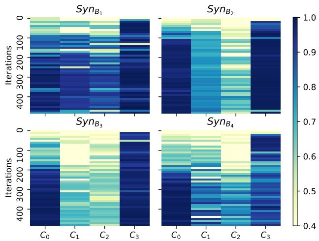
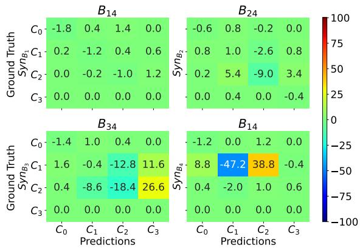
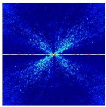
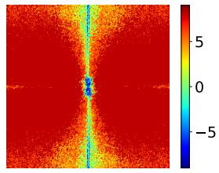
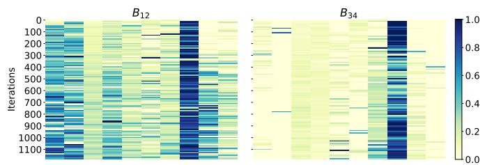
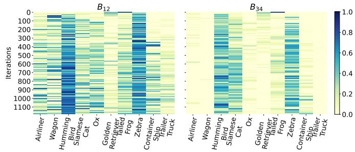
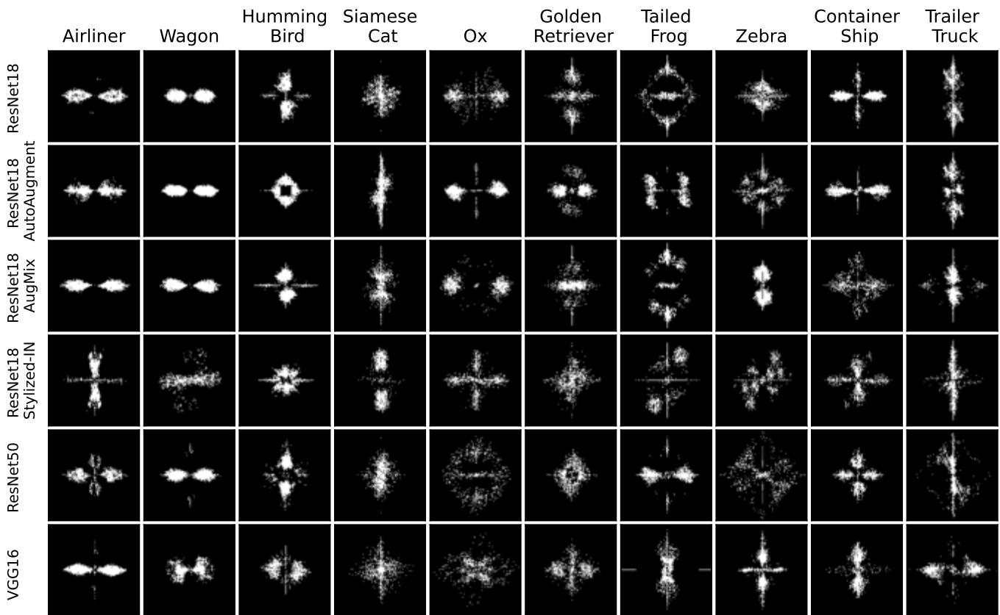
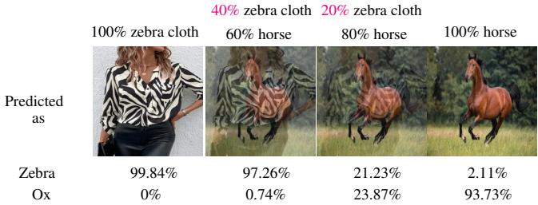

# What do neural networks learn in image classification? A frequency shortcut perspective

Shunxin Wang

Raymond Veldhuis Christoph Brune University of Twente, The Netherlands

Nicola Strisciuglio

## Abstract

Frequency analysis is usefulfor understanding the mechanisms ofrepresentation learning in neural networks (NNs). Most research in this area focuses on the learning dynamics of NNs for regression tasks, while little for classification. This study empirically investigates the latter and expands the understanding of frequency shortcuts. First, we perform experiments on synthetic datasets, designed to have a bias in different frequency bands. Our results demonstrate that NNs tend to find simple solutions for classification, and what they learn first during training depends on the most distinctive frequency characteristics, which can be either low- or high-frequencies. Second, we confirm this phenomenon on natural images. We propose a metric to measure class-wise frequency characteristics and a method to identify frequency shortcuts. The results show that frequency shortcuts can be texturebased or shape-based, depending on what best simplifies the objective. Third, we validate the transferability of frequency shortcuts on out-of-distribution (OOD) test sets. Our results suggest that frequency shortcuts can be transferred across datasets and cannot be fully avoided by larger model capacity and data augmentation. We recommend that future research should focus on effective training schemes mitigating frequency shortcut learning. Codes and data are available at https://github.com/ nis-research/nn-frequency-shortcuts.

## 1. Introduction

Deep neural networks (DNNs) have been widely used to tackle problems in many fields, e.g. medical data analysis, self-driving vehicles, robotics, and surveillance. However, the underlying predictive processes of DNNs are not completely understood due to the black-box nature of their nonlinear multilayer structure [3]. While a DNN can approximate any function [23], its (hundreds of) millions of parameters limit the understanding of function approximation process. Analyzing the learned features is a viable way to understand what triggers the predictions, although explaining how DNNs process data needs further exploration [28].

  
Figure 1: Images of ‘container ship’ and ’siamese cat’ and their DFM-filtered versions with only top-5% dominant frequencies (the white dots in the central figures) retained can both be recognized correctly by NNs.

Researchers worked on explaining the predictions of NNs in terms of their input, using Saliency [27], Gradientweighted Class Activation Mapping [25] and Layer-wise Relevance Propagation [2]. These techniques highlight the area of an image that contributes to prediction but do not explain why the performance of NNs degrades on OOD data. Recently, an interest in understanding the learning dynamics of NNs from a frequency perspective has grown. NNs are found to learn lower frequencies first in regression tasks [23], as they carry most of the needed information to reconstruct signals [35]. Thus NNs tend to fit lowfrequency functions first to data [17]. This biased learning behavior is known as simplicity bias [26], which induces the NNs to learn simple but effective patterns, i.e. shortcuts solutions that disregard semantics related to the problem at hand but are simpler for solving the optimization task. For instance, the frequency shortcuts proposed in [31] are sets of frequencies used specifically to classify certain classes.

In this work, we empirically analyze the learning dynamics of NNs for image classification and relate it to simplicity-bias and shortcut learning from a frequency perspective. Our results indicate that simplicity-biased learning in NNs leads to frequency-biased learning, where the NNs exploit specific frequency sets, namely frequency shortcuts, to facilitate predictions. These frequency shortcuts are data-dependent and can be either texture-based or shape-based, depending on what best simplifies the objective function (e.g. a unique color, texture, or shape associated with a particular class in a dataset, without necessarily other meaningful semantics). This may impact generalization. We demonstrate this phenomenon through texturebased and shape-based frequency shortcuts in Fig. 1. When we retain only specific subsets of frequencies (identified using a method proposed in this paper) from images of ‘container ship’ and ‘siamese cat’, the classifier can recognize them correctly. Interestingly, when the same sets of frequencies are retained from images of other classes, the predictions are biased towards these two classes, indicating that the frequency sets are specific for their classification.

Different from previous work on regression tasks [23], we investigate the learning dynamics and frequency shortcuts in NNs for image classification. Compared to the work uncovering frequency shortcuts [31], we expand the understanding of them and demonstrate that they can be texture, shape, or color, depending on data characteristics. We propose a metric to compare the frequency characteristics of data and investigate systematically the impact of present/absent shortcut features on OOD generalization. In summary, our contributions are:

1. We complement existing studies that showed NNs for regression tasks are biased towards lowfrequency [23]. For classification, we find that NNs can exhibit different frequency biases, tending to adopt frequency shortcuts based on data characteristics because of simplicity-bias learning. Our analysis provides valuable insights into the learning dynamics of NNs and the factors influencing their behavior.

2. We propose a method to identify frequency shortcuts, based on culling frequencies that contribute less to classification. These shortcuts are composed of specific frequency subsets that correspond to textures, shapes, or colors, providing further insight into the texture-bias identified by Geirhos et al. [12] and background-dependency found in [33].

3. We systematically examine the influence of frequency shortcuts on the generalization of NNs and find that the presence of frequency shortcut features in an OOD test set may give an illusion of improved generalization. Furthermore, we find that larger model capacity and common data augmentation techniques like AutoAugment [5], AugMix [14], and SIN [11] cannot fully avoid shortcut learning. We recommend further research targeting frequency information to avoid frequency shortcut learning.

## 2. Related works

Frequency analysis. Recently, Fourier interpretations of NNs were published. For regression tasks, NNs tend to learn low-frequency components first [23, 34], while initial layers bias towards high-frequency components [7]. In classification, NNs exhibit a bias towards middle-high frequency during testing [1]. The authors in [1] argued that the importance of frequency is data-driven. Sensitivity to different frequency perturbations was measured in [36], showing that most NNs are more sensitive to middle-high frequency noise. The impact of high-frequency dependence on the robustness of NNs was investigated in [29]. These analyses show that NNs for regression and classification tasks exhibit different frequency dependencies, while there is a lack of analysis on the learning dynamics of NNs for classification. We study what and how NNs learn in classification, highlighting their data-driven behavior and complementing existing work on regression tasks. We uncover that NNs can learn to use specific frequency sets encompassing both low and high frequencies to achieve accurate classification.

Shortcut learning. In classification, decision rules based on spurious correlations between data and ground truth, rather than semantic cues, are known as shortcuts [10]. For example, a network may classify images based on the presence of text embedded in the images, rather than the actual image content [18], negatively impacting generalization [32]. Identifying shortcuts learned by NNs might be helpful to avoid unwanted learning behavior and thus improve generalization. It is easy to identify shortcuts that are artificially added and are visible (e.g. color patches [20], line artefacts [6], or added text [18]). However, for those implicitly existing in data (e.g. particular textures or shapes), their identification is difficult. Most methods focus on mitigating learning shortcut information in data [9, 19, 21, 24], rather than explicitly identifying them. Wang et al. [31] investigated shortcut learning from a frequency perspective and proposed the definition of frequency shortcuts. However, their algorithm for shortcut identification is heavily influenced by the order of frequency removal and their observations are limited to texture-based shortcuts. In this paper, our frequency shortcut identification method does not have such limitations. We broaden the understanding of frequency shortcuts, study the data-dependency of shortcut features, and provide a more systematic analysis of the impact of shortcuts on OOD generalization.

## 3. Frequency shortcuts in image classification

For regression tasks, it is known that NNs are biased towards learning low-frequency components (LFCs) first during training [23]. This has not been verified for classification tasks. Here we study the learning behavior of NNs in image classification and its relation to shortcut learning and simplicity-bias, using both synthetic (Section 3.1) and natural images (Section 3.2). We use synthetic data to study the learning behavior of NNs and show their tendency to discover shortcuts in the frequency domain. Inspired by the insights gained on the synthetic data, we propose a method based on frequency culling to examine the frequency dependency of NNs trained on natural images, which contain intricate frequency information. This allows us to uncover the frequency shortcuts learned by NNs for classification.

## 3.1. Experiments on synthetic data

Design of synthetic datasets. To study the impact of data characteristics on the spectral bias of NNs and frequency shortcut learning, we generate four synthetic datasets, each with a frequency bias in a different band, from low to high. This allows us to examine the effect of different frequency biases on the learning behavior of NNs. We separate evenly the Fourier spectrum into four frequency bands (see Fig. 2). The bands are denoted by $B _ { 1 }$ the lowest frequency band, $B _ { 2 }$ and $B _ { 3 }$ the mid-frequency bands, and $B _ { 4 }$ the highest frequency band. Each dataset contains four classes and images of $3 2 \times 3 2$ pixels. An image is generated by sampling at least eight frequencies from the frequency bands associated with the target class (see Table 1), according to a probability density function:

$$
P r ( r ) = S \cdot { \frac { 1 } { r + 1 } } , \quad \mathrm { w i t h } \ S = { \frac { 1 } { \sum _ { r = 1 } ^ { R } { \frac { 1 } { r + 1 } } } } .
$$

R is the largest radius and $r ~ = ~ \sqrt { u ^ { 2 } + v ^ { 2 } }$ is the radius of frequency $[ u , v ]$ . This prioritizes the sampling of LFCs, mimicking the frequency distribution of natural images.

We use $b \in \cal B = \{ B _ { 1 } , B _ { 2 } , B _ { 3 } , B _ { 4 } \}$ to control the frequency bias in the generated data. For instance, in the dataset $\mathrm { S y n } _ { b }$ with $b = B _ { 1 }$ , the frequency bands for classes $C _ { 0 }$ and $C _ { 1 }$ are $\{ B _ { 2 } , B _ { 3 } , B _ { 4 } \}$ while class $C _ { 3 }$ has frequency band $B _ { 1 }$ . To distinguish between $C _ { 0 }$ and $C _ { 1 }$ , we embed special patterns consisting of a set of frequencies $[ u , v ]$ $( u = v \in \{ 1 , 3 , 5 , 7 , 9 , 1 1 , 1 3 , 1 5 \} )$ ) into the images of class $C _ { 0 }$ which are removed from the images of other classes. The design imposes various levels of classification difficulty by incorporating different levels of data complexity for each class $( C _ { 3 } < C _ { 0 } < C _ { 1 } \approx C _ { 2 } )$ , as observed visually. This aids in comprehending the connection between simplicitybias learning and spectral-bias of NNs in classification.

Hypothesis. As noted in the theory of simplicitybias [26], NNs tend to achieve their objective in the simplest way. As a result, NNs for regression tasks approximate LFCs first compared to HFCs [23, 34, 16, 1]. Based on this, we hypothesize that NNs might prioritize learning to distinguish classes with the most discriminative frequency

  
Figure 2: Evenly separated frequency bands. $B _ { 1 }$ denotes the lowest band and $B _ { 4 }$ denotes the highest one.

Table 1: Design details of a synthetic dataset $\mathrm { S y n } _ { b }$ with $b \in B = \{ B _ { 1 } , B _ { 2 } , B _ { 3 } , B _ { 4 } \}$ . The special pattern contains frequencies $[ u , v ]$ where $u = v \in \{ 1 , 3 , 5 , 7 , 9 , 1 1 , 1 3 , 1 5 \}$ are removed from classes other than $C _ { 0 }$

<table><tr><td>class</td><td>frequency bands</td><td>s special patterns</td></tr><tr><td> $C _ { 0 }$ </td><td> $B - b$ </td><td>√</td></tr><tr><td> $C _ { 1 }$ </td><td> $B - b$ </td><td></td></tr><tr><td> $C _ { 2 }$ </td><td>B</td><td></td></tr><tr><td> $C _ { 3 }$ </td><td>b</td><td></td></tr></table>

characteristics in classification. Thus, what the NNs first learn could depend on data bias rather than being limited to low frequencies. This learning behavior could result in frequency shortcut learning, where the NNs focus on specific frequencies to achieve their objective in a simpler way.

Data characteristics influence what NNs learn first. We conduct experiments on the synthetic data to test this hypothesis. We train ResNet18 models on the synthetic datasets and expect they can distinguish classes like $C _ { 0 }$ and $C _ { 3 }$ easily and from the early stages of training, as they carry more distinctive characteristics than others. To evaluate this, we measure their classification performance in the first 500 iterations of training by computing the $_ \mathrm { F _ { 1 } - s c o r e }$ per class. This provides insight into whether each class is correctly classified and how many false positives each class attracts. We report the obtained $F _ { \mathrm { 1 } } { \mathrm { - s c o r e s } }$ (see Fig. 3) and observe that for class $C _ { 3 }$ (with a clear frequency bias), the $F _ { \mathrm { 1 } } { \mathrm { - s c o r e } }$ is generally higher than other classes in the first few iterations, indicating that it is immediately distinguished from others across the four synthetic datasets, followed by class $C _ { 0 }$ . This finding suggests that the more distinguishable characteristics of class $C _ { 3 }$ play an important role in driving the learning behavior of NNs. Note that, despite the bias in different bands across the four synthetic datasets, class $C _ { 3 }$ is always learned first, indicating that NNs can learn either low- or high-frequency early in training if they are more discriminative than other frequencies.

  
Figure 3: $F _ { \mathrm { 1 } } { \mathrm { - s c o r e s } }$ of each class in the first 500 training iterations. $C _ { 3 }$ has higher $F _ { \mathrm { 1 } } { \mathrm { - s c o r e s } }$ than others at the early training stage, meaning that it is learned first even if it only has frequencies sampled from the highest frequency band.

Thus, what frequencies are learnedfirst by NNs in classification is driven by simplicity-bias and data characteristics.

Data bias and simplicity bias can lead to frequency shortcuts. Based on the frequency characteristics of the synthetic datasets, we examine how NNs find shortcuts in the Fourier domain by comparing the classification results of the NNs tested on the original synthetic datasets and their band-stop versions where two frequency bands in B are removed. We report the results using relative confusion matrices (see Fig. 4), computed as:

$$
\Delta ^ { C _ { i } , C _ { j } } = ( P r e d _ { b s } ^ { C _ { i } , C _ { j } } - P r e d _ { o r g } ^ { C _ { i } , C _ { j } } ) / N _ { c } \times 1 0 0 ,
$$

where $P r e d _ { b s } ^ { C _ { i } , C _ { j } }$ is the number of samples from class $C _ { i }$ in the band-stopped test set predicted as class $C _ { j } , P r e d _ { o r g } ^ { C _ { i } , C _ { j } }$ is the equivalent on the original test set, and $N _ { C }$ is the number of samples in class $C _ { i }$

As $\Delta ^ { C _ { i } , C _ { i } } ~ ( i ~ = ~ 0 , 1 , 2 , 3 )$ is larger than or equal to zero, the performance of the model improves or remains the same on the band-stop test sets, indicating that the limited bands provide enough discriminative information for classification, while negative values indicate lower performance. Class $C _ { 2 }$ in the four synthetic datasets is designed to contain frequencies from all bands. If a model can predict class $C _ { 2 }$ using only frequencies from partial bands instead of considering frequencies across the whole spectrum, then it is considered to likely be using frequency shortcuts to classify $C _ { 2 }$ . Observed from Fig. $4 , \bar { \Delta } ^ { C _ { 2 } , \bar { C } _ { 2 } }$ are -1 and 1 for models trained on $S y n _ { B _ { 1 } }$ and $S y n _ { B _ { 4 } }$ respectively. The good performance indicates that NNs apply frequency shortcuts in the limited bands for classifying samples of $C _ { 2 }$ . Moreover, $\Delta ^ { C _ { 0 } , C _ { 0 } }$ of models trained on the four synthetic datasets are close to $0 ,$ demonstrating that the NNs can recognize samples of $C _ { 0 }$ when only part of the frequencies (shortcuts) associated with the special patterns are present in the test data. Similar behaviors are observed for other architectures (see results of AlexNet and VGG in the supplementary material). To summarize, the NNs trained on the four synthetic datasets use frequency differently, but they all adopt frequency shortcuts depending on the data characteristics.

  
Figure 4: Relative confusion matrices of models tested on different band-stop synthetic datasets (e.g. $B _ { 1 4 }$ indicates the bands $B _ { 1 }$ and $B _ { 4 }$ are used). The top-left figure shows the comparison of the results on the original test set and its band-stopped version for the model trained on $S y n _ { B _ { 1 } }$ Other matrices show the results of other models. Most $\Delta ^ { C _ { i } , C _ { i } } ~ ( i = 0 , 1 , 2 , 3 )$ values are close to or larger than 0, indicating good performance on band-stopped datasets due to learned frequency shortcuts.

## 3.2. Experiments on natural images

The synthetic experiments show frequency characteristics of data affect what NNs learn. To analyze the more intricate frequency distributions of natural images, we introduce a metric to compare the average frequency distributions of individual classes within a dataset. This facilitates the identification of discriminative and simple classspecific frequency characteristics to learn early in training. While this metric provides valuable insights into the potential learning behavior, a deeper examination of frequency usage by NNs is also needed. To this end, we propose a technique based on frequency culling, which can help uncover frequency shortcuts explicitly. Additionally, we investigate how model capacity and data augmentation impact shortcut learning. As NNs are found to exhibit texturebias [12] on natural images, we specifically augment data using SIN to create a dataset with more shape-bias. This better demonstrates how texture-/shape-biased data characteristics affect frequency shortcut learning.

A frequency distribution comparison metric. From the insights gained on the synthetic experiments, we recognize the importance to examine the frequency characteristics of individual classes within a dataset to understand comprehensively what NNs learn. Thus, we devise a metric called Accumulative Difference of Class-wise average Spectrum (ADCS), which considers that NNs are amplitude-dependent for classification [4]. We compute the average amplitude spectrum difference per channel for each class within a set $C = \{ c _ { 0 } , c _ { 1 } , \ldots , c _ { n } \}$ and average it into a one-channel ADCS. The ADCS for class $c _ { i }$ at a frequency $( u , v )$ is calculated as:

$$
A D C S ^ { c _ { i } } ( u , v ) = \sum _ { \forall _ { c _ { j } \in C } \atop c _ { j } \neq c _ { i } } s i g n ( E _ { c _ { i } } ( u , v ) - E _ { c _ { j } } ( u , v ) ) ,
$$

where

$$
E _ { c _ { i } } ( u , v ) = \frac { 1 } { | X ^ { i } | } \sum _ { x \in X ^ { i } } | \mathcal { F } _ { x } ( u , v ) |
$$

is the average Fourier spectrum for class $c _ { i } ,$ x is an image from the set $X ^ { i }$ of images contained in that class, and $\mathcal { F } _ { x } ( u , v )$ is its Fourier transform. $A D C S ^ { c _ { i } } ( u , v )$ ranges from $\mathrm { ~ 1 ~ - ~ } | C | \mathrm { ~ t o ~ } | C | - 1$ . A higher value indicates that a certain class has more energy at a specific frequency than other classes.

Impact of class-wise frequency distribution on the learning process of NNs. We choose ImageNet-10 [15], a reduced version of ImageNet [8] for the following analysis. It has lower computational requirements and greater manageability, compared to the full ImageNet dataset. For larger datasets with more classes, one may expect severer shortcut learning behaviors, as the NNs will tend to find quick solutions to simplify a more difficult classification problem.

Using ADCS, we find that the classes ‘humming bird’ and ‘zebra’ possess certain distinctive frequency characteristics that can be readily exploited by models to distinguish them from other classes at early training stages. The resulting ADCS of ‘humming bird’ (see Fig. 5a) indicates that samples from this class have on average much less energy than other classes across almost the whole spectrum. Conversely, the ADCS of ‘zebra’ (see Fig. 5b) reveals that images from this class have a marked energy preponderance in the middle and high frequencies, as indicated by the prominence of red color in these frequency ranges.

To verify the impact of such frequency characteristics on the learning behavior, we train NNs on ImageNet-10. We inspect the frequency bias in the early training phase, by testing models on low- and high-pass versions of the dataset for the first 1200 training iterations, rather than the original test set. We compute the recall and precision of each class and observe that the precision of class ‘zebra’ (see Fig. 6a)

  
(a) $A D C S ^ { h u m m i n g \ b i r d }$

  
(b) $A D C S ^ { z e b r a }$

Figure 5: ADCS of classes ‘humming bird’ and ‘zebra’.  

(a) Precision of each class in the first 1200 iterations.  
  
(b) Recall of each class in the first 1200 iterations).  
Figure 6: Precision and recall rates of ResNet18 trained on ImageNet-10 for the first 1200 iterations.

and the recall of class ‘humming bird’ (see Fig. 6b) are generally higher than those of other classes. This shows that these two classes are learned faster than others. In summary, our findings indicate that NNs for classification can learn and exploit substantial spectrum differences among classes, which serve as highly discriminative features at the early learning stage. This further supports our previous observations in synthetic datasets that what is learnedfirst by NNs is influenced by the frequency characteristics of data.

A frequency shortcut identification method. To identify frequency shortcuts, we propose a method based on culling irrelevant frequencies, similar to the analysis strategy in [1]. We measure the relevance of each frequency to classification by recording the change in loss value when testing a model on images of a certain class with the concerned frequency removed from all channels. The increment in loss value is used as a score to rank the importance of frequencies for classification. Frequencies with higher scores are considered more relevant for classification, as their absence causes a large increase in loss. We compute a one-channel dominant frequency map (DFM) for a class by selecting the top-X% frequencies according to the given ranking. Using the DFMs, we study the effect of dominant frequencies on image classification and the extent to which they indicate frequency shortcuts (specific sets of frequencies leading to biased predictions for certain classes). To quantify these, we classify all images in the test set retaining only the top-X% frequencies of a certain class (i.e. top-X% DFM-filtered test set). We calculate the true positive rate (TPR) and false positive rate (FPR) to evaluate their discrimination power and specificity for a certain class, respectively. We consider classes with high TPR and FPR as instances where the classifier is induced to learn and apply frequency shortcuts.

  
Figure 7: Dominant frequency maps of ResNet18 (with AutoAugment/AugMix/SIN), ResNet50 and VGG16. The maps show the top-5% dominant frequencies of each class in ImageNet-10.

Frequency shortcuts can be texture- or shape-based. We show the DFMs with the top-5% frequencies for ResNet(s) trained w/o or w/ augmentation (AutoAugment, AugMix, and SIN) and VGG16 in Fig. 7 (more DFMs are in the supplementary material). In Table 2, we report the TPR and FPR of models tested on the original and the top-5% DFM-filtered test sets. For ResNet18, the TPR and FPR of classes ‘zebra’ and ‘container ship’ are higher than other classes, indicating that the model applies frequency shortcuts for these two classes. Similarly, for ResNet18 trained with SIN which replaces object textures to emphasize shape information, the model learns a frequency shortcut for class ‘siamese cat’. In Fig. 1, we show examples of ‘container ship’ and ‘siamese cat’ images, their corresponding DFMs, and the images retaining only the frequencies in the DFMs, which contain textures, shapes, or colors that would not be used alone by human observers to classify images, but that NNs can exploit solely due to frequency shortcut learning.

Learned frequency shortcuts might prevent NNs from learning meaningful semantics. We show an example of a person dressed in zebra-pattern clothes predicted as ‘zebra with high confidence, and an image of a ‘horse’ predicted as ‘zebra’ with low confidence in Fig. 8. Mixing the images of ‘zebra cloth’ and ‘horse’ increases the confidence of being predicted as ‘zebra’, indicating that the model mainly uses texture information and ignores almost any shape information of ‘zebra’, potentially impairing generalization. As shown above, the class ‘zebra’ is easily recognized early in the training, suggesting that learned frequency shortcuts impede the learning of other important semantics, e.g. the shape or other morphological features of the animal. The learned frequency shortcuts are impacted significantly by the frequency characteristics of data. They can be texturebased or shape-based and might hinder NNs from learning more meaningful semantics. There might be cases where frequency shortcuts are not in the data and thus not learned.

Table 2: ID test: TPRs and FPRs on ImageNet-10 and the top-5% DFM-filtered versions (w/ df).
<table><tr><td colspan="10">ImageNet-10</td></tr><tr><td>Model</td><td></td><td>airliner</td><td>wagon</td><td>humming bird</td><td>siamese cat</td><td>0X</td><td>golden retriever</td><td>tailed frog</td><td>zebra</td><td>container ship</td><td>trailer truck</td><td>average</td></tr><tr><td>ResNet18</td><td>FPR</td><td>TPR</td><td>0.96 0.0044</td><td>0.8 0.94 0 0.0178</td><td>0.98 0.0067</td><td>0.92 0.0156</td><td>0.9 0.0022</td><td>0.84 0.0044</td><td>0.96 0.0022</td><td>0.94 0.0133</td><td>0.96 0.0222</td><td>0.92</td></tr><tr><td rowspan="3">ResNet18+AutoAug</td><td>w/ df</td><td>TPR</td><td>0.08 0 0</td><td>0.4 0.02</td><td>0.8 0.0356</td><td>0.02</td><td>0.02</td><td>0.14</td><td>0.8</td><td>0.54</td><td>0.06</td><td></td></tr><tr><td>FPR</td><td></td><td>0.0044 0.92</td><td></td><td></td><td>0.0311</td><td>0.0044</td><td>0.0022</td><td>0.1178</td><td>0.1889</td><td>0.0022</td><td></td></tr><tr><td>TPR FPR</td><td></td><td>0.76 0.0089 0</td><td>0.88 0.0289</td><td>0.92 0.0089</td><td>0.96 0.0267</td><td>0.84 0.0111</td><td>0.66 0.0044</td><td>0.94 0.0067</td><td>0.94 0.0222</td><td>0.8 0.0356</td><td>0.862</td></tr><tr><td>ResNet18+AugMix</td><td>w/ df</td><td>TPR FPR TPR</td><td>0 0 0.92</td><td>0 0</td><td>0 0</td><td>0.22 0.04 0.0067 0.0222</td><td>0.02 0.0111</td><td>0 0</td><td>0.26 0.0089</td><td>0.18 0.0622</td><td>0 0</td><td></td></tr><tr><td></td><td></td><td>FPR</td><td>0.86 0.0089 0.0022</td><td>0.96 0.0267 0.22</td><td>0.98 0.0022</td><td>0.92 0.0222</td><td>0.88 0.0044</td><td>0.72 0.0044</td><td>0.96 0</td><td>0.92 0.0156</td><td>0.92 0.02</td><td>0.904</td></tr><tr><td>ResNet18+SIN</td><td>w/ df</td><td>TPR FPR</td><td>0.08 0.0067 0.96</td><td>0 0 0.0089</td><td>0.34 0.0267</td><td>0.22 0.1511</td><td>0.24 0.0089</td><td>0.02 0</td><td>0.16 0.0067</td><td>0.88 0.2444</td><td>0.26 0.0067</td><td></td></tr><tr><td></td><td>w/ df</td><td>TPR FPR TPR</td><td>0.0022 0.0022 0.46</td><td>0.86 0.94 0.0178 0</td><td>0.96 0.0111</td><td>0.98 0.0244</td><td>0.86 0</td><td>0.76 0.0044</td><td>0.96 0.0022</td><td>0.96 0.0133</td><td>0.92 0.0156</td><td>0.916</td></tr><tr><td>ResNet50</td><td></td><td>FPR TPR</td><td>0.1267 0.0022 0.9 0.78</td><td>0.18 0.0111 0.86</td><td>0.98 0.5467</td><td>0.06 0.0511</td><td>0.6 0.0822</td><td>00</td><td>0.06 0.0022</td><td>0.06 0.0622</td><td>0.1 0.0133</td><td></td></tr><tr><td></td><td>w/ df</td><td>FPR TPR</td><td>0.0044 0.54</td><td>0.0022 0.02 0</td><td>0.94 0.0044 0.42</td><td>0.86 0.0267</td><td>0.82 0.0089</td><td>0.78 0.0111</td><td>0.94 0.0089</td><td>0.94 0.0244</td><td>0.8 0.0422</td><td>0.862</td></tr><tr><td>VGG16</td><td></td><td>FPR TPR</td><td>00 0.22 0.96 0.84</td><td>0.0022 0.92</td><td>0.04 1</td><td>0 0.0022</td><td>0.2 0.0533</td><td>00</td><td>0.16 0.0489</td><td>0.7 0.2289</td><td>0.1 0.0156</td><td></td></tr><tr><td></td><td></td><td>FPR</td><td>0.0022 0.18</td><td>0.0022 0.0222</td><td>0.0111</td><td>0.9 0.0133</td><td>0.92 0.0044</td><td>0.78 0.0067</td><td>0.96 0.0022</td><td>0.96 0.0133</td><td>0.88 0.02</td><td>0.912</td></tr><tr><td></td><td>w/df TPR FPR</td><td></td><td>00 0.0133</td><td>00</td><td>0.66 0.0444</td><td>0.22 0.1489</td><td>0.12 0.0267</td><td>0.04 0</td><td>0.06 0.0533</td><td>0.7 0.42</td><td>0.22 0.0578</td><td></td></tr></table>

Table 3: Transferability test: TPRs and FPRs of ViT-B on the top-5% DFM (of ResNet18+SIN)-filtered versions.
<table><tr><td colspan="10">ImageNet-10</td></tr><tr><td>Model</td><td></td><td></td><td>airliner</td><td>wagon</td><td>humming bird</td><td>siamese cat</td><td>0X</td><td>golden retriever</td><td>tailed frog</td><td>zebra</td><td>container ship</td><td>trailer truck</td></tr><tr><td>ViT-B</td><td>w/df</td><td>TPR</td><td>0.34</td><td>0.02</td><td>0.28</td><td>0.82</td><td>0.44</td><td>0.72</td><td>0.02</td><td>0.46</td><td>0.92</td><td>0.6</td></tr><tr><td></td><td></td><td>FPR</td><td>0.1933</td><td>0.0022</td><td>0.0067</td><td>0.22</td><td>0.08</td><td>0.0578</td><td>0.0133</td><td>0.0289</td><td>0.2467</td><td>0.0333</td></tr></table>

  
Figure 8: Model classifies zebra-pattern clothes with high confidence but misclassifies horse as ox. Mixing images of ‘zebra cloth’ and ‘horse’ increases the confidence of ‘zebra predictions. This indicates that the model relies on texture over shape information, its ability to generalize and recognize another animal of similar shape but different texture.

Model capacity vs. frequency shortcuts. The high TPR and FPR for ResNet50 in Table 2 indicate that it is subject to frequency shortcuts for the classification of classes ‘airliner’ and ‘container ship’. Compared to ResNet18 frequency shortcut for class ‘zebra’, ResNet50 has lower TPR and FPR, indicating less specific dominant frequencies for classifying ‘zebra’. This demonstrates mitigation of learning a frequency shortcut, although learning another shortcut for class ‘airliner’. Additionally, VGG16 learns a frequency shortcut for class ‘container ship’ (TPR=0.7 and FPR=0.42). We show in the following paragraph that frequency shortcuts affect transformers as well, indicating that shortcuts impact networks across different model capacities and architectures. Thus, larger models cannot necessarily avoid it. This commonality shows that frequency shortcut learning is data-driven, which needs to be considered more explicitly to learn generalizable models.

Transferability of frequency shortcuts. We trained ViT-B on ImageNet-10 and tested it on images processed with the DFMs we had computed for ResNet18+SIN. This tests the dependency of ViT predictions on small sets of frequency, and the transferability of shortcuts between models or architectures. We present the results in Table 3 and observe shortcuts for the classes ‘siamese cat’ (TPR=0.82, FPR=0.22) and ‘container ship’ (TPR=0.92, FPR=0.25). Though having a large model capacity, ViT-B is also subject to frequency shortcuts (shape or texture) to classify the samples of certain classes, in line with the observation in [22]. Moreover, the frequency shortcuts learned by ResNet18+SIN can be exploited by ViT-B, further indicating that frequency shortcuts are data-driven and can be transferred between models.

Table 4: OOD test: TPRs and FPRs on ImageNet-SCT and the top-5% DFM-filtered versions (w/ df).
<table><tr><td></td><td colspan="10">ImageNet-SCT</td></tr><tr><td>Model</td><td></td><td></td><td>military aircraft</td><td>car</td><td>lorikeet</td><td>tabby cat</td><td>holstein</td><td>labrador retriever</td><td>tree frog</td><td>horse</td><td>fishing vessel fire truck</td><td>average</td></tr><tr><td>ResNet18</td><td>TPR FPR</td><td></td><td></td><td>0.4143 0.4429 0.0397 0.1952</td><td>0.2714 0.0921</td><td>0.3286 0.0746</td><td>0.4 0.0587</td><td>0.4143 0.0429</td><td>0.0286 0.019</td><td>0.4286 0.0238</td><td>0.6143 0.0778</td><td>0.3672</td></tr><tr><td></td><td>w/ df</td><td></td><td></td><td>0.2143 0.054</td><td>0.1286 0.0556</td><td>0.0429 0.0683</td><td>0.0286 0.0238</td><td>0.0571 0.0063</td><td>0.1286 0.0889</td><td>0.2143 0.3397</td><td>0 0.0016</td><td></td></tr><tr><td>ResNet18+AutoAug</td><td>FPR TPR</td><td>0.0016</td><td></td><td>0.6571 0.5143</td><td>0.4</td><td>0.4857</td><td>0.4286</td><td>0.3286</td><td>0</td><td>0.4</td><td>0.6143</td><td>0.4229</td></tr><tr><td></td><td>FPR</td><td>0.0603</td><td></td><td>0.0667 0.1619</td><td>0.0937</td><td>0.1</td><td>0.0444</td><td>0.0302</td><td>0.0079</td><td>0.0143</td><td>0.0619</td><td></td></tr><tr><td>w/df</td><td>TPR</td><td>00</td><td></td><td></td><td>0.0429</td><td>0.2143</td><td>0.0429</td><td>0.0143</td><td>0.0286</td><td>0.0429</td><td>0.0857</td><td></td></tr><tr><td></td><td>FPR</td><td></td><td></td><td></td><td>0.0444</td><td>0.1016</td><td>0.0413</td><td>0</td><td>0.0079</td><td>0.0778</td><td>0.0127</td><td></td></tr><tr><td>ResNet18+AugMix</td><td></td><td>TPR</td><td>0.3571</td><td>0.7286</td><td>0.4143 0.2714</td><td>0.3857</td><td>0.4429</td><td>0.3571</td><td>0.0286</td><td>0.4143</td><td>0.5571</td><td>0.3957</td></tr><tr><td></td><td></td><td>FPR</td><td>0.0984</td><td>0.1159</td><td>0.1254 0.081</td><td>0.0889</td><td>0.054</td><td>0.0397</td><td>0.0111</td><td>0.0175</td><td>0.0397</td><td></td></tr><tr><td></td><td>w/ df</td><td>TPR FPR</td><td>0 0.0048</td><td>00</td><td>0.1143 0.0095 0.0365</td><td>0.0429 0.1</td><td>0.2 0.081</td><td>00</td><td>0 0.0111</td><td>0. </td><td>0.1429 0.1016</td><td></td></tr><tr><td>ResNet18+SIN</td><td></td><td>TPR</td><td>0.3857</td><td>0.6</td><td>0.4286 0.4914</td><td>0.6286</td><td>0.5714</td><td>0.4571</td><td>0</td><td>0.6429</td><td>0.6857</td><td>0.48714</td></tr><tr><td></td><td>w/ df</td><td>FPR TPR</td><td>0.0333 0.0429</td><td>0.0444 0</td><td>0.1016 0.0476 0.0714</td><td>0.1159</td><td>0.0635</td><td>0.0492</td><td>0.0222</td><td>0.0127</td><td>0.0794</td><td></td></tr><tr><td></td><td></td><td>FPR</td><td>0.0349</td><td>0.0016</td><td>0.9286 0.0222 0.7444</td><td>0.0714 0.0492</td><td>0.1714 0.1016</td><td>00</td><td>0 0.0159</td><td>0.0429 0.1127</td><td>0.0286 0.0095</td><td></td></tr><tr><td>ResNet50</td><td></td><td>TPR FPR</td><td>0.4286 0.1444</td><td>0.4857 0.054</td><td>0.4143 0.2 0.0651</td><td>0.3714</td><td>0.3</td><td>0.3</td><td>0.0571</td><td>0.4429 0.0333</td><td>0.7429 0.0921</td><td>0.3743</td></tr><tr><td></td><td></td><td></td><td></td><td></td><td>0.0952</td><td>0.0984</td><td>0.0492</td><td>0.0365</td><td>0.027</td><td></td><td></td><td></td></tr><tr><td></td><td>w/ df</td><td>TPR</td><td>0.2429</td><td>0 0.0571</td><td>0.0429</td><td></td><td>0.2</td><td>0</td><td>0</td><td>0.4857</td><td>0.0429</td><td></td></tr><tr><td></td><td></td><td>FPR</td><td>0.127</td><td>0 0.0032</td><td>0.0206</td><td>00</td><td>0.1444</td><td>0.0016</td><td>0.0159</td><td>0.3222</td><td>0.0111</td><td></td></tr><tr><td>VGG16</td><td></td><td></td><td></td><td></td><td></td><td></td><td></td><td></td><td></td><td></td><td></td><td></td></tr><tr><td></td><td></td><td></td><td></td><td></td><td></td><td></td><td></td><td></td><td></td><td></td><td></td><td></td></tr><tr><td></td><td>TPR</td><td></td><td>0.5143</td><td>0.6571 0.4714</td><td>0.3</td><td>0.3571</td><td>0.3714</td><td>0.5143</td><td>0.0286</td><td>0.5286</td><td>0.5</td><td>0.4242</td></tr><tr><td></td><td></td><td>FPR</td><td>0.0841</td><td>0.0714 0.1238</td><td>0.073</td><td></td><td></td><td></td><td></td><td></td><td>0.0524</td><td></td></tr><tr><td></td><td></td><td></td><td></td><td></td><td></td><td>0.0905</td><td>0.0492</td><td>0.0698</td><td>0.0143</td><td>0.0111</td><td></td><td></td></tr><tr><td></td><td></td><td></td><td></td><td></td><td></td><td></td><td></td><td></td><td></td><td></td><td></td><td></td></tr><tr><td></td><td></td><td></td><td></td><td>0.0286</td><td>0.2571</td><td></td><td></td><td></td><td></td><td></td><td></td><td></td></tr><tr><td></td><td></td><td></td><td>0.0143</td><td></td><td></td><td>0.2143</td><td>0.1429</td><td>0.0143</td><td>0.0286</td><td>0.4571</td><td>0.0429</td><td></td></tr><tr><td></td><td>w/ df</td><td></td><td></td><td></td><td></td><td></td><td></td><td></td><td></td><td></td><td></td><td></td></tr><tr><td></td><td></td><td></td><td></td><td></td><td>0.2048</td><td>0.1079</td><td></td><td>0</td><td></td><td></td><td></td><td></td></tr><tr><td></td><td></td><td></td><td></td><td></td><td></td><td></td><td>0.0857</td><td></td><td>0.0333</td><td>0.4079</td><td>0.0571</td><td></td></tr><tr><td></td><td></td><td></td><td></td><td></td><td></td><td></td><td></td><td></td><td></td><td></td><td></td><td></td></tr><tr><td></td><td></td><td></td><td></td><td></td><td></td><td></td><td></td><td></td><td></td><td></td><td></td><td></td></tr><tr><td></td><td></td><td></td><td></td><td></td><td></td><td></td><td></td><td></td><td></td><td></td><td></td><td></td></tr><tr><td></td><td></td><td></td><td></td><td></td><td></td><td></td><td></td><td></td><td></td><td></td><td></td><td></td></tr><tr><td></td><td></td><td>TPR FPR</td><td>0.0032</td><td>0 0</td><td>0.0032</td><td></td><td></td><td></td><td></td></table>

Data augmentation vs. frequency shortcuts. As common techniques to improve generalization performance, we investigate the effect of data augmentation in mitigating frequency shortcut learning. We train ResNet18 with these techniques and report the results in Table 2. AugMix worsens the learned frequency shortcut for ‘container ship’, but mitigates a frequency shortcut for ‘zebra’. AutoAugment partially avoids the frequency shortcuts for both ‘zebra’ and ‘container ship’. SIN causes a frequency shortcut for ‘siamese cat’. To summarize, appropriate data augmentation may partially reduce frequency shortcut learning, but NNs still tend to find shortcut solutions based on the characteristics of the augmented data.

## 4. Frequency shortcuts and OOD tests

Design of OOD test: ImageNet-SCT. To assess how frequency shortcuts affect OOD generalization, we construct a new test set based on previous analysis results, ImageNet-SCT (ShortCut Tests). It consists of 10 classes, each containing 70 images with seven different image styles, including art, cartoon, deviantart, painting, sculpture, sketch, toy. This dataset expands the coverage of ImageNet-R [13] in terms of image variations. The classes in ImageNet-SCT are related, to some extent, to those in ImageNet-10. For instance, ‘zebra’ in ImageNet-10 corresponds to ‘horse in ImageNet-SCT, allowing us to test the effect of an absent texture-based shortcut feature, as horse images contain animals with a very similar shape to zebras, but with no texture. Similarly, ’siamese cat’ in ImageNet-10 corresponds to ’tabby cat’ in ImageNet-SCT, to test the effect of a present shape-based shortcut feature. Furthermore, ‘container ship’ in ImageNet-10 maps to ‘fishing vessel’ in ImageNet-SCT, which contains images with similar textures and somehow different shapes (fishing vessels are much smaller boats), enabling us to evaluate the effect of a present texture-based shortcut. Examples of ImageNet-SCT images are provided in the supplementary material.

Frequency shortcuts can impair generalization and create the illusion of improved performance. We test the NNs on ImageNet-SCT and its DFM-filtered versions with the top-5% dominant frequencies. From the results on the original ImageNet-SCT, we observe a considerable average drop of TPR for all models (see Table 4). Larger model capacity and data augmentations may not always effectively address frequency shortcuts in certain classes, as observed for ‘siamese cat’, ‘zebra’, and ‘container ship’ in ImageNet-10 (corresponding to ‘tabby cat’, ‘horse’, and ‘fishing vessel’ in ImageNet-SCT). For example, models relying on texture-based shortcut features for ‘zebra’ in ImageNet-10 fail to capture shape characteristics and perform poorly on similar-shaped animals like ‘horse’ in ImageNet-SCT (see Fig. 8). While data augmentations can partially mitigate this effect in ID tests, OOD results for ‘horse’ still indicate the presence of learned frequency shortcuts. Conversely, ‘tabby cat’ and ‘fishing vessel’, which are designed to have similar shape or texture characteristics to their corresponding class in ImageNet-10, exhibit above-average OOD results (higher TPR than average accuracy). Thus, the present shape-based and texture-based shortcut features in the OOD test set are used for classification, giving a false sense of generalization. ‘Fire truck’ in ImageNet-SCT is a good example of generalization, as no shortcuts were identified, allowing models to learn more global and semantic information. Frequency shortcuts can impair generalization and their impact can transfer across datasets, resulting in a misleading impression of generalization with the inclusion of shortcut features in a new test set. Larger models and data augmentation cannot fully counteract these effects, we thus highlight the need to explore novel data augmentation strategies that explicitly target shortcut mitigation, e.g. leveraging DFMs to induce models to exploit more frequencies rather than shortcut frequencies [30] and avoid learning behaviors that may impair the generalizability of NNs.

## 5. Conclusions

We conducted an empirical study to investigate what NNs learn in image classification, by analyzing the learning dynamics of NNs from a frequency shortcut perspective. We found from a synthetic example that NNs learn frequency shortcuts during training to simplify classification tasks, driven by frequency characteristics of data and simplicity-bias. To address this on natural images, we proposed a metric to measure class-wise frequency characteristics and a method to identify frequency shortcuts. We evaluated the influence of shortcuts on OOD generalization and found that frequency shortcuts can be transferred to another dataset, in some cases, giving an illusion of improved generalization. Furthermore, we observed that larger model capacity and data augmentation techniques do not necessarily mitigate frequency shortcut learning. Our study expands previous works on the learning dynamics of NNs for regression tasks, broadens the understanding of frequency shortcuts (which can be either texture-based or shape-based), and provides a more systematic analysis of OOD generalization. We foresee that enhancing the identification of frequency shortcuts and applying proper training schemes that avoid frequency shortcut learning may hold promise in improving generalization.

## Acknowledgements

This work was supported by the SEARCH project (https: //sites.google.com/view/search-utwente), UT Theme Call 2020, Faculty of Electrical Engineering, Mathematics and Computer Science, University of Twente.

## References

[1] Antonio A. Abello, Roberto Hirata, and Zhangyang Wang. Dissecting the high-frequency bias in convolutional neural networks. In Proceedings of the IEEE/CVF Conference on Computer Vision and Pattern Recognition Workshops (CVPRW), pages 863–871, June 2021. 2, 3, 5

[2] Sebastian Bach, Alexander Binder, Gregoire Montavon,´ Frederick Klauschen, Klaus-Robert Muller, and Wojciech¨ Samek. On pixel-wise explanations for non-linear classifier

decisions by layer-wise relevance propagation. PLOS ONE, 10(7):1–46, 07 2015. 1

[3] Vanessa Buhrmester, David Munch, and Michael Arens.¨ Analysis of explainers of black box deep neural networks for computer vision: A survey, 2019. 1

[4] Guangyao Chen, Peixi Peng, Li Ma, Jia Li, Lin Du, and Yonghong Tian. Amplitude-phase recombination: Rethinking robustness of convolutional neural networks in frequency domain. In Proceedings of the IEEE/CVF International Conference on Computer Vision (ICCV), pages 458–467, October 2021. 5

[5] Ekin D. Cubuk, Barret Zoph, Dandelion Mane, Vijay Vasudevan, and Quoc V. Le. Autoaugment: Learning augmentation strategies from data. In Proceedings of the IEEE/CVF Conference on Computer Vision and Pattern Recognition (CVPR), June 2019. 2

[6] Nikolay Dagaev, Brett D. Roads, Xiaoliang Luo, Daniel N. Barry, Kaustubh R. Patil, and Bradley C. Love. A too-goodto-be-true prior to reduce shortcut reliance, 2021. 2

[7] Yatin Dandi and Arthur Jacot. Understanding layer-wise contributions in deep neural networks through spectral analysis, 2021. 2

[8] Jia Deng, Wei Dong, Richard Socher, Li-Jia Li, Kai Li, and Li Fei-Fei. Imagenet: A large-scale hierarchical image database. In 2009 IEEE Conference on Computer Vision and Pattern Recognition, pages 248–255, 2009. 5

[9] Mengnan Du, Varun Manjunatha, Rajiv Jain, Ruchi Deshpande, Franck Dernoncourt, Jiuxiang Gu, Tong Sun, and Xia Hu. Towards interpreting and mitigating shortcut learning behavior of nlu models, 2021. 2

[10] Robert Geirhos, Jorn-Henrik Jacobsen, Claudio Michaelis,¨ Richard Zemel, Wieland Brendel, Matthias Bethge, and Felix A. Wichmann. Shortcut learning in deep neural networks. Nature Machine Intelligence, 2(11):665–673, nov 2020. 2

[11] Robert Geirhos, Patricia Rubisch, Claudio Michaelis, Matthias Bethge, Felix A. Wichmann, and Wieland Brendel. Imagenet-trained cnns are biased towards texture; increasing shape bias improves accuracy and robustness, 2018. 2

[12] Robert Geirhos, Patricia Rubisch, Claudio Michaelis, Matthias Bethge, Felix A. Wichmann, and Wieland Brendel. Imagenet-trained CNNs are biased towards texture; increasing shape bias improves accuracy and robustness. In International Conference on Learning Representations, 2019. 2, 4

[13] D. Hendrycks, S. Basart, N. Mu, S. Kadavath, F. Wang, E. Dorundo, R. Desai, T. Zhu, S. Parajuli, M. Guo, D. Song, J. Steinhardt, and J. Gilmer. The many faces of robustness: A critical analysis of out-of-distribution generalization. In 2021 IEEE/CVF International Conference on Computer Vision (ICCV), pages 8320–8329, Los Alamitos, CA, USA, oct 2021. IEEE Computer Society. 8

[14] Dan Hendrycks\*, Norman Mu\*, Ekin Dogus Cubuk, Barret Zoph, Justin Gilmer, and Balaji Lakshminarayanan. Augmix: A simple method to improve robustness and uncertainty under data shift. In International Conference on Learning Representations, 2020. 2

[15] Hanxun Huang, Xingjun Ma, Sarah Monazam Erfani, James Bailey, and Yisen Wang. Unlearnable examples: Making

personal data unexploitable. In International Conference on Learning Representations, 2021. 5

[16] Jason Jo and Yoshua Bengio. Measuring the tendency of cnns to learn surface statistical regularities, 2017. 3

[17] Zhi-Qin John Xu, Yaoyu Zhang, Tao Luo, Yanyang Xiao, and Zheng Ma. Frequency principle: Fourier analysis sheds light on deep neural networks. Communications in Computational Physics, 28(5):1746–1767, 2020. 1

[18] S. Lapuschkin, S. Waldchen, A. Binder, et al. Unmasking¨ Clever Hans predictors and assessing what machines really learn. Nat Commun 10, 1096, 2019. 2

[19] Matthias Minderer, Olivier Bachem, Neil Houlsby, and Michael Tschannen. Automatic shortcut removal for selfsupervised representation learning, 2020. 2

[20] Meike Nauta, Ricky Walsh, Adam Dubowski, and Christin Seifert. Uncovering and correcting shortcut learning in machine learning models for skin cancer diagnosis. Diagnostics, 12(1), 2022. 2

[21] Mohammad Pezeshki, Sekou-Oumar Kaba, Yoshua Bengio,´ Aaron Courville, Doina Precup, and Guillaume Lajoie. Gradient starvation: A learning proclivity in neural networks. In A. Beygelzimer, Y. Dauphin, P. Liang, and J. Wortman Vaughan, editors, Advances in Neural Information Processing Systems, 2021. 2

[22] Francesco Pinto, Philip H. S. Torr, and Puneet K. Dokania. An impartial take to the cnn vs transformer robustness contest. In Shai Avidan, Gabriel Brostow, Moustapha Cisse,´ Giovanni Maria Farinella, and Tal Hassner, editors, Computer Vision – ECCV 2022, pages 466–480, Cham, 2022. Springer Nature Switzerland. 7

[23] Nasim Rahaman, Aristide Baratin, Devansh Arpit, Felix Draxler, Min Lin, Fred Hamprecht, Yoshua Bengio, and Aaron Courville. On the spectral bias of neural networks. In Kamalika Chaudhuri and Ruslan Salakhutdinov, editors, Proceedings of the 36th International Conference on Machine Learning, volume 97 of Proceedings of Machine Learning Research, pages 5301–5310. PMLR, 09–15 Jun 2019. 1, 2, 3

[24] Joshua Robinson, Li Sun, Ke Yu, Kayhan Batmanghelich, Stefanie Jegelka, and Suvrit Sra. Can contrastive learning avoid shortcut solutions?, 2021. 2

[25] Ramprasaath R. Selvaraju, Michael Cogswell, Abhishek Das, Ramakrishna Vedantam, Devi Parikh, and Dhruv Batra. Grad-CAM: Visual explanations from deep networks via gradient-based localization. International Journal of Computer Vision, 128(2):336–359, oct 2019. 1

[26] Harshay Shah, Kaustav Tamuly, Aditi Raghunathan, Prateek Jain, and Praneeth Netrapalli. The pitfalls of simplicity bias in neural networks. volume 33, pages 9573–9585. Curran Associates, Inc., 2020. 1, 3

[27] Karen Simonyan, Andrea Vedaldi, and Andrew Zisserman. Deep inside convolutional networks: Visualising image classification models and saliency maps, 2013. 1

[28] Erico Tjoa and Cuntai Guan. A survey on explainable artificial intelligence (XAI): Toward medical XAI. IEEE Transactions on Neural Networks and Learning Systems, 32(11):4793–4813, nov 2021. 1

[29] Haohan Wang, Xindi Wu, Zeyi Huang, and Eric P. Xing. High-frequency component helps explain the generalization of convolutional neural networks. In 2020 IEEE/CVF Conference on Computer Vision and Pattern Recognition (CVPR), pages 8681–8691, 2020. 2

[30] Shunxin Wang, Christoph Brune, Raymond Veldhuis, and Nicola Strisciuglio. DFM-X: Augmentation by leveraging prior knowledge of shortcut learning. In International Conference on Computer Vision Workshops (ICCVW), 2023. 9

[31] Shunxin Wang, Raymond Veldhuis, Christoph Brune, and Nicola Strisciuglio. Frequency shortcut learning in neural networks. In NeurIPS 2022 Workshop on Distribution Shifts: Connecting Methods and Applications, 2022. 1, 2

[32] Shunxin Wang, Raymond Veldhuis, Christoph Brune, and Nicola Strisciuglio. Larger is not better: A survey on the robustness of computer vision models against common corruptions. 2023. 2

[33] Kai Xiao, Logan Engstrom, Andrew Ilyas, and Aleksander Madry. Noise or signal: The role of image backgrounds in object recognition, 2020. 2

[34] Zhi-Qin John Xu. Frequency principle: Fourier analysis sheds light on deep neural networks. Communications in Computational Physics, 28(5):1746–1767, jun 2020. 2, 3

[35] Zhi-Qin John Xu and Hanxu Zhou. Deep frequency principle towards understanding why deeper learning is faster, 2020. 1

[36] Dong Yin, Raphael Gontijo Lopes, Jon Shlens, Ekin Dogus Cubuk, and Justin Gilmer. A fourier perspective on model robustness in computer vision. In H. Wallach, H. Larochelle, A. Beygelzimer, F. d'Alche-Buc, E. Fox, and R. Garnett, ed-´ itors, Advances in Neural Information Processing Systems, volume 32. Curran Associates, Inc., 2019. 2