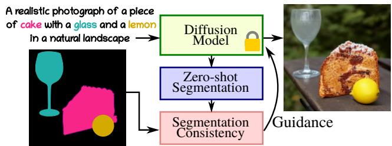
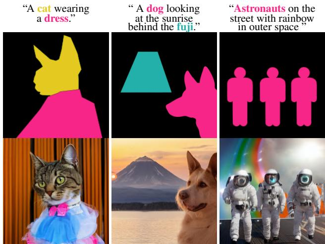
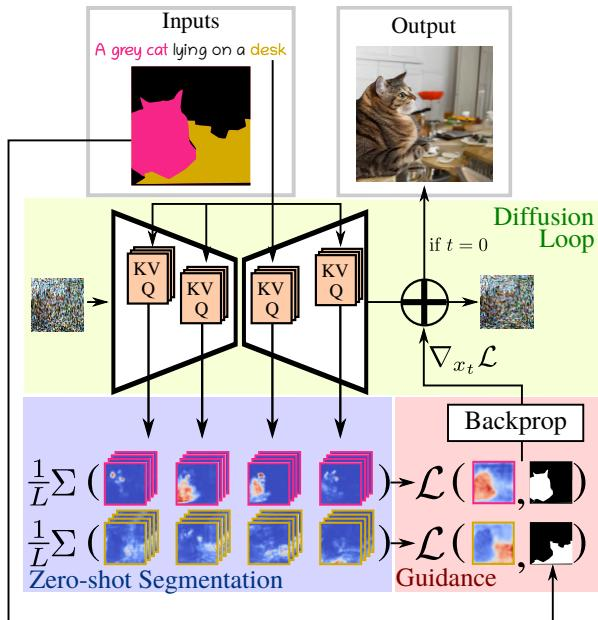
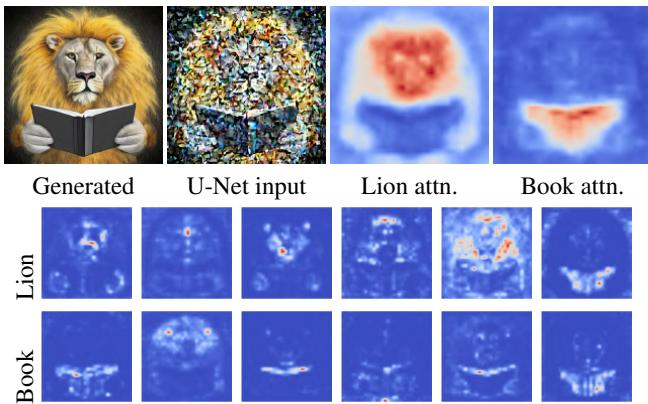
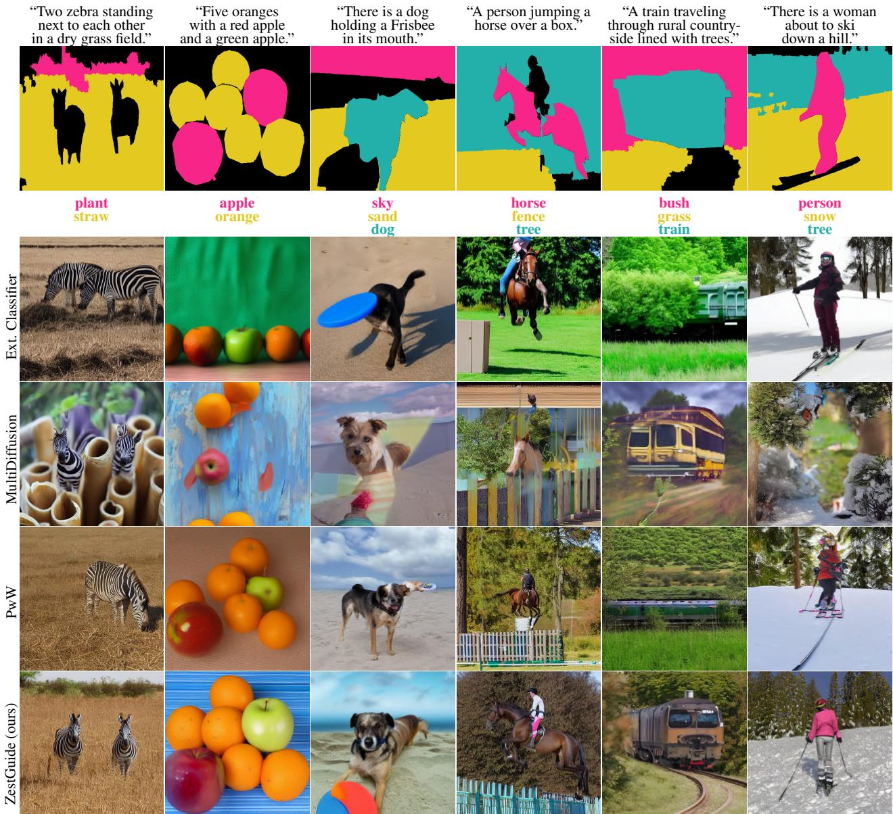
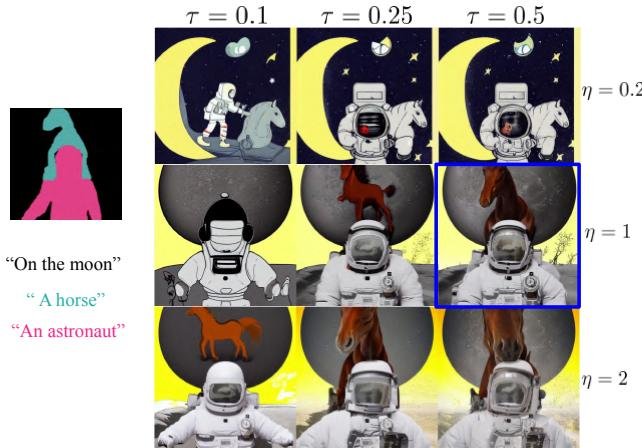
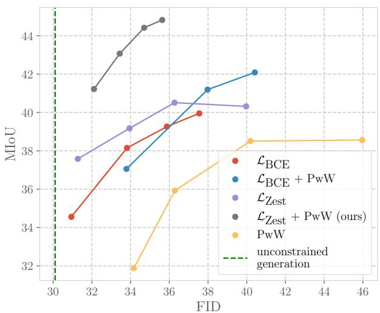

# Zero-shot spatial layout conditioning for text-to-image diffusion models

Guillaume Couairon∗ Meta AI, Sorbonne Universite´

Matthieu Cord Sorbonne Universite, Valeo.ai´

Marlene Careil\` ∗ Meta AI, LTCI, Tel´ ecom Paris, IP Paris´

Stephane Lathuili ´ ere \` LTCI, Tel´ ecom Paris, IP Paris´

Jakob Verbeek Meta AI

## Abstract

Large-scale text-to-image diffusion models have significantly improved the state of the art in generative image modeling and allowfor an intuitive andpowerful user interface to drive the image generation process. Expressing spatial constraints, e.g. to position specific objects in particular locations, is cumbersome using text; and current text-based image generation models are not able to accurately follow such instructions. In this paper we consider image generation from text associated with segments on the image canvas, which combines an intuitive natural language interface with precise spatial control over the generated content. We propose ZestGuide, a “zero-shot” segmentation guidance approach that can be plugged into pre-trained text-to-image diffusion models, and does not require any additional training. It leverages implicit segmentation maps that can be extracted from cross-attention layers, and uses them to align the generation with input masks. Our experimental results combine high image quality with accurate alignment ofgenerated content with input segmentations, and improve over prior work both quantitatively and qualitatively, including methods that require training on images with corresponding segmentations. Compared to Paint with Words, the previous state-of-the art in image generation with zero-shot segmentation conditioning, we improve by 5 to 10 mIoU points on the COCO dataset with similar FID scores.

## 1. Introduction

The ability of diffusion models to generate high-quality images has garnered widespread attention from the research community as well as the general public. Text-to-image models, in particular, have demonstrated astonishing capabilities when trained on vast web-scale datasets [16, 33, 35,

  
Figure 1. In ZestGuide the image generation is guided by the gradient of a loss computed between the input segmentation and a segmentation recovered from attention in a text-to-image diffusion model. The approach does not require any additional training of the pretrained text-to-image diffusion model to solve this task.

37]. This has led to the development of numerous image editing tools that facilitate content creation and aid creative media design [17, 25, 36]. Textual description is an intuitive and powerful manner to condition image generation. With a simple text prompt, even non-expert users can accurately describe their desired image and easily obtain corresponding results. A single text prompt can effectively convey information about the objects in the scene, their interactions, and the overall style of the image. Despite their versatility, text prompts may not be the optimal choice for achieving fine-grained spatial control. Accurately describing the pose, position, and shape of each object in a complex scene with words can be a cumbersome task. Moreover, recent works have shown the limitation of diffusion models to follow spatial guidance expressed in natural language [1, 7].

On the contrary, semantic image synthesis is a conditional image generation task that allows for detailed spatial control, by providing a semantic map to indicate the desired class label for each pixel. Both adversarial [29, 38] and diffusion-based [43, 44] approaches have been explored to generate high-quality and diverse images. However, these approaches rely heavily on large datasets with tens to hundreds of thousands of images annotated with pixel-precise label maps, which are expensive to acquire and inherently limited in the number of class labels.

  
Figure 2. ZestGuide generates images conditioned on segmentation maps with corresponding free-form textual descriptions.

Addressing this issue, Balaji et al. [2] showed that semantic image synthesis can be achieved using a pretrained text-to-image diffusion model in a zero-shot manner. Their training-free approach modifies the attention maps in the cross-attention layers of the diffusion model, allowing both spatial control and natural language conditioning. Users can input a text prompt along with a segmentation map that indicates the spatial location corresponding to parts of the caption. Despite their remarkable quality, the generated images tend to only roughly align with the input segmentation map.

To overcome this limitation, we propose a novel approach called ZestGuide, short for ZEro-shot SegmenTation GUIDancE, which empowers a pretrained text-to-image diffusion model to enable image generation conditioned on segmentation maps with corresponding free-form textual descriptions, see examples presented in Fig. 2. ZestGuide is designed to produce images which more accurately adhere to the conditioning semantic map. Our zero-shot approach builds upon classifier-guidance techniques that allow for conditional generation from a pretrained unconditional diffusion model [13]. These techniques utilize an external classifier to steer the iterative denoising process of diffusion models toward the generation of an image corresponding to the condition. While these approaches have been successfully applied to various forms of conditioning, such as class labels [13] and semantic maps [3], they still rely on pretrained recognition models. In the case of semantic image synthesis, this means that an image-segmentation network must be trained, which (i) violates our zero-shot objective, and (ii) allows each segment only to be conditioned on a single class label. To circumvent the need for an external classifier, our approach takes advantage of the spatial information embedded in the cross-attention layers of the diffusion model to achieve zero-shot image segmentation. Guidance is then achieved by comparing a segmentation extracted from the attention layers with the conditioning map, eliminating the need for an external segmentation network. In particular, ZestGuide computes a loss between the inferred segmentation and the input segmentation, and uses the gradient of this loss to guide the noise estimation process, allowing conditioning on free-form text rather than just class labels. Our approach does not require any training or fine-tuning on top of the text-to-image model.

We conduct extensive experiments and compare our ZestGuide to various approaches introduced in the recent literature. Our results demonstrate state-of-the-art performance, improving both quantitatively and qualitatively over prior approaches. Compared to Paint with Words, the previous state-of-the art in image generation with zero-shot segmentation conditioning, we improve by 5 to 10 mIoU points on the COCO dataset with similar FID scores.

In summary, our contributions are the following:

• We introduce ZestGuide, a zero-shot method for image generation from segments with text, designed to achieve high accuracy with respect to the conditioning map. We employ the attention maps of the crossattention layer to perform zero-shot segmentation allowing classifier-guidance without the use of an external classifier.

• We obtain excellent experimental results, improving over existing both zero-shot and training-based approaches both quantitatively and qualitatively.

## 2. Related work

Spatially conditioned generative image models. Following seminal works on image-to-image translation [20], spatially constrained image generation has been extensively studied. In particular, the task of semantic image synthesis consists in generating images conditioned on masks where each pixel is annotated with a class label. Until recently, GAN-based approaches were prominent with methods such as SPADE [29], and OASIS [38]. Alternatively, autoregressive transformer models over discrete VQ-VAE [28] representations to synthesize images from text and semantic segmentation maps have been considered [14, 16, 34], as well as non-autoregressive models with faster sampling [8, 21].

Diffusion models recently emerged as a powerful class of generative image models, and have also been explored for semantic image synthesis. For example, PITI [43] finetunes GLIDE [27], a large pretrained text-to-image generative model, by replacing its text encoder with an encoder of semantic segmentation maps. SDM [44] trains a diffusion model using SPADE blocks to condition on the input segmentation. LayoutDiffusion [47], instead, trains a diffusion model conditioned on bounding-box layouts.

The iterative decoding process of diffusion models can be biased by so called “guidance” techniques to strengthen the input conditioning. Classifier guidance [13] uses the gradient of a pretrained classifier to guide the generation process for class-conditional image generation. For semantic image synthesis, the gradient of a pretrained semantic segmentation network can be used as guidance [3]. This approach, however, suffers from two drawbacks. First, only the classes recognized by the segmentation model can be used to constrain the image generation, although this can to some extent be alleviated using an open-vocabulary segmentation model like CLIPSeg [23]. Second, this approach requires a full forwards-backwards pass through the external segmentation network in order to obtain the gradient at each step of the diffusion process, which requires additional memory and compute on top of the diffusion model itself.

While there is a vast literature on semantic image synthesis, it is more limited when it comes to the more general task of synthesizing images conditioned on masks with free-form textual descriptions. SpaText [1] finetunes a large pretrained text-to-image diffusion model with an additional input of segments or free-form texts. This representation is extracted from a pretrained multi-modal CLIP encoder [31]: using visual embeddings during training, and swapping to textual embeddings during inference. GLIGEN [22] adds trainable layers on top of a pretrained diffusion models to extend conditioning from text to bounding boxes and pose. Similarly, SceneComposer [45] conditions a diffusion model on a multi-scale text-layout pyramid, and trains using automatically detected image regions. T2I [26] and ControlNet [46] propose to extend a pretrained and frozen diffusion model with small adapters for task-specific spatial control using pose, sketches, or segmentation maps. All these methods require to be trained on a large dataset with segmentation annotations, which is computationally costly.

Train-free adaptation of text-to-image diffusion models. Several recent studies [9, 15, 17, 30] found that the positioning content in generated images from large text-to-image diffusion models correlates with the cross-attention maps, which diffusion models use to condition the denoising process on the conditioning text. This correlation can be leveraged to adapt text-to-image diffusion at inference time for various downstream applications. For example, [9, 15] aim to achieve better image composition and attribute binding. Feng et al. [15] design a pipeline to associate attributes to objects and incorporate this linguistic structure by modifying values in cross-attention maps. Chefer et al. [9] guide the generation process with gradients from a loss aiming at strengthening attention maps activations of ignored objects.

Zero-shot image editing was explored in several works [12, 17, 25, 30]. SDEdit [25] consists in adding noise to an input image, and denoising it to project it to the manifold of natural images. It is mostly applied on transforming sketches into natural images. Different from

SDEdit, in which there is no constraint on which part of the image to modify, DiffEdit [12] proposes a method to automatically find masks corresponding to where images should be edited for a given prompt modification. Promptto-Prompt [17] and pix2pix-zero [30] act on cross-attention layers by manipulating attention layers and imposing a struture-preserving loss on the attention maps, respectively.

Closer to our work, eDiff-I [2] synthesizes images from segmentation maps with local free-form texts by rescaling attention maps at locations specified by the input semantic masks. DirectedDiffusion [24] similarly modifies the attention maps to control object positions. In our experiments we find that this approach is complementary to our gradientguided approach, but that it is worse than ours when used in isolation. MultiDiffusion [4] fuses multiple local generations each conditioned by the text associated with a segment. Thus, unlike our approach, requiring as many denoising steps as there are segments. In [3] the gradient of a pretrained class-based segmentation or detection net guides image generation to respect a spatial layouts during the denoising process. In concurrent work similar to ours, Chen et al. [11] also explore attention-based guidance for zero-shot spatial layout conditioning, albeit using a different type of loss which is applied per layer. Their work is evaluated using bounding box layouts, but could in principle be applied to segmentation layouts as we use in our paper as well.

## 3. Method

## 3.1. Preliminaries

We first briefly introduce diffusion models before presenting our training-free extension of text-to-image models enabeling conditioning on segments with associated text. In Fig. 3 we provide an overview of ZestGuide.

Diffusion models. Diffusion models [19] approximate a data distribution by gradually denoising a random variable drawn from a unit Gaussian prior. The denoising function is trained to invert a diffusion process, which maps sample $\mathbf { X } _ { 0 }$ from the data distribution to the prior by sequentially adding a small Gaussian noise for a large number of timesteps T. In practice, a noise estimator neural network $\epsilon _ { \theta } ( \mathbf { x } _ { t } , t )$ is trained to denoise inputs $\mathbf { x } _ { t } ~ = ~ \sqrt { \alpha _ { t } } \mathbf { x } _ { 0 } + \sqrt { 1 - \alpha _ { t } } \epsilon ,$ which are data points $\mathbf { x } _ { 0 }$ corrupted with Gaussian noise ϵ where $\alpha _ { t }$ controls the level of noise, from $\alpha _ { 0 } ~ = ~ 1$ (no noise) to $\alpha _ { T } \ \simeq \ 0$ (pure noise). Given the trained noise estimator, samples from the model can be drawn by sampling Gaussian noise $\mathbf { x } _ { T } \sim \mathcal { N } ( \mathbf { 0 } , \mathbf { I } )$ , and iteratively applying the denoising Diffusion Implicit Models (DDIM) equation [40]. Rather than applying diffusion models directly in pixel space, it is more efficient to apply them in the latent space of a learned autoencoder [35].

Text-conditional generation can be achieved by providing an encoding $\rho ( y )$ of the text $y$ as additional input to the noise estimator $\epsilon _ { \theta } ( \mathbf { x } _ { t } , t , \rho ( y ) )$ during training. The noise estimator $\epsilon _ { \theta }$ is commonly implemented using the U-Net architecture, and the text encoding takes the form of a sequence of token embeddings obtained using a transformer model. This sequence is usually processed with cross-attention layers in the U-Net, where keys and values are estimated from the text embedding.

  
Figure 3. ZestGuide extracts segmentation maps from textattention layers in pretrained diffusion models, and uses them to align the generation with input masks via gradient-based guidance.

Classifier guidance. Classifier guidance is a technique for conditional sampling of diffusion models [39, 41]. Given a label c of an image $\mathbf { x } _ { 0 } ,$ samples from the posterior distribution $p ( \mathbf { x } _ { 0 } | c )$ can be obtained by sampling each transition in the generative process according to $p ( \mathbf { x } _ { t } | \mathbf { x } _ { t + 1 } , c ) \propto$ $p ( \mathbf x _ { t } | \mathbf x _ { t + 1 } ) p ( c | \mathbf x _ { t } )$ instead of $p ( \mathbf { x } _ { t } | \mathbf { x } _ { t + 1 } )$ Dhariwal and Nichol [13] show that DDIM sampling can be extended to sample the posterior distribution, with the following modification for the noise estimator $\epsilon _ { \theta } \colon$

$$
\widetilde { \epsilon } _ { \theta } ( \mathbf { x } _ { t } , t , \rho ( y ) ) = \epsilon _ { \theta } ( \mathbf { x } _ { t } , t , \rho ( y ) ) - \sqrt { 1 - \alpha _ { t } } \nabla _ { \mathbf { X } _ { t } } p ( c | \mathbf { x } _ { t } ) .\tag{1}
$$

Classifier guidance can be straightforwardly adapted to generate images conditioned on semantic segmentation maps by replacing the classifier by a segmentation network which outputs a label distribution for each pixel in the input image. However this approach suffers from several weaknesses: (i) it requires to train an external segmentation model; (ii) semantic synthesis is bounded to the set of classes modeled by the segmentation model; (iii) it is computationally expensive since it implies back-propagation through both the latent space decoder and the segmentation network at every denoising step. To address these issues, we propose to employ the cross-attention maps computed in the denoising model $\epsilon _ { \theta }$ of text-to-image diffusion models to achieve zeroshot segmentation. This has three major advantages. First, there is no need to decode the RGB image at each denoising step. Second, our zero-shot segmentation process is a lowcost method for incorporating segmentation guidance: the additional computational cost almost entirely comes from backpropagation through the U-Net. Third, relying on attention to the text input, our approach naturally supports free-text inputs for the user-provided segments.

  
Figure 4. Top, from left to right: image generated from the prompt “A lion reading a book.”, the noisy input to the U-Net at $t = 2 0$ cross-attention averaged over different heads and U-Net layers for “Lion” and “Book”. Bottom: individual attention heads.

## 3.2. Zero-shot segmentation with attention

To condition the image generation, we consider a text prompt of length N denoted as $\mathcal { T } = \{ T _ { 1 } , \ldots , T _ { N } \}$ , and a set of K binary segmentation maps $\mathbf { S } = \{ \mathbf { S } _ { 1 } , \ldots , \mathbf { S } _ { K } \}$ Each segment $\mathbf { S } _ { i }$ is associated with a subset $\mathcal { T } _ { i } \subset \mathcal { T }$

Attention map extraction. We leverage cross-attention layers of the diffusion U-Net to segment the image as it is generated. The attention maps are computed independently for every layer and head in the U-Net. For layer l, the queries $\mathbf { Q } _ { l }$ are computed from local image features using a linear projection layer. Similarly, the keys $\mathbf { K } _ { l }$ are computed from the word descriptors $\tau$ with another layer-specific linear projection. The cross-attention from image features to text tokens, is computed as

$$
\mathbf { A } _ { l } = \mathrm { S o f t m a x } \left( \frac { \mathbf { Q } _ { l } \mathbf { K } _ { l } ^ { T } } { \sqrt { d } } \right) ,\tag{2}
$$

where the query/key dimension d is used to normalize the softmax energies [42]. Let $\mathbf { A } _ { l } ^ { n } = \mathbf { A } _ { l } [ n ]$ denote the attention of image features w.r.t. specific text token $T _ { n } \in \mathcal { T }$ in layer l of the U-Net. To simplify notation, we use l to index over both the layers of the U-Net as well as the different attention heads in each layer. In practice, we find that the attention maps provide meaningful localisation information, but only when they are averaged across different attention heads and feature layers. See Fig. 4 for an illustration.

Since the attention maps have varying resolutions depending on the layer, we upsample them to the highest resolution. Then, for each segment we compute an attention map $\mathbf { s } _ { i }$ by averaging attention maps across layers and text tokens associated with the segment:

$$
\hat { \mathbf { S } } _ { i } = \frac { 1 } { L } \sum _ { l = 1 } ^ { L } \sum _ { j = 1 } ^ { N } \mathbb { [ } T _ { j } \in \mathcal { T } _ { i } ] \mathbf { A } _ { l } ^ { j } ,\tag{3}
$$

where  is the Iverson bracket notation which is one if the argument is true and zero otherwise.

Spatial self-guidance. We compare the averaged attention maps to the input segmentation using a sum of binary crossentropy losses computed separately for each segment:

$$
\mathcal { L } _ { \mathrm { Z e s t } } = \sum _ { i = 1 } ^ { K } \left( \mathcal { L } _ { \mathrm { B C E } } ( \hat { \mathbf { S } } _ { i } , \mathbf { S } _ { i } ) + \mathcal { L } _ { \mathrm { B C E } } ( \frac { \hat { \mathbf { S } } _ { i } } { \| \hat { \mathbf { S } } _ { i } \| _ { \infty } } , \mathbf { S } _ { i } ) \right) .\tag{4}
$$

In the second loss term, we normalized the attention maps $\hat { \bf S } _ { i }$ independently for each object. This choice is motivated by two observations. Firstly, we found that averaging softmax outputs across heads, as described in Eq. (3), generally results in low maximum values in $\hat { \bf S } _ { i } .$ . By normalizing the attention maps, we make them more comparable with the conditioning S. Secondly, we observed that estimated masks can have different maximum values across different segments resulting in varying impacts on the overall loss. Normalization helps to balance the impact of each object. However, relying solely on the normalized term is insufficient, as the normalization process cancels out the gradient corresponding to the maximum values.

We then use DDIM sampling with classifier guidance based on the gradient of this loss. We use Eq. (1) to compute the modified noise estimator at each denoising step. Interestingly, since $\mathbf { X } _ { t - 1 }$ is computed from $\tilde { \epsilon } _ { \theta } ( \mathbf { x } _ { t } )$ , this conditional DDIM sampling corresponds to an alternation of regular DDIM updates and gradient descent updates on $\mathbf { X } _ { t }$ of the loss ${ \mathcal { L } } ,$ with a fixed learning rate η multiplied by a function $\lambda ( t )$ monotonically decreasing from one to zero throughout the generative process. In this formulation, the gradient descent update writes:

$$
\tilde { \mathbf { x } } _ { t - 1 } = \mathbf { x } _ { t - 1 } - \eta \cdot \lambda ( t ) \frac { \nabla _ { \mathbf { X } _ { t } } \mathcal { L } _ { Z \mathrm { e s t } } } { \left\| \nabla _ { \mathbf { X } _ { t } } \mathcal { L } _ { Z \mathrm { e s t } } \right\| _ { \infty } } .\tag{5}
$$

Note that differently from Eq. (1), the gradient is normalized to make updates more uniform in strength across images and denoising steps. We note that the learning rate η can be set freely, which, as noted by [13], corresponds to using a renormalized classifier distribution in classifier guidance. As in [2], we define a hyperparameter τ as the fraction of steps during which classifier guidance is applied. Preliminary experiments suggested that classifier guidance is only useful in the first 50% of DDIM steps, and we set $\tau = 0 . 5$ as our default value, see Sec. 4.3 for more details.

In the supplementary material we compare attention masks obtained with and without spatial self-guidance, and show that guidance leads to significantly sharper masks.

## 4. Experiments

We present our experimental setup in Sec. 4.1, followed by our main results in Sec. 4.2 and ablations in Sec. 4.3.

## 4.1. Experimental setup

Evaluation protocol. We use the COCO-Stuff validation split, which contains 5k images annotated with fine-grained pixel-level segmentation masks across 171 classes, and five captions describing each image [5]. We adopt three different setups to evaluate our approach and to compare to baselines. In all three settings, the generative diffusion model is conditioned on one of the five captions corresponding to the segmentation map, but they differ in the segmentation maps used for spatial conditioning.

The first evaluation setting, Eval-all, conditions image generation on complete segmentation maps across all classes, similar to the evaluation setup in OASIS [38] and SDM [44]. In the Eval-filtered setting, segmentation maps are modified by removing all segments occupying less than 5% of the image, which is more representative of real-world scenarios where users may not provide segmentation masks for very small objects. Finally, in Eval-few we retain between one and three segments, each covering at least 5% of the image, similar to the setups in [1, 4]. It is the most realistic setting, as users may be interested in drawing only a few objects, and therefore the focus of our evaluation.

Evaluation metrics. We use the two standard metrics to evaluate semantic image synthesis [6, 29, 38]. Frechet In-´ ception Distance (FID) [18] captures both image quality and diversity. The mean Intersection over Union (mIoU) metric measures to what extent the generated images respect the spatial conditioning. We additionally compute a CLIP score [31] that measures alignment between captions and generated images.

Baselines. We compare to baselines that are either trained from scratch, finetuned or training-free. The adversarial OASIS model [38] and diffusion-based SDM model [44] are both trained from scratch and conditioned on segmentation maps with classes of COCO-Stuff dataset. For SDM we use $T = 5 0$ diffusion decoding steps. T2I-Adapter [26] and SpaText [1] both fine-tune pre-trained text-to-image diffusion models for spatially-conditioned image generation by incorporating additional trainable layers in the diffusion pipeline. Similar to Universal Guidance [3], we implemented a method in which we use classifier guidance based on the external pretrained segmentation network DeepLabV2 [10] to guide the generation process to respect a semantic map. We also compare ZestGuide to other zeroshot methods that adapt a pre-trained text-to-image diffu sion model during inference. MultiDiffusion [4] decomposes the denoising procedure into several diffusion processes, where each one focuses on one segment of the image and fuses all these different predictions at each denoising iteration. In [2] a conditioning pipeline called “paint-withwords” (PwW) is proposed, which manually modifies the values of attention maps. For a fair comparison, we evaluate these zero-shot methods on the same diffusion model used to implement our method. SpaText, MultiDiffusion, PwW, and our method can be locally conditioned on freeform text, i constrast Universal Guidance, OASIS, SDM and T2I-Adapter only condition on COCO-Stuff class names.

<table><tr><td rowspan="2">Method</td><td rowspan="2">Free-form Zero- mask texts</td><td rowspan="2">shot</td><td rowspan="2">↓FID</td><td colspan="3">Eval-all</td><td colspan="3">Eval-filtered</td><td colspan="3">Eval-few</td></tr><tr><td>↑mIoU</td><td>↑CLIP</td><td>↓FID</td><td>↑mIoU</td><td>↑CLIP</td><td></td><td>↓FID</td><td>↑mIoU</td><td>↑CLIP</td></tr><tr><td>OASIS [38]</td><td>X</td><td>X</td><td>15.0</td><td>52.1</td><td></td><td>18.2</td><td>53.7</td><td></td><td>46.8</td><td></td><td>41.4</td><td></td></tr><tr><td>SDM [44]</td><td>X</td><td>X</td><td>17.2</td><td>49.3</td><td></td><td>28.6</td><td></td><td>41.7</td><td></td><td>65.3</td><td>29.3</td><td></td></tr><tr><td>SD w/ T2I-Adapter [26]</td><td>X</td><td>X</td><td>17.2</td><td>33.3</td><td>31.5</td><td>17.8</td><td>35.1</td><td></td><td>31.3</td><td>19.2</td><td>31.6</td><td>30.6</td></tr><tr><td>LDM w/ External Classifier</td><td>X</td><td>X</td><td>24.1</td><td>14.2</td><td>30.6</td><td>23.2</td><td>17.1</td><td></td><td>30.2</td><td>23.7</td><td>20.5</td><td>30.1</td></tr><tr><td>SD w/ SpaText [1]</td><td></td><td>X</td><td>19.8</td><td>16.8</td><td>30.0</td><td>18.9</td><td>19.2</td><td></td><td>30.1</td><td>16.2</td><td>23.8</td><td>30.2</td></tr><tr><td>SD w/ PwW [2]</td><td></td><td></td><td>36.2</td><td>21.2</td><td>29.4</td><td>35.0</td><td>23.5</td><td></td><td>29.5</td><td>25.8</td><td>23.8</td><td>29.6</td></tr><tr><td>SD w/ MultiDiffusion[4]</td><td></td><td></td><td>69.3</td><td>15.8</td><td>24.9</td><td>48.4</td><td>22.3</td><td></td><td>24.9</td><td>22.9</td><td>24.8</td><td>29.4</td></tr><tr><td>LDM w/ MultiDiffusion</td><td></td><td></td><td>59.9</td><td>15.8</td><td>23.9</td><td>46.7</td><td>18.6</td><td></td><td>25.8</td><td>21.1</td><td>19.6</td><td>29.0</td></tr><tr><td>LDM w/ PwW</td><td></td><td></td><td>22.9</td><td>27.9</td><td>31.5</td><td>23.4</td><td></td><td>31.8</td><td>31.4</td><td>20.3</td><td>36.3</td><td>31.2</td></tr><tr><td>LDM w/ ZestGuide (ours)</td><td></td><td></td><td>22.8</td><td>33.1</td><td>31.9</td><td>23.1</td><td></td><td>43.3</td><td>31.3</td><td>21.0</td><td>46.9</td><td>30.3</td></tr></table>

Table 1. Comparison of ZestGuide to other methods in our three evaluation settings. OASIS and SDM are trained from scratch on COCO, other methods are based on pre-trained text-to-image models: StableDiffusion (SD) or our latent diffusion model (LDM). Methods that do not allow for free-form text description of segments are listed in the upper part of the table. Best scores in each part of the table are marked in bold. For OASIS and SDM the CLIP score is omitted as it is not meaningful for methods that don’t condition on text prompts.

Text-to-image model. Due to concerns regarding the training data of Stable Diffusion [35] (such as copyright infringements and consent), we refrain from experimenting with this model and instead use a large diffusion model (2.2B parameters) trained on a proprietary dataset of 330M image-text pairs. We refer to this model as LDM. Similar to [35] the model is trained on the latent space of an image autoencoder, and we use an architecture for the diffusion model based on GLIDE [27], with a T5 text encoder [32]. With an FID score of 19.1 on the COCO-stuff dataset, our LDM model achieves image quality similar to that of Stable Diffusion, whose FID score was 19.0, while using an order of magnitude less training data.

Implementation details. For all experiments that use our LDM diffusion model, we use T = 50 steps of DDIM sampling with classifier-free guidance strength set to 3. For ZestGuide results, unless otherwise specified, we use classifier guidance in combination with the PwW algorithm. We review this design choice in Sec. 4.3. More details on the experimental setup can be found in the supplementary.

## 4.2. Main results

We present our evaluation results in Tab. 1. Compared to other methods that allow free-text annotation of segments (bottom part of the table), our approach leads to marked improvements in mIoU in all settings. For example improving by more than 10 points (36.3 to 46.9) over the closest competitor PwW, in the most realistic Eval-few setting. Note that we even improve over SpaText, which finetunes Stable Diffusion specifically for this task. In terms of CLIP score, our approach yields similar or better results across all settings. Our approach obtains the best FID values among the methods based on our LDM text-to-image model. SpaText obtains the best overall FID values, which we attribute to the fact that it is finetuned on a dataset very similar to COCO, unlike the vanilla Stable Diffusion or our LDM.

In the top part of the table we report results for methods that do not allow to condition segments on free-form text, and all require training on images with semantic segmentation maps. We find they perform well in the Eval-all setting for which they are trained, and also in the similar Evalfiltered setting, but deteriorate in the Eval-few setting where only a few segments are provided as input. In the Evalfew setting, our ZestGuide approach surpasses all methods in the top part of the table in terms of mIoU. Compared to LDM w/ External Classfier, which is based on the same diffusion model as ZestGuide but does not allow to condition segments on free text, we improve across all metrics and settings, while being much faster at inference: LDM w/ ExternalClassifier takes 1 min. for one image while ZestGuide takes around 15 secs.

We provide qualitative results for the methods based on LDM in Fig. 5 when conditioning on up to three segments, corresponding to the Eval-few setting. Our Zest-Guide clearly leads to superior aligment between the conditioning masks and the generated content. In the supplementary material we also provide qualitative examples of generations conditioned on rough non-realistic shape masks.

## 4.3. Ablations

In this section we focus on evaluation settings Eval filtered and Eval-few, which better reflect practical use cases. To reduce compute, metrics are computed with a subset of 2k images from the COCO val set.

  
Figure 5. Qualitative comparison of ZestGuide to other methods based on LDM, conditioning on COCO captions and up to three segments.

Ablation on hyperparameters τ and η. Our approach has two hyperparamters that control the strength of the spatial guidance: the learning rate η and the percentage of denoising steps τ until which classifier guidance is applied. Varying these hyperparameters strikes different trade-offs between mIoU (better with stronger guidance) and FID (better with less guidance and thus less perturbation of the diffusion model). In Fig. 6 we show generations for a few values of these parameters. We can see that, given the right learning rate, applying gradient updates for as few as the first 25% denoising steps can suffice to enforce the layout conditioning. This is confirmed by quantitative results in the Eval-few setting presented in the supplementary material. For η = 1, setting τ = 0.5 strikes a good trade-off with an mIoU of 43.3 and FID of 31.5. Setting τ = 1 marginally improves mIoU by 1.3 points, while worsening FID by 3.2 points, while setting $\tau = 0 . 1$ worsens mIoU by 9.1 points for a gain of 1 point in FID. Setting $\tau = 0 . 5$ requires additional compute for just the first half of denoising steps, making our method in practice only roughly 50% more expensive than regular DDIM sampling.

Guidance losses and synergy with PwW. In Fig. 7 we explore the FID-mIoU trade-off in the Eval-filtered setting, for PwW and variations of our approach using different losses and both with and without including PwW. We consider both our loss ${ \mathcal { L } } _ { \mathrm { Z e s t } }$ from Eq. (4), as well as $\mathcal { L } _ { \mathrm { B C E } }$ which ignores the second normalized loss. For PwW, the FID-mIoU trade-off is controlled by the constant W that is added to the attention values to reinforce the association of image regions and their corresponding text. For ZestGuide, we vary η to obtain different trade-offs, with τ = 0.5. We find that all versions of our approach provide better mIoU-FID trade-offs than PwW alone. Interestingly, using the ${ \mathcal { L } } _ { \mathrm { Z e s t } }$ and PwW separately only marginally improve the mIoU-FID trade-off w.r.t. using the BCE loss, but their combination gives a much better trade-off $( \mathcal { L } _ { \mathrm { Z e s t } } + \mathrm { p W W } )$ . This is possibly due to the loss with normalized maps helping to produce more uniform segmentation masks, which helps PwW to provide more consistent updates.

  
Figure 6. ZestGuide outputs when varying the two main hyperparameters η (learning rate) and τ (percentage of steps using classifier guidance). Our default configuration is η =1, τ =0.5.

  
Figure 7. Trade-off in Eval-filtered setting between FID (lower is better) and mIoU (higher is better) of PwW and ZestGuide using different losses. In dotted green is shown the FID for unconstrained text-to-image generation. Using LZest in combination with PwW (our default setting) gives the best trade-off.

In the remainder of the ablations, we consider the simplest version of ZestGuide with the $\mathcal { L } _ { \mathrm { B C E } }$ loss and without PwW, to better isolate the effect of gradient guiding.

Attention map averaging. As mentioned in Sec. 3.2, we found that averaging the attention maps across all heads of the different cross-attention layers is important to obtain good spatial localization. We review this choice in Tab. 2. When we compute our loss on each head separately, we can see a big drop in mIoU scores (-11 points). This reflects our observation that each attention head focuses on different parts of each object. By computing a loss on the averaged maps, a global pattern is enforced while still maintaining flexibility for each attention head. This effect is much less visible when we average attention maps per layer, and apply the loss per layer: in this case mIoU deteriorates by 1.6 points, while FID improves by 0.9 points.

<table><tr><td>Components</td><td> $\downarrow \mathbf { F I D }$ </td><td>↑mIoU</td><td>↑CLIP</td></tr><tr><td>Loss for each attention head</td><td>33.6</td><td>32.1</td><td>29.9</td></tr><tr><td>Loss for each layer</td><td>31.6</td><td>42.7</td><td>30.5</td></tr><tr><td>Loss for global average (ours)</td><td>31.5</td><td>43.3</td><td>30.4</td></tr></table>

Table 2. Evaluation of ZestGuide on Eval-few setting, with different averaging schemes for computing the loss. Averaging all attention heads before applying the loss gives best results.

Gradient normalization. Unlike standard classifier guidance, ZestGuide uses normalized gradient to harmonize gradient descent updates in Eq. (5). We find that while Zest-Guide also works without normalizing gradient, adding it gives a boost of 2 mIoU points for comparable FID scores. Qualitatively, it helped for some cases where the gradient norm was too high at the beginning of generation process, which occasionally resulted in low-quality samples.

Additional ablations are provided in the supplementary.

## 5. Conclusion

We presented ZestGuide, a zero-shot method for precise spatial control over generated images by conditioning on segmentation masks annotated with free-text descriptions. Our approach leverages implicit segmentation maps extracted from text-attention in pretrained text-to-image diffusion models to align the generation with input masks. Experimental results demonstrate that our approach achieves high-quality image generation while accurately aligning the generated content with input segmentations. Our quantitative evaluation shows that ZestGuide is even competitive with methods trained on large image-segmentation datasets. Despite this success, the current approach, like many other existing approaches, tends to overlook small objects in the input conditioning maps. Further work is required to address this limitation which may be related to the resolution of the attention maps in the diffusion model.

Acknowledgments. We would like to thank Oron Ashual, Uriel Singer, Adam Polyak and Shelly Sheynin for sharing the text-to-image model. This work was partly supported by the VISA DEEP Chair (ANR-20-CHIA-0022 grant).

## References

[1] Omri Avrahami, Thomas Hayes, Oran Gafni, Sonal Gupta, Yaniv Taigman, Devi Parikh, Dani Lischinski, Ohad Fried, and Xi Yin. Spatext: Spatio-textual representation for controllable image generation. In CVPR, 2023. 1, 3, 5, 6

[2] Yogesh Balaji, Seungjun Nah, Xun Huang, Arash Vahdat, Jiaming Song, Karsten Kreis, Miika Aittala, Timo Aila, Samuli Laine, Bryan Catanzaro, Tero Karras, and Ming-Yu Liu. eDiff-I: Text-to-image diffusion models with ensemble of expert denoisers. arXiv preprint, arXiv:2211.01324, 2022. 2, 3, 5, 6

[3] Arpit Bansal, Hong-Min Chu, Avi Schwarzschild, Soumyadip Sengupta, Micah Goldblum, Jonas Geiping, and Tom Goldstein. Universal guidance for diffusion models. In CVPR, 2023. 2, 3, 5

[4] Omer Bar-Tal, Lior Yariv, Yaron Lipman, and Tali Dekel. MultiDiffusion: Fusing diffusion paths for controlled image generation. arXiv preprint, arXiv:2302.08113, 2023. 3, 5, 6

[5] Holger Caesar, Jasper Uijlings, and Vittorio Ferrari. COCO-Stuff: Thing and stuff classes in context. In CVPR, 2018. 5

[6] M. Careil, J. Verbeek, and S. Lathuiliere. Few-shot semantic\` image synthesis with class affinity transfer. In CVPR, 2023. 5

[7] Arantxa Casanova, Marlene Careil, Adriana Romero-\` Soriano, Christopher J Pal, Jakob Verbeek, and Michal Drozdzal. Controllable image generation via collage representations. arXiv preprint arXiv:2304.13722, 2023. 1

[8] Huiwen Chang, Han Zhang, Lu Jiang, Ce Liu, and William T. Freeman. MaskGIT: Masked generative image transformer. In CVPR, 2022. 2

[9] Hila Chefer, Yuval Alaluf, Yael Vinker, Lior Wolf, and Daniel Cohen-Or. Attend-and-excite: Attention-based semantic guidance for text-to-image diffusion models. In SIG-GRAPH, 2023. 3

[10] Liang-Chieh Chen, George Papandreou, Iasonas Kokkinos, Kevin Murphy, and Alan L Yuille. DeepLab: Semantic image segmentation with deep convolutional nets, atrous convolution, and fully connected CRFs. PAMI, 40(4):834–848, 2017. 5

[11] Minghao Chen, Iro Laina, and Andrea Vedaldi. Training-free layout control with cross-attention guidance. arXiv preprint, 2023. 3

[12] Guillaume Couairon, Jakob Verbeek, Holger Schwenk, and Matthieu Cord. DiffEdit: Diffusion-based semantic image editing with mask generation. In ICLR, 2023. 3

[13] Prafulla Dhariwal and Alex Nichol. Diffusion models beat GANs on image synthesis. In NeurIPS, 2021. 2, 3, 4, 5

[14] Patrick Esser, Robin Rombach, and B. Ommer. Taming transformers for high-resolution image synthesis. In CVPR, 2021. 2

[15] Weixi Feng, Xuehai He, Tsu-Jui Fu, Varun Jampani, Arjun Akula, Pradyumna Narayana, Sugato Basu, Xin Eric Wang, and William Yang Wang. Training-free structured diffusion guidance for compositional text-to-image synthesis. In ICLR, 2023. 3

[16] Oran Gafni, Adam Polyak, Oron Ashual, Shelly Sheynin, Devi Parikh, and Yaniv Taigman. Make-a-scene: Scenebased text-to-image generation with human priors. In ECCV, 2022. 1, 2

[17] Amir Hertz, Ron Mokady, Jay Tenenbaum, Kfir Aberman, Yael Pritch, and Daniel Cohen-Or. Prompt-to-prompt image editing with cross attention control. In ICLR, 2023. 1, 3

[18] Martin Heusel, Hubert Ramsauer, Thomas Unterthiner, Bernhard Nessler, and Sepp Hochreiter. GANs trained by a two time-scale update rule converge to a local Nash equilibrium. In NeurIPS, 2017. 5

[19] Jonathan Ho, Ajay Jain, and Pieter Abbeel. Denoising diffusion probabilistic models. In NeurIPS, 2020. 3

[20] Phillip Isola, Jun-Yan Zhu, Tinghui Zhou, and Alexei A. Efros. Image-to-image translation with conditional adversarial networks. In CVPR, 2017. 2

[21] Jose Lezama, Huiwen Chang, Lu Jiang, and Irfan Essa. Im-´ proved masked image generation with token-critic. In ECCV, 2022. 2

[22] Yuheng Li, Haotian Liu, Qingyang Wu, Fangzhou Mu, Jianwei Yang, Jianfeng Gao, Chunyuan Li, and Yong Jae Lee. GLIGEN: Open-set grounded text-to-image generation. In CVPR, 2023. 3

[23] Timo Luddecke and Alexander S. Ecker. Image segmenta-¨ tion using text and image prompts. In CVPR, 2022. 3

[24] Wan-Duo Kurt Ma, JP Lewis, W Bastiaan Kleijn, and Thomas Leung. Directed diffusion: Direct control of object placement through attention guidance. arXiv preprint arXiv:2302.13153, 2023. 3

[25] Chenlin Meng, Yutong He, Yang Song, Jiaming Song, Jiajun Wu, Jun-Yan Zhu, and Stefano Ermon. SDEdit: Guided image synthesis and editing with stochastic differential equations. In ICLR, 2022. 1, 3

[26] Chong Mou, Xintao Wang, Liangbin Xie, Jian Zhang, Zhongang Qi, Ying Shan, and Xiaohu Qie. T2I-Adapter: Learning adapters to dig out more controllable ability for text-to-image diffusion models. arXiv preprint, arXiv:2302.08453, 2023. 3, 5, 6

[27] Alex Nichol, Prafulla Dhariwal, Aditya Ramesh, Pranav Shyam, Pamela Mishkin, Bob McGrew, Ilya Sutskever, and Mark Chen. GLIDE: Towards photorealistic image generation and editing with text-guided diffusion models. In ICML, 2022. 2, 6

[28] A. van den Oord, O. Vinyals, and K. Kavukcuoglu. Neural discrete representation learning. In NeurIPS, 2017. 2

[29] T. Park, M.-Y. Liu, T.-C. Wang, and J.-Y. Zhu. Semantic image synthesis with spatially-adaptive normalization. In CVPR, 2019. 1, 2, 5

[30] Gaurav Parmar, Krishna Kumar Singh, Richard Zhang, Yijun Li, Jingwan Lu, and Jun-Yan Zhu. Zero-shot image-to-image translation. In SIGGRAPH, 2023. 3

[31] Alec Radford, Jong Wook Kim, Chris Hallacy, Aditya Ramesh, Gabriel Goh, Sandhini Agarwal, Girish Sastry, Amanda Askell, Pamela Mishkin, Jack Clark, Gretchen Krueger, and Ilya Sutskever. Learning transferable visual models from natural language supervision. In ICML, 2021. 3, 5

[32] Colin Raffel, Noam Shazeer, Adam Roberts, Katherine Lee, Sharan Narang, Michael Matena, Yanqi Zhou, Wei Li, and Peter J. Liu. Exploring the limits of transfer learning with a unified text-to-text transformer. JMLR, 21, 2022. 6

[33] A. Ramesh, P. Dhariwal, A. Nichol, C. Chu, and M. Chen. Hierarchical text-conditionalimage generation with CLIP latents. arXiv preprint, arXiv:2204.06125, 2022. 1

[34] Ali Razavi, Aaron van den Oord, and Oriol Vinyals. Generating diverse high-fidelity images with VQ-VAE-2. In NeurIPS, 2019. 2

[35] Robin Rombach, Andreas Blattmann, Dominik Lorenz, Patrick Esser, and Bjorn Ommer. High-resolution image syn-¨ thesis with latent diffusion models. In CVPR, 2022. 1, 3, 6

[36] Chitwan Saharia, William Chan, Huiwen Chang, Chris Lee, Jonathan Ho, Tim Salimans, David Fleet, and Mohammad Norouzi. Palette: Image-to-image diffusion models. In SIG-GRAPH, 2022. 1

[37] Chitwan Saharia, William Chan, Saurabh Saxena, Lala Li, Jay Whang, Emily Denton, Seyed Kamyar Seyed Ghasemipour, Burcu Karagol Ayan, S. Sara Mahdavi, Rapha Gontijo Lopes, Tim Salimans, Jonathan Ho, David J Fleet, and Mohammad Norouzi. Photorealistic text-to-image diffusion models with deep language understanding. In NeurIPS, 2022. 1

[38] Edgar Schonfeld, Vadim Sushko, Dan Zhang, Juergen Gall,¨ Bernt Schiele, and Anna Khoreva. You only need adversarial supervision for semantic image synthesis. In ICLR, 2021. 1, 2, 5, 6

[39] Jascha Sohl-Dickstein, Eric Weiss, Niru Maheswaranathan, and Surya Ganguli. Deep unsupervised learning using nonequilibrium thermodynamics. In ICML, 2015. 4

[40] Jiaming Song, Chenlin Meng, and Stefano Ermon. Denoising diffusion implicit models. In ICLR, 2020. 3

[41] Yang Song, Jascha Sohl-Dickstein, Diederik P. Kingma, Abhishek Kumar, Stefano Ermon, and Ben Poole. Score-based generative modeling through stochastic differential equations. In ICLR, 2021. 4

[42] A. Vaswani, N. Shazeer, N. Parmar, J. Uszkoreit, L. Jones, A. Gomez, L. Kaiser, and I. Polosukhin. Attention is all you need. In NeurIPS, 2017. 4

[43] Tengfei Wang, Ting Zhang, Bo Zhang, Hao Ouyang, Dong Chen, Qifeng Chen, and Fang Wen. Pretraining is all you need for image-to-image translation. arXiv preprint, arXiv:2205.12952, 2022. 1, 2

[44] Weilun Wang, Jianmin Bao, Wengang Zhou, Dongdong Chen, Dong Chen, Lu Yuan, and Houqiang Li. Semantic image synthesis via diffusion models. arXiv preprint, arXiv:2207.00050, 2022. 1, 2, 5, 6

[45] Yu Zeng, Zhe Lin, Jianming Zhang, Qing Liu, John Collomosse, Jason Kuen, and Vishal M. Patel. Scenecomposer: Any-level semantic image synthesis. In CVPR, 2023. 3

[46] Lvmin Zhang and Maneesh Agrawala. Adding conditiona control to text-to-image diffusion models. arXiv preprint, arXiv:2302.05543, 2023. 3

[47] Guangcong Zheng, Xianpan Zhou, Xuewei Li, Zhongang Qi, Ying Shan, and Xi Li. LayoutDiffusion: Controllable diffusion model for layout-to-image generation. In CVPR, 2023. 2